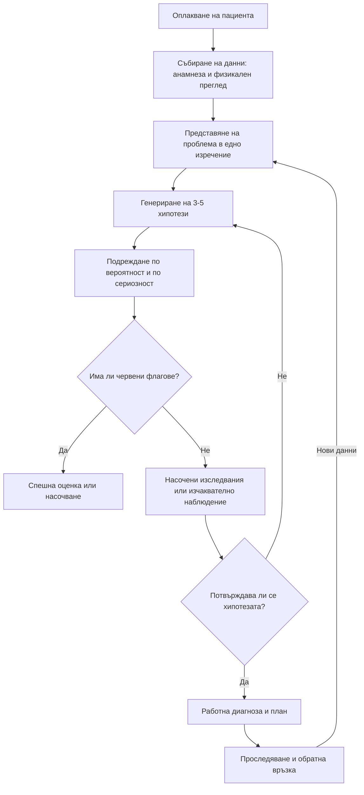

# Глава 1. Клинично мислене и диагностичен процес

> **Част I. Общи принципи на диференциалната диагноза**

## Цели на главата

След като усвои тази глава, читателят трябва да може:

- да дефинира диференциалната диагноза и нивата на диагностично заключение;
- да опише основните модели на клинично мислене и кога всеки от тях е подходящ;
- да тълкува чувствителност, специфичност, предсказващи стойности и отношения на правдоподобие и да прилага теоремата на Bayes в ежедневната практика;
- да съставя систематично диференциална диагноза чрез анатомичен, патофизиологичен и мнемоничен подход;
- да прилага модела на безопасната диагностична стратегия;
- да разпознава когнитивните пристрастия, които водят до диагностични грешки, и да използва стратегии за ограничаването им.

## Ключови моменти

- Диференциалната диагноза е динамичен процес. Формулирайте 3–5 хипотези и ги подредете едновременно по вероятност и по сериозност.
- Всеки резултат се тълкува спрямо претестовата вероятност. Отрицателният D-димер изключва белодробна тромбемболия само при ниска клинична вероятност *(SORT A [10])*.
- Отношенията на правдоподобие не зависят от честотата на заболяването. Те позволяват да се изчисли следтестовата вероятност по формулата „шанс × LR“ [3].
- Прилагайте петте въпроса на безопасната диагностична стратегия при всяко оплакване *(SORT C [5])*.
- Повечето диагностични грешки са когнитивни: преждевременно затваряне, закотвяне, диагностично засенчване. Диагностичната пауза, изричната диференциална диагноза и проследяването ги ограничават *(SORT C [1, 8])*.
- Изчаквателното наблюдение е допустимо само при липса на червени флагове, с ясни указания при влошаване и определен срок за повторна оценка *(SORT C)*.

---

## 1. Същност на диференциалната диагноза

Терминът идва от латинското *differentia*, „различие“. Диференциалната диагноза е мисловният процес, чрез който лекарят разграничава заболяванията със сходни прояви. Целта е да се стигне до най-вероятното обяснение на клиничната картина и същевременно да се изключат опасните алтернативи. Диференциалната диагноза не е статичен списък. Тя е динамичен процес: с постъпването на нова информация хипотезите се подреждат, преподреждат и отхвърлят.

### 1.1. Нива на диагностичното заключение

*Таблица 1.1. Нива на диагностичното заключение.*

| Ниво | Пример |
|---|---|
| Симптом или признак | Задух |
| Синдром | Синдром на левостранна сърдечна недостатъчност |
| Нозологична единица | Исхемична кардиомиопатия |
| Етиология и патогенеза | Преживян преден миокарден инфаркт с аневризма на лявата камера |
| Функционална оценка и тежест | Функционален клас III по NYHA, фракция на изтласкване 30% |
| Индивидуален контекст | Самотно живеещ възрастен човек с когнитивен дефицит и затруднен достъп до лечение |

Не всеки случай може или трябва да стигне до най-горното ниво още при първото посещение. В общата практика често е достатъчно, а и правилно, да се формулира синдромна или **работна диагноза**. Условията са да са изключени спешните състояния и да е планирано проследяване.

### 1.2. Видове диагноза според начина на поставяне

- **Диагноза чрез разпознаване.** Картината е характерна, например херпес зостер с везикулозен обрив в един дерматом.
- Диагноза чрез изключване (*per exclusionem*). Поставя се, след като другите възможности са отхвърлени. Пример е синдромът на раздразненото черво при липса на алармиращи белези. Съвременният подход изисква и в тези случаи да се търсят позитивни диагностични критерии, а не само изключване.
- **Диагноза по ефекта от лечението** (*ex juvantibus*). Пример е бързото повлияване на ревматичната полимиалгия от ниски дози глюкокортикоиди. Методът е полезен, но рисков. Много състояния временно се подобряват при кортикостероиди, включително лимфомите и някои инфекции.
- **Диагноза чрез времето** (*ex tempore*). Естественият ход на заболяването изяснява диагнозата. Така например обривът, който се появява след спадане на температурата при внезапния екзантем, потвърждава диагнозата.

---

## 2. Модели на клинично мислене

### 2.1. Разпознаване на модел

Опитният клиницист често разпознава картината мигновено, понякога още с влизането на пациента. Такива са жълтеникаво-бледата кожа при пернициозна анемия, походката при паркинсонизъм и дишането на Kussmaul при кетоацидоза. Тази бърза, интуитивна форма на мислене се опира на натрупани в паметта **сценарии на заболяванията** (*illness scripts*). Всеки сценарий има три елемента:

1. **Предразполагащи условия:** възраст, пол, рискови фактори, експозиции.
2. **Патофизиологичен механизъм.**
3. **Последици:** симптоми, признаци, лабораторни и образни находки, типично протичане.

> **Пример: сценарий на белодробна тромбемболия.**
> *Предразполагащи условия:* имобилизация, скорошна операция, злокачествено заболяване, прием на естрогени, бременност, прекарана венозна тромбоза.
> *Механизъм:* тромб от дълбоките вени емболизира белодробната артерия. Настъпват нарушение на съотношението вентилация/перфузия и остро обременяване на дясната камера.
> *Последици:* внезапен задух, плеврална болка, тахикардия, хипоксемия, понякога хемоптиза или синкоп.

### 2.2. Хипотетико-дедуктивен метод

Още в първите минути на разговора лекарят формулира няколко хипотези, обикновено от три до пет. След това събира данни, които ги потвърждават или отхвърлят. Това е аналитичното, съзнателно мислене. То е по-бавно, но при нетипична картина греши по-рядко.

### 2.3. Алгоритмичен подход

Алгоритмите (блок-схемите) стандартизират решенията при добре дефинирани проблеми. Примери са хипонатриемията, анемията, разделена според средния обем на еритроцитите, и подозрението за белодробна тромбемболия. Алгоритмите помагат на начинаещите и в спешни ситуации. Недостатъкът им е, че не отчитат индивидуалния контекст и съпътстващите заболявания.

### 2.4. Изчерпателен метод

Изчерпателният метод означава пълна анамнеза, пълен физикален преглед и всички възможни изследвания „за всеки случай“. По него се обучават студентите. В практиката обаче той е неефективен и скъп, а понякога и вреден, защото поражда случайни находки и каскади от ненужни изследвания.

### 2.5. Теория на двата процеса

Съвременната когнитивна психология (Kahneman, Croskerry) описва две системи на мислене [1, 2]:

*Таблица 1.2. Теория на двата процеса.*

| Характеристика | Система 1 (интуитивна) | Система 2 (аналитична) |
|---|---|---|
| Скорост | Бърза, почти мигновена | Бавна, изисква време |
| Усилие | Минимално | Значително; изчерпва се при умора |
| Основа | Разпознаване на модел, опит | Логика, вероятности, правила |
| Надеждност | Висока при типичен случай и опитен лекар | По-висока при нетипичен или рядък случай |
| Типични грешки | Пристрастия, преждевременно затваряне | Бавност, „парализа от анализ“ |

Експертът не избира едната система за сметка на другата. Той работи предимно със система 1, но умее да я спре навреме и да включи система 2, когато нещо не пасва. Сигнали за това са:

- необясним признак или резултат;
- липса на очаквания отговор от лечението;
- повторно посещение със същото оплакване;
- силна тревога у пациента или у самия лекар.

### 2.6. Формулиране на проблема и семантични квалификатори

Ключова стъпка е преобразуването на думите на пациента в кратко медицинско обобщение – формулиране на проблема (*problem representation*). При него се използват двойки противоположни понятия, наречени семантични квалификатори:

- остро или хронично; внезапно или постепенно;
- постоянно или интермитентно; прогресиращо или стационарно;
- локализирано или дифузно; едностранно или двустранно;
- симетрично или асиметрично; проксимално или дистално;
- болезнено или неболезнено; при натоварване или в покой.

> **Пример.** Пациентът казва: *„Докторе, от сутринта нещо ме цепи в гърдите и отива към гърба. Никога не съм имал такова нещо, а лявата ми ръка изстина.“*
> Формулировката на проблема е: *„Мъж на 58 години, пушач, с артериална хипертония, с внезапно започнала, постоянна, раздираща болка в гърдите с ирадиация към гърба и асиметрия на пулса на горните крайници.“*
> Така формулиран, проблемът насочва директно към **дисекация на аортата**.

---

## 3. Вероятностно мислене

### 3.1. Претестова вероятност

Никой симптом и никое изследване не се тълкуват във вакуум. **Претестовата вероятност** е вероятността за дадено заболяване преди изследването. Тя зависи от:

- честотата на заболяването в съответната популация и в съответната среда: обща практика, спешно отделение или специализирана клиника;
- възрастта, пола, рисковите фактори и експозициите;
- особеностите на клиничната картина.

Средата е от голямо значение. Когато пациент се оплаква от болка в гърдите в кабинета на общопрактикуващия лекар, причината е остър коронарен синдром само в няколко процента от случаите. В спешното отделение този дял е многократно по-висок. Затова клиничните правила и изследванията, валидирани в болнична среда, дават различни резултати в извънболничната практика. Това явление се нарича **спектрално пристрастие**.

### 3.2. Характеристики на диагностичните изследвания

*Таблица 1.3. Характеристики на диагностичните изследвания.*

|  | Болни | Здрави |
|---|---|---|
| **Положителен тест** | a (истински положителни) | b (фалшиво положителни) |
| **Отрицателен тест** | c (фалшиво отрицателни) | d (истински отрицателни) |

- **Чувствителност** = a / (a + c) – делът на болните, при които тестът е положителен.
- **Специфичност** = d / (b + d) – делът на здравите, при които тестът е отрицателен.
- **Положителна предсказваща стойност (ППС)** = a / (a + b) – вероятността за заболяване при положителен тест.
- **Отрицателна предсказваща стойност (ОПС)** = d / (c + d) – вероятността за липса на заболяване при отрицателен тест.

Две мнемонични правила от англоезичната литература са полезни в ежедневната работа:

- **SnNout.** Когато изследване с висока чувствителност (Sn) е отрицателно (N), то изключва заболяването (out). Пример: отрицателен D-димер при ниска клинична вероятност за белодробна тромбемболия.
- **SpPin.** Когато изследване с висока специфичност (Sp) е положително (P), то потвърждава заболяването (in). Пример: високи титри на анти-CCP антителата при полиартрит.

За разлика от чувствителността и специфичността, предсказващите стойности **зависят от честотата на заболяването**. Да вземем тест с чувствителност и специфичност по 90%. При честота на заболяването 50% положителната му предсказваща стойност е 90%. При честота 1% тя пада до около 8%, т.е. 11 от всеки 12 положителни резултата са фалшиво положителни. Това е математическото основание срещу безразборното изследване на хора с ниска вероятност за заболяване.

### 3.3. Отношения на правдоподобие

**Отношението на правдоподобие** (*likelihood ratio*, LR) показва колко пъти даден резултат е по-вероятен при болен, отколкото при здрав човек:

- **LR+** = чувствителност / (1 − специфичност)
- **LR−** = (1 − чувствителност) / специфичност

LR има две предимства. Не зависи от честотата на заболяването и може да се изчисли не само за изследвания, но и за отделни симптоми и признаци.

*Таблица 1.4. Вероятностно мислене: отношения на правдоподобие.*

| LR | Сила на промяната | Приблизителна промяна на вероятността* |
|---|---|---|
| ≥ 10 | голяма, често решаваща | около +45 процентни пункта |
| 5 | умерена | около +30 |
| 2 | малка | около +15 |
| 1 | няма промяна | 0 |
| 0,5 | малка | около −15 |
| 0,2 | умерена | около −30 |
| ≤ 0,1 | голяма, често решаваща | около −45 |

\* Приближение по McGee [3]. Валидно е при претестова вероятност между 10% и 90%.

### 3.4. Теоремата на Bayes в практиката

Следтестовата вероятност се изчислява най-лесно чрез шансовете (*odds*):

> **Следтестов шанс = претестов шанс × LR**, където шанс = вероятност / (1 − вероятност).

> **Пример.** D-димерът при белодробна тромбемболия (БТЕ) има чувствителност около 95% и специфичност около 40%. Следователно LR− ≈ 0,125.
> - При ниска клинична вероятност (10%) претестовият шанс е 0,11. След отрицателен D-димер той става 0,11 × 0,125 ≈ 0,014. Следтестовата вероятност е ≈ 1,4%, т.е. БТЕ практически е изключена.
> - При висока клинична вероятност (60%) претестовият шанс е 1,5. След отрицателен D-димер той става 1,5 × 0,125 ≈ 0,19. Следтестовата вероятност е ≈ 16%. Този остатъчен риск е недопустимо висок. При такива пациенти D-димерът не е подходящ и директно се назначава образно изследване.

Изводът е важен: **един и същ отрицателен резултат има различно значение при различните пациенти.**

### 3.5. Прагове за изследване и за лечение

Pauker и Kassirer въвеждат две гранични стойности на вероятността [4]:

- **Праг за изследване.** Под него заболяването е толкова малко вероятно, че изследването не е оправдано: рискът и цената му надвишават ползата.
- **Праг за лечение.** Над него вероятността е толкова висока, че се лекува без допълнително потвърждение.

Изследванията имат смисъл само в зоната между двата прага. Прагът за лечение е нисък, когато лечението е безопасно, а пропускането на заболяването е опасно. Типичен пример е подозрението за бактериален менингит, при което антибиотикът се прилага незабавно, преди потвърждението. Прагът е висок, когато лечението крие сериозен риск, какъвто е случаят с химиотерапията.

---

## 4. Систематично формулиране на хипотези

### 4.1. Анатомичен подход

При локализиран симптом си представяме **всички структури** в съответната област, от кожата до най-дълбоките органи. Включваме и органите, чиято болка може да се отразява в областта. При болка в гърдите тези структури са:

- кожа и периферни нерви (херпес зостер);
- мускули, ребра, ребрени хрущяли и гръбначен стълб;
- плевра, бял дроб, перикард, миокард и аорта;
- хранопровод и медиастинум;
- поддиафрагмални органи (жлъчен мехур, стомах, панкреас).

### 4.2. Патофизиологичен подход

Питаме по какъв механизъм може да възникне даденият симптом. Отоците например се появяват при четири механизма: повишено хидростатично налягане, понижено онкотично налягане, повишена капилярна пропускливост или нарушен лимфен отток. Всеки механизъм насочва към своя група заболявания.

### 4.3. Мнемоника VINDICATE

Мнемониката осигурява систематичен преглед на етиологичните категории. Така намалява рискът да бъде „забравена“ цяла група причини.

*Таблица 1.5. Систематично формулиране на хипотези: мнемоника VINDICATE.*

| Буква | Категория | Примери при остро объркване |
|---|---|---|
| **V** | Съдови (*vascular*) | Мозъчен инсулт, субдурален хематом |
| **I** | Инфекциозни и възпалителни | Пневмония, инфекция на пикочните пътища, менингоенцефалит |
| **N** | Неопластични | Мозъчни метастази, хиперкалциемия при злокачествено заболяване |
| **D** | Дегенеративни и дефицитни | Деменция, тиаминов дефицит (енцефалопатия на Wernicke) |
| **I** | Ятрогенни, интоксикации, идиопатични | Бензодиазепини, антихолинергични лекарства, алкохол |
| **C** | Вродени (*congenital*) | Вродени метаболитни дефекти (при възрастни рядко) |
| **A** | Автоимунни и алергични | Автоимунен енцефалит, лупусен церебрит |
| **T** | Травматични | Мозъчна контузия |
| **E** | Ендокринни и метаболитни | Хипогликемия, хипонатриемия, уремия, хипотиреоидизъм |

Към тези категории се добавят **психогенните** причини. Те обаче се приемат едва след разумно изключване на органичните.

### 4.4. Модел на безопасната диагностична стратегия

Моделът на австралийския професор по обща медицина John Murtagh е утвърден стандарт в обучението [5]. Той се прилага при всяко оплакване чрез пет въпроса:

*Таблица 1.6. Модел на безопасната диагностична стратегия.*

| № | Въпрос | Смисъл |
|---|---|---|
| 1 | Каква е вероятната диагноза? | Кое е най-честото обяснение за тази възрастова група и тази среда? |
| 2 | Кое сериозно заболяване не бива да бъде пропуснато? | Животозастрашаващите и лечимите състояния: съдови катастрофи, тежки инфекции, злокачествени заболявания |
| 3 | Кои са честите капани? | Състояния, които често се пропускат, защото протичат нетипично или се „забравят“ |
| 4 | Може ли това да е някое от маскиращите заболявания? | Заболявания с неспецифични симптоми от много системи |
| 5 | Опитва ли се пациентът да ми каже нещо друго? | Депресия, тревожност, семейни проблеми, насилие, страх от конкретно заболяване |

Сериозните заболявания, които не бива да се пропускат, могат да се запомнят в три групи:

- **съдови катастрофи:** миокарден инфаркт, дисекация на аортата, белодробна тромбемболия, субарахноидален кръвоизлив, руптура на аневризма, мезентериална исхемия;
- **тежки инфекции:** сепсис, менингит, епиглотит, инфекциозен ендокардит, некротизиращ фасциит;
- **злокачествени заболявания.**

### 4.5. Маскиращите заболявания

Някои заболявания често остават неразпознати, защото се проявяват с неспецифични симптоми от различни системи. Murtagh описва седем основни „маскиращи“ състояния:

*Таблица 1.7. Систематично формулиране на хипотези: маскиращите заболявания.*

| Маскиращо заболяване | Прояви, които могат да заблудят |
|---|---|
| **Депресия** | Умора, безсъние, главоболие, болки в гърба, коремни болки, загуба на тегло |
| **Захарен диабет** | Умора, загуба на тегло, сърбеж, повтарящи се инфекции, замъглено зрение, невропатия |
| **Лекарства** (включително алкохол и наркотици) | Практически всеки симптом: объркване, падания, отоци, кашлица, обрив, диспепсия |
| **Анемия** | Умора, задух, сърцебиене, стенокардия, световъртеж |
| **Заболявания на щитовидната жлеза и други ендокринни нарушения** | Умора, промени в теглото, тревожност, депресия, аритмии, миопатия, запек или диария |
| **Гръбначна дисфункция** | Болка, отразена към гръдния кош, корема, таза, главата и крайниците |
| **Инфекция на пикочните пътища** | Объркване и падания при възрастни, треска без видимо огнище при деца, коремна болка |

Към тях се добавят **вторичните маскиращи заболявания**:

- хронично бъбречно заболяване;
- злокачествени заболявания, особено лимфомите и карциномът на панкреаса;
- HIV инфекция;
- „трудните“ бактериални инфекции: инфекциозен ендокардит, туберкулоза, бруцелоза;
- вирусни и протозойни инфекции: инфекциозна мононуклеоза, вирусни хепатити, малария;
- неврологични заболявания: множествена склероза, болест на Parkinson, хроничен субдурален хематом;
- системни заболявания на съединителната тъкан и васкулити.

### 4.6. Ключов белег

Не всички данни имат еднаква тежест. Ефективният клиницист търси **ключовия белег**, т.е. находката, която най-силно стеснява диференциалната диагноза. Ключов белег може да бъде внезапното начало на главоболието, неизбледняващият при натиск обрив при фебрилно дете, ниският брой ретикулоцити при анемия или ниският осмолалитет на урината при хипонатриемия. Около него се изгражда целият по-нататъшен диагностичен план.

---

## 5. Диагностичната грешка

### 5.1. Определение и честота

Диагностичната грешка е неуспехът (а) навреме да се установи точно обяснение на здравния проблем на пациента или (б) това обяснение да бъде съобщено на пациента. Така я определят Националните академии на САЩ (2015) [6]. Понятието обхваща пропуснатата, погрешната и забавената диагноза. По данни от проучвания всяка година около 5% от възрастните, лекувани в извънболничната помощ, стават жертва на диагностична грешка. Около половината от тези грешки могат да причинят сериозна вреда [7].

### 5.2. Причини

Причините са два вида:

- **системни:** организация на работата, комуникация, проследяване на резултатите, натоварване;
- **когнитивни.**

Анализите на диагностичните грешки показват, че недостигът на знания рядко е основната причина. Много по-често грешката е в **синтеза** на наличната информация [1, 8].

### 5.3. Когнитивни пристрастия

*Таблица 1.8. Диагностичната грешка: когнитивни пристрастия.*

| Пристрастие | Същност | Пример |
|---|---|---|
| **Преждевременно затваряне** | Търсенето спира веднага щом се намери правдоподобна диагноза | Повръщането е прието за гастроентерит, а се дължи на диабетна кетоацидоза |
| **Закотвяне** | Първото впечатление не се коригира въпреки новите данни | Болката в гърдите остава „мускулна“ дори след появата на изпотяване и задух |
| **Потвърждаващо пристрастие** | Търсят се само данни в подкрепа на хипотезата | Нормален тропонин един час след началото на болката е приет за изключване на инфаркт |
| **Пристрастие на достъпността** | Надценява се вероятността на наскоро видяно или запомнящо се заболяване | След случай на менингит всяко главоболие изглежда подозрително |
| **Пренебрегване на базовата честота** | Не се отчита колко често се среща заболяването | Изследване за феохромоцитом при всеки пациент с тревожност |
| **Рамкиране и „диагностична инерция“** | Етикетът, поставен от друг, се приема без проверка | „Известен алкохолик, пиян е“ при пациент със субдурален хематом |
| **Диагностично засенчване** (психиатрично пристрастие) | Соматичните симптоми се приписват на психично заболяване | Учестеното дишане при хипоксемия е прието за паническа атака |
| **Пристрастие на представителността** | Нетипичните прояви не се разпознават | Инфаркт при жена или при възрастен диабетик без болка в гърдите |
| **Преждевременно удовлетворение от търсенето** | Търсенето спира след първата открита находка | Пропусната втора фрактура или второ отровно вещество |
| **Емоционално пристрастие** | Отношението към пациента влияе на решенията | Непълен преглед на „честия посетител“ |
| **Свръхсамоувереност** | Решения въз основа на непълна информация | Пропуснат физикален преглед при „ясна“ анамнеза |

### 5.4. Стратегии за намаляване на грешките

1. **Диагностична пауза.** Преди окончателното решение лекарят си задава три въпроса: *„Какво друго може да бъде?“*, *„Какво не пасва?“* и *„Кое е най-лошото, което може да бъде?“*.
2. **Изрично формулиране на диференциалната диагноза.** Документира се не само работната диагноза, но и основните алтернативи.
3. **Внимание към несъответствията.** Находката, която не се вписва в хипотезата, често е най-ценната.
4. **Контролни списъци** при високорискови оплаквания: болка в гърдите, главоболие, болка в корема, треска при кърмаче.
5. **Проследяване и обратна връзка.** Това включва уговорено повторно посещение, проверка на резултатите и информация за окончателната диагноза.
6. **Указания при влошаване.** Пациентът трябва да знае кои симптоми изискват повторна консултация и колко спешно (вж. глава 3).
7. **Самонаблюдение.** Гладът, гневът, закъснението и умората влошават решенията. В англоезичната литература те се запомнят с мнемониката HALT: *hungry, angry, late, tired*.
8. **Второ мнение.** То е особено нужно при несигурност и при пациент, който се връща отново и отново със същото оплакване.

---

## 6. Бръсначът на Occam и диктумът на Hickam

**Принципът на Occam** (диагностична пестеливост) препоръчва всички находки да се обяснят с едно заболяване, когато това е възможно. Той работи добре при млади пациенти с остро заболяване. Ако млада жена има треска, полиартрит, обрив и протеинурия, това най-вероятно е една системна болест, например системен лупус еритематодес, а не четири отделни заболявания.

**Диктумът на Hickam** гласи, че *„пациентът може да има толкова болести, колкото пожелае“*. При възрастните хора и при многоболестност съчетанието на две или повече независими заболявания е по-скоро правило. Така анемията на възрастен човек с хронично бъбречно заболяване може да се дължи едновременно на бъбречната болест и на кървящ карцином на дебелото черво. Добрият клиницист прилага двата принципа според контекста.

---

## 7. Времето като диагностичен инструмент

В общата практика много симптоми отзвучават спонтанно, преди да бъдат обяснени. **Изчаквателното наблюдение** е пълноценна диагностична стратегия, а не бездействие. То е оправдано при следните условия:

- няма червени флагове;
- най-вероятната причина е доброкачествена и самоограничаваща се;
- пациентът разбира плана и може да потърси помощ при влошаване;
- определен е срок за повторна оценка.

Изчаквателното наблюдение е неприемливо, когато забавянето влошава прогнозата. Такива състояния са например остър коронарен синдром, сепсис, менингит, торзия на тестиса и извънматочна бременност.

---

## 8. Как се съобщава диагностичната несигурност

На пациента трябва да се обясни какво е най-вероятно, какво е изключено, какво все още не е изключено и какво предстои. Споделеното вземане на решения е особено важно, когато ползата от допълнително изследване е несигурна. В документацията се отбелязват работната диагноза, основните алтернативи, планът и указанията, дадени на пациента.

---

## 9. Схема на диагностичния процес

*Фигура 1.1. Схема на диагностичния процес. Схема на авторите въз основа на източниците, цитирани в главата.*

Текстово описание на фигура 1.1

1. Оплакване на пациента. Следва: към т. 2.
2. Събиране на данни: анамнеза и физикален преглед. Следва: към т. 3.
3. Представяне на проблема в едно изречение. Следва: към т. 4.
4. Генериране на 3-5 хипотези. Следва: към т. 5.
5. Подреждане по вероятност и по сериозност. Следва: към т. 6.
6. **Въпрос:** Има ли червени флагове? Да – към т. 7; Не – към т. 8.
7. Спешна оценка или насочване.
8. Насочени изследвания или изчаквателно наблюдение. Следва: към т. 9.
9. **Въпрос:** Потвърждава ли се хипотезата? Да – към т. 10; Не – към т. 4.
10. Работна диагноза и план. Следва: към т. 11.
11. Проследяване и обратна връзка. Следва: Нови данни – към т. 3.

---

## 10. Клинични перли

- В класически проучвания анамнезата сама по себе си насочва към окончателната диагноза в около три четвърти от случаите [9]. Физикалният преглед и изследванията добавят относително по-малко.
- „Когато чуеш тропот на копита, мисли за коне, а не за зебри.“ В определени ситуации обаче, като пътуване, специфична експозиция или имуносупресия, зебрите съществуват.
- При висока претестова вероятност нормалният резултат не изключва заболяването.
- Пациентът, който се връща със същото оплакване, е червен флаг за диагностична грешка.
- Необяснимите симптоми от няколко системи насочват към маскиращо заболяване: лекарства, депресия, диабет, заболяване на щитовидната жлеза, анемия или злокачествено заболяване.
- Тревогата на лекаря („нещо тук не ми харесва“) също е клинична информация. Тя е повод да се забави решението и да се преоцени случаят.

---

## 11. Клиничен случай

**Етап 1 – клинична картина.** Жена на 34 години идва в кабинета поради „пристъп на паника“. Има диагностицирано тревожно разстройство. От два дни изпитва задух, сърцебиене и пробождане в дясната половина на гръдния кош при дълбоко вдишване. Приема комбиниран орален контрацептив. Преди десет дни е летяла 11 часа със самолет.

> **Въпрос 1.** Кои когнитивни пристрастия застрашават диагнозата? Какви хипотези бихте формулирали още сега?

**Етап 2 – преглед.** Пулс 112/min, дихателна честота 22/min, SpO₂ 94% при дишане на стаен въздух, температура 37,4 °C. Белодробният статус е нормален. Дясната подбедрица е оточна, с 2 cm по-голяма обиколка от лявата, и е болезнена по хода на дълбоките вени.

> **Въпрос 2.** Каква е клиничната вероятност за белодробна тромбемболия?

> **Въпрос 3.** Какъв трябва да бъде следващият ход: D-димер или образно изследване?

Обсъждане и отговори

**Отговор 1.** Етикетът „тревожно разстройство“ създава риск от диагностично засенчване и рамкиране. Има и опасност от закотвяне към обяснението, което дава самата пациентка. Още от анамнезата хипотезите трябва да включват белодробна тромбемболия (контрацептив, дълъг полет, плеврална болка), пневмония, пневмоторакс и едва след тях паническа атака. Няколко данни не пасват на паническа атака:

- плевралната болка;
- продължителността от два дни;
- хипоксемията и субфебрилитетът (етап 2);
- едностранният оток на подбедрицата (етап 2).

**Отговор 2.** По модифицирания точков сбор на Wells резултатът е 7,5 точки [10]: клинични белези на тромбоза на дълбоките вени (3), алтернативна диагноза по-малко вероятна от БТЕ (3) и пулс над 100/min (1,5). Над 4 точки БТЕ се смята за „вероятна“.

**Отговор 3.** При такава вероятност отрицателният D-димер не би изключил БТЕ. Пациентката се насочва спешно за КТ-ангиография на белодробните артерии. Изследването потвърждава сегментна белодробна тромбемболия вдясно.

**Поука.** Психичното заболяване не предпазва от соматично. Тахикардията и хипоксемията са обективни белези. Те не могат да бъдат обяснени с тревожност, преди да са изключени органичните причини.

---

## Обобщение

- Диференциалната диагноза минава през няколко нива: симптом, синдром, нозологична единица, етиология, тежест и индивидуален контекст. В общата практика често е достатъчна добре обоснована работна диагноза с план за проследяване.
- Опитният лекар съчетава разпознаването на модел (система 1) с аналитичното мислене (система 2). Той превключва към аналитично мислене, когато нещо не пасва.
- Чувствителността, специфичността и отношенията на правдоподобие описват теста. Предсказващите стойности зависят и от честотата на заболяването. Следтестовата вероятност се изчислява чрез шансовете.
- Хипотезите се формулират систематично: анатомично, патофизиологично и по мнемониката VINDICATE. Безопасната диагностична стратегия гарантира, че сериозните и маскиращите заболявания не са пропуснати.
- Когнитивните пристрастия се ограничават чрез диагностична пауза, изрична диференциална диагноза, внимание към несъответствията, указания при влошаване и проследяване.

## Самопроверка

### Въпроси с един верен отговор

**1.** *(основно ниво)* Тест има чувствителност 90% и специфичност 90%. Прилага се в популация, в която честотата на заболяването е 1%. Колко е приблизително положителната предсказваща стойност?

- **А.** 90%
- **Б.** 50%
- **В.** 8%
- **Г.** 1%
- **Д.** 99%

Отговор и обосновка

**Верен отговор: В.** От 1000 души 10 са болни: 9 истински положителни. От 990 здрави 99 са фалшиво положителни. ППС = 9 / (9 + 99) ≈ 8%. Отговор А би бил верен само при честота около 50%. Б и Д не следват от изчислението. Г е честотата на заболяването, а не ППС. Изводът е, че изследването на хора с ниска вероятност води предимно до фалшиво положителни резултати.

**2.** *(основно ниво)* Коя от следните характеристики на изследването НЕ зависи от честотата на заболяването в изследваната популация?

- **А.** Положителната предсказваща стойност
- **Б.** Отрицателната предсказваща стойност
- **В.** Положителното отношение на правдоподобие
- **Г.** Следтестовата вероятност
- **Д.** Делът на фалшиво положителните сред всички положителни резултати

Отговор и обосновка

**Верен отговор: В.** LR+ = чувствителност / (1 − специфичност) и се изчислява само от характеристиките на теста. ППС, ОПС и следтестовата вероятност зависят от претестовата вероятност, т.е. от честотата. Делът на фалшиво положителните сред положителните е 1 − ППС и също зависи от честотата.

**3.** *(напреднало ниво)* Претестовата вероятност за заболяване е 20%. Резултатът от изследването има LR+ = 4. Каква е следтестовата вероятност?

- **А.** 24%
- **Б.** 50%
- **В.** 80%
- **Г.** 84%
- **Д.** 96%

Отговор и обосновка

**Верен отговор: Б.** Претестовият шанс е 0,20 / 0,80 = 0,25. Следтестовият шанс е 0,25 × 4 = 1,0. Вероятността е 1,0 / (1 + 1,0) = 50%. Отговор В е типична грешка от умножаването на вероятността, а не на шанса (20% × 4). А, Г и Д не следват от изчислението.

**4.** *(основно ниво)* Жена на 28 години с паническо разстройство идва с „поредния пристъп“: задух и сърцебиене. SpO₂ е 91%. Лекарят записва „паническа атака“ и я изпраща у дома. Кое когнитивно пристрастие е най-вероятно?

- **А.** Пристрастие на достъпността
- **Б.** Диагностично засенчване
- **В.** Пренебрегване на базовата честота
- **Г.** Преждевременно удовлетворение от търсенето
- **Д.** Пристрастие на представителността

Отговор и обосновка

**Верен отговор: Б.** Соматичните симптоми и обективната находка (хипоксемия) са приписани на известното психично заболяване. Това е диагностично засенчване. А е надценяване на наскоро видяно заболяване. В е игнориране на честотата на заболяването. Г е спиране на търсенето след първата открита находка. Д е неразпознаване на нетипичните прояви.

**5.** *(напреднало ниво)* В кой от следните случаи изчаквателното наблюдение с указания при влошаване е най-подходящо?

- **А.** Мъж на 58 години със 40-минутна стягаща болка в гърдите преди 2 часа и нормална ЕКГ
- **Б.** Кърмаче на 6 седмици с температура 38,3 °C, което се храни добре
- **В.** Мъж на 30 години с болка в кръста от 3 дни след вдигане на тежест, без червени флагове, с уговорен контролен преглед
- **Г.** Жена на 26 години със закъсняла менструация и болка в долната половина на корема
- **Д.** Момче на 14 години с внезапна болка в скротума от 2 часа

Отговор и обосновка

**Верен отговор: В.** Изчаквателното наблюдение е допустимо само без червени флагове, при доброкачествена и самоограничаваща се вероятна причина, с указания при влошаване и срок за повторна оценка. Вариант В отговаря на тези условия. А е възможен остър коронарен синдром: нормалният ЕКГ не го изключва. Б е кърмаче под 3 месеца с треска, което се насочва спешно. Г е възможна извънматочна бременност. Д е възможна торзия на тестиса. При А, Б, Г и Д забавянето влошава прогнозата.

### Задача

Жена на 45 години е с умерена клинична вероятност за белодробна тромбемболия: претестова вероятност 40%. D-димерът е с чувствителност 95% и специфичност 40%. Резултатът е отрицателен. Изчислете следтестовата вероятност и решете дали е достатъчна за изключване на БТЕ.

Решение

LR− = (1 − 0,95) / 0,40 = 0,125. Претестовият шанс е 0,40 / 0,60 ≈ 0,67. Следтестовият шанс е 0,67 × 0,125 ≈ 0,083. Следтестовата вероятност е 0,083 / 1,083 ≈ 7,7%. Остатъчен риск около 8% е неприемливо висок за животозастрашаващо заболяване. БТЕ не е изключена и е нужно образно изследване (КТ-ангиография). По правило D-димерът се използва за изключване само при ниска вероятност (Wells ≤ 4) [10].

### OSCE станция: Формулиране на проблема и диференциална диагноза

**Време:** 8 минути. **Ниво:** основно (студенти, специализанти).

**Задача за кандидата.** Получавате кратко описание на пациент: мъж на 58 години, пушач, с хипертония, с внезапна раздираща болка в гърдите с ирадиация към гърба от 1 час. Лявата му ръка е студена. Формулирайте проблема в едно изречение пред изпитващия. Изброете и подредете диференциалната диагноза. Посочете следващата стъпка. След това обяснете на пациента (актьор) какво предстои.

**Информация за симулирания пациент (за изпитващия).** Тревожен е и иска да знае „дали е инфаркт“. Ако кандидатът използва медицински жаргон, пита: „Какво значи това?“. Ако кандидатът не каже какво следва, пита: „А сега какво ще стане с мен?“.

*Таблица 1.9. OSCE станция „Формулиране на проблема и диференциална диагноза“ – критерии за оценяване.*

| Критерий | Точки |
|---|---|
| Формулира проблема със семантични квалификатори (внезапно, постоянно, раздираща, ирадиация, асиметрия на пулса) | 2 |
| Изброява поне 4 хипотези, включително дисекация на аортата, остър коронарен синдром и белодробна тромбемболия | 2 |
| Подрежда хипотезите едновременно по вероятност и по сериозност и посочва дисекацията като водеща | 2 |
| Посочва находките, които насочват към дисекация (ирадиация към гърба, асиметрия на пулса и налягането) | 1 |
| Определя следващата стъпка: спешно обаждане на 112 и транспорт до болница с възможност за КТ-ангиография; без тромболиза и антиагреганти до изключване на дисекация | 2 |
| Обяснява на пациента ясно, без жаргон, какво е най-вероятно и какво предстои | 1 |
| Признава несигурността, проверява разбирането и отговаря на въпроса за инфаркт честно | 1 |
| Проявява емпатия към тревогата на пациента | 1 |
| **Общо** | **12** |

**Праг за успешно изпълнение:** 8 от 12 точки, като критерият за следващата стъпка е задължителен.

## Литература

1. Croskerry P. The importance of cognitive errors in diagnosis and strategies to minimize them. Acad Med. 2003;78(8):775-80. doi:10.1097/00001888-200308000-00003. PMID: 12915363.
2. Kahneman D. Thinking, Fast and Slow. New York: Farrar, Straus and Giroux; 2011.
3. McGee S. Simplifying likelihood ratios. J Gen Intern Med. 2002;17(8):646-9. doi:10.1046/j.1525-1497.2002.10750.x. PMID: 12213147.
4. Pauker SG, Kassirer JP. The threshold approach to clinical decision making. N Engl J Med. 1980;302(20):1109-17. doi:10.1056/NEJM198005153022003. PMID: 7366635.
5. Murtagh J, Rosenblatt J, Coleman J, Murtagh C. Murtagh's General Practice. 8th ed. Sydney: McGraw Hill Australia; 2021.
6. National Academies of Sciences, Engineering, and Medicine. Improving Diagnosis in Health Care. Washington, DC: The National Academies Press; 2015. doi:10.17226/21794
7. Singh H, Meyer AN, Thomas EJ. The frequency of diagnostic errors in outpatient care: estimations from three large observational studies involving US adult populations. BMJ Qual Saf. 2014;23(9):727-31. doi:10.1136/bmjqs-2013-002627. PMID: 24742777.
8. Graber ML, Franklin N, Gordon R. Diagnostic error in internal medicine. Arch Intern Med. 2005;165(13):1493-9. doi:10.1001/archinte.165.13.1493. PMID: 16009864.
9. Hampton JR, Harrison MJ, Mitchell JR, Prichard JS, Seymour C. Relative contributions of history-taking, physical examination, and laboratory investigation to diagnosis and management of medical outpatients. Br Med J. 1975;2(5969):486-9. doi:10.1136/bmj.2.5969.486. PMID: 1148666.
10. Wells PS, Anderson DR, Rodger M, Stiell I, Dreyer JF, Barnes D, et al. Excluding pulmonary embolism at the bedside without diagnostic imaging: management of patients with suspected pulmonary embolism presenting to the emergency department by using a simple clinical model and d-dimer. Ann Intern Med. 2001;135(2):98-107. doi:10.7326/0003-4819-135-2-200107170-00010. PMID: 11453709.

*Последна проверка на съдържанието: септември 2026 г. Следващ планиран преглед: септември 2027 г. (вж. „Политика за актуализация“ в README).*

<!-- навигация -->

---

[Съдържание](../README.md) · [Глава 2. Анамнеза, физикален преглед и рационално използване на изследванията →](02-anamneza-pregled-izsledvania.md)
