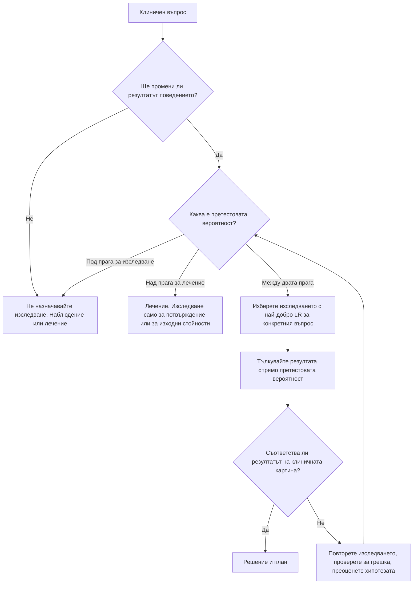

# Глава 2. Анамнеза, физикален преглед и рационално използване на изследванията

> **Част I. Общи принципи на диференциалната диагноза**

## Цели на главата

След като усвои тази глава, читателят трябва да може:

- да структурира консултацията така, че анамнезата да служи като инструмент за проверка на хипотези;
- да анализира систематично всеки симптом;
- да познава диагностичната стойност (отношенията на правдоподобие) на основните физикални признаци;
- да решава кога едно изследване е оправдано и как да тълкува резултата му;
- да разпознава преаналитичните грешки, случайните находки и рисковете от свръхдиагностика.

## Ключови моменти

- Анамнезата е най-мощният диагностичен инструмент: в класически проучвания тя насочва към диагнозата в около три четвърти от случаите [1]. Оставете пациента да разкаже, без да го прекъсвате, и попитайте за неговите представи, тревоги и очаквания.
- Жизнените показатели, включително дихателната честота и SpO₂, са задължителен минимум при всеки преглед. Дихателна честота над 20–22/min е тревожен белег.
- Тълкувайте физикалните признаци чрез отношенията на правдоподобие. Липсата едновременно на треска, вратна ригидност и промени в съзнанието практически изключва бактериален менингит *(SORT B [6])*.
- Преди всяко изследване се питайте дали резултатът ще промени поведението. Изненадващ, изолиран резултат първо се повтаря при правилно взета проба, освен ако изисква незабавни действия.
- Избягвайте свръхдиагностиката: без образно изследване при неспецифична болка в кръста под 6 седмици и без урокултура при безсимптомен възрастен пациент *(SORT A)*.
- Точковото изследване на CRP в кабинета намалява ненужното предписване на антибиотици при инфекции на дихателните пътища *(SORT A [11, 12])*.

---

## 1. Анамнезата: най-мощният диагностичен инструмент

В класическо проучване при амбулаторни пациенти анамнезата насочва към окончателната диагноза в около три четвърти от случаите, а прегледът и изследванията добавят по-малко [1].

### 1.1. Структура на консултацията

1. **Откриване.** Започва се с отворен въпрос, например *„Какво ви води при мен?“*, и пациентът се оставя да говори, без да бъде прекъсван. Проучванията показват, че лекарите прекъсват пациента средно след 11–20 секунди. Ако не бъдат прекъсвани, повечето пациенти приключват началния си разказ за по-малко от две минути [2, 3]. Тези минути носят най-много информация.
2. **Изясняване на основното оплакване** и на всички проблеми, с които пациентът е дошъл. Така се избягва оплакването „на вратата“: *„А, докторе, и още нещо…“*.
3. **Представите, тревогите и очакванията на пациента.** Какво мисли той, че му е? От какво се страхува? Какво очаква от посещението? Често зад главоболието стои страх от мозъчен тумор, а зад болката в гърдите страх от инфаркт, какъвто е имал близък човек.
4. **Насочени въпроси.** Чрез затворени въпроси се проверяват формулираните хипотези.
5. **Обобщение.** Лекарят преразказва чутото и проверява дали е разбрал правилно.

### 1.2. Анализ на симптома

За всеки симптом, и особено за болката, се използва систематична схема:

| Елемент | Въпрос | Диагностично значение |
|---|---|---|
| **Локализация** | Къде боли? Можете ли да посочите мястото с един пръст? | Точно локализираната болка е соматична или париетална. Дифузната, трудно локализирана болка е висцерална |
| **Начало** | Внезапно или постепенно? Какво правехте тогава? | Начало за секунди насочва към съдова катастрофа, руптура, перфорация, торзия или пневмоторакс |
| **Характер** | Притискаща, пробождаща, пареща, раздираща, пулсираща, коликообразна? | Притискащата болка е типична за исхемия, раздиращата за дисекация, коликообразната за обструкция на кухинен орган |
| **Ирадиация** | Накъде се разпространява? | Към лявата ръка или челюстта: миокардна исхемия. Към гърба: дисекация, панкреатит. Към слабините: бъбречна колика. Към рамото: дразнене на диафрагмата |
| **Придружаващи симптоми** | Какво друго усещате? | Изпотяване, гадене, задух, треска, загуба на тегло, неврологични симптоми |
| **Времево протичане** | Колко продължава? Повтаря ли се? Кога е най-силна? | Сутрешна скованост над 30–60 минути говори за възпалителен артрит. Нощната болка, която буди, насочва към тумор или инфекция |
| **Провокиращи и облекчаващи фактори** | Какво я усилва или облекчава? | Натоварване, хранене, положение на тялото, дишане, движение |
| **Тежест** | По скала от 0 до 10? Как влияе на съня и на дейностите? | Тежестта не корелира надеждно със сериозността. Промяната във времето е по-информативна |

### 1.3. Останалите компоненти на анамнезата

- **Минали заболявания, операции, хоспитализации.**
- **Лекарства.** Питаме за всички: предписаните, тези без рецепта, билките, хранителните добавки, „чуждите“ лекарства и последните промени в терапията. Проверяваме и дали пациентът изобщо ги приема. Правилото е: *всеки нов симптом при пациент, който приема лекарства, е нежелана лекарствена реакция, докато не се докаже противното* (вж. Приложение Г).
- **Алергии.** Истинската алергия трябва да се разграничи от непоносимостта и страничния ефект.
- **Фамилна анамнеза.** Интересуват ни заболяванията при роднините от първа степен и възрастта, на която са започнали. Особено важни са ранната исхемична болест на сърцето (при мъже под 55 години и при жени под 65 години), внезапната смърт преди 40-годишна възраст, фамилните ракови синдроми и наследствените заболявания.
- **Социална анамнеза:**
  - **тютюнопушене** в пакетогодини (брой кутии дневно × години на пушене);
  - **алкохол** в стандартни напитки. Една стандартна напитка съдържа около 10 g чист алкохол, колкото има в 250 ml бира, 100 ml вино или 30 ml ракия;
  - **наркотични вещества**;
  - **професия и експозиции:** азбест, силициев прах, органични прахове („бял дроб на фермера“), разтворители, тежки метали, шум;
  - **домашни и селскостопански животни:** птици (хиперсензитивен пневмонит, психитакоза), овце и кози (бруцелоза, Ку-треска), кучета (ехинококоза), котки (токсоплазмоза, болест от котешко одраскване), свине и дивеч (трихинелоза);
  - **храна:** непастьоризирано мляко и сирене (бруцелоза, листериоза), домашни консерви (ботулизъм), диворастящи гъби;
  - **ухапване от кърлеж:** марсилска треска, лаймска болест, Кримска-Конго хеморагична треска;
  - **пътувания:** къде, кога, ваксинации, профилактика на малария;
  - **сексуална анамнеза:** партньори, практики, предпазване, прекарани полово предавани инфекции, възможност за бременност;
  - **жилищни условия:** отопление на дърва или въглища (отравяне с въглероден оксид), влага и мухъл;
  - **функционално състояние и социална подкрепа.**
- **Преглед по системи.** Кратък, но систематичен. Целта му е да открие симптоми, за които пациентът не е споменал, защото не ги е свързал с проблема, например загуба на тегло, нощно изпотяване, промяна в дефекацията или обрив.

### 1.4. Чести грешки в анамнезата

- Внушаващи въпроси (*„Болката не се разпространява към ръката, нали?“*).
- Медицински жаргон, който пациентът не разбира.
- Пропуснат „скрит дневен ред“: истинската причина за посещението се споменава чак накрая.
- Езикова бариера. Трябва да се използва професионален преводач, а не децата на пациента.
- Пропусната **анамнеза от свидетели и близки**. Тя е задължителна при синкоп, гърчове, объркване, деменция, при деца и при пациенти, които не могат да комуникират.

---

## 2. Физикален преглед

### 2.1. Принципи

Прегледът трябва да бъде насочен от хипотезите, но винаги включва задължителен минимум:

- **Жизнени показатели:** пулс (честота и ритъм), артериално налягане, дихателна честота, температура, кислородна сатурация (SpO₂) и ниво на съзнание. При болка в гърдите налягането се измерва и на двете ръце. При нарушено съзнание се измерва капилярната кръвна захар. **Дихателната честота** е най-често пропусканият показател. В същото време тя е един от най-добрите предиктори за тежко заболяване: честота над 20–22/min е тревожен белег.
- **Общ оглед:** Изглежда ли пациентът болен? Какво е положението на тялото му? Пациентът с бъбречна колика е неспокоен и сменя положението си. Пациентът с перитонит лежи неподвижно. При тежка обструкция на дихателните пътища пациентът седи, наведен напред, и се подпира на ръцете си. При перикардит болката намалява при навеждане напред.
- **Кожа и лигавици:** бледост, жълтеница, цианоза, зачервяване, хиперпигментация, обрив, петехии, степен на хидратация.
- **Мирис на дъха:** плодов мирис при кетоза, уремичен мирис, чернодробен мирис (*foetor hepaticus*), алкохол.
- **Тегло, индекс на телесна маса, обиколка на талията** и тяхната динамика.

### 2.2. Диагностична стойност на физикалните признаци

Всеки признак има своя чувствителност и специфичност. Таблицата показва приблизителната диагностична стойност на някои от тях.

| Признак | Заболяване | LR+ | LR− |
|---|---|---|---|
| Разлика в пулса на двете ръце | Дисекация на аортата | ≈ 6 | — |
| Липса на внезапно начало на болката | Дисекация на аортата | — | ≈ 0,3 |
| Пулсираща формация в корема | Аневризма на коремната аорта ≥ 3 cm | ≈ 12 | ≈ 0,7 |
| Болка в десния долен квадрант | Апендицит | ≈ 8 | ≈ 0,2–0,3 |
| Миграция на болката от епигастриума към десния долен квадрант | Апендицит | ≈ 3 | ≈ 0,5 |
| Ригидност на коремната стена | Апендицит или перитонит | ≈ 4 | — |
| Симптом на Murphy | Остър холецистит | ≈ 2,8 | ≈ 0,5 |
| Вълна на течност | Асцит | ≈ 6 | ≈ 0,4 |
| Притъпяване в хълбоците | Асцит | ≈ 2 | ≈ 0,3 |
| Егофония | Пневмония | ≈ 4 | — |
| Тест на Lachman | Скъсване на предната кръстна връзка | > 10 | ≈ 0,1–0,2 |
| Тест с изправен крак (Lasègue) | Дискова херния с радикулопатия | ≈ 1,2 | ≈ 0,3 |
| Кръстосан тест на Lasègue | Дискова херния с радикулопатия | ≈ 2,5 | — |
| Липса на треска, вратна ригидност **и** промени в съзнанието | Бактериален менингит | — | ≈ 0 (чувствителност 99–100%) |

*Стойностите са приблизителни и са обобщени от серията „The Rational Clinical Examination“ (JAMA) и от ръководството на McGee по физикална диагностика [4–7]. Обхватът им варира между проучванията.*

От таблицата следват няколко важни извода:

- **Симптомите на Kernig и Brudzinski** имат чувствителност около 5% [8]. Липсата им не изключва менингит.
- **Симптомът на Homans** няма диагностична стойност при тромбоза на дълбоките вени.
- **Тестът с изправен крак** е чувствителен, но неспецифичен. Кръстосаният тест е обратното: по-малко чувствителен, но по-специфичен.

### 2.3. Възпроизводимост

Много физикални признаци имат ниско съгласие между отделните изследващи. Такива са например перкуторните находки, някои сърдечни шумове и неврологичните рефлекси. Изводите трябва да се правят от **съвкупността** от находки и от тяхната **динамика**, а не от единичен признак.

### 2.4. Пропуснатият преглед

Една от най-честите причини за диагностична грешка е прегледът, който изобщо не е извършен:

- ингвиналните и феморалните отвори не са прегледани при чревна непроходимост;
- тестисите не са прегледани при момче с болка в корема;
- не е направено ректално туше при кървене или при болка в гърба с неврологична симптоматика;
- кожата не е огледана при треска (пропуснат петехиален обрив) или при неясни метастази (пропуснат меланом);
- стъпалата на пациент с диабет не са прегледани;
- не е направена фундоскопия при главоболие.

---

## 3. Рационално използване на изследванията

### 3.1. Въпроси преди назначаване на изследване

1. **Ще промени ли резултатът поведението ми?** Ако и при положителен, и при отрицателен резултат планът остава същият, изследването е излишно.
2. **Каква е претестовата вероятност?** В зоната между праговете за изследване и за лечение ли се намира (вж. глава 1)?
3. **Кое е най-подходящото изследване** за конкретния въпрос? Търси се изследването с най-голямо отношение на правдоподобие, най-малък риск и най-ниска цена.
4. **Какви са рисковете?** Йонизиращо лъчение, инвазивност, фалшиво положителни резултати, каскади от изследвания, тревожност у пациента, цена.
5. **Как ще тълкувам и съобщя резултата?**

### 3.2. Референтните граници

Референтният интервал обикновено обхваща 95% от здравите хора. Следователно **5% от здравите имат стойности извън него**. Ако при здрав човек се назначат 20 независими изследвания, вероятността поне едно от тях да бъде „отклонено“ е около 64% (1 − 0,95²⁰). Затова:

- изолираното леко отклонение при липса на клиничен контекст обикновено не означава заболяване;
- „нормално“ не означава „оптимално“, например при HbA1c или LDL-холестерол;
- референтните граници зависят от възрастта, пола, бременността, етническия произход (напр. т.нар. етническа неутропения), лабораторния метод и лабораторията.

### 3.3. Преаналитични грешки

| Грешка при вземането или обработката на пробата | Резултат |
|---|---|
| Хемолиза, продължително стискане на юмрука, силно пристягане на турникета, забавено центрофугиране, съхранение на кръвта в хладилник | Фалшива хиперкалиемия, повишени ЛДХ и АСАТ |
| Тромбоцитоза или изразена левкоцитоза | Фалшива хиперкалиемия в серума (калият в плазмата е нормален) |
| Агрегация на тромбоцитите в епруветка с EDTA | Псевдотромбоцитопения. Броят се повтаря в епруветка с цитрат |
| Вземане над венозна инфузия | Фалшива хипергликемия, хипер- или хипонатриемия, разреждане на всички показатели |
| Забавено отделяне на серума при висока левкоцитоза | Фалшива хипогликемия поради гликолиза в епруветката |
| Замърсяване с K₂EDTA при неправилна последователност на епруветките | Фалшива хиперкалиемия и хипокалциемия |
| Прием на високи дози биотин | Фалшиви резултати при имунохимичните методи (ТСХ, FT4, тропонин) |
| Кортизол, взет по неподходящо време | Погрешна оценка поради денонощния ритъм |
| Интензивно физическо натоварване | Повишени креатинкиназа (КК) и тропонин, хематурия, протеинурия |
| Изразена хиперлипидемия или парапротеинемия | Псевдохипонатриемия при индиректните йон-селективни методи |

**Практическо правило:** изненадващ, изолиран и клинично необясним резултат първо се **повтаря** при правилно взета проба, а след това се изследва. Изключение правят резултатите, които изискват незабавни действия, например калий над 6,5 mmol/l или с промени в ЕКГ, или натрий под 120 mmol/l с неврологична симптоматика.

### 3.4. Биологична вариация и динамика

Всеки показател се колебае при един и същ човек от ден на ден. Малките промени, например 5–10% при креатинина, могат да бъдат шум. Динамиката във времето е по-информативна от единичната стойност. Бавно, но постоянно покачване на креатинина или спадане на хемоглобина в рамките на „нормата“ може да е първият признак на заболяване.

### 3.5. Случайни находки

Широкото използване на образната диагностика откри много случайни находки, наричани понякога *инциденталоми*:

- **надбъбречни инциденталоми:** в няколко процента от компютърните томографии при възрастни;
- **възли в щитовидната жлеза:** при над половината от възрастните хора, изследвани с ехография;
- **белодробни възли;**
- **бъбречни кисти и хемангиоми на черния дроб;**
- **хипофизни инциденталоми:** при около 10% от ЯМР изследванията на главата.

Всяка находка се оценява по утвърдените препоръки (вж. съответните глави). Трябва да се избягват както пренебрегването на находката, така и безкрайните каскади от изследвания.

### 3.6. Свръхдиагностика

Свръхдиагностиката е откриването на „заболяване“, което никога не би причинило симптоми или смърт. Класически пример е многократното нарастване на диагностицираните случаи на папиларен карцином на щитовидната жлеза при масов ултразвуков скрининг, без промяна в смъртността [9]. Примери за изследвания, които в общата практика обикновено **не** са показани:

- образно изследване при неспецифична болка в кръста с давност под 6 седмици, без червени флагове;
- урокултура при безсимптомен възрастен пациент, освен при бременност и преди урологична интервенция;
- тест с уринна лента при възрастни над 65 години без специфични уринарни симптоми, поради високата честота на безсимптомна бактериурия;
- антинуклеарни антитела при неспецифични болки без обективни белези на системно заболяване;
- КТ на главата при типичен вазовагален синкоп без травма и неврологични находки;
- рутинни „профилактични“ панели от туморни маркери. Туморните маркери служат за проследяване, а не за скрининг.

### 3.7. Образни изследвания и лъчево натоварване

| Изследване | Ефективна доза (mSv) | Съответства на естествен радиационен фон за |
|---|---|---|
| Рентгенография на гръден кош | 0,02–0,1 | няколко дни |
| Мамография | ≈ 0,4 | ≈ 7 седмици |
| Рентгенография на лумбален отдел | ≈ 1,5 | ≈ 6 месеца |
| КТ на глава | ≈ 2 | ≈ 8 месеца |
| КТ на гръден кош | ≈ 7 | ≈ 2 години |
| КТ на корем и таз | ≈ 8–10 | ≈ 3 години |
| Ехография, ЯМР | 0 | — |

*Естественият радиационен фон е около 2,5–3 mSv годишно. Дозите са ориентировъчни [10].*

Изборът на образно изследване зависи от клиничния въпрос:

- **Ехография** е първото изследване при жлъчни и бъбречни заболявания, при тазова патология, щитовидна жлеза, тромбоза на дълбоките вени, при меките тъкани и в детската възраст.
- **Компютърна томография** е изследването на избор при остър корем при възрастни, при травма, при съмнение за мозъчен инсулт (безконтрастна КТ) и при белодробна тромбемболия (КТ-ангиография).
- **ЯМР** е изследването на избор при гръбначния стълб (спешно при синдром на конската опашка), при задната черепна ямка и демиелинизиращи заболявания, както и при меките тъкани на опорно-двигателния апарат.
- **Конвенционалната рентгенография** остава основна при фрактури и при заболявания на гръдния кош.

### 3.8. Изследвания в кабинета

- **CRP на място.** Помага при решението за антибиотик при инфекции на долните дихателни пътища. Стойности под 20 mg/l обикновено не налагат антибиотик. При 20–100 mg/l може да се обсъди отложено предписване. При стойности над 100 mg/l антибиотикът обикновено е показан. Изследването намалява предписването на антибиотици без да влошава изхода [11, 12].
- **Тест с уринна лента.** Висока отрицателна предсказваща стойност за инфекция на пикочните пътища при млади жени. Ниска стойност при възрастни хора и при пациенти с уретрален катетър.
- **Тест за бременност.** Задължителен е при всяка жена в детеродна възраст с коремна болка, аменорея или неясни симптоми, както и преди образни изследвания и преди някои лекарства.
- **ЕКГ, капилярна кръвна захар, пулсова оксиметрия, спирометрия, INR.** Пулсовата оксиметрия може да надценява сатурацията при по-тъмна кожа. При отравяне с въглероден оксид тя е фалшиво нормална.
- **Ехография на място** (*point-of-care ultrasound*), **дерматоскопия, отоскопия, фундоскопия.**

### 3.9. Последователно и паралелно изследване

- **Паралелното** назначаване на няколко изследвания повишава чувствителността. Използва се, когато е важно заболяването да бъде изключено бързо.
- **Последователното** назначаване, при което второто изследване се прави само ако първото е положително, повишава специфичността. Използва се за потвърждаване, например при скрининговите и потвърдителните изследвания за HIV.

### 3.10. Клинични правила за вземане на решение

Клиничните правила съчетават няколко клинични данни в точков сбор или алгоритъм. Примери са скалите на Wells за тромбоза и за белодробна тромбемболия, правилата на Ottawa за глезена и коляното, скалите на Centor и FeverPAIN при болки в гърлото, CRB-65 при пневмония, канадското правило за КТ при травма на главата и точковите сборове PERC и HEART. Едно правило е надеждно, ако е преминало три етапа: създаване, независимо валидиране и оценка на влиянието върху практиката. Правилата допълват, но не заместват клиничната преценка. Прилагат се само при популацията, за която са валидирани (вж. Приложение В).

---

## 4. Алгоритъм за решение дали да се изследва

---

## 5. Клинични перли

- Анамнезата от свидетел е най-важното „изследване“ при преходна загуба на съзнание и при объркване.
- Измервайте дихателната честота. Тя е ранен и често единствен признак на сепсис, ацидоза, белодробна тромбемболия и сърдечна недостатъчност.
- Лекуват се пациенти, а не числа. Преди да предприемете действия, съпоставете изненадващия резултат с клиничната картина.
- „Нормалната находка също е находка.“ Документирайте значимите отрицателни данни, например *„няма вратна ригидност, няма петехии“*.
- Когато се съмнявате в лабораторен резултат, обадете се на лабораторията.
- Всяко изследване, което назначавате, е ваша отговорност, включително проследяването на резултата.

---

## 6. Клиничен случай

**Етап 1 — резултатите.** Мъж на 72 години идва за профилактичен преглед. Има артериална хипертония, лекувана с периндоприл, и сърдечна недостатъчност, за която приема спиронолактон. Няма оплаквания. Кръвта е взета в 8 ч. сутринта в кабинета, съхранявана е в хладилник и е доставена в лабораторията след 6 часа. Резултати: калий 6,8 mmol/l, креатинин 118 µmol/l, тромбоцити 690 × 10⁹/l.

> **Въпрос 1.** Какви са възможните обяснения на хиперкалиемията?

> **Въпрос 2.** Какво трябва да се направи веднага?

**Етап 2 — повторното изследване.** ЕКГ е без промени, характерни за хиперкалиемия. Калият в плазма, взета в епруветка с литиев хепарин и обработена веднага, е 5,0 mmol/l.

> **Въпрос 3.** Може ли случаят да бъде приключен?

**Етап 3 — допълнителните изследвания.** Хемоглобин 112 g/l, MCV 76 fl, феритин 9 µg/l. Имунохимичният тест за окултна кръв в изпражненията е положителен.

> **Въпрос 4.** Какво е следващото изследване?

Обсъждане и отговори

**Отговор 1.** Пациентът има **реални рискови фактори** за хиперкалиемия: АСЕ инхибитор, антагонист на минералкортикоидните рецептори и умерено понижена бъбречна функция. Има и **преаналитични фактори** за фалшива хиперкалиемия: съхранение в хладилник, забавена обработка и тромбоцитоза.

**Отговор 2.** Стойност 6,8 mmol/l е потенциално опасна и не бива да се пренебрегва, докато не се докаже, че е фалшива. Прави се незабавна ЕКГ и спешно повторно изследване на калия в правилно обработена проба, за предпочитане в плазма с литиев хепарин. При промени в ЕКГ или при потвърдена стойност над 6,5 mmol/l пациентът се насочва спешно.

**Отговор 3.** Не. Разликата между стойностите в серума и в плазмата потвърждава **псевдохиперкалиемия** поради тромбоцитоза. Тромбоцитозата обаче е нова находка и изисква обяснение: реактивна при желязодефицит, възпаление или злокачествено заболяване, или първична при миелопролиферативно заболяване (вж. глава 33).

**Отговор 4.** Желязодефицитната анемия при възрастен мъж и положителният тест за окултна кръв налагат **колоноскопия** (и горна ендоскопия, ако колоноскопията не открие причината). Колоноскопията открива аденокарцином на възходящото дебело черво.

**Поука.** Изненадващият резултат се проверява, преди да се лекува. Обяснението на едната находка обаче не бива да спира търсенето на обяснение за другата.

---

## Обобщение

- Консултацията се структурира така, че анамнезата да проверява хипотези: отворен начален въпрос, всички проблеми на пациента, неговите представи, тревоги и очаквания, насочени въпроси и обобщение.
- Всеки симптом се анализира систематично: локализация, начало, характер, ирадиация, придружаващи симптоми, времево протичане, провокиращи и облекчаващи фактори, тежест.
- Физикалните признаци имат различна диагностична стойност. Тя се изразява чрез отношенията на правдоподобие. Изводите се правят от съвкупността и динамиката на находките.
- Изследване се назначава, когато резултатът ще промени поведението и претестовата вероятност е между праговете за изследване и за лечение.
- Преаналитичните грешки, биологичната вариация, случайните находки и свръхдиагностиката са реални източници на вреда. Изненадващият резултат се повтаря, а случайната находка се оценява по утвърдените препоръки.

## Самопроверка

### Въпроси с един верен отговор

**1.** *(основно ниво)* Мъж на 70 години има серумен калий 6,9 mmol/l при тромбоцити 750 × 10⁹/l. Кръвта е престояла 5 часа преди центрофугиране. Коя е най-подходящата следваща стъпка?

- **А.** Незабавно приложение на калциев глюконат и инсулин с глюкоза в кабинета
- **Б.** Спиране на всички лекарства и контрол след месец
- **В.** ЕКГ и спешно изследване на калия в плазма с литиев хепарин, обработена веднага
- **Г.** Насочване за хемодиализа
- **Д.** Изследване на калия в 24-часова урина

Отговор и обосновка

**Верен отговор: В.** Тромбоцитозата и забавената обработка предполагат псевдохиперкалиемия, но стойност около 7 mmol/l не се пренебрегва. ЕКГ показва дали има опасна хиперкалиемия, а плазменият калий в правилно обработена проба потвърждава или отхвърля фалшивия резултат. А и Г са прибързани, докато резултатът не е потвърден и няма ЕКГ промени. Б отлага оценката на потенциално опасен резултат. Д не отговаря на въпроса дали стойността е истинска.

**2.** *(основно ниво)* Възрастен пациент с температура и главоболие НЯМА едновременно треска, вратна ригидност и промени в съзнанието. Какво означава това за бактериалния менингит?

- **А.** Потвърждава го
- **Б.** Практически го изключва
- **В.** Не променя вероятността
- **Г.** Налага лумбална пункция при всички
- **Д.** Означава, че е вирусен менингит

Отговор и обосновка

**Верен отговор: Б.** Отсъствието и на трите белега има чувствителност 99–100% за бактериален менингит, т.е. LR− е близо до нула [6]. А е обратното. В е неправилно, защото липсата на триадата силно намалява вероятността. Г не е необходимо при липса на подозрение. Д е неправилно: липсата на белезите не доказва друга диагноза.

**3.** *(напреднало ниво)* На здрав човек се назначават 20 независими изследвания. Референтните им интервали обхващат по 95% от здравите хора. Каква е приблизително вероятността поне един резултат да бъде извън референтните граници?

- **А.** 5%
- **Б.** 20%
- **В.** 36%
- **Г.** 64%
- **Д.** 95%

Отговор и обосновка

**Верен отговор: Г.** Вероятността всички 20 резултата да са в нормата е 0,95²⁰ ≈ 0,36. Вероятността поне един да е отклонен е 1 − 0,36 ≈ 0,64. А е вероятността за един тест. В е вероятността всички да са нормални. Б и Д не следват от изчислението.

**4.** *(основно ниво)* Кое от следните изследвания обикновено НЕ е показано в общата практика?

- **А.** Тест за бременност при жена на 25 години с болка в долната половина на корема
- **Б.** Образно изследване при неспецифична болка в кръста от 2 седмици без червени флагове
- **В.** ЕКГ при пациент с болка в гърдите
- **Г.** Капилярна кръвна захар при пациент с нарушено съзнание
- **Д.** Урокултура при бременна с безсимптомна бактериурия, установена при скрининг

Отговор и обосновка

**Верен отговор: Б.** При неспецифична болка в кръста под 6 седмици без червени флагове образното изследване не променя поведението и носи риск от случайни находки и излишно лъчево натоварване. А, В и Г са задължителни, защото изключват спешни състояния. Д е показано: безсимптомната бактериурия се лекува при бременност.

**5.** *(напреднало ниво)* Лекарят иска бързо да изключи сериозно заболяване и назначава едновременно две изследвания, като приема заболяването за изключено само ако и двете са отрицателни. Какъв е ефектът от тази стратегия?

- **А.** Повишава специфичността и понижава чувствителността
- **Б.** Повишава чувствителността и понижава специфичността
- **В.** Повишава и двете
- **Г.** Понижава и двете
- **Д.** Не променя диагностичната точност

Отговор и обосновка

**Верен отговор: Б.** Паралелното изследване, при което всеки положителен резултат се приема за положителен, улавя повече болни (по-висока чувствителност), но дава и повече фалшиво положителни резултати (по-ниска специфичност). Последователното изследване прави обратното (А). В, Г и Д не описват ефекта на паралелното изследване.

### Задача

Мъж на 60 години има болка в гърдите. Претестовата вероятност за дисекация на аортата е 10%. При прегледа има разлика в пулса на двете ръце (LR+ ≈ 6). Изчислете следтестовата вероятност и решете какво следва.

Решение

Претестовият шанс е 0,10 / 0,90 ≈ 0,11. Следтестовият шанс е 0,11 × 6 ≈ 0,67. Следтестовата вероятност е 0,67 / 1,67 ≈ 40%. При такава вероятност дисекацията е реална възможност. Пациентът се насочва спешно (112) за КТ-ангиография на аортата. Тромболиза и антиагреганти не се прилагат, докато дисекацията не бъде изключена [7].

### OSCE станция: Анамнеза при болка — анализ на симптома

**Време:** 8 минути. **Ниво:** основно (студенти).

**Задача за кандидата.** Жена на 48 години идва заради болка в горната половина на корема от 3 седмици. Снемете насочена анамнеза. Анализирайте систематично симптома, потърсете червени флагове и попитайте за представите, тревогите и очакванията на пациентката. В края обобщете чутото.

**Информация за симулирания пациент (за изпитващия).** Болката е пареща, в епигастриума, по-силна 1–2 часа след хранене и нощем. Облекчава се от антиациди. Приема ибупрофен за болки в коляното. Няма загуба на тегло, дисфагия, повръщане и мелена. Тревожи се, че има рак на стомаха, защото баща ѝ е починал от такъв. Споделя тревогата си само ако бъде попитана.

**Рубрика за оценяване**

| Критерий | Точки |
|---|---|
| Представя се, използва отворен начален въпрос и не прекъсва пациентката | 1 |
| Изяснява локализацията, началото, характера и ирадиацията | 2 |
| Изяснява времевото протичане, провокиращите и облекчаващите фактори | 2 |
| Търси придружаващи симптоми и червени флагове: загуба на тегло, дисфагия, повръщане, мелена, анемия | 2 |
| Пита за лекарствата, включително тези без рецепта (НСПВС) | 1 |
| Пита за фамилна анамнеза и тютюнопушене и алкохол | 1 |
| Изяснява представите, тревогите и очакванията на пациентката | 2 |
| Обобщава чутото и проверява дали е разбрал правилно | 1 |
| Не използва внушаващи въпроси и медицински жаргон | 1 |
| **Общо** | **13** |

**Праг за успешно представяне:** 9 от 13 точки, включително търсенето на червени флагове.

## Литература

1. Hampton JR, Harrison MJ, Mitchell JR, Prichard JS, Seymour C. Relative contributions of history-taking, physical examination, and laboratory investigation to diagnosis and management of medical outpatients. Br Med J. 1975;2(5969):486-9. doi:10.1136/bmj.2.5969.486. PMID: 1148666.
2. Singh Ospina N, Phillips KA, Rodriguez-Gutierrez R, Castaneda-Guarderas A, Gionfriddo MR, Branda ME, et al. Eliciting the Patient's Agenda- Secondary Analysis of Recorded Clinical Encounters. J Gen Intern Med. 2019;34(1):36-40. doi:10.1007/s11606-018-4540-5. PMID: 29968051.
3. Langewitz W, Denz M, Keller A, Kiss A, Rüttimann S, Wössmer B. Spontaneous talking time at start of consultation in outpatient clinic: cohort study. BMJ. 2002;325(7366):682-3. doi:10.1136/bmj.325.7366.682. PMID: 12351359.
4. Simel DL, Rennie D, Keitz SA, editors. The Rational Clinical Examination: Evidence-Based Clinical Diagnosis. New York: McGraw-Hill; 2009.
5. McGee S. Evidence-Based Physical Diagnosis. 5th ed. Philadelphia: Elsevier; 2021.
6. Attia J, Hatala R, Cook DJ, Wong JG. The rational clinical examination. Does this adult patient have acute meningitis? JAMA. 1999;282(2):175-81. doi:10.1001/jama.282.2.175. PMID: 10411200.
7. Klompas M. Does this patient have an acute thoracic aortic dissection? JAMA. 2002;287(17):2262-72. doi:10.1001/jama.287.17.2262. PMID: 11980527.
8. Thomas KE, Hasbun R, Jekel J, Quagliarello VJ. The diagnostic accuracy of Kernig's sign, Brudzinski's sign, and nuchal rigidity in adults with suspected meningitis. Clin Infect Dis. 2002;35(1):46-52. doi:10.1086/340979. PMID: 12060874.
9. Ahn HS, Kim HJ, Welch HG. Korea's thyroid-cancer "epidemic"--screening and overdiagnosis. N Engl J Med. 2014;371(19):1765-7. doi:10.1056/NEJMp1409841. PMID: 25372084.
10. Mettler FA Jr, Huda W, Yoshizumi TT, Mahesh M. Effective doses in radiology and diagnostic nuclear medicine: a catalog. Radiology. 2008;248(1):254-63. doi:10.1148/radiol.2481071451. PMID: 18566177.
11. Cals JW, Butler CC, Hopstaken RM, Hood K, Dinant GJ. Effect of point of care testing for C reactive protein and training in communication skills on antibiotic use in lower respiratory tract infections: cluster randomised trial. BMJ. 2009;338:b1374. doi:10.1136/bmj.b1374. PMID: 19416992.
12. Smedemark SA, Aabenhus R, Llor C, Fournaise A, Olsen O, Jørgensen KJ. Biomarkers as point-of-care tests to guide prescription of antibiotics in people with acute respiratory infections in primary care. Cochrane Database Syst Rev. 2022;10(10):CD010130. doi:10.1002/14651858.CD010130.pub3. PMID: 36250577.

*Последна проверка на съдържанието: септември 2026 г. Следващ планиран преглед: септември 2027 г. (вж. „Политика за актуализация“ в README).*

<!-- навигация -->

---

[← Глава 1. Клинично мислене и диагностичен процес](01-klinichno-mislene.md) · [Съдържание](../README.md) · [Глава 3. Диагностика в общата практика и при специални групи пациенти →](03-obshta-praktika.md)
