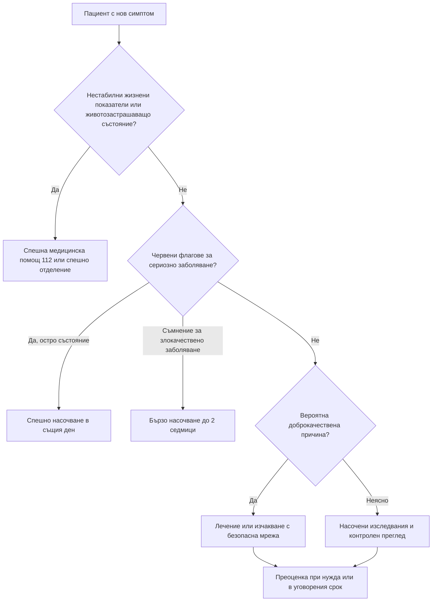

# Глава 3. Диагностика в общата практика и при специални групи пациенти

> **Част I. Общи принципи на диференциалната диагноза**

## Цели на главата

След като усвои тази глава, читателят трябва да може:

- да обясни защо диагностичният процес в общата практика се различава от този в болницата;
- да прилага изчаквателно наблюдение и безопасна мрежа като легитимни диагностични инструменти;
- да определя нивото на спешност при насочване;
- да познава особеностите на диагностиката при деца, възрастни хора, бременни, имунокомпрометирани, пациенти с психични заболявания и социално уязвими групи.

---

## 1. Особености на общата практика

### 1.1. Недиференцираното заболяване

В кабинета на общопрактикуващия лекар (ОПЛ) заболяванията се срещат в най-ранния си стадий, когато симптомите са неспецифични и често преходни. Голяма част от посещенията завършват със **симптомна** или **синдромна**, а не с нозологична диагноза. Това е приемливо, ако са изключени спешните състояния и е осигурено проследяване.

### 1.2. Екология на медицинската помощ

Класическото проучване на Green и сътр. (2001) проследява 1000 души от общото население в продължение на един месец. Около 800 имат някакви симптоми. 327 обмислят да потърсят медицинска помощ, 217 посещават лекар, от тях 113 в първичната помощ. 21 отиват в болнична амбулатория, 13 в спешно отделение, 8 са хоспитализирани, а по-малко от 1 попада в университетска болница.

Изводът е важен. Опитът на лекаря, придобит в университетската болница, е натрупан върху силно подбрана група пациенти с висока честота на тежки и редки заболявания. Пренесен без корекция в общата практика, той води до **надценяване на вероятността за сериозно заболяване** и до излишни изследвания.

### 1.3. Ниската претестова вероятност

В общата практика повечето симптоми имат доброкачествени причини. Дори класическите „алармиращи“ белези имат ниска положителна предсказваща стойност. Например ректалното кървене при възрастен човек в извънболничната практика се дължи на колоректален карцином само в няколко процента от случаите. Затова британските препоръки за насочване при подозрение за злокачествено заболяване (NICE NG12) приемат за праг положителна предсказваща стойност от около 3%. Над този праг бързото насочване е оправдано.

### 1.4. Непрекъснатост на грижите

ОПЛ познава пациента, неговото семейство, здравословното му състояние и начина, по който обикновено съобщава за симптомите си. Промяната спрямо изходното състояние често е по-информативна от абсолютната стойност. Пациентът, който „никога не се оплаква“, заслужава особено внимание, когато се оплаче.

### 1.5. Време и ресурси

Консултацията е кратка, а достъпът до някои изследвания е ограничен или забавен. Това налага **приоритизиране**. Първо се изключват опасните състояния, след това се търси най-вероятното обяснение, а останалото се поверява на времето и проследяването.

### 1.6. Биопсихосоциалният модел

Симптомът винаги се проявява при конкретен човек със своя житейски контекст: семейство, работа, финанси, вярвания, страхове. Психосоциалните фактори могат да бъдат причина за симптомите, да ги усилват или да определят поведението на пациента, например кога и защо търси помощ.

### 1.7. Многоболестност и полипрагмазия

Голяма част от пациентите над 65 години имат две или повече хронични заболявания и приемат пет или повече лекарства. Новият симптом при тях може да е проява на съществуващо заболяване, на ново заболяване, на лекарствено взаимодействие или на нежелана лекарствена реакция.

---

## 2. Стратегии за управление на диагностичната несигурност

### 2.1. Изчаквателно наблюдение

Изчаквателното наблюдение („времето като инструмент“) е легитимно само при следните условия:

- липсват червени флагове;
- пациентът е стабилен;
- най-вероятната причина е доброкачествена;
- пациентът разбира плана;
- определен е срок за преоценка.

То не е равносилно на отлагане. Изисква активно проследяване и документиране.

### 2.2. Безопасна мрежа

Концепцията за **безопасна мрежа** (*safety netting*) е въведена от Roger Neighbour като задължителен етап на всяка консултация. Тя включва:

1. **Съобщаване на несигурността.** Например: *„Най-вероятно става дума за вирусна инфекция, но в началото някои по-сериозни заболявания изглеждат по същия начин.“*
2. **Конкретни симптоми, при които пациентът трябва да потърси помощ.** Общото *„ако стане по-зле“* не е достатъчно.
3. **Колко спешно и къде да потърси помощ:** обаждане на 112, преглед в същия ден, повторно посещение след определен срок.
4. **Кога се очаква подобрение**, например *„кашлицата може да продължи до три седмици“*.
5. **Документиране** на дадените указания.

**Примери за безопасна мрежа при чести оплаквания:**

| Ситуация | Кога пациентът трябва да потърси помощ незабавно или отново |
|---|---|
| Фебрилно дете | Обрив, който не избледнява при натиск; сънливост или трудно събуждане; учестено или затруднено дишане; отказ от течности и много малко мокри пелени; гърч; студени крайници при висока температура; температура над 5 дни; родителят усеща, че „нещо не е наред“ |
| Главоболие | Внезапно, много силно главоболие; повръщане, объркване, слабост, нарушен говор или зрение; треска с вратна ригидност; прогресивно влошаване |
| Болка в корема | Засилваща се или постоянна болка; треска; упорито повръщане; кръв в повърнатото или в изпражненията; подуване и спиране на газовете |
| Болка в гърба | Изтръпване в седалищната и перинеалната област; нарушено уриниране или дефекация; слабост в краката; треска; болка, която буди нощем |
| Кашлица | Кръв в храчките; задух; болка в гърдите; кашлица, продължаваща над 3 седмици; загуба на тегло |
| Диария | Кръв в изпражненията; признаци на обезводняване; висока температура; продължителност над 7 дни |

### 2.3. Проследяване на резултатите

Всяко назначено изследване изисква система за проверка на резултата. Правилото *„липсата на новини е добра новина“* е опасно. Пациентът трябва да знае кога и как ще научи резултата. Лекарят трябва да има механизъм, чрез който да открие липсващ или неразгледан резултат.

### 2.4. Нива на спешност при насочване

| Ниво | Време | Примери |
|---|---|---|
| **Спешна медицинска помощ (112)** | Незабавно | Съмнение за остър коронарен синдром, инсулт, сепсис, анафилаксия, тежка дихателна недостатъчност, менингококова инфекция |
| **Спешно насочване в същия ден** | Часове | Торзия на тестиса, извънматочна бременност, синдром на конската опашка, остра исхемия на крайник, остра глаукома |
| **Неотложно насочване** | 24–72 часа | Подозрение за гигантоклетъчен артериит, остра моноартикуларна болка без треска, тежка анемия без хемодинамична нестабилност |
| **Бързо насочване при подозрение за злокачествено заболяване** | До 2 седмици | Бучка в гърдата, желязодефицитна анемия с неясен произход при възрастен, дисфагия, хемоптиза при пушач |
| **Планово насочване** | Седмици | Стабилни хронични проблеми, които изискват специализирана оценка |

### 2.5. Дистанционни консултации

Консултацията по телефон и видео е удобна, но при нея липсват физикалният преглед и част от невербалната информация. Прагът за преглед на живо трябва да бъде нисък при:

- кърмачета, крехки възрастни хора и пациенти, които трудно общуват;
- повторно обаждане за същия проблем;
- болка в гърдите, задух, силна болка в корема, главоболие с тревожни характеристики;
- ситуация, в която лекарят „не може да си представи“ пациента.

---

## 3. Специални групи пациенти

### 3.1. Деца

- Диференциалната диагноза зависи силно от възрастта. Например повръщането на кърмаче на 4 седмици, на дете на 2 години и на юноша има различни най-вероятни причини.
- Нормалните стойности на жизнените показатели се различават от тези при възрастни:

| Възраст | Сърдечна честота (/min) | Дихателна честота (/min) | Систолно налягане (mmHg) |
|---|---|---|---|
| Под 1 година | 110–160 | 30–40 | 70–90 |
| 1–2 години | 100–150 | 25–35 | 80–95 |
| 2–5 години | 95–140 | 25–30 | 80–100 |
| 5–12 години | 80–120 | 20–25 | 90–110 |
| Над 12 години | 60–100 | 15–20 | 100–120 |

*Ориентировъчни стойности по APLS.*

- **Тревогата на родителя е червен флаг** и трябва да се взема сериозно.
- Децата компенсират дълго, а след това се декомпенсират внезапно. Хипотонията е късен признак на шок.
- Кърмачето под 3 месеца с температура от 38 °C или повече е с висок риск от сериозна бактериална инфекция.
- Винаги трябва да се мисли и за **неслучайна травма**, когато механизмът не съответства на находката или на етапа на развитие на детето.
- Подробности: глави 68–73.

### 3.2. Възрастни и крехки пациенти

- **Атипичното представяне е правило:**
  - инфарктът протича без болка;
  - пневмонията протича без треска;
  - апендицитът протича с минимални коремни находки;
  - всяко остро заболяване може да се прояви само с объркване, падане или „отпадане“.
- Фебрилният отговор е отслабен. Бета-блокерите маскират тахикардията.
- Ниската мускулна маса понижава креатинина. Така бъбречната функция изглежда по-добра, отколкото е в действителност.
- Когнитивният дефицит затруднява анамнезата. Анамнезата от близките и от лицата, които се грижат за пациента, е задължителна.
- Подробности: глава 81.

### 3.3. Бременни

При всяка жена в детеродна възраст с коремна болка, кървене, аменорея или неясни симптоми трябва да се мисли за **бременност** и особено за извънматочна бременност. Нормалната бременност променя много лабораторни показатели:

| Показател | Промяна при нормална бременност | Практическо значение |
|---|---|---|
| Хемоглобин | Понижава се поради разреждане. Долна граница ≈ 110 g/l в I триместър и ≈ 105 g/l във II–III триместър | По-ниски стойности означават анемия |
| Левкоцити | Повишават се до ≈ 15 × 10⁹/l, а по време на раждането и повече | Лека левкоцитоза не е признак на инфекция |
| Тромбоцити | Леко се понижават (гестационна тромбоцитопения, обикновено > 70 × 10⁹/l) | По-ниски стойности изискват изключване на прееклампсия, HELLP синдром и имунна тромбоцитопения |
| СУЕ, D-димер, фибриноген | Повишават се | СУЕ и D-димерът губят диагностичната си стойност |
| Креатинин | Понижава се, защото гломерулната филтрация нараства с ≈ 50% | Стойност, нормална извън бременност (напр. 90 µmol/l), може да означава бъбречно увреждане |
| Алкална фосфатаза | Повишава се 2–4 пъти (плацентарен произход) | Изолираното повишение е физиологично |
| АЛАТ, АСАТ, билирубин, ГГТ | Не се променят | Всяко повишение е патологично |
| ТСХ | Понижава се в I триместър поради ефекта на hCG | Използват се референтни граници за съответния триместър |
| Сърдечна честота | Нараства с 10–20/min | Тахикардия над 100/min изисква търсене на причина |
| Артериално налягане | Понижава се във II триместър | Повишението над 140/90 mmHg е патологично |
| pCO₂ | Понижава се (компенсирана респираторна алкалоза) | „Нормален“ pCO₂ при бременна с астма може да е признак на умора и дихателна недостатъчност |

Необходимите образни изследвания не бива да се отказват от страх от лъчението. Рентгенографията на гръден кош натоварва плода с пренебрежимо малка доза. Когато е възможно, се предпочитат ехографията и ЯМР (вж. глава 66).

### 3.4. Имунокомпрометирани пациенти

Към тази група спадат пациентите на химиотерапия, след трансплантация, на продължителна кортикостероидна или биологична терапия, с HIV инфекция, с аспления или с тежък захарен диабет. При тях:

- възпалителният отговор е отслабен, затова треската може да е единственият признак, а локалните белези са слабо изразени;
- възможни са опортюнистични и атипични причинители;
- инфекциите протичат бързо и тежко;
- **фебрилната неутропения е спешно състояние**;
- подробности: глава 80.

### 3.5. Пациенти с психични заболявания, интелектуални затруднения или деменция

- **Диагностичното засенчване** е най-голямата опасност: новите симптоми се приписват на известното психично състояние.
- Продължителността на живота при тежки психични заболявания е с 10–20 години по-кратка, главно поради соматични заболявания.
- Промяната в поведението (възбуда, отказ от храна, агресия, затваряне в себе си) може да е единственият признак на болка или соматично заболяване. Чести причини са запекът, задръжката на урина, зъбната болка, фрактурата, инфекцията на пикочните пътища и пневмонията.
- За оценка на болката при пациенти, които не могат да я опишат, се използват специални скали, например PAINAD и Abbey.

### 3.6. Мигранти, пътешественици и социално уязвими групи

- **Езиковата бариера** се преодолява с професионален преводач. Деца и роднини не бива да бъдат преводачи при деликатни въпроси.
- **Епидемиологичният профил** може да е различен. Трябва да се мисли за туберкулоза, хепатит B и C, HIV, паразитози, малария, хемоглобинопатии, дефицит на витамин D и последици от травма, включително посттравматично стресово разстройство.
- **Бездомните хора** и хората, които живеят в тежки социални условия, имат висок риск от туберкулоза, вирусни хепатити, кожни инфекции, хипотермия и зависимости. Често търсят помощ късно.

### 3.7. Пациенти, които са медици, роднини или „VIP“

Отклонението от обичайния подход („да не го притесняваме с изследвания“ или обратното, „да направим всичко“) увеличава риска от грешка. Най-безопасно е тези пациенти да се оценяват по същия стандарт като всички останали.

### 3.8. Често посещаващи пациенти и пациенти с много оплаквания

Рискът от пропускане на **ново органично заболяване** при тях е висок. Всеки **нов** симптом, всяка **промяна в характера** на познат симптом и всеки **обективен** признак изискват нова, непредубедена оценка.

### 3.9. Жертви на насилие

Насилието трябва да се подозира при:

- травми, които не отговарят на описания механизъм;
- забавено търсене на помощ;
- повтарящи се травми;
- хронична болка с неясен произход, депресия, злоупотреба с вещества;
- придружител, който отговаря вместо пациента.

Това важи с особена сила за децата, възрастните хора и бременните.

---

## 4. Правни и етични аспекти на диагностичния процес

- **Документиране.** Записват се дата и час, данните от анамнезата и прегледа (включително значимите отрицателни находки), разсъжденията, работната диагноза, алтернативите, планът и указанията за безопасна мрежа.
- **Информирано съгласие** за изследванията, особено инвазивните, както и за изследванията със значими последици, например генетични изследвания и изследване за HIV.
- **Поверителност**, включително при юноши.
- **Право на отказ.** Пациентът има право да откаже изследване или насочване. Отказът и дадената информация се документират.

---

## 5. Алгоритъм за спешност на насочването

---

## 6. Клинични перли

- Болничният опит надценява вероятността за сериозно заболяване. Общата практика изисква различно „калибриране“.
- Безопасната мрежа трябва да е конкретна: кои симптоми, кога и къде.
- Промяната спрямо изходното състояние на познатия пациент е силен диагностичен сигнал.
- Родителската тревога и „нещо не е наред“ от страна на близките на възрастен човек са клинични данни.
- При всяка жена в детеродна възраст с коремна болка първо се изключва бременност.
- Пациентът с психично заболяване има същото право на пълна соматична оценка като всички останали.

---

## 7. Клиничен случай

**Случай.** Студент на 19 години, живеещ в общежитие, е прегледан в 10 ч. сутринта по време на грипна епидемия. От сутринта има температура 38,9 °C, главоболие и болки в мускулите. При прегледа: пулс 104/min, дихателна честота 18/min, АН 118/72 mmHg, капилярно пълнене 2 секунди. Пациентът е в съзнание, няма вратна ригидност, няма обрив. Поставена е работна диагноза „грипоподобно заболяване“.

Лекарят обяснява, че това най-вероятно е вирусна инфекция. Дава и конкретни указания: при поява на петна по кожата, които не избледняват при натиск с чаша, при силна болка в краката, студени ръце и крака, объркване или сънливост, ученикът незабавно трябва да се обади на 112. Съквартирантът му е инструктиран да го наглежда. Указанията са документирани.

В 17 ч. съквартирантът забелязва тъмночервени петна по краката и сънливост и се обажда на 112. Установена е менингококова септицемия. Пациентът получава антибиотик още в линейката, лекуван е в интензивно отделение и се възстановява.

**Обсъждане.** В първите часове менингококовата инфекция е неразличима от грипоподобно заболяване. Класическите белези (хеморагичен обрив, вратна ригидност, нарушено съзнание) обикновено се появяват след 12–15 часа. По-ранни, но недостатъчно известни белези са болките в краката, студените крайници и промяната в цвета на кожата. Те се появяват средно около 7–12 часа след началото. Лекарят не е могъл да постави диагнозата при първия преглед, но правилно конструираната безопасна мрежа е спасила живота на пациента.

При съмнение за менингококова болест в извънболнични условия, например при неизбледняващ обрив и треска, се препоръчва незабавно парентерално приложение на антибиотик, ако това не забавя транспорта до болница.

**Поука.** Безопасната мрежа е неразделна част от диагнозата. Тя трябва да е конкретна, разбираема и документирана.

<!-- навигация -->

---

[← Глава 2. Анамнеза, физикален преглед и рационално използване на изследванията](02-anamneza-pregled-izsledvania.md) · [Съдържание](../README.md) · [Глава 4. Треска и треска с неясен произход →](04-treska.md)
