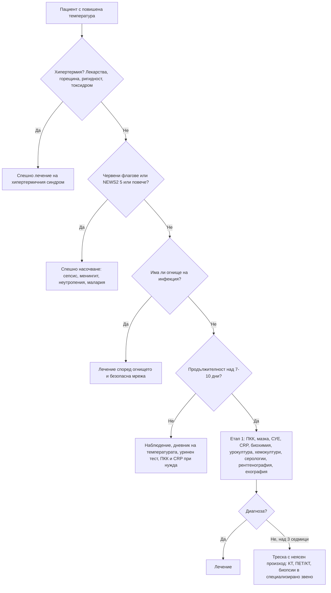

# Глава 4. Треска и треска с неясен произход

> **Част II. Общи симптоми**

## Цели на главата

- Да се разграничават треската и хипертермията.
- Да се прилага систематичен подход към острата треска с и без огнище.
- Да се познават дефиницията, причините и етапите на изследване при треска с неясен произход.
- Да се помнят ендемичните за България инфекции, протичащи с треска.

---

## 1. Определения

| Понятие | Определение |
|---|---|
| **Нормална телесна температура** | 36,0–37,5 °C, с денонощни колебания до 0,5–1 °C (най-ниска сутрин, най-висока следобед). Аксиларната температура е с 0,3–0,5 °C по-ниска от ректалната и оралната |
| **Субфебрилитет** | 37,1–37,9 °C (аксиларно) |
| **Треска (фебрилитет)** | ≥ 38,0 °C (централна температура). Дължи се на повишаване на хипоталамичната „зададена стойност“ под действие на пирогени (IL-1, IL-6, TNF-α, простагландин E₂) |
| **Хиперпирексия** | > 41,0 °C. Трябва да насочи към хипертермия или към засягане на ЦНС |
| **Хипертермия** | Повишаване на температурата **без** промяна на зададената стойност. Топлопродукцията надвишава топлоотдаването или терморегулацията е увредена. Антипиретиците са неефективни |

### 1.1. Хипертермични синдроми, които не бива да се бъркат с треска

| Синдром | Ключови белези | Контекст |
|---|---|---|
| **Топлинен удар** | Суха, гореща кожа (класически тип) или изпотяване (при усилие), объркване, температура > 40 °C | Горещо време, възрастни хора, физическо натоварване, диуретици, антихолинергични лекарства |
| **Невролептичен малигнен синдром** | Оловна ригидност, брадикинезия, нарушено съзнание, вегетативна нестабилност, висока КК; развива се за дни | Антипсихотици, метоклопрамид, рязко спиране на леводопа |
| **Серотонинов синдром** | Клонус (индуциран, окуларен), хиперрефлексия, тремор, диария, мидриаза; развива се за часове | SSRI, SNRI, трамадол, линезолид, МАО-инхибитори, триптани (рядко) |
| **Малигнена хипертермия** | Мускулна ригидност, хиперкапния, тахикардия по време на анестезия | Инхалационни анестетици, сукцинилхолин |
| **Антихолинергичен токсидром** | Суха, зачервена кожа, мидриаза, задръжка на урина, делир | Антихистамини, трициклични антидепресанти, атропин, татул (*Datura stramonium*) |
| **Симпатикомиметичен токсидром** | Изпотяване, мидриаза, тахикардия, хипертония, възбуда | Кокаин, амфетамини, MDMA |
| **Тиреотоксична криза** | Тахиаритмия, възбуда, диария, анамнеза за заболяване на щитовидната жлеза | Инфекция, операция, йоден контраст при нелекуван хипертиреоидизъм |
| **Феохромоцитомна криза** | Пароксизмална хипертония, главоболие, изпотяване | Провокация от лекарства (метоклопрамид, глюкокортикоиди) |

---

## 2. Типове температурна крива

Съвременното ранно лечение с антипиретици и антибиотици прави типовете температурна крива по-рядко наблюдавани, но някои остават полезни.

| Тип | Описание | Примери |
|---|---|---|
| **Постоянна** (*febris continua*) | Колебания < 1 °C в денонощието | Коремен тиф, лобарна пневмония, рикетсиози |
| **Ремитентна** | Колебания > 1 °C, без нормализиране | Повечето инфекции |
| **Интермитентна (септична)** | Високи покачвания с нормализиране, често с втрисане | Абсцеси, холангит, пиелонефрит, ендокардит, малария |
| **Вълнообразна** (*undulans*) | Вълни от фебрилни и афебрилни периоди с продължителност дни до седмици | Бруцелоза, лимфоми |
| **Периодична** | Правилни интервали | Малария (терциана – през 48 h, квартана – през 72 h), синдроми на периодична треска |
| **Двойна дневна** | Два пика в денонощието | Болест на Still при възрастни, висцерална лайшманиоза, милиарна туберкулоза |
| **Пел-Ебщайн** | Вълни от по 1–2 седмици | Лимфом на Hodgkin (рядко) |

**Относителна брадикардия** (признак на Faget). Обикновено сърдечната честота се повишава с около 10 удара/min за всеки градус. Ако тя остава относително ниска, трябва да се мисли за:

- коремен тиф;
- легионелоза, психитакоза и Ку-треска;
- лептоспироза и рикетсиози;
- лекарствена треска;
- прием на бета-блокери;
- симулирана треска.

---

## 3. Остра треска

### 3.1. Безопасна диагностична стратегия

| Въпрос | Отговор |
|---|---|
| **Вероятна диагноза** | Вирусна инфекция на горните дихателни пътища, грип, COVID-19, гастроентерит, инфекция на пикочните пътища |
| **Сериозни заболявания, които не бива да се пропускат** | Сепсис; бактериален менингит и менингококцемия; енцефалит; пневмония; пиелонефрит и уросепсис; инфекциозен ендокардит; холангит; абсцеси; некротизиращ фасциит; септичен артрит; малария при пътувал човек; фебрилна неутропения; Кримска-Конго хеморагична треска (ендемични райони, кърлеж) |
| **Чести капани** | Инфекция на пикочните пътища при възрастни и деца без уринарни симптоми; лекарствена треска; белодробна тромбемболия; подагра; ранен херпес зостер преди обрива; зъбен абсцес; простатит; остър HIV |
| **Маскиращи заболявания** | Лимфом, левкемия, системен лупус еритематодес, васкулити, туберкулоза, инфекциозна мононуклеоза |
| **Психосоциални аспекти** | Симулирана (изкуствена) треска; тревожност за „постоянна“ субфебрилна температура при нормална денонощна вариация |

### 3.2. Анамнеза

- **Начало и продължителност**, температурна крива (дневник на температурата), втрисане. Истинският тръпнещ студ (зъбите тракат, трепери цялото тяло) насочва към бактериемия.
- **Локализиращи симптоми:**
  - дихателни: кашлица, храчки, задух, болки в гърлото;
  - уринарни: дизурия, болка в слабините;
  - стомашно-чревни: диария, повръщане, коремна болка, жълтеница;
  - кожни: обрив, зачервяване;
  - неврологични: главоболие, объркване, вратна ригидност;
  - ставни и костни болки.
- **Експозиции и контакти:** болни в семейството, детска градина, животни, кърлежи, непастьоризирани продукти, вода от открити водоизточници, гризачи, сексуални контакти, венозна употреба на наркотици.
- **Пътувания** през последните 12 месеца, особено до райони с малария (вж. глава 80).
- **Имунен статус:** химиотерапия, кортикостероиди, биологични средства, аспления, HIV, захарен диабет, трансплантация.
- **Изкуствени материали в тялото:** протезни клапи, ставни протези, съдови графтове, централни венозни катетри, пейсмейкъри.
- **Нови лекарства** през последните седмици.
- **Скорошни интервенции:** стоматологични, урологични, операции.

### 3.3. Физикален преглед

Жизнените показатели се оценяват по скалата **NEWS2** (вж. глава 77). Търси се огнище систематично:

- кожа (петехии, пурпура, еритем, рани, некроза, *tache noire* при марсилска треска);
- лимфни възли;
- уши, гърло, синуси, зъби;
- менингеален синдром;
- бял дроб;
- сърдечни шумове (ендокардит);
- корем (черен дроб, слезка, перитонеално дразнене, бъбречна ложа);
- стави и гръбначен стълб (болезненост при перкусия на прешлените);
- стъпала (диабетно стъпало);
- места на катетри и изкуствени материали;
- при нужда простата (болезнена при остър простатит) и тестиси.

### 3.4. Червени флагове при остра треска

- Нарушено съзнание, объркване, силна сънливост.
- Хеморагичен (неизбледняващ) обрив.
- Вратна ригидност, силно главоболие, фотофобия.
- Хипотония, тахикардия > 130/min, дихателна честота ≥ 25/min, SpO₂ < 92%, олигурия, мраморна кожа.
- Треска при имунокомпрометиран пациент, особено при неутропения.
- Треска след пътуване до райони с малария.
- Треска при кърмаче под 3 месеца (вж. глава 68).
- Силна болка, непропорционална на находката (некротизиращ фасциит).
- Кървене от лигавиците, тромбоцитопения и анамнеза за ухапване от кърлеж (хеморагична треска).

### 3.5. Изследвания при остра треска

- В повечето случаи на вирусна инфекция в общата практика **не са необходими изследвания**.
- При неясно огнище или при по-продължителна треска: пълна кръвна картина (ПКК) с диференциално броене, CRP, уринен тест с лента и урокултура, рентгенография на гръден кош при дихателни симптоми, чернодробни ензими и креатинин.
- При съмнение за бактериемия: **хемокултури**, взети преди антибиотика.
- Бърз тест за грип и COVID-19 и бърз стрептококов тест според клиничния контекст.

---

## 4. Треска с неясен произход (ТНП)

### 4.1. Дефиниция

**Класическа дефиниция** (Petersdorf и Beeson, 1961):

- температура > 38,3 °C при няколко измервания;
- продължителност > 3 седмици;
- липса на диагноза след 1 седмица изследване в болница.

**Съвременна модификация** (Durack и Street, 1991): липса на диагноза след 3 амбулаторни посещения, 3 дни в болница или 1 седмица целенасочено амбулаторно изследване. Разграничават се четири категории:

- класическа ТНП;
- нозокомиална ТНП;
- ТНП при неутропения;
- ТНП при HIV инфекция.

### 4.2. Причини за класическа треска с неясен произход

В развитите страни разпределението на причините се е променило: делът на инфекциите намалява, а делът на неинфекциозните възпалителни заболявания и на неустановените случаи расте. Във всички групи има по няколко водещи заболявания.

| Група | Приблизителен дял | Основни заболявания |
|---|---|---|
| **Инфекции** | 20–30% | Туберкулоза (особено извънбелодробна и милиарна); абсцеси (коремни, тазови, зъбни, паранефрални, чернодробни); инфекциозен ендокардит (включително с отрицателни хемокултури: *Coxiella*, *Bartonella*, HACEK); вертебрален остеомиелит; простатит; CMV и EBV; HIV; **бруцелоза**; **Ку-треска**; **висцерална лайшманиоза**; коремен тиф; малария |
| **Неинфекциозни възпалителни заболявания** | 20–30% | Гигантоклетъчен артериит и ревматична полимиалгия (при възрастни); болест на Still при възрастни; системен лупус еритематодес; полиартериит нодоза, грануломатоза с полиангиит, артериит на Такаясу; саркоидоза; болест на Crohn; подостър тиреоидит; **фамилна средиземноморска треска** и други автовъзпалителни синдроми; болест на Behçet |
| **Злокачествени заболявания** | 10–20% | Лимфоми (най-честите); левкемии; миелодиспластичен синдром; бъбречноклетъчен карцином; хепатоцелуларен карцином и чернодробни метастази; карцином на дебелото черво; миксом на предсърдието |
| **Други** | 5–15% | Лекарствена треска; рецидивираща белодробна тромбемболия; хематоми; алкохолен хепатит; хемофагоцитна лимфохистиоцитоза; болест на Castleman; надбъбречна недостатъчност; симулирана треска; навикова хипертермия |
| **Без диагноза** | 20–50% | Прогнозата обикновено е добра; много от случаите отзвучават спонтанно |

**Правилото за възрастта:** при пациентите над 65 години водещите причини са гигантоклетъчният артериит, туберкулозата, абсцесите, ендокардитът и злокачествените заболявания, особено лимфомите.

### 4.3. Насочващи находки

| Находка | Насочва към |
|---|---|
| Главоболие, болезнени темпорални артерии, челюстна клаудикация, нарушено зрение, възраст > 50 години | Гигантоклетъчен артериит |
| Сьомгово-розов, преходен обрив при покачване на температурата, артрит, болки в гърлото, феритин > 3000 µg/l | Болест на Still при възрастни |
| Нов или променен сърдечен шум, петехии по конюнктивите, хеморагии под ноктите, петна на Roth | Инфекциозен ендокардит |
| Болка в гърба с локална болезненост при перкусия | Вертебрален остеомиелит, туберкулозен спондилит, бруцелозен спондилит |
| Спленомегалия | Лимфом, левкемия, ендокардит, лайшманиоза, бруцелоза, инфекциозна мононуклеоза, малария |
| Лимфаденопатия | Лимфом, туберкулоза, токсоплазмоза, EBV, CMV, HIV, болест на Kikuchi, саркоидоза |
| Нощно изпотяване и загуба на тегло | Туберкулоза, лимфом, ендокардит, бруцелоза, HIV |
| Кратки, повтарящи се пристъпи (1–3 дни) със серозит, при произход от Източното Средиземноморие | Фамилна средиземноморска треска |
| Болезнена щитовидна жлеза | Подостър тиреоидит |
| Панцитопения, спленомегалия, много висок феритин, хипертриглицеридемия | Хемофагоцитна лимфохистиоцитоза |
| Еозинофилия | Лекарствена реакция, паразитоза, лимфом на Hodgkin, еозинофилна грануломатоза с полиангиит |

### 4.4. Лекарствена треска

Лекарствената треска може да се появи по всяко време, но най-често 7–10 дни след началото на лечението. Пациентът често изглежда „по-добре, отколкото подсказва температурата“. Възможни са относителна брадикардия, обрив и еозинофилия (всяка при около една пета от случаите). Треската отзвучава за 48–72 часа след спиране на лекарството.

Най-чести причинители са:

- бета-лактамните антибиотици и сулфонамидите;
- антиконвулсантите (фенитоин, карбамазепин);
- алопуринол и миноциклин;
- хепарин.

### 4.5. Изследвания при треска с неясен произход

**Етап 1 — задължителен минимум (може да се започне в общата практика):**

- повторна подробна анамнеза и повторен пълен физикален преглед: темпорални артерии, лимфни възли, кожа, очни дъна, сърдечни шумове, стави, щитовидна жлеза, простата, тестиси;
- ПКК с диференциално броене и **мазка от периферна кръв**; СУЕ, CRP;
- креатинин, електролити, чернодробни ензими, ЛДХ, КК, феритин, електрофореза на серумните белтъци;
- урина: общо изследване, седимент и урокултура;
- **три хемокултури** от отделни венепункции, взети преди антибиотик;
- серология за HIV, EBV, CMV, хепатит B и C;
- **серология за бруцелоза и Ку-треска** (в България задължително при селскостопанска експозиция);
- туберкулинов тест или IGRA;
- ANA, ревматоиден фактор, анти-CCP, ANCA (при съответна клиника);
- рентгенография на гръден кош, ехография на корема;
- ехокардиография при шум, при бактериемия или при изкуствена клапа.

**Етап 2 — в специализирано звено:**

- КТ на гръден кош, корем и таз;
- **¹⁸F-FDG ПЕТ/КТ**, което има висока диагностична стойност и се препоръчва все по-рано;
- трансезофагеална ехокардиография;
- ехография и/или биопсия на темпоралните артерии при възраст над 50 години;
- **костномозъчна биопсия** (при цитопении, съмнение за лимфом, туберкулоза, лайшманиоза, бруцелоза);
- биопсия на лимфен възел (ексцизионна), на черния дроб или на кожни лезии.

**Принцип.** При стабилен пациент **не се назначават емпирично антибиотици или кортикостероиди** преди поставяне на диагнозата. Те могат да маскират картината и да направят невъзможни културите и хистологичната диагноза. Изключение правят нестабилните пациенти и подозрението за гигантоклетъчен артериит със зрителни симптоми.

### 4.6. Симулирана (изкуствена) треска

Трябва да се подозира при:

- несъответствие между температурата и пулса;
- липса на изпотяване и втрисане;
- много бързо спадане на температурата без изпотяване;
- медицинско образование на пациента;
- необичайни или „невъзможни“ бактерии в хемокултурите (самоинжектиране).

Помага измерването под наблюдение, едновременно на две места, или измерването на температурата на прясно отделена урина.

---

## 5. Нощно изпотяване

Нощното изпотяване е особено значимо, когато е обилно и налага смяна на бельото и завивките. Причините са:

- **инфекции:** туберкулоза, ендокардит, бруцелоза, HIV, абсцеси;
- **злокачествени заболявания:** лимфоми (като „B-симптом“ заедно с треска и загуба на над 10% от телесното тегло за 6 месеца), левкемии, солидни тумори;
- **ендокринни причини:** менопауза, хипертиреоидизъм, нощна хипогликемия, феохромоцитом, карциноиден синдром;
- **лекарства:** антидепресанти (SSRI, SNRI), опиоиди, антипиретици, хипогликемични средства, агонисти на гонадотропин-освобождаващия хормон;
- **други:** алкохол и отнемането му, обструктивна сънна апнея, гастроезофагеален рефлукс, тревожност, идиопатична хиперхидроза.

---

## 6. Ендемични за България инфекции, протичащи с треска

| Заболяване | Експозиция и сезон | Ключови белези | Диагноза |
|---|---|---|---|
| **Марсилска треска** (*Rickettsia conorii*) | Кучешки кърлеж; юли–септември; предимно Южна и Източна България | Треска, главоболие, миалгии; *tache noire* (черна некротична коричка на мястото на ухапването); макулопапулозен обрив по цялото тяло, включително по дланите и ходилата | Клинична; серология (IgM); PCR от коричката |
| **Кримска-Конго хеморагична треска** | Кърлежи от род *Hyalomma*, контакт с кръв на животни и болни хора; пролет–лято; Източните Родопи, Бургаско, Хасковско, Старозагорско, Шуменско | Внезапна треска, миалгии, главоболие, тромбоцитопения, левкопения, повишени АСАТ/АЛАТ, хеморагии | PCR и серология в референтна лаборатория; **строги мерки за инфекциозен контрол** поради риск от вътреболнично предаване |
| **Хеморагична треска с бъбречен синдром** (хантавирус) | Гризачи, прах в плевни и вили; горски райони | Треска, болки в кръста и корема, тромбоцитопения, остро бъбречно увреждане, протеинурия | Серология |
| **Бруцелоза** | Овце, кози, говеда; домашно непастьоризирано мляко и сирене | Вълнообразна треска, обилно изпотяване (с характерен мирис), артралгии, сакроилеит, спондилит, орхиепидидимит, хепатоспленомегалия | Серология (Rose Bengal, аглутинация, ELISA); хемокултури (**уведомете лабораторията**: бавен растеж и риск от лабораторно заразяване) |
| **Ку-треска** (*Coxiella burnetii*) | Овце, кози (особено при агнене), прах; огнища в България | Грипоподобно заболяване, атипична пневмония, хепатит; хроничната форма е ендокардит | Серология (антитела срещу фаза I и фаза II) |
| **Лептоспироза** | Вода, замърсена с урина на гризачи; земеделски работници, риболовци | Внезапна треска, силни болки в прасците, конюнктивална хиперемия; тежката форма (болест на Weil) протича с жълтеница, остро бъбречно увреждане и хеморагии | Серология (MAT), PCR |
| **Туларемия** | Гризачи, зайци, замърсена вода (орофарингеална форма); огнища в Западна България | Треска и регионален лимфаденит (улцерогландуларна, гландуларна или орофарингеална форма) | Серология |
| **Лаймска болест** | Ухапване от кърлеж | Мигриращ еритем (разрастващ се пръстеновиден еритем); по-късно неврологични, ставни и сърдечни прояви | Мигриращият еритем е достатъчен за диагнозата; серология при късните форми |
| **Трихинелоза** | Домашно приготвено свинско месо и месо от дива свиня | Треска, периорбитален оток, миалгии, еозинофилия, повишена КК | Серология, мускулна биопсия |
| **Висцерална лайшманиоза** | Пясъчни мушици; спорадично в Южна България | Продължителна треска, изразена спленомегалия, панцитопения, хипергамаглобулинемия | Костномозъчна пункция, серология, PCR |
| **Туберкулоза** | Близък контакт, социални рискови фактори | Субфебрилитет, нощно изпотяване, загуба на тегло, кашлица | Рентгенография, микроскопия и култура на храчка, молекулярни тестове, IGRA |

---

## 7. Диагностичен алгоритъм

---

## 8. Особености в общата практика

- Повечето остри фебрилни състояния са вирусни и се самоограничават. Основната задача е да се разпознае **малкият дял тежки инфекции**.
- Пациентът трябва да води **дневник на температурата**. Измерва я два пъти дневно, по едно и също време и на едно и също място, и отбелязва пулса.
- Антибиотик „за всеки случай“ при треска без огнище трябва да се избягва. Той маскира ендокардита, остеомиелита и абсцесите и затруднява културите.
- При насочване за треска с неясен произход се изпращат всички налични резултати и дневникът на температурата.

---

## 9. Клинични перли

- Треска + нов сърдечен шум = инфекциозен ендокардит, докато не се докаже противното. Трябват три хемокултури преди антибиотика.
- Възрастен човек с треска, главоболие и висока СУЕ: не пропускайте гигантоклетъчния артериит. Слепотата е предотвратима.
- Много високият феритин (над няколко хиляди µg/l) при фебрилен пациент насочва към болест на Still, хемофагоцитна лимфохистиоцитоза или масивно възпаление.
- Липсата на треска не изключва тежка инфекция при възрастни хора, при пациенти на кортикостероиди и при тежко болни.
- Всеки пациент с треска след пътуване до ендемичен район има малария, докато три изследвания не докажат противното.
- В България при треска след ухапване от кърлеж мислете не само за марсилска треска, но и за Кримска-Конго хеморагична треска, особено при тромбоцитопения.

---

## 10. Клиничен случай

**Случай.** Мъж на 46 години, овчар от село в Югоизточна България, се оплаква от повишена температура от 4 седмици. Температурата се покачва вечер до 38,5–39 °C, придружена е от обилно нощно изпотяване и спада сутрин. Има болки в кръста и в двете коленни стави и е отслабнал с 5 kg. Приема антипиретици. При прегледа: палпира се слезката, черният дроб е увеличен с 2 cm, има болезненост при перкусия на прешлените L4–L5 и лека болезненост на лявото сакроилиачно съчленение. Изследвания: левкоцити 4,1 × 10⁹/l с относителна лимфоцитоза, СУЕ 48 mm/h, АЛАТ 82 U/l.

**Въпроси.** 1) Коя е най-вероятната диагноза? 2) Кои изследвания ще я потвърдят? 3) Какво трябва да се съобщи на лабораторията?

**Обсъждане.** Професионалната експозиция на овце и кози, вълнообразната треска с обилно изпотяване, артралгиите, болките в кръста (спондилит, сакроилеит), хепатоспленомегалията и левкопенията с лимфоцитоза са класическа картина на **бруцелоза**. Диагнозата се потвърждава със серологични изследвания (Rose Bengal като скрининг, аглутинация, ELISA за IgM и IgG) и с хемокултури. Лабораторията трябва да бъде **предупредена** за съмнението, защото *Brucella* расте бавно и представлява висок риск от лабораторно заразяване. При спондилит е показан ЯМР на гръбначния стълб. Заболяването подлежи на задължително съобщаване. Трябва да се проучат и други експонирани членове на семейството.

**Поука.** Професионалната и хранителната анамнеза често решават диагнозата при продължителна треска.

<!-- навигация -->

---

[← Глава 3. Диагностика в общата практика и при специални групи пациенти](03-obshta-praktika.md) · [Съдържание](../README.md) · [Глава 5. Умора и отпадналост →](05-umora.md)
