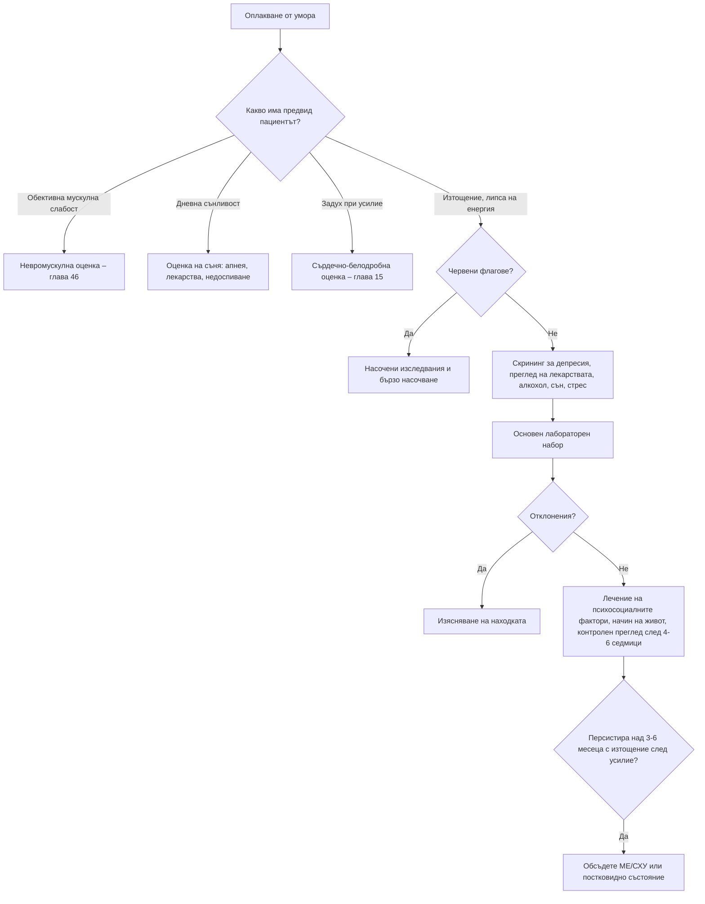

# Глава 5. Умора и отпадналост

> **Част II. Общи симптоми**

## Цели на главата

- Да се изяснява какво има предвид пациентът под „умора“.
- Да се изброяват основните групи причини за умора и тяхната относителна честота в общата практика.
- Да се прилага рационален, ограничен набор от изследвания.
- Да се разпознават червените флагове и маскиращите заболявания.
- Да се прилагат критериите за синдрома на хроничната умора и за постковидното състояние.

## Ключови моменти

- Изяснете какво означава „умора“ за пациента: изтощение, мускулна слабост, дневна сънливост, задух при усилие или апатия. Всяко от тях води към различна диференциална диагноза.
- Най-честите причини в общата практика са психосоциалните, начинът на живот, депресията и нарушенията на съня. При малка част от пациентите се открива соматично заболяване [1, 2].
- Скринирайте за депресия с PHQ-2 при всеки пациент с продължителна умора *(SORT A [3])*.
- При умора над 4–6 седмици без ясна причина е достатъчен ограничен основен набор изследвания: ПКК, СУЕ/CRP, феритин, глюкоза/HbA1c, креатинин, електролити и калций, чернодробни ензими, ТСХ, урина.
- Червените флагове (загуба на тегло, треска, кървене, нова умора след 50 години, обективна слабост, суицидни мисли) налагат насочени изследвания.
- Синдромът на хроничната умора е диагноза след изключване: изтощение след усилие, непълноценен сън и умора над 6 месеца (по NICE – над 3 месеца) *(SORT C [6, 7])*.

---

## 1. Въведение

Умората е едно от най-честите оплаквания в общата практика. Тя е особено трудна за диагностициране, защото е **неспецифична**, субективна и почти винаги многофакторна. При повечето пациенти не се открива конкретно соматично заболяване. Най-чести са психосоциалните причини и начинът на живот [1, 2]. Малкият дял сериозни заболявания обаче налага систематичен подход.

### 1.1. Какво има предвид пациентът?

*Таблица 5.1. Какво има предвид пациентът?*

| Оплакване | Същност | Насочва към |
|---|---|---|
| **Умора (изтощение)** | Липса на енергия, бърза изморяемост, нужда от почивка | Широк кръг причини: психосоциални, анемия, ендокринни, инфекции |
| **Мускулна слабост** | Обективно намалена сила, невъзможност за определени движения (ставане от стол, изкачване на стълби) | Невромускулни заболявания, миопатии, електролитни нарушения (глава 46) |
| **Сънливост през деня** | Заспиване в неподходящи ситуации | Обструктивна сънна апнея, нарколепсия, лекарства, недоспиване |
| **Задух при усилие** | Невъзможност за усилие поради задух | Сърдечни и белодробни заболявания, анемия (глава 15) |
| **Апатия, загуба на интерес** | Липса на мотивация и удоволствие | Депресия (глава 74) |
| **Изморяемост при повтаряне на движението** | Слабост, която се усилва при повторение и намалява след почивка | Миастения гравис |

### 1.2. Продължителност

- **Остра** умора (под 1 месец) – обикновено инфекция, остър стрес или недоспиване.
- **Продължителна** умора (1–6 месеца).
- **Хронична** умора (над 6 месеца).

---

## 2. Етиологична класификация

*Таблица 5.2. Етиологична класификация.*

| Група | Причини |
|---|---|
| **Физиологични и начин на живот** | Недоспиване, претоварване, сменна работа, обездвижване, нередовно хранене, бременност, кърмене, малки деца |
| **Психични** | Депресия, тревожни разстройства, хроничен стрес, професионално „прегаряне“, злоупотреба с алкохол и вещества |
| **Нарушения на съня** | Обструктивна сънна апнея, синдром на неспокойните крака, безсъние, нарколепсия |
| **Лекарства** | Бета-блокери, антихистамини, бензодиазепини и Z-хипнотици, антидепресанти, антипсихотици, опиоиди, антиконвулсанти, мускулни релаксанти, диуретици (чрез хипокалиемия и хипонатриемия), спиране на кортикостероиди, изотретиноин, интерферони |
| **Хематологични** | Анемия, желязодефицит без анемия, хемохроматоза, миелодиспластичен синдром |
| **Ендокринни и метаболитни** | Хипотиреоидизъм, хипертиреоидизъм (особено „апатичният“ при възрастни), захарен диабет, хиперкалциемия, надбъбречна недостатъчност, хипопитуитаризъм, хипогонадизъм при мъже, дефицит на витамин B12, хипонатриемия, хипокалиемия |
| **Инфекциозни** | Постинфекциозна умора (EBV, CMV, грип, COVID-19), хронични хепатити B и C, HIV, туберкулоза, инфекциозен ендокардит, бруцелоза, Ку-треска, лаймска болест |
| **Сърдечни и белодробни** | Сърдечна недостатъчност, клапни пороци, брадиаритмии, ХОББ, белодробна хипертония |
| **Бъбречни и чернодробни** | Хронично бъбречно заболяване, чернодробна цироза, стеатозно чернодробно заболяване |
| **Стомашно-чревни** | Цьолиакия, възпалителни болести на червата, малабсорбция |
| **Неврологични** | Множествена склероза, болест на Parkinson, миастения гравис, след инсулт, след черепно-мозъчна травма |
| **Ревматологични** | Ревматоиден артрит, системен лупус еритематодес, синдром на Sjögren, ревматична полимиалгия, фибромиалгия |
| **Злокачествени** | Всяко злокачествено заболяване, особено лимфоми, левкемии, карцином на панкреаса, стомашно-чревни карциноми |
| **Функционални** | Синдром на хроничната умора (миалгичен енцефаломиелит), постковидно състояние |

---

## 3. Безопасна диагностична стратегия

*Таблица 5.3. Безопасна диагностична стратегия.*

| Въпрос | Отговор |
|---|---|
| **Вероятна диагноза** | Стрес, недоспиване, депресия, тревожност, вирусна или постинфекциозна умора, начин на живот |
| **Сериозни заболявания, които не бива да се пропускат** | Злокачествени заболявания (лимфом, левкемия, солидни тумори); сърдечна недостатъчност; аритмии; тежка анемия (включително от кървене в храносмилателния тракт); надбъбречна недостатъчност; HIV; туберкулоза; ендокардит; депресия със суицидни мисли |
| **Чести капани** | Цьолиакия; обструктивна сънна апнея; хемохроматоза; хиперкалциемия (първичен хиперпаратиреоидизъм); лекарства; алкохол; бременност; постинфекциозна умора; синдром на неспокойните крака; хипогонадизъм |
| **Маскиращи заболявания** | Депресия, захарен диабет, лекарства, анемия, заболявания на щитовидната жлеза, инфекция на пикочните пътища (при възрастни), хронично бъбречно заболяване |
| **Психосоциални аспекти** | Семейни конфликти, насилие, финансови проблеми, претоварване с грижа за болен близък, професионално „прегаряне“ |

---

## 4. Анамнеза

1. **Какво означава „умора“** за пациента (вж. таблицата в т. 1.1).
2. **Начало и продължителност.** Внезапно ли е започнала, например след инфекция? Какво е протичането: постоянно, прогресиращо или вълнообразно?
3. **Денонощен ритъм.** Умората, която е най-силна сутрин и намалява с активността, е типична за депресия. Умората, която се засилва през деня и с усилието, е по-типична за соматично заболяване. Изморяемостта при повтаряне на движението насочва към миастения.
4. **Сън:** количество и качество, хъркане, спиране на дишането по време на сън (сведения от партньора), сутрешно главоболие, дневна сънливост (скала на Epworth), неприятни усещания в краката вечер.
5. **Настроение:** загуба на интерес и удоволствие, безнадеждност, суицидни мисли. Скрининг с два въпроса (PHQ-2) [3]: *„През последните две седмици чувствахте ли се потиснат или безнадежден?“* и *„Имахте ли малко интерес или удоволствие от нещата, които правите?“*
6. **Общи симптоми:** загуба на тегло, треска, нощно изпотяване, лимфни възли.
7. **Симптоми от системите:** задух, болка в гърдите, сърцебиене, промяна в дефекацията, кървене, обилни менструации, полиурия и полидипсия, ставни болки, обриви, студоусещане, запек.
8. **Лекарства, алкохол, кофеин, енергийни напитки, наркотични вещества.**
9. **Социален контекст:** работа, семейство, грижа за близки, финанси, насилие.
10. **Как умората влияе** на ежедневието. Какво според пациента е причината и от какво се страхува?

---

## 5. Физикален преглед

- Тегло и индекс на телесна маса и тяхната динамика, артериално налягане (включително ортостатично), пулс.
- Кожа и лигавици: бледост, жълтеница, хиперпигментация (надбъбречна недостатъчност), сухота, промени в косата, койлонихия.
- Лимфни възли, щитовидна жлеза.
- Сърце и бял дроб: шумове, аритмия, признаци на застой.
- Корем: хепатомегалия, спленомегалия, туморни формации.
- Опорно-двигателен апарат: артрит, болезнени точки.
- Неврологичен статус: мускулна сила (проксимална слабост), изморяемост (продължително гледане нагоре при миастения), рефлекси.
- Психичен статус: настроение, поведение, контакт.

---

## 6. Червени флагове

- Необяснима загуба на тегло (над 5% за 6–12 месеца).
- Треска, нощно изпотяване, лимфаденопатия, хепатоспленомегалия.
- Кървене: ректално, хематурия, постменопаузално, хемоптиза.
- Нова умора след 50-годишна възраст без ясна причина.
- Задух, болка в гърдите, синкоп, отоци.
- Обективна мускулна слабост или фокални неврологични симптоми.
- Суицидни мисли.
- Значително отклонени лабораторни показатели.

---

## 7. Диференциално-диагностична таблица

*Таблица 5.4. Диференциална диагноза на умората.*

| Заболяване | Ключови клинични белези | Потвърждаващи изследвания |
|---|---|---|
| **Депресия** | Потиснато настроение, анхедония, нарушен сън и апетит, умора най-силна сутрин | Клинична диагноза; PHQ-9 |
| **Обструктивна сънна апнея** | Хъркане, паузи в дишането, дневна сънливост, затлъстяване, резистентна хипертония, сутрешно главоболие | Полиграфия или полисомнография; STOP-BANG и Epworth за скрининг [4] |
| **Желязодефицитна анемия** | Бледост, задух при усилие, обилни менструации, стомашно-чревна симптоматика, неспокойни крака | ПКК, феритин (< 30 µg/l) |
| **Хипотиреоидизъм** | Студоусещане, наддаване на тегло, запек, суха кожа, забавени рефлекси | ТСХ, FT4 |
| **Захарен диабет** | Полиурия, полидипсия, загуба на тегло, инфекции | Глюкоза на гладно, HbA1c |
| **Цьолиакия** | Диария или запек, подуване, желязодефицит, остеопороза, херпетиформен дерматит; често липса на стомашно-чревни симптоми | Тъканна трансглутаминаза IgA и общ IgA; дуоденална биопсия [5] |
| **Надбъбречна недостатъчност** | Хиперпигментация, хипотония, загуба на тегло, гадене, хипонатриемия, хиперкалиемия | Сутрешен кортизол, ACTH, тест със синактен |
| **Хиперкалциемия** | Жажда, запек, депресия, бъбречни камъни, болки в костите | Калций (коригиран), ПТХ |
| **Хронично бъбречно заболяване** | Никтурия, сърбеж, отоци, хипертония | Креатинин, eGFR, съотношение албумин/креатинин в урината |
| **Хемохроматоза** | Артропатия на 2-ра и 3-та метакарпофалангеални стави, еректилна дисфункция, диабет, повишени трансаминази | Трансферинова сатурация > 45%, феритин, генетичен тест (HFE) |
| **Хронична инфекция** (HIV, хепатити, туберкулоза) | Рискови фактори, нощно изпотяване, лимфаденопатия | Серология, IGRA, рентгенография |
| **Злокачествено заболяване** | Загуба на тегло, червени флагове според локализацията | Насочени изследвания |
| **Синдром на хроничната умора** | Умора над 6 месеца, изразено влошаване след усилие, непълноценен сън, когнитивни затруднения или ортостатична непоносимост | Диагноза след изключване на други причини |

---

## 8. Изследвания

**Основен набор при умора с давност над 4–6 седмици без ясна причина:**

- ПКК, СУЕ или CRP;
- феритин;
- глюкоза и/или HbA1c;
- креатинин, eGFR, електролити, калций;
- чернодробни ензими;
- ТСХ;
- тест с уринна лента.

**Допълнително според клиничните данни:**

- тъканна трансглутаминаза IgA и общ IgA (цьолиакия);
- витамин B12 и фолиева киселина;
- креатинкиназа (КК) (миопатия);
- тест за бременност;
- HIV, хепатит B и C;
- сутрешен кортизол;
- тестостерон (сутрешен) при мъже със симптоми на хипогонадизъм;
- трансферинова сатурация;
- полиграфия или полисомнография.

**Какво не се препоръчва рутинно:** широки имунологични панели, туморни маркери, изследвания за „хронична“ EBV инфекция или за „надбъбречна умора“ (несъществуваща нозологична единица), както и рутинен витамин D без рискови фактори.

Нормалните резултати от разумно подбрани изследвания имат терапевтична стойност, защото успокояват пациента. Изчерпателното изследване „докато намерим нещо“ обаче поражда случайни находки и поддържа тревожността.

---

## 9. Синдром на хроничната умора и постковидно състояние

### 9.1. Миалгичен енцефаломиелит / синдром на хроничната умора (МЕ/СХУ)

Според критериите на Института по медицина на САЩ (2015) [6] диагнозата изисква **и трите** основни белега:

1. Значително намаляване на дейността спрямо предишното ниво, продължаващо **над 6 месеца**. То се дължи на умора, която е нова, не е резултат от усилие и не се облекчава съществено от почивка.
2. **Изтощение след усилие** (*post-exertional malaise*) – влошаване на симптомите след физическо или психическо натоварване, често забавено и продължаващо дни.
3. **Сън, след който пациентът не се чувства отпочинал.**

Необходим е и поне един от следните белези:

- когнитивни затруднения;
- ортостатична непоносимост.

Британските препоръки (NICE, 2021) [7] допускат диагноза след 3 месеца и предупреждават срещу прилагането на прогресивно нарастващи физически натоварвания.

### 9.2. Постковидно състояние

Според дефиницията на СЗО [8] постковидното състояние обхваща симптомите, които се появяват обикновено до 3 месеца след инфекцията с SARS-CoV-2, продължават поне 2 месеца и не могат да бъдат обяснени с друга диагноза. Най-чести са умората, задухът, когнитивните затруднения („мозъчна мъгла“), изтощението след усилие, сърцебиенето и ортостатичната непоносимост. Преди да се постави тази диагноза, трябва да се изключат усложненията на прекараната инфекция: белодробна тромбемболия, миокардит, фиброза, диабет и депресия.

---

## 10. Диагностичен алгоритъм

*Фигура 5.1. Диагностичен алгоритъм: умора и отпадналост. Схема на авторите въз основа на източниците, цитирани в главата.*

Текстово описание на фигура 5.1

1. Оплакване от умора. Следва: към т. 2.
2. **Въпрос:** Какво има предвид пациентът? Обективна мускулна слабост – към т. 3; Дневна сънливост – към т. 4; Задух при усилие – към т. 5; Изтощение, липса на енергия – към т. 6.
3. Невромускулна оценка – глава 46.
4. Оценка на съня: апнея, лекарства, недоспиване.
5. Сърдечно-белодробна оценка – глава 15.
6. **Въпрос:** Червени флагове? Да – към т. 7; Не – към т. 8.
7. Насочени изследвания и бързо насочване.
8. Скрининг за депресия, преглед на лекарствата, алкохол, сън, стрес. Следва: към т. 9.
9. Основен лабораторен набор. Следва: към т. 10.
10. **Въпрос:** Отклонения? Да – към т. 11; Не – към т. 12.
11. Изясняване на находката.
12. Лечение на психосоциалните фактори, начин на живот, контролен преглед след 4-6 седмици. Следва: към т. 13.
13. **Въпрос:** Персистира над 3-6 месеца с изтощение след усилие? Да – към т. 14.
14. Обсъдете МЕ/СХУ или постковидно състояние.

---

## 11. Особености в общата практика

- Консултацията за умора често е „входен билет“ за психосоциален проблем. Отвореният въпрос *„Какво се случва в живота ви напоследък?“* може да спести много изследвания.
- Прегледът на лекарствата е най-бързото и евтино изследване.
- Тревожността и депресията не изключват соматично заболяване, а соматичното заболяване не изключва депресия. Двете често съжителстват.
- Уговорете контролен преглед. Времето често изяснява картината.

---

## 12. Кога и колко спешно да насочим

*Таблица 5.5. Кога и колко спешно да насочим.*

| Спешност | Клинична ситуация |
|---|---|
| **Незабавно (112 или спешно отделение)** | Умора със синкоп, болка в гърдите, тежък задух или хипотония; суспектна адренална криза (хипотония, повръщане, хипонатриемия, хиперкалиемия); активни суицидни мисли с план |
| **В същия ден** | Тежка анемия (напр. хемоглобин < 70–80 g/l или симптомна); хиперкалциемия със симптоми; нова хипонатриемия под 125 mmol/l; суицидни мисли без непосредствен план – спешна психиатрична оценка |
| **Бързо (до 2 седмици)** | Желязодефицитна анемия при мъж или жена след менопауза; необяснена загуба на тегло, лимфаденопатия или хепатоспленомегалия (подозрение за злокачествено заболяване) |
| **Планово** | Подозрение за обструктивна сънна апнея (полиграфия); цьолиакия с положителни антитела (гастроентеролог за биопсия); персистираща умора над 3–6 месеца с изтощение след усилие |
| **Проследяване в общата практика** | Умора без червени флагове и с нормален основен набор – контролен преглед след 4–6 седмици |

---

## 13. Клинични перли

- Желязодефицитът без анемия (феритин под 30 µg/l) може да причинява умора, особено при жени с обилна менструация. Заместването с желязо намалява умората при тях [9].
- Всяка желязодефицитна анемия при мъж или при жена след менопаузата изисква търсене на източник в храносмилателния тракт.
- Цьолиакията е „великият имитатор“ сред стомашно-чревните заболявания. Често протича без диария, само с умора, желязодефицит или остеопороза.
- Хъркащият пациент с резистентна хипертония и дневна сънливост има обструктивна сънна апнея до доказване на противното.
- Умора, хиперпигментация и хипонатриемия означават надбъбречна недостатъчност. Не пропускайте, защото адреналната криза е животозастрашаваща.
- При възрастни хипертиреоидизмът може да протича с апатия, умора и загуба на тегло, без типичната възбуда.

---

## 14. Клиничен случай

**Етап 1 – представяне.** Жена на 36 години се оплаква от умора от година. Има известно „тревожно-депресивно разстройство“ и приема сертралин без особен ефект. Менструациите ѝ са умерени.

> **Въпрос 1.** Какво трябва да изясните в анамнезата, преди да припишете умората на депресията?

**Етап 2 – допълнителна анамнеза и изследвания.** При разпитване съобщава за подуване на корема и кашави изпражнения 2–3 пъти дневно. Преди две години е имала фрактура на китката след незначителна травма. Хемоглобин 108 g/l, MCV 76 fl, феритин 6 µg/l, ТСХ 2,1 mIU/l. Предишните два курса перорално желязо не са повлияли анемията.

> **Въпрос 2.** Кои данни не пасват на обяснението „депресия“?

> **Въпрос 3.** Какво изследване е показано? Кои са другите възможни причини за рефрактерна желязодефицитна анемия?

Обсъждане и отговори

**Отговор 1.** Какво точно означава „умора“ за пациентката. Стомашно-чревни симптоми, загуба на тегло, менструално кървене, диета. Сън, лекарства и червени флагове. Упоритата умора въпреки лечението на депресията е повод да се потърси соматична причина.

**Отговор 2.** Желязодефицитната анемия без обилна менструация, неповлияването от перорално желязо, стомашно-чревните симптоми и ниско-травматичната фрактура. Те насочват към малабсорбция и най-вече към цьолиакия.

**Отговор 3.** Изследването на избор е тъканна трансглутаминаза IgA заедно с общ IgA, при условие че пациентката приема глутен [5]. Резултатът е силно положителен. Дуоденалната биопсия показва атрофия на въсинките. Другите причини за рефрактерна желязодефицитна анемия са инфекцията с *Helicobacter pylori*, автоимунният атрофичен гастрит, продължаващото окултно кървене, лечението с инхибитори на протонната помпа и неспазването на лечението.

**Поука.** Съществуващата психиатрична диагноза не бива да спира търсенето на соматична причина, когато има обективни отклонения.

---

## Обобщение

- Първата стъпка е да се изясни какво има предвид пациентът под „умора“: изтощение, мускулна слабост, сънливост, задух или апатия.
- Причините са психосоциални, свързани със съня и начина на живот, лекарствени, хематологични, ендокринни, инфекциозни, органни, ревматологични и злокачествени. Често са няколко едновременно.
- Основният лабораторен набор е ограничен и се разширява само според клиничните данни. Изчерпателното изследване „докато намерим нещо“ вреди.
- Червените флагове и маскиращите заболявания (депресия, диабет, лекарства, анемия, щитовидна жлеза, цьолиакия, сънна апнея) трябва да се търсят активно.
- Синдромът на хроничната умора и постковидното състояние се диагностицират по критерии и след изключване на други причини.

## Самопроверка

### Въпроси с един верен отговор

**1.** *(основно ниво)* Жена на 40 години има умора, която е най-силна сутрин и намалява с деня. Не изпитва удоволствие от нищо и спи лошо. Коя е най-вероятната причина?

- **А.** Хипотиреоидизъм
- **Б.** Депресия
- **В.** Миастения гравис
- **Г.** Обструктивна сънна апнея
- **Д.** Сърдечна недостатъчност

Отговор и обосновка

**Верен отговор: Б.** Умората, която е най-силна сутрин и намалява с активността, заедно с анхедония и нарушен сън, е типична за депресия. Потвърждава се с PHQ-9 [3]. При соматичните заболявания (А, Д) умората обикновено се засилва през деня и с усилието. В протича с изморяемост при повтаряне на движението. Г протича с дневна сънливост и хъркане.

**2.** *(основно ниво)* Кое изследване НЕ е част от основния набор при умора над 6 седмици без червени флагове?

- **А.** ПКК
- **Б.** Феритин
- **В.** ТСХ
- **Г.** Туморни маркери
- **Д.** Глюкоза или HbA1c

Отговор и обосновка

**Верен отговор: Г.** Туморните маркери не се препоръчват рутинно при умора. Те имат ниска специфичност и водят до излишни изследвания. А, Б, В и Д са част от разумния основен набор.

**3.** *(напреднало ниво)* Мъж на 52 години има умора, еректилна дисфункция, артралгии на 2-ра и 3-та метакарпофалангеални стави и повишени трансаминази. Кое изследване е най-подходящо?

- **А.** Серология за EBV
- **Б.** Трансферинова сатурация и феритин
- **В.** Ревматоиден фактор
- **Г.** Сутрешен кортизол
- **Д.** Полисомнография

Отговор и обосновка

**Верен отговор: Б.** Съчетанието е типично за наследствена хемохроматоза. Скринингът е трансферинова сатурация (> 45%) и феритин, последвани от генетичен тест (HFE). А, В, Г и Д не отговарят на тази комбинация от белези.

**4.** *(основно ниво)* Хъркащ мъж с индекс на телесна маса 34 kg/m² има резистентна хипертония, дневна сънливост и сутрешно главоболие. Кое е следващото изследване?

- **А.** ЯМР на главата
- **Б.** Полиграфия или полисомнография (след скрининг със STOP-BANG)
- **В.** Холтер на налягането и нищо повече
- **Г.** ЕЕГ
- **Д.** Тест със синактен

Отговор и обосновка

**Верен отговор: Б.** Картината е типична за обструктивна сънна апнея. STOP-BANG и скалата на Epworth помагат при скрининга [4], а диагнозата се потвърждава с полиграфия или полисомнография. А, Г и Д не отговарят на въпроса. В сам по себе си не обяснява сънливостта и хъркането.

**5.** *(напреднало ниво)* Жена на 34 години има умора от 8 месеца. Всяко усилие я „сваля“ за няколко дни, сънят не я отпочива и трудно се концентрира. Основните изследвания са нормални. Кое твърдение е вярно?

- **А.** Диагнозата МЕ/СХУ не може да се постави, защото изследванията са нормални
- **Б.** Картината отговаря на МЕ/СХУ; прогресивно нарастващите физически натоварвания не се препоръчват
- **В.** Необходим е широк имунологичен панел за потвърждение
- **Г.** Трябва да се изследва за „надбъбречна умора“
- **Д.** Най-вероятна е хронична EBV инфекция

Отговор и обосновка

**Верен отговор: Б.** Изтощението след усилие, непълноценният сън, когнитивните затруднения и продължителността над 6 месеца при изключени други причини отговарят на критериите [6]. NICE предупреждава срещу прогресивно нарастващите натоварвания [7]. А е невярно: диагнозата се поставя след изключване. В и Д не се препоръчват рутинно. „Надбъбречната умора“ (Г) не е нозологична единица.

### Задача

Жена на 29 години има умора от 3 месеца. Менструациите ѝ са обилни. Хемоглобинът е 128 g/l, а феритинът – 12 µg/l. Тълкувайте резултатите и предложете план.

Решение

Хемоглобинът е нормален, но феритинът под 15–30 µg/l означава **желязодефицит без анемия**. Той може да причинява умора, особено при жени с обилна менструация, и заместването с желязо я намалява [9]. План: 1) перорално желязо (например през ден за по-добра поносимост) и контрол на феритина и хемоглобина след 2–3 месеца; 2) оценка на обилното менструално кървене (вж. глава 63), включително ТСХ и при нужда изследване за болест на von Willebrand; 3) ако няма обилно кървене или няма отговор на лечението – изследване за цьолиакия и насочване за търсене на стомашно-чревен източник.

### OSCE станция: Анамнеза при умора

**Време:** 8 минути. **Ниво:** основно (студенти).

**Задача за кандидата.** Мъж на 55 години идва, защото се чувства „постоянно изморен“ от 2 месеца. Снемете насочена анамнеза, потърсете червени флагове и маскиращи заболявания и предложете разумен план за изследване.

**Информация за симулирания пациент (за изпитващия).** Хърка силно, съпругата му казва, че „спира да диша“ насън. Заспива пред телевизора, сутрин го боли главата. Приема три лекарства за хипертония. Пие по 3–4 бири вечер. Няма загуба на тегло, кървене и треска. Настроението му е „нормално, но уморено“. Споделя за хъркането само ако бъде попитан за съня.

*Таблица 5.6. OSCE станция „Анамнеза при умора“ – критерии за оценяване.*

| Критерий | Точки |
|---|---|
| Изяснява какво означава „умора“ (изтощение, сънливост, слабост, задух) | 2 |
| Пита за съня: хъркане, паузи в дишането, дневна сънливост, сутрешно главоболие | 2 |
| Скринира за депресия (PHQ-2) | 1 |
| Пита за лекарства, алкохол и кофеин | 1 |
| Търси червени флагове: загуба на тегло, треска, нощно изпотяване, кървене, задух, болка в гърдите | 2 |
| Пита за симптоми на хипотиреоидизъм, диабет и анемия | 1 |
| Предлага ограничен основен лабораторен набор | 1 |
| Предлага скрининг със STOP-BANG и насочване за полиграфия | 1 |
| Обсъжда алкохола без осъждане | 1 |
| **Общо** | **12** |

**Праг за успешно изпълнение:** 8 от 12 точки, включително въпросите за съня и червените флагове.

## Литература

1. Stadje R, Dornieden K, Baum E, Becker A, Biroga T, Bösner S, et al. The differential diagnosis of tiredness: a systematic review. BMC Fam Pract. 2016;17(1):147. doi:10.1186/s12875-016-0545-5. PMID: 27765009.
2. Nijrolder I, van der Windt D, de Vries H, van der Horst H. Diagnoses during follow-up of patients presenting with fatigue in primary care. CMAJ. 2009;181(10):683-7. doi:10.1503/cmaj.090647. PMID: 19858240.
3. Arroll B, Goodyear-Smith F, Crengle S, Gunn J, Kerse N, Fishman T, et al. Validation of PHQ-2 and PHQ-9 to screen for major depression in the primary care population. Ann Fam Med. 2010;8(4):348-53. doi:10.1370/afm.1139. PMID: 20644190.
4. Cho T, Yan E, Chung F. The STOP-Bang questionnaire: A narrative review on its utilization in different populations and settings. Sleep Med Rev. 2024;78:102007. doi:10.1016/j.smrv.2024.102007. PMID: 39270346.
5. Rubio-Tapia A, Hill ID, Semrad C, Kelly CP, Greer KB, Limketkai BN, et al. American College of Gastroenterology Guidelines Update: Diagnosis and Management of Celiac Disease. Am J Gastroenterol. 2023;118(1):59-76. doi:10.14309/ajg.0000000000002075. PMID: 36602836.
6. Institute of Medicine. Beyond Myalgic Encephalomyelitis/Chronic Fatigue Syndrome: Redefining an Illness. Washington, DC: The National Academies Press; 2015. doi:10.17226/19012
7. National Institute for Health and Care Excellence. Myalgic encephalomyelitis (or encephalopathy)/chronic fatigue syndrome: diagnosis and management (NICE guideline NG206). London: NICE; 2021. Достъпно на: https://www.nice.org.uk/guidance/ng206
8. Soriano JB, Murthy S, Marshall JC, Relan P, Diaz JV; WHO Clinical Case Definition Working Group on Post-COVID-19 Condition. A clinical case definition of post-COVID-19 condition by a Delphi consensus. Lancet Infect Dis. 2022;22(4):e102-e107. doi:10.1016/S1473-3099(21)00703-9. PMID: 34951953.
9. Vaucher P, Druais PL, Waldvogel S, Favrat B. Effect of iron supplementation on fatigue in nonanemic menstruating women with low ferritin: a randomized controlled trial. CMAJ. 2012;184(11):1247-54. doi:10.1503/cmaj.110950. PMID: 22777991.

*Последна проверка на съдържанието: септември 2026 г. Следващ планиран преглед: септември 2027 г. (вж. „Политика за актуализация“ в README).*

<!-- навигация -->

---

[← Глава 4. Треска и треска с неясен произход](04-treska.md) · [Съдържание](../README.md) · [Глава 6. Промени в телесното тегло →](06-teglo.md)
