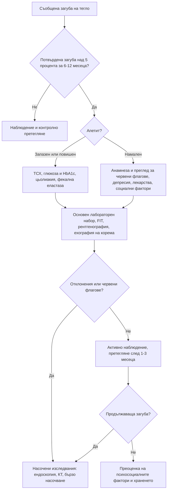

# Глава 6. Промени в телесното тегло

> **Част II. Общи симптоми**

## Цели на главата

- Да се дефинира клинично значимата неволева загуба на тегло и да се оцени рискът от злокачествено заболяване.
- Да се познават основните групи причини за загуба и за наддаване на тегло.
- Да се прилага стъпаловиден подход към изследванията.
- Да се разпознават хранителните разстройства и лекарствените причини.

---

## А. НЕВОЛЕВА ЗАГУБА НА ТЕГЛО

## 1. Определение и значение

**Клинично значима неволева загуба на тегло** е загубата на над **5% от телесното тегло за 6–12 месеца** без съзнателни усилия. Тя е независим предиктор на заболеваемостта и смъртността, особено при възрастни хора.

- **Първа стъпка:** потвърдете загубата чрез документирани измервания, чрез промяната в размера на дрехите или чрез сведения от близките. Около половината от пациентите, които съобщават за отслабване, не са загубили обективно тегло.
- **Рискът от злокачествено заболяване** зависи силно от възрастта, пола и тютюнопушенето. При мъже над 50 години и при пушачи неочакваната загуба на тегло носи достатъчно висок риск (положителна предсказваща стойност над 3%), за да оправдае насочени изследвания.

## 2. Етиологична класификация

| Група | Заболявания |
|---|---|
| **Злокачествени** | Стомашно-чревни (стомах, панкреас, дебело черво, хранопровод, черен дроб), бял дроб, лимфоми и левкемии, простата, бъбрек, яйчник |
| **Стомашно-чревни (незлокачествени)** | Пептична язва, цьолиакия, възпалителни болести на червата, хроничен панкреатит и екзокринна недостатъчност на панкреаса, дисфагия, мезентериална исхемия („страх от храна“), жлъчнокаменна болест |
| **Ендокринни и метаболитни** | Хипертиреоидизъм, новооткрит или декомпенсиран захарен диабет, надбъбречна недостатъчност, феохромоцитом, хиперкалциемия |
| **Психични** | Депресия, тревожност, хранителни разстройства (анорексия и булимия), деменция, психози, злоупотреба с алкохол и вещества |
| **Хронична органна недостатъчност** | Сърдечна кахексия, ХОББ, хронично бъбречно заболяване, чернодробна цироза |
| **Инфекции** | Туберкулоза, HIV, инфекциозен ендокардит, бруцелоза, хронични паразитози |
| **Ревматологични** | Ревматоиден артрит, гигантоклетъчен артериит и ревматична полимиалгия, васкулити, системен лупус еритематодес |
| **Неврологични** | Болест на Parkinson, мозъчен инсулт (дисфагия), амиотрофична латерална склероза, деменция |
| **Лекарства** | Агонисти на GLP-1 рецепторите, SGLT2 инхибитори, метформин, топирамат, дигоксин, предозиране на левотироксин, стимуланти, бупропион; НСПВС (чрез диспепсия); полипрагмазия |
| **Устна кухина** | Лошо състояние на зъбите, неподходящи протези, стоматит, нарушен вкус и обоняние |
| **Социални** | Бедност, самота, невъзможност за пазаруване и готвене, пренебрегване и насилие над възрастни хора |

### 2.1. Мнемоника за възрастни хора: MEALS ON WHEELS

| Буква | Причина |
|---|---|
| **M** | *Medications* — лекарства |
| **E** | *Emotional problems* — депресия |
| **A** | *Anorexia tardive, alcoholism* — късна анорексия, алкохолизъм |
| **L** | *Late-life paranoia* — параноидни състояния в напреднала възраст |
| **S** | *Swallowing disorders* — нарушения на гълтането |
| **O** | *Oral factors* — зъби, протези, стоматит |
| **N** | *No money* — бедност |
| **W** | *Wandering* — деменция със скитане |
| **H** | *Hyperthyroidism, hypercalcaemia, hypoadrenalism* — ендокринни причини |
| **E** | *Enteric problems* — малабсорбция |
| **E** | *Eating problems* — невъзможност за самостоятелно хранене |
| **L** | *Low-salt, low-cholesterol diets* — прекомерни диетични ограничения |
| **S** | *Shopping and food preparation problems* — невъзможност за пазаруване и готвене |

### 2.2. Апетитът като ключов белег

| Апетит | Насочва към |
|---|---|
| **Запазен или повишен** | Хипертиреоидизъм, захарен диабет, малабсорбция (цьолиакия, панкреатична недостатъчност), феохромоцитом, повишена физическа активност, булимия |
| **Намален** | Злокачествено заболяване, депресия, хронична органна недостатъчност, хронична инфекция, лекарства, алкохол, деменция |

## 3. Безопасна диагностична стратегия

| Въпрос | Отговор |
|---|---|
| **Вероятна диагноза** | Депресия и психосоциални фактори, злокачествено заболяване (при по-възрастните), стомашно-чревни заболявания, лекарства |
| **Сериозни заболявания, които не бива да се пропускат** | Карциноми (панкреас, стомах, хранопровод, дебело черво, бял дроб), лимфоми, HIV, туберкулоза, ендокардит, надбъбречна недостатъчност, диабет тип 1 с риск от кетоацидоза |
| **Чести капани** | Хипертиреоидизъм при възрастни (апатичен), цьолиакия, хранителни разстройства, дисфагия, зъбни проблеми, алкохол, лекарства (включително новите средства за отслабване), социални причини |
| **Маскиращи заболявания** | Депресия, захарен диабет, лекарства, заболявания на щитовидната жлеза, хронично бъбречно заболяване, злокачествени заболявания |
| **Психосоциални аспекти** | Самота, загуба на близък, бедност, насилие, нарушен образ на тялото |

## 4. Анамнеза и физикален преглед

**Анамнеза:**

- Колко килограма, за какъв период и дали загубата продължава.
- Апетит, количество и вид на храната, дентален статус.
- Гълтане, диспепсия, коремни болки, промяна в дефекацията, мазни изпражнения, кървене.
- Кашлица, хемоптиза, задух.
- Треска, нощно изпотяване, лимфни възли.
- Полиурия и полидипсия, топлоусещане, сърцебиене, тремор.
- Настроение, сън, когнитивни функции.
- Лекарства (включително съвсем новите средства за отслабване), алкохол, тютюнопушене.
- Социално положение: кой пазарува и готви, с кого живее пациентът.

**Физикален преглед:**

- Тегло, ръст, индекс на телесна маса, обиколка на мишницата. Признаци на саркопения и загуба на мастна тъкан.
- Кожа и лигавици: бледост, жълтеница, хиперпигментация.
- Устна кухина, зъби, щитовидна жлеза.
- Лимфни възли, особено **левият надключичен възел** (възел на Virchow).
- Сърце и бял дроб.
- Корем: формации, хепатомегалия, асцит.
- Ректално туше, гърди, простата (според показанията).
- Когнитивна оценка и скрининг за депресия.

## 5. Червени флагове

- Възраст над 50 години, тютюнопушене.
- Дисфагия, упорито повръщане, стомашно-чревно кървене, промяна в дефекацията.
- Хемоптиза, нова кашлица над 3 седмици.
- Лимфаденопатия, формация в корема, хепатомегалия, жълтеница.
- Треска и нощно изпотяване.
- **Новооткрит захарен диабет със загуба на тегло след 60-годишна възраст** (карцином на панкреаса).
- Анемия, тромбоцитоза, хиперкалциемия, повишена СУЕ.

## 6. Изследвания

**Първи етап (основен набор):**

- ПКК, СУЕ, CRP;
- електролити, креатинин, калций, глюкоза и HbA1c;
- чернодробни ензими, албумин;
- ТСХ;
- общо изследване на урината;
- **имунохимичен тест за окултна кръв в изпражненията (FIT)**;
- рентгенография на гръден кош;
- тъканна трансглутаминаза IgA;
- HIV и хепатити при рискови фактори;
- ехография на корема.

**Втори етап (насочено, според находките):**

- горна ендоскопия и колоноскопия;
- КТ на гръден кош, корем и таз;
- ПСА (след информиране на пациента);
- фекална еластаза;
- IGRA (туберкулоза);
- сутрешен кортизол.

**Когато първоначалната оценка е напълно нормална** (анамнеза, преглед и основен набор изследвания), вероятността за злокачествено заболяване е ниска. В тези случаи **активното наблюдение** с контролно претегляне след 1–3 месеца е по-оправдано от „сляпото“ изчерпателно изследване.

## 7. Хранителни разстройства

**Анорексия нервоза.** Ограничаване на храната, изразен страх от напълняване, нарушен образ на тялото, ниско тегло (ИТМ обикновено под 18,5 kg/m²). Често съпровождащи находки са брадикардия, хипотония, хипотермия, аменорея, лануго-подобно окосмяване и остеопороза.

**Булимия нервоза.** Епизоди на преяждане и компенсаторно поведение. Теглото често е нормално. Насочващи белези са хипокалиемичната метаболитна алкалоза (при повръщане), уголемените паротидни жлези, ерозиите на зъбния емайл и мазолите по гърба на ръката (белег на Russell).

**Скрининг с въпросника SCOFF.** Два или повече положителни отговора насочват към хранително разстройство:

1. Предизвиквате ли повръщане, защото се чувствате неприятно преяли?
2. Тревожите ли се, че сте загубили контрол върху количеството храна?
3. Загубили ли сте над 6 kg за 3 месеца?
4. Смятате ли, че сте дебели, докато другите казват, че сте слаби?
5. Храната доминира ли живота ви?

**Диференциална диагноза.** Преди да се приеме хранително разстройство, трябва да се изключат хипертиреоидизмът, диабетът тип 1, цьолиакията, възпалителните болести на червата, надбъбречната недостатъчност и хипоталамичните тумори.

---

## Б. НАДДАВАНЕ НА ТЕГЛО

## 8. Причини за наддаване на тегло

| Група | Причини и насочващи белези |
|---|---|
| **Начин на живот** | Най-честата причина: енергиен дисбаланс, обездвижване, недоспиване, спиране на тютюнопушенето |
| **Лекарства** | Антипсихотици (оланзапин, клозапин, кветиапин), антидепресанти (миртазапин, трициклични, пароксетин), литий, валпроат, габапентиноиди, инсулин, сулфонилурейни производни, пиоглитазон, кортикостероиди, депо-медроксипрогестерон, по-старите бета-блокери |
| **Ендокринни** | **Хипотиреоидизъм** (обикновено умерено наддаване, главно от задръжка на течности); **синдром на Cushing** (централно затлъстяване, лице с форма на луна, пурпурни стрии с ширина над 1 cm, проксимална миопатия, лесни кръвонасядания, хипертония, диабет); **синдром на поликистозните яйчници**; дефицит на растежен хормон; хипоталамични лезии; инсулином (рядко) |
| **Физиологични** | Бременност, менопауза, възраст |
| **Психични** | Депресия (атипична), разстройство с епизоди на преяждане, синдром на нощното хранене |
| **Задръжка на течности** | Сърдечна недостатъчност, нефрозен синдром, цироза с асцит, хипотиреоидизъм. **Бързото наддаване** (над 2 kg за 3 дни) означава течност, а не мазнина |
| **Коремна формация** | Големи тумори на яйчниците, асцит (увеличаване на обиколката на корема при загуба на мускулна маса по крайниците) |
| **Генетични синдроми** | Prader-Willi, дефицит на MC4R рецептора (рядко, при затлъстяване от ранна детска възраст) |

**Кога да се търси синдром на Cushing.** Скринингът не е рутинен при всеки пациент със затлъстяване. Показан е при:

- съчетание на специфични белези: проксимална миопатия, широки пурпурни стрии, лесни кръвонасядания, плетора на лицето;
- необичайни за възрастта находки: остеопороза или хипертония при млад човек;
- прогресиране на няколко белега едновременно;
- надбъбречен инциденталом.

Пациентът винаги се пита за **прием на кортикостероиди** под каквато и да е форма, включително инхалаторни, кожни и вътреставни. Това е най-честата причина за кушингоиден фенотип.

## 9. Диагностичен алгоритъм при загуба на тегло

## 10. Клинични перли

- Претегляйте пациента при всяко посещение. Документираната динамика на теглото е безценна.
- Загубата на тегло при запазен апетит насочва към хипертиреоидизъм, диабет или малабсорбция.
- Новооткрит диабет със загуба на тегло при възрастен човек (особено над 60 години) изисква изключване на карцином на панкреаса.
- При възрастни хипертиреоидизмът може да протича с апатия, загуба на тегло и предсърдно мъждене, без тремор и възбуда.
- Проверявайте за нелегален и нерегламентиран прием на средства за отслабване, включително закупени онлайн. Те могат да съдържат хормони на щитовидната жлеза, диуретици или стимуланти.
- Бързото наддаване означава течност. Потърсете отоци, асцит и признаци на сърдечна недостатъчност.

## 11. Клиничен случай

**Случай.** Мъж на 64 години, пушач, е отслабнал с 8 kg за 4 месеца. Отдава го на „стрес“ и на лошия апетит. Съобщава и за тъпа болка в епигастриума, която се отразява към гърба и се засилва в легнало положение. Преди месец при профилактичен преглед е открита глюкоза на гладно 9,8 mmol/l и HbA1c 7,6% (60 mmol/mol) и е поставена диагноза „захарен диабет тип 2“. Няма фамилна обремененост за диабет. Индексът на телесната му маса е 22 kg/m². При прегледа склерите са субиктерични.

**Въпроси.** 1) Кои данни не отговарят на обикновен диабет тип 2? 2) Кое е изследването на избор?

**Обсъждане.** Диабетът тип 2 обикновено се съчетава със затлъстяване и фамилна обремененост и не протича със загуба на тегло преди лечението. Новооткрит диабет при слаб възрастен човек, загуба на тегло, епигастрална болка, отразяваща се към гърба и засилваща се в легнало положение, тютюнопушене и субиктер са **класическа картина на карцином на панкреаса**. Изследването на избор е **КТ на корема с контраст по панкреатичен протокол**. Туморният маркер CA 19-9 не е подходящ за диагноза, но може да бъде полезен за проследяване. КТ установява формация в главата на панкреаса с дилатация на жлъчния и панкреатичния канал („знак на двойния канал“).

**Поука.** „Етикетът“ диабет тип 2 не бива да се поставя механично. Необичайният фенотип трябва да предизвика въпроса *„Защо този човек е развил диабет точно сега?“*.

<!-- навигация -->

---

[← Глава 5. Умора и отпадналост](05-umora.md) · [Съдържание](../README.md) · [Глава 7. Лимфаденопатия и спленомегалия →](07-limfadenopatia.md)
