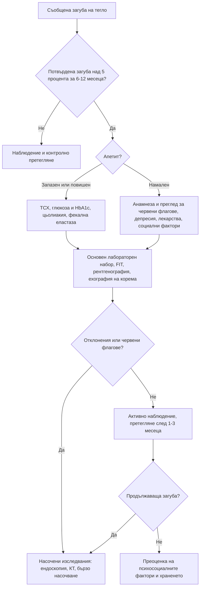

# Глава 6. Промени в телесното тегло

> **Част II. Общи симптоми**

## Цели на главата

- Да се дефинира клинично значимата неволева загуба на тегло и да се оцени рискът от злокачествено заболяване.
- Да се изброяват основните групи причини за загуба и за наддаване на тегло.
- Да се прилага стъпаловиден подход към изследванията.
- Да се разпознават хранителните разстройства и лекарствените причини.

## Ключови моменти

- Клинично значима е неволевата загуба на над 5% от теглото за 6–12 месеца. Първо я потвърдете обективно: около половината от пациентите, които съобщават за отслабване, не са загубили тегло.
- Рискът от злокачествено заболяване надвишава 3% при мъже на 50 и повече години и при жени на 60 и повече години с неочаквана загуба на тегло. При тях са оправдани насочени изследвания *(SORT B [1, 3])*.
- Апетитът е ключов белег: запазеният апетит насочва към хипертиреоидизъм, диабет и малабсорбция, а намаленият – към злокачествено заболяване, депресия, органна недостатъчност и лекарства.
- Основният набор включва ПКК, СУЕ, CRP, биохимия с калций, ТСХ, урина, FIT, рентгенография на гръден кош и ехография на корема. При нормална първоначална оценка активното наблюдение с претегляне след 1–3 месеца е по-оправдано от „сляпото“ изчерпателно изследване.
- Новооткрит диабет със загуба на тегло след 60 години е червен флаг за карцином на панкреаса [8].
- При наддаване на тегло най-честите причини са начинът на живот и лекарствата. Скрининг за синдром на Cushing е показан само при специфични белези *(SORT B [7])*.

---

## А. Неволева загуба на тегло

### 1. Определение и значение

Клинично значима неволева загуба на тегло е загубата на над 5% от телесното тегло за 6–12 месеца без съзнателни усилия. Тя е независим предиктор на заболеваемостта и смъртността, особено при възрастни хора.

- **Първа стъпка:** потвърдете загубата чрез документирани измервания, чрез промяната в размера на дрехите или чрез сведения от близките. Около половината от пациентите, които съобщават за отслабване, не са загубили обективно тегло.
- **Рискът от злокачествено заболяване** зависи силно от възрастта, пола и тютюнопушенето. При мъже на 50 и повече години и при жени на 60 и повече години неочакваната загуба на тегло носи достатъчно висок риск (положителна предсказваща стойност над 3%), за да оправдае насочени изследвания. Тютюнопушенето и съпътстващите симптоми увеличават риска и при по-млади хора [1, 2]. По NICE NG12 (актуализация 2026) при хора на 60 и повече години с необяснена загуба на над 5% от теглото за 6 месеца се търсят допълнителни симптоми и находки и се предлагат спешни изследвания или бързо насочване при подозрение за карцином или за неспецифични симптоми [3].

### 2. Етиологична класификация

*Таблица 6.1. Неволева загуба на тегло: етиологична класификация.*

| Група | Заболявания |
|---|---|
| **Злокачествени** | Стомашно-чревни (стомах, панкреас, дебело черво, хранопровод, черен дроб), бял дроб, лимфоми и левкемии, простата, бъбрек, яйчник |
| **Стомашно-чревни (незлокачествени)** | Пептична язва, цьолиакия, възпалителни болести на червата, хроничен панкреатит и екзокринна недостатъчност на панкреаса, дисфагия, мезентериална исхемия („страх от храна“), жлъчнокаменна болест |
| **Ендокринни и метаболитни** | Хипертиреоидизъм, новооткрит или декомпенсиран захарен диабет, надбъбречна недостатъчност, феохромоцитом, хиперкалциемия |
| **Психични** | Депресия, тревожност, хранителни разстройства (анорексия и булимия), деменция, психози, злоупотреба с алкохол и вещества |
| **Хронична органна недостатъчност** | Сърдечна кахексия, ХОББ, хронично бъбречно заболяване, чернодробна цироза |
| **Инфекции** | Туберкулоза, HIV, инфекциозен ендокардит, бруцелоза, хронични паразитози |
| **Ревматологични** | Ревматоиден артрит, гигантоклетъчен артериит и ревматична полимиалгия, васкулити, системен лупус еритематодес |
| **Неврологични** | Болест на Parkinson, мозъчен инсулт (дисфагия), амиотрофична латерална склероза, деменция |
| **Лекарства** | Агонисти на GLP-1 рецепторите, SGLT2 инхибитори, метформин, топирамат, дигоксин, предозиране на левотироксин, стимуланти, бупропион; НСПВС (чрез диспепсия); полипрагмазия |
| **Устна кухина** | Лошо състояние на зъбите, неподходящи протези, стоматит, нарушен вкус и обоняние |
| **Социални** | Бедност, самота, невъзможност за пазаруване и готвене, пренебрегване и насилие над възрастни хора |

#### 2.1. Мнемоника за възрастни хора: MEALS ON WHEELS [4]

*Таблица 6.2. Мнемоника за възрастни хора: MEALS ON WHEELS.*

| Буква | Причина |
|---|---|
| **M** | *Medications* – лекарства |
| **E** | *Emotional problems* – депресия |
| **A** | *Anorexia tardive, alcoholism* – късна анорексия, алкохолизъм |
| **L** | *Late-life paranoia* – параноидни състояния в напреднала възраст |
| **S** | *Swallowing disorders* – нарушения на гълтането |
| **O** | *Oral factors* – зъби, протези, стоматит |
| **N** | *No money* – бедност |
| **W** | *Wandering* – деменция със скитане |
| **H** | *Hyperthyroidism, hypercalcaemia, hypoadrenalism* – ендокринни причини |
| **E** | *Enteric problems* – малабсорбция |
| **E** | *Eating problems* – невъзможност за самостоятелно хранене |
| **L** | *Low-salt, low-cholesterol diets* – прекомерни диетични ограничения |
| **S** | *Shopping and food preparation problems* – невъзможност за пазаруване и готвене |

#### 2.2. Апетитът като ключов белег

*Таблица 6.3. Апетитът като ключов белег.*

| Апетит | Насочва към |
|---|---|
| **Запазен или повишен** | Хипертиреоидизъм, захарен диабет, малабсорбция (цьолиакия, панкреатична недостатъчност), феохромоцитом, повишена физическа активност, булимия |
| **Намален** | Злокачествено заболяване, депресия, хронична органна недостатъчност, хронична инфекция, лекарства, алкохол, деменция |

### 3. Безопасна диагностична стратегия

*Таблица 6.4. Неволева загуба на тегло: безопасна диагностична стратегия.*

| Въпрос | Отговор |
|---|---|
| **Вероятна диагноза** | Депресия и психосоциални фактори, злокачествено заболяване (при по-възрастните), стомашно-чревни заболявания, лекарства |
| **Сериозни заболявания, които не бива да се пропускат** | Карциноми (панкреас, стомах, хранопровод, дебело черво, бял дроб), лимфоми, HIV, туберкулоза, ендокардит, надбъбречна недостатъчност, диабет тип 1 с риск от кетоацидоза |
| **Чести капани** | Хипертиреоидизъм при възрастни (апатичен), цьолиакия, хранителни разстройства, дисфагия, зъбни проблеми, алкохол, лекарства (включително новите средства за отслабване), социални причини |
| **Маскиращи заболявания** | Депресия, захарен диабет, лекарства, заболявания на щитовидната жлеза, хронично бъбречно заболяване, злокачествени заболявания |
| **Психосоциални аспекти** | Самота, загуба на близък, бедност, насилие, нарушен образ на тялото |

### 4. Анамнеза и физикален преглед

**Анамнеза:**

- Колко килограма, за какъв период и дали загубата продължава.
- Апетит, количество и вид на храната, състояние на зъбите.
- Гълтане, диспепсия, коремни болки, промяна в дефекацията, мазни изпражнения, кървене.
- Кашлица, хемоптиза, задух.
- Треска, нощно изпотяване, лимфни възли.
- Полиурия и полидипсия, топлоусещане, сърцебиене, тремор.
- Настроение, сън, когнитивни функции.
- Лекарства (включително съвсем новите средства за отслабване), алкохол, тютюнопушене.
- Социално положение: кой пазарува и готви, с кого живее пациентът.

**Физикален преглед:**

- Тегло, ръст, индекс на телесна маса, обиколка на мишницата. Признаци на саркопения и загуба на мастна тъкан.
- Кожа и лигавици: бледост, жълтеница, хиперпигментация.
- Устна кухина, зъби, щитовидна жлеза.
- Лимфни възли, особено **левият надключичен възел** (възел на Virchow).
- Сърце и бял дроб.
- Корем: формации, хепатомегалия, асцит.
- Ректално туше, гърди, простата (според показанията).
- Когнитивна оценка и скрининг за депресия.

### 5. Червени флагове

- Възраст над 50 години, тютюнопушене.
- Дисфагия, упорито повръщане, стомашно-чревно кървене, промяна в дефекацията.
- Хемоптиза, нова кашлица над 3 седмици.
- Лимфаденопатия, формация в корема, хепатомегалия, жълтеница.
- Треска и нощно изпотяване.
- **Новооткрит захарен диабет със загуба на тегло след 60-годишна възраст** (карцином на панкреаса).
- Анемия, тромбоцитоза, хиперкалциемия, повишена СУЕ.

### 6. Изследвания

**Първи етап (основен набор):**

- ПКК, СУЕ, CRP;
- електролити, креатинин, калций, глюкоза и HbA1c;
- чернодробни ензими, албумин;
- ТСХ;
- общо изследване на урината;
- **имунохимичен тест за окултна кръв в изпражненията (FIT)**;
- рентгенография на гръден кош;
- антитела срещу тъканната трансглутаминаза (IgA);
- HIV и хепатити при рискови фактори;
- ехография на корема.

**Втори етап (насочено, според находките):**

- горна ендоскопия и колоноскопия;
- КТ на гръден кош, корем и таз;
- ПСА (след информиране на пациента);
- фекална еластаза;
- IGRA (туберкулоза);
- сутрешен кортизол.

Когато първоначалната оценка е напълно нормална (анамнеза, преглед и основен набор изследвания), вероятността за злокачествено заболяване е ниска. В тези случаи активното наблюдение с контролно претегляне след 1–3 месеца е по-оправдано от „сляпото“ изчерпателно изследване.

### 7. Хранителни разстройства

**Анорексия нервоза.** Ограничаване на храната, изразен страх от напълняване, нарушен образ на тялото, ниско тегло (ИТМ обикновено под 18,5 kg/m²). Често съпровождащи находки са брадикардия, хипотония, хипотермия, аменорея, окосмяване тип лануго и остеопороза.

**Булимия нервоза.** Епизоди на преяждане и компенсаторно поведение. Теглото често е нормално. Насочващи белези са хипокалиемичната метаболитна алкалоза (при повръщане), уголемените паротидни жлези, ерозиите на зъбния емайл и мазолите по гърба на ръката (белег на Russell).

**Скрининг с въпросника SCOFF.** Два или повече положителни отговора насочват към хранително разстройство [5, 6]:

1. Предизвиквате ли повръщане, защото се чувствате неприятно преяли?
2. Тревожите ли се, че сте загубили контрол върху количеството храна?
3. Загубили ли сте над 6 kg за 3 месеца?
4. Смятате ли, че сте дебели, докато другите казват, че сте слаби?
5. Храната доминира ли живота ви?

**Диференциална диагноза.** Преди да се приеме хранително разстройство, трябва да се изключат хипертиреоидизмът, диабетът тип 1, цьолиакията, възпалителните болести на червата, надбъбречната недостатъчност и хипоталамичните тумори.

---

## Б. Наддаване на тегло

### 8. Причини за наддаване на тегло

*Таблица 6.5. Причини за наддаване на тегло.*

| Група | Причини и насочващи белези |
|---|---|
| **Начин на живот** | Най-честата причина: енергиен дисбаланс, обездвижване, недоспиване, спиране на тютюнопушенето |
| **Лекарства** | Антипсихотици (оланзапин, клозапин, кветиапин), антидепресанти (миртазапин, трициклични, пароксетин), литий, валпроат, габапентиноиди, инсулин, сулфонилурейни производни, пиоглитазон, кортикостероиди, депо-медроксипрогестерон, по-старите бета-блокери |
| **Ендокринни** | Хипотиреоидизъм (обикновено умерено наддаване, главно от задръжка на течности); синдром на Cushing (централно затлъстяване, лице с форма на луна, пурпурни стрии с ширина над 1 cm, проксимална миопатия, лесни кръвонасядания, хипертония, диабет); синдром на поликистозните яйчници; дефицит на растежен хормон; хипоталамични лезии; инсулином (рядко) |
| **Физиологични** | Бременност, менопауза, възраст |
| **Психични** | Депресия (атипична), разстройство с епизоди на преяждане, синдром на нощното хранене |
| **Задръжка на течности** | Сърдечна недостатъчност, нефрозен синдром, цироза с асцит, хипотиреоидизъм. Бързото наддаване (над 2 kg за 3 дни) означава течност, а не мазнина |
| **Коремна формация** | Големи тумори на яйчниците, асцит (увеличаване на обиколката на корема при загуба на мускулна маса по крайниците) |
| **Генетични синдроми** | Prader-Willi, дефицит на MC4R рецептора (рядко, при затлъстяване от ранна детска възраст) |

**Кога да се търси синдром на Cushing.** Скринингът не е рутинен при всеки пациент със затлъстяване. Показан е при [7]:

- съчетание на специфични белези: проксимална миопатия, широки пурпурни стрии, лесни кръвонасядания, плетора на лицето;
- необичайни за възрастта находки: остеопороза или хипертония при млад човек;
- прогресиране на няколко белега едновременно;
- надбъбречен инциденталом.

Пациентът винаги се пита за **прием на кортикостероиди** под каквато и да е форма, включително инхалаторни, кожни и вътреставни. Това е най-честата причина за кушингоиден фенотип.

## 9. Диагностичен алгоритъм при загуба на тегло

*Фигура 6.1. Диагностичен алгоритъм при загуба на тегло. Схема на авторите въз основа на източниците, цитирани в главата.*

Текстово описание на фигура 6.1

1. Съобщена загуба на тегло. Следва: към т. 2.
2. **Въпрос:** Потвърдена загуба над 5 процента за 6-12 месеца? Не – към т. 3; Да – към т. 4.
3. Наблюдение и контролно претегляне.
4. **Въпрос:** Апетит? Запазен или повишен – към т. 5; Намален – към т. 6.
5. ТСХ, глюкоза и HbA1c, цьолиакия, фекална еластаза. Следва: към т. 7.
6. Анамнеза и преглед за червени флагове, депресия, лекарства, социални фактори. Следва: към т. 7.
7. Основен лабораторен набор, FIT, рентгенография, ехография на корема. Следва: към т. 8.
8. **Въпрос:** Отклонения или червени флагове? Да – към т. 9; Не – към т. 10.
9. Насочени изследвания: ендоскопия, КТ, бързо насочване.
10. Активно наблюдение, претегляне след 1-3 месеца. Следва: към т. 11.
11. **Въпрос:** Продължаваща загуба? Да – към т. 9; Не – към т. 12.
12. Преоценка на психосоциалните фактори и храненето.

## 10. Кога и колко спешно да насочим

*Таблица 6.6. Кога и колко спешно да насочим.*

| Спешност | Клинична ситуация |
|---|---|
| **Незабавно (112 или спешно отделение)** | Тежка дехидратация, хипотония или електролитни нарушения при анорексия нервоза или упорито повръщане; диабетна кетоацидоза при новооткрит диабет |
| **В същия ден** | Анорексия нервоза с ИТМ под 13–15 kg/m², брадикардия под 40/min, хипотония, хипокалиемия или синкоп (риск от сърдечни усложнения); суицидни мисли |
| **Бързо (до 2 седмици, подозрение за карцином)** | Загуба на тегло с червени флагове: дисфагия, стомашно-чревно кървене, жълтеница, коремна формация, лимфаденопатия, хемоптиза; новооткрит диабет със загуба на тегло след 60 години; мъж ≥ 50 или жена ≥ 60 години с необяснена загуба на тегло |
| **Планово** | Подозрение за цьолиакия или малабсорбция; хранително разстройство без показатели за тежест (специализиран екип); подозрение за синдром на Cushing |
| **Проследяване в общата практика** | Нормална първоначална оценка – претегляне след 1–3 месеца и преоценка на психосоциалните фактори |

---

## 11. Клинични перли

- Претегляйте пациента при всяко посещение. Документираната динамика на теглото е безценна.
- Загубата на тегло при запазен апетит насочва към хипертиреоидизъм, диабет или малабсорбция.
- Новооткрит диабет със загуба на тегло при възрастен човек (особено над 60 години) изисква изключване на карцином на панкреаса [8].
- При възрастни хипертиреоидизмът може да протича с апатия, загуба на тегло и предсърдно мъждене, без тремор и възбуда.
- Проверявайте за нелегален и нерегламентиран прием на средства за отслабване, включително закупени онлайн. Те могат да съдържат хормони на щитовидната жлеза, диуретици или стимуланти.
- Бързото наддаване означава течност. Потърсете отоци, асцит и признаци на сърдечна недостатъчност.

## 12. Клиничен случай

**Етап 1 – клинична картина.** Мъж на 64 години, пушач, е отслабнал с 8 kg за 4 месеца. Отдава го на „стрес“ и на лошия апетит. Съобщава и за тъпа болка в епигастриума, която се отразява към гърба и се засилва в легнало положение.

> **Въпрос 1.** Кои червени флагове има пациентът?

**Етап 2 – допълнителни данни.** Преди месец при профилактичен преглед е открита глюкоза на гладно 9,8 mmol/l и HbA1c 7,6% (60 mmol/mol) и е поставена диагноза „захарен диабет тип 2“. Няма фамилна обремененост за диабет. Индексът на телесната му маса е 22 kg/m². При прегледа склерите са субиктерични.

> **Въпрос 2.** Кои данни не отговарят на обикновен диабет тип 2?

> **Въпрос 3.** Кое е изследването на избор?

Обсъждане и отговори

**Отговор 1.** Възраст над 50 години, тютюнопушене, загуба на 8 kg (около 10% от теглото) за 4 месеца и нова коремна болка, отразяваща се към гърба. Всеки от тях поотделно изисква насочени изследвания.

**Отговор 2.** Диабетът тип 2 обикновено се съчетава със затлъстяване и фамилна обремененост и не протича със загуба на тегло преди лечението. Новооткрит диабет при слаб възрастен човек, загуба на тегло, епигастрална болка, отразяваща се към гърба и засилваща се в легнало положение, тютюнопушене и субиктер са **класическа картина на карцином на панкреаса** [8].

**Отговор 3.** Изследването на избор е **КТ на корема с контраст по панкреатичен протокол**. Туморният маркер CA 19-9 не е подходящ за диагноза, но може да бъде полезен за проследяване. КТ установява формация в главата на панкреаса с дилатация на жлъчния и панкреатичния канал („знак на двойния канал“).

**Поука.** „Етикетът“ диабет тип 2 не бива да се поставя механично. Необичайният фенотип трябва да предизвика въпроса *„Защо този човек е развил диабет точно сега?“*.

---

## Обобщение

- Клинично значимата неволева загуба на тегло е над 5% за 6–12 месеца. Рискът от злокачествено заболяване зависи от възрастта, пола, тютюнопушенето и съпътстващите симптоми.
- Причините за загуба на тегло са злокачествени, стомашно-чревни, ендокринни, психични, органни, инфекциозни, ревматологични, неврологични, лекарствени, дентални и социални. При възрастни хора помага мнемониката MEALS ON WHEELS.
- Изследването е стъпаловидно: основен набор, а след това насочени изследвания според находките. При нормална първоначална оценка е оправдано активно наблюдение.
- Хранителните разстройства се скринират със SCOFF, като преди диагнозата се изключват органичните причини. Наддаването на тегло се дължи най-често на начина на живот и на лекарства; бързото наддаване означава задръжка на течности.

## Самопроверка

### Въпроси с един верен отговор

**1.** *(основно ниво)* Жена на 35 години е отслабнала с 6 kg за 3 месеца въпреки добрия апетит. Има сърцебиене и топлоусещане. Кое изследване е най-полезно първо?

- **А.** Туморни маркери
- **Б.** ТСХ
- **В.** Колоноскопия
- **Г.** КТ на корема
- **Д.** Серология за HIV

Отговор и обосновка

**Верен отговор: Б.** Загубата на тегло при запазен или повишен апетит със сърцебиене и топлоусещане насочва към хипертиреоидизъм, който се скринира с ТСХ. А не се препоръчва рутинно. В и Г са насочени изследвания при други белези. Д е оправдан при рискови фактори, но не е първият избор тук.

**2.** *(основно ниво)* Мъж на 68 години има новооткрит захарен диабет, загуба на 7 kg за 3 месеца и болка в епигастриума с ирадиация към гърба. Кое е най-подходящото изследване?

- **А.** Колоноскопия
- **Б.** КТ на корема с контраст по панкреатичен протокол
- **В.** CA 19-9 за поставяне на диагнозата
- **Г.** Повторно изследване на HbA1c след 3 месеца
- **Д.** Ехокардиография

Отговор и обосновка

**Верен отговор: Б.** Новооткритият диабет със загуба на тегло след 60 години и болката към гърба насочват към карцином на панкреаса [8]. Изследването на избор е КТ по панкреатичен протокол. В не е достатъчно чувствителен и специфичен за диагноза. Г забавя диагнозата. А и Д не отговарят на въпроса.

**3.** *(основно ниво)* Кое от следните НЕ е част от въпросника SCOFF?

- **А.** Предизвиквате ли повръщане, защото се чувствате неприятно преяли?
- **Б.** Загубили ли сте над 6 kg за 3 месеца?
- **В.** Храната доминира ли живота ви?
- **Г.** Правите ли упражнения повече от 2 часа дневно?
- **Д.** Тревожите ли се, че сте загубили контрол върху количеството храна?

Отговор и обосновка

**Верен отговор: Г.** SCOFF включва 5 въпроса: повръщане (Sick), загуба на контрол (Control), загуба на над 6 kg (One stone), смятате ли се за дебел (Fat) и храната доминира ли живота ви (Food). Въпрос за упражненията не е част от него [5].

**4.** *(напреднало ниво)* Жена на 70 години е отслабнала с 4 kg за 6 месеца. Анамнезата, прегледът, основният лабораторен набор, FIT, рентгенографията на гръден кош и ехографията на корема са нормални. Кое е най-подходящото поведение?

- **А.** КТ на гръден кош, корем и таз и ПЕТ/КТ
- **Б.** Туморни маркери
- **В.** Активно наблюдение с контролно претегляне след 1–3 месеца и преоценка на психосоциалните фактори
- **Г.** Горна и долна ендоскопия без показания
- **Д.** Приключване на проследяването

Отговор и обосновка

**Верен отговор: В.** Когато първоначалната оценка е напълно нормална, вероятността за злокачествено заболяване е ниска и активното наблюдение е по-оправдано от „сляпото“ изчерпателно изследване. А, Б и Г водят до случайни находки. Д е неправилно, защото продължаващата загуба на тегло налага насочени изследвания.

**5.** *(напреднало ниво)* Жена на 45 години има централно затлъстяване, широки пурпурни стрии, проксимална миопатия и лесни кръвонасядания. Какво трябва да попитате първо?

- **А.** За фамилна обремененост за затлъстяване
- **Б.** За прием на кортикостероиди под каквато и да е форма (перорални, инхалаторни, кожни, вътреставни)
- **В.** За менструалния цикъл
- **Г.** За физическата активност
- **Д.** За съня

Отговор и обосновка

**Верен отговор: Б.** Специфичните белези (широки пурпурни стрии, проксимална миопатия, кръвонасядания) насочват към синдром на Cushing, а най-честата причина за кушингоиден фенотип е ятрогенната – прием на кортикостероиди [7]. А, В, Г и Д са полезни, но не изключват най-честата причина.

### Задача

Мъж на 58 години, пушач, е отслабнал с 7 kg за 5 месеца. Има кашлица от 6 седмици. Сега тежи 70 kg. Изчислете процента на загубата и определете кои изследвания и кое ниво на насочване са показани.

Решение

Изходното тегло е 77 kg; загубата е 7 / 77 ≈ 9%, т.е. клинично значима (> 5% за 6–12 месеца). Пушач над 50 години с кашлица над 3 седмици и загуба на тегло има висок риск от белодробен карцином. Показана е спешна рентгенография на гръден кош (по NICE – до 2 седмици) и основният лабораторен набор; при подозрителна рентгенография или при персистиращи симптоми – бързо насочване (до 2 седмици) за КТ и специализирана оценка [3].

### OSCE станция: Оценка на неволева загуба на тегло

**Време:** 8 минути. **Ниво:** основно (студенти, специализанти).

**Задача за кандидата.** Жена на 72 години казва, че „дрехите ѝ станали широки“. Снемете насочена анамнеза, посочете кои части на прегледа са задължителни и предложете план за изследване.

**Информация за симулирания пациент (за изпитващия).** Живее сама от смъртта на съпруга си преди година. Яде малко, „не ѝ се готви“. Протезата ѝ пречи. Няма кашлица, кървене, дисфагия. Приема дигоксин и фуроземид. Настроението ѝ е „тежко“, не изпитва радост. Документираното тегло преди 6 месеца е 64 kg, сега е 59 kg.

*Таблица 6.7. OSCE станция „Оценка на неволева загуба на тегло“ – критерии за оценяване.*

| Критерий | Точки |
|---|---|
| Потвърждава загубата обективно и изчислява процента (около 8%) | 1 |
| Пита за апетита, количеството и вида на храната, дъвченето и протезата | 1 |
| Търси червени флагове: дисфагия, повръщане, кървене, промяна в дефекацията, кашлица, треска, нощно изпотяване | 2 |
| Преглежда лекарствата (дигоксин) и пита за алкохол | 1 |
| Скринира за депресия и оценява когнитивните функции | 2 |
| Пита за социалната ситуация (самота, кой пазарува и готви) | 1 |
| Назовава задължителните части на прегледа: тегло/ИТМ, устна кухина, лимфни възли (включително на Virchow), корем, щитовидна жлеза | 1 |
| Предлага основен набор изследвания, включително FIT, ТСХ, рентгенография и ниво на дигоксин | 2 |
| Предлага контролно претегляне и проследяване | 1 |
| **Общо** | **12** |

**Праг за успешно изпълнение:** 8 от 12 точки, включително търсенето на червени флагове и депресия.

## Литература

1. Nicholson BD, Virdee P, Aveyard P, Price SJ, Hobbs FDR, Koshiaris C, et al. Prioritising primary care patients with unexpected weight loss for cancer investigation: diagnostic accuracy study (update). BMJ. 2024;387:e080199. doi:10.1136/bmj-2024-080199. PMID: 39414353.
2. Nicholson BD, Hamilton W, O'Sullivan J, Aveyard P, Hobbs FR. Weight loss as a predictor of cancer in primary care: a systematic review and meta-analysis. Br J Gen Pract. 2018;68(670):e311-e322. doi:10.3399/bjgp18X695801. PMID: 29632004.
3. National Institute for Health and Care Excellence. Suspected cancer: recognition and referral (NICE guideline NG12). London: NICE; 2015 [актуализирано 2026]. Достъпно на: https://www.nice.org.uk/guidance/ng12
4. Gaddey HL, Holder KK. Unintentional Weight Loss in Older Adults. Am Fam Physician. 2021;104(1):34-40. PMID: 34264616.
5. Morgan JF, Reid F, Lacey JH. The SCOFF questionnaire: a new screening tool for eating disorders. West J Med. 2000;172(3):164-5. doi:10.1136/ewjm.172.3.164. PMID: 18751246.
6. Kutz AM, Marsh AG, Gunderson CG, Maguen S, Masheb RM. Eating Disorder Screening: a Systematic Review and Meta-analysis of Diagnostic Test Characteristics of the SCOFF. J Gen Intern Med. 2020;35(3):885-893. doi:10.1007/s11606-019-05478-6. PMID: 31705473.
7. Nieman LK, Biller BM, Findling JW, Newell-Price J, Savage MO, Stewart PM, et al. The diagnosis of Cushing's syndrome: an Endocrine Society Clinical Practice Guideline. J Clin Endocrinol Metab. 2008;93(5):1526-40. doi:10.1210/jc.2008-0125. PMID: 18334580.
8. Chari ST, Leibson CL, Rabe KG, Ransom J, de Andrade M, Petersen GM. Probability of pancreatic cancer following diabetes: a population-based study. Gastroenterology. 2005;129(2):504-11. doi:10.1016/j.gastro.2005.05.007. PMID: 16083707.

*Последна проверка на съдържанието: септември 2026 г. Следващ планиран преглед: септември 2027 г. (вж. „Политика за актуализация“ в README).*

<!-- навигация -->

---

[← Глава 5. Умора и отпадналост](05-umora.md) · [Съдържание](../README.md) · [Глава 7. Лимфаденопатия и спленомегалия →](07-limfadenopatia.md)
