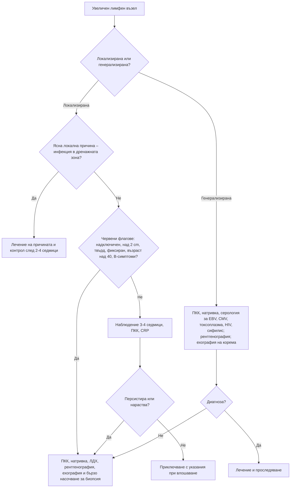

# Глава 7. Лимфаденопатия и спленомегалия

> **Част II. Общи симптоми**

## Цели на главата

- Да се оценява лимфаденопатията по локализация, размер, консистенция и давност.
- Да се свързва локализацията на увеличения възел с дренажната му зона и да се изброяват основните причини за всяка зона.
- Да се разграничава локализираната от генерализираната лимфаденопатия.
- Да се определя кога е нужна биопсия.
- Да се изброяват причините за спленомегалия и за масивна спленомегалия.

## Ключови моменти

- Злокачествена причина се открива при около 1% от пациентите с необяснена лимфаденопатия в общата практика, при около 4% от тези над 40 години и при около половината от тези с надключичен възел [1, 2].
- Оценката започва с въпроса „локализирана или генерализирана?“ и с огледа на дренажната зона на локализирания възел.
- Червени флагове са надключичната локализация, възрастта над 40 години, размерът над 2 cm, твърдата консистенция, фиксирането, персистирането над 4–6 седмици, B-симптомите и съпътстващата спленомегалия или цитопения [1, 4].
- При локализиран възел без червени флагове е оправдано наблюдение 3–4 седмици. Кортикостероиди не се дават преди диагнозата, защото могат да маскират лимфом *(SORT C [1])*.
- При мононуклеозоподобен синдром с отрицателен тест за EBV задължително се изследва за HIV с комбиниран тест от 4-то поколение *(SORT B [3])*.
- Спленомегалията се потвърждава с ехография *(SORT C [7])*. При аспления или хипоспленизъм са нужни ваксинации и план за незабавно лечение при треска *(SORT C [7, 8])*.

---

## А. Лимфаденопатия

### 1. Определения и епидемиология

- **Нормални лимфни възли:** обикновено до 1 cm. Ингвиналните възли при възрастни могат да бъдат до 1,5 cm. Епитрохлеарните възли над 0,5 cm са патологични. **Всеки палпируем надключичен възел е патологичен** [1].
- **Локализирана лимфаденопатия:** увеличени възли в една анатомична област.
- **Генерализирана лимфаденопатия:** увеличени възли в две или повече несъседни области.
- В общата практика само около 1% от случаите на необяснена лимфаденопатия се дължат на злокачествено заболяване. След 40-годишна възраст този дял нараства до около 4%, а при надключична локализация – до около 50% [1, 2]. Повечето случаи са реактивни и отзвучават спонтанно.

### 2. Характеристики на лимфния възел

*Таблица 7.1. Характеристики на лимфния възел.*

| Характеристика | Реактивен/възпалителен | Злокачествен |
|---|---|---|
| Размер | Обикновено < 1–2 cm | Често > 2 cm, нарастващ |
| Консистенция | Мека до еластична | Твърда (метастаза) или гумено-еластична (лимфом) |
| Подвижност | Подвижен | Фиксиран, сраснал с околните тъкани, възлите образуват пакет |
| Болезненост | Често болезнен (но това не е надежден белег) | Обикновено неболезнен. Болка в лимфните възли след прием на алкохол е рядък, но характерен белег на лимфома на Hodgkin |
| Давност | Регресира за 2–6 седмици | Персистира или нараства |
| Кожа над възела | Може да е зачервена | Възможни фистули (туберкулоза, актиномикоза) |

### 3. Регионални дренажни зони

*Таблица 7.2. Регионални дренажни зони на лимфните възли.*

| Локализация | Дренира | Основни причини |
|---|---|---|
| **Подчелюстни, подбрадни** | Устна кухина, зъби, устни, език | Зъбни инфекции, стоматит, карциноми на устната кухина |
| **Предни шийни** | Фаринкс, ларинкс, щитовидна жлеза | Фарингит, тонзилит, инфекциозна мононуклеоза, карциноми на главата и шията и на щитовидната жлеза |
| **Задни шийни** | Скалп, шия | Инфекциозна мононуклеоза, токсоплазмоза, рубеола, инфекции на скалпа, туберкулоза, лимфом |
| **Преаурикуларни** | Клепачи, конюнктива, темпорална област | Конюнктивит (окулогландуларен синдром на Parinaud), инфекции на скалпа |
| **Тилни** | Скалп | Инфекции на скалпа, педикулоза, рубеола, себореен дерматит |
| **Десен надключичен** | Медиастинум, бял дроб, хранопровод | Карцином на белия дроб и хранопровода, лимфом |
| **Ляв надключичен** (възел на Virchow) | Корем през гръдния канал | Карцином на стомаха, панкреаса и другите коремни органи, на тестиса и яйчника (белег на Troisier) |
| **Аксиларни** | Ръка, гръдна стена, гърда | Инфекции на ръката, болест от котешко одраскване, карцином на гърдата, меланом, лимфом, силиконови импланти, скорошна ваксинация в същата ръка |
| **Епитрохлеарни** | Длан, предмишница | Инфекции на ръката, вторичен сифилис, лимфом, саркоидоза |
| **Ингвинални** | Долни крайници, външни полови органи, перинеум, анус | Инфекции на крака, полово предавани инфекции (сифилис, херпес, венерическа лимфогранулома), карциноми на ануса, вулвата и пениса, меланом, лимфом |
| **Медиастинални и хилусни** (при образно изследване) | Бял дроб | Саркоидоза, туберкулоза, лимфом, карцином на белия дроб |
| **Коремни и ретроперитонеални** | Корем, таз, тестиси | Лимфом, туберкулоза, метастази (особено от тестисите) |

### 4. Генерализирана лимфаденопатия

Причините се запомнят с мнемониката **MIAMI**:

*Таблица 7.3. Причини за генерализирана лимфаденопатия (MIAMI).*

| Група | Причини |
|---|---|
| **M** – злокачествени заболявания (*Malignancy*) | Лимфоми, хронична лимфоцитна левкемия, остри левкемии, метастатични карциноми |
| **I** – инфекции | Инфекциозна мононуклеоза (EBV), CMV, остра HIV инфекция и хронична HIV инфекция, токсоплазмоза, вторичен сифилис, туберкулоза, бруцелоза, рубеола, морбили, хепатит B |
| **A** – автоимунни заболявания | Системен лупус еритематодес, ревматоиден артрит, синдром на Sjögren, болест на Still при възрастни, саркоидоза |
| **M** – редки и необичайни причини (*Miscellaneous*) | Болест на Kikuchi, болест на Castleman, IgG4-свързано заболяване, хистиоцитози, болест на Kawasaki (при деца), болести на натрупването |
| **I** – ятрогенни причини | Лекарства (фенитоин, карбамазепин, алопуринол – като част от DRESS синдрома), серумна болест |

### 5. Мононуклеозоподобен синдром

Съчетанието от треска, фарингит, лимфаденопатия и атипични лимфоцити може да се дължи на:

- **вирусът на Epstein-Barr** – най-честата причина;
- **цитомегаловирус** – по-малко изразен фарингит, по-възрастни пациенти;
- **токсоплазмоза** – изолирана лимфаденопатия, често задна шийна;
- **остра HIV инфекция** – обрив, язви в устата и по гениталиите, диария. Мононуклеозоподобният синдром е индикаторно състояние: честотата на HIV при него надвишава прага, при който изследването е оправдано. Затова **тестът за HIV е задължителен при отрицателен тест за EBV** [3];
- аденовирус, HHV-6, вирусен хепатит;
- стрептококов тонзилит (атипичните лимфоцити обикновено липсват).

### 6. Безопасна диагностична стратегия

*Таблица 7.4. Лимфаденопатия: безопасна диагностична стратегия.*

| Въпрос | Отговор |
|---|---|
| **Вероятна диагноза** | Реактивна лимфаденопатия при локална инфекция, вирусни инфекции, инфекциозна мононуклеоза |
| **Сериозни заболявания, които не бива да се пропускат** | Лимфоми, левкемии, метастатични карциноми (глава и шия, гърда, бял дроб, стомах, меланом), туберкулоза, HIV |
| **Чести капани** | Остра HIV инфекция; токсоплазмоза; болест от котешко одраскване; сифилис; лекарствени реакции; скорошна ваксинация; саркоидоза |
| **Маскиращи заболявания** | Системен лупус еритематодес, лимфоми, туберкулоза |
| **Психосоциални аспекти** | Страх от рак при палпиране на нормални възли. Повтарящото се самоопипване може да дразни възлите |

### 7. Червени флагове

- Възраст над 40 години.
- **Надключична** локализация. Независими предиктори за злокачествен възел са също мъжкият пол, по-високата възраст и засягането на две или повече области [4].
- Размер над 2 cm, твърда консистенция, фиксиране, пакети.
- Персистиране над 4–6 седмици или нарастване.
- B-симптоми: треска, нощно изпотяване, загуба на над 10% от телесното тегло за 6 месеца.
- Генерализирана лимфаденопатия със спленомегалия или хепатомегалия.
- Отклонения в ПКК: цитопении, бласти, изразена лимфоцитоза.
- Сърбеж без обрив (лимфом на Hodgkin).

### 8. Изследвания

- **ПКК с диференциално броене и натривка** – лимфоцитоза, атипични лимфоцити, бласти, цитопении.
- СУЕ, CRP, ЛДХ, чернодробни ензими.
- Серология според клиничната картина: EBV (хетерофилни антитела или VCA IgM), CMV, токсоплазма, **HIV**, сифилис, хепатит B.
- Туберкулинов тест или IGRA.
- Рентгенография на гръден кош (хилусна лимфаденопатия).
- **Ехография на лимфния възел.** Подозрителни белези са закръглената форма (съотношение дължина/ширина под 2), липсата на мастен хилус, периферното кръвоснабдяване и некрозата [5].
- **Биопсия:**
  - ексцизионната биопсия е златен стандарт при съмнение за лимфом, защото позволява оценка на архитектурата на възела;
  - биопсията с дебела игла е приемлива алтернатива;
  - тънкоиглената аспирационна биопсия е полезна при съмнение за метастаза от карцином;
  - при шиен лимфен възел със съмнение за метастаза от плоскоклетъчен карцином първо се прави оглед на УНГ органите.

**Важно:** **не се назначават кортикостероиди** при необяснена лимфаденопатия. Те могат временно да смалят лимфома и да затруднят хистологичната диагноза [1].

---

## Б. Спленомегалия

### 9. Определение

В норма слезката не се палпира. Изключение правят около 3% от здравите млади хора [6]. При ехография тя е увеличена, ако дължината ѝ надвишава 12–13 cm. Палпацията има ниска чувствителност (около 58%), а до 16% от палпируемите слезки са с нормален размер при образно изследване. Затова ехографията е изследването на първи избор за потвърждаване на спленомегалия [7].

### 10. Причини

*Таблица 7.5. Спленомегалия: причини.*

| Механизъм | Заболявания |
|---|---|
| **Портална хипертония** | Чернодробна цироза, тромбоза на порталната или слезковата вена, синдром на Budd-Chiari, тежка десностранна сърдечна недостатъчност |
| **Инфекции** | Инфекциозна мононуклеоза, CMV, вирусни хепатити, HIV, инфекциозен ендокардит, коремен тиф, бруцелоза, туберкулоза, малария, висцерална лайшманиоза, абсцес или ехинококова киста на слезката |
| **Хемолиза и хемоглобинопатии** | Наследствена сфероцитоза, таласемия (интермедия и майор), автоимунна хемолитична анемия |
| **Миелопролиферативни заболявания** | Хронична миелоидна левкемия, първична миелофиброза, полицитемия вера |
| **Лимфопролиферативни заболявания** | Хронична лимфоцитна левкемия, космоклетъчна левкемия, лимфоми (включително слезковият лимфом от маргиналната зона), остри левкемии |
| **Възпалителни заболявания** | Системен лупус еритематодес, ревматоиден артрит (синдром на Felty), саркоидоза, болест на Still |
| **Инфилтративни заболявания** | Болест на Gaucher, амилоидоза, хистиоцитози |
| **Други** | Кисти, хемангиоми, метастази (редки), екстрамедуларна хемопоеза |

#### 10.1. Масивна спленомегалия

Слезката е масивно увеличена, когато пресича средната линия или достига малкия таз. Най-честите причини са:

- хронична миелоидна левкемия;
- първична миелофиброза;
- висцерална лайшманиоза;
- малария (хиперреактивна маларийна спленомегалия);
- болест на Gaucher;
- космоклетъчна левкемия и слезков лимфом;
- таласемия майор.

#### 10.2. Хиперспленизъм и хипоспленизъм

- **Хиперспленизъм** е задържането и разрушаването на кръвни клетки в увеличената слезка. Проявява се с различни по степен цитопении.
- **Хипоспленизъм** (функционална аспления) се наблюдава след спленектомия и при сърповидноклетъчна анемия, цьолиакия, тежка алкохолна чернодробна болест, системен лупус еритематодес и амилоидоза. Белезите му са телцата на Howell-Jolly в натривката. Пациентите са застрашени от фулминантна инфекция, особено с капсулни бактерии (пневмокок, менингокок, *Haemophilus influenzae*). Необходими са ваксинации, обучение на пациента и ясен план за незабавно лечение при треска [8].

#### 10.3. Усложнения на спленомегалията

- **Руптура на слезката** при травма или спонтанно, например при инфекциозна мононуклеоза. Пациентите с мононуклеоза трябва да избягват контактни спортове и тежки натоварвания поне 21–31 дни от началото на симптомите, а при изразена спленомегалия и по-дълго [7].
- **Инфаркт на слезката** – остра болка в левия горен квадрант, понякога с плеврален излив вляво и триене. Наблюдава се при ендокардит, предсърдно мъждене, миелопролиферативни заболявания и хемоглобинопатии.

---

## 11. Диагностичен алгоритъм

*Фигура 7.1. Диагностичен алгоритъм: лимфаденопатия и спленомегалия. Схема на авторите въз основа на източниците, цитирани в главата.*

Текстово описание на фигура 7.1

1. Увеличен лимфен възел. Следва: към т. 2.
2. **Въпрос:** Локализирана или генерализирана? Локализирана – към т. 3; Генерализирана – към т. 4.
3. **Въпрос:** Ясна локална причина – инфекция в дренажната зона? Да – към т. 5; Не – към т. 6.
4. ПКК, натривка, серология за EBV, CMV, токсоплазма, HIV, сифилис; рентгенография; ехография на корема. Следва: към т. 7.
5. Лечение на причината и контрол след 2-4 седмици.
6. **Въпрос:** Червени флагове: надключичен, над 2 cm, твърд, фиксиран, възраст над 40, B-симптоми? Не – към т. 8; Да – към т. 9.
7. **Въпрос:** Диагноза? Не – към т. 9; Да – към т. 10.
8. Наблюдение 3-4 седмици, ПКК, CRP. Следва: към т. 11.
9. ПКК, натривка, ЛДХ, рентгенография, ехография и бързо насочване за биопсия.
10. Лечение и проследяване.
11. **Въпрос:** Персистира или нараства? Да – към т. 9; Не – към т. 12.
12. Приключване с указания при влошаване.

---

## 12. Особености в общата практика

- Реактивните шийни възли при деца са много чести. При липса на червени флагове е достатъчно наблюдение.
- Не предписвайте антибиотик „за възел“ без доказателства за бактериална инфекция.
- Ваксинацията (включително срещу COVID-19) може да причини временна аксиларна лимфаденопатия в същата ръка. Това е важно при тълкуването на мамографии и ехографии [9].
- Задължително е насочването при надключичен възел и при възел, който не регресира. NICE препоръчва да се обмисли бързо насочване при подозрение за лимфом при възрастни с необяснена лимфаденопатия или спленомегалия и много спешно насочване (до 48 часа) при деца и млади хора [10].

## 13. Кога и колко спешно да насочим

*Таблица 7.6. Кога и колко спешно да насочим.*

| Спешност | Клинична ситуация |
|---|---|
| **Незабавно (112 или спешно отделение)** | Треска при пациент без слезка или с хипоспленизъм (риск от фулминантен сепсис); остра болка в левия горен квадрант с хипотония при спленомегалия (руптура); стридор или затруднено преглъщане при масивна шийна лимфаденопатия |
| **В същия ден** | Лимфаденопатия или хепатоспленомегалия с петехии, кръвоизливи или тежка цитопения, особено при дете (левкемия); много висок брой левкоцити с бласти в натривката |
| **Бързо (до 2 седмици, подозрение за карцином)** | Надключичен възел; необяснена персистираща лимфаденопатия или спленомегалия при възрастен (лимфом); необяснена формация на шията след 45 години (карцином на главата и шията); необяснен възел в щитовидната жлеза; ПКК до 48 часа при генерализирана лимфаденопатия с бледост, умора или кръвонасядания [10] |
| **Планово** | Локализиран възел без червени флагове, персистиращ над 4–6 седмици; спленомегалия без цитопения и без системни симптоми |
| **Проследяване в общата практика** | Реактивен възел с ясна причина – контрол след 2–4 седмици и указания при влошаване |

---

## 14. Клинични перли

- Надключичният възел е злокачествен до доказване на противното.
- Левият надключичен възел „говори“ за корема.
- Ако при мононуклеозоподобен синдром тестът за EBV е отрицателен, изследвайте за HIV.
- Аминопеницилините (ампицилин, амоксицилин) при инфекциозна мононуклеоза предизвикват макулопапулозен обрив – в съвременно проучване при около 30% от децата [11]. Обривът се дължи на преходна, вирусно обусловена промяна в имунния отговор и обикновено не означава трайна алергия към пеницилин [12].
- Спленомегалия и лимфаденопатия заедно насочват към лимфопролиферативно заболяване, инфекциозна мононуклеоза или системно заболяване. Спленомегалия без лимфаденопатия насочва към портална хипертония, миелопролиферативно заболяване, хемолиза или инфекции като малария, лайшманиоза и ендокардит.

## 15. Клиничен случай

**Етап 1 – клинична картина.** Мъж на 24 години има температура до 39 °C, болки в гърлото и мускулите от 6 дни. На третия ден е получил амоксицилин, а на петия ден се е появил макулопапулозен обрив по трупа. Иска да му бъде записана „алергия към пеницилин“.

> **Въпрос 1.** Какво подсказва обривът след амоксицилин и трябва ли да се запише алергия?

**Етап 2 – преглед и изследвания.** Има генерализирана лимфаденопатия (шийни, аксиларни и ингвинални възли по 1–1,5 cm), язвички по мекото небце и слезка на ръба на ребрената дъга. Левкоцитите са 3,8 × 10⁹/l, тромбоцитите – 118 × 10⁹/l, АЛАТ – 96 U/l. Тестът за хетерофилни антитела (EBV) е отрицателен.

> **Въпрос 2.** Кои са възможните причини за този мононуклеозоподобен синдром?

> **Въпрос 3.** Кое изследване е задължително и какво още трябва да попитате?

Обсъждане и отговори

**Отговор 1.** Обривът след аминопеницилин е типичен за инфекциозна мононуклеоза и за други вирусни инфекции с преходна промяна в имунния отговор [11, 12]. Преди да се запише трайна алергия, се изяснява основната диагноза. При съмнение се обсъжда по-късно алергологично изследване.

**Отговор 2.** Отрицателният тест за хетерофилни антитела не изключва EBV инфекция, особено в първата седмица. Затова се изследват специфични антитела (VCA IgM). В диференциалната диагноза влизат CMV, токсоплазмоза и **остра HIV инфекция**. Острият ретровирусен синдром протича с треска, фарингит, генерализирана лимфаденопатия, макулопапулозен обрив, язви по лигавиците, левкопения, тромбоцитопения и повишени трансаминази.

**Отговор 3.** Задължителен е **комбиниран тест за HIV от 4-то поколение** (антиген p24 и антитела) [3]. Анамнезата трябва да включва сексуалните контакти през последните седмици. Пациентът съобщава за незащитени контакти с нов партньор преди 4 седмици. Тестът е положителен, а вирусният товар е много висок.

**Поука.** Острата HIV инфекция е един от най-често пропусканите „имитатори“. Пациентите в този стадий са силно заразни. Ранната диагноза е от полза както за пациента, така и за общественото здраве.

---

## Обобщение

- Повечето увеличени лимфни възли в общата практика са реактивни. Рискът от злокачествено заболяване нараства с възрастта, при надключична локализация и при засягане на повече области.
- Локализацията на възела насочва към дренажната зона, а генерализираната лимфаденопатия – към системни инфекции, лимфопролиферативни и автоимунни заболявания (мнемоника MIAMI).
- При червени флагове или персистиране над 4–6 седмици се прави ехография и биопсия. При съмнение за лимфом се предпочита ексцизионна биопсия, а кортикостероидите се избягват до диагнозата.
- Спленомегалията се потвърждава с ехография. Масивната спленомегалия насочва към миелопролиферативни заболявания, лайшманиоза, малария и болест на Gaucher. Хипоспленизмът изисква ваксинации и план при треска.

## Самопроверка

### Въпроси с един верен отговор

**1.** *(основно ниво)* Мъж на 62 години, пушач, има твърд неболезнен възел от 1,5 cm в лявата надключична ямка. Към кой регион е най-логично да насочите търсенето на първичния тумор?

- **А.** Скалпа и шията
- **Б.** Коремните органи (стомах, панкреас)
- **В.** Ръката и гръдната стена
- **Г.** Долните крайници
- **Д.** Устната кухина

Отговор и обосновка

**Верен отговор: Б.** Левият надключичен възел (на Virchow) дренира корема през гръдния канал и е класическа метастаза на карцином на стомаха и панкреаса (белег на Troisier). Десният надключичен възел дренира медиастинума и белия дроб. А, В, Г и Д са дренажни зони на други групи възли.

**2.** *(основно ниво)* Жена на 30 години има мек, подвижен, болезнен подчелюстен възел от 1 cm от 5 дни. Има зъбобол и кариес. Няма червени флагове. Кое е най-подходящото поведение?

- **А.** Ексцизионна биопсия
- **Б.** Кортикостероид за 5 дни
- **В.** Лечение на зъбната инфекция и контролен преглед след 2–4 седмици
- **Г.** КТ на шията
- **Д.** ПЕТ/КТ

Отговор и обосновка

**Верен отговор: В.** Реактивен възел с ясна причина в дренажната зона изисква лечение на причината и контрол [1]. А, Г и Д не са оправдани при липса на червени флагове. Б е противопоказано при необяснена лимфаденопатия, защото може да маскира лимфом.

**3.** *(основно ниво)* Кой от следните ехографски белези е в полза на реактивен, а не на злокачествен лимфен възел?

- **А.** Закръглена форма със съотношение дължина/ширина под 2
- **Б.** Липса на мастен хилус
- **В.** Периферно кръвоснабдяване
- **Г.** Некроза
- **Д.** Овална форма със запазен ехогенен хилус и хилусно кръвоснабдяване

Отговор и обосновка

**Верен отговор: Д.** Реактивните възли са овални, със запазен ехогенен хилус и хилусен тип кръвоснабдяване. А, Б, В и Г са подозрителни белези за метастаза или лимфом [5].

**4.** *(напреднало ниво)* Мъж на 55 години има слезка, която достига средната линия. Левкоцитите са 180 × 10⁹/l с лявостранно изместване, базофилия и тромбоцитоза. Коя е най-вероятната диагноза?

- **А.** Чернодробна цироза с портална хипертония
- **Б.** Хронична миелоидна левкемия
- **В.** Инфекциозна мононуклеоза
- **Г.** Наследствена сфероцитоза
- **Д.** Инфекциозен ендокардит

Отговор и обосновка

**Верен отговор: Б.** Масивната спленомегалия с изразена левкоцитоза, лявостранно изместване (всички стадии на зреене на гранулоцитите), базофилия и тромбоцитоза е класическа картина на хронична миелоидна левкемия. Диагнозата се потвърждава с доказване на BCR::ABL1. А, В, Г и Д протичат с умерена спленомегалия и без такава кръвна картина.

**5.** *(напреднало ниво)* Мъж на 40 години със спленектомия след травма преди 3 години има температура 39,5 °C и отпадналост от 6 часа. Кое е правилното поведение?

- **А.** Наблюдение 24 часа
- **Б.** Антипиретик и контрол след 2 дни
- **В.** Незабавна оценка в спешно отделение и емпиричен антибиотик без отлагане
- **Г.** Хемокултура и изчакване на резултата преди антибиотик
- **Д.** Серология за EBV

Отговор и обосновка

**Верен отговор: В.** Пациентите без слезка са застрашени от фулминантен сепсис с капсулни бактерии, който може да прогресира за часове. Треската при тях изисква незабавна оценка и антибиотик без отлагане [8]. А, Б и Г забавят лечението. Д не е свързано с непосредствения риск.

### Задача

Мъж на 52 години, пушач, който злоупотребява с алкохол, има твърд неболезнен възел от 2,5 cm под ъгъла на долната челюст от 6 седмици. Не е имал инфекция на горните дихателни пътища. Какви са следващите стъпки и кое действие трябва да се избегне?

Решение

Възелът има няколко червени флага: възраст над 40 години, размер над 2 cm, твърда консистенция и персистиране над 4–6 седмици. При пушач, който злоупотребява с алкохол, най-вероятна е метастаза от плоскоклетъчен карцином на главата и шията. Показано е бързо насочване (до 2 седмици) при подозрение за карцином на главата и шията [10]. Специалистът прави оглед на УНГ органите (включително назофаринкса и ларинкса), ехография с тънкоиглена аспирационна биопсия или биопсия с дебела игла и образно изследване. Трябва да се избегне ексцизионна биопсия на възела преди УНГ огледа, защото нарушава лимфния дренаж и влошава последващото лечение. Не се предписват и антибиотици „на сляпо“ или кортикостероиди.

### OSCE станция: Преглед на лимфните възли и слезката

**Време:** 8 минути. **Ниво:** основно (студенти, специализанти).

**Задача за кандидата.** Жена на 35 години е усетила „бучка на врата“ преди 3 седмици. Направете систематичен преглед на периферните лимфни възли и на слезката, като обяснявате на изпитващия какво правите и какво намирате.

**Информация за симулирания пациент (за изпитващия).** Има подвижен, мек, леко болезнен възел от 1 cm в дясната предна шийна област. Преди месец е боледувала от възпалено гърло. Няма треска, нощно изпотяване, загуба на тегло или сърбеж. Слезката и черният дроб не се палпират.

*Таблица 7.7. OSCE станция „Преглед на лимфните възли и слезката“ – критерии за оценяване.*

| Критерий | Точки |
|---|---|
| Представя се, обяснява прегледа и иска съгласие; осигурява добро осветление и подходящо положение на пациента | 1 |
| Преглежда шийните групи системно (подбрадни, подчелюстни, преаурикуларни, задушни, тилни, предни и задни шийни), като застава зад пациента | 2 |
| Преглежда надключичните ямки (включително с маневра на Valsalva или при леко наведен напред пациент) | 1 |
| Преглежда аксиларните, епитрохлеарните и ингвиналните възли | 2 |
| Описва възела: размер, консистенция, подвижност, болезненост, кожа над него | 2 |
| Оглежда дренажната зона (фаринкс, зъби, скалп) | 1 |
| Палпира слезката, като започва от дясната илиачна ямка към левия горен квадрант при дълбоко вдишване, и перкутира (пространство на Traube) | 2 |
| Обобщава находката и предлага план (контрол след 2–4 седмици, указания при влошаване, кога да се върне) | 1 |
| **Общо** | **12** |

**Праг за успешно изпълнение:** 8 от 12 точки, включително прегледа на надключичните ямки и палпацията на слезката.

## Литература

1. Gaddey HL, Riegel AM. Unexplained Lymphadenopathy: Evaluation and Differential Diagnosis. Am Fam Physician. 2016;94(11):896-903. PMID: 27929264.
2. Fijten GH, Blijham GH. Unexplained lymphadenopathy in family practice. An evaluation of the probability of malignant causes and the effectiveness of physicians' workup. J Fam Pract. 1988;27(4):373-6. PMID: 3049914.
3. Sullivan AK, Raben D, Reekie J, Rayment M, Mocroft A, Esser S, et al. Feasibility and effectiveness of indicator condition-guided testing for HIV: results from HIDES I (HIV indicator diseases across Europe study). PLoS One. 2013;8(1):e52845. doi:10.1371/journal.pone.0052845. PMID: 23341910.
4. Chau I, Kelleher MT, Cunningham D, Norman AR, Wotherspoon A, Trott P, et al. Rapid access multidisciplinary lymph node diagnostic clinic: analysis of 550 patients. Br J Cancer. 2003;88(3):354-61. doi:10.1038/sj.bjc.6600738. PMID: 12569376.
5. Ahuja AT, Ying M. Sonographic evaluation of cervical lymph nodes. AJR Am J Roentgenol. 2005;184(5):1691-9. doi:10.2214/ajr.184.5.01841691. PMID: 15855141.
6. McIntyre OR, Ebaugh FG Jr. Palpable spleens in college freshmen. Ann Intern Med. 1967;66(2):301-6. doi:10.7326/0003-4819-66-2-301. PMID: 6016543.
7. Aldulaimi S, Mendez AM. Splenomegaly: Diagnosis and Management in Adults. Am Fam Physician. 2021;104(3):271-276. PMID: 34523897.
8. Ladhani SN, Fernandes S, Garg M, Borrow R, de Lusignan S, Bolton-Maggs PHB; BSH Guidelines Committee. Prevention and treatment of infection in patients with an absent or hypofunctional spleen: A British Society for Haematology guideline. Br J Haematol. 2024;204(5):1672-1686. doi:10.1111/bjh.19361. PMID: 38600782.
9. Schiaffino S, Pinker K, Cozzi A, Magni V, Athanasiou A, Baltzer PAT, et al. European Society of Breast Imaging (EUSOBI) guidelines on the management of axillary lymphadenopathy after COVID-19 vaccination: 2023 revision. Insights Imaging. 2023;14(1):126. doi:10.1186/s13244-023-01453-2. PMID: 37466753.
10. National Institute for Health and Care Excellence. Suspected cancer: recognition and referral (NICE guideline NG12). London: NICE; 2015 [актуализирано 2026]. Достъпно на: https://www.nice.org.uk/guidance/ng12
11. Chovel-Sella A, Ben Tov A, Lahav E, Mor O, Rudich H, Paret G, et al. Incidence of rash after amoxicillin treatment in children with infectious mononucleosis. Pediatrics. 2013;131(5):e1424-7. doi:10.1542/peds.2012-1575. PMID: 23589810.
12. Thompson DF, Ramos CL. Antibiotic-Induced Rash in Patients With Infectious Mononucleosis. Ann Pharmacother. 2017;51(2):154-162. doi:10.1177/1060028016669525. PMID: 27620494.

*Последна проверка на съдържанието: септември 2026 г. Следващ планиран преглед: септември 2027 г. (вж. „Политика за актуализация“ в README).*

<!-- навигация -->

---

[← Глава 6. Промени в телесното тегло](06-teglo.md) · [Съдържание](../README.md) · [Глава 8. Отоци →](08-ototsi.md)
