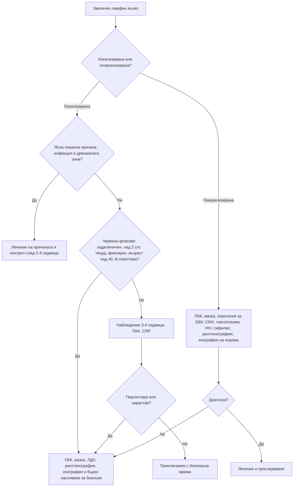

# Глава 7. Лимфаденопатия и спленомегалия

> **Част II. Общи симптоми**

## Цели на главата

- Да се оценява лимфаденопатията по локализация, размер, консистенция и давност.
- Да се познават регионалните дренажни зони и съответната им диференциална диагноза.
- Да се разграничава локализираната от генерализираната лимфаденопатия.
- Да се определя кога е нужна биопсия.
- Да се познават причините за спленомегалия и за масивна спленомегалия.

---

## А. ЛИМФАДЕНОПАТИЯ

## 1. Определения и епидемиология

- **Нормални лимфни възли:** обикновено до 1 cm. Ингвиналните възли при възрастни могат да бъдат до 1,5 cm. Епитрохлеарните възли над 0,5 cm са патологични. **Всеки палпируем надключичен възел е патологичен.**
- **Локализирана лимфаденопатия:** увеличени възли в една анатомична област.
- **Генерализирана лимфаденопатия:** увеличени възли в две или повече несъседни области.
- В общата практика само около 1% от случаите на необяснена лимфаденопатия се дължат на злокачествено заболяване. След 40-годишна възраст този дял нараства до около 4%. Повечето случаи са реактивни и отзвучават спонтанно.

## 2. Характеристики на лимфния възел

| Характеристика | Реактивен/възпалителен | Злокачествен |
|---|---|---|
| Размер | Обикновено < 1–2 cm | Често > 2 cm, нарастващ |
| Консистенция | Мека до еластична | Твърда (метастаза) или гумено-еластична (лимфом) |
| Подвижност | Подвижен | Фиксиран, сраснал с околните тъкани, възлите образуват пакет |
| Болезненост | Често болезнен (но това не е надежден белег) | Обикновено неболезнен. Болка в лимфните възли след прием на алкохол е рядък, но характерен белег на лимфома на Hodgkin |
| Давност | Регресира за 2–6 седмици | Персистира или нараства |
| Кожа над възела | Може да е зачервена | Възможни фистули (туберкулоза, актиномикоза) |

## 3. Регионални дренажни зони

| Локализация | Дренира | Основни причини |
|---|---|---|
| **Подчелюстни, подбрадни** | Устна кухина, зъби, устни, език | Зъбни инфекции, стоматит, карциноми на устната кухина |
| **Предни шийни** | Фаринкс, ларинкс, щитовидна жлеза | Фарингит, тонзилит, инфекциозна мононуклеоза, карциноми на главата и шията и на щитовидната жлеза |
| **Задни шийни** | Скалп, шия | Инфекциозна мононуклеоза, токсоплазмоза, рубеола, инфекции на скалпа, туберкулоза, лимфом |
| **Преаурикуларни** | Клепачи, конюнктива, темпорална област | Конюнктивит (окулогландуларен синдром на Parinaud), инфекции на скалпа |
| **Тилни** | Скалп | Инфекции на скалпа, педикулоза, рубеола, себореен дерматит |
| **Десен надключичен** | Медиастинум, бял дроб, хранопровод | Карцином на белия дроб и хранопровода, лимфом |
| **Ляв надключичен** (възел на Virchow) | Корем през гръдния канал | Карцином на стомаха, панкреаса и другите коремни органи, на тестиса и яйчника (белег на Troisier) |
| **Аксиларни** | Ръка, гръдна стена, гърда | Инфекции на ръката, болест от котешко одраскване, **карцином на гърдата**, меланом, лимфом, силиконови импланти, **скорошна ваксинация** в същата ръка |
| **Епитрохлеарни** | Длан, предмишница | Инфекции на ръката, вторичен сифилис, лимфом, саркоидоза |
| **Ингвинални** | Долни крайници, външни полови органи, перинеум, анус | Инфекции на крака, полово предавани инфекции (сифилис, херпес, венерическа лимфогранулома), карциноми на ануса, вулвата и пениса, меланом, лимфом |
| **Медиастинални и хилусни** (при образно изследване) | Бял дроб | Саркоидоза, туберкулоза, лимфом, карцином на белия дроб |
| **Коремни и ретроперитонеални** | Корем, таз, тестиси | Лимфом, туберкулоза, метастази (особено от тестисите) |

## 4. Генерализирана лимфаденопатия

Причините се запомнят с мнемониката **MIAMI**:

| Група | Причини |
|---|---|
| **M** — злокачествени заболявания (*Malignancy*) | Лимфоми, хронична лимфоцитна левкемия, остри левкемии, метастатични карциноми |
| **I** — инфекции | Инфекциозна мононуклеоза (EBV), CMV, **остра HIV инфекция** и хронична HIV инфекция, токсоплазмоза, вторичен сифилис, туберкулоза, бруцелоза, рубеола, морбили, хепатит B |
| **A** — автоимунни заболявания | Системен лупус еритематодес, ревматоиден артрит, синдром на Sjögren, болест на Still при възрастни, саркоидоза |
| **M** — редки и необичайни причини (*Miscellaneous*) | Болест на Kikuchi, болест на Castleman, IgG4-свързано заболяване, хистиоцитози, болест на Kawasaki (при деца), болести на натрупването |
| **I** — ятрогенни причини | Лекарства (фенитоин, карбамазепин, алопуринол — като част от DRESS синдрома), серумна болест |

## 5. Мононуклеозоподобен синдром

Съчетанието от треска, фарингит, лимфаденопатия и атипични лимфоцити може да се дължи на:

- **Епщайн-Бар вирус** — най-честата причина;
- **цитомегаловирус** — по-малко изразен фарингит, по-възрастни пациенти;
- **токсоплазмоза** — изолирана лимфаденопатия, често задна шийна;
- **остра HIV инфекция** — обрив, язви в устата и по гениталиите, диария; **тестът за HIV е задължителен при отрицателен тест за EBV**;
- аденовирус, HHV-6, вирусен хепатит;
- стрептококов тонзилит (атипичните лимфоцити обикновено липсват).

## 6. Безопасна диагностична стратегия

| Въпрос | Отговор |
|---|---|
| **Вероятна диагноза** | Реактивна лимфаденопатия при локална инфекция, вирусни инфекции, инфекциозна мононуклеоза |
| **Сериозни заболявания, които не бива да се пропускат** | Лимфоми, левкемии, метастатични карциноми (глава и шия, гърда, бял дроб, стомах, меланом), туберкулоза, HIV |
| **Чести капани** | Остра HIV инфекция; токсоплазмоза; болест от котешко одраскване; сифилис; лекарствени реакции; скорошна ваксинация; саркоидоза |
| **Маскиращи заболявания** | Системен лупус еритематодес, лимфоми, туберкулоза |
| **Психосоциални аспекти** | Страх от рак при палпиране на нормални възли. Повтарящото се самоопипване може да дразни възлите |

## 7. Червени флагове

- Възраст над 40 години.
- **Надключична** локализация.
- Размер над 2 cm, твърда консистенция, фиксиране, пакети.
- Персистиране над 4–6 седмици или нарастване.
- B-симптоми: треска, нощно изпотяване, загуба на над 10% от телесното тегло за 6 месеца.
- Генерализирана лимфаденопатия със спленомегалия или хепатомегалия.
- Отклонения в ПКК: цитопении, бласти, изразена лимфоцитоза.
- Сърбеж без обрив (лимфом на Hodgkin).

## 8. Изследвания

- **ПКК с диференциално броене и мазка** — лимфоцитоза, атипични лимфоцити, бласти, цитопении.
- СУЕ, CRP, ЛДХ, чернодробни ензими.
- Серология според клиничната картина: EBV (хетерофилни антитела или VCA IgM), CMV, токсоплазма, **HIV**, сифилис, хепатит B.
- Туберкулинов тест или IGRA.
- Рентгенография на гръден кош (хилусна лимфаденопатия).
- **Ехография на лимфния възел.** Суспектни белези са закръглената форма (съотношение дължина/ширина под 2), липсата на мастен хилус, периферното кръвоснабдяване и некрозата.
- **Биопсия:**
  - ексцизионната биопсия е златен стандарт при съмнение за лимфом, защото позволява оценка на архитектурата на възела;
  - биопсията с дебела игла е приемлива алтернатива;
  - тънкоиглената аспирационна биопсия е полезна при съмнение за метастаза от карцином;
  - при шиен лимфен възел със съмнение за метастаза от плоскоклетъчен карцином първо се прави оглед на УНГ органите.

**Важно:** **не се назначават кортикостероиди** при необяснена лимфаденопатия. Те могат временно да смалят лимфома и да направят хистологичната диагноза невъзможна.

---

## Б. СПЛЕНОМЕГАЛИЯ

## 9. Определение

В норма слезката не се палпира. Изключение правят около 3% от здравите хора, особено слабите млади хора. При ехография тя е увеличена, ако дължината ѝ надвишава 12–13 cm. Слезката се палпира едва когато е увеличена поне 1,5–2 пъти. Затова ехографията е много по-чувствителна от палпацията.

## 10. Причини

| Механизъм | Заболявания |
|---|---|
| **Портална хипертония** | Чернодробна цироза, тромбоза на порталната или слезковата вена, синдром на Budd-Chiari, тежка десностранна сърдечна недостатъчност |
| **Инфекции** | Инфекциозна мононуклеоза, CMV, вирусни хепатити, HIV, инфекциозен ендокардит, коремен тиф, **бруцелоза**, туберкулоза, **малария**, **висцерална лайшманиоза**, абсцес или ехинококова киста на слезката |
| **Хемолиза и хемоглобинопатии** | Наследствена сфероцитоза, таласемия (интермедия и майор), автоимунна хемолитична анемия |
| **Миелопролиферативни заболявания** | Хронична миелоидна левкемия, първична миелофиброза, полицитемия вера |
| **Лимфопролиферативни заболявания** | Хронична лимфоцитна левкемия, космоклетъчна левкемия, лимфоми (включително слезковият лимфом от маргиналната зона), остри левкемии |
| **Възпалителни заболявания** | Системен лупус еритематодес, ревматоиден артрит (синдром на Felty), саркоидоза, болест на Still |
| **Инфилтративни заболявания** | Болест на Gaucher, амилоидоза, хистиоцитози |
| **Други** | Кисти, хемангиоми, метастази (редки), екстрамедуларна хемопоеза |

### 10.1. Масивна спленомегалия

Слезката е масивно увеличена, когато пресича средната линия или достига малкия таз. Най-честите причини са:

- хронична миелоидна левкемия;
- първична миелофиброза;
- висцерална лайшманиоза;
- малария (хиперреактивна маларийна спленомегалия);
- болест на Gaucher;
- космоклетъчна левкемия и слезков лимфом;
- таласемия майор.

### 10.2. Хиперспленизъм и хипоспленизъм

- **Хиперспленизъм** е задържането и разрушаването на кръвни клетки в увеличената слезка. Проявява се с различни по степен цитопении.
- **Хипоспленизъм** (функционална аспления) се наблюдава след спленектомия и при сърповидноклетъчна анемия, цьолиакия, тежка алкохолна чернодробна болест, системен лупус еритематодес и амилоидоза. Белезите му са телцата на Howell-Jolly в мазката. Пациентите са застрашени от фулминантна инфекция, особено с капсулни бактерии (пневмокок, менингокок, *Haemophilus influenzae*). Необходими са ваксинации и обучение на пациента.

### 10.3. Усложнения на спленомегалията

- **Руптура на слезката** при травма или спонтанно, например при инфекциозна мононуклеоза. Пациентите с мононуклеоза трябва да избягват контактни спортове и тежки натоварвания поне 3–4 седмици, а при изразена спленомегалия и по-дълго.
- **Инфаркт на слезката** — остра болка в левия горен квадрант, понякога с плеврален излив вляво и триене. Наблюдава се при ендокардит, предсърдно мъждене, миелопролиферативни заболявания и хемоглобинопатии.

---

## 11. Диагностичен алгоритъм

---

## 12. Особености в общата практика

- Реактивните шийни възли при деца са много чести. При липса на червени флагове е достатъчно наблюдение.
- Не предписвайте антибиотик „за възел“ без доказателства за бактериална инфекция.
- Ваксинацията (включително срещу COVID-19) може да причини временна аксиларна лимфаденопатия в същата ръка. Това е важно при тълкуването на мамографии и ехографии.
- Задължително е насочването при надключичен възел и при възел, който не регресира.

## 13. Клинични перли

- Надключичният възел е злокачествен, докато не се докаже противното.
- Левият надключичен възел „говори“ за корема.
- Ако при мононуклеозоподобен синдром тестът за EBV е отрицателен, изследвайте за HIV.
- Аминопеницилините (ампицилин, амоксицилин) при инфекциозна мононуклеоза предизвикват макулопапулозен обрив в голям процент от случаите. Обривът не е истинска алергия към пеницилин.
- Спленомегалия и лимфаденопатия заедно насочват към лимфопролиферативно заболяване, инфекциозна мононуклеоза или системно заболяване. Спленомегалия без лимфаденопатия насочва към портална хипертония, миелопролиферативно заболяване, хемолиза или инфекции като малария, лайшманиоза и ендокардит.

## 14. Клиничен случай

**Случай.** Мъж на 24 години се оплаква от температура до 39 °C, болки в гърлото и мускулите от 6 дни. На третия ден е получил амоксицилин. На петия ден се е появил макулопапулозен обрив по трупа. При прегледа: генерализирана лимфаденопатия (шийни, аксиларни и ингвинални възли по 1–1,5 cm), язвички по мекото небце, слезка на ръба на ребрената дъга. Изследвания: левкоцити 3,8 × 10⁹/l, тромбоцити 118 × 10⁹/l, АЛАТ 96 U/l. Тестът за хетерофилни антитела (EBV) е отрицателен.

**Въпроси.** 1) Какви са възможните причини за този мононуклеозоподобен синдром? 2) Кое изследване е задължително?

**Обсъждане.** Обривът след амоксицилин е типичен за инфекциозна мононуклеоза. Отрицателният тест за хетерофилни антитела обаче не изключва EBV инфекция, особено в първата седмица. Затова се изследват специфични антитела (VCA IgM). В диференциалната диагноза влизат CMV, токсоплазмоза и **остра HIV инфекция**. Острият ретровирусен синдром протича с треска, фарингит, генерализирана лимфаденопатия, макулопапулозен обрив, язви по лигавиците, левкопения, тромбоцитопения и повишени трансаминази. Анамнезата разкрива незащитени сексуални контакти с нов партньор преди 4 седмици. Изследването за HIV с комбиниран тест от 4-то поколение (антиген p24 и антитела) е положително, а вирусният товар е много висок.

**Поука.** Острата HIV инфекция е един от най-често пропусканите „имитатори“. Пациентите в този стадий са силно заразни. Ранната диагноза е ползотворна както за пациента, така и за общественото здраве.
