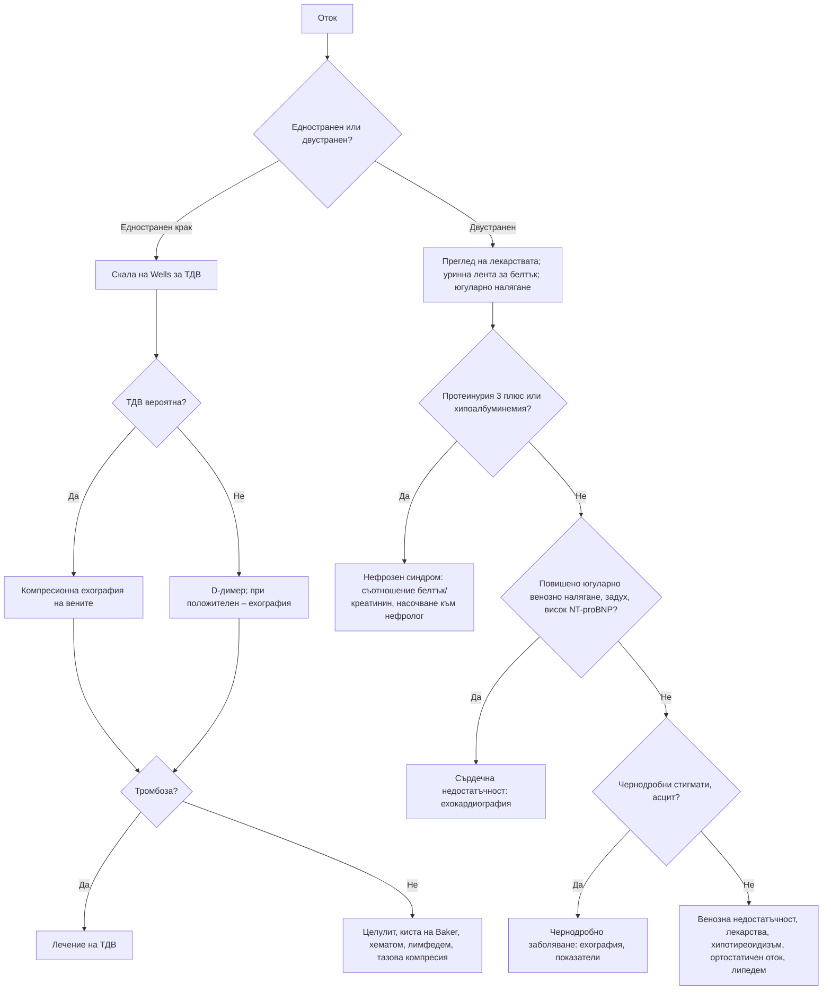

# Глава 8. Отоци

> **Част II. Общи симптоми**

## Цели на главата

- Да се обясняват основните механизми на отока и да се дава пример за заболяване при всеки от тях.
- Да се разграничават едностранните от двустранните, локализираните от генерализираните и оставящите от неоставящите ямка отоци.
- Да се изброяват най-честите и най-опасните причини за оток на краката, лицето и ръцете.
- Да се подбира минимален, но ефективен набор от изследвания според вида на отока.

## Ключови моменти

- Първо определете вида на отока: едностранен или двустранен, локализиран или генерализиран, оставящ или неоставящ ямка, остър или хроничен.
- Едностранният оток на крака е тромбоза на дълбоките вени до доказване на противното. Оценката включва скалата на Wells, D-димер и компресионна ехография *(SORT A [2, 11])*.
- При двустранен оток започнете с преглед на лекарствата, тест с уринна лента за белтък и оценка на югуларното венозно налягане.
- Калциевите антагонисти предизвикват оток при около 11% от лекуваните. Диуретиците помагат слабо; ефективни са намаляването на дозата, смяната или добавянето на АСЕ инхибитор или ARB *(SORT B [4, 12])*.
- Нормалният NT-proBNP (под 125 pg/ml по ESC и под 400 ng/l по NICE) прави сърдечната недостатъчност малко вероятна *(SORT B [9, 10])*.
- Ангиоедемът при АСЕ инхибитор е медииран от брадикинин и може да застраши дихателните пътища. Преди компресивна терапия се изключва тежка периферна артериална болест *(SORT C [6, 13])*.

---

## 1. Патофизиология

Обменът на течности в капилярите се определя от силите на Starling. Отокът възниква при един или повече от следните механизми [1]:

*Таблица 8.1. Механизми на отока.*

| Механизъм | Заболявания |
|---|---|
| **Повишено хидростатично налягане в капилярите** | Сърдечна недостатъчност, хронична венозна недостатъчност, тромбоза на дълбоките вени, задръжка на натрий (бъбречно заболяване), бременност, лекарства (калциеви антагонисти) |
| **Понижено онкотично налягане** (хипоалбуминемия) | Нефрозен синдром, чернодробна цироза, ентеропатия със загуба на белтък, тежко недохранване |
| **Повишена капилярна пропускливост** | Възпаление, изгаряния, сепсис, алергия, ангиоедем, синдром на системното капилярно изтичане |
| **Нарушен лимфен отток** (лимфедем) | Първичен лимфедем; вторичен – след операция, лъчетерапия, при тумори, рецидивиращ целулит |
| **Натрупване на гликозаминогликани** | Хипотиреоидизъм (микседем), претибиален микседем при болест на Graves |

**Липедемът** не е истински оток. Той е симетрично натрупване на болезнена мастна тъкан по краката и седалището при жени. Стъпалата са пощадени („белег на маншета“). Отокът не оставя ямка.

---

## 2. Клинична класификация

*Таблица 8.2. Клинична класификация.*

| Признак | Варианти | Значение |
|---|---|---|
| **Разпространение** | Локализиран / генерализиран (анасарка) | Генерализираният оток насочва към сърдечна, бъбречна или чернодробна причина или към хипоалбуминемия |
| **Симетрия** | Едностранен / двустранен | **Едностранният оток на крака означава тромбоза на дълбоките вени до доказване на противното** |
| **Ямка при натиск** | Оставящ ямка / неоставящ ямка | Неоставящият ямка оток насочва към лимфедем, микседем или липедем |
| **Начало** | Остро (часове–дни) / хронично | Острото начало насочва към тромбоза, целулит, ангиоедем, остър нефрит |
| **Болезненост** | Болезнен / неболезнен | Болезненият оток насочва към тромбоза, целулит, руптура на киста на Baker, компартмент синдром |

---

## 3. Етиологична класификация по локализация

### 3.1. Едностранен оток на долен крайник

*Таблица 8.3. Едностранен оток на долен крайник.*

| Заболяване | Насочващи белези |
|---|---|
| **Тромбоза на дълбоките вени** | Болка, оток на цялата подбедрица или на целия крак, разлика в обиколката над 3 cm, рискови фактори [2] |
| **Целулит / еризипел** | Зачервяване, затопляне, треска, входна врата (гъбична инфекция между пръстите, рана) |
| **Руптура на киста на Baker** | Анамнеза за гонартроза или ревматоиден артрит, внезапна болка в подколенната ямка и прасеца, кръвонасядане около глезена (белег на полумесеца) |
| **Разкъсване на мускул** (медиалната глава на *m. gastrocnemius*) | Внезапна болка при спортна активност („удар с камък по прасеца“), кръвонасядане |
| **Хематом** | Травма, антикоагулантна терапия |
| **Посттромботичен синдром** | Прекарана тромбоза, хроничен оток, тежест, пигментация, язви |
| **Хронична венозна недостатъчност** (асиметрична) | Разширени вени, пигментация, липодерматосклероза |
| **Лимфедем** | Неоставящ ямка, засягане на стъпалото и пръстите, белег на Stemmer (кожата над втория пръст не може да се повдигне в гънка) [3] |
| **Компресия на тазовите вени** | Тумор, лимфаденопатия, бременност, синдром на May-Thurner (компресия на лявата обща илиачна вена) |
| **Компартмент синдром** | Силна болка, особено при пасивно разтягане, след травма или усилие; спешно състояние |
| **Сложен регионален болков синдром** | Болка, промени в цвета и температурата, изпотяване след травма |
| **Невроартропатия на Charcot** | Диабетна невропатия, горещо, подуто стъпало, често без болка |

### 3.2. Двустранен оток на долните крайници

*Таблица 8.4. Двустранен оток на долните крайници.*

| Заболяване | Насочващи белези |
|---|---|
| **Хронична венозна недостатъчност** | Най-честата причина; оток вечер, който намалява след нощна почивка; разширени вени; пигментация |
| **Лекарства** | Калциеви антагонисти (амлодипин, нифедипин; при около 11% от лекуваните, по-често при високи дози [4]), НСПВС, глитазони, кортикостероиди, естрогени, габапентин и прегабалин, миноксидил |
| **Сърдечна недостатъчност** | Задух, ортопнея, повишено югуларно венозно налягане, хепатоюгуларен рефлукс, хрипове, трети тон |
| **Белодробна хипертония** | Задух, признаци на деснокамерна недостатъчност; обструктивна сънна апнея, ХОББ, белодробна тромбемболия |
| **Нефрозен синдром** | Протеинурия > 3,5 g/24 h, хипоалбуминемия, хиперлипидемия, пенлива урина, периорбитален оток сутрин [5] |
| **Хронично бъбречно заболяване, остър нефрит** | Хипертония, хематурия, повишен креатинин |
| **Чернодробна цироза** | Асцит, жълтеница, стигмати на хронично чернодробно заболяване, тромбоцитопения |
| **Хипотиреоидизъм** | Неоставящ ямка оток, суха кожа, студоусещане, брадикардия |
| **Бременност, прееклампсия** | Физиологичен оток или хипертония с протеинурия, главоболие, зрителни нарушения |
| **Идиопатичен (цикличен) оток** | Жени в детеродна възраст, наддаване на тегло през деня, често при употреба на диуретици и слабителни |
| **Ортостатичен (гравитационен) оток** | Обездвижени пациенти, които прекарват деня седнали в креслото |
| **Ентеропатия със загуба на белтък, недохранване** | Хипоалбуминемия без протеинурия и без чернодробно заболяване |
| **Липедем** | Жени; симетрични, болезнени „колони“; пощадени стъпала |

### 3.3. Оток на лицето и периорбитален оток

*Таблица 8.5. Оток на лицето и периорбитален оток.*

| Заболяване | Насочващи белези |
|---|---|
| **Ангиоедем** | Асиметричен оток на устните, езика, клепачите; при АСЕ инхибитори или наследствен ангиоедем обикновено без уртикария и сърбеж (медииран е от брадикинин); риск от обструкция на дихателните пътища [6] |
| **Алергична реакция** | Уртикария, сърбеж, известен алерген |
| **Нефрозен синдром** | Периорбитален оток сутрин, особено при деца |
| **Хипотиреоидизъм** | Подпухнало лице, загрубяване на чертите |
| **Трихинелоза** | Периорбитален оток, треска, миалгии, еозинофилия след консумация на свинско месо или месо от дива свиня [7] |
| **Синдром на горната празна вена** | Оток на лицето, шията и ръцете, разширени вени по гръдната стена, задух; карцином на белия дроб, лимфом, централни венозни катетри |
| **Дерматомиозит** | Виолетов (хелиотропен) оток на клепачите, проксимална мускулна слабост |
| **Орбитален целулит** | Едностранен, болезнен, с треска, нарушени движения на окото, проптоза; спешно състояние |
| **Синдром на Cushing** | Лице с форма на луна |
| **Инфекциозна мононуклеоза** | Оток на клепачите в ранния стадий |

### 3.4. Оток на горен крайник

- **Тромбоза на дълбоките вени на ръката:** при централен венозен катетър, периферно въведен централен катетър или пейсмейкър, при злокачествено заболяване, след усилие (синдром на Paget-Schroetter при млади спортисти).
- **Лимфедем** след мастектомия, аксиларна дисекация или лъчетерапия.
- **Синдром на горната празна вена** (двустранен оток).
- **Целулит.**

---

## 4. Безопасна диагностична стратегия

*Таблица 8.6. Безопасна диагностична стратегия.*

| Въпрос | Отговор |
|---|---|
| **Вероятна диагноза** | Хронична венозна недостатъчност, лекарства, сърдечна недостатъчност, ортостатичен оток |
| **Сериозни заболявания, които не бива да се пропускат** | Тромбоза на дълбоките вени; сърдечна недостатъчност; нефрозен синдром и остър гломерулонефрит; чернодробна цироза; прееклампсия; ангиоедем с обструкция на дихателните пътища; синдром на горната празна вена; компартмент синдром; некротизиращ фасциит |
| **Чести капани** | Лекарствен оток (калциеви антагонисти, прегабалин), руптура на киста на Baker, хипотиреоидизъм, белодробна хипертония при обструктивна сънна апнея, тазова формация, липедем |
| **Маскиращи заболявания** | Лекарства, хипотиреоидизъм, хронично бъбречно заболяване, злокачествени заболявания (компресия, хипоалбуминемия) |
| **Психосоциални аспекти** | Прекомерна употреба на диуретици и слабителни (идиопатичен оток), самонараняване чрез турникет (рядко) |

## 5. Анамнеза и физикален преглед

**Анамнеза:**

- Начало, давност, едностранност, болка, зачервяване.
- Задух, ортопнея, пароксизмален нощен задух.
- Пенлива урина, промяна в цвета на урината.
- Прием на алкохол, прекарани хепатити.
- Студоусещане, запек, суха кожа.
- Лекарства, особено наскоро започнати.
- Рискови фактори за тромбоза: обездвижване, операция, злокачествено заболяване, естрогени, пътуване, бременност.
- При жени: връзка с менструалния цикъл, бременност.

**Физикален преглед:**

- Натиск с пръст поне 5–10 секунди за оценка на ямката над тибията или глезена. При лежащо болни се проверява и сакралната област.
- Разпространение, обиколка на подбедриците, измерена 10 cm под тибиалната тубероза.
- Цвят, температура и състояние на кожата: пигментация, липодерматосклероза, язви.
- **Югуларно венозно налягане** и хепатоюгуларен рефлукс.
- Сърце (шумове, трети тон), бял дроб (хрипове, излив).
- Корем: асцит, хепатомегалия, формации.
- Стигмати на чернодробно заболяване.
- Щитовидна жлеза.
- Периферни пулсации (преди компресивна терапия), лимфни възли.

## 6. Червени флагове

- Остър, болезнен, едностранен оток на крака (тромбоза на дълбоките вени).
- Задух, ортопнея, хипоксемия (сърдечна недостатъчност, белодробна тромбемболия).
- Оток на езика, устните или гърлото с дрезгав глас или стридор (ангиоедем).
- Изразена протеинурия, олигурия, макроскопска хематурия (нефрозен или нефритен синдром).
- Бременна с оток, хипертония, главоболие или зрителни нарушения (прееклампсия) [8].
- Оток на лицето и ръцете с разширени вени по шията и гръдната стена (синдром на горната празна вена).
- Силна болка, непропорционална на находката, или болка при пасивно разтягане (компартмент синдром, некротизиращ фасциит).

## 7. Изследвания

**Основен набор при двустранен или генерализиран оток:**

- **тест с уринна лента за белтък** (ключово изследване) и съотношение албумин/креатинин в урината;
- ПКК, креатинин, eGFR, електролити;
- албумин, чернодробни показатели;
- ТСХ;
- **NT-proBNP**: при хронични симптоми сърдечната недостатъчност е малко вероятна при стойност под 125 pg/ml [9]. NICE препоръчва търсене на други причини при стойност под 400 ng/l, специализирана оценка с ехокардиография до 6 седмици при 400–2000 ng/l и до 2 седмици при над 2000 ng/l [10]. Затлъстяването и някои лекарства (диуретици, АСЕ инхибитори, бета-блокери) понижават стойностите;
- ЕКГ.

**Допълнително според клиничните данни:**

- ехокардиография;
- рентгенография на гръден кош;
- ехография на корема;
- 24-часова протеинурия;
- липиден профил (при нефрозен синдром).

**При едностранен оток:**

- оценка на клиничната вероятност по скалата на Wells за тромбоза на дълбоките вени;
- D-димер при ниска вероятност;
- **компресионна ехография на вените** при висока вероятност или положителен D-димер. По NICE резултатът трябва да е готов до 4 часа. Ако това е невъзможно, се започва междинна антикоагулация и ехографията се прави до 24 часа [11].

## 8. Диференциално-диагностична таблица на генерализирания оток

*Таблица 8.7. Диференциална диагноза на генерализирания оток.*

| Показател | Сърдечна недостатъчност | Нефрозен синдром | Чернодробна цироза | Хипотиреоидизъм |
|---|---|---|---|---|
| Югуларно венозно налягане | Повишено | Нормално | Нормално или ниско | Нормално |
| Задух, ортопнея | Да | Рядко (при излив) | Рядко (при напрегнат асцит) | Не |
| Протеинурия | Незначителна | Над 3,5 g/24 h | Няма | Няма |
| Албумин | Нормален или леко понижен | Силно понижен | Понижен | Нормален |
| Асцит | Възможен | Възможен | Типичен | Рядко |
| NT-proBNP | Повишен | Нормален или леко повишен | Нормален или леко повишен | Нормален |
| Други белези | Трети тон, кардиомегалия | Хиперлипидемия, пенлива урина | Жълтеница, тромбоцитопения, стигмати | Висок ТСХ, брадикардия, суха кожа |

## 9. Диагностичен алгоритъм

*Фигура 8.1. Диагностичен алгоритъм: отоци. Схема на авторите въз основа на източниците, цитирани в главата.*

Текстово описание на фигура 8.1

1. Оток. Следва: към т. 2.
2. **Въпрос:** Едностранен или двустранен? Едностранен крак – към т. 3; Двустранен – към т. 4.
3. Скала на Wells за ТДВ. Следва: към т. 5.
4. Преглед на лекарствата; уринна лента за белтък; югуларно налягане. Следва: към т. 6.
5. **Въпрос:** ТДВ вероятна? Да – към т. 7; Не – към т. 8.
6. **Въпрос:** Протеинурия 3 плюс или хипоалбуминемия? Да – към т. 9; Не – към т. 10.
7. Компресионна ехография на вените. Следва: към т. 11.
8. D-димер; при положителен – ехография. Следва: към т. 11.
9. Нефрозен синдром: съотношение белтък/креатинин, насочване към нефролог.
10. **Въпрос:** Повишено югуларно венозно налягане, задух, висок NT-proBNP? Да – към т. 12; Не – към т. 13.
11. **Въпрос:** Тромбоза? Да – към т. 14; Не – към т. 15.
12. Сърдечна недостатъчност: ехокардиография.
13. **Въпрос:** Чернодробни стигмати, асцит? Да – към т. 16; Не – към т. 17.
14. Лечение на ТДВ.
15. Целулит, киста на Baker, хематом, лимфедем, тазова компресия.
16. Чернодробно заболяване: ехография, показатели.
17. Венозна недостатъчност, лекарства, хипотиреоидизъм, ортостатичен оток, липедем.

## 10. Особености в общата практика

- Преди да назначите диуретик, отговорете на въпроса *„Защо има оток?“*. Отокът от калциеви антагонисти се дължи на артериоларна вазодилатация и повишено капилярно налягане, а не на задръжка на натрий, затова диуретиците помагат слабо. Помагат намаляването на дозата, смяната на лекарството или добавянето на АСЕ инхибитор или ARB, което намалява честотата на отока с около 38% [4, 12].
- Диуретиците при венозна недостатъчност и ортостатичен оток обикновено са неефективни и рискови: водят до хипокалиемия, хипонатриемия, дехидратация и падания. Основното лечение е компресията, раздвижването и повдигането на краката.
- Преди компресивна терапия трябва да се изключи периферна артериална болест, например чрез измерване на глезенно-брахиалния индекс (ГБИ). Тежката периферна артериална болест (ГБИ под 0,6, систолно налягане на глезена под 60 mmHg) е противопоказание за компресия [13].

## 11. Кога и колко спешно да насочим

*Таблица 8.8. Кога и колко спешно да насочим.*

| Спешност | Клинична ситуация |
|---|---|
| **Незабавно (112 или спешно отделение)** | Ангиоедем с оток на езика, дрезгав глас или стридор; оток на крака със задух, болка в гърдите или хипоксемия (белодробна тромбемболия); компартмент синдром или некротизиращ фасциит; бременна с АН ≥ 160/110 mmHg или със силно главоболие, зрителни нарушения или епигастрална болка [8] |
| **В същия ден** | Вероятна тромбоза на дълбоките вени (ехография до 4 часа или междинна антикоагулация) [11]; бременна с новопоявила се хипертония и протеинурия (оценка от специалист по хипертонични състояния при бременност) [8]; нефритен синдром с олигурия или растящ креатинин; синдром на горната празна вена; орбитален целулит |
| **Бързо (до 2 седмици)** | NT-proBNP над 2000 ng/l – специализирана оценка и ехокардиография [10]; нефрозен синдром без остро бъбречно увреждане – нефролог |
| **Планово** | NT-proBNP 400–2000 ng/l – ехокардиография до 6 седмици [10]; лимфедем и липедем; хронична венозна недостатъчност с кожни промени или язва |
| **Проследяване в общата практика** | Лекарствен и ортостатичен оток; неусложнена хронична венозна недостатъчност (компресия след измерване на ГБИ) |

---

## 12. Клинични перли

- Тестът с уринна лента за белтък е най-евтиното и едно от най-ценните изследвания при всеки генерализиран оток.
- При нормално югуларно венозно налягане и нормален NT-proBNP сърдечната недостатъчност е малко вероятна причина за отока.
- Едностранният оток на крака е тромбоза до доказване на противното. Това важи с особена сила при злокачествено заболяване, скорошна операция, бременност и прием на естрогени.
- Периорбитален оток, треска, миалгии и еозинофилия след консумация на домашно свинско месо или месо от дива свиня: трихинелоза.
- Ангиоедемът при пациент на АСЕ инхибитор може да се появи дори след години лечение. Антихистамините и кортикостероидите обикновено не помагат, защото отокът е медииран от брадикинин [6].

## 13. Клиничен случай

**Етап 1 – клинична картина.** Мъж на 47 години има подуване на краката и на лицето сутрин от 3 седмици. Урината му е пенлива и е наддал 6 kg. Няма задух. Няма известни заболявания и приема само ибупрофен при болки в гърба.

> **Въпрос 1.** Кое изследване в кабинета ще насочи най-бързо диагнозата?

**Етап 2 – преглед и изследвания.** АН 142/90 mmHg. Двустранен оток до коленете, оставящ ямка. Югуларното венозно налягане не е повишено. Тестът с уринна лента показва белтък 4+ и следи кръв. Албумин 21 g/l, общ холестерол 9,2 mmol/l, креатинин 94 µmol/l.

> **Въпрос 2.** Какъв е синдромът и кои са възможните причини при възрастен?

> **Въпрос 3.** Кои са основните усложнения и какво трябва да се направи сега?

Обсъждане и отговори

**Отговор 1.** Тестът с уринна лента за белтък. Отокът на лицето сутрин, пенливата урина и липсата на задух насочват към бъбречна причина, а не към сърдечна недостатъчност.

**Отговор 2.** Протеинурия от нефрозен порядък, хипоалбуминемия, отоци и хиперлипидемия образуват **нефрозен синдром** [5]. Основните причини при възрастни са:

- мембранозна нефропатия (антитела срещу PLA2R, понякога свързана със злокачествено заболяване);
- фокално-сегментна гломерулосклероза;
- болест на минималните промени, включително лекарствено индуцирана от НСПВС;
- диабетна нефропатия;
- амилоидоза;
- лупусен нефрит.

**Отговор 3.** Основните усложнения са тромбозите (включително на бъбречната вена и белодробна тромбемболия), инфекциите, хиперлипидемията и острото бъбречно увреждане. НСПВС трябва да бъдат спрени. Пациентът се насочва спешно към нефролог за изясняване, включително бъбречна биопсия.

**Поука.** Един тест с уринна лента за белтък насочва диагнозата в правилната посока още в кабинета.

---

## Обобщение

- Отокът възниква при повишено капилярно хидростатично налягане, понижено онкотично налягане, повишена капилярна пропускливост или нарушен лимфен отток.
- Едностранният оток на крака изисква изключване на тромбоза на дълбоките вени. Двустранният оток най-често се дължи на венозна недостатъчност, лекарства или сърдечна недостатъчност, а генерализираният – на сърдечно, бъбречно или чернодробно заболяване.
- Ключовите първоначални стъпки са прегледът на лекарствата, тестът с уринна лента за белтък, югуларното венозно налягане и NT-proBNP.
- Диуретиците не са универсално лечение на отока. Спешни състояния са ангиоедемът с риск за дихателните пътища, белодробната тромбемболия, прееклампсията и компартмент синдромът.

## Самопроверка

### Въпроси с един верен отговор

**1.** *(основно ниво)* Жена на 68 години има двустранен оток около глезените, по-изразен вечер. Преди 3 месеца е започнала амлодипин 10 mg. Няма задух, югуларното венозно налягане е нормално, а тестът с уринна лента е отрицателен. Кое е най-подходящото поведение?

- **А.** Фуросемид 40 mg дневно
- **Б.** Намаляване на дозата или смяна на амлодипин, или добавяне на АСЕ инхибитор
- **В.** Спешна ехокардиография
- **Г.** КТ на корема
- **Д.** Компресионна ехография на двата крака

Отговор и обосновка

**Верен отговор: Б.** Отокът от калциеви антагонисти е дозозависим и се дължи на артериоларна вазодилатация. Диуретиците помагат слабо. Ефективни са намаляването на дозата, смяната на лекарството или добавянето на АСЕ инхибитор или ARB [4, 12]. В, Г и Д не са оправдани без други данни.

**2.** *(основно ниво)* Кой белег разграничава най-добре лимфедема от венозния оток?

- **А.** Отокът оставя ямка при натиск
- **Б.** Отокът се засилва вечер
- **В.** Положителен белег на Stemmer
- **Г.** Пигментация около глезените
- **Д.** Разширени повърхностни вени

Отговор и обосновка

**Верен отговор: В.** При лимфедем кожата над основата на втория пръст не може да се повдигне в гънка (белег на Stemmer) [3]. А, Б, Г и Д са типични за венозния оток.

**3.** *(основно ниво)* Мъж на 55 години има болезнен оток на левия прасец 2 дни след дълъг полет. Обиколката на прасеца е с 4 cm по-голяма от другата, а резултатът по скалата на Wells е 2 точки. Коя е следващата стъпка по NICE?

- **А.** D-димер и при отрицателен резултат – изключване на тромбоза
- **Б.** Ехография на проксималните вени с резултат до 4 часа
- **В.** Флебография
- **Г.** НСПВС и контрол след седмица
- **Д.** КТ-ангиография на белодробните артерии

Отговор и обосновка

**Верен отговор: Б.** При вероятна тромбоза (2 или повече точки по Wells) се прави ехография на проксималните вени до 4 часа. Ако това е невъзможно, се започва междинна антикоагулация и ехографията се прави до 24 часа [11]. А е подходящо само при малко вероятна тромбоза. В е инвазивна и не е първа стъпка. Г забавя диагнозата. Д е показана само при симптоми на белодробна тромбемболия.

**4.** *(напреднало ниво)* Мъж на 62 години приема лизиноприл от 4 години. Внезапно се подуват устните и езикът му, без уртикария и сърбеж. Гласът му е променен. Кое е правилното поведение?

- **А.** Антихистамин и контрол след 2 дни
- **Б.** Спиране на лизиноприл и преминаване към друг АСЕ инхибитор
- **В.** Незабавно насочване (112) заради риска за дихателните пътища и трайно спиране на АСЕ инхибиторите
- **Г.** Кортикостероид перорално и продължаване на лизиноприл
- **Д.** Изследване на C1-естеразния инхибитор и изчакване на резултата

Отговор и обосновка

**Верен отговор: В.** Ангиоедемът при АСЕ инхибитор е медииран от брадикинин, може да се появи след години лечение и не се повлиява надеждно от антихистамини и кортикостероиди [6]. Промяната в гласа означава риск за дихателните пътища. А и Г са неефективни. Б е опасно, защото рискът е за целия клас. Д забавя спешното лечение.

**5.** *(напреднало ниво)* Мъж на 70 години има двустранен оток на краката и задух при усилие. NT-proBNP е 2600 ng/l. Кое е подходящото поведение по NICE?

- **А.** Повторно NT-proBNP след 3 месеца
- **Б.** Специализирана оценка и ехокардиография до 2 седмици
- **В.** Ехокардиография до 6 месеца
- **Г.** Не са нужни изследвания, ако отокът намалее с диуретик
- **Д.** Компресивни чорапи

Отговор и обосновка

**Верен отговор: Б.** При NT-proBNP над 2000 ng/l прогнозата е лоша и NICE препоръчва спешна специализирана оценка с ехокардиография до 2 седмици [10]. А и В забавят диагнозата. Г не изяснява причината. Д е неподходящо при вероятна сърдечна недостатъчност.

### Задача

Жена на 58 години има хроничен двустранен оток и разширени вени. Пулсациите на *a. dorsalis pedis* се палпират слабо. Систолното налягане на глезена е 70 mmHg, а на мишницата – 140 mmHg. Изчислете глезенно-брахиалния индекс и решете дали е безопасно да се назначи компресивна терапия.

Решение

ГБИ = 70 / 140 = 0,5. Стойност под 0,9 означава периферна артериална болест, а под 0,6 – тежка. Тежката периферна артериална болест е противопоказание за компресивни чорапи [13]. Пациентката се насочва към съдов специалист за оценка на артериалното кръвообращение. Не се предписват и диуретици, защото не лекуват причината за отока.

### OSCE станция: Оценка на двустранен оток на краката

**Време:** 8 минути. **Ниво:** основно (студенти, специализанти).

**Задача за кандидата.** Жена на 72 години има подуване на глезените от 2 месеца. Снемете насочена анамнеза, посочете кои части на прегледа са задължителни и предложете план.

**Информация за симулирания пациент (за изпитващия).** Отокът е двустранен, засилва се вечер и намалява сутрин. Няма задух, ортопнея или пароксизмален нощен задух. Урината не е пенлива. Няма чернодробно заболяване и не пие алкохол. Преди 3 месеца е започнала амлодипин 10 mg за хипертония. Понякога приема ибупрофен. Има разширени вени.

*Таблица 8.9. OSCE станция „Оценка на двустранен оток на краката“ – критерии за оценяване.*

| Критерий | Точки |
|---|---|
| Пита за началото, продължителността, едностранността, болката и зачервяването | 1 |
| Пита за задух, ортопнея и пароксизмален нощен задух | 1 |
| Пита за пенлива урина, чернодробно заболяване, алкохол и симптоми на хипотиреоидизъм | 2 |
| Преглежда лекарствата и открива амлодипин и НСПВС | 2 |
| Назовава задължителните части на прегледа: ямка при натиск, разпространение, югуларно венозно налягане, сърце и бял дроб, корем, кожа, периферни пулсации | 2 |
| Предлага тест с уринна лента за белтък, креатинин, електролити, албумин, чернодробни показатели, ТСХ и NT-proBNP | 2 |
| Обяснява плана: намаляване на дозата или смяна на амлодипин, без диуретик, повдигане на краката | 1 |
| Дава указания при влошаване: задух, едностранен болезнен оток, намаляване на урината | 1 |
| **Общо** | **12** |

**Праг за успешно изпълнение:** 8 от 12 точки, включително прегледа на лекарствата и теста с уринна лента.

## Литература

1. Trayes KP, Studdiford JS, Pickle S, Tully AS. Edema: diagnosis and management. Am Fam Physician. 2013;88(2):102-10. PMID: 23939641.
2. Wells PS, Anderson DR, Rodger M, Forgie M, Kearon C, Dreyer J, et al. Evaluation of D-dimer in the diagnosis of suspected deep-vein thrombosis. N Engl J Med. 2003;349(13):1227-35. doi:10.1056/NEJMoa023153. PMID: 14507948.
3. Grada AA, Phillips TJ. Lymphedema: Pathophysiology and clinical manifestations. J Am Acad Dermatol. 2017;77(6):1009-1020. doi:10.1016/j.jaad.2017.03.022. PMID: 29132848.
4. Makani H, Bangalore S, Romero J, Htyte N, Berrios RS, Makwana H, et al. Peripheral edema associated with calcium channel blockers: incidence and withdrawal rate--a meta-analysis of randomized trials. J Hypertens. 2011;29(7):1270-80. doi:10.1097/HJH.0b013e3283472643. PMID: 21558959.
5. Kidney Disease: Improving Global Outcomes (KDIGO) Glomerular Diseases Work Group. KDIGO 2021 Clinical Practice Guideline for the Management of Glomerular Diseases. Kidney Int. 2021;100(4S):S1-S276. doi:10.1016/j.kint.2021.05.021. PMID: 34556256.
6. Suffritti C, Chan S, Ferrara AL, Lekli E, Palestra F, Tuncay G, et al. Bradykinin-Mediated Angioedema Induced by Drugs. J Clin Med. 2025;14(16):5712. doi:10.3390/jcm14165712. PMID: 40869540.
7. Gottstein B, Pozio E, Nöckler K. Epidemiology, diagnosis, treatment, and control of trichinellosis. Clin Microbiol Rev. 2009;22(1):127-45. doi:10.1128/CMR.00026-08. PMID: 19136437.
8. National Institute for Health and Care Excellence. Hypertension in pregnancy: diagnosis and management (NICE guideline NG133). London: NICE; 2019 [актуализирано 2023]. Достъпно на: https://www.nice.org.uk/guidance/ng133
9. McDonagh TA, Metra M, Adamo M, Gardner RS, Baumbach A, Böhm M, et al. 2021 ESC Guidelines for the diagnosis and treatment of acute and chronic heart failure. Eur Heart J. 2021;42(36):3599-3726. doi:10.1093/eurheartj/ehab368. PMID: 34447992.
10. National Institute for Health and Care Excellence. Chronic heart failure in adults: diagnosis and management (NICE guideline NG106). London: NICE; 2018 [актуализирано 2025]. Достъпно на: https://www.nice.org.uk/guidance/ng106
11. National Institute for Health and Care Excellence. Venous thromboembolic diseases: diagnosis, management and thrombophilia testing (NICE guideline NG158). London: NICE; 2020 [актуализирано 2023]. Достъпно на: https://www.nice.org.uk/guidance/ng158
12. Makani H, Bangalore S, Romero J, Wever-Pinzon O, Messerli FH. Effect of renin-angiotensin system blockade on calcium channel blocker-associated peripheral edema. Am J Med. 2011;124(2):128-35. doi:10.1016/j.amjmed.2010.08.007. PMID: 21295192.
13. Rabe E, Partsch H, Morrison N, Meissner MH, Mosti G, Lattimer CR, et al. Risks and contraindications of medical compression treatment - A critical reappraisal. An international consensus statement. Phlebology. 2020;35(7):447-460. doi:10.1177/0268355520909066. PMID: 32122269.

*Последна проверка на съдържанието: септември 2026 г. Следващ планиран преглед: септември 2027 г. (вж. „Политика за актуализация“ в README).*

<!-- навигация -->

---

[← Глава 7. Лимфаденопатия и спленомегалия](07-limfadenopatia.md) · [Съдържание](../README.md) · [Глава 9. Болка в гърдите →](09-bolka-v-gardite.md)
