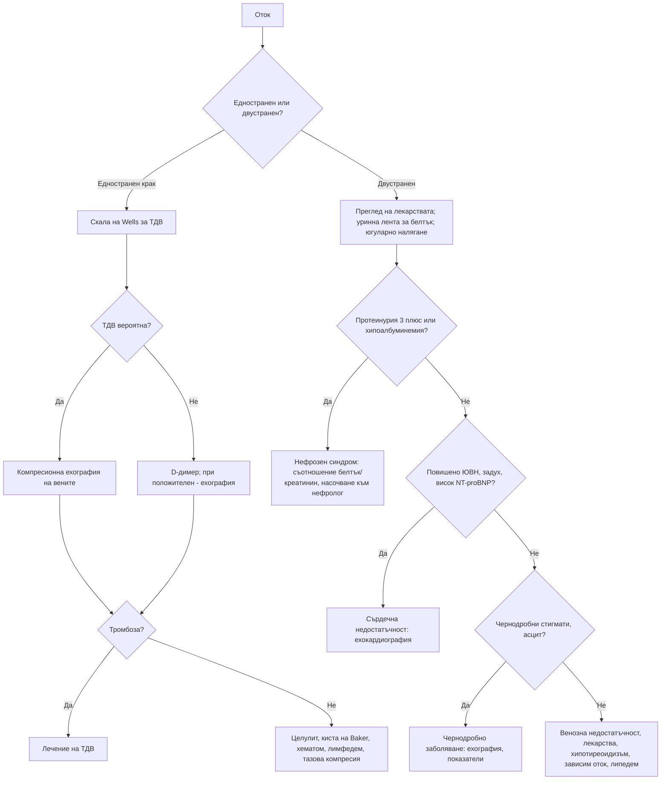

# Глава 8. Отоци

> **Част II. Общи симптоми**

## Цели на главата

- Да се обяснят патофизиологичните механизми на отока.
- Да се разграничават едностранните от двустранните, локализираните от генерализираните и оставящите от неоставящите ямка отоци.
- Да се познават най-честите и най-опасните причини за оток на краката, лицето и ръцете.
- Да се прилага минимален, но ефективен набор от изследвания.

---

## 1. Патофизиология

Обменът на течности в капилярите се определя от силите на Starling. Отокът възниква при един или повече от следните механизми:

| Механизъм | Заболявания |
|---|---|
| **Повишено хидростатично налягане в капилярите** | Сърдечна недостатъчност, хронична венозна недостатъчност, тромбоза на дълбоките вени, задръжка на натрий (бъбречно заболяване), бременност, лекарства (калциеви антагонисти) |
| **Понижено онкотично налягане** (хипоалбуминемия) | Нефрозен синдром, чернодробна цироза, ентеропатия със загуба на белтък, тежко недохранване |
| **Повишена капилярна пропускливост** | Възпаление, изгаряния, сепсис, алергия, ангиоедем, синдром на капилярния теч |
| **Нарушен лимфен отток** (лимфедем) | Първичен лимфедем; вторичен — след операция, лъчетерапия, при тумори, рецидивиращ целулит |
| **Натрупване на гликозаминогликани** | Хипотиреоидизъм (микседем), претибиален микседем при болест на Graves |

**Липедемът** не е истински оток. Той е симетрично натрупване на болезнена мастна тъкан по краката и седалището при жени. Стъпалата са пощадени („белег на маншета“). Отокът не оставя ямка.

---

## 2. Клинична класификация

| Признак | Варианти | Значение |
|---|---|---|
| **Разпространение** | Локализиран / генерализиран (анасарка) | Генерализираният оток насочва към сърдечна, бъбречна или чернодробна причина или към хипоалбуминемия |
| **Симетрия** | Едностранен / двустранен | **Едностранният оток на крака означава тромбоза на дълбоките вени, докато не се докаже противното** |
| **Ямка при натиск** | Оставящ ямка / неоставящ ямка | Неоставящият ямка оток насочва към лимфедем, микседем или липедем |
| **Начало** | Остро (часове–дни) / хронично | Острото начало насочва към тромбоза, целулит, ангиоедем, остър нефрит |
| **Болезненост** | Болезнен / неболезнен | Болезненият оток насочва към тромбоза, целулит, руптура на киста на Baker, компартмент синдром |

---

## 3. Етиологична класификация по локализация

### 3.1. Едностранен оток на долен крайник

| Заболяване | Насочващи белези |
|---|---|
| **Тромбоза на дълбоките вени** | Болка, оток на цялата подбедрица или на целия крак, разлика в обиколката над 3 cm, рискови фактори |
| **Целулит / еризипел** | Зачервяване, затопляне, треска, входна врата (гъбична инфекция между пръстите, рана) |
| **Руптура на киста на Baker** | Анамнеза за гонартроза или ревматоиден артрит, внезапна болка в подколенната ямка и прасеца, кръвонасядане около глезена (белег на полумесеца) |
| **Разкъсване на мускул** (медиалната глава на *m. gastrocnemius*) | Внезапна болка при спортна активност („удар с камък по прасеца“), кръвонасядане |
| **Хематом** | Травма, антикоагулантна терапия |
| **Посттромботичен синдром** | Прекарана тромбоза, хроничен оток, тежест, пигментация, язви |
| **Хронична венозна недостатъчност** (асиметрична) | Разширени вени, пигментация, липодерматосклероза |
| **Лимфедем** | Неоставящ ямка, засягане на стъпалото и пръстите, белег на Stemmer (кожата над втория пръст не може да се повдигне в гънка) |
| **Компресия на тазовите вени** | Тумор, лимфаденопатия, бременност, синдром на May-Thurner (компресия на лявата обща илиачна вена) |
| **Компартмент синдром** | Силна болка, особено при пасивно разтягане, след травма или усилие; спешно състояние |
| **Сложен регионален болков синдром** | Болка, промени в цвета и температурата, изпотяване след травма |
| **Невроартропатия на Charcot** | Диабетна невропатия, горещо, подуто стъпало, често без болка |

### 3.2. Двустранен оток на долните крайници

| Заболяване | Насочващи белези |
|---|---|
| **Хронична венозна недостатъчност** | Най-честата причина; оток вечер, който намалява след нощна почивка; разширени вени; пигментация |
| **Лекарства** | **Калциеви антагонисти** (амлодипин, нифедипин), НСПВС, глитазони, кортикостероиди, естрогени, габапентин и прегабалин, миноксидил |
| **Сърдечна недостатъчност** | Задух, ортопнея, повишено югуларно венозно налягане, хепатоюгуларен рефлукс, хрипове, трети тон |
| **Белодробна хипертония** | Задух, признаци на деснокамерна недостатъчност; обструктивна сънна апнея, ХОББ, белодробна тромбемболия |
| **Нефрозен синдром** | Протеинурия > 3,5 g/24 h, хипоалбуминемия, хиперлипидемия, пенлива урина, периорбитален оток сутрин |
| **Хронично бъбречно заболяване, остър нефрит** | Хипертония, хематурия, повишен креатинин |
| **Чернодробна цироза** | Асцит, жълтеница, стигмати на хронично чернодробно заболяване, тромбоцитопения |
| **Хипотиреоидизъм** | Неоставящ ямка оток, суха кожа, студоусещане, брадикардия |
| **Бременност, прееклампсия** | Физиологичен оток или хипертония с протеинурия, главоболие, зрителни нарушения |
| **Идиопатичен (цикличен) оток** | Жени в детеродна възраст, наддаване на тегло през деня, често при употреба на диуретици и слабителни |
| **Зависим оток** | Обездвижени пациенти, които прекарват деня седнали в креслото |
| **Ентеропатия със загуба на белтък, недохранване** | Хипоалбуминемия без протеинурия и без чернодробно заболяване |
| **Липедем** | Жени; симетрични, болезнени „колони“; пощадени стъпала |

### 3.3. Оток на лицето и периорбитален оток

| Заболяване | Насочващи белези |
|---|---|
| **Ангиоедем** | Асиметричен оток на устните, езика, клепачите; при **АСЕ инхибитори** или наследствен ангиоедем обикновено без уртикария и сърбеж; риск от обструкция на дихателните пътища |
| **Алергична реакция** | Уртикария, сърбеж, известен алерген |
| **Нефрозен синдром** | Периорбитален оток сутрин, особено при деца |
| **Хипотиреоидизъм** | Подпухнало лице, загрубяване на чертите |
| **Трихинелоза** | Периорбитален оток, треска, миалгии, еозинофилия след консумация на свинско месо или месо от дива свиня |
| **Синдром на горната празна вена** | Оток на лицето, шията и ръцете, разширени вени по гръдната стена, задух; карцином на белия дроб, лимфом, централни венозни катетри |
| **Дерматомиозит** | Виолетов (хелиотропен) оток на клепачите, проксимална мускулна слабост |
| **Орбитален целулит** | Едностранен, болезнен, с треска, нарушени движения на окото, проптоза; спешно състояние |
| **Синдром на Cushing** | Лице с форма на луна |
| **Инфекциозна мононуклеоза** | Оток на клепачите в ранния стадий |

### 3.4. Оток на горен крайник

- **Тромбоза на дълбоките вени на ръката:** при централен венозен катетър, периферно въведен централен катетър или пейсмейкър, при злокачествено заболяване, след усилие (синдром на Paget-Schroetter при млади спортисти).
- **Лимфедем** след мастектомия, аксиларна дисекация или лъчетерапия.
- **Синдром на горната празна вена** (двустранен оток).
- **Целулит.**

---

## 4. Безопасна диагностична стратегия

| Въпрос | Отговор |
|---|---|
| **Вероятна диагноза** | Хронична венозна недостатъчност, лекарства, сърдечна недостатъчност, зависим оток |
| **Сериозни заболявания, които не бива да се пропускат** | Тромбоза на дълбоките вени; сърдечна недостатъчност; нефрозен синдром и остър гломерулонефрит; чернодробна цироза; прееклампсия; ангиоедем с обструкция на дихателните пътища; синдром на горната празна вена; компартмент синдром; некротизиращ фасциит |
| **Чести капани** | Лекарствен оток (калциеви антагонисти, прегабалин), руптура на киста на Baker, хипотиреоидизъм, белодробна хипертония при обструктивна сънна апнея, тазова формация, липедем |
| **Маскиращи заболявания** | Лекарства, хипотиреоидизъм, хронично бъбречно заболяване, злокачествени заболявания (компресия, хипоалбуминемия) |
| **Психосоциални аспекти** | Прекомерна употреба на диуретици и слабителни (идиопатичен оток), самонараняване чрез турникет (рядко) |

## 5. Анамнеза и физикален преглед

**Анамнеза:**

- Начало, давност, едностранност, болка, зачервяване.
- Задух, ортопнея, пароксизмален нощен задух.
- Пенлива урина, промяна в цвета на урината.
- Прием на алкохол, прекарани хепатити.
- Студоусещане, запек, суха кожа.
- Лекарства, особено наскоро започнати.
- Рискови фактори за тромбоза: обездвижване, операция, злокачествено заболяване, естрогени, пътуване, бременност.
- При жени: връзка с менструалния цикъл, бременност.

**Физикален преглед:**

- Натиск за ямка поне 5–10 секунди над тибията или глезена. При лежащо болни се проверява и сакралната област.
- Разпространение, обиколка на подбедриците, измерена 10 cm под тибиалната тубероза.
- Цвят, температура и състояние на кожата: пигментация, липодерматосклероза, язви.
- **Югуларно венозно налягане** и хепатоюгуларен рефлукс.
- Сърце (шумове, трети тон), бял дроб (хрипове, излив).
- Корем: асцит, хепатомегалия, формации.
- Стигмати на чернодробно заболяване.
- Щитовидна жлеза.
- Периферни пулсации (преди компресивна терапия), лимфни възли.

## 6. Червени флагове

- Остър, болезнен, едностранен оток на крака (тромбоза на дълбоките вени).
- Задух, ортопнея, хипоксемия (сърдечна недостатъчност, белодробна тромбемболия).
- Оток на езика, устните или гърлото с дрезгав глас или стридор (ангиоедем).
- Изразена протеинурия, олигурия, макроскопска хематурия (нефрозен или нефритен синдром).
- Бременна с оток, хипертония, главоболие или зрителни нарушения (прееклампсия).
- Оток на лицето и ръцете с разширени вени по шията и гръдната стена (синдром на горната празна вена).
- Силна болка, непропорционална на находката, или болка при пасивно разтягане (компартмент синдром, некротизиращ фасциит).

## 7. Изследвания

**Основен набор при двустранен или генерализиран оток:**

- **тест с уринна лента за белтък** (ключово изследване) и съотношение албумин/креатинин в урината;
- ПКК, креатинин, eGFR, електролити;
- албумин, чернодробни показатели;
- ТСХ;
- **NT-proBNP** (сърдечна недостатъчност е малко вероятна при стойност под 125 pg/ml при хроничен оток);
- ЕКГ.

**Допълнително според клиничните данни:**

- ехокардиография;
- рентгенография на гръден кош;
- ехография на корема;
- 24-часова протеинурия;
- липиден профил (при нефрозен синдром).

**При едностранен оток:**

- оценка на клиничната вероятност по скалата на Wells за тромбоза на дълбоките вени;
- D-димер при ниска вероятност;
- **компресионна ехография на вените** при висока вероятност или положителен D-димер.

## 8. Диференциално-диагностична таблица на генерализирания оток

| Показател | Сърдечна недостатъчност | Нефрозен синдром | Чернодробна цироза | Хипотиреоидизъм |
|---|---|---|---|---|
| Югуларно венозно налягане | Повишено | Нормално | Нормално или ниско | Нормално |
| Задух, ортопнея | Да | Рядко (при излив) | Рядко (при напрегнат асцит) | Не |
| Протеинурия | Незначителна | Над 3,5 g/24 h | Няма | Няма |
| Албумин | Нормален или леко понижен | Силно понижен | Понижен | Нормален |
| Асцит | Възможен | Възможен | Типичен | Рядко |
| NT-proBNP | Повишен | Нормален или леко повишен | Нормален или леко повишен | Нормален |
| Други белези | Трети тон, кардиомегалия | Хиперлипидемия, пенлива урина | Жълтеница, тромбоцитопения, стигмати | Висок ТСХ, брадикардия, суха кожа |

## 9. Диагностичен алгоритъм

## 10. Особености в общата практика

- Преди да назначите диуретик, отговорете на въпроса *„Защо има оток?“*. Отокът от калциеви антагонисти не се повлиява от диуретици. Помага намаляването на дозата или смяната на лекарството.
- Диуретиците при венозна недостатъчност и зависим оток обикновено са неефективни и рискови: водят до хипокалиемия, хипонатриемия, дехидратация и падания. Основното лечение е компресията, раздвижването и повдигането на краката.
- Преди компресивна терапия трябва да се изключи периферна артериална болест, например чрез измерване на глезенно-брахиалния индекс.

## 11. Клинични перли

- Тестът с уринна лента за белтък е най-евтиното и едно от най-ценните изследвания при всеки генерализиран оток.
- При нормално югуларно венозно налягане и нормален NT-proBNP сърдечната недостатъчност е малко вероятна причина за отока.
- Едностранният оток на крака е тромбоза, докато не се докаже противното. Това важи с особена сила при злокачествено заболяване, скорошна операция, бременност и прием на естрогени.
- Периорбитален оток, треска, миалгии и еозинофилия след консумация на домашно свинско месо или месо от дива свиня: трихинелоза.
- Ангиоедемът при пациент на АСЕ инхибитор може да се появи дори след години лечение. Антихистамините и кортикостероидите не помагат.

## 12. Клиничен случай

**Случай.** Мъж на 47 години се оплаква от подуване на краката и на лицето сутрин от 3 седмици. Урината му е пенлива. Наддал е 6 kg. Няма задух. Няма известни заболявания и приема само ибупрофен при болки в гърба. АН 142/90 mmHg. Двустранен оток до коленете, оставящ ямка. Югуларното венозно налягане не е повишено. Тестът с уринна лента показва белтък 4+ и следи кръв. Албумин 21 g/l, общ холестерол 9,2 mmol/l, креатинин 94 µmol/l.

**Въпроси.** 1) Какъв е синдромът? 2) Какви са възможните причини при възрастен? 3) Кои са основните усложнения?

**Обсъждане.** Протеинурия от нефрозен порядък, хипоалбуминемия, отоци и хиперлипидемия образуват **нефрозен синдром**. Основните причини при възрастни са:

- мембранозна нефропатия (антитела срещу PLA2R, понякога свързана със злокачествено заболяване);
- фокално-сегментна гломерулосклероза;
- болест на минималните промени, включително лекарствено индуцирана от НСПВС;
- диабетна нефропатия;
- амилоидоза;
- лупусен нефрит.

Основните усложнения са тромбозите (включително на бъбречната вена и белодробна тромбемболия), инфекциите, хиперлипидемията и острото бъбречно увреждане. Пациентът трябва да бъде насочен спешно към нефролог за изясняване, включително бъбречна биопсия. НСПВС трябва да бъдат спрени.

**Поука.** Един тест с уринна лента за белтък насочва диагнозата в правилната посока още в кабинета.

<!-- навигация -->

---

[← Глава 7. Лимфаденопатия и спленомегалия](07-limfadenopatia.md) · [Съдържание](../README.md) · [Глава 9. Болка в гърдите →](09-bolka-v-gardite.md)
