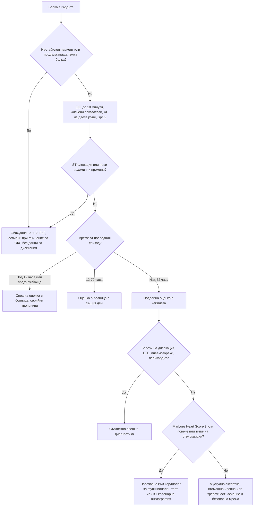

# Глава 9. Болка в гърдите

> **Част III. Сърдечно-съдова система**

## Цели на главата

- Да се разпознават шестте животозастрашаващи причини за болка в гърдите.
- Да се оценява диагностичната стойност на характеристиките на болката.
- Да се тълкуват ЕКГ и тропонинът в контекста на претестовата вероятност.
- Да се прилагат клинични правила (Marburg Heart Score, HEART, скалата на Wells, PERC, ADD-RS).
- Да се определя нивото на спешност в общата практика.

---

## 1. Въведение

Болката в гърдите е едно от най-тревожните за пациента и за лекаря оплаквания. В общата практика нейните причини се разпределят приблизително така:

| Група причини | Приблизителен дял в общата практика |
|---|---|
| Мускулно-скелетни (гръдна стена) | 20–50% |
| Стомашно-чревни (главно ГЕРБ) | 10–20% |
| Сърдечни (стабилна стенокардия и ОКС) | 10–15% (от тях ОКС 1,5–4%) |
| Психогенни (паническо и тревожно разстройство) | 5–10% |
| Дихателни | 5–10% |
| Други и неизяснени | 10–20% |

Сериозните причини са относително редки, но пропускането им може да бъде фатално. Затова **първата задача е изключването на животозастрашаващите състояния**, а втората е намирането на вероятната причина.

---

## 2. Етиологична класификация

| Система | Заболявания |
|---|---|
| **Сърце** | Остър коронарен синдром (STEMI, NSTEMI, нестабилна стенокардия); стабилна стенокардия (хроничен коронарен синдром); вазоспастична стенокардия; микроваскуларна стенокардия; спонтанна дисекация на коронарна артерия; перикардит; миокардит; аортна стеноза; хипертрофична кардиомиопатия; стрес-кардиомиопатия (Takotsubo); тахиаритмии |
| **Аорта и съдове** | **Дисекация на аортата**; интрамурален хематом; руптура на аневризма на гръдната аорта |
| **Бял дроб и плевра** | **Белодробна тромбемболия**; **пневмоторакс** (включително тензионен); пневмония с плеврит; вирусен плеврит; белодробна хипертония; карцином на белия дроб (включително тумор на Pancoast) |
| **Храносмилателна система** | ГЕРБ и езофагит; езофагеален спазъм; **руптура на хранопровода** (синдром на Boerhaave); пептична язва; жлъчна колика и холецистит; панкреатит |
| **Гръдна стена и гръбначен стълб** | Костохондрит; синдром на Tietze; мускулно разтягане; фрактура на ребро (включително при кашлица при остеопороза); дисфункция на гръдния отдел на гръбначния стълб с радикулерна болка; метастази в ребрата; фибромиалгия |
| **Кожа и нерви** | **Херпес зостер** (болката предшества обрива с 2–3 дни) |
| **Медиастинум** | Медиастинит, пневмомедиастинум, тумори |
| **Психогенни** | Паническо разстройство, генерализирана тревожност, хипервентилация, депресия |
| **Други** | Анемия (исхемия поради повишени нужди), тиреотоксикоза, употреба на кокаин и амфетамини |

### 2.1. Шестте животозастрашаващи причини

1. **Остър коронарен синдром**
2. **Дисекация на аортата**
3. **Белодробна тромбемболия**
4. **Тензионен пневмоторакс**
5. **Сърдечна тампонада**
6. **Руптура на хранопровода**

---

## 3. Безопасна диагностична стратегия

| Въпрос | Отговор |
|---|---|
| **Вероятна диагноза** | Мускулно-скелетна болка (костохондрит), ГЕРБ, стабилна стенокардия, тревожност |
| **Сериозни заболявания, които не бива да се пропускат** | ОКС, дисекация на аортата, белодробна тромбемболия, пневмоторакс, перикардит с тампонада, миокардит, руптура на хранопровода, пневмония, аортна стеноза |
| **Чести капани** | Херпес зостер преди обрива; жлъчна колика; езофагеален спазъм (повлиява се от нитроглицерин); ОКС с „атипична“ картина при жени, диабетици и възрастни; спонтанна дисекация на коронарна артерия при млади жени (включително след раждане); стрес-кардиомиопатия; кокаин; фрактура на ребро |
| **Маскиращи заболявания** | Депресия, анемия, тиреотоксикоза, гръбначна дисфункция |
| **Психосоциални аспекти** | Паническо разстройство, страх от инфаркт (често след смърт на близък), вторична полза |

---

## 4. Анамнеза

### 4.1. Ключови въпроси

- **Начало:** внезапно, за секунди (дисекация, пневмоторакс, белодробна тромбемболия), или постепенно?
- **Характер:** притискаща, стягаща, пареща, тежест (исхемия); раздираща, режеща (дисекация); пробождаща, свързана с дишането (плеврална); пареща след хранене (рефлукс).
- **Локализация и ирадиация:** зад гръдната кост, към челюстта, шията, едната или двете ръце, междулопатъчно.
- **Продължителност:** секунди (обикновено несърдечна); 2–10 минути (стенокардия); над 20 минути (ОКС, дисекация, перикардит); постоянна в продължение на дни (обикновено мускулно-скелетна).
- **Провокиращи фактори:** физическо усилие, студ, емоции, хранене (исхемия); дишане, кашлица (плеврит, перикардит, мускулно-скелетна); движение и натиск (гръдна стена); лягане (рефлукс, перикардит).
- **Облекчаващи фактори:** покой (исхемия); навеждане напред (перикардит); антиациди (рефлукс, но това не изключва исхемия).
- **Придружаващи симптоми:** изпотяване, гадене, задух, сърцебиене, синкоп, хемоптиза, треска, повръщане преди болката (Boerhaave), неврологичен дефицит (дисекация).
- **Рискови фактори:** за атеросклероза (възраст, пол, тютюнопушене, хипертония, диабет, дислипидемия, фамилна обремененост, хронично бъбречно заболяване); за тромбоемболизъм; за дисекация (хипертония, синдром на Marfan, двукуспидна аортна клапа, аневризма, кокаин, бременност).

### 4.2. Диагностична стойност на характеристиките на болката за ОКС

| Характеристика | LR |
|---|---|
| Ирадиация към дясната ръка или рамо | ≈ 4,7 |
| Ирадиация към двете ръце или рамена | ≈ 4,1 |
| Свързана с физическо усилие | ≈ 2,4 |
| Ирадиация към лявата ръка | ≈ 2,3 |
| Изпотяване | ≈ 2,0 |
| Гадене или повръщане | ≈ 1,9 |
| Като предишен инфаркт или по-силна от обичайната стенокардия | ≈ 1,8 |
| Притискаща болка | ≈ 1,3 |
| **Плеврална** болка | ≈ 0,2 |
| Зависима от положението на тялото | ≈ 0,3 |
| Остра, пробождаща | ≈ 0,3 |
| Възпроизвеждана при палпация | ≈ 0,3 |
| Несвързана с усилие | ≈ 0,8 |

*По Swap и Nagurney, JAMA 2005. Нито една отделна характеристика не може сама да потвърди или да изключи ОКС.*

**Важно:** облекчаването на болката от нитроглицерин или от антиацид **няма** диагностична стойност. Нитроглицеринът облекчава и езофагеалния спазъм, а болката при ОКС може спонтанно да намалее.

---

## 5. Физикален преглед

- **Жизнени показатели:** АН **на двете ръце** (разлика над 20 mmHg насочва към дисекация), пулс, дихателна честота, SpO₂, температура.
- **Общ оглед:** изпотяване, бледост, цианоза, неспокойствие.
- **Шия:** повишено югуларно венозно налягане (тампонада, тензионен пневмоторакс, белодробна тромбемболия, деснокамерна недостатъчност), девиация на трахеята, подкожен емфизем.
- **Сърце:** шумове (нов диастолен шум на аортна регургитация при дисекация; систолен шум на аортна стеноза), триене (перикардит), приглушени тонове (тампонада), трети тон.
- **Бял дроб:** асиметрично дишане, хиперсонорен перкуторен тон (пневмоторакс), хрипове, притъпяване, плеврално триене.
- **Гръдна стена:** болезненост при палпация на ребрените хрущяли и мускулите. Възпроизвеждането на **точно същата** болка намалява, но не изключва вероятността за ОКС.
- **Кожа:** везикули в един дерматом (херпес зостер).
- **Корем:** болезненост в епигастриума или в десния горен квадрант.
- **Крака:** признаци на тромбоза на дълбоките вени.
- **Пулсации:** дефицит на пулса, неврологичен дефицит (дисекация).
- **Парадоксален пулс** (спадане на систолното налягане с над 10 mmHg при вдишване) — тампонада.

---

## 6. Червени флагове

- Продължаваща болка над 15–20 минути или болка в покой.
- Изпотяване, бледост, гадене, повръщане.
- Хипотония, тахикардия или брадикардия, аритмия, синкоп.
- Задух, хипоксемия, дихателна честота над 24/min.
- Раздираща болка с ирадиация към гърба, разлика в АН на двете ръце, неврологичен дефицит.
- Внезапна плеврална болка със задух.
- Болка след силно повръщане, подкожен емфизем.
- Повишено югуларно венозно налягане, приглушени сърдечни тонове.
- Нови промени в ЕКГ.

---

## 7. Диференциално-диагностична таблица

| Заболяване | Характер на болката | Придружаващи белези | Физикална находка | Ключови изследвания |
|---|---|---|---|---|
| **ОКС** | Притискаща, стягаща, зад гръдната кост, ирадиация към ръцете, челюстта; над 20 min | Изпотяване, гадене, задух | Често нормална; възможни трети тон, хрипове, хипотония | ЕКГ (в рамките на 10 min), високочувствителен тропонин (серийно) |
| **Стабилна стенокардия** | Като при ОКС, но предизвикана от усилие и облекчавана от покой за под 5–10 min | Задух при усилие | Нормална | ЕКГ, ехокардиография, КТ коронарна ангиография или функционален тест |
| **Дисекация на аортата** | Внезапна, максимална още в началото, раздираща, мигрираща, към гърба | Синкоп, неврологичен дефицит, исхемия на крайник | Разлика в пулса и АН, шум на аортна регургитация | КТ-ангиография на аортата; ADD-RS и D-димер; трансезофагеална ехокардиография |
| **Белодробна тромбемболия** | Плеврална, внезапна | Задух, тахикардия, хемоптиза, синкоп | Тахипнея, хипоксемия, признаци на ТДВ | Скали на Wells/PERC, D-димер, КТ-ангиография на белодробните артерии |
| **Пневмоторакс** | Внезапна, плеврална, едностранна | Задух | Отслабено дишане, хиперсонорен тон | Рентгенография, ехография |
| **Перикардит** | Остра, пробождаща, засилва се при лягане и вдишване, облекчава се при навеждане напред; ирадиация към трапецовидния мускул | Предхождаща вирусна инфекция, треска | Перикардно триене | ЕКГ (дифузна конкавна ST-елевация, PR-депресия), CRP, ехокардиография |
| **Миокардит** | Различна, често като при перикардит | Вирусен продром, сърцебиене, задух | Тахикардия, признаци на сърдечна недостатъчност | Тропонин, ЕКГ, ехокардиография, ЯМР на сърцето |
| **Руптура на хранопровода** | Силна, зад гръдната кост, след повръщане | Сепсис, задух | Подкожен емфизем, „хрущене“ синхронно със сърдечната дейност (белег на Hamman) | Рентгенография (пневмомедиастинум, ляв плеврален излив), КТ с перорален контраст |
| **ГЕРБ/езофагит** | Пареща, след хранене и при лягане | Регургитация, кисел вкус | Нормална | Пробно лечение с ИПП; ендоскопия при алармиращи белези |
| **Езофагеален спазъм** | Притискаща, зад гръдната кост | Дисфагия за твърди храни и течности | Нормална | Манометрия; **повлиява се от нитроглицерин** |
| **Жлъчна колика** | В епигастриума или десния горен квадрант, към дясната лопатка, след мазна храна | Гадене, повръщане | Болезненост в десния горен квадрант | Ехография |
| **Костохондрит** | Остра или тъпа, локализирана, при движение и дишане | Няма | Болезненост на ребрените хрущяли, възпроизвеждаща болката | Клинична диагноза |
| **Херпес зостер** | Пареща, в дерматом, едностранна | Парестезии, после везикули | Хиперестезия, по-късно обрив | Клинична диагноза |
| **Паническо разстройство** | Различна, често със стягане | Сърцебиене, изтръпване около устата и на пръстите, страх от смърт, задух | Тахикардия, хипервентилация | Диагноза след изключване на органичните причини |

---

## 8. Изследвания

### 8.1. ЕКГ

ЕКГ се записва **в рамките на 10 минути** от първия контакт при всяка болка, подозрителна за ОКС. **Нормалната ЕКГ не изключва ОКС.** При NSTEMI тя често е нормална или неспецифична. Ако болката продължава, записът се повтаря.

| Находка | Значение |
|---|---|
| ST-елевация в ≥ 2 съседни отвеждания | STEMI (прагът зависи от отвеждането, пола и възрастта; в V2–V3 е по-висок) |
| Нов ляв бедрен блок, ST-депресия във V1–V3 с високи R-зъбци (заден инфаркт), двуфазни или дълбоки отрицателни T-зъбци във V2–V3 (синдром на Wellens), ST-елевация в aVR с дифузна ST-депресия | Еквиваленти на STEMI или критична коронарна стеноза |
| Дифузна конкавна ST-елевация с PR-депресия, без реципрочни промени | Перикардит |
| Синусова тахикардия, S1Q3T3, десен бедрен блок, отрицателни T-зъбци във V1–V4 | Белодробна тромбемболия (ниска чувствителност) |
| Нисък волтаж, електрически алтернанс | Перикарден излив и тампонада |
| Левокамерна хипертрофия с промени в реполяризацията | Аортна стеноза, хипертрофична кардиомиопатия, хипертония |

### 8.2. Високочувствителен тропонин

- Изследва се в болнични условия по бързи алгоритми (0/1 h или 0/2 h, съгласно препоръките на ESC).
- Повишен тропонин **не е синоним на инфаркт**. Такова повишение се среща и при миокардит, белодробна тромбемболия, сепсис, сърдечна недостатъчност, тахиаритмии, хронично бъбречно заболяване, дисекация на аортата, стрес-кардиомиопатия и след усилие. Решаваща е **динамиката** (покачване и/или спадане).
- **В общата практика не се разчита на единичен тропонин за изключване на ОКС** при пациент с болка през последните 72 часа.

### 8.3. Други изследвания

- **Рентгенография на гръден кош:** пневмоторакс, пневмония, разширен медиастинум (дисекация, с ниска чувствителност), пневмомедиастинум, фрактури.
- **D-димер:** изключва белодробна тромбемболия при ниска или междинна вероятност. Помага за изключване на дисекация при нисък ADD-RS.
- **Ехокардиография:** перикарден излив, регионални нарушения в кинетиката, деснокамерна дилатация, аортна стеноза, дисекация на аортния корен.
- **КТ-ангиография** (на аортата или белодробните артерии), **КТ коронарна ангиография** при стабилни симптоми.

---

## 9. Клинични правила

### 9.1. Marburg Heart Score (за общата практика)

| Критерий | Точки |
|---|---|
| Жена ≥ 65 години или мъж ≥ 55 години | 1 |
| Известна съдова болест (коронарна, мозъчно-съдова или периферна) | 1 |
| Болката се засилва при физическо усилие | 1 |
| Болката не се възпроизвежда при палпация | 1 |
| Пациентът смята, че болката е сърдечна | 1 |

**0–2 точки:** ниска вероятност за исхемична болест на сърцето като причина за болката (отрицателна предсказваща стойност около 98%). **3 точки:** междинна вероятност. **4–5 точки:** висока вероятност. Скалата помага за решения в общата практика, но не замества оценката на спешността.

### 9.2. Точков сбор HEART (в спешно отделение)

Точков сбор за оценка на риска при съмнение за ОКС. Оценяват се пет компонента, всеки с 0–2 точки: **H**istory (анамнеза), **E**CG, **A**ge (възраст), **R**isk factors (рискови фактори) и **T**roponin (тропонин). Сбор 0–3 означава нисък риск от голямо сърдечно събитие през следващите 6 седмици.

### 9.3. Белодробна тромбемболия

- **Правило PERC.** При ниска клинична вероятност БТЕ практически се изключва, ако са изпълнени всички осем условия:
  - възраст под 50 години;
  - пулс под 100/min;
  - SpO₂ ≥ 95%;
  - липса на хемоптиза;
  - липса на прием на естрогени;
  - липса на прекарана венозна тромбоемболия;
  - липса на едностранен оток на крака;
  - липса на операция или травма, наложила хоспитализация, през последните 4 седмици.
- **Модифицирана скала на Wells:**

| Критерий | Точки |
|---|---|
| Клинични белези на ТДВ | 3 |
| БТЕ е най-вероятната диагноза | 3 |
| Пулс > 100/min | 1,5 |
| Имобилизация ≥ 3 дни или операция през последните 4 седмици | 1,5 |
| Прекарана ТДВ или БТЕ | 1,5 |
| Хемоптиза | 1 |
| Активно злокачествено заболяване | 1 |

  Над 4 точки БТЕ е вероятна и се назначава образно изследване. До 4 точки се изследва D-димер. Прагът на D-димера след 50-годишна възраст се коригира: възрастта × 10 µg/l.

### 9.4. Дисекация на аортата (ADD-RS)

Скалата има три категории. Всяка категория, в която е налице поне един белег, носи по 1 точка:

1. **Високорискови състояния:** синдром на Marfan или друго заболяване на съединителната тъкан, фамилна анамнеза за аортно заболяване, известна аортна клапна болест или аневризма, скорошна манипулация на аортата.
2. **Високорискови характеристики на болката:** внезапно начало, много силна болка, раздиращ характер.
3. **Високорискови находки при прегледа:** дефицит на пулса, разлика в систолното налягане, фокален неврологичен дефицит, нов шум на аортна регургитация, хипотония или шок.

При сбор 0–1 и отрицателен D-димер (под 500 µg/l) дисекацията е малко вероятна.

---

## 10. Диагностичен алгоритъм

---

## 11. Особености в общата практика

- Спешни случаи (продължаваща болка, болка през последните 12 часа с отклонения в ЕКГ, нестабилност): обаждане на 112. Пациентът не бива сам да шофира до болницата. При съмнение за ОКС без противопоказания и без данни за дисекация се дава аспирин за сдъвкване. Кислород се дава само при SpO₂ под 90%.
- ЕКГ в кабинета е полезна, но не бива да забавя транспорта при очевиден ОКС.
- Пациент с болка, преминала преди 12–72 часа, се оценява в болница в същия ден.
- Не оценявайте симптомите различно при мъже и жени. Жените, диабетиците и възрастните по-често имат задух, умора, епигастрален дискомфорт или гадене вместо класическа болка.

---

## 12. Клинични перли

- „Всяка болка в гърдите заслужава ЕКГ.“ Нормалната ЕКГ обаче не изключва ОКС.
- Внезапната, максимална още в началото болка, особено с ирадиация към гърба, е дисекация, докато не се докаже противното. Тромболизата и антикоагулацията могат да бъдат фатални при дисекация.
- Дисекацията, която обхваща дясната коронарна артерия, може да се представи като долен STEMI.
- Болка в гърдите при млад човек: помислете за кокаин, пневмоторакс, перикардит, миокардит и белодробна тромбемболия.
- Жена в перипарталния период или млада жена без рискови фактори с ОКС: мислете за спонтанна дисекация на коронарна артерия.
- Пареща болка в един дерматом без обрив при възрастен човек: херпес зостер. Обривът ще се появи след 2–3 дни.
- Паническа атака се диагностицира едва след като органичните причини са разумно изключени, особено при пациенти с рискови фактори.

---

## 13. Клиничен случай

**Случай.** Жена на 71 години с диабет тип 2 и хипертония се обажда сутринта. От около два часа изпитва „лошо храносмилане“, дискомфорт в епигастриума, гадене и необичайна слабост. Мисли, че е яла нещо развалено. Не съобщава за болка в гърдите. При посещението на лекаря вкъщи тя е бледа и леко изпотена, пулс 98/min, АН 108/70 mmHg, SpO₂ 95%. Коремът е мек, неболезнен.

**Въпроси.** 1) Кое пристрастие застрашава диагнозата? 2) Какво трябва да се направи веднага?

**Обсъждане.** Възрастта, диабетът, хипертонията, изпотяването, бледността и относителната хипотония при „диспепсия“ без коремна находка насочват към **ОКС с атипично представяне**. Опасността е **пристрастието на представителността**: картината „не прилича“ на инфаркт. ЕКГ на място показва хоризонтална ST-депресия от 2 mm във V4–V6. Лекарят се обажда на 112, дава аспирин и пациентката е транспортирана в болница с възможност за инвазивно лечение. Тропонинът е повишен и нараства при повторното изследване. Поставена е диагноза NSTEMI, а коронарографията показва тежка стеноза на циркумфлексната артерия.

**Поука.** При възрастни хора, жени и диабетици исхемията често се проявява без болка в гърдите, а с диспепсия, задух, слабост или объркване. При всеки такъв пациент с неясно неразположение трябва да се запише ЕКГ.
