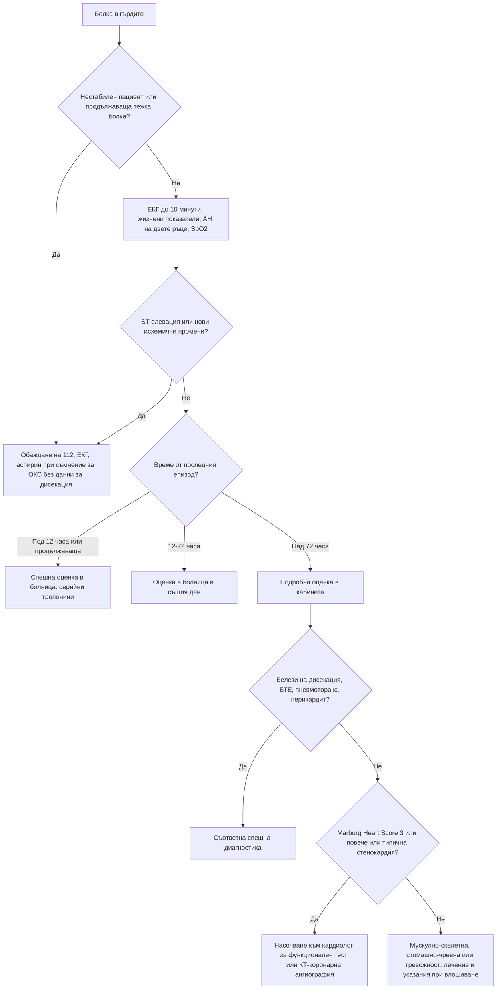

# Глава 9. Болка в гърдите

> **Част III. Сърдечно-съдова система**

## Цели на главата

- Да се разпознават шестте животозастрашаващи причини за болка в гърдите.
- Да се тълкува диагностичната стойност (отношение на правдоподобие) на характеристиките на болката.
- Да се тълкуват ЕКГ и тропонинът с оглед на претестовата вероятност.
- Да се прилагат клинични правила (Marburg Heart Score, HEART, скалата на Wells, PERC, ADD-RS).
- Да се определя нивото на спешност в общата практика.

## Ключови моменти

- В общата практика най-честа е мускулно-скелетната болка (около половината от случаите). ОКС е причина при 1,5–4% от пациентите [1, 2].
- Първата задача е изключването на шестте животозастрашаващи причини: ОКС, дисекация на аортата, белодробна тромбемболия, тензионен пневмоторакс, тампонада и руптура на хранопровода.
- ЕКГ се записва до 10 минути при всяка болка, подозрителна за ОКС. Нормалната ЕКГ не изключва ОКС *(SORT C [5])*.
- Нито една характеристика на болката не потвърждава или изключва ОКС. Облекчаването от нитроглицерин или антиацид няма диагностична стойност *(SORT B [3])*.
- Спешността зависи от времето на последния епизод: продължаваща болка или болка през последните 12 часа с патологична ЕКГ – 112; последен епизод преди 12–72 часа – оценка в болница в същия ден *(SORT C [6])*.
- Валидираните правила помагат за изключване: Marburg Heart Score 0–2 в общата практика, PERC и скала на Wells с D-димер за БТЕ, ADD-RS 0–1 с D-димер за дисекация *(SORT A [8, 9, 11–14])*.
- При съмнение за ОКС без данни за дисекация се дава 300 mg аспирин за сдъвкване. Кислород се дава само при SpO₂ под 90% *(SORT B [5, 6])*.

### Първите 60 секунди

- Оценете дишането, пулса, АН (на двете ръце), SpO₂ и съзнанието. При нестабилност или продължаваща болка се обадете на 112 веднага.
- Запишете ЕКГ до 10 минути, но не забавяйте транспорта при очевиден ОКС.
- При съмнение за ОКС без алергия и без данни за дисекация дайте 300 mg аспирин за сдъвкване. Кислород – само при SpO₂ под 90%.
- Потърсете бързо белезите на другите пет животозастрашаващи причини: разлика в АН и пулса (дисекация), едностранно отслабено дишане и девиация на трахеята (пневмоторакс), повишено югуларно венозно налягане и приглушени тонове (тампонада), тахикардия и хипоксемия (БТЕ), подкожен емфизем след повръщане (руптура на хранопровода).
- Не оставяйте пациента сам и не му позволявайте да шофира до болницата.

---

## 1. Въведение

Болката в гърдите е едно от най-тревожните за пациента и за лекаря оплаквания. В общата практика нейните причини се разпределят приблизително така (по проучвания в Германия и Швейцария) [1, 2]:

*Таблица 9.1. Причини за болка в гърдите в общата практика.*

| Група причини | Приблизителен дял в общата практика |
|---|---|
| Мускулно-скелетни (синдром на гръдната стена) | около 45–50% |
| Сърдечно-съдови (главно стабилна стенокардия) | 11–16% (от тях ОКС 1,5–4%) |
| Психогенни (паническо и тревожно разстройство, депресия) | около 10% |
| Дихателни | около 10% |
| Стомашно-чревни (главно ГЕРБ) | 5–10% |
| Други и неизяснени | около 5% |

Сериозните причини са относително редки, но пропускането им може да бъде фатално. Затова **първата задача е изключването на животозастрашаващите състояния**, а втората е намирането на вероятната причина.

---

## 2. Етиологична класификация

*Таблица 9.2. Причини за болка в гърдите по системи.*

| Система | Заболявания |
|---|---|
| **Сърце** | Остър коронарен синдром (STEMI, NSTEMI, нестабилна стенокардия); стабилна стенокардия (хроничен коронарен синдром); вазоспастична стенокардия; микроваскуларна стенокардия; спонтанна дисекация на коронарна артерия; перикардит; миокардит; аортна стеноза; хипертрофична кардиомиопатия; стрес-кардиомиопатия (Takotsubo); тахиаритмии |
| **Аорта и съдове** | Дисекация на аортата; интрамурален хематом; руптура на аневризма на гръдната аорта |
| **Бял дроб и плевра** | Белодробна тромбемболия; пневмоторакс (включително тензионен); пневмония с плеврит; вирусен плеврит; белодробна хипертония; карцином на белия дроб (включително тумор на Pancoast) |
| **Храносмилателна система** | ГЕРБ и езофагит; езофагеален спазъм; руптура на хранопровода (синдром на Boerhaave); пептична язва; жлъчна колика и холецистит; панкреатит |
| **Гръдна стена и гръбначен стълб** | Костохондрит; синдром на Tietze; мускулно разтягане; фрактура на ребро (включително при кашлица при остеопороза); дисфункция на гръдния отдел на гръбначния стълб с радикулерна болка; метастази в ребрата; фибромиалгия |
| **Кожа и нерви** | Херпес зостер (болката предшества обрива с 2–3 дни) |
| **Медиастинум** | Медиастинит, пневмомедиастинум, тумори |
| **Психогенни** | Паническо разстройство, генерализирана тревожност, хипервентилация, депресия |
| **Други** | Анемия (исхемия поради повишени нужди), тиреотоксикоза, употреба на кокаин и амфетамини |

### 2.1. Шестте животозастрашаващи причини

1. **Остър коронарен синдром**
2. **Дисекация на аортата**
3. **Белодробна тромбемболия**
4. **Тензионен пневмоторакс**
5. **Сърдечна тампонада**
6. **Руптура на хранопровода**

---

## 3. Безопасна диагностична стратегия

*Таблица 9.3. Безопасна диагностична стратегия.*

| Въпрос | Отговор |
|---|---|
| **Вероятна диагноза** | Мускулно-скелетна болка (костохондрит), ГЕРБ, стабилна стенокардия, тревожност |
| **Сериозни заболявания, които не бива да се пропускат** | ОКС, дисекация на аортата, белодробна тромбемболия, пневмоторакс, перикардит с тампонада, миокардит, руптура на хранопровода, пневмония, аортна стеноза |
| **Чести капани** | Херпес зостер преди обрива; жлъчна колика; езофагеален спазъм (повлиява се от нитроглицерин); ОКС с „атипична“ картина при жени, диабетици и възрастни; спонтанна дисекация на коронарна артерия при млади жени (включително след раждане); стрес-кардиомиопатия; кокаин; фрактура на ребро |
| **Маскиращи заболявания** | Депресия, анемия, тиреотоксикоза, гръбначна дисфункция |
| **Психосоциални аспекти** | Паническо разстройство, страх от инфаркт (често след смърт на близък), вторична полза |

---

## 4. Анамнеза

### 4.1. Ключови въпроси

- **Начало:** внезапно, за секунди (дисекация, пневмоторакс, белодробна тромбемболия), или постепенно?
- **Характер:** притискаща, стягаща, пареща, тежест (исхемия); раздираща, режеща (дисекация); пробождаща, свързана с дишането (плеврална); пареща след хранене (рефлукс).
- **Локализация и ирадиация:** зад гръдната кост, към челюстта, шията, едната или двете ръце, междулопатъчно.
- **Продължителност:** секунди (обикновено несърдечна); 2–10 минути (стенокардия); над 20 минути (ОКС, дисекация, перикардит); постоянна в продължение на дни (обикновено мускулно-скелетна).
- **Провокиращи фактори:** физическо усилие, студ, емоции, хранене (исхемия); дишане, кашлица (плеврит, перикардит, мускулно-скелетна); движение и натиск (гръдна стена); лягане (рефлукс, перикардит).
- **Облекчаващи фактори:** покой (исхемия); навеждане напред (перикардит); антиациди (рефлукс, но това не изключва исхемия).
- **Придружаващи симптоми:** изпотяване, гадене, задух, сърцебиене, синкоп, хемоптиза, треска, повръщане преди болката (Boerhaave), неврологичен дефицит (дисекация).
- **Рискови фактори:** за атеросклероза (възраст, пол, тютюнопушене, хипертония, диабет, дислипидемия, фамилна обремененост, хронично бъбречно заболяване); за тромбемболизъм; за дисекация (хипертония, синдром на Marfan, двукуспидна аортна клапа, аневризма, кокаин, бременност).

### 4.2. Диагностична стойност на характеристиките на болката за ОКС

*Таблица 9.4. Диагностична стойност на характеристиките на болката за ОКС.*

| Характеристика | LR |
|---|---|
| Ирадиация към дясната ръка или рамо | ≈ 4,7 |
| Ирадиация към двете ръце или рамена | ≈ 4,1 |
| Свързана с физическо усилие | ≈ 2,4 |
| Ирадиация към лявата ръка | ≈ 2,3 |
| Изпотяване | ≈ 2,0 |
| Гадене или повръщане | ≈ 1,9 |
| Като предишен инфаркт или по-силна от обичайната стенокардия | ≈ 1,8 |
| Притискаща болка | ≈ 1,3 |
| **Плеврална** болка | ≈ 0,2 |
| Зависима от положението на тялото | ≈ 0,3 |
| Остра, пробождаща | ≈ 0,3 |
| Възпроизвеждана при палпация | ≈ 0,3 |
| Несвързана с усилие | ≈ 0,8 |

*По систематичния преглед на Swap и Nagurney [3]. Нито една отделна характеристика не може сама да потвърди или да изключи ОКС.*

**Важно:** облекчаването на болката от нитроглицерин или от антиацид **няма** диагностична стойност. Нитроглицеринът облекчава и езофагеалния спазъм, а болката при ОКС може спонтанно да намалее.

---

## 5. Физикален преглед

- **Жизнени показатели:** АН **на двете ръце** (разлика над 20 mmHg насочва към дисекация), пулс, дихателна честота, SpO₂, температура.
- **Общ оглед:** изпотяване, бледост, цианоза, неспокойствие.
- **Шия:** повишено югуларно венозно налягане (тампонада, тензионен пневмоторакс, белодробна тромбемболия, деснокамерна недостатъчност), девиация на трахеята, подкожен емфизем.
- **Сърце:** шумове (нов диастолен шум на аортна регургитация при дисекация; систолен шум на аортна стеноза), триене (перикардит), приглушени тонове (тампонада), трети тон.
- **Бял дроб:** асиметрично дишане, хиперсонорен перкуторен тон (пневмоторакс), хрипове, притъпяване, плеврално триене.
- **Гръдна стена:** болезненост при палпация на ребрените хрущяли и мускулите. Възпроизвеждането на **точно същата** болка намалява, но не изключва вероятността за ОКС.
- **Кожа:** везикули в един дерматом (херпес зостер).
- **Корем:** болезненост в епигастриума или в десния горен квадрант.
- **Крака:** признаци на тромбоза на дълбоките вени.
- **Периферни пулсации и неврологичен статус:** дефицит на пулса, неврологичен дефицит (дисекация).
- **Парадоксален пулс** (спадане на систолното налягане с над 10 mmHg при вдишване) – тампонада.

---

## 6. Червени флагове

- Продължаваща болка над 15–20 минути или болка в покой.
- Изпотяване, бледост, гадене, повръщане.
- Хипотония, тахикардия или брадикардия, аритмия, синкоп.
- Задух, хипоксемия, дихателна честота над 24/min.
- Раздираща болка с ирадиация към гърба, разлика в АН на двете ръце, неврологичен дефицит.
- Внезапна плеврална болка със задух.
- Болка след силно повръщане, подкожен емфизем.
- Повишено югуларно венозно налягане, приглушени сърдечни тонове.
- Нови промени в ЕКГ.

---

## 7. Диференциално-диагностична таблица

*Таблица 9.5. Диференциална диагноза на болката в гърдите.*

| Заболяване | Характер на болката | Придружаващи белези | Физикална находка | Ключови изследвания |
|---|---|---|---|---|
| **ОКС** | Притискаща, стягаща, зад гръдната кост, ирадиация към ръцете, челюстта; над 20 min | Изпотяване, гадене, задух | Често нормална; възможни трети тон, хрипове, хипотония | ЕКГ (в рамките на 10 min), високочувствителен тропонин (серийно) |
| **Стабилна стенокардия** | Като при ОКС, но предизвикана от усилие и облекчавана от покой за под 5–10 min | Задух при усилие | Нормална | ЕКГ, ехокардиография, КТ-коронарна ангиография или функционален тест |
| **Дисекация на аортата** | Внезапна, максимална още в началото, раздираща, мигрираща, към гърба | Синкоп, неврологичен дефицит, исхемия на крайник | Разлика в пулса и АН, шум на аортна регургитация | КТ-ангиография на аортата; ADD-RS и D-димер; трансезофагеална ехокардиография |
| **Белодробна тромбемболия** | Плеврална, внезапна | Задух, тахикардия, хемоптиза, синкоп | Тахипнея, хипоксемия, признаци на ТДВ | Скали на Wells/PERC, D-димер, КТ-ангиография на белодробните артерии |
| **Пневмоторакс** | Внезапна, плеврална, едностранна | Задух | Отслабено дишане, хиперсонорен тон | Рентгенография, ехография |
| **Перикардит** | Остра, пробождаща, засилва се при лягане и вдишване, облекчава се при навеждане напред; ирадиация към трапецовидния мускул | Предхождаща вирусна инфекция, треска | Перикардно триене | ЕКГ (дифузна конкавна ST-елевация, PR-депресия), CRP, ехокардиография [4] |
| **Миокардит** | Различна, често като при перикардит | Вирусен продром, сърцебиене, задух | Тахикардия, признаци на сърдечна недостатъчност | Тропонин, ЕКГ, ехокардиография, ЯМР на сърцето |
| **Руптура на хранопровода** | Силна, зад гръдната кост, след повръщане | Сепсис, задух | Подкожен емфизем, „хрущене“ синхронно със сърдечната дейност (белег на Hamman) | Рентгенография (пневмомедиастинум, ляв плеврален излив), КТ с перорален контраст |
| **ГЕРБ/езофагит** | Пареща, след хранене и при лягане | Регургитация, кисел вкус | Нормална | Пробно лечение с ИПП; ендоскопия при алармиращи белези |
| **Езофагеален спазъм** | Притискаща, зад гръдната кост | Дисфагия за твърди храни и течности | Нормална | Манометрия; повлиява се от нитроглицерин |
| **Жлъчна колика** | В епигастриума или десния горен квадрант, към дясната лопатка, след мазна храна | Гадене, повръщане | Болезненост в десния горен квадрант | Ехография |
| **Костохондрит** | Остра или тъпа, локализирана, при движение и дишане | Няма | Болезненост на ребрените хрущяли, възпроизвеждаща болката | Клинична диагноза |
| **Херпес зостер** | Пареща, в дерматом, едностранна | Парестезии, после везикули | Хиперестезия, по-късно обрив | Клинична диагноза |
| **Паническо разстройство** | Различна, често със стягане | Сърцебиене, изтръпване около устата и на пръстите, страх от смърт, задух | Тахикардия, хипервентилация | Диагноза след изключване на органичните причини |

---

## 8. Изследвания

### 8.1. ЕКГ

ЕКГ се записва в рамките на 10 минути от първия контакт при всяка болка, подозрителна за ОКС [5]. Нормалната ЕКГ не изключва ОКС. При NSTEMI тя често е нормална или неспецифична. Ако болката продължава, записът се повтаря.

*Таблица 9.6. ЕКГ находки при болка в гърдите.*

| Находка | Значение |
|---|---|
| ST-елевация в ≥ 2 съседни отвеждания | STEMI (прагът зависи от отвеждането, пола и възрастта; в V2–V3 е по-висок) |
| Нов ляв бедрен блок, ST-депресия във V1–V3 с високи R-зъбци (заден инфаркт), двуфазни или дълбоки отрицателни T-зъбци във V2–V3 (синдром на Wellens), ST-елевация в aVR с дифузна ST-депресия | Еквиваленти на STEMI или критична коронарна стеноза |
| Дифузна конкавна ST-елевация с PR-депресия, без реципрочни промени | Перикардит |
| Синусова тахикардия, S1Q3T3, десен бедрен блок, отрицателни T-зъбци във V1–V4 | Белодробна тромбемболия (ниска чувствителност) |
| Нисък волтаж, електрически алтернанс | Перикарден излив и тампонада |
| Левокамерна хипертрофия с промени в реполяризацията | Аортна стеноза, хипертрофична кардиомиопатия, хипертония |

### 8.2. Високочувствителен тропонин

- Изследва се в болнични условия по бързи алгоритми (0/1 h или 0/2 h, съгласно препоръките на ESC) [5].
- Повишен тропонин не е синоним на инфаркт. Такова повишение се среща и при миокардит, белодробна тромбемболия, сепсис, сърдечна недостатъчност, тахиаритмии, хронично бъбречно заболяване, дисекация на аортата, стрес-кардиомиопатия и след усилие. Решаваща е динамиката (покачване и/или спадане) [5, 6].
- **В общата практика не се разчита на единичен тропонин за изключване на ОКС** при пациент с болка през последните 72 часа. Такъв пациент се оценява в болница [6].

### 8.3. Други изследвания

- **Рентгенография на гръден кош:** пневмоторакс, пневмония, разширен медиастинум (дисекация, с ниска чувствителност), пневмомедиастинум, фрактури.
- **D-димер:** изключва белодробна тромбемболия при ниска или междинна вероятност. Помага за изключване на дисекация при нисък ADD-RS.
- **Ехокардиография:** перикарден излив, регионални нарушения в кинетиката, деснокамерна дилатация, аортна стеноза, дисекация на аортния корен.
- КТ-ангиография (на аортата или белодробните артерии), КТ-коронарна ангиография при стабилни симптоми [7].

---

## 9. Клинични правила

### 9.1. Marburg Heart Score (за общата практика)

*Таблица 9.7. Marburg Heart Score (за общата практика).*

| Критерий | Точки |
|---|---|
| Жена ≥ 65 години или мъж ≥ 55 години | 1 |
| Известна съдова болест (коронарна, мозъчно-съдова или периферна) | 1 |
| Болката се засилва при физическо усилие | 1 |
| Болката не се възпроизвежда при палпация | 1 |
| Пациентът смята, че болката е сърдечна | 1 |

**0–2 точки:** ниска вероятност за исхемична болест на сърцето като причина за болката. При външно валидиране прагът от 3 точки има чувствителност около 89% и отрицателна предсказваща стойност около 98% [8, 9]. 3 точки: междинна вероятност. 4–5 точки: висока вероятност. Скалата помага за решения в общата практика, но не замества оценката на спешността.

### 9.2. Точков сбор HEART (в спешно отделение)

Точков сбор за оценка на риска при съмнение за ОКС. Оценяват се пет компонента, всеки с 0–2 точки: History (анамнеза), ECG, Age (възраст), Risk factors (рискови фактори) и Troponin (тропонин). Сбор 0–3 означава нисък риск: при валидирането голямо сърдечно събитие през следващите 6 седмици е настъпило при 1,7% от тези пациенти [10].

### 9.3. Белодробна тромбемболия

- **Правило PERC.** При ниска клинична вероятност БТЕ практически се изключва, ако са изпълнени всички осем условия [11]:
  - възраст под 50 години;
  - пулс под 100/min;
  - SpO₂ ≥ 95%;
  - липса на хемоптиза;
  - липса на прием на естрогени;
  - липса на прекарана венозна тромбемболия;
  - липса на едностранен оток на крака;
  - липса на операция или травма, наложила хоспитализация, през последните 4 седмици.
- **Модифицирана скала на Wells:**

*Таблица 9.8. Клинични правила при белодробна тромбемболия.*

| Критерий | Точки |
|---|---|
| Клинични белези на ТДВ | 3 |
| БТЕ е най-вероятната диагноза | 3 |
| Пулс > 100/min | 1,5 |
| Имобилизация ≥ 3 дни или операция през последните 4 седмици | 1,5 |
| Прекарана ТДВ или БТЕ | 1,5 |
| Хемоптиза | 1 |
| Активно злокачествено заболяване | 1 |

  Над 4 точки БТЕ е вероятна и се назначава образно изследване. До 4 точки се изследва D-димер [12]. След 50-годишна възраст прагът на D-димера може да се коригира: възрастта × 10 µg/l [12, 13].

### 9.4. Дисекация на аортата (ADD-RS)

Скалата има три категории. Всяка категория, в която е налице поне един белег, носи по 1 точка:

1. **Високорискови състояния:** синдром на Marfan или друго заболяване на съединителната тъкан, фамилна анамнеза за аортно заболяване, известна аортна клапна болест или аневризма, скорошна манипулация на аортата.
2. **Високорискови характеристики на болката:** внезапно начало, много силна болка, раздиращ характер.
3. **Високорискови находки при прегледа:** дефицит на пулса, разлика в систолното налягане, фокален неврологичен дефицит, нов шум на аортна регургитация, хипотония или шок.

При сбор 0–1 и отрицателен D-димер (под 500 µg/l) дисекацията е малко вероятна. В проучването ADvISED тази стратегия е пропуснала 0,3% от случаите на остър аортен синдром [14].

---

## 10. Диагностичен алгоритъм

*Фигура 9.1. Диагностичен алгоритъм при болка в гърдите. Схема на авторите въз основа на източниците, цитирани в главата.*

Текстово описание на фигура 9.1

1. Болка в гърдите. Следва: към т. 2.
2. **Въпрос:** Нестабилен пациент или продължаваща тежка болка? Да – към т. 3; Не – към т. 4.
3. Обаждане на 112, ЕКГ, аспирин при съмнение за ОКС без данни за дисекация.
4. ЕКГ до 10 минути, жизнени показатели, АН на двете ръце, SpO2. Следва: към т. 5.
5. **Въпрос:** ST-елевация или нови исхемични промени? Да – към т. 3; Не – към т. 6.
6. **Въпрос:** Време от последния епизод? Под 12 часа или продължаваща – към т. 7; 12-72 часа – към т. 8; Над 72 часа – към т. 9.
7. Спешна оценка в болница: серийни тропонини.
8. Оценка в болница в същия ден.
9. Подробна оценка в кабинета. Следва: към т. 10.
10. **Въпрос:** Белези на дисекация, БТЕ, пневмоторакс, перикардит? Да – към т. 11; Не – към т. 12.
11. Съответна спешна диагностика.
12. **Въпрос:** Marburg Heart Score 3 или повече или типична стенокардия? Да – към т. 13; Не – към т. 14.
13. Насочване към кардиолог за функционален тест или КТ-коронарна ангиография.
14. Мускулно-скелетна, стомашно-чревна или тревожност: лечение и указания при влошаване.

---

## 11. Особености в общата практика

- Спешни случаи (продължаваща болка, болка през последните 12 часа с отклонения в ЕКГ, нестабилност): обаждане на 112. Пациентът не бива сам да шофира до болницата. При съмнение за ОКС без алергия и без данни за дисекация се дава еднократно 300 mg аспирин за сдъвкване [6]. Кислород не се дава рутинно, а само при SpO₂ под 90% [5].
- ЕКГ в кабинета е полезна, но не бива да забавя транспорта при очевиден ОКС.
- Пациент с болка, преминала преди 12–72 часа, се оценява в болница в същия ден [6].
- Не оценявайте симптомите различно при мъже и жени [6]. Жените, диабетиците и възрастните по-често имат задух, умора, епигастрален дискомфорт или гадене вместо класическа болка.

---

## 12. Кога и колко спешно да насочим

*Таблица 9.9. Кога и колко спешно да насочим.*

| Спешност | Клинична ситуация |
|---|---|
| **Незабавно (112 или спешно отделение)** | Продължаваща болка, подозрителна за ОКС; болка през последните 12 часа с патологична или липсваща ЕКГ; хипотония, синкоп, аритмия, остра сърдечна недостатъчност; подозрение за дисекация, БТЕ, тензионен пневмоторакс, тампонада или руптура на хранопровода [6] |
| **В същия ден** | Болка през последните 12 часа, вече отшумяла, с нормална ЕКГ; последен епизод преди 12–72 часа [6]; перикардит с висок риск (треска, голям излив, повишен тропонин) или подозрение за миокардит [4] |
| **Бързо (до 2 седмици)** | Нова стенокардия при усилие или Marburg Heart Score 3–5 при последен епизод преди над 72 часа – кардиологична оценка (КТ-коронарна ангиография или функционален тест) [7] |
| **Планово** | Неизяснена рецидивираща болка след изключване на сърдечните и спешните причини (гастроентерология, психиатрична оценка при паническо разстройство) |
| **Проследяване в общата практика** | Мускулно-скелетна болка, ГЕРБ или тревожност при Marburg Heart Score 0–2 и нормален преглед – лечение и указания при влошаване |

---

## 13. Клинични перли

- „Всяка болка в гърдите заслужава ЕКГ.“ Нормалната ЕКГ обаче не изключва ОКС.
- Внезапната, максимална още в началото болка, особено с ирадиация към гърба, е дисекация до доказване на противното. Тромболизата и антикоагулацията могат да бъдат фатални при дисекация.
- Дисекацията, която обхваща дясната коронарна артерия, може да се прояви като долен STEMI.
- Болка в гърдите при млад човек: помислете за кокаин, пневмоторакс, перикардит, миокардит и белодробна тромбемболия.
- Жена в перипарталния период или млада жена без рискови фактори с ОКС: помислете за спонтанна дисекация на коронарна артерия.
- Пареща болка в един дерматом без обрив при възрастен човек: херпес зостер. Обривът ще се появи след 2–3 дни.
- Паническа атака се диагностицира едва след като органичните причини са разумно изключени, особено при пациенти с рискови фактори.

---

## 14. Клиничен случай

**Етап 1 – телефонно обаждане.** Жена на 71 години с диабет тип 2 и хипертония се обажда сутринта. От около два часа изпитва „лошо храносмилане“, дискомфорт в епигастриума, гадене и необичайна слабост. Мисли, че е яла нещо развалено. Не съобщава за болка в гърдите.

> **Въпрос 1.** Кое пристрастие застрашава диагнозата и какво трябва да решите по телефона?

**Етап 2 – посещение вкъщи.** Пациентката е бледа и леко изпотена. Пулс 98/min, АН 108/70 mmHg на двете ръце, SpO₂ 95%. Коремът е мек и неболезнен. ЕКГ показва хоризонтална ST-депресия от 2 mm във V4–V6.

> **Въпрос 2.** Каква е работната диагноза?

> **Въпрос 3.** Какво правите веднага?

Обсъждане и отговори

**Отговор 1.** Опасността е **пристрастието на представителността**: картината „не прилича“ на инфаркт. Възрастта, диабетът и хипертонията, съчетани с необичайна слабост и „диспепсия“, изискват преглед веднага и ЕКГ, а не съвет по телефона. Ако не е възможно незабавно посещение, пациентката се насочва към спешна помощ.

**Отговор 2.** Изпотяването, бледостта, относителната хипотония и „диспепсията“ без коремна находка, заедно с исхемичните промени в ЕКГ, насочват към **ОКС без ST-елевация с атипична клинична картина**.

**Отговор 3.** Обаждане на 112 за транспорт до болница с възможност за инвазивно лечение, 300 mg аспирин за сдъвкване [6] и мониториране до пристигането на екипа. Кислород не е нужен при SpO₂ 95% [5]. В болницата тропонинът е повишен и нараства при повторното изследване. Поставена е диагноза NSTEMI, а коронарографията показва тежка стеноза на циркумфлексната артерия.

**Поука.** При възрастни хора, жени и диабетици исхемията често се проявява без болка в гърдите, а с диспепсия, задух, слабост или объркване. При всеки такъв пациент с неясно неразположение трябва да се запише ЕКГ.

---

## Визуални примери

Учебникът не съдържа собствени изображения. Типичните находки могат да се видят в свободно достъпни атласи (връзките са проверени през септември 2026 г.):

- ЕКГ при преден инфаркт с ST-елевация – [LITFL ECG Library](https://litfl.com/anterior-myocardial-infarction-ecg-library/)
- ЕКГ при долен инфаркт с ST-елевация – [LITFL ECG Library](https://litfl.com/inferior-stemi-ecg-library/)
- ЕКГ при перикардит – [LITFL ECG Library](https://litfl.com/pericarditis-ecg-library/)
- Синдром на Wellens – [LITFL ECG Library](https://litfl.com/wellens-syndrome-ecg-library/)
- ЕКГ промени при белодробна тромбемболия – [LITFL ECG Library](https://litfl.com/ecg-changes-in-pulmonary-embolism/)

---

## Обобщение

- Болката в гърдите в общата практика най-често е мускулно-скелетна, но първата задача е изключването на шестте животозастрашаващи причини.
- Характеристиките на болката, ЕКГ и рисковите фактори променят вероятността за ОКС, но нито една находка сама не я изключва. Нормалната ЕКГ и единичният тропонин не са достатъчни.
- Спешността се определя от стабилността на пациента, ЕКГ и времето от последния епизод (12 и 72 часа).
- Валидираните правила (Marburg Heart Score, HEART, PERC, скала на Wells, ADD-RS) структурират решенията, но не заместват клиничната преценка.

## Самопроверка

### Въпроси с един верен отговор

**1.** *(основно ниво)* Жена на 45 години има болка в гърдите от 5 дни, която се засилва при движение. Натискът върху ребрените хрущяли възпроизвежда точно същата болка. Няма рискови фактори, жизнените показатели и ЕКГ са нормални, а тя не смята болката за сърдечна. Кое е най-подходящото поведение?

- **А.** Незабавно обаждане на 112
- **Б.** Тропонин в кабинета
- **В.** Обяснение, аналгетик и указания при влошаване
- **Г.** КТ-коронарна ангиография
- **Д.** Спешна ехокардиография

Отговор и обосновка

**Верен отговор: В.** Картината отговаря на костохондрит. Marburg Heart Score е 0 точки, което прави исхемичната болест на сърцето малко вероятна [8, 9]. Показани са обяснение, аналгетик и ясни указания кога да се върне. А, Г и Д не са оправдани. Б не е подходящо изследване в общата практика.

**2.** *(основно ниво)* Коя характеристика на болката увеличава най-много вероятността за ОКС?

- **А.** Плеврална болка
- **Б.** Ирадиация към дясната ръка или рамо
- **В.** Болка, възпроизвеждана при палпация
- **Г.** Остра, пробождаща болка
- **Д.** Облекчаване от нитроглицерин

Отговор и обосновка

**Верен отговор: Б.** Ирадиацията към дясната ръка или рамо има отношение на правдоподобие около 4,7, а към двете ръце – около 4,1 [3]. А, В и Г намаляват вероятността (LR около 0,2–0,3). Д няма диагностична стойност, защото нитроглицеринът облекчава и езофагеалния спазъм.

**3.** *(основно ниво)* Мъж на 58 години е имал болка в гърдите с продължителност 30 минути преди 36 часа. Сега няма болка, а ЕКГ е нормална. Какво е подходящото поведение по NICE?

- **А.** Незабавно обаждане на 112
- **Б.** Спешна оценка в болница в същия ден
- **В.** Планов преглед при кардиолог след месец
- **Г.** Единичен тропонин в кабинета и при нормален резултат – без насочване
- **Д.** Пробно лечение с ИПП

Отговор и обосновка

**Верен отговор: Б.** При последен епизод преди 12–72 часа NICE препоръчва спешна оценка в болница в същия ден [6]. А е показано при продължаваща болка или болка през последните 12 часа с патологична ЕКГ. В забавя диагнозата. Г е опасно, защото единичен тропонин не изключва ОКС. Д пропуска възможен ОКС.

**4.** *(напреднало ниво)* Жена на 38 години приема комбиниран орален контрацептив. Има внезапна плеврална болка в гърдите и задух. Пулсът е 112/min, SpO₂ – 93%. Кое твърдение е вярно?

- **А.** PERC е отрицателен и БТЕ е изключена
- **Б.** PERC не може да изключи БТЕ; нужни са оценка по Wells и D-димер или образно изследване
- **В.** Рентгенографията на гръден кош е достатъчна за изключване на БТЕ
- **Г.** Достатъчно е изследване на тропонин
- **Д.** Показано е пробно лечение с ИПП

Отговор и обосновка

**Верен отговор: Б.** PERC изключва БТЕ само ако са изпълнени всички осем условия при ниска клинична вероятност [11]. Пациентката приема естрогени, има пулс над 100/min и SpO₂ под 95%. Затова се прилагат скалата на Wells, D-димер или КТ-ангиография на белодробните артерии [12]. В, Г и Д не изключват БТЕ.

**5.** *(напреднало ниво)* Мъж на 64 години с хипертония има внезапна раздираща болка в гърдите с ирадиация към гърба. АН на дясната ръка е 170/95 mmHg, а на лявата – 135/80 mmHg. Кое е най-подходящото действие?

- **А.** 300 mg аспирин и обаждане на 112
- **Б.** Обаждане на 112 без аспирин и антикоагуланти, с насочване за КТ-ангиография на аортата
- **В.** D-димер и при отрицателен резултат – без насочване
- **Г.** Нитроглицерин и наблюдение в кабинета
- **Д.** Тромболиза при първа възможност

Отговор и обосновка

**Верен отговор: Б.** ADD-RS е 2 точки (характеристики на болката и разлика в АН), затова D-димерът не може да изключи дисекация [14]. Нужна е спешна КТ-ангиография на аортата. Антитромботичните средства и тромболизата могат да бъдат фатални при дисекация, затова А и Д са погрешни. В и Г забавят диагнозата.

### Задача

Мъж на 57 години има болка в гърдите при изкачване на стълби от 2 седмици. Болката не се възпроизвежда при палпация и той смята, че е „от сърцето“. Няма известна съдова болест. Последният епизод е бил преди 5 дни, а ЕКГ в покой е нормална. Изчислете Marburg Heart Score и определете поведението.

Решение

Мъж на 55 и повече години – 1 точка; известна съдова болест – 0; засилване при усилие – 1; не се възпроизвежда при палпация – 1; пациентът смята, че болката е сърдечна – 1. Общо 4 точки: висока вероятност за исхемична болест на сърцето [8]. Последният епизод е преди над 72 часа и ЕКГ е нормална, затова не е нужна спешна хоспитализация [6]. Показана е бърза кардиологична оценка (до 2 седмици) за КТ-коронарна ангиография или функционален тест [7]. Пациентът получава ясни указания: при болка в покой или болка над 15 минути – обаждане на 112.

### OSCE станция: Насочена анамнеза при болка в гърдите

**Време:** 8 минути. **Ниво:** основно (студенти, специализанти).

**Задача за кандидата.** Мъж на 52 години идва заради „стягане в гърдите“. Снемете насочена анамнеза, оценете спешността и обяснете на пациента плана.

**Информация за симулирания пациент (за изпитващия).** Стягането е зад гръдната кост, появява се при бързо ходене нагоре от 3 седмици, трае 3–5 минути и минава в покой. Ирадиира към лявата ръка. Последният епизод е бил вчера сутринта. Пуши по 20 цигари дневно, има хипертония, а баща му е получил инфаркт на 50 години. Страхува се, че „ще умре като баща си“.

*Таблица 9.10. OSCE станция „Насочена анамнеза при болка в гърдите“ – критерии за оценяване.*

| Критерий | Точки |
|---|---|
| Изяснява характера, локализацията, ирадиацията, продължителността и провокиращите и облекчаващите фактори | 2 |
| Пита кога е бил последният епизод и дали има болка в покой | 1 |
| Търси червени флагове: изпотяване, задух, синкоп, сърцебиене, раздираща болка към гърба | 2 |
| Събира рисковите фактори: тютюнопушене, хипертония, диабет, липиди, фамилна обремененост | 2 |
| Пита за мнението, тревогите и очакванията на пациента | 1 |
| Определя правилно спешността: последен епизод преди 12–72 часа – оценка в болница в същия ден | 2 |
| Обяснява плана на разбираем език и дава указания при влошаване (112 при болка в покой или над 15 минути) | 1 |
| Проявява емпатия към страха на пациента | 1 |
| **Общо** | **12** |

**Праг за успешно изпълнение:** 8 от 12 точки, включително правилно определената спешност.

## Литература

1. Bösner S, Becker A, Haasenritter J, Abu Hani M, Keller H, Sönnichsen AC, et al. Chest pain in primary care: epidemiology and pre-work-up probabilities. Eur J Gen Pract. 2009;15(3):141-6. doi:10.3109/13814780903329528. PMID: 19883149.
2. Verdon F, Herzig L, Burnand B, Bischoff T, Pécoud A, Junod M, et al. Chest pain in daily practice: occurrence, causes and management. Swiss Med Wkly. 2008;138(23-24):340-7. doi:10.4414/smw.2008.12123. PMID: 18561039.
3. Swap CJ, Nagurney JT. Value and limitations of chest pain history in the evaluation of patients with suspected acute coronary syndromes. JAMA. 2005;294(20):2623-9. doi:10.1001/jama.294.20.2623. PMID: 16304077.
4. Schulz-Menger J, Collini V, Gröschel J, Adler Y, Brucato A, Christian V, et al. 2025 ESC Guidelines for the management of myocarditis and pericarditis. Eur Heart J. 2025;46(40):3952-4041. doi:10.1093/eurheartj/ehaf192. PMID: 40878297.
5. Byrne RA, Rossello X, Coughlan JJ, Barbato E, Berry C, Chieffo A, et al. 2023 ESC Guidelines for the management of acute coronary syndromes. Eur Heart J. 2023;44(38):3720-3826. doi:10.1093/eurheartj/ehad191. PMID: 37622654.
6. National Institute for Health and Care Excellence. Recent-onset chest pain of suspected cardiac origin: assessment and diagnosis (Clinical guideline CG95). London: NICE; 2010 [актуализирано 2016]. Достъпно на: https://www.nice.org.uk/guidance/cg95
7. Vrints C, Andreotti F, Koskinas KC, Rossello X, Adamo M, Ainslie J, et al. 2024 ESC Guidelines for the management of chronic coronary syndromes. Eur Heart J. 2024;45(36):3415-3537. doi:10.1093/eurheartj/ehae177. PMID: 39210710.
8. Bösner S, Haasenritter J, Becker A, Karatolios K, Vaucher P, Gencer B, et al. Ruling out coronary artery disease in primary care: development and validation of a simple prediction rule. CMAJ. 2010;182(12):1295-300. doi:10.1503/cmaj.100212. PMID: 20603345.
9. Haasenritter J, Bösner S, Vaucher P, Herzig L, Heinzel-Gutenbrunner M, Baum E, et al. Ruling out coronary heart disease in primary care: external validation of a clinical prediction rule. Br J Gen Pract. 2012;62(599):e415-21. doi:10.3399/bjgp12X649106. PMID: 22687234.
10. Backus BE, Six AJ, Kelder JC, Bosschaert MA, Mast EG, Mosterd A, et al. A prospective validation of the HEART score for chest pain patients at the emergency department. Int J Cardiol. 2013;168(3):2153-8. doi:10.1016/j.ijcard.2013.01.255. PMID: 23465250.
11. Kline JA, Mitchell AM, Kabrhel C, Richman PB, Courtney DM. Clinical criteria to prevent unnecessary diagnostic testing in emergency department patients with suspected pulmonary embolism. J Thromb Haemost. 2004;2(8):1247-55. doi:10.1111/j.1538-7836.2004.00790.x. PMID: 15304025.
12. National Institute for Health and Care Excellence. Venous thromboembolic diseases: diagnosis, management and thrombophilia testing (NICE guideline NG158). London: NICE; 2020 [актуализирано 2023]. Достъпно на: https://www.nice.org.uk/guidance/ng158
13. Righini M, Van Es J, Den Exter PL, Roy PM, Verschuren F, Ghuysen A, et al. Age-adjusted D-dimer cutoff levels to rule out pulmonary embolism: the ADJUST-PE study. JAMA. 2014;311(11):1117-24. doi:10.1001/jama.2014.2135. PMID: 24643601.
14. Nazerian P, Mueller C, Soeiro AM, Leidel BA, Salvadeo SAT, Giachino F, et al. Diagnostic Accuracy of the Aortic Dissection Detection Risk Score Plus D-Dimer for Acute Aortic Syndromes: The ADvISED Prospective Multicenter Study. Circulation. 2018;137(3):250-258. doi:10.1161/CIRCULATIONAHA.117.029457. PMID: 29030346.

*Последна проверка на съдържанието: септември 2026 г. Следващ планиран преглед: септември 2027 г. (вж. „Политика за актуализация“ в README).*

<!-- навигация -->

---

[← Глава 8. Отоци](08-ototsi.md) · [Съдържание](../README.md) · [Глава 10. Сърцебиене и ритъмни нарушения →](10-sartsebiene.md)
