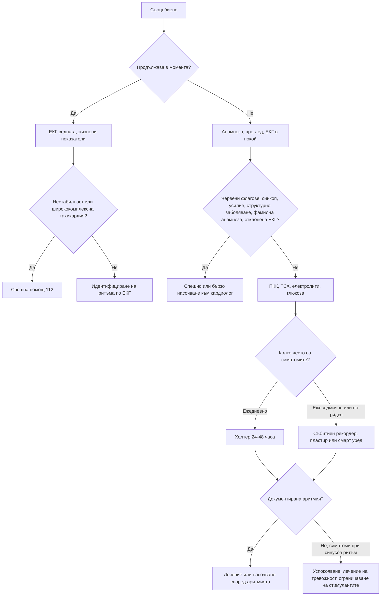

# Глава 10. Сърцебиене и ритъмни нарушения

> **Част III. Сърдечно-съдова система**

## Цели на главата

- Да се използва описанието на сърцебиенето за ориентиране към вида на аритмията.
- Да се разпознават високорисковите белези и ЕКГ находките, свързани с внезапна сърдечна смърт.
- Да се избира подходящ метод за амбулаторен ЕКГ мониторинг.
- Да се познават несърдечните причини за сърцебиене.

---

## 1. Определение и причини

**Сърцебиенето** е неприятното усещане за сърдечната дейност: учестена, неритмична, силна или „прескачаща“. Разпределението на причините в класическо проучване е следното:

| Група | Приблизителен дял | Примери |
|---|---|---|
| **Сърдечни аритмии** | ≈ 40% | Екстрасистоли, предсърдно мъждене и трептене, суправентрикуларни тахикардии, камерна тахикардия, брадиаритмии |
| **Психични** | ≈ 30% | Паническо разстройство, генерализирана тревожност, соматизация |
| **Други несърдечни** | ≈ 10% | Тиреотоксикоза, анемия, треска, бременност, хипогликемия, хиповолемия, феохромоцитом, лекарства и стимуланти |
| **Структурни сърдечни заболявания без аритмия** | ≈ 3% | Клапни пороци, кардиомиопатии, миксом на предсърдието |
| **Неизяснени** | ≈ 15% | — |

---

## 2. Безопасна диагностична стратегия

| Въпрос | Отговор |
|---|---|
| **Вероятна диагноза** | Екстрасистоли, синусова тахикардия (тревожност, кофеин, треска), предсърдно мъждене, пароксизмална суправентрикуларна тахикардия |
| **Сериозни заболявания, които не бива да се пропускат** | Камерна тахикардия; предсърдно мъждене при синдром на Wolff-Parkinson-White; наследствени каналопатии (синдром на удължения QT, синдром на Brugada); хипертрофична кардиомиопатия; аритмогенна деснокамерна кардиомиопатия; високостепенен AV блок; тиреотоксикоза; феохромоцитом; хипогликемия; миокардит |
| **Чести капани** | Предсърдно трептене 2:1 (правилна тахикардия с честота 150/min); пароксизмална суправентрикуларна тахикардия, диагностицирана години наред като „паника“; синдром на постуралната ортостатична тахикардия; лекарства, удължаващи QT интервала; хипокалиемия и хипомагнезиемия; алкохол; енергийни напитки |
| **Маскиращи заболявания** | Анемия, хипертиреоидизъм, лекарства (бета-агонисти, левотироксин, деконгестанти), депресия и тревожност |
| **Психосоциални аспекти** | Паническо разстройство, свръхбдителност към телесните усещания |

---

## 3. Анамнеза

### 3.1. Описание на сърцебиенето

Помолете пациента да **почука с пръсти ритъма** на масата. Това е прост, но ценен тест.

| Описание | Вероятна причина |
|---|---|
| „Прескачане“, „спиране и силен удар“, „обръщане“ на сърцето | Предсърдни или камерни екстрасистоли (компенсаторната пауза и следващият по-силен удар) |
| Внезапно започваща и внезапно спираща учестена, **правилна** сърдечна дейност, често прекъсвана от вагусови маневри | Пароксизмална суправентрикуларна тахикардия (AV нодална re-entry тахикардия или AV re-entry тахикардия) |
| Силно пулсиране във врата („знак на жабата“) по време на пристъп | AV нодална re-entry тахикардия (предсърдията се съкращават срещу затворени клапи) |
| Учестена, **неправилна** сърдечна дейност | Предсърдно мъждене, предсърдно трептене с вариабилен блок, чести екстрасистоли |
| Постепенно начало и постепенно спиране, свързано с тревожност или усилие | Синусова тахикардия |
| Сърцебиене при **усилие**, със синкоп или пресинкоп | Камерна тахикардия, хипертрофична кардиомиопатия, аритмогенна кардиомиопатия, каналопатии (**червен флаг**) |
| Сърцебиене при изправяне | Синдром на постуралната ортостатична тахикардия, хиповолемия, ортостатична хипотония |
| Обилно уриниране след пристъпа | Суправентрикуларна тахикардия или предсърдно мъждене (освобождаване на предсърден натриуретичен пептид) |
| Сърцебиене със зачервяване, изпотяване, главоболие и хипертония | Феохромоцитом |
| Сърцебиене с глад, тремор и изпотяване | Хипогликемия |

### 3.2. Допълнителна анамнеза

- Честота, продължителност и провокиращи фактори (кофеин, алкохол, лишаване от сън, усилие, емоции).
- Придружаващи симптоми: болка в гърдите, задух, замайване, синкоп.
- Известно сърдечно заболяване: прекаран инфаркт, сърдечна недостатъчност, клапни пороци, вродени сърдечни малформации.
- **Фамилна анамнеза за внезапна смърт** под 40 години, за удавяне или катастрофа с неясна причина, за кардиомиопатия, пейсмейкър или имплантиран кардиовертер-дефибрилатор в млада възраст.
- Лекарства и вещества: бета-агонисти, теофилин, левотироксин, деконгестанти, антихолинергични средства, **лекарства, удължаващи QT интервала**, кокаин, амфетамини, канабис, енергийни напитки, спиране на бета-блокер.
- Симптоми на хипертиреоидизъм, анемия, менопауза, бременност.

---

## 4. Физикален преглед

- Пулс (честота, ритъм, пулсов дефицит при предсърдно мъждене), АН (включително ортостатично).
- Сърдечни шумове: аортна стеноза, хипертрофична кардиомиопатия (засилва се при маневрата на Valsalva и при изправяне), митрален пролапс (мезосистолно щракване).
- Признаци на сърдечна недостатъчност.
- Щитовидна жлеза, тремор, очни белези на болестта на Graves.
- Бледост (анемия).
- Ортостатичен тест: ръст на пулса с 30/min или повече в рамките на 10 минути в изправено положение, без ортостатична хипотония, насочва към синдром на постуралната ортостатична тахикардия.

---

## 5. Червени флагове

- Синкоп или пресинкоп по време на сърцебиенето.
- Сърцебиене при физическо усилие.
- Болка в гърдите, задух, признаци на сърдечна недостатъчност.
- Известно структурно сърдечно заболяване (прекаран инфаркт, кардиомиопатия, намалена фракция на изтласкване).
- Фамилна анамнеза за внезапна сърдечна смърт или наследствена каналопатия.
- Отклонения в ЕКГ в покой (вж. таблицата по-долу).
- Хемодинамична нестабилност или продължителна тахикардия.
- Ширококомплексна тахикардия.

---

## 6. ЕКГ находки, които не бива да се пропускат

| Находка | Заболяване | Риск |
|---|---|---|
| Къс PR интервал (< 120 ms), делта вълна, разширен QRS | Синдром на Wolff-Parkinson-White | Предсърдно мъждене с бърза проводимост по допълнителния път и камерно мъждене |
| QTc > 470 ms при мъже или > 480 ms при жени | Синдром на удължения QT (вроден или лекарствен) | Torsades de pointes, внезапна смърт |
| Сводеста ST-елевация ≥ 2 mm с отрицателен T във V1–V2 | Синдром на Brugada (тип 1) | Камерно мъждене, често по време на сън или при треска |
| Изразена левокамерна хипертрофия, дълбоки Q-зъбци в долните и страничните отвеждания | Хипертрофична кардиомиопатия | Камерни аритмии, внезапна смърт при усилие |
| Отрицателни T-зъбци във V1–V3 (след 14-годишна възраст), епсилон вълни | Аритмогенна деснокамерна кардиомиопатия | Камерна тахикардия |
| Много къс QT интервал | Синдром на късия QT | Камерни аритмии |
| AV блок II степен тип Mobitz II, AV блок III степен, бифасцикуларен блок | Заболяване на проводната система | Асистолия, синкоп |
| Q-зъбци, данни за прекаран инфаркт | Цикатрикс | Камерна тахикардия |

---

## 7. Диференциално-диагностична таблица на аритмиите

| Аритмия | Типичен пациент | Клинични белези | ЕКГ |
|---|---|---|---|
| **Предсърдни и камерни екстрасистоли** | Всяка възраст | „Прескачане“, по-изразено в покой и вечер | Преждевременни комплекси. При много чести камерни екстрасистоли (над 10% от всички удари) е нужна ехокардиография за изключване на кардиомиопатия |
| **Предсърдно мъждене** | Възрастни, хипертония, сърдечна недостатъчност, клапни пороци, алкохол, хипертиреоидизъм, обструктивна сънна апнея | Неправилен пулс, пулсов дефицит, често безсимптомно | Липса на P-вълни, абсолютно неправилни RR интервали |
| **Предсърдно трептене** | Както при мъждене | Правилна тахикардия, често около 150/min | Вълни „трион“ в II, III и aVF, блок 2:1 |
| **AV нодална re-entry тахикардия** | Млади жени | Внезапно начало и край, пулсиране във врата, полиурия | Тясна правилна тахикардия 150–250/min, P-вълните скрити или непосредствено след QRS |
| **AV re-entry тахикардия** (допълнителен път) | Млади хора | Като при AV нодална re-entry тахикардия | Тясна или широка тахикардия; в синусов ритъм понякога делта вълна |
| **Камерна тахикардия** | Прекаран инфаркт, кардиомиопатия; млади хора с каналопатии | Сърцебиене, пресинкоп, синкоп, хипотония | Ширококомплексна тахикардия. **Всяка ширококомплексна тахикардия е камерна, докато не се докаже противното** |
| **Синусова тахикардия** | Всяка възраст | Постепенно начало и край; съпътстващо състояние (треска, анемия, хиповолемия, тревожност, хипертиреоидизъм, белодробна тромбемболия) | Нормални P-вълни |
| **Брадиаритмии** (синдром на болния синусов възел, AV блок) | Възрастни | Паузи, замайване, умора, синкоп; при синдрома „тахи-бради“ се редуват епизоди на тахикардия и брадикардия | Синусови паузи, AV блок |

---

## 8. Несърдечни причини за сърцебиене

| Причина | Насочващи белези | Изследване |
|---|---|---|
| **Хипертиреоидизъм** | Загуба на тегло, топлоусещане, тремор, диария, гуша | ТСХ, FT4 |
| **Анемия** | Бледост, умора, задух при усилие | ПКК |
| **Хипогликемия** | Лечение с инсулин или сулфонилурейни производни | Капилярна кръвна захар по време на симптомите |
| **Феохромоцитом** | Пароксизми с главоболие, изпотяване, бледност, хипертония | Свободни метанефрини в плазмата или фракционирани метанефрини в урината |
| **Синдром на постуралната ортостатична тахикардия** | Млади жени, след вирусни инфекции (включително COVID-19), симптоми при изправяне | Активен ортостатичен тест или тест с накланяне |
| **Менопауза** | Горещи вълни, нощно изпотяване | Клинично |
| **Лекарства и стимуланти** | Кофеин, енергийни напитки, никотин, алкохол, кокаин, амфетамини, бета-агонисти, деконгестанти | Анамнеза |
| **Паническо разстройство** | Внезапен интензивен страх, хипервентилация, изтръпване, дереализация | Диагноза след ЕКГ и основните изследвания |

---

## 9. Изследвания

1. **12-канална ЕКГ.** Най-ценна е ЕКГ, записана по време на симптомите. Пациентът трябва да бъде инструктиран да потърси ЕКГ запис при следващия пристъп.
2. **Лабораторни изследвания:** ПКК, ТСХ, калий, магнезий, калций, глюкоза. При съответна анамнеза се изследват и наркотични вещества.
3. **Ехокардиография:** при шум, отклонена ЕКГ, съмнение за структурно заболяване, чести камерни екстрасистоли и предсърдно мъждене.
4. **Амбулаторен ЕКГ мониторинг** според честотата на симптомите:

| Честота на симптомите | Метод |
|---|---|
| Ежедневно | Холтер мониториране за 24–48 часа |
| Ежеседмично | Събитиен рекордер или ЕКГ пластир за 7–30 дни |
| Редки епизоди, но **със синкоп** | Имплантируем бримков рекордер |
| Кратки епизоди при наличен смарт уред | Смарт часовник или преносим уред с едноканална ЕКГ. Записът трябва да бъде верифициран от лекар |

5. **Тест с натоварване:** при сърцебиене при усилие.
6. **Електрофизиологично изследване:** при документирана или силно подозирана суправентрикуларна тахикардия (с цел аблация) и при високорискови пациенти.

---

## 10. Предсърдно мъждене: особености на диагностиката

- Нередовният пулс, открит при опортюнистично палпиране на пулса при хора над 65 години, изисква ЕКГ.
- При новооткрито предсърдно мъждене се търсят причината и съпътстващите заболявания:
  - хипертония, сърдечна недостатъчност, клапни пороци (особено митрална стеноза), исхемична болест;
  - **хипертиреоидизъм**, **алкохол** (включително еднократна голяма консумация), **обструктивна сънна апнея**, затлъстяване;
  - остри състояния: пневмония, сепсис, белодробна тромбемболия, перикардит, следоперативен период.
- Изследват се ТСХ, електролити, бъбречна и чернодробна функция, ПКК и се прави ехокардиография.
- Оценява се рискът от тромбоемболизъм с точковия сбор CHA₂DS₂-VA, който е в основата на решението за антикоагулация.

---

## 11. Лекарства, удължаващи QT интервала

Рискът от torsades de pointes нараства при комбиниране на няколко такива лекарства, при хипокалиемия и хипомагнезиемия, при брадикардия, при жени, при напреднала възраст и при сърдечна недостатъчност. Такива лекарства са:

- макролиди (кларитромицин, еритромицин, азитромицин) и флуорохинолони;
- антипсихотици (халоперидол, кветиапин и други);
- циталопрам и есциталопрам;
- метадон;
- ондансетрон и домперидон;
- хидроксихлорохин;
- амиодарон и соталол.

---

## 12. Диагностичен алгоритъм

---

## 13. Клинични перли

- Правилна тясна тахикардия с честота около 150/min е предсърдно трептене с блок 2:1, докато не се докаже противното.
- Сърцебиене, последвано от обилно уриниране, насочва към суправентрикуларна тахикардия.
- Диагнозата „паническо разстройство“ се поставя след нормална ЕКГ и документиран синусов ритъм по време на симптомите. Много млади жени с AV нодална re-entry тахикардия години наред носят диагнозата „паника“.
- Предсърдно мъждене с много бърза, неправилна ширококомплексна тахикардия насочва към синдром на Wolff-Parkinson-White. AV блокиращите средства (верапамил, дилтиазем, дигоксин, аденозин) са опасни в тази ситуация.
- Проверявайте QTc при всяко ново лекарство с потенциал за удължаване на QT при пациент с рискови фактори.
- Възрастен човек с новооткрито предсърдно мъждене и загуба на тегло: изследвайте ТСХ.

---

## 14. Клиничен случай

**Случай.** Жена на 29 години от 8 години има пристъпи на „паника“. Внезапно усеща много силно и учестено сърцебиене, което спира също така внезапно след 10–40 минути. Понякога пристъпът спира, когато пациентката задържи дъха си и напъне. По време на пристъпа „вратът ѝ пулсира“. След пристъпа уринира обилно. Приема есциталопрам без ефект. ЕКГ в покой е нормална, изследванията (ПКК, ТСХ, електролити) също.

**Въпроси.** 1) Коя е най-вероятната диагноза? 2) Как да се документира?

**Обсъждане.** Внезапното начало и край, прекъсването чрез вагусова маневра, пулсирането във врата (знак на жабата) и полиурията след пристъпа са типични за **пароксизмална суправентрикуларна тахикардия**, най-вероятно **AV нодална re-entry тахикардия**. Холтер мониторирането за 24 часа е без находка, защото пристъпите са веднъж седмично. С 14-дневен ЕКГ пластир е документирана тясна правилна тахикардия с честота 196/min, без видими P-вълни. Пациентката е насочена за електрофизиологично изследване и радиочестотна аблация, която е успешна. Антидепресантът е спрян.

**Поука.** Внезапното начало и край на сърцебиенето не е характерно за паническа атака. Настоявайте за ЕКГ по време на симптомите.

<!-- навигация -->

---

[← Глава 9. Болка в гърдите](09-bolka-v-gardite.md) · [Съдържание](../README.md) · [Глава 11. Синкоп и преходна загуба на съзнание →](11-sinkop.md)
