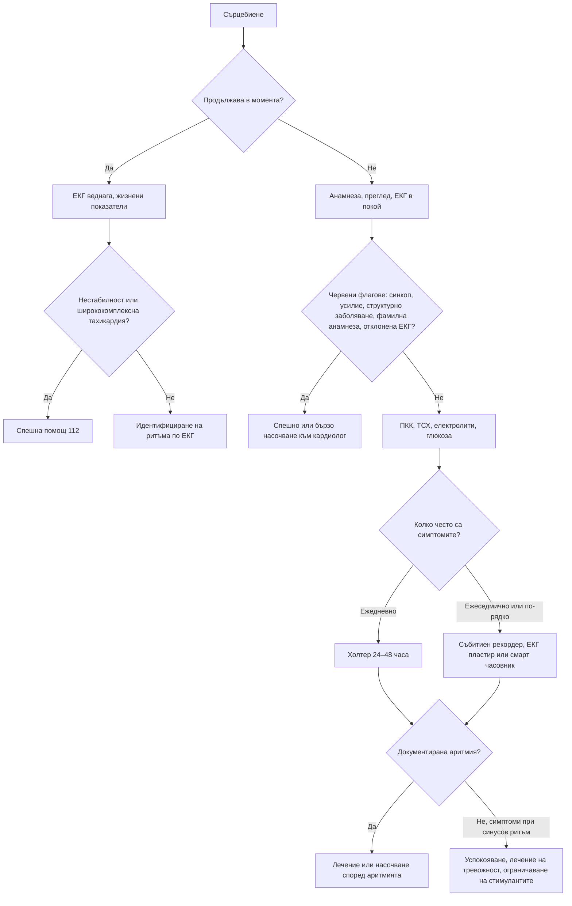

# Глава 10. Сърцебиене и ритъмни нарушения

> **Част III. Сърдечно-съдова система**

## Цели на главата

- Да се използва описанието на сърцебиенето за ориентиране към вида на аритмията.
- Да се разпознават високорисковите белези и ЕКГ находките, свързани с внезапна сърдечна смърт.
- Да се избира подходящ метод за амбулаторен ЕКГ мониторинг.
- Да се изброяват несърдечните причини за сърцебиене и изследванията, с които се потвърждават.

## Ключови моменти

- При около 40% от пациентите сърцебиенето се дължи на аритмия, при около 30% – на психични причини, а при около 15% причината остава неизяснена. Прогнозата в повечето случаи е добра [1].
- Описанието на сърцебиенето (почукване на ритъма, внезапно или постепенно начало и край, вагусови маневри, полиурия) ориентира към вида на аритмията.
- Червени флагове са синкопът, сърцебиенето при усилие, структурното сърдечно заболяване, фамилната анамнеза за внезапна смърт, отклонената ЕКГ в покой и ширококомплексната тахикардия *(SORT C [3, 6])*.
- Ключът към диагнозата е ЕКГ, записана по време на симптомите. Методът за мониториране се избира според честотата на епизодите *(SORT C [6])*.
- Всяка ширококомплексна тахикардия е камерна до доказване на противното. При предсърдно мъждене с преексцитация AV блокиращите средства са опасни *(SORT C [4])*.
- При новооткрито предсърдно мъждене се търсят причините (ТСХ, алкохол, сънна апнея) и се оценява рискът по CHA₂DS₂-VA *(SORT B [7])*. QTc над 500 ms изисква преоценка на всички лекарства, удължаващи QT *(SORT B [8])*.

---

## 1. Определение и причини

**Сърцебиенето** е неприятното усещане за сърдечната дейност: учестена, неритмична, силна или „прескачаща“. Разпределението на причините в класическо проучване е следното [1]:

*Таблица 10.1. Причини за сърцебиене.*

| Група | Приблизителен дял | Примери |
|---|---|---|
| **Сърдечни аритмии** | ≈ 40% | Екстрасистоли, предсърдно мъждене и трептене, суправентрикуларни тахикардии, камерна тахикардия, брадиаритмии |
| **Психични** | ≈ 30% | Паническо разстройство, генерализирана тревожност, соматизация |
| **Други несърдечни** | ≈ 10% | Тиреотоксикоза, анемия, треска, бременност, хипогликемия, хиповолемия, феохромоцитом, лекарства и стимуланти |
| **Структурни сърдечни заболявания без аритмия** | ≈ 3% | Клапни пороци, кардиомиопатии, миксом на предсърдието |
| **Неизяснени** | ≈ 15% | – |

---

## 2. Безопасна диагностична стратегия

*Таблица 10.2. Безопасна диагностична стратегия.*

| Въпрос | Отговор |
|---|---|
| **Вероятна диагноза** | Екстрасистоли, синусова тахикардия (тревожност, кофеин, треска), предсърдно мъждене, пароксизмална суправентрикуларна тахикардия |
| **Сериозни заболявания, които не бива да се пропускат** | Камерна тахикардия; предсърдно мъждене при синдром на Wolff-Parkinson-White; наследствени каналопатии (синдром на удължения QT, синдром на Brugada); хипертрофична кардиомиопатия; аритмогенна деснокамерна кардиомиопатия; високостепенен AV блок; тиреотоксикоза; феохромоцитом; хипогликемия; миокардит |
| **Чести капани** | Предсърдно трептене 2:1 (правилна тахикардия с честота 150/min); пароксизмална суправентрикуларна тахикардия, диагностицирана години наред като „паника“; синдром на постуралната ортостатична тахикардия; лекарства, удължаващи QT интервала; хипокалиемия и хипомагнезиемия; алкохол; енергийни напитки |
| **Маскиращи заболявания** | Анемия, хипертиреоидизъм, лекарства (бета-агонисти, левотироксин, деконгестанти), депресия и тревожност |
| **Психосоциални аспекти** | Паническо разстройство, свръхбдителност към телесните усещания |

---

## 3. Анамнеза

### 3.1. Описание на сърцебиенето

Помолете пациента да **почука с пръсти ритъма** на масата. Така се разбира дали ритъмът е правилен или неправилен и колко е бърз.

*Таблица 10.3. Описание на сърцебиенето.*

| Описание | Вероятна причина |
|---|---|
| „Прескачане“, „спиране и силен удар“, „обръщане“ на сърцето | Предсърдни или камерни екстрасистоли (компенсаторната пауза и следващият по-силен удар) |
| Внезапно започваща и внезапно спираща учестена, **правилна** сърдечна дейност, често прекъсвана от вагусови маневри | Пароксизмална суправентрикуларна тахикардия (AV нодална re-entry тахикардия или AV re-entry тахикардия) |
| Силно пулсиране във врата („белег на жабата“) по време на пристъп | AV нодална re-entry тахикардия (предсърдията се съкращават срещу затворени клапи) |
| Учестена, **неправилна** сърдечна дейност | Предсърдно мъждене, предсърдно трептене с вариабилен блок, чести екстрасистоли |
| Постепенно начало и постепенно спиране, свързано с тревожност или усилие | Синусова тахикардия |
| Сърцебиене при **усилие**, със синкоп или пресинкоп | Камерна тахикардия, хипертрофична кардиомиопатия, аритмогенна кардиомиопатия, каналопатии (червен флаг) |
| Сърцебиене при изправяне | Синдром на постуралната ортостатична тахикардия, хиповолемия, ортостатична хипотония |
| Обилно уриниране след пристъпа | Суправентрикуларна тахикардия или предсърдно мъждене (освобождаване на предсърден натриуретичен пептид) |
| Сърцебиене със зачервяване, изпотяване, главоболие и хипертония | Феохромоцитом |
| Сърцебиене с глад, тремор и изпотяване | Хипогликемия |

### 3.2. Допълнителна анамнеза

- Честота, продължителност и провокиращи фактори (кофеин, алкохол, лишаване от сън, усилие, емоции).
- Придружаващи симптоми: болка в гърдите, задух, замайване, синкоп.
- Известно сърдечно заболяване: прекаран инфаркт, сърдечна недостатъчност, клапни пороци, вродени сърдечни малформации.
- **Фамилна анамнеза за внезапна смърт** под 40 години, за удавяне или катастрофа с неясна причина, за кардиомиопатия, пейсмейкър или имплантиран кардиовертер-дефибрилатор в млада възраст.
- Лекарства и вещества: бета-агонисти, теофилин, левотироксин, деконгестанти, антихолинергични средства, **лекарства, удължаващи QT интервала**, кокаин, амфетамини, канабис, енергийни напитки, спиране на бета-блокер.
- Симптоми на хипертиреоидизъм, анемия, менопауза, бременност.

---

## 4. Физикален преглед

- Пулс (честота, ритъм, пулсов дефицит при предсърдно мъждене), АН (включително ортостатично).
- Сърдечни шумове: аортна стеноза, хипертрофична кардиомиопатия (засилва се при маневрата на Valsalva и при изправяне), митрален пролапс (мезосистолно щракване).
- Признаци на сърдечна недостатъчност.
- Щитовидна жлеза, тремор, очни белези на болестта на Graves.
- Бледост (анемия).
- Ортостатичен тест: ръст на пулса с 30/min или повече в рамките на 10 минути в изправено положение, без ортостатична хипотония, насочва към синдром на постуралната ортостатична тахикардия. При 12–19-годишни прагът е 40/min [2].

---

## 5. Червени флагове

- Синкоп или пресинкоп по време на сърцебиенето.
- Сърцебиене при физическо усилие.
- Болка в гърдите, задух, признаци на сърдечна недостатъчност.
- Известно структурно сърдечно заболяване (прекаран инфаркт, кардиомиопатия, намалена фракция на изтласкване).
- Фамилна анамнеза за внезапна сърдечна смърт или наследствена каналопатия.
- Отклонения в ЕКГ в покой (вж. таблицата по-долу).
- Хемодинамична нестабилност или продължителна тахикардия.
- Ширококомплексна тахикардия.

---

## 6. ЕКГ находки, които не бива да се пропускат

*Таблица 10.4. ЕКГ находки, които не бива да се пропускат.*

| Находка | Заболяване | Риск |
|---|---|---|
| Къс PR интервал (< 120 ms), делта вълна, разширен QRS | Синдром на Wolff-Parkinson-White | Предсърдно мъждене с бърза проводимост по допълнителния път и камерно мъждене |
| QTc ≥ 480 ms при повторни ЕКГ (≥ 460 ms при аритмичен синкоп) | Синдром на удължения QT (вроден или лекарствен) [3] | Torsades de pointes, внезапна смърт |
| Сводеста ST-елевация ≥ 2 mm с отрицателен T във V1–V2 | Синдром на Brugada (тип 1) [3] | Камерно мъждене, често по време на сън или при треска |
| Изразена левокамерна хипертрофия, дълбоки Q-зъбци в долните и страничните отвеждания | Хипертрофична кардиомиопатия | Камерни аритмии, внезапна смърт при усилие |
| Отрицателни T-зъбци във V1–V3 (след 14-годишна възраст), епсилон вълни | Аритмогенна деснокамерна кардиомиопатия | Камерна тахикардия |
| Много къс QT интервал | Синдром на късия QT | Камерни аритмии |
| AV блок II степен тип Mobitz II, AV блок III степен, бифасцикуларен блок | Заболяване на проводната система | Асистолия, синкоп |
| Q-зъбци, данни за прекаран инфаркт | Постинфарктен цикатрикс | Камерна тахикардия |

---

## 7. Диференциално-диагностична таблица на аритмиите

*Таблица 10.5. Диференциална диагноза на аритмиите.*

| Аритмия | Типичен пациент | Клинични белези | ЕКГ |
|---|---|---|---|
| **Предсърдни и камерни екстрасистоли** | Всяка възраст | „Прескачане“, по-изразено в покой и вечер | Преждевременни комплекси. При много чести камерни екстрасистоли (над 10% от всички удари) е нужна ехокардиография за изключване на кардиомиопатия [3] |
| **Предсърдно мъждене** | Възрастни, хипертония, сърдечна недостатъчност, клапни пороци, алкохол, хипертиреоидизъм, обструктивна сънна апнея | Неправилен пулс, пулсов дефицит, често безсимптомно | Липса на P-вълни, абсолютно неправилни RR интервали |
| **Предсърдно трептене** | Както при мъждене | Правилна тахикардия, често около 150/min | Вълни „трион“ във II, III и aVF, блок 2:1 |
| **AV нодална re-entry тахикардия** | Млади жени | Внезапно начало и край, пулсиране във врата, полиурия | Тясна правилна тахикардия 150–250/min, P-вълните скрити или непосредствено след QRS |
| **AV re-entry тахикардия** (допълнителен път) | Млади хора | Като при AV нодална re-entry тахикардия | Тясна или широка тахикардия; в синусов ритъм понякога делта вълна |
| **Камерна тахикардия** | Прекаран инфаркт, кардиомиопатия; млади хора с каналопатии | Сърцебиене, пресинкоп, синкоп, хипотония | Ширококомплексна тахикардия. Всяка ширококомплексна тахикардия е камерна до доказване на противното [4] |
| **Синусова тахикардия** | Всяка възраст | Постепенно начало и край; съпътстващо състояние (треска, анемия, хиповолемия, тревожност, хипертиреоидизъм, белодробна тромбемболия) | Нормални P-вълни |
| **Брадиаритмии** (синдром на болния синусов възел, AV блок) | Възрастни | Паузи, замайване, умора, синкоп; при синдрома „тахи-бради“ се редуват епизоди на тахикардия и брадикардия | Синусови паузи, AV блок |

---

## 8. Несърдечни причини за сърцебиене

*Таблица 10.6. Несърдечни причини за сърцебиене.*

| Причина | Насочващи белези | Изследване |
|---|---|---|
| **Хипертиреоидизъм** | Загуба на тегло, топлоусещане, тремор, диария, гуша | ТСХ, FT4 |
| **Анемия** | Бледост, умора, задух при усилие | ПКК |
| **Хипогликемия** | Лечение с инсулин или сулфонилурейни производни | Капилярна глюкоза по време на симптомите |
| **Феохромоцитом** | Пароксизми с главоболие, изпотяване, бледност, хипертония | Свободни метанефрини в плазмата или фракционирани метанефрини в урината [5] |
| **Синдром на постуралната ортостатична тахикардия** | Млади жени, след вирусни инфекции (включително COVID-19), симптоми при изправяне | Активен ортостатичен тест или тест с накланяне |
| **Менопауза** | Горещи вълни, нощно изпотяване | Клинично |
| **Лекарства и стимуланти** | Кофеин, енергийни напитки, никотин, алкохол, кокаин, амфетамини, бета-агонисти, деконгестанти | Анамнеза |
| **Паническо разстройство** | Внезапен интензивен страх, хипервентилация, изтръпване, дереализация | Диагноза след ЕКГ и основните изследвания |

---

## 9. Изследвания

1. **12-канална ЕКГ.** Най-ценна е ЕКГ, записана по време на симптомите. Пациентът трябва да бъде инструктиран да потърси ЕКГ запис при следващия пристъп.
2. **Лабораторни изследвания:** ПКК, ТСХ, калий, магнезий, калций, глюкоза. При съответна анамнеза се изследват и наркотични вещества.
3. **Ехокардиография:** при шум, отклонена ЕКГ, съмнение за структурно заболяване, чести камерни екстрасистоли и предсърдно мъждене.
4. **Амбулаторен ЕКГ мониторинг** според честотата на симптомите [6]:

*Таблица 10.7. Изследвания при сърцебиене.*

| Честота на симптомите | Метод |
|---|---|
| Ежедневно | Холтер мониториране за 24–48 часа |
| Ежеседмично | Събитиен рекордер или ЕКГ пластир за 7–30 дни |
| Редки епизоди, но **със синкоп** | Имплантируем ЕКГ рекордер (loop recorder) |
| Кратки епизоди, ако пациентът има смарт часовник | Смарт часовник или преносим уред с едноканална ЕКГ. Записът трябва да бъде прегледан и потвърден от лекар |

5. **Тест с натоварване:** при сърцебиене при усилие.
6. **Електрофизиологично изследване:** при документирана или силно подозирана суправентрикуларна тахикардия (с цел аблация) и при високорискови пациенти.

---

## 10. Предсърдно мъждене: особености на диагностиката

- Нередовният пулс, открит при палпиране на пулса по време на посещение по друг повод при хора над 65 години, изисква ЕКГ [7].
- При новооткрито предсърдно мъждене се търсят причината и съпътстващите заболявания:
  - хипертония, сърдечна недостатъчност, клапни пороци (особено митрална стеноза), исхемична болест;
  - хипертиреоидизъм, алкохол (включително еднократна голяма консумация), обструктивна сънна апнея, затлъстяване;
  - остри състояния: пневмония, сепсис, белодробна тромбемболия, перикардит, следоперативен период.
- Изследват се ТСХ, електролити, бъбречна и чернодробна функция, ПКК и се прави ехокардиография.
- Оценява се рискът от тромбемболизъм с точковия сбор CHA₂DS₂-VA, който е в основата на решението за антикоагулация [7].

---

## 11. Лекарства, удължаващи QT интервала

Рискът от torsades de pointes е висок при QTc над 500 ms или при удължаване с над 60 ms спрямо изходната стойност [8]. Той нараства при комбиниране на няколко такива лекарства, при хипокалиемия и хипомагнезиемия, при брадикардия, при жени, при напреднала възраст и при сърдечна недостатъчност. Такива лекарства са (актуалният списък се поддържа от CredibleMeds [9]):

- макролиди (кларитромицин, еритромицин, азитромицин) и флуорохинолони;
- антипсихотици (халоперидол, кветиапин и други);
- циталопрам и есциталопрам;
- метадон;
- ондансетрон и домперидон;
- хидроксихлорохин;
- амиодарон и соталол.

---

## 12. Диагностичен алгоритъм

*Фигура 10.1. Диагностичен алгоритъм при сърцебиене и ритъмни нарушения. Схема на авторите въз основа на източниците, цитирани в главата.*

Текстово описание на фигура 10.1

1. Сърцебиене. Следва: към т. 2.
2. **Въпрос:** Продължава в момента? Да – към т. 3; Не – към т. 4.
3. ЕКГ веднага, жизнени показатели. Следва: към т. 5.
4. Анамнеза, преглед, ЕКГ в покой. Следва: към т. 6.
5. **Въпрос:** Нестабилност или ширококомплексна тахикардия? Да – към т. 7; Не – към т. 8.
6. **Въпрос:** Червени флагове: синкоп, усилие, структурно заболяване, фамилна анамнеза, отклонена ЕКГ? Да – към т. 9; Не – към т. 10.
7. Спешна помощ 112.
8. Идентифициране на ритъма по ЕКГ.
9. Спешно или бързо насочване към кардиолог.
10. ПКК, ТСХ, електролити, глюкоза. Следва: към т. 11.
11. **Въпрос:** Колко често са симптомите? Ежедневно – към т. 12; Ежеседмично или по-рядко – към т. 13.
12. Холтер 24–48 часа. Следва: към т. 14.
13. Събитиен рекордер, ЕКГ пластир или смарт часовник. Следва: към т. 14.
14. **Въпрос:** Документирана аритмия? Да – към т. 15; Не, симптоми при синусов ритъм – към т. 16.
15. Лечение или насочване според аритмията.
16. Успокояване, лечение на тревожност, ограничаване на стимулантите.

---

## 13. Кога и колко спешно да насочим

*Таблица 10.8. Кога и колко спешно да насочим.*

| Спешност | Клинична ситуация |
|---|---|
| **Незабавно (112 или спешно отделение)** | Продължаваща тахикардия с хипотония, болка в гърдите, задух или нарушено съзнание; ширококомплексна тахикардия; неправилна ширококомплексна тахикардия (предсърдно мъждене с преексцитация); симптоматичен AV блок III степен [3, 4] |
| **В същия ден** | Синкоп или пресинкоп по време на сърцебиене; сърцебиене при усилие; QTc над 500 ms; новооткрито предсърдно мъждене с висока камерна честота или симптоми [3, 7] |
| **Бързо (до 2 седмици)** | ЕКГ белези на синдром на Wolff-Parkinson-White, синдром на Brugada, хипертрофична или аритмогенна кардиомиопатия; фамилна анамнеза за внезапна смърт под 40 години; AV блок II степен тип Mobitz II без симптоми |
| **Планово** | Документирана пароксизмална суправентрикуларна тахикардия (електрофизиологично изследване и аблация); чести камерни екстрасистоли; предсърдно мъждене за решение за контрол на ритъма |
| **Проследяване в общата практика** | Единични екстрасистоли при нормално сърце и нормална ЕКГ; синусова тахикардия при тревожност, стимуланти или лекувана несърдечна причина |

---

## 14. Клинични перли

- Правилна тясна тахикардия с честота около 150/min е предсърдно трептене с блок 2:1 до доказване на противното.
- Сърцебиене, последвано от обилно уриниране, насочва към суправентрикуларна тахикардия.
- Диагнозата „паническо разстройство“ се поставя след нормална ЕКГ и документиран синусов ритъм по време на симптомите. Много млади жени с AV нодална re-entry тахикардия години наред носят диагнозата „паника“.
- Много бърза, неправилна ширококомплексна тахикардия насочва към предсърдно мъждене при синдром на Wolff-Parkinson-White. AV блокиращите средства (верапамил, дилтиазем, дигоксин, аденозин) са опасни в тази ситуация [4].
- Проверявайте QTc при всяко ново лекарство с потенциал за удължаване на QT при пациент с рискови фактори.
- Възрастен човек с новооткрито предсърдно мъждене и загуба на тегло: изследвайте ТСХ.

---

## 15. Клиничен случай

**Етап 1 – клинична картина.** Жена на 29 години от 8 години има пристъпи на „паника“. Внезапно усеща много силно и учестено сърцебиене, което спира също така внезапно след 10–40 минути. Понякога пристъпът спира, когато задържи дъха си и напъне. По време на пристъпа „вратът ѝ пулсира“, а след него уринира обилно. Приема есциталопрам без ефект.

> **Въпрос 1.** Кои белези не отговарят на паническо разстройство и коя е най-вероятната диагноза?

**Етап 2 – изследвания.** ЕКГ в покой, ПКК, ТСХ и електролитите са нормални. Пристъпите са приблизително веднъж седмично. Холтер мониторирането за 24 часа е без находка.

> **Въпрос 2.** Защо Холтер мониторирането не е открило аритмията и кой метод е подходящ?

> **Въпрос 3.** Какво е окончателното лечение?

Обсъждане и отговори

**Отговор 1.** Внезапното начало и край, прекъсването чрез вагусова маневра, пулсирането във врата („белег на жабата“) и полиурията след пристъпа са типични за пароксизмална суправентрикуларна тахикардия, най-вероятно AV нодална re-entry тахикардия. Паническите атаки обикновено започват и отшумяват постепенно.

**Отговор 2.** При пристъпи веднъж седмично вероятността денонощният запис да обхване епизод е малка. Подходящ е събитиен рекордер или ЕКГ пластир за 7–30 дни [6]. С 14-дневен пластир е документирана тясна правилна тахикардия с честота 196/min, без видими P-вълни.

**Отговор 3.** Радиочестотна аблация след електрофизиологично изследване [4]. Процедурата е успешна и антидепресантът е спрян.

**Поука.** Внезапното начало и край на сърцебиенето не е характерно за паническа атака. Настоявайте за ЕКГ по време на симптомите.

---

## Визуални примери

Учебникът не съдържа собствени изображения. Типичните находки могат да се видят в свободно достъпни атласи (връзките са проверени през септември 2026 г.):

- Предсърдно мъждене – [LITFL ECG Library](https://litfl.com/atrial-fibrillation-ecg-library/)
- Предсърдно трептене – [LITFL ECG Library](https://litfl.com/atrial-flutter-ecg-library/)
- Суправентрикуларна тахикардия – [LITFL ECG Library](https://litfl.com/supraventricular-tachycardia-svt-ecg-library/)
- Синдроми на преексцитация (Wolff-Parkinson-White) – [LITFL ECG Library](https://litfl.com/pre-excitation-syndromes-ecg-library/)
- Мономорфна камерна тахикардия – [LITFL ECG Library](https://litfl.com/ventricular-tachycardia-monomorphic-ecg-library/)

---

## Обобщение

- Сърцебиенето се дължи на аритмии, психични и други несърдечни причини. Описанието на ритъма и начина на започване и спиране насочва към диагнозата.
- Червените флагове (синкоп, усилие, структурно заболяване, фамилна анамнеза за внезапна смърт, отклонена ЕКГ) изискват спешна кардиологична оценка.
- Основните изследвания са ЕКГ, ПКК, ТСХ, електролити и глюкоза. Амбулаторният мониторинг се избира според честотата на симптомите.
- Паническо разстройство се диагностицира едва след документиран синусов ритъм по време на симптомите.

## Самопроверка

### Въпроси с един верен отговор

**1.** *(основно ниво)* Мъж на 66 години има правилна тясна тахикардия с честота 150/min. В отвеждания II, III и aVF се виждат вълни „трион“. Коя е най-вероятната диагноза?

- **А.** Синусова тахикардия
- **Б.** Предсърдно трептене с блок 2:1
- **В.** AV нодална re-entry тахикардия
- **Г.** Камерна тахикардия
- **Д.** Предсърдно мъждене

Отговор и обосновка

**Верен отговор: Б.** Правилната тахикардия с честота около 150/min и вълните „трион“ в долните отвеждания са типични за предсърдно трептене с блок 2:1. А има нормални P-вълни. В обикновено е с по-висока честота и без вълни „трион“. Г е ширококомплексна. Д е абсолютно неправилна.

**2.** *(основно ниво)* Жена на 40 години има епизоди на сърцебиене веднъж седмично, по 20 минути, без синкоп. ЕКГ в покой е нормална. Кой метод за мониториране е най-подходящ?

- **А.** Холтер мониториране за 24 часа
- **Б.** Събитиен рекордер или ЕКГ пластир за 7–30 дни
- **В.** Имплантируем ЕКГ рекордер (loop recorder)
- **Г.** Тест с натоварване
- **Д.** Електрофизиологично изследване

Отговор и обосновка

**Верен отговор: Б.** При седмични епизоди вероятността денонощен запис да обхване пристъп е малка. Събитийният рекордер или пластирът за 7–30 дни е подходящият избор [6]. В е за редки епизоди със синкоп. Г е показан при сърцебиене при усилие. Д не е първа стъпка без документирана аритмия.

**3.** *(основно ниво)* Кое от следните е червен флаг при сърцебиене?

- **А.** „Прескачане“ на сърцето в покой вечер
- **Б.** Сърцебиене със синкоп по време на физическо усилие
- **В.** Сърцебиене след третото кафе
- **Г.** Сърцебиене при силно безпокойство с изтръпване около устата
- **Д.** Сърцебиене с горещи вълни в менопаузата

Отговор и обосновка

**Верен отговор: Б.** Синкопът при усилие насочва към камерна аритмия, хипертрофична кардиомиопатия или каналопатия и изисква спешна кардиологична оценка [3]. А е типично за екстрасистоли. В, Г и Д имат ясни несърдечни причини.

**4.** *(напреднало ниво)* Мъж на 24 години има неправилна ширококомплексна тахикардия с честота 240/min. Хемодинамично е стабилен. Кое от следните е противопоказано?

- **А.** Верапамил интравенозно
- **Б.** Синхронизирана електрическа кардиоверсия при влошаване
- **В.** Незабавна консултация с кардиолог
- **Г.** 12-канална ЕКГ
- **Д.** Непрекъснато ЕКГ мониториране

Отговор и обосновка

**Верен отговор: А.** Неправилната ширококомплексна тахикардия с много висока честота при млад човек насочва към предсърдно мъждене с проводимост по допълнителен път (синдром на Wolff-Parkinson-White). AV блокиращите средства (верапамил, дилтиазем, дигоксин, аденозин) могат да ускорят проводимостта по допълнителния път и да предизвикат камерно мъждене [4]. Б, В, Г и Д са правилни действия.

**5.** *(напреднало ниво)* Жена на 78 години приема циталопрам и фуроземид и е започнала кларитромицин. Калият е 3,1 mmol/l, а QTc – 520 ms. Кое е най-правилното поведение?

- **А.** Продължаване на лечението и контролна ЕКГ след месец
- **Б.** Спиране или замяна на кларитромицин и циталопрам, корекция на калия и магнезия и повторна ЕКГ
- **В.** Замяна на кларитромицин с моксифлоксацин
- **Г.** Добавяне на ондансетрон срещу гаденето
- **Д.** Добавяне на соталол

Отговор и обосновка

**Верен отговор: Б.** QTc над 500 ms носи висок риск от torsades de pointes, особено при хипокалиемия и комбинация от лекарства, удължаващи QT [8, 9]. Затова се спират или заменят лекарствата, коригират се електролитите и се повтаря ЕКГ. При синкоп или сърцебиене е нужна спешна оценка. В, Г и Д добавят нови лекарства, удължаващи QT. А излага пациентката на риск.

### Задача

При пациент със сърдечна честота 100/min измереният QT интервал е 440 ms. Изчислете QTc по формулата на Bazett и по формулата на Fridericia и тълкувайте резултата.

Решение

RR = 60 / 100 = 0,6 s. Bazett: QTc = QT / √RR = 440 / 0,775 ≈ 568 ms. Fridericia: QTc = QT / ∛RR = 440 / 0,843 ≈ 522 ms. Формулата на Bazett надценява QTc при висока сърдечна честота, затова при тахикардия е по-точна формулата на Fridericia. И по двете формули QTc надвишава 500 ms, което означава висок риск от torsades de pointes [8]. Нужни са преглед на лекарствата, изследване на калий и магнезий и повторна ЕКГ при по-ниска честота.

### OSCE станция: Анамнеза при сърцебиене

**Време:** 8 минути. **Ниво:** основно (студенти, специализанти).

**Задача за кандидата.** Жена на 34 години идва заради „пристъпи на сърцебиене“. Снемете насочена анамнеза, посочете основните изследвания и обяснете на пациентката плана.

**Информация за симулирания пациент (за изпитващия).** Пристъпите започват внезапно, продължават 10–20 минути и спират внезапно. Ритъмът е бърз и правилен (почуква го на масата). Веднъж пристъп е спрял, когато е напънала. Няма синкоп, болка в гърдите или задух. Не пие кафе. Няма фамилна анамнеза за внезапна смърт. Не приема лекарства. Притеснява се, че „е нещо със сърцето“.

*Таблица 10.9. OSCE станция „Анамнеза при сърцебиене“ – критерии за оценяване.*

| Критерий | Точки |
|---|---|
| Моли пациентката да почука ритъма и пита за начина на започване и спиране | 2 |
| Пита за продължителността, честотата и провокиращите фактори (кофеин, алкохол, усилие, лишаване от сън) | 1 |
| Пита за синкоп, пресинкоп, болка в гърдите и задух | 2 |
| Пита за фамилна анамнеза за внезапна смърт под 40 години и за известно сърдечно заболяване | 1 |
| Пита за лекарства, стимуланти и симптоми на хипертиреоидизъм | 1 |
| Предлага ЕКГ в покой, ПКК, ТСХ, електролити и мониториране според честотата (събитиен рекордер или пластир) | 2 |
| Обяснява значението на ЕКГ по време на пристъп и вагусовите маневри | 1 |
| Дава указания при влошаване: синкоп, болка в гърдите или пристъп над 30 минути – спешна помощ | 1 |
| Проявява емпатия и проверява разбирането | 1 |
| **Общо** | **12** |

**Праг за успешно изпълнение:** 8 от 12 точки, включително въпросите за синкоп и фамилна анамнеза.

## Литература

1. Weber BE, Kapoor WN. Evaluation and outcomes of patients with palpitations. Am J Med. 1996;100(2):138-48. doi:10.1016/s0002-9343(97)89451-x. PMID: 8629647.
2. Sheldon RS, Grubb BP 2nd, Olshansky B, Shen WK, Calkins H, Brignole M, et al. 2015 heart rhythm society expert consensus statement on the diagnosis and treatment of postural tachycardia syndrome, inappropriate sinus tachycardia, and vasovagal syncope. Heart Rhythm. 2015;12(6):e41-63. doi:10.1016/j.hrthm.2015.03.029. PMID: 25980576.
3. Zeppenfeld K, Tfelt-Hansen J, de Riva M, Winkel BG, Behr ER, Blom NA, et al. 2022 ESC Guidelines for the management of patients with ventricular arrhythmias and the prevention of sudden cardiac death. Eur Heart J. 2022;43(40):3997-4126. doi:10.1093/eurheartj/ehac262. PMID: 36017572.
4. Brugada J, Katritsis DG, Arbelo E, Arribas F, Bax JJ, Blomström-Lundqvist C, et al. 2019 ESC Guidelines for the management of patients with supraventricular tachycardiaThe Task Force for the management of patients with supraventricular tachycardia of the European Society of Cardiology (ESC). Eur Heart J. 2020;41(5):655-720. doi:10.1093/eurheartj/ehz467. PMID: 31504425.
5. Lenders JW, Duh QY, Eisenhofer G, Gimenez-Roqueplo AP, Grebe SK, Murad MH, et al. Pheochromocytoma and paraganglioma: an endocrine society clinical practice guideline. J Clin Endocrinol Metab. 2014;99(6):1915-42. doi:10.1210/jc.2014-1498. PMID: 24893135.
6. Raviele A, Giada F, Bergfeldt L, Blanc JJ, Blomstrom-Lundqvist C, Mont L, et al. Management of patients with palpitations: a position paper from the European Heart Rhythm Association. Europace. 2011;13(7):920-34. doi:10.1093/europace/eur130. PMID: 21697315.
7. Van Gelder IC, Rienstra M, Bunting KV, Casado-Arroyo R, Caso V, Crijns HJGM, et al. 2024 ESC Guidelines for the management of atrial fibrillation developed in collaboration with the European Association for Cardio-Thoracic Surgery (EACTS). Eur Heart J. 2024;45(36):3314-3414. doi:10.1093/eurheartj/ehae176. PMID: 39210723.
8. Drew BJ, Ackerman MJ, Funk M, Gibler WB, Kligfield P, Menon V, et al. Prevention of torsade de pointes in hospital settings: a scientific statement from the American Heart Association and the American College of Cardiology Foundation. Circulation. 2010;121(8):1047-60. doi:10.1161/CIRCULATIONAHA.109.192704. PMID: 20142454.
9. AZCERT. QTdrugs List [Интернет]. CredibleMeds. Достъпно на: https://www.crediblemeds.org (посетен септември 2026 г.).

*Последна проверка на съдържанието: септември 2026 г. Следващ планиран преглед: септември 2027 г. (вж. „Политика за актуализация“ в README).*

<!-- навигация -->

---

[← Глава 9. Болка в гърдите](09-bolka-v-gardite.md) · [Съдържание](../README.md) · [Глава 11. Синкоп и преходна загуба на съзнание →](11-sinkop.md)
