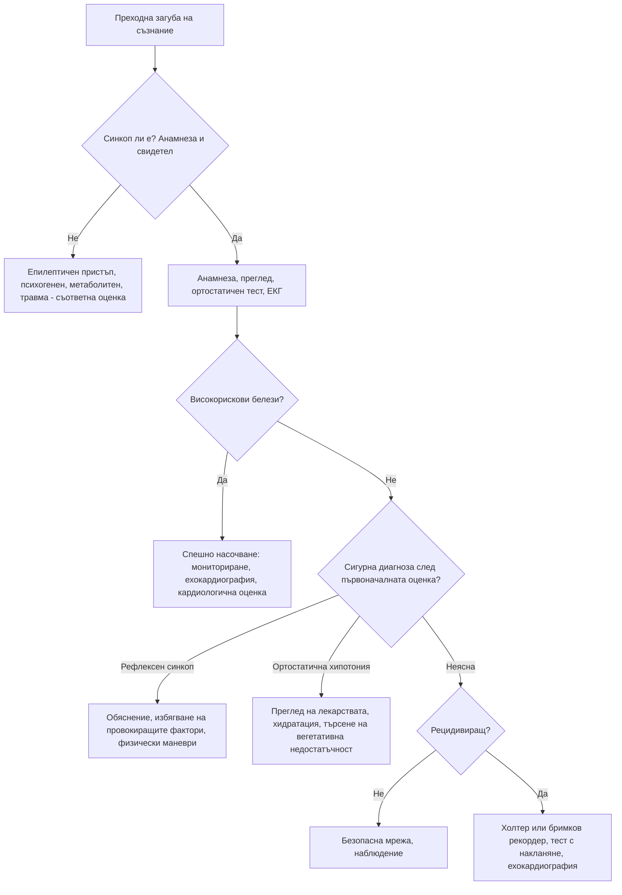

# Глава 11. Синкоп и преходна загуба на съзнание

> **Част III. Сърдечно-съдова система**

## Цели на главата

- Да се разграничава синкопът от другите причини за преходна загуба на съзнание, особено от епилептичния пристъп.
- Да се класифицира синкопът на рефлексен, ортостатичен и сърдечен.
- Да се стратифицира рискът според препоръките на Европейското дружество по кардиология (ESC).
- Да се избират рационално изследванията и да се избягват ненужните.

## Ключови моменти

- Синкопът е преходна загуба на съзнание поради глобална мозъчна хипоперфузия. Най-чест е рефлексният синкоп, но най-опасен е сърдечният [1].
- Анамнезата от пациента и от свидетеля е най-ценното изследване. Страничното ухапване на езика и продължителното объркване насочват към епилептичен пристъп, а кратките потрепвания са чести и при синкоп *(SORT B [2–4])*.
- При всеки пациент се записва 12-канална ЕКГ и се прави ортостатичен тест *(SORT C [1, 6])*.
- Високорисковите белези по ESC (синкоп при усилие или в легнало положение, болка в гърдите, задух, сърцебиене преди синкопа, хипотония, отклонена ЕКГ, тежко сърдечно заболяване) изискват спешна оценка в болница *(SORT C [1])*.
- Кардиологична оценка до 24 часа е нужна при отклонена ЕКГ, сърдечна недостатъчност, синкоп при усилие, фамилна анамнеза за внезапна смърт под 40 години, нов задух или шум. Тя се обмисля и при хора над 65 години със синкоп без продром *(SORT C [6])*.
- ЕЕГ, КТ или ЯМР на главата и доплерова ехография на каротидите не са рутинни изследвания при синкоп *(SORT C [1])*.

### Първите 60 секунди

- Проверете реакцията и дишането. Ако пациентът не диша нормално — 112 и сърдечно-белодробна реанимация.
- При запазено дишане поставете пациента в легнало положение (с повдигнати крака, ако няма травма) или в странично стабилно положение при нарушено съзнание.
- Измерете пулса, АН, SpO₂ и капилярната кръвна захар. Запишете ЕКГ възможно най-скоро.
- Огледайте за травма (особено на главата и шията) и за признаци на кървене.
- Снемете анамнеза от свидетеля веднага, докато подробностите са пресни.
- При високорискови белези (болка в гърдите, синкоп при усилие или в легнало положение, хипотония, отклонена ЕКГ) се обадете на 112.

---

## 1. Определения

- **Преходна загуба на съзнание** — състояние на реална или привидна загуба на съзнание с липса на контакт, нарушен двигателен контрол, липса на реакция и кратка продължителност.
- **Синкоп** — преходна загуба на съзнание поради **глобална мозъчна хипоперфузия**. Характеризира се с бързо начало, кратка продължителност и спонтанно, пълно възстановяване [1].

### 1.1. Класификация на преходната загуба на съзнание

| Група | Подгрупи |
|---|---|
| **Синкоп** | Рефлексен; дължащ се на ортостатична хипотония; сърдечен |
| **Епилептични пристъпи** | Генерализирани тонично-клонични, атонични, фокални с нарушено съзнание |
| **Психогенни състояния** | Психогенен псевдосинкоп, психогенни неепилептични пристъпи |
| **Редки причини** | Субарахноидален кръвоизлив (с внезапно главоболие), вертебробазиларна ТИА (рядко със загуба на съзнание), синдром на подключичното обкрадване |
| **Състояния, които се бъркат със синкоп** | Падания без загуба на съзнание, катаплексия, интоксикации, хипогликемия, хипоксия, хипервентилация, мозъчно сътресение |

---

## 2. Класификация на синкопа

| Вид | Подтипове и причини | Типични белези |
|---|---|---|
| **Рефлексен (невромедиаторен)** | **Вазовагален** (при продължително стоене, топло и задушно помещение, болка, страх, вид на кръв, медицински процедури); **ситуационен** (при уриниране, дефекация, кашлица, гълтане, смях, след усилие); **синдром на каротидния синус** (при завъртане на главата, стегната яка, бръснене; възрастни мъже) | Млад пациент, продром (топлина, изпотяване, гадене, бледност, притъмняване пред очите), дългогодишна анамнеза за сходни епизоди |
| **Ортостатична хипотония** | **Лекарства** (антихипертензивни, диуретици, алфа-блокери като тамсулозин и доксазозин, нитрати, трициклични антидепресанти, антипсихотици, леводопа, SGLT2 инхибитори); **хиповолемия** (кървене, диария, повръщане, надбъбречна недостатъчност); **първична вегетативна недостатъчност** (болест на Parkinson, множествена системна атрофия, деменция с телца на Lewy, чиста вегетативна недостатъчност); **вторична вегетативна недостатъчност** (диабет, амилоидоза, алкохол, дефицит на B12, увреждане на гръбначния мозък) | Синкоп след изправяне, възрастен пациент, полипрагмазия, постпрандиален синкоп |
| **Сърдечен — аритмичен** | Брадикардия (дисфункция на синусовия възел, AV блок II–III степен, дисфункция на пейсмейкър); тахикардия (камерна, по-рядко суправентрикуларна); лекарствено индуцирани аритмии; наследствени каналопатии | Внезапно начало без продром, сърцебиене непосредствено преди синкопа, синкоп в легнало положение |
| **Сърдечен — структурен** | Аортна стеноза, хипертрофична обструктивна кардиомиопатия, остър миокарден инфаркт, белодробна тромбемболия, сърдечна тампонада, дисекация на аортата, миксом на предсърдието, белодробна хипертония, дисфункция на клапна протеза | **Синкоп при усилие**, болка в гърдите, задух, шум, известно сърдечно заболяване |

**Определение на ортостатична хипотония.** Систолното налягане спада с 20 mmHg или повече, диастолното с 10 mmHg или повече, или систолното пада под 90 mmHg в рамките на 3 минути след изправяне [1]. Някои пациенти развиват **забавена** ортостатична хипотония, след повече от 3 минути.

---

## 3. Безопасна диагностична стратегия

| Въпрос | Отговор |
|---|---|
| **Вероятна диагноза** | Вазовагален синкоп, ситуационен синкоп, ортостатична хипотония (лекарствена) |
| **Сериозни заболявания, които не бива да се пропускат** | Аритмии (камерна тахикардия, пълен AV блок, каналопатии); аортна стеноза; хипертрофична кардиомиопатия; белодробна тромбемболия; остър миокарден инфаркт; дисекация на аортата; **кървене** (стомашно-чревно, **извънматочна бременност**, руптура на аневризма на коремната аорта); субарахноидален кръвоизлив |
| **Чести капани** | Конвулсивен синкоп, погрешно диагностициран като епилепсия; епилепсия, приета за синкоп; хипогликемия; лекарства (алфа-блокери, лекарства, удължаващи QT); ортостатична хипотония при болест на Parkinson; синдром на каротидния синус |
| **Маскиращи заболявания** | Лекарства, анемия, диабет (вегетативна невропатия), надбъбречна недостатъчност |
| **Психосоциални аспекти** | Психогенен псевдосинкоп, паническо разстройство с хипервентилация |

---

## 4. Анамнеза

Анамнезата, включително **сведенията на свидетели**, е най-ценното „изследване“.

### 4.1. Ключови въпроси

- **Преди епизода:** положение на тялото (легнало, седнало, изправено), дейност (усилие, уриниране, кашлица, хранене), провокиращи фактори (болка, страх, топлина, продължително стоене, завъртане на главата).
- **Продром:** топлина, изпотяване, гадене, притъмняване пред очите, шум в ушите (рефлексен синкоп); сърцебиене (аритмия); аура, дежа вю, миризма (епилепсия); болка в гърдите, задух, главоболие; **липса на предупреждение** (аритмия).
- **По време на епизода (свидетел):** цвят на кожата (бледост при синкоп, цианоза при пристъп), продължителност, характер на движенията, отворени или затворени очи, ухапване на езика, изпускане на урина.
- **След епизода:** бързо възстановяване (синкоп) или продължително объркване (епилептичен пристъп), гадене и умора (вазовагален), болка в гърдите, мускулни болки.
- **Минали епизоди**, възраст при първия, честота.
- **Анамнеза:** сърдечни заболявания, епилепсия, диабет, болест на Parkinson, психични заболявания.
- **Лекарства**, алкохол, наркотични вещества.
- **Фамилна анамнеза** за внезапна смърт, каналопатии, кардиомиопатии.

### 4.2. Синкоп или епилептичен пристъп?

Систематично събраната анамнеза разграничава синкопа от епилептичния пристъп в повечето случаи [2].

| Белег | Синкоп | Генерализиран тонично-клоничен пристъп |
|---|---|---|
| Провокиращ фактор | Изправяне, стоене, болка, топлина, емоции | Лишаване от сън, алкохол, мигащи светлини; често без провокация |
| Продром | Топлина, гадене, изпотяване, притъмняване | Аура (дежа вю, епигастрално усещане, миризма) или внезапно |
| Цвят на кожата | Бледност | Цианоза, зачервяване |
| Движения | Кратки (< 15 s), асинхронни миоклонични потрепвания **след** падането. Такива потрепвания се наблюдават при около 90% от синкопите [3] | Тонична фаза, последвана от ритмични, синхронни клонични движения с продължителност 1–2 минути; обръщане на главата настрани |
| Очи | Обикновено отворени | Отворени, често с девиация |
| Ухапване на езика | Рядко, по върха | **Странично ухапване на езика** — силно специфично за епилептичен пристъп (специфичност на ухапването около 96%) [4] |
| Изпускане на урина | Възможно | Възможно (не разграничава) |
| Продължителност | Секунди до около 1 минута | 1–3 минути |
| Възстановяване | Бързо, пълна ориентация | **Продължително объркване** (минути до часове), сънливост, главоболие, мускулни болки |
| Повишена креатинкиназа (КК) или пролактин след епизода | Не | Възможно |

**Психогенен псевдосинкоп и психогенни неепилептични пристъпи.** Насочват към тях чести и продължителни епизоди, **затворените очи** по време на епизода (при 97% от епизодите на психогенен псевдосинкоп срещу 7% при вазовагален синкоп [5]), съпротивата при опит за отваряне на клепачите, вълнообразните движения и въртенето на таза. Други белези са липсата на травми въпреки многото епизоди и плачът след епизода.

---

## 5. Физикален преглед

- **Ортостатичен тест:** АН и пулс в легнало положение (след 5 минути), после на 1-вата и 3-тата минута след изправяне.
- АН на двете ръце (дисекация, синдром на подключичното обкрадване).
- Сърдечна аускултация: систолен шум при аортна стеноза или хипертрофична кардиомиопатия.
- Признаци на сърдечна недостатъчност.
- Неврологичен статус (фокален дефицит, паркинсонизъм, невропатия).
- **Ректално туше** при съмнение за стомашно-чревно кървене (мелена).
- Корем: пулсираща формация (аневризма на коремната аорта).
- Травми, ухапване на езика.

---

## 6. Стратификация на риска (ESC)

### 6.1. Нискорискови белези (насочват към рефлексен синкоп)

- Типичен продром (топлина, изпотяване, гадене).
- Синкоп след неприятна гледка, звук, миризма или болка.
- Продължително стоене, претъпкано и горещо помещение.
- По време на хранене или след него.
- При кашлица, дефекация, уриниране.
- При завъртане на главата или натиск върху каротидния синус.
- При изправяне от легнало или седнало положение.
- Дългогодишна анамнеза за сходни епизоди.
- Липса на структурно сърдечно заболяване, нормален физикален преглед и нормална ЕКГ.

### 6.2. Високорискови белези

**Анамнеза:**

- нова болка в гърдите, задух, коремна болка или главоболие;
- синкоп **при усилие** или **в легнало положение**;
- внезапно сърцебиене, непосредствено последвано от синкоп;
- липса на продром или продром под 10 секунди;
- фамилна анамнеза за внезапна сърдечна смърт в млада възраст;
- синкоп в седнало положение;
- тежко структурно сърдечно заболяване или исхемична болест (сърдечна недостатъчност, ниска фракция на изтласкване, прекаран инфаркт).

*По ESC липсата на продром (или продром под 10 секунди), фамилната анамнеза за внезапна смърт в млада възраст и синкопът в седнало положение са високорискови, когато се съчетават със структурно сърдечно заболяване или с отклонена ЕКГ [1].*

**Физикален преглед:**

- необяснимо систолно налягане под 90 mmHg;
- данни за стомашно-чревно кървене при ректално туше;
- персистираща брадикардия под 40/min в будно състояние (при нетрениран човек);
- неизяснен систолен шум.

**ЕКГ:**

- остра исхемия;
- AV блок II степен тип Mobitz II или AV блок III степен;
- предсърдно мъждене с бавна камерна честота (< 40/min);
- синусова брадикардия < 40/min, синоатриален блок или паузи > 3 s в будно състояние;
- бедрен блок, интравентрикуларно проводно нарушение, камерна хипертрофия, Q-зъбци;
- камерна тахикардия;
- дисфункция на пейсмейкър или имплантиран кардиовертер-дефибрилатор;
- ЕКГ тип 1 на Brugada;
- QTc > 460 ms при повторни записи;
- белези на синдром на Wolff-Parkinson-White, аритмогенна кардиомиопатия или хипертрофична кардиомиопатия.

**Пациентите с високорискови белези се насочват спешно към болница.** Пациентите само с нискорискови белези могат да бъдат изписани с обяснение и безопасна мрежа [1].

---

## 7. Изследвания

| Изследване | Кога е показано |
|---|---|
| **12-канална ЕКГ** | При **всеки** пациент [1, 6] |
| **Ортостатичен тест** | При всеки пациент |
| ПКК | Съмнение за кървене или анемия |
| Глюкоза | Съмнение за хипогликемия (оценката на място е ценна) |
| Тест за бременност | Всяка жена в детеродна възраст |
| Електролити, креатинин | Дехидратация, диуретици, съмнение за аритмия |
| Тропонин, NT-proBNP | Само при клинично съмнение за сърдечна причина |
| D-димер | Съмнение за белодробна тромбемболия |
| Ехокардиография | Съмнение за структурно сърдечно заболяване, шум, отклонена ЕКГ |
| Холтер мониториране | Чести епизоди (почти всекидневно) |
| Събитиен или имплантируем бримков рекордер | Рецидивиращ неизяснен синкоп с подозрение за аритмия |
| Масаж на каротидния синус | Възраст над 40 години с неизяснен синкоп. Противопоказан при скорошна ТИА или инсулт и при шум над каротидите |
| Тест с накланяне (tilt test) | Съмнение за рефлексен синкоп с неясна анамнеза, ортостатична хипотония, психогенен псевдосинкоп |
| Тест с натоварване | Синкоп при усилие (след изключване на аортна стеноза и хипертрофична кардиомиопатия с ехокардиография) |
| ЕЕГ, КТ или ЯМР на главата | **Не са рутинни.** Показани са само при съмнение за епилептичен пристъп или неврологично заболяване и при травма на главата |
| Доплерова ехография на каротидите | **Не е показана** за изясняване на синкоп |

---

## 8. Диагностичен алгоритъм

---

## 9. Особености в общата практика

- Съберете анамнеза **от свидетеля** още при първия контакт, например по телефона, преди да е забравил подробностите.
- Всеки пациент със синкоп трябва да има ЕКГ.
- Преразгледайте лекарствата. Алфа-блокерите (тамсулозин, доксазозин), комбинациите от антихипертензивни средства и диуретиците са честа причина за синкоп при възрастни хора.
- До кардиологичната оценка пациентите с подозрение за сърдечен синкоп не бива да шофират [6]. Информирайте пациента за ограниченията при шофиране според действащите национални разпоредби. Правилата зависят от вида на синкопа и от професионалния или непрофесионалния характер на шофирането.

---

## 10. Червени флагове и насочване

### 10.1. Червени флагове

- Синкоп при физическо усилие или в легнало положение.
- Синкоп без предупреждение при пациент със сърдечно заболяване или отклонена ЕКГ.
- Сърцебиене непосредствено преди синкопа.
- Нова болка в гърдите, задух, коремна болка или силно главоболие.
- Систолно налягане под 90 mmHg, брадикардия под 40/min, данни за кървене.
- Фамилна анамнеза за внезапна сърдечна смърт под 40 години.
- Млада жена с коремна болка (извънматочна бременност) или възрастен човек с болка в корема или гърба (руптура на аневризма на коремната аорта).

### 10.2. Кога и колко спешно да насочим

| Спешност | Клинична ситуация |
|---|---|
| **Незабавно (112 или спешно отделение)** | Високорискови белези по ESC: синкоп при усилие или в легнало положение, болка в гърдите, задух, силно главоболие, хипотония, кървене, остра исхемия, AV блок II степен тип Mobitz II или III степен, камерна тахикардия; подозрение за белодробна тромбемболия, дисекация, извънматочна бременност или руптура на аневризма [1] |
| **До 24 часа (кардиологична оценка)** | Отклонена ЕКГ без остра находка; сърдечна недостатъчност; фамилна анамнеза за внезапна смърт под 40 години или наследствено сърдечно заболяване; нов необясним задух; сърдечен шум; обмисля се и при възраст над 65 години и синкоп без продром [6] |
| **Бързо (до 2 седмици)** | Подозрение за първи епилептичен пристъп — специалист по епилепсия [7] |
| **Планово** | Рецидивиращ неясен синкоп без високорискови белези (имплантируем бримков рекордер, тест с накланяне); ортостатична хипотония при подозрение за невродегенеративно заболяване |
| **Проследяване в общата практика** | Типичен рефлексен синкоп с нормална ЕКГ и нормален преглед; лекарствена ортостатична хипотония след корекция на лечението |

---

## 11. Клинични перли

- **Синкопът при усилие е сърдечен, докато не се докаже противното.** Причината може да е аортна стеноза, хипертрофична кардиомиопатия, аритмогенна кардиомиопатия или каналопатия.
- Кратките потрепвания на крайниците са много чести при синкоп (конвулсивен синкоп). Те не означават епилепсия.
- Изпускането на урина не разграничава синкопа от епилептичния пристъп. Страничното ухапване на езика и продължителното объркване след епизода говорят за пристъп.
- Синкоп при млада жена с коремна болка: извънматочна бременност, докато не се докаже противното. Направете тест за бременност.
- Синкоп при възрастен човек с болка в гърба или корема: руптура на аневризма на коремната аорта.
- Синкопът може да е единственият признак на белодробна тромбемболия или на стомашно-чревно кървене.
- Синкоп в седнало или легнало положение не е вазовагален. Търсете аритмия.

---

## 12. Клиничен случай

**Етап 1 — анамнеза.** Мъж на 74 години губи съзнание, докато вечеря седнал на масата. Съпругата му казва, че „просто клюмнал“ без никакво предупреждение и дошъл на себе си след около 20 секунди, напълно ориентиран. Ударил е лицето си в масата. Такъв епизод е имал и преди месец. Има хипертония и приема амлодипин.

> **Въпрос 1.** Кои белези в анамнезата са тревожни?

**Етап 2 — преглед и ЕКГ.** Пулс 64/min, АН 148/82 mmHg без ортостатична промяна, без шумове. ЕКГ: синусов ритъм, PR интервал 230 ms, десен бедрен блок и ляв преден хемиблок.

> **Въпрос 2.** Как ще опишете ЕКГ и коя е най-вероятната причина за синкопа?

> **Въпрос 3.** Какво правите сега и какво ще посъветвате пациента за шофирането?

Обсъждане и отговори

**Отговор 1.** Синкопът е настъпил в седнало положение, без продром, с травма и повторение. При възрастен човек тези белези насочват към аритмия, а не към рефлексен синкоп [1, 6].

**Отговор 2.** Бифасцикуларен блок (десен бедрен блок и ляв преден хемиблок) с удължен PR интервал. Това проводно нарушение е високорисков белег [1] и насочва към интермитентен **високостепенен AV блок**.

**Отговор 3.** Спешно насочване за мониториране в болница. Докато чака оценката, пациентът не бива да шофира [6]. В болницата е регистриран пароксизмален пълен AV блок с асистолия от 6 секунди и е имплантиран постоянен пейсмейкър.

**Поука.** Синкопът без продром, особено в седнало положение, при пациент с проводно нарушение в ЕКГ изисква спешна оценка. Такъв синкоп не е „вазовагален“.

---

## Обобщение

- Синкопът е рефлексен, ортостатичен или сърдечен. Той трябва да се разграничи от епилептичния пристъп, психогенния псевдосинкоп и метаболитните причини.
- Анамнезата от свидетеля, ортостатичният тест и ЕКГ са основата на оценката при всеки пациент.
- Рискът се стратифицира по ESC: високорисковите белези налагат спешна оценка, а нискорисковите позволяват изписване с обяснение и безопасна мрежа.
- Изследванията се подбират според хипотезата. Невроизобразяването, ЕЕГ и доплеровата ехография на каротидите не са рутинни.

## Самопроверка

### Въпроси с един верен отговор

**1.** *(основно ниво)* Жена на 19 години губи съзнание по време на вземане на кръв. Преди това ѝ е станало топло и е притъмняло пред очите ѝ. Свидетелите виждат бледост и няколко кратки потрепвания на ръцете. След 20 секунди е напълно ориентирана. ЕКГ е нормална. Коя е най-вероятната диагноза?

- **А.** Генерализиран тонично-клоничен пристъп
- **Б.** Вазовагален синкоп
- **В.** Синдром на удължения QT
- **Г.** Хипогликемия
- **Д.** Психогенен псевдосинкоп

Отговор и обосновка

**Верен отговор: Б.** Провокиращият фактор, продромът, бледостта и бързото възстановяване са типични за вазовагален синкоп. Кратките потрепвания се наблюдават при около 90% от синкопите и не означават епилепсия [3]. А протича с продължително объркване. В е малко вероятен при нормална ЕКГ. Г не се възстановява спонтанно за секунди. Д протича със затворени очи и по-дълго.

**2.** *(основно ниво)* Коя находка е най-силно в полза на епилептичен пристъп, а не на синкоп?

- **А.** Изпускане на урина
- **Б.** Кратки миоклонични потрепвания
- **В.** Странично ухапване на езика
- **Г.** Бледост по време на епизода
- **Д.** Бързо и пълно възстановяване

Отговор и обосновка

**Верен отговор: В.** Ухапването на езика има специфичност около 96% за епилептичен пристъп, особено когато е странично [4]. А не разграничава двете състояния. Б, Г и Д са типични за синкоп.

**3.** *(основно ниво)* Мъж на 70 години приема доксазозин. АН в легнало положение е 140/80 mmHg, а на третата минута след изправяне — 116/74 mmHg. Как ще интерпретирате резултата?

- **А.** Нормален отговор, защото диастолното налягане е спаднало с под 10 mmHg
- **Б.** Ортостатична хипотония, защото систолното налягане е спаднало с 20 mmHg или повече
- **В.** Нормален отговор, защото систолното налягане не е под 90 mmHg
- **Г.** Ортостатична хипотония само ако има симптоми
- **Д.** Резултатът може да се оцени само с тест с накланяне

Отговор и обосновка

**Верен отговор: Б.** Ортостатичната хипотония се определя като спад на систолното налягане с 20 mmHg или повече, на диастолното с 10 mmHg или повече, или спад на систолното под 90 mmHg в рамките на 3 минути [1]. Достатъчен е един от критериите, затова А и В са грешни. Г и Д не отговарят на определението.

**4.** *(напреднало ниво)* Мъж на 30 години губи съзнание по време на бягане. Има систолен шум, който се засилва при маневрата на Valsalva. Кое е най-подходящото поведение?

- **А.** Тест с натоварване веднага
- **Б.** Спешна кардиологична оценка с ехокардиография и избягване на натоварване до изясняване
- **В.** ЕЕГ
- **Г.** Обяснение, че става дума за вазовагален синкоп
- **Д.** КТ на главата

Отговор и обосновка

**Верен отговор: Б.** Синкопът при усилие е сърдечен, докато не се докаже противното. Шумът, който се засилва при Valsalva, насочва към хипертрофична обструктивна кардиомиопатия. Тестът с натоварване се прави едва след изключване на обструкцията с ехокардиография, затова А е опасно. В, Г и Д не отговарят на хипотезата.

**5.** *(напреднало ниво)* Жена на 68 години е загубила съзнание за кратко, без предупреждение, докато е стояла. Преди това е била здрава. ЕКГ и прегледът са нормални. Кое е подходящото поведение по NICE?

- **А.** Не е нужна допълнителна оценка
- **Б.** Обмисляне на насочване за кардиологична оценка до 24 часа
- **В.** ЕЕГ и насочване към невролог
- **Г.** Доплерова ехография на каротидите
- **Д.** КТ на главата

Отговор и обосновка

**Верен отговор: Б.** NICE препоръчва да се обмисли насочване за кардиологична оценка до 24 часа при хора над 65 години със загуба на съзнание без продром [6]. А пропуска възможна аритмия. В, Г и Д не са рутинни при синкоп без неврологични белези.

### Задача

Мъж на 82 години с болест на Parkinson приема леводопа и тамсулозин. Пада при ставане сутрин. АН в легнало положение е 150/85 mmHg, на първата минута след изправяне — 128/76 mmHg, а на третата — 118/70 mmHg. Интерпретирайте резултата и предложете мерки.

Решение

Систолното налягане спада с 32 mmHg, а диастолното — с 15 mmHg до третата минута. Това е **ортостатична хипотония** [1], вероятно неврогенна (болест на Parkinson), засилена от лекарства (тамсулозин, леводопа). Мерките са: преглед и спиране или замяна на тамсулозин; прием на течности 2–3 литра дневно и достатъчно сол, ако няма противопоказания; бавно изправяне на етапи; физически маневри (кръстосване на краката, стягане на мускулите); компресивни чорапи или коремен бандаж; сън с повдигната глава. При нужда от медикаментозно лечение (мидодрин, флудрокортизон) се консултира специалист. Хипертонията в легнало положение изисква внимание при всяко лечение.

### OSCE станция: Ортостатичен тест и оценка на риска при синкоп

**Време:** 8 минути. **Ниво:** основно (студенти, специализанти).

**Задача за кандидата.** Жена на 58 години е загубила съзнание за кратко след ставане от стол. Направете ортостатичен тест, интерпретирайте го и оценете риска.

**Информация за симулирания пациент (за изпитващия).** Приема лизиноприл, амлодипин и индапамид. Преди епизода ѝ е причерняло. Няма болка в гърдите, сърцебиене или задух. Няма сърдечно заболяване и фамилна анамнеза за внезапна смърт. АН в легнало положение е 132/78 mmHg, пулс 72/min; на третата минута след изправяне — 108/70 mmHg, пулс 84/min. ЕКГ е нормална.

**Рубрика за оценяване**

| Критерий | Точки |
|---|---|
| Обяснява процедурата и осигурява безопасност (готовност да подкрепи пациентката) | 1 |
| Измерва АН и пулса след поне 5 минути в легнало положение | 1 |
| Измерва АН и пулса на първата и третата минута след изправяне и пита за симптоми | 2 |
| Интерпретира правилно: спад на систолното налягане с 24 mmHg — ортостатична хипотония | 2 |
| Пита за високорискови белези (усилие, легнало положение, сърцебиене, болка в гърдите, фамилна анамнеза) | 2 |
| Свързва находката с лекарствата (три антихипертензивни средства, диуретик) | 1 |
| Предлага план: преглед на лечението, хидратация, бавно изправяне, контролен тест | 2 |
| Дава безопасна мрежа | 1 |
| **Общо** | **12** |

**Праг за успешно представяне:** 8 от 12 точки, включително правилната интерпретация и въпросите за високорисковите белези.

## Литература

1. Brignole M, Moya A, de Lange FJ, Deharo JC, Elliott PM, Fanciulli A, et al. 2018 ESC Guidelines for the diagnosis and management of syncope. Eur Heart J. 2018;39(21):1883-1948. doi:10.1093/eurheartj/ehy037. PMID: 29562304.
2. Sheldon R, Rose S, Ritchie D, Connolly SJ, Koshman ML, Lee MA, et al. Historical criteria that distinguish syncope from seizures. J Am Coll Cardiol. 2002;40(1):142-8. doi:10.1016/s0735-1097(02)01940-x. PMID: 12103268.
3. Lempert T, Bauer M, Schmidt D. Syncope: a videometric analysis of 56 episodes of transient cerebral hypoxia. Ann Neurol. 1994;36(2):233-7. doi:10.1002/ana.410360217. PMID: 8053660.
4. Brigo F, Nardone R, Bongiovanni LG. Value of tongue biting in the differential diagnosis between epileptic seizures and syncope. Seizure. 2012;21(8):568-72. doi:10.1016/j.seizure.2012.06.005. PMID: 22770819.
5. Tannemaat MR, van Niekerk J, Reijntjes RH, Thijs RD, Sutton R, van Dijk JG. The semiology of tilt-induced psychogenic pseudosyncope. Neurology. 2013;81(8):752-8. doi:10.1212/WNL.0b013e3182a1aa88. PMID: 23873974.
6. National Institute for Health and Care Excellence. Transient loss of consciousness ('blackouts') in over 16s (Clinical guideline CG109). London: NICE; 2010 [актуализирано 2023]. Достъпно на: https://www.nice.org.uk/guidance/cg109
7. National Institute for Health and Care Excellence. Epilepsies in children, young people and adults (NICE guideline NG217). London: NICE; 2022 [актуализирано 2026]. Достъпно на: https://www.nice.org.uk/guidance/ng217

*Последна проверка на съдържанието: септември 2026 г. Следващ планиран преглед: септември 2027 г. (вж. „Политика за актуализация“ в README).*

<!-- навигация -->

---

[← Глава 10. Сърцебиене и ритъмни нарушения](10-sartsebiene.md) · [Съдържание](../README.md) · [Глава 12. Артериална хипертония: първична срещу вторична →](12-hipertonia.md)
