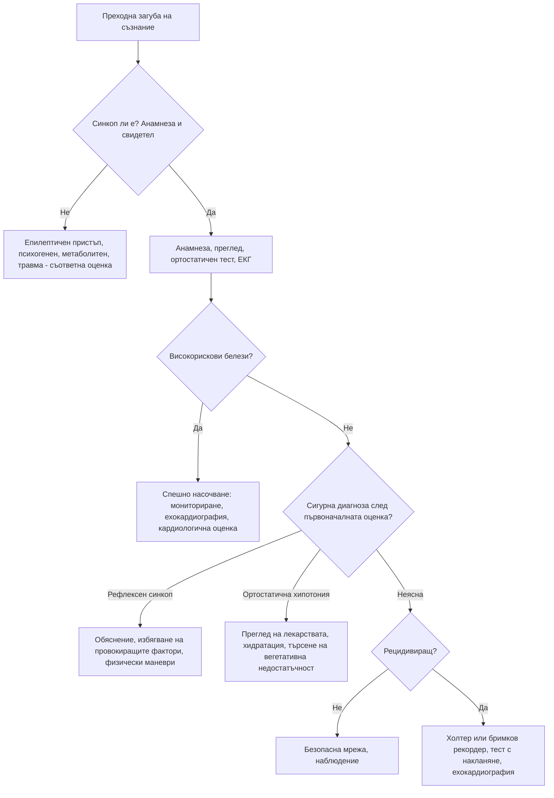

# Глава 11. Синкоп и преходна загуба на съзнание

> **Част III. Сърдечно-съдова система**

## Цели на главата

- Да се разграничава синкопът от другите причини за преходна загуба на съзнание, особено от епилептичния пристъп.
- Да се класифицира синкопът на рефлексен, ортостатичен и сърдечен.
- Да се стратифицира рискът според препоръките на Европейското дружество по кардиология (ESC).
- Да се избират рационално изследванията и да се избягват ненужните.

---

## 1. Определения

- **Преходна загуба на съзнание** — състояние на реална или привидна загуба на съзнание с липса на контакт, нарушен двигателен контрол, липса на реакция и кратка продължителност.
- **Синкоп** — преходна загуба на съзнание поради **глобална мозъчна хипоперфузия**. Характеризира се с бързо начало, кратка продължителност и спонтанно, пълно възстановяване.

### 1.1. Класификация на преходната загуба на съзнание

| Група | Подгрупи |
|---|---|
| **Синкоп** | Рефлексен; дължащ се на ортостатична хипотония; сърдечен |
| **Епилептични пристъпи** | Генерализирани тонично-клонични, атонични, фокални с нарушено съзнание |
| **Психогенни състояния** | Психогенен псевдосинкоп, психогенни неепилептични пристъпи |
| **Редки причини** | Субарахноидален кръвоизлив (с внезапно главоболие), вертебробазиларна ТИА (рядко със загуба на съзнание), синдром на подключичното обкрадване |
| **Състояния, които се бъркат със синкоп** | Падания без загуба на съзнание, катаплексия, интоксикации, хипогликемия, хипоксия, хипервентилация, мозъчно сътресение |

---

## 2. Класификация на синкопа

| Вид | Подтипове и причини | Типични белези |
|---|---|---|
| **Рефлексен (невромедиаторен)** | **Вазовагален** (при продължително стоене, топло и задушно помещение, болка, страх, вид на кръв, медицински процедури); **ситуационен** (при уриниране, дефекация, кашлица, гълтане, смях, след усилие); **синдром на каротидния синус** (при завъртане на главата, стегната яка, бръснене; възрастни мъже) | Млад пациент, продром (топлина, изпотяване, гадене, бледност, притъмняване пред очите), дългогодишна анамнеза за сходни епизоди |
| **Ортостатична хипотония** | **Лекарства** (антихипертензивни, диуретици, алфа-блокери като тамсулозин и доксазозин, нитрати, трициклични антидепресанти, антипсихотици, леводопа, SGLT2 инхибитори); **хиповолемия** (кървене, диария, повръщане, надбъбречна недостатъчност); **първична вегетативна недостатъчност** (болест на Parkinson, множествена системна атрофия, деменция с телца на Lewy, чиста вегетативна недостатъчност); **вторична вегетативна недостатъчност** (диабет, амилоидоза, алкохол, дефицит на B12, увреждане на гръбначния мозък) | Синкоп след изправяне, възрастен пациент, полипрагмазия, постпрандиален синкоп |
| **Сърдечен — аритмичен** | Брадикардия (дисфункция на синусовия възел, AV блок II–III степен, дисфункция на пейсмейкър); тахикардия (камерна, по-рядко суправентрикуларна); лекарствено индуцирани аритмии; наследствени каналопатии | Внезапно начало без продром, сърцебиене непосредствено преди синкопа, синкоп в легнало положение |
| **Сърдечен — структурен** | Аортна стеноза, хипертрофична обструктивна кардиомиопатия, остър миокарден инфаркт, белодробна тромбемболия, сърдечна тампонада, дисекация на аортата, миксом на предсърдието, белодробна хипертония, дисфункция на клапна протеза | **Синкоп при усилие**, болка в гърдите, задух, шум, известно сърдечно заболяване |

**Определение на ортостатична хипотония.** Систолното налягане спада с 20 mmHg или повече, диастолното с 10 mmHg или повече, или систолното пада под 90 mmHg в рамките на 3 минути след изправяне. Някои пациенти развиват **забавена** ортостатична хипотония, след повече от 3 минути.

---

## 3. Безопасна диагностична стратегия

| Въпрос | Отговор |
|---|---|
| **Вероятна диагноза** | Вазовагален синкоп, ситуационен синкоп, ортостатична хипотония (лекарствена) |
| **Сериозни заболявания, които не бива да се пропускат** | Аритмии (камерна тахикардия, пълен AV блок, каналопатии); аортна стеноза; хипертрофична кардиомиопатия; белодробна тромбемболия; остър миокарден инфаркт; дисекация на аортата; **кървене** (стомашно-чревно, **извънматочна бременност**, руптура на аневризма на коремната аорта); субарахноидален кръвоизлив |
| **Чести капани** | Конвулсивен синкоп, погрешно диагностициран като епилепсия; епилепсия, приета за синкоп; хипогликемия; лекарства (алфа-блокери, лекарства, удължаващи QT); ортостатична хипотония при болест на Parkinson; синдром на каротидния синус |
| **Маскиращи заболявания** | Лекарства, анемия, диабет (вегетативна невропатия), надбъбречна недостатъчност |
| **Психосоциални аспекти** | Психогенен псевдосинкоп, паническо разстройство с хипервентилация |

---

## 4. Анамнеза

Анамнезата, включително **сведенията на свидетели**, е най-ценното „изследване“.

### 4.1. Ключови въпроси

- **Преди епизода:** положение на тялото (легнало, седнало, изправено), дейност (усилие, уриниране, кашлица, хранене), провокиращи фактори (болка, страх, топлина, продължително стоене, завъртане на главата).
- **Продром:** топлина, изпотяване, гадене, притъмняване пред очите, шум в ушите (рефлексен синкоп); сърцебиене (аритмия); аура, дежа вю, миризма (епилепсия); болка в гърдите, задух, главоболие; **липса на предупреждение** (аритмия).
- **По време на епизода (свидетел):** цвят на кожата (бледост при синкоп, цианоза при пристъп), продължителност, характер на движенията, отворени или затворени очи, ухапване на езика, изпускане на урина.
- **След епизода:** бързо възстановяване (синкоп) или продължително объркване (епилептичен пристъп), гадене и умора (вазовагален), болка в гърдите, мускулни болки.
- **Минали епизоди**, възраст при първия, честота.
- **Анамнеза:** сърдечни заболявания, епилепсия, диабет, болест на Parkinson, психични заболявания.
- **Лекарства**, алкохол, наркотични вещества.
- **Фамилна анамнеза** за внезапна смърт, каналопатии, кардиомиопатии.

### 4.2. Синкоп или епилептичен пристъп?

| Белег | Синкоп | Генерализиран тонично-клоничен пристъп |
|---|---|---|
| Провокиращ фактор | Изправяне, стоене, болка, топлина, емоции | Лишаване от сън, алкохол, мигащи светлини; често без провокация |
| Продром | Топлина, гадене, изпотяване, притъмняване | Аура (дежа вю, епигастрално усещане, миризма) или внезапно |
| Цвят на кожата | Бледност | Цианоза, зачервяване |
| Движения | Кратки (< 15 s), асинхронни миоклонични потрепвания **след** падането (конвулсивен синкоп е чест) | Тонична фаза, последвана от ритмични, синхронни клонични движения с продължителност 1–2 минути; обръщане на главата настрани |
| Очи | Обикновено отворени | Отворени, често с девиация |
| Ухапване на езика | Рядко, по върха | **Странично ухапване на езика** — силно специфично за епилептичен пристъп |
| Изпускане на урина | Възможно | Възможно (не разграничава) |
| Продължителност | Секунди до около 1 минута | 1–3 минути |
| Възстановяване | Бързо, пълна ориентация | **Продължително объркване** (минути до часове), сънливост, главоболие, мускулни болки |
| Повишена КК или пролактин след епизода | Не | Възможно |

**Психогенен псевдосинкоп и психогенни неепилептични пристъпи.** Насочват към тях чести и продължителни епизоди, **затворените очи** по време на епизода, съпротивата при опит за отваряне на клепачите, вълнообразните движения и въртенето на таза. Други белези са липсата на травми въпреки многото епизоди и плачът след епизода.

---

## 5. Физикален преглед

- **Ортостатичен тест:** АН и пулс в легнало положение (след 5 минути), после на 1-вата и 3-тата минута след изправяне.
- АН на двете ръце (дисекация, синдром на подключичното обкрадване).
- Сърдечна аускултация: систолен шум при аортна стеноза или хипертрофична кардиомиопатия.
- Признаци на сърдечна недостатъчност.
- Неврологичен статус (фокален дефицит, паркинсонизъм, невропатия).
- **Ректално туше** при съмнение за стомашно-чревно кървене (мелена).
- Корем: пулсираща формация (аневризма на коремната аорта).
- Травми, ухапване на езика.

---

## 6. Стратификация на риска (ESC)

### 6.1. Нискорискови белези (насочват към рефлексен синкоп)

- Типичен продром (топлина, изпотяване, гадене).
- Синкоп след неприятна гледка, звук, миризма или болка.
- Продължително стоене, претъпкано и горещо помещение.
- По време на хранене или след него.
- При кашлица, дефекация, уриниране.
- При завъртане на главата или натиск върху каротидния синус.
- При изправяне от легнало или седнало положение.
- Дългогодишна анамнеза за сходни епизоди.
- Липса на структурно сърдечно заболяване, нормален физикален преглед и нормална ЕКГ.

### 6.2. Високорискови белези

**Анамнеза:**

- нова болка в гърдите, задух, коремна болка или главоболие;
- синкоп **при усилие** или **в легнало положение**;
- внезапно сърцебиене, непосредствено последвано от синкоп;
- липса на продром или продром под 10 секунди;
- фамилна анамнеза за внезапна сърдечна смърт в млада възраст;
- синкоп в седнало положение;
- тежко структурно сърдечно заболяване или исхемична болест (сърдечна недостатъчност, ниска фракция на изтласкване, прекаран инфаркт).

**Физикален преглед:**

- необяснимо систолно налягане под 90 mmHg;
- данни за стомашно-чревно кървене при ректално туше;
- персистираща брадикардия под 40/min в будно състояние (при нетрениран човек);
- неизяснен систолен шум.

**ЕКГ:**

- остра исхемия;
- AV блок II степен тип Mobitz II или AV блок III степен;
- предсърдно мъждене с бавна камерна честота (< 40/min);
- синусова брадикардия < 40/min, синоатриален блок или паузи > 3 s в будно състояние;
- бедрен блок, интравентрикуларно проводно нарушение, камерна хипертрофия, Q-зъбци;
- камерна тахикардия;
- дисфункция на пейсмейкър или имплантиран кардиовертер-дефибрилатор;
- ЕКГ тип 1 на Brugada;
- QTc > 460 ms при повторни записи;
- белези на синдром на Wolff-Parkinson-White, аритмогенна кардиомиопатия или хипертрофична кардиомиопатия.

**Пациентите с високорискови белези се насочват спешно към болница.** Пациентите само с нискорискови белези могат да бъдат изписани с обяснение и безопасна мрежа.

---

## 7. Изследвания

| Изследване | Кога е показано |
|---|---|
| **12-канална ЕКГ** | При **всеки** пациент |
| **Ортостатичен тест** | При всеки пациент |
| ПКК | Съмнение за кървене или анемия |
| Глюкоза | Съмнение за хипогликемия (оценката на място е ценна) |
| Тест за бременност | Всяка жена в детеродна възраст |
| Електролити, креатинин | Дехидратация, диуретици, съмнение за аритмия |
| Тропонин, NT-proBNP | Само при клинично съмнение за сърдечна причина |
| D-димер | Съмнение за белодробна тромбемболия |
| Ехокардиография | Съмнение за структурно сърдечно заболяване, шум, отклонена ЕКГ |
| Холтер мониториране | Чести епизоди (почти всекидневно) |
| Събитиен или имплантируем бримков рекордер | Рецидивиращ неизяснен синкоп с подозрение за аритмия |
| Масаж на каротидния синус | Възраст над 40 години с неизяснен синкоп. Противопоказан при скорошна ТИА или инсулт и при шум над каротидите |
| Тест с накланяне (tilt test) | Съмнение за рефлексен синкоп с неясна анамнеза, ортостатична хипотония, психогенен псевдосинкоп |
| Тест с натоварване | Синкоп при усилие (след изключване на аортна стеноза и хипертрофична кардиомиопатия с ехокардиография) |
| ЕЕГ, КТ или ЯМР на главата | **Не са рутинни.** Показани са само при съмнение за епилептичен пристъп или неврологично заболяване и при травма на главата |
| Доплерова ехография на каротидите | **Не е показана** за изясняване на синкоп |

---

## 8. Диагностичен алгоритъм

---

## 9. Особености в общата практика

- Съберете анамнеза **от свидетеля** още при първия контакт, например по телефона, преди да е забравил подробностите.
- Всеки пациент със синкоп трябва да има ЕКГ.
- Преразгледайте лекарствата. Алфа-блокерите (тамсулозин, доксазозин), комбинациите от антихипертензивни средства и диуретиците са честа причина за синкоп при възрастни хора.
- Информирайте пациента за ограниченията при шофиране според действащите национални разпоредби. Правилата зависят от вида на синкопа и от професионалния или непрофесионалния характер на шофирането.

---

## 10. Клинични перли

- **Синкопът при усилие е сърдечен, докато не се докаже противното.** Причината може да е аортна стеноза, хипертрофична кардиомиопатия, аритмогенна кардиомиопатия или каналопатия.
- Кратките потрепвания на крайниците са много чести при синкоп (конвулсивен синкоп). Те не означават епилепсия.
- Изпускането на урина не разграничава синкопа от епилептичния пристъп. Страничното ухапване на езика и продължителното объркване след епизода говорят за пристъп.
- Синкоп при млада жена с коремна болка: извънматочна бременност, докато не се докаже противното. Направете тест за бременност.
- Синкоп при възрастен човек с болка в гърба или корема: руптура на аневризма на коремната аорта.
- Синкопът може да е единственият признак на белодробна тромбемболия или на стомашно-чревно кървене.
- Синкоп в седнало или легнало положение не е вазовагален. Търсете аритмия.

---

## 11. Клиничен случай

**Случай.** Мъж на 74 години губи съзнание, докато вечеря седнал на масата. Съпругата му казва, че „просто клюмнал“ без никакво предупреждение и дошъл на себе си след около 20 секунди, напълно ориентиран. Ударил е лицето си в масата. Има хипертония и приема амлодипин. Такъв епизод е имал и преди месец. При прегледа: пулс 64/min, АН 148/82 mmHg без ортостатична промяна, без шумове. ЕКГ: синусов ритъм, PR интервал 230 ms, десен бедрен блок и ляв преден хемиблок.

**Въпроси.** 1) Какъв е рискът? 2) Каква е най-вероятната причина?

**Обсъждане.** Синкопът е настъпил в седнало положение, без продром, с травма и повторение. ЕКГ показва трифасцикуларно проводно нарушение (бифасцикуларен блок с удължен PR). Това са **високорискови белези**, които насочват към интермитентен **високостепенен AV блок**. Пациентът е насочен спешно. При мониториране в болницата е регистриран пароксизмален пълен AV блок с асистолия от 6 секунди. Имплантиран е постоянен пейсмейкър.

**Поука.** Синкопът без продром, особено в седнало положение, при пациент с проводно нарушение в ЕКГ изисква спешна оценка. Такъв синкоп не е „вазовагален“.
