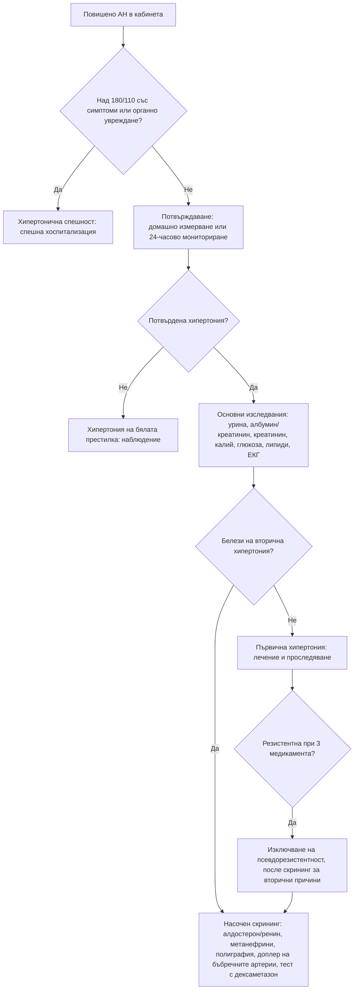

# Глава 12. Артериална хипертония: първична срещу вторична

> **Част III. Сърдечно-съдова система**

## Цели на главата

- Да се потвърждава правилно диагнозата артериална хипертония и да се разпознават хипертонията на бялата престилка и маскираната хипертония.
- Да се познават клиничните белези, които насочват към вторична хипертония.
- Да се избират скрининговите изследвания за най-честите вторични причини.
- Да се разграничават хипертоничната спешност и тежката хипертония без остро органно увреждане.
- Да се разпознава псевдорезистентната хипертония.

---

## 1. Определение и диагноза

### 1.1. Прагови стойности

| Метод | Хипертония при стойности |
|---|---|
| Измерване в кабинета | ≥ 140/90 mmHg |
| Домашно измерване (средна стойност) | ≥ 135/85 mmHg |
| Амбулаторно 24-часово мониториране — средно за 24 часа | ≥ 130/80 mmHg |
| Амбулаторно мониториране — дневни стойности | ≥ 135/85 mmHg |
| Амбулаторно мониториране — нощни стойности | ≥ 120/70 mmHg |

Препоръките на ESC от 2024 г. обособяват и категорията **повишено артериално налягане** (120–139/70–89 mmHg в кабинета). При нея решението за лечение зависи от общия сърдечно-съдов риск.

### 1.2. Потвърждаване на диагнозата

- **Правилна техника на измерване:** 5 минути покой в седнало положение, опрян гръб, ръката на нивото на сърцето, **подходящ размер на маншета** (твърде малкият маншет завишава стойностите), без кофеин и тютюнопушене 30 минути преди измерването. Правят се поне две измервания и при първото посещение се измерва на двете ръце.
- **Хипертония на бялата престилка:** повишени стойности в кабинета и нормални извън него (среща се при 10–30% от „хипертониците“).
- **Маскирана хипертония:** нормални стойности в кабинета, но повишени извън него.
- Диагнозата се потвърждава чрез **домашно измерване** или **амбулаторно мониториране**, освен при много високи стойности или при налично органно увреждане.
- **Псевдохипертония** (белег на Osler) — при силно калцирани, неспособни да се компримират артерии при възрастни хора. Измереното налягане е по-високо от реалното.

---

## 2. Първична и вторична хипертония

- **Първичната (есенциална) хипертония** е 85–95% от случаите. Тя е многофакторна: генетични фактори, възраст, затлъстяване, прием на сол, алкохол, обездвижване.
- **Вторичната хипертония** е 5–15% от случаите, а при резистентна хипертония и при млади пациенти делът ѝ е значително по-висок. Разпознаването ѝ е важно, защото някои причини са **лечими** и дори **излекуеми**.

### 2.1. Причини за вторична хипертония

| Група | Причини |
|---|---|
| **Бъбречни паренхимни** | Хронично бъбречно заболяване, гломерулонефрити, поликистоза на бъбреците, диабетна нефропатия |
| **Реноваскуларни** | Атеросклеротична стеноза на бъбречната артерия (възрастни с разпространена атеросклероза); фибромускулна дисплазия (млади жени) |
| **Ендокринни** | **Първичен алдостеронизъм** (най-честата ендокринна причина); феохромоцитом и параганглиом; синдром на Cushing; хипер- и хипотиреоидизъм; първичен хиперпаратиреоидизъм; акромегалия |
| **Обструктивна сънна апнея** | Много честа, особено при резистентна хипертония |
| **Коарктация на аортата** | Млади пациенти; разлика в налягането между ръцете и краката |
| **Лекарства и вещества** | НСПВС, комбинирани орални контрацептиви, деконгестанти (псевдоефедрин), глюкокортикоиди, флудрокортизон, **женско биле (глициризин)**, циклоспорин и такролимус, VEGF инхибитори, еритропоетин, стимуланти (амфетамини, метилфенидат, кокаин), венлафаксин, МАО-инхибитори, **алкохол**, анаболни стероиди |
| **Бременност** | Гестационна хипертония, прееклампсия |
| **Редки моногенни форми** | Синдром на Liddle, вродена надбъбречна хиперплазия, глюкокортикоид-повлиявал алдостеронизъм |

---

## 3. Безопасна диагностична стратегия

| Въпрос | Отговор |
|---|---|
| **Вероятна диагноза** | Първична хипертония, хипертония на бялата престилка |
| **Сериозни заболявания, които не бива да се пропускат** | Хипертонична спешност (енцефалопатия, остра левокамерна недостатъчност, ОКС, дисекация на аортата, мозъчен инсулт, прееклампсия и еклампсия, малигнена хипертония); феохромоцитом; реноваскуларна хипертония; хронично бъбречно заболяване; коарктация на аортата |
| **Чести капани** | Първичен алдостеронизъм с нормален калий (в повечето случаи калият е нормален); обструктивна сънна апнея; лекарства (НСПВС, деконгестанти, контрацептиви); алкохол; **неспазване на лечението**; неправилна техника на измерване |
| **Маскиращи заболявания** | Заболявания на щитовидната жлеза, хронично бъбречно заболяване, лекарства, синдром на Cushing |
| **Психосоциални аспекти** | Тревожност (хипертония на бялата престилка), паническо разстройство, хроничен стрес |

---

## 4. Клинични белези, насочващи към вторична хипертония

| Белег | Подозирана причина | Скринингово изследване |
|---|---|---|
| Начало преди 40-годишна възраст (особено преди 30), без фамилна обремененост и затлъстяване | Всички вторични причини | Пълен скрининг |
| **Резистентна хипертония** (незадоволителен контрол при ≥ 3 медикамента, включително диуретик, в адекватни дози) | Първичен алдостеронизъм, обструктивна сънна апнея, хронично бъбречно заболяване, реноваскуларна хипертония, лекарства | Съотношение алдостерон/ренин, полиграфия, креатинин и изследване на урината |
| **Хипокалиемия** (спонтанна или изразена при диуретик) | Първичен алдостеронизъм, синдром на Cushing, реноваскуларна хипертония, женско биле, синдром на Liddle | Съотношение алдостерон/ренин |
| Пароксизми на главоболие, изпотяване, сърцебиене, бледност; лабилно налягане | Феохромоцитом | Свободни метанефрини в плазмата или фракционирани метанефрини в урината |
| Хъркане, паузи в дишането, дневна сънливост, затлъстяване, нощна хипертония | Обструктивна сънна апнея | Въпросник STOP-BANG, полиграфия |
| Шум в корема, внезапен („светкавичен“) белодробен оток, асиметрия на бъбреците (разлика над 1,5 cm), повишение на креатинина с над 30% след АСЕ инхибитор или сартан, разпространена атеросклероза | Реноваскуларна хипертония | Доплерова ехография на бъбречните артерии, КТ или МР ангиография |
| Млада жена с тежка хипертония, шум над бъбречната артерия | Фибромускулна дисплазия | КТ или МР ангиография |
| Закъснение на пулса на a. femoralis спрямо a. radialis, по-високо налягане на ръцете, отколкото на краката, шум над гърба | Коарктация на аортата | Ехокардиография, КТ или ЯМР |
| Кушингоидни белези | Синдром на Cushing | Тест с 1 mg дексаметазон през нощта |
| Протеинурия, хематурия, повишен креатинин, отоци | Бъбречно паренхимно заболяване | Изследване на урината, съотношение албумин/креатинин, eGFR, ехография |
| Хиперкалциемия | Първичен хиперпаратиреоидизъм | Калций, ПТХ |
| Надбъбречен инциденталом | Първичен алдостеронизъм, феохромоцитом, синдром на Cushing | Съотношение алдостерон/ренин, метанефрини, тест с дексаметазон |
| Тежка хипертония (III степен) или хипертонична спешност | Всички вторични причини | Пълен скрининг |
| Внезапно влошаване на добре контролирана хипертония | Реноваскуларна хипертония, лекарства, бъбречно заболяване | Насочени изследвания |
| Непропорционално тежко органно увреждане | Вторична хипертония | Пълен скрининг |

### 4.1. Първичен алдостеронизъм

- Среща се при 5–10% от хипертониците и при около 20% от тези с резистентна хипертония.
- **Калият е нормален при повечето пациенти.** Хипокалиемията е белег на по-тежко заболяване.
- Носи по-висок сърдечно-съдов риск от първичната хипертония при същото налягане: предсърдно мъждене, инсулт, сърдечна недостатъчност.
- Съвременните препоръки разширяват скрининга. Той е задължителен при изброените по-горе белези, а все по-често се препоръчва при **всички пациенти с потвърдена хипертония**.
- **Скрининг:** съотношение алдостерон/ренин, изследвано сутрин, при нормализиран калий. Лекарствата влияят на резултата:
  - антагонистите на минералкортикоидните рецептори, диуретиците, АСЕ инхибиторите и сартаните повишават ренина и могат да дадат **фалшиво отрицателен** резултат;
  - бета-блокерите понижават ренина и могат да дадат **фалшиво положителен** резултат.
- Положителният скрининг се потвърждава с тест за супресия, КТ на надбъбреците и катетеризация на надбъбречните вени в специализиран център.

---

## 5. Изследвания при всеки пациент с хипертония

- Изследване на урината с лента (белтък, кръв) и **съотношение албумин/креатинин**.
- Креатинин и eGFR, натрий, калий.
- Глюкоза на гладно и/или HbA1c, липиден профил.
- **ЕКГ** (левокамерна хипертрофия, предсърдно мъждене).
- Според клиничните данни: ТСХ, калций, пикочна киселина, ПКК, ехокардиография, фундоскопия (задължителна при тежка хипертония).

---

## 6. Тежка хипертония и хипертонична спешност

| Състояние | Определение | Поведение |
|---|---|---|
| **Хипертонична спешност** | Тежка хипертония (обикновено > 180/110 mmHg) с **остро органно увреждане**: хипертонична енцефалопатия, мозъчен инсулт, ОКС, остър белодробен оток, дисекация на аортата, прееклампсия и еклампсия, малигнена хипертония (ретинални кръвоизливи, едем на папилата, остро бъбречно увреждане, тромботична микроангиопатия) | Спешна хоспитализация, интравенозно лечение, контролирано понижаване |
| **Тежка хипертония без остро органно увреждане** | Високи стойности без симптоми и белези на остро увреждане | Амбулаторно, постепенно понижаване за дни до седмици с перорални средства. Търсят се и се лекуват болката, тревожността и неспазването на лечението |

Бързото и прекомерно понижаване на налягането при хронична хипертония без органно увреждане е **вредно**, защото може да предизвика мозъчна или коронарна исхемия.

---

## 7. Псевдорезистентна хипертония

Преди да се приеме, че хипертонията е истински резистентна, трябва да се изключат:

1. **Неспазването на лечението** — най-честата причина.
2. Неправилната техника на измерване (малък маншет) и ефектът на бялата престилка. Необходимо е амбулаторно мониториране.
3. Неадекватните дози или неподходящите комбинации.
4. Лекарствата, които повишават налягането (НСПВС, деконгестанти, контрацептиви).
5. Високият прием на сол и алкохол, затлъстяването.

---

## 8. Изолирана систолна хипертония

- **При възрастни хора** тя е най-честата форма на хипертония. Дължи се на повишената ригидност на артериите.
- **При млади, високи мъже спортисти** може да е „фалшива“ поради усилването на пулсовата вълна в периферията. Централното налягане е нормално.
- Широкото пулсово налягане е характерно за аортната регургитация, хипертиреоидизма, анемията и артериовенозните фистули.

---

## 9. Диагностичен алгоритъм

---

## 10. Клинични перли

- Хипертония при млад човек е вторична, докато не се докаже противното.
- Нормалният калий не изключва първичен алдостеронизъм.
- Хъркащият хипертоник с резистентна хипертония вероятно има обструктивна сънна апнея.
- Попитайте за НСПВС, капки за нос, женско биле, енергийни напитки и контрацептиви.
- Повишение на креатинина с над 30% след започване на АСЕ инхибитор насочва към двустранна стеноза на бъбречните артерии.
- Главоболие, изпотяване и сърцебиене („класическата триада“) при хипертоник: изследвайте метанефрини. Метоклопрамидът и глюкокортикоидите могат да провокират феохромоцитомна криза.
- При всеки хипертоник под 30 години палпирайте едновременно пулса на a. radialis и a. femoralis (коарктация).

---

## 11. Клиничен случай

**Случай.** Жена на 41 години има хипертония от 5 години. Налягането ѝ остава около 160/100 mmHg въпреки лечението с периндоприл, амлодипин и индапамид в максимални дози. Приема лекарствата редовно, което се потвърждава и от аптечните данни. При 24-часовото мониториране средното налягане е 152/96 mmHg. Калият е 3,2 mmol/l. Индексът на телесната ѝ маса е 24 kg/m², не хърка и не приема НСПВС.

**Въпроси.** 1) Истинска резистентна хипертония ли е това? 2) Кое е следващото изследване и как да се подготви пациентката?

**Обсъждане.** Лечението се спазва, мониторирането потвърждава хипертонията и лекарствата са в адекватни дози. Следователно става дума за **истинска резистентна хипертония**. Хипокалиемията, въпреки че индапамидът допринася за нея, заедно с резистентността насочва силно към **първичен алдостеронизъм**. Калият трябва да бъде коригиран. Индапамидът се спира 4 седмици преди изследването. Периндоприлът понижава съотношението алдостерон/ренин и може да даде фалшиво отрицателен резултат, затова се заменя с верапамил с удължено освобождаване и доксазозин, които не влияят съществено на изследването. Съотношението алдостерон/ренин е силно повишено, а тестът за супресия потвърждава диагнозата. КТ показва аденом с диаметър 1,4 cm в лявата надбъбречна жлеза. Катетеризацията на надбъбречните вени потвърждава едностранна секреция. След лапароскопска адреналектомия налягането се нормализира само с един медикамент.

**Поука.** Резистентната хипертония с хипокалиемия е първичен алдостеронизъм, докато не се докаже противното. Това е едно от малкото излекуеми заболявания в кардиологията.

<!-- навигация -->

---

[← Глава 11. Синкоп и преходна загуба на съзнание](11-sinkop.md) · [Съдържание](../README.md) · [Глава 13. Сърдечни шумове и сърдечна недостатъчност →](13-shumove-sartsena-nedostatachnost.md)
