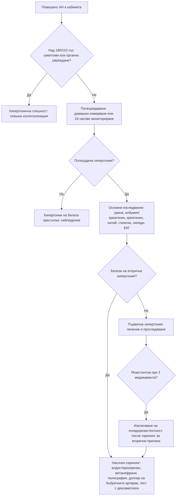

# Глава 12. Артериална хипертония: първична срещу вторична

> **Част III. Сърдечно-съдова система**

## Цели на главата

- Да се потвърждава правилно диагнозата артериална хипертония и да се разпознават хипертонията на бялата престилка и маскираната хипертония.
- Да се изброяват клиничните белези, които насочват към вторична хипертония.
- Да се избират скрининговите изследвания за най-честите вторични причини.
- Да се разграничават хипертоничната спешност и тежката хипертония без остро органно увреждане.
- Да се разпознава псевдорезистентната хипертония.

## Ключови моменти

- Хипертонията се диагностицира при АН в кабинета 140/90 mmHg или повече, но диагнозата се потвърждава с домашно измерване (135/85 mmHg или повече) или амбулаторно мониториране (средно за 24 часа 130/80 mmHg или повече) *(SORT B [1, 2])*.
- Вторичната хипертония е 5–15% от случаите. За нея насочват ранното начало, резистентността, хипокалиемията, пароксизмите, хъркането, шумовете и внезапното влошаване.
- Първичният алдостеронизъм е най-честата ендокринна причина. Калият е нормален при повечето пациенти. Скринингът е със съотношение алдостерон/ренин и все по-често се препоръчва при всички хора с хипертония *(SORT B [4, 5])*.
- Хипертоничната спешност е тежка хипертония с остро органно увреждане и изисква хоспитализация. Тежката хипертония без органно увреждане се понижава постепенно с перорални средства *(SORT C [1, 2])*.
- Преди да се приеме резистентност, се изключват неспазването на лечението, неправилното измерване, ефектът на бялата престилка и лекарствата, които повишават налягането *(SORT C [6])*.

---

## 1. Определение и диагноза

### 1.1. Прагови стойности

*Таблица 12.1. Прагови стойности за артериална хипертония.*

| Метод | Хипертония при стойности |
|---|---|
| Измерване в кабинета | ≥ 140/90 mmHg |
| Домашно измерване (средна стойност) | ≥ 135/85 mmHg |
| Амбулаторно 24-часово мониториране – средно за 24 часа | ≥ 130/80 mmHg |
| Амбулаторно мониториране – дневни стойности | ≥ 135/85 mmHg |
| Амбулаторно мониториране – нощни стойности | ≥ 120/70 mmHg |

Препоръките на ESC от 2024 г. обособяват и категорията **повишено артериално налягане** (120–139/70–89 mmHg в кабинета). При нея решението за лечение зависи от общия сърдечно-съдов риск [1].

### 1.2. Потвърждаване на диагнозата

- **Правилна техника на измерване:** 5 минути покой в седнало положение, опрян гръб, ръката на нивото на сърцето, **подходящ размер на маншета** (твърде малкият маншет завишава стойностите), без кофеин и тютюнопушене 30 минути преди измерването. Правят се поне две измервания и при първото посещение се измерва на двете ръце.
- **Хипертония на бялата престилка:** повишени стойности в кабинета и нормални извън него. Тя е честа, особено при леко повишени стойности в кабинета.
- **Маскирана хипертония:** нормални стойности в кабинета, но повишени извън него.
- Диагнозата се потвърждава чрез домашно измерване или амбулаторно мониториране, освен при много високи стойности или при налично органно увреждане [1, 2].
- **Псевдохипертония** (белег на Osler) – при силно калцирани, неспособни да се компримират артерии при възрастни хора. Измереното налягане е по-високо от реалното.

---

## 2. Първична и вторична хипертония

- **Първичната (есенциална) хипертония** е 85–95% от случаите. Тя е многофакторна: генетични фактори, възраст, затлъстяване, прием на сол, алкохол, обездвижване.
- Вторичната хипертония е 5–15% от случаите, а при резистентна хипертония и при млади пациенти делът ѝ е значително по-висок. Разпознаването ѝ е важно, защото някои причини са лечими и дори излекуеми.

### 2.1. Причини за вторична хипертония

*Таблица 12.2. Причини за вторична хипертония.*

| Група | Причини |
|---|---|
| **Бъбречни паренхимни** | Хронично бъбречно заболяване, гломерулонефрити, поликистоза на бъбреците, диабетна нефропатия |
| **Реноваскуларни** | Атеросклеротична стеноза на бъбречната артерия (възрастни с разпространена атеросклероза); фибромускулна дисплазия (млади жени) |
| **Ендокринни** | Първичен алдостеронизъм (най-честата ендокринна причина); феохромоцитом и параганглиом; синдром на Cushing; хипер- и хипотиреоидизъм; първичен хиперпаратиреоидизъм; акромегалия |
| **Обструктивна сънна апнея** | Много честа, особено при резистентна хипертония |
| **Коарктация на аортата** | Млади пациенти; разлика в налягането между ръцете и краката |
| **Лекарства и вещества** | НСПВС, комбинирани орални контрацептиви, деконгестанти (псевдоефедрин), глюкокортикоиди, флудрокортизон, женско биле (глициризин), циклоспорин и такролимус, VEGF инхибитори, еритропоетин, стимуланти (амфетамини, метилфенидат, кокаин), венлафаксин, МАО-инхибитори, алкохол, анаболни стероиди |
| **Бременност** | Гестационна хипертония, прееклампсия |
| **Редки моногенни форми** | Синдром на Liddle, вродена надбъбречна хиперплазия, глюкокортикоид-повлияван алдостеронизъм |

---

## 3. Безопасна диагностична стратегия

*Таблица 12.3. Безопасна диагностична стратегия.*

| Въпрос | Отговор |
|---|---|
| **Вероятна диагноза** | Първична хипертония, хипертония на бялата престилка |
| **Сериозни заболявания, които не бива да се пропускат** | Хипертонична спешност (енцефалопатия, остра левокамерна недостатъчност, ОКС, дисекация на аортата, мозъчен инсулт, прееклампсия и еклампсия, малигнена хипертония); феохромоцитом; реноваскуларна хипертония; хронично бъбречно заболяване; коарктация на аортата |
| **Чести капани** | Първичен алдостеронизъм с нормален калий (в повечето случаи калият е нормален); обструктивна сънна апнея; лекарства (НСПВС, деконгестанти, контрацептиви); алкохол; неспазване на лечението; неправилна техника на измерване |
| **Маскиращи заболявания** | Заболявания на щитовидната жлеза, хронично бъбречно заболяване, лекарства, синдром на Cushing |
| **Психосоциални аспекти** | Тревожност (хипертония на бялата престилка), паническо разстройство, хроничен стрес |

---

## 4. Клинични белези, насочващи към вторична хипертония

*Таблица 12.4. Клинични белези, насочващи към вторична хипертония.*

| Белег | Подозирана причина | Скринингово изследване |
|---|---|---|
| Начало преди 40-годишна възраст (особено преди 30), без фамилна обремененост и затлъстяване | Всички вторични причини | Пълен скрининг |
| **Резистентна хипертония** (незадоволителен контрол при ≥ 3 медикамента, включително диуретик, в адекватни дози) | Първичен алдостеронизъм, обструктивна сънна апнея, хронично бъбречно заболяване, реноваскуларна хипертония, лекарства | Съотношение алдостерон/ренин, полиграфия, креатинин и изследване на урината |
| **Хипокалиемия** (спонтанна или изразена при диуретик) | Първичен алдостеронизъм, синдром на Cushing, реноваскуларна хипертония, женско биле, синдром на Liddle | Съотношение алдостерон/ренин |
| Пароксизми на главоболие, изпотяване, сърцебиене, бледност; лабилно налягане | Феохромоцитом | Свободни метанефрини в плазмата или фракционирани метанефрини в урината [3] |
| Хъркане, паузи в дишането, дневна сънливост, затлъстяване, нощна хипертония | Обструктивна сънна апнея | Въпросник STOP-BANG, полиграфия |
| Шум в корема, внезапен („светкавичен“) белодробен оток, асиметрия на бъбреците (разлика над 1,5 cm), повишение на креатинина с над 30% след АСЕ инхибитор или сартан, разпространена атеросклероза | Реноваскуларна хипертония | Доплерова ехография на бъбречните артерии, КТ или ЯМР ангиография |
| Млада жена с тежка хипертония, шум над бъбречната артерия | Фибромускулна дисплазия | КТ или ЯМР ангиография |
| Закъснение на пулса на a. femoralis спрямо a. radialis, по-високо налягане на ръцете, отколкото на краката, шум над гърба | Коарктация на аортата | Ехокардиография, КТ или ЯМР |
| Кушингоидни белези | Синдром на Cushing | Тест с 1 mg дексаметазон през нощта |
| Протеинурия, хематурия, повишен креатинин, отоци | Бъбречно паренхимно заболяване | Изследване на урината, съотношение албумин/креатинин, eGFR, ехография |
| Хиперкалциемия | Първичен хиперпаратиреоидизъм | Калций, ПТХ |
| Надбъбречен инциденталом | Първичен алдостеронизъм, феохромоцитом, синдром на Cushing | Съотношение алдостерон/ренин, метанефрини, тест с дексаметазон |
| Тежка хипертония (III степен) или хипертонична спешност | Всички вторични причини | Пълен скрининг |
| Внезапно влошаване на добре контролирана хипертония | Реноваскуларна хипертония, лекарства, бъбречно заболяване | Насочени изследвания |
| Непропорционално тежко органно увреждане | Вторична хипертония | Пълен скрининг |

### 4.1. Първичен алдостеронизъм

- Среща се при 5–10% от хипертониците и при около 20% от тези с резистентна хипертония [4].
- **Калият е нормален при повечето пациенти.** Хипокалиемията е белег на по-тежко заболяване.
- Носи по-висок сърдечно-съдов риск от първичната хипертония при същото налягане: предсърдно мъждене, инсулт, сърдечна недостатъчност.
- Съвременните препоръки разширяват скрининга. Той е задължителен при изброените по-горе белези, а препоръките на Endocrine Society от 2025 г. предлагат скрининг при **всички хора с хипертония** [5].
- **Скрининг:** съотношение алдостерон/ренин, изследвано сутрин, при нормализиран калий. Лекарствата влияят на резултата:
  - антагонистите на минералкортикоидните рецептори, диуретиците, АСЕ инхибиторите и сартаните повишават ренина и могат да дадат **фалшиво отрицателен** резултат;
  - бета-блокерите понижават ренина и могат да дадат **фалшиво положителен** резултат.
- Положителният скрининг се потвърждава с тест за супресия, КТ на надбъбреците и катетеризация на надбъбречните вени в специализиран център.

---

## 5. Изследвания при всеки пациент с хипертония

- Изследване на урината с лента (белтък, кръв) и **съотношение албумин/креатинин**.
- Креатинин и eGFR, натрий, калий.
- Глюкоза на гладно и/или HbA1c, липиден профил.
- **ЕКГ** (левокамерна хипертрофия, предсърдно мъждене).
- Според клиничните данни: ТСХ, калций, пикочна киселина, ПКК, ехокардиография, фундоскопия (задължителна при тежка хипертония).

---

## 6. Тежка хипертония и хипертонична спешност

*Таблица 12.5. Тежка хипертония и хипертонична спешност.*

| Състояние | Определение | Поведение |
|---|---|---|
| **Хипертонична спешност** | Тежка хипертония (обикновено > 180/110 mmHg) с остро органно увреждане: хипертонична енцефалопатия, мозъчен инсулт, ОКС, остър белодробен оток, дисекация на аортата, прееклампсия и еклампсия, малигнена хипертония (ретинални кръвоизливи, едем на папилата, остро бъбречно увреждане, тромботична микроангиопатия) | Спешна хоспитализация, интравенозно лечение, контролирано понижаване |
| **Тежка хипертония без остро органно увреждане** | Високи стойности без симптоми и белези на остро увреждане | Амбулаторно, постепенно понижаване за дни до седмици с перорални средства. Търсят се и се лекуват болката, тревожността и неспазването на лечението |

Бързото и прекомерно понижаване на налягането при хронична хипертония без органно увреждане е **вредно**, защото може да предизвика мозъчна или коронарна исхемия [1].

По NICE при АН 180/120 mmHg или повече без симптоми и белези, налагащи оценка в същия ден, органното увреждане се търси възможно най-скоро. При органно увреждане лечението се започва веднага. При липса на такова диагнозата се потвърждава с повторно измерване или амбулаторно мониториране и пациентът се преоценява до 7 дни [2].

---

## 7. Псевдорезистентна хипертония

Преди да се приеме, че хипертонията е истински резистентна, трябва да се изключат [6]:

1. **Неспазването на лечението** – най-честата причина.
2. Неправилната техника на измерване (малък маншет) и ефектът на бялата престилка. Необходимо е амбулаторно мониториране.
3. Неадекватните дози или неподходящите комбинации.
4. Лекарствата, които повишават налягането (НСПВС, деконгестанти, контрацептиви).
5. Високият прием на сол и алкохол, затлъстяването.

---

## 8. Изолирана систолна хипертония

- **При възрастни хора** тя е най-честата форма на хипертония. Дължи се на повишената ригидност на артериите.
- **При млади, високи мъже спортисти** може да е „фалшива“ поради усилването на пулсовата вълна в периферията. Централното налягане е нормално.
- Широкото пулсово налягане е характерно за аортната регургитация, хипертиреоидизма, анемията и артериовенозните фистули.

---

## 9. Диагностичен алгоритъм

*Фигура 12.1. Диагностичен алгоритъм: артериална хипертония: първична срещу вторична. Схема на авторите въз основа на източниците, цитирани в главата.*

Текстово описание на фигура 12.1

1. Повишено АН в кабинета. Следва: към т. 2.
2. **Въпрос:** Над 180/110 със симптоми или органно увреждане? Да – към т. 3; Не – към т. 4.
3. Хипертонична спешност: спешна хоспитализация.
4. Потвърждаване: домашно измерване или 24-часово мониториране. Следва: към т. 5.
5. **Въпрос:** Потвърдена хипертония? Не – към т. 6; Да – към т. 7.
6. Хипертония на бялата престилка: наблюдение.
7. Основни изследвания: урина, албумин/креатинин, креатинин, калий, глюкоза, липиди, ЕКГ. Следва: към т. 8.
8. **Въпрос:** Белези на вторична хипертония? Не – към т. 9; Да – към т. 10.
9. Първична хипертония: лечение и проследяване. Следва: към т. 11.
10. Насочен скрининг: алдостерон/ренин, метанефрини, полиграфия, доплер на бъбречните артерии, тест с дексаметазон.
11. **Въпрос:** Резистентна при 3 медикамента? Да – към т. 12.
12. Изключване на псевдорезистентност, после скрининг за вторични причини. Следва: към т. 10.

---

## 10. Червени флагове и насочване

### 10.1. Червени флагове

- АН 180/120 mmHg или повече с ретинални кръвоизливи или едем на папилата, объркване, болка в гърдите, признаци на сърдечна недостатъчност или остро бъбречно увреждане [2].
- Внезапно силно главоболие, неврологичен дефицит, болка в гърдите или гърба (инсулт, ОКС, дисекация на аортата).
- Бременна с новопоявила се хипертония, особено с протеинурия, главоболие или зрителни нарушения (прееклампсия).
- Пароксизми на главоболие, изпотяване, сърцебиене и бледност (феохромоцитом) [2].
- Повишение на креатинина с над 30% след започване на АСЕ инхибитор или сартан.

### 10.2. Кога и колко спешно да насочим

*Таблица 12.6. Кога и колко спешно да насочим.*

| Спешност | Клинична ситуация |
|---|---|
| **Незабавно (112 или спешно отделение)** | Хипертонична спешност: енцефалопатия, мозъчен инсулт, ОКС, остър белодробен оток, дисекация на аортата, еклампсия [1] |
| **В същия ден** | АН 180/120 mmHg или повече с ретинални кръвоизливи, едем на папилата или животозастрашаващи симптоми; подозрение за феохромоцитом [2]; бременна със съмнение за прееклампсия |
| **До 7 дни (в общата практика)** | АН 180/120 mmHg или повече без симптоми: изследване за органно увреждане възможно най-скоро и преоценка до 7 дни [2] |
| **Планово (специалист)** | Хипертония под 40-годишна възраст [2]; истинска резистентна хипертония; положителен скрининг за първичен алдостеронизъм; подозрение за реноваскуларна хипертония, синдром на Cushing или коарктация |
| **Проследяване в общата практика** | Първична хипертония; хипертония на бялата престилка (периодично измерване извън кабинета) |

---

## 11. Клинични перли

- Хипертония при млад човек е вторична до доказване на противното.
- Нормалният калий не изключва първичен алдостеронизъм.
- Хъркащият хипертоник с резистентна хипертония вероятно има обструктивна сънна апнея.
- Попитайте за НСПВС, капки за нос, женско биле, енергийни напитки и контрацептиви.
- Повишение на креатинина с над 30% след започване на АСЕ инхибитор насочва към двустранна стеноза на бъбречните артерии.
- Главоболие, изпотяване и сърцебиене („класическата триада“) при хипертоник: изследвайте метанефрини. Метоклопрамидът и глюкокортикоидите могат да провокират феохромоцитомна криза [3].
- При всеки хипертоник под 30 години палпирайте едновременно пулса на a. radialis и a. femoralis (коарктация).

---

## 12. Клиничен случай

**Етап 1 – клинична картина.** Жена на 41 години има хипертония от 5 години. Налягането ѝ остава около 160/100 mmHg въпреки лечението с периндоприл, амлодипин и индапамид в максимални дози. Аптечните данни потвърждават, че приема лекарствата редовно. Индексът на телесната ѝ маса е 24 kg/m², не хърка и не приема НСПВС.

> **Въпрос 1.** Какво трябва да се изключи, преди хипертонията да се приеме за истински резистентна?

**Етап 2 – изследвания.** При 24-часовото мониториране средното налягане е 152/96 mmHg. Калият е 3,2 mmol/l.

> **Въпрос 2.** Коя е най-вероятната причина?

> **Въпрос 3.** Как ще подготвите пациентката за скрининговото изследване?

Обсъждане и отговори

**Отговор 1.** Неспазването на лечението, неправилната техника на измерване, ефектът на бялата престилка, неадекватните дози, лекарствата, които повишават налягането, и високият прием на сол и алкохол [6]. Тук лечението се спазва, мониторирането потвърждава хипертонията и дозите са максимални. Следователно става дума за **истинска резистентна хипертония**.

**Отговор 2.** Хипокалиемията, въпреки че индапамидът допринася за нея, заедно с резистентността насочва силно към **първичен алдостеронизъм** [4].

**Отговор 3.** Калият се коригира. Индапамидът се спира 4 седмици преди изследването. Периндоприлът повишава ренина и може да даде фалшиво отрицателен резултат, затова се заменя с верапамил с удължено освобождаване и доксазозин, които не влияят съществено на изследването [4]. Съотношението алдостерон/ренин е силно повишено, а тестът за супресия потвърждава диагнозата. КТ показва аденом с диаметър 1,4 cm в лявата надбъбречна жлеза, а катетеризацията на надбъбречните вени потвърждава едностранна секреция. След лапароскопска адреналектомия налягането се нормализира само с един медикамент.

**Поука.** Резистентната хипертония с хипокалиемия е първичен алдостеронизъм до доказване на противното. Това е едно от малкото излекуеми заболявания в кардиологията.

---

## Обобщение

- Диагнозата артериална хипертония се потвърждава с измерване извън кабинета. Така се откриват хипертонията на бялата престилка и маскираната хипертония.
- Вторичната хипертония е по-рядка, но често лечима. Най-честите причини са бъбречните заболявания, първичният алдостеронизъм, обструктивната сънна апнея и лекарствата.
- Всеки пациент с хипертония се изследва за органно увреждане и сърдечно-съдов риск: урина, съотношение албумин/креатинин, креатинин, калий, глюкоза, липиди и ЕКГ.
- Хипертоничната спешност се лекува в болница, а тежката хипертония без органно увреждане – постепенно. Резистентността се приема едва след изключване на псевдорезистентността.

## Самопроверка

### Въпроси с един верен отговор

**1.** *(основно ниво)* Мъж на 52 години има АН 150/95 mmHg при две измервания в кабинета. Няма симптоми и данни за органно увреждане. Коя е следващата стъпка?

- **А.** Започване на двукомпонентно лечение веднага
- **Б.** Потвърждаване с амбулаторно мониториране или домашно измерване
- **В.** Повторно измерване след една година
- **Г.** Пълен скрининг за вторична хипертония
- **Д.** Ехокардиография

Отговор и обосновка

**Верен отговор: Б.** Диагнозата се потвърждава с измерване извън кабинета, освен при много високи стойности или органно увреждане [1, 2]. А изпреварва диагнозата. В забавя диагнозата. Г не е показан без насочващи белези. Д не е първа стъпка.

**2.** *(основно ниво)* При кой от следните резултати се потвърждава хипертония?

- **А.** Средно 24-часово АН 126/78 mmHg
- **Б.** Средно дневно АН 132/82 mmHg
- **В.** Средно нощно АН 118/68 mmHg
- **Г.** Средно 24-часово АН 134/82 mmHg
- **Д.** Средно домашно АН 130/80 mmHg

Отговор и обосновка

**Верен отговор: Г.** Праговете са: средно 24-часово 130/80 mmHg, дневно 135/85 mmHg, нощно 120/70 mmHg и домашно 135/85 mmHg [1]. Само Г надвишава съответния праг.

**3.** *(основно ниво)* Кое лекарство може да даде фалшиво отрицателен резултат при изследване на съотношението алдостерон/ренин?

- **А.** Бисопролол
- **Б.** Периндоприл
- **В.** Верапамил с удължено освобождаване
- **Г.** Доксазозин
- **Д.** Хидралазин

Отговор и обосновка

**Верен отговор: Б.** АСЕ инхибиторите, сартаните, диуретиците и антагонистите на минералкортикоидните рецептори повишават ренина и могат да маскират първичен алдостеронизъм [4]. А понижава ренина и може да даде фалшиво положителен резултат. В, Г и Д влияят слабо и се използват по време на изследването.

**4.** *(напреднало ниво)* Мъж на 58 години има АН 190/115 mmHg при повторни измервания. Няма симптоми, а при фундоскопията няма кръвоизливи и едем на папилата. Кое е най-подходящото поведение?

- **А.** Нифедипин под езика за бързо понижаване
- **Б.** Спешна хоспитализация за интравенозно лечение
- **В.** Изследване за органно увреждане възможно най-скоро и преоценка до 7 дни, с постепенно понижаване с перорални средства
- **Г.** Повторно измерване след 3 месеца
- **Д.** Без действие, щом няма симптоми

Отговор и обосновка

**Верен отговор: В.** Това е тежка хипертония без остро органно увреждане. Органното увреждане се търси възможно най-скоро, а пациентът се преоценява до 7 дни [2]. Бързото понижаване е вредно [1], затова А е опасно. Б е за хипертонична спешност. Г и Д излагат пациента на риск.

**5.** *(напреднало ниво)* Жена на 28 години без фамилна обремененост има АН 170/105 mmHg и шум в епигастриума. Коя е най-вероятната причина и кое изследване е подходящо?

- **А.** Първичен алдостеронизъм – съотношение алдостерон/ренин
- **Б.** Фибромускулна дисплазия – КТ или ЯМР ангиография на бъбречните артерии
- **В.** Феохромоцитом – метанефрини
- **Г.** Коарктация на аортата – ехокардиография
- **Д.** Първична хипертония – лечение без изследвания

Отговор и обосновка

**Верен отговор: Б.** Тежката хипертония при млада жена с коремен шум насочва към фибромускулна дисплазия на бъбречните артерии. А и В са възможни, но шумът насочва към реноваскуларна причина. Г се проявява с разлика в налягането между ръцете и краката. Д е погрешно, защото хипертонията при млад човек е вторична до доказване на противното.

### Задача

Жена на 60 години е измервала налягането си у дома сутрин и вечер в продължение на 7 дни. Средните дневни стойности от 2-рия до 7-ия ден са: 138/86, 142/88, 136/84, 140/87, 139/86 и 139/85 mmHg. Изчислете средната стойност и интерпретирайте резултата. Защо се изключва първият ден?

Решение

Средно систолно: (138 + 142 + 136 + 140 + 139 + 139) / 6 = 834 / 6 = 139 mmHg. Средно диастолно: (86 + 88 + 84 + 87 + 86 + 85) / 6 = 516 / 6 = 86 mmHg. Средното домашно налягане 139/86 mmHg надвишава прага от 135/85 mmHg, затова хипертонията е потвърдена [1, 2]. Стойностите от първия ден се изключват, защото често са завишени от новостта на измерването и тревожността.

### OSCE станция: Измерване на артериалното налягане

**Време:** 6 минути. **Ниво:** основно (студенти, специализанти).

**Задача за кандидата.** Измерете артериалното налягане на пациент, който идва за профилактичен преглед, и му обяснете резултата и следващите стъпки.

**Информация за симулирания пациент (за изпитващия).** Мъж на 55 години с обиколка на мишницата 36 cm. Пил е кафе преди 10 минути. При първото измерване налягането е 152/94 mmHg, при второто – 148/92 mmHg.

*Таблица 12.7. OSCE станция „Измерване на артериалното налягане“ – критерии за оценяване.*

| Критерий | Точки |
|---|---|
| Пита за кофеин, тютюнопушене и физическо натоварване през последните 30 минути и осигурява 5 минути покой | 1 |
| Позиционира пациента правилно: седнал, опрян гръб, стъпала на пода, ръката на нивото на сърцето | 1 |
| Измерва обиколката на мишницата и избира голям маншет | 2 |
| Поставя маншета правилно и изпуска въздуха бавно (около 2 mmHg в секунда) | 1 |
| Прави поне две измервания през 1–2 минути и измерва на двете ръце при първия преглед | 2 |
| Записва и интерпретира резултата като повишено налягане, което трябва да се потвърди | 1 |
| Предлага домашно измерване или амбулаторно мониториране и основни изследвания | 2 |
| Обяснява на разбираем език и проверява разбирането | 1 |
| **Общо** | **11** |

**Праг за успешно изпълнение:** 7 от 11 точки, включително правилния размер на маншета.

## Литература

1. McEvoy JW, McCarthy CP, Bruno RM, Brouwers S, Canavan MD, Ceconi C, et al. 2024 ESC Guidelines for the management of elevated blood pressure and hypertension. Eur Heart J. 2024;45(38):3912-4018. doi:10.1093/eurheartj/ehae178. PMID: 39210715.
2. National Institute for Health and Care Excellence. Hypertension in adults: diagnosis and management (NICE guideline NG136). London: NICE; 2019 [актуализирано 2026]. Достъпно на: https://www.nice.org.uk/guidance/ng136
3. Lenders JW, Duh QY, Eisenhofer G, Gimenez-Roqueplo AP, Grebe SK, Murad MH, et al. Pheochromocytoma and paraganglioma: an endocrine society clinical practice guideline. J Clin Endocrinol Metab. 2014;99(6):1915-42. doi:10.1210/jc.2014-1498. PMID: 24893135.
4. Funder JW, Carey RM, Mantero F, Murad MH, Reincke M, Shibata H, et al. The Management of Primary Aldosteronism: Case Detection, Diagnosis, and Treatment: An Endocrine Society Clinical Practice Guideline. J Clin Endocrinol Metab. 2016;101(5):1889-916. doi:10.1210/jc.2015-4061. PMID: 26934393.
5. Adler GK, Stowasser M, Correa RR, Khan N, Kline G, McGowan MJ, et al. Primary Aldosteronism: An Endocrine Society Clinical Practice Guideline. J Clin Endocrinol Metab. 2025;110(9):2453-2495. doi:10.1210/clinem/dgaf284. PMID: 40658480.
6. Carey RM, Calhoun DA, Bakris GL, Brook RD, Daugherty SL, Dennison-Himmelfarb CR, et al. Resistant Hypertension: Detection, Evaluation, and Management: A Scientific Statement From the American Heart Association. Hypertension. 2018;72(5):e53-e90. doi:10.1161/HYP.0000000000000084. PMID: 30354828.

*Последна проверка на съдържанието: септември 2026 г. Следващ планиран преглед: септември 2027 г. (вж. „Политика за актуализация“ в README).*

<!-- навигация -->

---

[← Глава 11. Синкоп и преходна загуба на съзнание](11-sinkop.md) · [Съдържание](../README.md) · [Глава 13. Сърдечни шумове и сърдечна недостатъчност →](13-shumove-sartsena-nedostatachnost.md)
