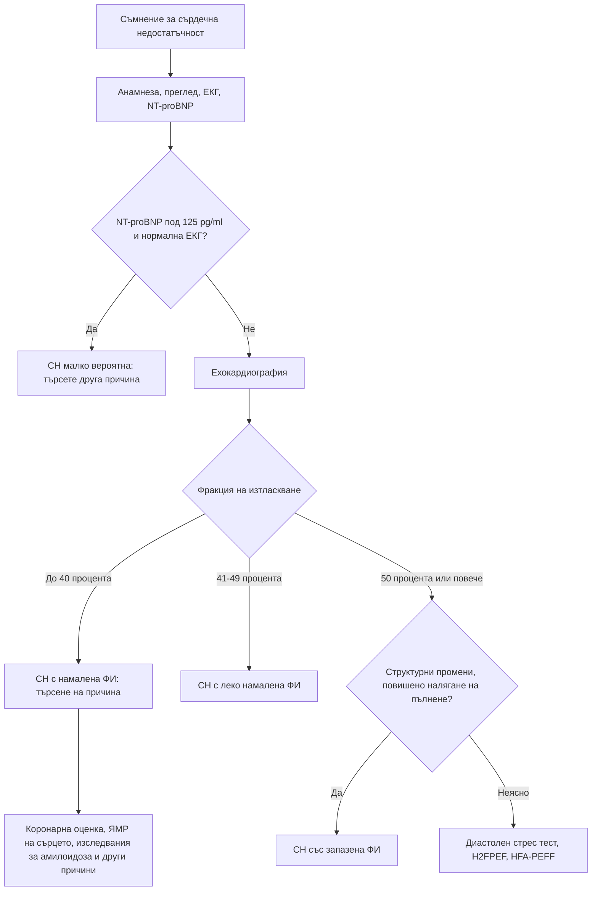

# Глава 13. Сърдечни шумове и сърдечна недостатъчност

> **Част III. Сърдечно-съдова система**

## Цели на главата

- Да се разграничават невинните от патологичните сърдечни шумове.
- Да се разпознават аускултаторните белези на основните клапни пороци и да се използват динамичните маневри.
- Да се подозира инфекциозен ендокардит.
- Да се поставя диагнозата сърдечна недостатъчност чрез NT-proBNP и ехокардиография и да се търси нейната причина.
- Да се разграничава сърдечната недостатъчност от състоянията, които я имитират.

---

## А. СЪРДЕЧНИ ШУМОВЕ

## 1. Невинни и патологични шумове

**Невинните (функционални) шумове** са много чести при деца, при бременни, при треска, анемия и хипертиреоидизъм (състояния с висок сърдечен дебит). Те имат следните белези:

- систолни (ранни до средносистолни);
- тихи (степен 1–2/6), без изтръпване;
- нормален втори тон;
- променят се с положението на тялото;
- липсват симптоми, а ЕКГ е нормална.

Специален вид невинен шум е **венозното бучене** при деца. То е непрекъснато, чува се под ключицата и изчезва в легнало положение или при натиск върху югуларната вена.

**Белези на патологичен шум:**

- **всеки диастолен шум**;
- холосистолен (пансистолен) шум;
- степен ≥ 3/6 или палпаторно изтръпване (*thrill*);
- отклонение във втория тон: фиксирано разцепване (дефект на междупредсърдната преграда), тих или липсващ аортен компонент (тежка аортна стеноза);
- допълнителни тонове или щракване;
- симптоми: задух, болка в гърдите, синкоп, изморяемост;
- отклонения в ЕКГ или рентгенографията, цианоза.

**Степенуване по Levine:**

| Степен | Описание |
|---|---|
| 1/6 | Едва доловим, чува се с усилие |
| 2/6 | Тих, но веднага доловим |
| 3/6 | Умерено силен, без изтръпване |
| 4/6 | Силен, с палпаторно изтръпване |
| 5/6 | Чува се, когато стетоскопът едва докосва гръдния кош |
| 6/6 | Чува се без допир на стетоскопа |

## 2. Систолни шумове

| Заболяване | Локализация и характер | Ирадиация | Съпътстващи белези |
|---|---|---|---|
| **Аортна стеноза** | II междуребрие вдясно, ромбовиден (крешендо-декрешендо) | Към каротидите | Бавно покачващ се пулс с малка амплитуда, тих или липсващ аортен компонент на втория тон; при тежка стеноза пикът на шума е късен. Класическа триада: **стенокардия, синкоп при усилие, сърдечна недостатъчност** |
| **Аортна склероза** | Както при аортна стеноза, тих | Не се разпространява значимо | Нормален пулс и нормален втори тон. Без хемодинамично значение, но е маркер за атеросклероза |
| **Хипертрофична обструктивна кардиомиопатия** | Долу по левия ръб на гръдната кост | Не към каротидите | **Засилва се при маневрата на Valsalva и при изправяне, отслабва при клякане**; фамилна анамнеза за внезапна смърт |
| **Митрална регургитация** | Върхов, холосистолен | Към лявата аксила | Тих първи тон, трети тон. Остра регургитация (скъсан папиларен мускул след инфаркт, ендокардит) води до остър белодробен оток |
| **Пролапс на митралната клапа** | Върхов | — | Средносистолно щракване и късносистолен шум; при изправяне щракването настъпва по-рано |
| **Трикуспидална регургитация** | Долу по левия ръб на гръдната кост | — | **Засилва се при вдишване** (белег на Carvallo); големи v-вълни в югуларната вена, пулсиращ черен дроб |
| **Дефект на междукамерната преграда** | Долу по левия ръб на гръдната кост, груб, холосистолен | Към дясно | Изтръпване. Остра руптура на преградата след инфаркт протича с шок |
| **Дефект на междупредсърдната преграда** | Горе по левия ръб на гръдната кост (шум от повишен кръвоток през белодробната клапа) | — | **Фиксирано разцепване на втория тон** |
| **Пулмонална стеноза** | II междуребрие вляво | — | Систолно щракване при изтласкването |

## 3. Диастолни и непрекъснати шумове

| Заболяване | Характер | Съпътстващи белези | Причини |
|---|---|---|---|
| **Аортна регургитация** | Ранен диастолен, декрешендо, по левия ръб на гръдната кост; чува се най-добре при наведен напред пациент в издишване | Голямо пулсово налягане, „подскачащ“ пулс (на Corrigan), шум на Austin Flint | Двукуспидна клапа, дилатация на аортния корен (хипертония, синдром на Marfan, **дисекация**), ендокардит, ревматична болест, анкилозиращ спондилит, сифилитичен аортит |
| **Митрална стеноза** | Средно-диастолен, нискочестотен, „ръмжащ“, на върха; чува се най-добре в ляво странично положение | Силен първи тон, щракване при отваряне на клапата, предсърдно мъждене, емболии, хемоптиза | Ревматична болест (при възрастни хора и мигранти), калцификация на митралния пръстен |
| **Пулмонална регургитация** | Ранен диастолен (шум на Graham Steell) | Белодробна хипертония | — |
| **Отворен артериален канал** | Непрекъснат, „машинен“ | — | Вроден |

## 4. Динамични маневри

| Маневра | Засилва | Отслабва |
|---|---|---|
| Вдишване | Шумовете от дясното сърце (трикуспидална регургитация, пулмонална стеноза) | — |
| Маневра на Valsalva, изправяне | **Хипертрофична кардиомиопатия, пролапс на митралната клапа** | Повечето други шумове |
| Клякане, повдигане на краката | Повечето шумове, включително аортната стеноза | Хипертрофичната кардиомиопатия |
| Изометрично стискане с ръка | Митралната регургитация, аортната регургитация, дефекта на междукамерната преграда | Аортната стеноза, хипертрофичната кардиомиопатия |

## 5. Кога е нужна ехокардиография

- Всеки диастолен шум.
- Систолен шум ≥ 3/6 или холосистолен шум.
- Шум при симптоми (задух, стенокардия, синкоп) или при отклонена ЕКГ.
- Шум при треска (подозрение за ендокардит).
- Възрастен човек със систолен шум и симптоми (подозрение за аортна стеноза).
- Бременна с шум, който няма всички белези на невинен шум.

## 6. Инфекциозен ендокардит

**Кога да се подозира:** треска с нов или променен шум; треска при пациент с клапна протеза, прекаран ендокардит, вродено сърдечно заболяване, пейсмейкър, интравенозна употреба на наркотици; емболични събития (инсулт, исхемия на крайник, инфаркт на слезката или бъбрека); бактериемия със *Staphylococcus aureus*, стрептококи от групата *viridans* или ентерококи.

**Модифицираните критерии на Duke** (последно обновени през 2023 г.) включват:

- **големи критерии:**
  - типични микроорганизми в две отделни хемокултури;
  - образни данни за ендокардно засягане: вегетация, абсцес или нова клапна регургитация при ехокардиография; при съмнение за ендокардит на протеза и чрез ПЕТ/КТ или сърдечна КТ;
- **малки критерии:**
  - предразполагащо сърдечно заболяване или интравенозна употреба на наркотици;
  - треска ≥ 38 °C;
  - съдови феномени: емболии, микотична аневризма, интракраниален кръвоизлив, конюнктивални кръвоизливи, лезии на Janeway;
  - имунологични феномени: гломерулонефрит, възли на Osler, петна на Roth, положителен ревматоиден фактор;
  - микробиологични данни, които не отговарят на голям критерий.

Ендокардитът е **сигурен** при два големи критерия, при един голям и три малки или при пет малки критерия. Хемокултурите (три серии от отделни венепункции) **задължително се вземат преди антибиотика**.

---

## Б. СЪРДЕЧНА НЕДОСТАТЪЧНОСТ

## 7. Определение и класификация

Сърдечната недостатъчност (СН) е клиничен синдром. Симптомите и признаците ѝ се дължат на структурно или функционално сърдечно нарушение и се потвърждават от повишени натриуретични пептиди и/или от обективни данни за белодробен или системен застой.

| Вид | Фракция на изтласкване на лявата камера |
|---|---|
| СН с намалена фракция на изтласкване | ≤ 40% |
| СН с леко намалена фракция на изтласкване | 41–49% |
| СН със запазена фракция на изтласкване | ≥ 50% (с данни за структурно или функционално нарушение и повишено налягане на пълнене) |

## 8. Клинична картина

- **Симптоми:** задух при усилие, **ортопнея**, **пароксизмален нощен задух**, умора, отоци, нощна кашлица, никтурия, загуба на апетит. При възрастни хора: объркване.
- **Признаци:** повишено югуларно венозно налягане, хепатоюгуларен рефлукс, **трети тон**, изместен сърдечен връх, крепитации в белите дробове, плеврален излив, двустранни отоци, хепатомегалия, асцит, тахикардия.
- **Специфичните** белези (повишено югуларно венозно налягане, трети тон, изместен връх) са сравнително нечувствителни. Неспецифичните (отоци, крепитации) са чести и при други заболявания.

## 9. Диагностичен подход

1. **Клинично подозрение.**
2. **ЕКГ.** Напълно нормалната ЕКГ прави СН малко вероятна, особено със снижена фракция на изтласкване.
3. **Натриуретични пептиди:**

| Условия | Праг, под който СН е малко вероятна |
|---|---|
| Хронични (неостри) симптоми | NT-proBNP < 125 pg/ml или BNP < 35 pg/ml |
| Остри симптоми | NT-proBNP < 300 pg/ml или BNP < 100 pg/ml |

   Британските препоръки (NICE) дават ориентир за спешността: при NT-proBNP над 2000 pg/ml ехокардиографията и оценката от специалист трябва да се направят до 2 седмици, а при 400–2000 pg/ml до 6 седмици.

4. **Ехокардиография.** Тя потвърждава диагнозата, определя вида на СН и често нейната причина.

**Фактори, които променят NT-proBNP:**

- **повишават** го: възраст, предсърдно мъждене, хронично бъбречно заболяване, белодробна тромбемболия, белодробна хипертония, сепсис, ОКС, клапни пороци;
- **понижават** го: **затлъстяване** (опасност от фалшиво отрицателен резултат), лечение с диуретици, АСЕ инхибитори и сартани. Сакубитрил повишава BNP, но не и NT-proBNP.

## 10. Причини за сърдечна недостатъчност

| Група | Причини |
|---|---|
| **Исхемична болест на сърцето** | Най-честата причина |
| **Артериална хипертония** | Особено при СН със запазена фракция на изтласкване |
| **Клапни пороци** | Аортна стеноза, митрална регургитация |
| **Кардиомиопатии** | **Дилатативна** (генетична, алкохолна, след химиотерапия с антрациклини или трастузумаб, след миокардит, перипартална, индуцирана от тахикардия); **хипертрофична**; **рестриктивна и инфилтративна** — **транстиретинова амилоидоза** при възрастни (двустранен синдром на карпалния тунел, стеноза на гръбначния канал, спонтанна руптура на сухожилието на бицепса, нисък волтаж в ЕКГ при задебелени стени на ехокардиография), саркоидоза, хемохроматоза |
| **Аритмии** | Предсърдно мъждене, продължителни тахикардии, брадикардия |
| **Перикардни заболявания** | Констриктивен перикардит |
| **Състояния с висок сърдечен дебит** | Анемия, тиреотоксикоза, артериовенозни фистули, болест на Paget, дефицит на тиамин, сепсис |
| **Лекарства и токсини** | Алкохол, кокаин, химиотерапевтици; влошават съществуваща СН: НСПВС, глитазони, верапамил и дилтиазем (при намалена фракция на изтласкване), някои антиаритмични средства |
| **Вродени сърдечни заболявания** | При възрастни хора с оперирани или неоперирани вродени дефекти |

## 11. Фактори, провокиращи декомпенсация

- Неспазване на лечението, прекомерен прием на сол и течности.
- Инфекция (пневмония, грип).
- Исхемия, ОКС.
- Аритмия (особено новопоявило се предсърдно мъждене).
- Неконтролирана хипертония.
- **НСПВС** и други лекарства.
- Влошаване на бъбречната функция, анемия, заболяване на щитовидната жлеза, белодробна тромбемболия, алкохол.

## 12. Диференциална диагноза на сърдечната недостатъчност

| Състояние | Как се разграничава |
|---|---|
| ХОББ и астма | Анамнеза за тютюнопушене или атопия, спирометрия; двете често съжителстват със СН |
| Затлъстяване и детренираност | Нормален NT-proBNP (при затлъстяване той може да е фалшиво нисък) и нормална ехокардиография |
| Анемия | ПКК |
| Хронично бъбречно заболяване с хиперхидратация | Креатинин, eGFR |
| Нефрозен синдром, цироза | Протеинурия, хипоалбуминемия, чернодробни белези (глава 8) |
| Венозна недостатъчност, лекарствени отоци | Нормално югуларно венозно налягане, нормален NT-proBNP |
| Белодробна хипертония, интерстициални белодробни болести | Ехокардиография, КТ с висока разделителна способност, дифузионен капацитет |
| Белодробна тромбемболия | Остро начало, рискови фактори, D-димер, КТ-ангиография |
| Депресия, тревожност | Диагноза след изключване на органичните причини |

### 12.1. СН със запазена фракция на изтласкване

Диагнозата е по-трудна. Типичният пациент е възрастна жена с хипертония, затлъстяване, диабет и предсърдно мъждене. Помагат точковите сборове H₂FPEF и HFA-PEFF и **диастолният стрес тест**. Точковият сбор H₂FPEF включва:

| Критерий | Точки |
|---|---|
| **H**eavy — ИТМ > 30 kg/m² | 2 |
| **H**ypertensive — ≥ 2 антихипертензивни средства | 1 |
| **F** — предсърдно мъждене | 3 |
| **P** — белодробна хипертония (систолно налягане в белодробната артерия > 35 mmHg при ехокардиография) | 1 |
| **E**lder — възраст > 60 години | 1 |
| **F**illing pressure — съотношение E/e' > 9 | 1 |

Сбор ≥ 6 означава висока вероятност за СН със запазена фракция на изтласкване.

---

## 13. Диагностичен алгоритъм

---

## 14. Клинични перли

- Всеки диастолен шум е патологичен.
- Систолен шум и синкоп при усилие у възрастен човек: тежка аортна стеноза. Диагнозата „аортна склероза“, поставена преди години, трябва да се преосмисли, защото склерозата прогресира до стеноза.
- Шум, който се засилва при изправяне и при маневрата на Valsalva, насочва към хипертрофична кардиомиопатия. Тя е важна причина за внезапна смърт при млади спортисти.
- Треска и шум: три хемокултури **преди** антибиотика.
- При пациент със затлъстяване нормалният NT-proBNP не изключва напълно СН.
- Възрастен мъж със СН със запазена фракция на изтласкване, двустранен синдром на карпалния тунел и нисък волтаж в ЕКГ: помислете за транстиретинова сърдечна амилоидоза. Тя вече има специфично лечение.
- Задухът при възрастен човек често има няколко причини едновременно (СН, ХОББ, анемия, детренираност).

---

## 15. Клиничен случай

**Случай.** Мъж на 79 години има задух при изкачване на един етаж и два епизода на прималяване при бързо ходене. Преди шест години е регистриран систолен шум, определен като „аортна склероза“. При прегледа: АН 118/82 mmHg, пулсът се покачва бавно и е с малка амплитуда, има груб систолен шум 3/6 с пик в късната систола над II междуребрие вдясно, който се разпространява към каротидите. Вторият тон е тих. ЕКГ: левокамерна хипертрофия с промени в реполяризацията.

**Въпроси.** 1) Коя е най-вероятната диагноза? 2) Кои белези говорят за тежест?

**Обсъждане.** Задухът и пресинкопът при усилие, бавно покачващият се пулс с малка амплитуда, късният пик на шума и тихият втори тон са признаци на **тежка аортна стеноза**. Аортната склероза прогресира до стеноза при част от пациентите. Появата на симптоми (стенокардия, синкоп, сърдечна недостатъчност) при тежка стеноза рязко влошава прогнозата. Ехокардиографията показва среден градиент 52 mmHg и площ на отвора 0,7 cm². Пациентът е насочен спешно към кардиолог. Сърдечният екип решава да се извърши транскатетърна имплантация на аортна клапа.

**Поука.** Пациентът със систолен шум трябва да бъде преоценен при поява на симптоми. Диагнозата, поставена преди години, не бива да се приема за даденост.
