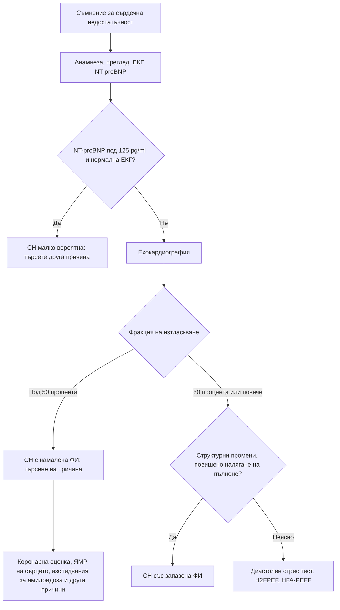

# Глава 13. Сърдечни шумове и сърдечна недостатъчност

> **Част III. Сърдечно-съдова система**

## Цели на главата

- Да се разграничават невинните от патологичните сърдечни шумове.
- Да се разпознават аускултаторните белези на основните клапни пороци и да се използват динамичните маневри.
- Да се разпознават белезите, при които се подозира инфекциозен ендокардит, и да се прилагат критериите на Duke.
- Да се поставя диагнозата сърдечна недостатъчност чрез NT-proBNP и ехокардиография и да се търси нейната причина.
- Да се разграничава сърдечната недостатъчност от състоянията, които я имитират.

## Ключови моменти

- Ехокардиография е нужна при всеки диастолен шум, при холосистолен шум или шум със степен 3/6 и повече и при шум със симптоми, треска или отклонена ЕКГ *(SORT C [2])*.
- Шумът на хипертрофичната обструктивна кардиомиопатия се засилва при маневрата на Valsalva и при изправяне и отслабва при клякане *(SORT B [1])*.
- При треска с нов шум се подозира инфекциозен ендокардит. Три серии хемокултури се вземат преди антибиотика, а диагнозата се поставя по критериите Duke-ISCVID *(SORT C [3, 4])*.
- СН се потвърждава с натриуретични пептиди и ехокардиография. Нормален NT-proBNP (под 125 pg/ml при хронични симптоми) и нормална ЕКГ я правят малко вероятна *(SORT B [7, 8])*.
- По ESC от 2026 г. СН е с намалена ФИ (под 50%) или със запазена ФИ (50% и повече); категорията „леко намалена ФИ“ е премахната [6].
- Затлъстяването понижава NT-proBNP. Възрастен мъж със СН, двустранен синдром на карпалния тунел и нисък волтаж в ЕКГ може да има транстиретинова амилоидоза *(SORT C [9, 10])*.

---

## А. Сърдечни шумове

### 1. Невинни и патологични шумове

**Невинните (функционални) шумове** са много чести при деца, при бременни, при треска, анемия и хипертиреоидизъм (състояния с висок сърдечен дебит). Те имат следните белези:

- систолни (ранни до средносистолни);
- тихи (степен 1–2/6), без изтръпване;
- нормален втори тон;
- променят се с положението на тялото;
- липсват симптоми, а ЕКГ е нормална.

Специален вид невинен шум е **венозното бучене** при деца. То е непрекъснато, чува се под ключицата и изчезва в легнало положение или при натиск върху югуларната вена.

**Белези на патологичен шум:**

- **всеки диастолен шум**;
- холосистолен (пансистолен) шум;
- степен ≥ 3/6 или палпаторно изтръпване (*thrill*);
- отклонение във втория тон: фиксирано разцепване (дефект на междупредсърдната преграда), тих или липсващ аортен компонент (тежка аортна стеноза);
- допълнителни тонове или щракване;
- симптоми: задух, болка в гърдите, синкоп, изморяемост;
- отклонения в ЕКГ или рентгенографията, цианоза.

*Таблица 13.1. Степенуване на сърдечните шумове по Levine.*

| Степен | Описание |
|---|---|
| 1/6 | Едва доловим, чува се с усилие |
| 2/6 | Тих, но веднага доловим |
| 3/6 | Умерено силен, без изтръпване |
| 4/6 | Силен, с палпаторно изтръпване |
| 5/6 | Чува се, когато стетоскопът едва докосва гръдния кош |
| 6/6 | Чува се без допир на стетоскопа |

### 2. Систолни шумове

*Таблица 13.2. Систолни шумове.*

| Заболяване | Локализация и характер | Ирадиация | Съпътстващи белези |
|---|---|---|---|
| **Аортна стеноза** | II междуребрие вдясно, ромбовиден (крешендо-декрешендо) | Към каротидите | Бавно покачващ се пулс с малка амплитуда, тих или липсващ аортен компонент на втория тон; при тежка стеноза пикът на шума е късен. Класическа триада: стенокардия, синкоп при усилие, сърдечна недостатъчност |
| **Аортна склероза** | Както при аортна стеноза, тих | Не се разпространява значимо | Нормален пулс и нормален втори тон. Без хемодинамично значение, но е маркер за атеросклероза |
| **Хипертрофична обструктивна кардиомиопатия** | Долу по левия ръб на гръдната кост | Не към каротидите | Засилва се при маневрата на Valsalva и при изправяне, отслабва при клякане; фамилна анамнеза за внезапна смърт |
| **Митрална регургитация** | Върхов, холосистолен | Към лявата аксила | Тих първи тон, трети тон. Остра регургитация (скъсан папиларен мускул след инфаркт, ендокардит) води до остър белодробен оток |
| **Пролапс на митралната клапа** | Върхов | – | Средносистолно щракване и късносистолен шум; при изправяне щракването настъпва по-рано |
| **Трикуспидална регургитация** | Долу по левия ръб на гръдната кост | – | Засилва се при вдишване (белег на Carvallo); големи v-вълни в югуларната вена, пулсиращ черен дроб |
| **Дефект на междукамерната преграда** | Долу по левия ръб на гръдната кост, груб, холосистолен | Към дясно | Изтръпване. Остра руптура на преградата след инфаркт протича с шок |
| **Дефект на междупредсърдната преграда** | Горе по левия ръб на гръдната кост (шум от повишен кръвоток през белодробната клапа) | – | **Фиксирано разцепване на втория тон** |
| **Пулмонална стеноза** | II междуребрие вляво | – | Систолно щракване при изтласкването |

### 3. Диастолни и непрекъснати шумове

*Таблица 13.3. Диастолни и непрекъснати шумове.*

| Заболяване | Характер | Съпътстващи белези | Причини |
|---|---|---|---|
| **Аортна регургитация** | Ранен диастолен, декрешендо, по левия ръб на гръдната кост; чува се най-добре при наведен напред пациент в издишване | Голямо пулсово налягане, „подскачащ“ пулс (на Corrigan), шум на Austin Flint | Двукуспидна клапа, дилатация на аортния корен (хипертония, синдром на Marfan, дисекация), ендокардит, ревматична болест, анкилозиращ спондилит, сифилитичен аортит |
| **Митрална стеноза** | Средно-диастолен, нискочестотен, „ръмжащ“, на върха; чува се най-добре в ляво странично положение | Силен първи тон, щракване при отваряне на клапата, предсърдно мъждене, емболии, хемоптиза | Ревматична болест (при възрастни хора и мигранти), калцификация на митралния пръстен |
| **Пулмонална регургитация** | Ранен диастолен (шум на Graham Steell) | Белодробна хипертония | – |
| **Отворен артериален канал** | Непрекъснат, „машинен“ | – | Вроден |

### 4. Динамични маневри

Динамичните маневри повишават точността на аускултацията при систолен шум [1].

*Таблица 13.4. Динамични маневри при сърдечни шумове.*

| Маневра | Засилва | Отслабва |
|---|---|---|
| Вдишване | Шумовете от дясното сърце (трикуспидална регургитация, пулмонална стеноза) | – |
| Маневра на Valsalva, изправяне | **Хипертрофична кардиомиопатия, пролапс на митралната клапа** | Повечето други шумове |
| Клякане, повдигане на краката | Повечето шумове, включително аортната стеноза | Хипертрофичната кардиомиопатия |
| Изометрично стискане с ръка | Митралната регургитация, аортната регургитация, дефекта на междукамерната преграда | Аортната стеноза, хипертрофичната кардиомиопатия |

### 5. Кога е нужна ехокардиография

Ехокардиографията е показана при [2]:

- Всеки диастолен шум.
- Систолен шум ≥ 3/6 или холосистолен шум.
- Шум при симптоми (задух, стенокардия, синкоп) или при отклонена ЕКГ.
- Шум при треска (подозрение за ендокардит).
- Възрастен човек със систолен шум и симптоми (подозрение за аортна стеноза).
- Бременна с шум, който няма всички белези на невинен шум.

### 6. Инфекциозен ендокардит

**Кога да се подозира:** треска с нов или променен шум; треска при пациент с клапна протеза, прекаран ендокардит, вродено сърдечно заболяване, пейсмейкър, интравенозна употреба на наркотици; емболични събития (инсулт, исхемия на крайник, инфаркт на слезката или бъбрека); бактериемия със *Staphylococcus aureus*, стрептококи от групата *viridans* или ентерококи.

**Модифицираните критерии на Duke** (последно обновени през 2023 г. като критерии Duke-ISCVID) включват [3]:

- **големи критерии:**
  - типични микроорганизми в две отделни хемокултури;
  - образни данни за ендокардно засягане: вегетация, абсцес или нова клапна регургитация при ехокардиография; при съмнение за ендокардит на протеза и чрез ПЕТ/КТ или сърдечна КТ;
- **малки критерии:**
  - предразполагащо сърдечно заболяване или интравенозна употреба на наркотици;
  - треска ≥ 38 °C;
  - съдови феномени: емболии, микотична аневризма, интракраниален кръвоизлив, конюнктивални кръвоизливи, лезии на Janeway;
  - имунологични феномени: гломерулонефрит, възли на Osler, петна на Roth, положителен ревматоиден фактор;
  - микробиологични данни, които не отговарят на голям критерий.

Ендокардитът е сигурен при два големи критерия, при един голям и три малки или при пет малки критерия. Хемокултурите (три серии от отделни венепункции) задължително се вземат преди антибиотика [4].

---

## Б. Сърдечна недостатъчност

### 7. Определение и класификация

Сърдечната недостатъчност (СН) е клиничен синдром с различни причини. Той се характеризира с типични симптоми и признаци и с лабораторни или образни данни за белодробен или системен застой или за променен сърдечен дебит, които се дължат на структурно или функционално сърдечно нарушение [5].

*Таблица 13.5. Сърдечна недостатъчност: определение и класификация.*

| Вид | Фракция на изтласкване на лявата камера (ФИ) |
|---|---|
| СН с намалена ФИ | < 50% |
| СН със запазена ФИ | ≥ 50% (с данни за структурно или функционално нарушение и повишено налягане на пълнене) |
| СН с подобрена ФИ | Предишна намалена ФИ, която се е повишила |

Препоръките на ESC от 2026 г. премахват категорията „СН с леко намалена ФИ“ (41–49%). Тези пациенти вече се включват в СН с намалена ФИ [6]. Второто универсално определение на СН (2026 г.) също се отказва от твърдите прагове и посочва, че долната граница на нормалната ФИ е около 53% при жените и 52% при мъжете [5].

### 8. Клинична картина

- **Симптоми:** задух при усилие, ортопнея, пароксизмален нощен задух, умора, отоци, нощна кашлица, никтурия, загуба на апетит. При възрастни хора: объркване.
- **Признаци:** повишено югуларно венозно налягане, хепатоюгуларен рефлукс, **трети тон**, изместен сърдечен връх, крепитации в белите дробове, плеврален излив, двустранни отоци, хепатомегалия, асцит, тахикардия.
- **Специфичните** белези (повишено югуларно венозно налягане, трети тон, изместен връх) са сравнително нечувствителни. Неспецифичните (отоци, крепитации) са чести и при други заболявания.

### 9. Диагностичен подход

1. **Клинично подозрение.**
2. **ЕКГ.** Напълно нормалната ЕКГ прави СН малко вероятна, особено със снижена фракция на изтласкване.
3. **Натриуретични пептиди** (прагове по ESC от 2021 г.) [7]:

*Таблица 13.6. Сърдечна недостатъчност: диагностичен подход.*

| Условия | Праг, под който СН е малко вероятна |
|---|---|
| Хронични (неостри) симптоми | NT-proBNP < 125 pg/ml или BNP < 35 pg/ml |
| Остри симптоми | NT-proBNP < 300 pg/ml или BNP < 100 pg/ml |

   Британските препоръки (NICE) дават ориентир за спешността: при NT-proBNP над 2000 pg/ml ехокардиографията и оценката от специалист трябва да се направят до 2 седмици, а при 400–2000 pg/ml до 6 седмици [8]. Стойностите се тълкуват според профила на пациента и клиничната ситуация [9].

4. **Ехокардиография.** Тя потвърждава диагнозата, определя вида на СН и често нейната причина.

**Фактори, които променят NT-proBNP:**

- **повишават** го: възраст, предсърдно мъждене, хронично бъбречно заболяване, белодробна тромбемболия, белодробна хипертония, сепсис, ОКС, клапни пороци;
- понижават го: затлъстяване (опасност от фалшиво отрицателен резултат), лечение с диуретици, АСЕ инхибитори и сартани. Сакубитрил повишава BNP, но не и NT-proBNP.

### 10. Причини за сърдечна недостатъчност

*Таблица 13.7. Причини за сърдечна недостатъчност.*

| Група | Причини |
|---|---|
| **Исхемична болест на сърцето** | Най-честата причина |
| **Артериална хипертония** | Особено при СН със запазена фракция на изтласкване |
| **Клапни пороци** | Аортна стеноза, митрална регургитация |
| **Кардиомиопатии** | Дилатативна (генетична, алкохолна, след химиотерапия с антрациклини или трастузумаб, след миокардит, перипартална, индуцирана от тахикардия); хипертрофична; рестриктивна и инфилтративна – транстиретинова амилоидоза при възрастни (двустранен синдром на карпалния тунел, стеноза на гръбначния канал, спонтанна руптура на сухожилието на бицепса, нисък волтаж в ЕКГ при задебелени стени на ехокардиография) [10], саркоидоза, хемохроматоза |
| **Аритмии** | Предсърдно мъждене, продължителни тахикардии, брадикардия |
| **Перикардни заболявания** | Констриктивен перикардит |
| **Състояния с висок сърдечен дебит** | Анемия, тиреотоксикоза, артериовенозни фистули, болест на Paget, дефицит на тиамин, сепсис |
| **Лекарства и токсини** | Алкохол, кокаин, химиотерапевтици; влошават съществуваща СН: НСПВС, глитазони, верапамил и дилтиазем (при намалена фракция на изтласкване), някои антиаритмични средства |
| **Вродени сърдечни заболявания** | При възрастни хора с оперирани или неоперирани вродени дефекти |

### 11. Фактори, провокиращи декомпенсация

- Неспазване на лечението, прекомерен прием на сол и течности.
- Инфекция (пневмония, грип).
- Исхемия, ОКС.
- Аритмия (особено новопоявило се предсърдно мъждене).
- Неконтролирана хипертония.
- **НСПВС** и други лекарства.
- Влошаване на бъбречната функция, анемия, заболяване на щитовидната жлеза, белодробна тромбемболия, алкохол.

### 12. Диференциална диагноза на сърдечната недостатъчност

*Таблица 13.8. Диференциална диагноза на сърдечната недостатъчност.*

| Състояние | Как се разграничава |
|---|---|
| ХОББ и астма | Анамнеза за тютюнопушене или атопия, спирометрия; двете често съжителстват със СН |
| Затлъстяване и детренираност | Нормален NT-proBNP (при затлъстяване той може да е фалшиво нисък) и нормална ехокардиография |
| Анемия | ПКК |
| Хронично бъбречно заболяване с хиперхидратация | Креатинин, eGFR |
| Нефрозен синдром, цироза | Протеинурия, хипоалбуминемия, чернодробни белези (глава 8) |
| Венозна недостатъчност, лекарствени отоци | Нормално югуларно венозно налягане, нормален NT-proBNP |
| Белодробна хипертония, интерстициални белодробни болести | Ехокардиография, КТ с висока разделителна способност, дифузионен капацитет |
| Белодробна тромбемболия | Остро начало, рискови фактори, D-димер, КТ-ангиография |
| Депресия, тревожност | Диагноза след изключване на органичните причини |

#### 12.1. СН със запазена фракция на изтласкване

Диагнозата е по-трудна. Типичният пациент е възрастна жена с хипертония, затлъстяване, диабет и предсърдно мъждене. Помагат точковите сборове H₂FPEF и HFA-PEFF и **диастолният стрес тест**. Точковият сбор H₂FPEF включва [11]:

*Таблица 13.9. СН със запазена фракция на изтласкване.*

| Критерий | Точки |
|---|---|
| **H**eavy – ИТМ > 30 kg/m² | 2 |
| **H**ypertensive – ≥ 2 антихипертензивни средства | 1 |
| **F** – предсърдно мъждене | 3 |
| **P** – белодробна хипертония (систолно налягане в белодробната артерия > 35 mmHg при ехокардиография) | 1 |
| **E**lder – възраст > 60 години | 1 |
| **F**illing pressure – съотношение E/e' > 9 | 1 |

Сбор ≥ 6 означава висока вероятност за СН със запазена фракция на изтласкване.

---

## 13. Безопасна диагностична стратегия

*Таблица 13.10. Безопасна диагностична стратегия.*

| Въпрос | Отговор |
|---|---|
| **Вероятна диагноза** | Невинен шум (деца, бременни, треска, анемия); аортна склероза при възрастни. СН: исхемична болест на сърцето, хипертония, предсърдно мъждене |
| **Сериозни заболявания, които не бива да се пропускат** | Тежка аортна стеноза; хипертрофична обструктивна кардиомиопатия; инфекциозен ендокардит; остра митрална регургитация или руптура на междукамерната преграда след инфаркт; аортна регургитация при дисекация. При задух: ОКС, остра декомпенсация на СН, тампонада, белодробна тромбемболия, миокардит |
| **Чести капани** | „Аортна склероза“, поставена преди години; шум при треска без хемокултури; СН със запазена ФИ при възрастна жена; фалшиво нисък NT-proBNP при затлъстяване; транстиретинова амилоидоза; анемия и тиреотоксикоза като причина за функционален шум или СН; НСПВС и глитазони |
| **Маскиращи заболявания** | Анемия, заболявания на щитовидната жлеза, ХОББ (съжителства със СН), хронично бъбречно заболяване, депресия |
| **Психосоциални аспекти** | Неспазване на лечението и на ограничението на солта; социална изолация; когнитивен дефицит при възрастни хора |

---

## 14. Диагностичен алгоритъм

*Фигура 13.1. Диагностичен алгоритъм: сърдечни шумове и сърдечна недостатъчност. Схема на авторите въз основа на източниците, цитирани в главата.*

Текстово описание на фигура 13.1

1. Съмнение за сърдечна недостатъчност. Следва: към т. 2.
2. Анамнеза, преглед, ЕКГ, NT-proBNP. Следва: към т. 3.
3. **Въпрос:** NT-proBNP под 125 pg/ml и нормална ЕКГ? Да – към т. 4; Не – към т. 5.
4. СН малко вероятна: търсете друга причина.
5. Ехокардиография. Следва: към т. 6.
6. **Въпрос:** Фракция на изтласкване Под 50 процента – към т. 7; 50 процента или повече – към т. 8.
7. СН с намалена ФИ: търсене на причина. Следва: към т. 9.
8. **Въпрос:** Структурни промени, повишено налягане на пълнене? Да – към т. 10; Неясно – към т. 11.
9. Коронарна оценка, ЯМР на сърцето, изследвания за амилоидоза и други причини.
10. СН със запазена ФИ.
11. Диастолен стрес тест, H2FPEF, HFA-PEFF.

---

## 15. Червени флагове и насочване

### 15.1. Червени флагове

- Шум със синкоп, пресинкоп или стенокардия при усилие (тежка аортна стеноза, хипертрофична кардиомиопатия).
- Треска с нов или променен шум, особено при клапна протеза, вродено сърдечно заболяване или интравенозна употреба на наркотици (ендокардит).
- Нов шум след инфаркт с остър белодробен оток или шок (руптура на папиларен мускул или на междукамерната преграда).
- Диастолен шум с болка в гърдите или гърба (дисекация на аортата с аортна регургитация).
- Задух в покой, ортопнея, SpO₂ под 90%, хипотония или объркване при СН (остра декомпенсация).
- Шум и синкоп при усилие или фамилна анамнеза за внезапна смърт при млад човек.

### 15.2. Кога и колко спешно да насочим

*Таблица 13.11. Кога и колко спешно да насочим.*

| Спешност | Клинична ситуация |
|---|---|
| **Незабавно (112 или спешно отделение)** | Остър белодробен оток, кардиогенен шок, остра декомпенсация на СН с хипоксемия; нов шум след инфаркт с нестабилност; подозрение за ендокардит с емболии или сепсис |
| **В същия ден** | Подозрение за инфекциозен ендокардит (хемокултури преди антибиотика, хоспитализация) [4]; симптоматична тежка аортна стеноза; шум и синкоп при усилие при млад човек |
| **Бързо (до 2 седмици)** | NT-proBNP над 2000 pg/ml – ехокардиография и специализирана оценка [8]; нов патологичен шум със симптоми |
| **Планово (до 6 седмици)** | NT-proBNP 400–2000 pg/ml – ехокардиография и специализирана оценка [8]; безсимптомен патологичен шум – ехокардиография |
| **Проследяване в общата практика** | Невинен шум при дете без симптоми; стабилна СН на оптимално лечение (преглед на теглото, симптомите, бъбречната функция и калия) |

---

## 16. Клинични перли

- Всеки диастолен шум е патологичен.
- Систолен шум и синкоп при усилие у възрастен човек: тежка аортна стеноза. Диагнозата „аортна склероза“, поставена преди години, трябва да се преосмисли, защото склерозата прогресира до стеноза.
- Шум, който се засилва при изправяне и при маневрата на Valsalva, насочва към хипертрофична кардиомиопатия. Тя е важна причина за внезапна смърт при млади спортисти.
- Треска и шум: три хемокултури **преди** антибиотика.
- При пациент със затлъстяване нормалният NT-proBNP не изключва напълно СН.
- Възрастен мъж със СН със запазена фракция на изтласкване, двустранен синдром на карпалния тунел и нисък волтаж в ЕКГ: помислете за транстиретинова сърдечна амилоидоза. Тя вече има специфично лечение.
- Задухът при възрастен човек често има няколко причини едновременно (СН, ХОББ, анемия, детренираност).

---

## 17. Клиничен случай

**Етап 1 – клинична картина.** Мъж на 79 години има задух при изкачване на един етаж и два епизода на прималяване при бързо ходене. Преди шест години е регистриран систолен шум, определен като „аортна склероза“.

> **Въпрос 1.** Защо старата диагноза не бива да се приема за даденост?

**Етап 2 – преглед и ЕКГ.** АН 118/82 mmHg. Пулсът се покачва бавно и е с малка амплитуда. Има груб систолен шум 3/6 с пик в късната систола над II междуребрие вдясно, който се разпространява към каротидите. Вторият тон е тих. ЕКГ показва левокамерна хипертрофия с промени в реполяризацията.

> **Въпрос 2.** Коя е най-вероятната диагноза и кои белези говорят за тежест?

> **Въпрос 3.** Какво е поведението?

Обсъждане и отговори

**Отговор 1.** Аортната склероза прогресира до стеноза при част от пациентите. Появата на задух и прималяване при усилие налага преоценка и ехокардиография.

**Отговор 2.** **Тежка аортна стеноза.** За тежест говорят симптомите при усилие, бавно покачващият се пулс с малка амплитуда, късният пик на шума и тихият втори тон. Ехокардиографията показва среден градиент 52 mmHg и площ на отвора 0,7 cm², което отговаря на тежка стеноза [12].

**Отговор 3.** Симптоматичната тежка аортна стеноза има лоша прогноза без лечение на клапата. Пациентът се насочва спешно към кардиолог. Сърдечният екип решава да се извърши транскатетърна имплантация на аортна клапа [12].

**Поука.** Пациентът със систолен шум трябва да бъде преоценен при поява на симптоми. Диагнозата, поставена преди години, не бива да се приема за даденост.

---

## Визуални примери

Учебникът не съдържа собствени изображения. Типичните находки могат да се видят в свободно достъпни атласи (връзките са проверени през септември 2026 г.):

- Кардиомегалия – [Radiology Masterclass](https://www.radiologymasterclass.co.uk/gallery/chest/cardiac_disease/cardiomegaly)
- Интерстициален белодробен оток (линии на Kerley B) – [Radiology Masterclass](https://www.radiologymasterclass.co.uk/gallery/chest/cardiac_disease/kerley_b_lines)
- Алвеоларен белодробен оток – [Radiology Masterclass](https://www.radiologymasterclass.co.uk/gallery/chest/cardiac_disease/pulmonary_oedema)
- Плеврални изливи при сърдечна недостатъчност – [Radiology Masterclass](https://www.radiologymasterclass.co.uk/gallery/chest/cardiac_disease/pleural_effusion)

---

## Обобщение

- Невинните шумове са систолни, тихи, с нормален втори тон и без симптоми. Всеки диастолен, холосистолен или силен шум и всеки шум със симптоми изисква ехокардиография.
- Динамичните маневри помагат за разграничаване на хипертрофичната кардиомиопатия и на шумовете от дясното сърце.
- Треската с нов шум е ендокардит до доказване на противното. Хемокултурите се вземат преди антибиотика.
- СН се диагностицира с натриуретични пептиди и ехокардиография. Според ФИ тя е с намалена, запазена или подобрена ФИ. Винаги се търсят причината, провокиращите фактори и имитаторите.

## Самопроверка

### Въпроси с един верен отговор

**1.** *(основно ниво)* Момче на 6 години има тих систолен шум 2/6 по левия ръб на гръдната кост, който се променя с положението на тялото. Вторият тон е нормален, детето е безсимптомно и расте нормално. Кое е най-подходящото поведение?

- **А.** Спешна ехокардиография
- **Б.** Успокояване на родителите – вероятно невинен шум
- **В.** Антибиотична профилактика преди стоматологични процедури
- **Г.** Задължителна ЕКГ и рентгенография
- **Д.** Спешно насочване към детски кардиолог

Отговор и обосновка

**Верен отговор: Б.** Систолният, тих шум с нормален втори тон, който се променя с положението, при безсимптомно дете има всички белези на невинен шум. А, Г и Д не са нужни без патологични белези [2]. В не е показана.

**2.** *(основно ниво)* Кой шум се засилва при маневрата на Valsalva?

- **А.** Аортна стеноза
- **Б.** Хипертрофична обструктивна кардиомиопатия
- **В.** Митрална регургитация
- **Г.** Дефект на междукамерната преграда
- **Д.** Аортна регургитация

Отговор и обосновка

**Верен отговор: Б.** Маневрата на Valsalva намалява венозното връщане и обема на лявата камера и засилва обструкцията при хипертрофична кардиомиопатия [1]. Шумовете при А, В, Г и Д обикновено отслабват.

**3.** *(основно ниво)* Жена на 70 години с нормално тегло има задух при усилие. NT-proBNP е 95 pg/ml, а ЕКГ е нормална. Какъв е изводът?

- **А.** Нужна е спешна ехокардиография
- **Б.** Показан е пробен диуретик
- **В.** СН е малко вероятна – търсете друга причина за задуха
- **Г.** Изследването трябва да се повтори след седмица
- **Д.** Нужно е насочване до 2 седмици

Отговор и обосновка

**Верен отговор: В.** NT-proBNP под 125 pg/ml при хронични симптоми и нормална ЕКГ правят СН малко вероятна [7, 8]. Трябва да се търсят други причини (ХОББ, анемия, детренираност). А и Д не са оправдани. Б е погрешно без диагноза. Г не е нужно.

**4.** *(напреднало ниво)* Мъж на 32 години, който употребява интравенозно наркотици, има треска 39 °C и нов холосистолен шум долу по левия ръб на гръдната кост, който се засилва при вдишване. Кое е най-правилното поведение?

- **А.** Амоксицилин и контрол след 3 дни
- **Б.** Три серии хемокултури от отделни венепункции преди антибиотика и спешна хоспитализация
- **В.** Планова ехокардиография след месец
- **Г.** CRP и при нормален резултат – без насочване
- **Д.** Антипиретик и наблюдение

Отговор и обосновка

**Верен отговор: Б.** Шумът на трикуспидална регургитация (засилва се при вдишване), треската и интравенозната употреба на наркотици насочват към ендокардит на трикуспидалната клапа. Хемокултурите се вземат преди антибиотика [4], а пациентът се хоспитализира. А може да направи хемокултурите отрицателни. В, Г и Д забавят диагнозата.

**5.** *(напреднало ниво)* Пациент със симптоми на СН има ФИ на лявата камера 45%. Как се класифицира по препоръките на ESC от 2026 г.?

- **А.** СН с леко намалена ФИ
- **Б.** СН с намалена ФИ
- **В.** СН със запазена ФИ
- **Г.** СН с подобрена ФИ
- **Д.** Не е СН

Отговор и обосновка

**Верен отговор: Б.** Препоръките на ESC от 2026 г. премахват категорията „леко намалена ФИ“ и определят СН с намалена ФИ при ФИ под 50% [6]. В изисква ФИ 50% и повече. Г изисква предишна намалена ФИ, която се е повишила. Д е погрешно при симптоми и намалена ФИ.

### Задача

Жена на 72 години има задух при усилие. ИТМ е 33 kg/m², приема два антихипертензивни медикамента и има пароксизмално предсърдно мъждене. При ехокардиография ФИ е 60%, систолното налягане в белодробната артерия е 38 mmHg, а съотношението E/e' е 11. Изчислете точковия сбор H₂FPEF и го тълкувайте.

Решение

ИТМ над 30 kg/m² – 2 точки; два антихипертензивни медикамента – 1; предсърдно мъждене – 3; систолно налягане в белодробната артерия над 35 mmHg – 1; възраст над 60 години – 1; E/e' над 9 – 1. Общо 9 точки. Сбор 6 и повече означава висока вероятност за СН със запазена ФИ [11]. Лечението включва контрол на хипертонията и на предсърдното мъждене, намаляване на теглото и лечение, съобразено с актуалните препоръки.

### OSCE станция: Аускултация на сърцето при систолен шум

**Време:** 8 минути. **Ниво:** основно (студенти, специализанти).

**Задача за кандидата.** Мъж на 78 години има систолен шум. Прегледайте сърдечно-съдовата система, опишете шума и предложете план.

**Информация за симулирания пациент (за изпитващия).** Има груб систолен шум 3/6 с максимум във II междуребрие вдясно, който се разпространява към каротидите. Пулсът се покачва бавно, а вторият тон е тих. Съобщава за задух при изкачване на един етаж.

*Таблица 13.12. OSCE станция „Аускултация на сърцето при систолен шум“ – критерии за оценяване.*

| Критерий | Точки |
|---|---|
| Представя се, иска съгласие и позиционира пациента под 45° | 1 |
| Палпира пулса (характер, честота) и сърдечния връх | 2 |
| Аускултира четирите клапни области и каротидите | 2 |
| Прилага маневри (ляво странично положение, наведен напред пациент в издишване, Valsalva) | 1 |
| Описва шума: систолен, ромбовиден, 3/6, максимум във II междуребрие вдясно, ирадиация към каротидите, тих втори тон | 2 |
| Посочва вероятната диагноза (аортна стеноза) и белезите за тежест | 2 |
| Предлага ехокардиография и насочване според симптомите | 1 |
| Обяснява на пациента на разбираем език | 1 |
| **Общо** | **12** |

**Праг за успешно изпълнение:** 8 от 12 точки, включително правилното описание на шума.

## Литература

1. Lembo NJ, Dell'Italia LJ, Crawford MH, O'Rourke RA. Bedside diagnosis of systolic murmurs. N Engl J Med. 1988;318(24):1572-8. doi:10.1056/NEJM198806163182404. PMID: 2897627.
2. Otto CM, Nishimura RA, Bonow RO, Carabello BA, Erwin JP 3rd, Gentile F, et al. 2020 ACC/AHA Guideline for the Management of Patients With Valvular Heart Disease: A Report of the American College of Cardiology/American Heart Association Joint Committee on Clinical Practice Guidelines. Circulation. 2021;143(5):e72-e227. doi:10.1161/CIR.0000000000000923. PMID: 33332150.
3. Fowler VG, Durack DT, Selton-Suty C, Athan E, Bayer AS, Chamis AL, et al. The 2023 Duke-International Society for Cardiovascular Infectious Diseases Criteria for Infective Endocarditis: Updating the Modified Duke Criteria. Clin Infect Dis. 2023;77(4):518-526. doi:10.1093/cid/ciad271. PMID: 37138445.
4. Delgado V, Ajmone Marsan N, de Waha S, Bonaros N, Brida M, Burri H, et al. 2023 ESC Guidelines for the management of endocarditis. Eur Heart J. 2023;44(39):3948-4042. doi:10.1093/eurheartj/ehad193. PMID: 37622656.
5. Walsh MN, Kober L, Sliwa K, Adamo M, Agarwal A, Banerjee A, et al. AHA/ACC/ESC/WHF Expert Consensus Document: Second Universal Definition of Heart Failure (2026). Glob Heart. 2026;21(1):51. doi:10.5334/gh.1569. PMID: 42403666.
6. Køber L, Adamo M, Ruwald AC, Tomasoni D, Anderson LJ, Andersson C, et al. 2026 ESC Guidelines for the management of heart failure. Eur Heart J. 2026:ehag100. doi:10.1093/eurheartj/ehag100. PMID: 42661420.
7. McDonagh TA, Metra M, Adamo M, Gardner RS, Baumbach A, Böhm M, et al. 2021 ESC Guidelines for the diagnosis and treatment of acute and chronic heart failure. Eur Heart J. 2021;42(36):3599-3726. doi:10.1093/eurheartj/ehab368. PMID: 34447992.
8. National Institute for Health and Care Excellence. Chronic heart failure in adults: diagnosis and management (NICE guideline NG106). London: NICE; 2018 [актуализирано 2025]. Достъпно на: https://www.nice.org.uk/guidance/ng106
9. Bayes-Genis A, Docherty KF, Petrie MC, Januzzi JL, Mueller C, Anderson L, et al. Practical algorithms for early diagnosis of heart failure and heart stress using NT-proBNP: A clinical consensus statement from the Heart Failure Association of the ESC. Eur J Heart Fail. 2023;25(11):1891-1898. doi:10.1002/ejhf.3036. PMID: 37712339.
10. Garcia-Pavia P, Rapezzi C, Adler Y, Arad M, Basso C, Brucato A, et al. Diagnosis and treatment of cardiac amyloidosis: a position statement of the ESC Working Group on Myocardial and Pericardial Diseases. Eur Heart J. 2021;42(16):1554-1568. doi:10.1093/eurheartj/ehab072. PMID: 33825853.
11. Reddy YNV, Carter RE, Obokata M, Redfield MM, Borlaug BA. A Simple, Evidence-Based Approach to Help Guide Diagnosis of Heart Failure With Preserved Ejection Fraction. Circulation. 2018;138(9):861-870. doi:10.1161/CIRCULATIONAHA.118.034646. PMID: 29792299.
12. Praz F, Borger MA, Lanz J, Marin-Cuartas M, Abreu A, Adamo M, et al. 2025 ESC/EACTS Guidelines for the management of valvular heart disease. Eur Heart J. 2025;46(44):4635-4736. doi:10.1093/eurheartj/ehaf194. PMID: 40878295.

*Последна проверка на съдържанието: септември 2026 г. Следващ планиран преглед: септември 2027 г. (вж. „Политика за актуализация“ в README).*

<!-- навигация -->

---

[← Глава 12. Артериална хипертония: първична срещу вторична](12-hipertonia.md) · [Съдържание](../README.md) · [Глава 14. Болка и оток на крайниците от съдов произход →](14-sadovi-bolki-kraynitsi.md)
