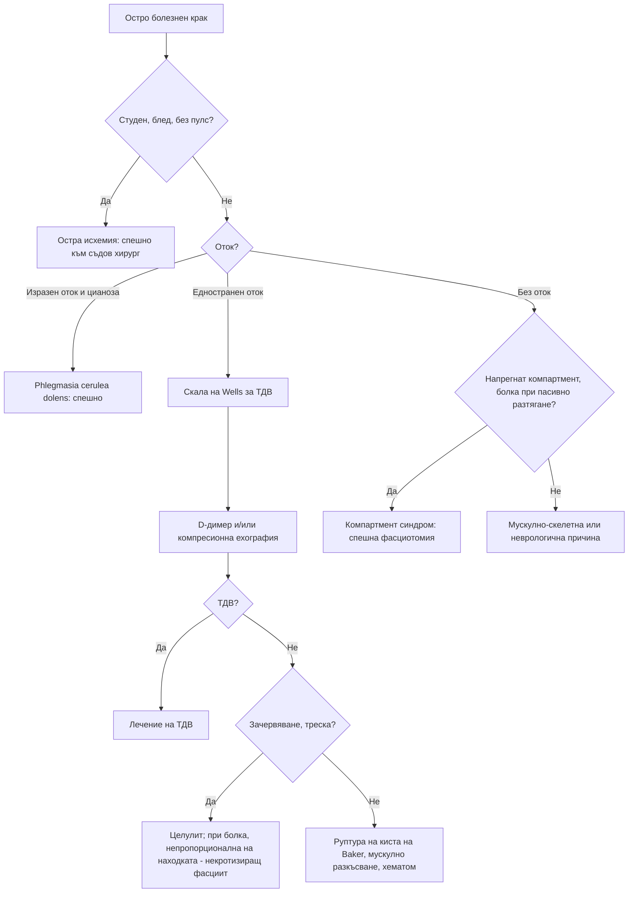

# Глава 14. Болка и оток на крайниците от съдов произход

> **Част III. Сърдечно-съдова система**

## Цели на главата

- Да се разграничава съдовата клаудикация от неврогенната и от другите причини за болка в краката при ходене.
- Да се разпознават спешните съдови състояния на крайниците: остра исхемия, масивна венозна тромбоза, компартмент синдром.
- Да се оценява вероятността за тромбоза на дълбоките вени и да се тълкуват D-димерът и компресионната ехография.
- Да се разграничава първичният от вторичния феномен на Raynaud.

---

## 1. Етиологична класификация

| Група | Заболявания |
|---|---|
| **Артериални — хронични** | Периферна артериална болест (атеросклероза); тромбангиит облитеранс (болест на Buerger); синдром на притискане на подколенната артерия (млади спортисти); кистозна болест на адвентицията; васкулити (артериит на Takayasu, гигантоклетъчен артериит — клаудикация на ръцете) |
| **Артериални — остри** | Емболия (предсърдно мъждене, тромб в лявата камера след инфаркт, ендокардит, аневризма); тромбоза на атеросклеротично стеснена артерия или на байпас; дисекация на аортата; тромбоза на аневризма на подколенната артерия; травма |
| **Атероемболия** | „Синдром на синия пръст“ след катетеризация или антикоагулация; ливедо, еозинофилия, остро бъбречно увреждане |
| **Венозни** | Тромбоза на дълбоките вени; повърхностен тромбофлебит; хронична венозна недостатъчност и варици; посттромботичен синдром; phlegmasia cerulea dolens; синдром на May-Thurner |
| **Лимфни** | Лимфедем (първичен и вторичен); лимфангит |
| **Вазоспастични и функционални** | Феномен на Raynaud; акроцианоза; еритромелалгия; перниоза (измръзвания от влажен студ) |
| **Други съдови** | Синдром на торакалния изход; синдром на подключичното обкрадване; калцифилаксия (при диализа); livedo racemosa (антифосфолипиден синдром, васкулити) |

---

## 2. Безопасна диагностична стратегия

| Въпрос | Отговор |
|---|---|
| **Вероятна диагноза** | Хронична венозна недостатъчност, периферна артериална болест, неврогенна клаудикация, мускулни крампи |
| **Сериозни заболявания, които не бива да се пропускат** | Остра исхемия на крайник; тромбоза на дълбоките вени и phlegmasia cerulea dolens; критична исхемия, застрашаваща крайника; компартмент синдром; некротизиращ фасциит; инфектирано диабетно стъпало; дисекация на аортата; аневризма на подколенната артерия |
| **Чести капани** | Неврогенна клаудикация, приета за съдова, и обратното; руптура на киста на Baker, приета за тромбоза (и обратното, двете могат да съжителстват); повърхностен тромбофлебит близо до сафенофеморалното съединение; вторичен феномен на Raynaud при системна склероза; атероемболия |
| **Маскиращи заболявания** | Захарен диабет (невропатия, маскираща исхемията), гръбначна дисфункция, лекарства (бета-блокери и ерготамин при Raynaud, статини при миалгии) |
| **Психосоциални аспекти** | Тютюнопушене (продължаването му след диагнозата), социална изолация на обездвижения пациент |

---

## 3. Клаудикация: съдова или неврогенна?

| Белег | Съдова (периферна артериална болест) | Неврогенна (стеноза на лумбалния гръбначен канал) |
|---|---|---|
| Локализация | Прасец (най-често), бедро, седалище | Седалище, бедро, подбедрица; често двустранно, с парестезии |
| Провокация | Ходене на **постоянно** разстояние; изкачване на наклон | Ходене на **различно** разстояние, **продължително стоене**; слизане по наклон (екстензия) |
| Облекчаване | **Спиране** за 2–5 минути, дори в изправено положение | **Сядане или навеждане напред** (флексия), нужни са повече минути; облекчава се при подпиране на пазарска количка |
| Колоездене | Предизвиква болка | Обикновено се понася (флексия) |
| Пулсации | Отслабени или липсващи | Нормални |
| Кожа | Бледа, студена, окосмяването оредяло | Нормална |
| Глезенно-брахиален индекс | ≤ 0,90 | Нормален |

**Други причини за болка в краката при ходене:**

- **венозна клаудикация** — пукаща болка в целия крак при прекарана илиофеморална тромбоза; облекчава се с повдигане на крака;
- коксартроза и гонартроза;
- хроничен компартмент синдром при спортисти;
- киста на Baker;
- периферна невропатия;
- мускулни заболявания, включително статинова миопатия.

---

## 4. Периферна артериална болест

- **Рискови фактори:** тютюнопушене (най-силният), диабет, хипертония, дислипидемия, възраст, хронично бъбречно заболяване.
- **Клинични стадии:**
  1. безсимптомна;
  2. интермитентна клаудикация;
  3. болка в покой — нощна, облекчава се при спускане на крака от леглото;
  4. язви и гангрена.

  Последните два стадия формират **хроничната исхемия, застрашаваща крайника**.
- **Глезенно-брахиален индекс:**
  - ≤ 0,90 — диагностичен за периферна артериална болест;
  - < 0,40 — тежка исхемия;
  - > 1,40 — неспособни да се компримират калцирани артерии (при диабет и хронично бъбречно заболяване). В този случай се измерва пръстово-брахиален индекс.
- Периферната артериална болест е **маркер за генерализирана атеросклероза**. Пациентите имат висок риск от инфаркт и инсулт.
- **Синдром на Leriche** (аортоилиачна оклузия): клаудикация на седалището и бедрата, еректилна дисфункция, липсващи феморални пулсации.
- **Болест на Buerger:** млади мъже (под 45 години), пушачи. Засяга дисталните артерии на ръцете и краката, протича с мигриращ тромбофлебит и дигитални язви.

---

## 5. Остра исхемия на крайника

**Спешно състояние.** Крайникът е застрашен и реваскуларизацията трябва да бъде извършена в рамките на часове.

Класическите белези се запомнят като **„шестте П“**:

1. **Болка** (*pain*) — внезапна, силна.
2. **Бледност** (*pallor*).
3. **Липса на пулс** (*pulselessness*).
4. **Парестезии** (*paraesthesia*).
5. **Парализа** (*paralysis*).
6. **Студенина** (*poikilothermia*).

Сетивният и двигателният дефицит са белези на застрашен крайник.

| Белег | Емболия | Тромбоза *in situ* |
|---|---|---|
| Източник | Предсърдно мъждене, скорошен инфаркт, аневризма | Предшестваща периферна артериална болест |
| Начало | Внезапно | По-постепенно |
| Анамнеза за клаудикация | Обикновено липсва | Често налице |
| Пулсации на другия крак | Нормални | Отслабени |

---

## 6. Тромбоза на дълбоките вени

### 6.1. Клинична картина и рискови фактори

- Едностранен оток, болка, болезненост по хода на дълбоките вени, затопляне, разширени повърхностни (неварикозни) вени.
- Рискови фактори: обездвижване, операция, травма, злокачествено заболяване, естрогени, бременност и следродилен период, прекарана тромбоза, тромбофилия, затлъстяване, дълги пътувания, централни катетри.
- **Симптомът на Homans няма диагностична стойност.**

### 6.2. Скала на Wells за тромбоза на дълбоките вени

| Критерий | Точки |
|---|---|
| Активно злокачествено заболяване | 1 |
| Парализа, пареза или скорошна гипсова имобилизация на долен крайник | 1 |
| Залежаване ≥ 3 дни или голяма операция през последните 12 седмици | 1 |
| Локализирана болезненост по хода на дълбоките вени | 1 |
| Оток на целия крак | 1 |
| Оток на подбедрицата ≥ 3 cm спрямо другата (10 cm под тибиалната тубероза) | 1 |
| Оток, оставящ ямка, само на засегнатия крак | 1 |
| Колатерални повърхностни вени (неварикозни) | 1 |
| Прекарана тромбоза на дълбоките вени | 1 |
| **Алтернативна диагноза поне толкова вероятна** | **−2** |

При **≥ 2 точки тромбозата е вероятна** и се прави компресионна ехография. Ако ехографията е отрицателна, се изследва D-димер. Ако и той е положителен, ехографията се повтаря след 6–8 дни. **При < 2 точки** се изследва D-димер. Отрицателният D-димер изключва тромбоза, а положителният налага ехография.

### 6.3. Специални форми

- **Phlegmasia cerulea dolens.** Масивна илиофеморална тромбоза с изразен оток, цианоза и болка, която застрашава артериалното кръвоснабдяване. Спешно състояние.
- **Тромбоза на вените на ръката.** При катетри, пейсмейкъри и злокачествени заболявания. След усилие при млади хора се развива синдромът на Paget-Schroetter.
- **Повърхностен тромбофлебит.** Болезнен, зачервен, уплътнен венозен шнур. Необходима е ехография, защото:
  - тромбофлебитът може да съжителства с тромбоза на дълбоките вени;
  - тромбоза на разстояние под 3 cm от сафенофеморалното съединение се лекува като тромбоза на дълбоките вени;
  - мигриращият тромбофлебит насочва към злокачествено заболяване (синдром на Trousseau), болест на Behçet или болест на Buerger.

---

## 7. Хронична венозна недостатъчност

- Симптоми: тежест, умора и оток на краката вечер, крампи, сърбеж.
- Белези: разширени вени, телеангиектазии, пигментация (хемосидерин), екзема, **липодерматосклероза** (индурация на долната трета на подбедрицата, която може да се сбърка с целулит), язви около медиалния малеол.
- Тежестта се оценява по класификацията CEAP (C0–C6).
- Двустранният „целулит“ почти винаги е венозен стазен дерматит. Истинският целулит обикновено е едностранен.

---

## 8. Феномен на Raynaud

Пристъпите протичат в три фази: побеляване (вазоспазъм), посиняване (цианоза) и зачервяване (реактивна хиперемия). Провокират се от студ и емоции.

| Белег | Първичен (болест на Raynaud) | Вторичен (синдром на Raynaud) |
|---|---|---|
| Възраст при началото | Под 30 години | Над 30–40 години |
| Пол | Предимно жени | Двата пола |
| Разпределение | Симетрично | Често асиметрично |
| Дигитални язви, некрози | Не | Възможни |
| Капиляроскопия на нокътното легло | Нормална | Патологична (дилатирани капиляри, кръвоизливи, обеднени зони) |
| Антинуклеарни антитела | Отрицателни | Често положителни |
| Причини | — | **Системна склероза** (антицентромерни антитела, анти-Scl-70), системен лупус еритематодес, синдром на Sjögren, дерматомиозит, вибрационна болест, лекарства (бета-блокери, ерготамин, химиотерапия), криоглобулинемия, синдром на торакалния изход, хипотиреоидизъм |

Феноменът на Raynaud често **предхожда с години** другите прояви на системната склероза.

---

## 9. Горен крайник

- **Синдром на торакалния изход.** Най-често е неврогенен (парестезии в областта на n. ulnaris). По-рядко е венозен (синдром на Paget-Schroetter) или артериален (шийно ребро, аневризма, дигитални емболии).
- **Синдром на подключичното обкрадване.** Клаудикация на ръката при работа, разлика в налягането между ръцете над 15–20 mmHg, понякога вертебробазиларни симптоми (световъртеж, диплопия) при движение на ръката.
- **Артериит на Takayasu** — млади жени, липсващи пулсации, шумове над артериите. **Гигантоклетъчният артериит** може да протича с клаудикация на ръцете при хора над 50 години.
- **Остра исхемия** на ръката — обикновено емболична.

---

## 10. Други състояния

- **Еритромелалгия** — пареща болка, зачервяване и затопляне на стъпалата и дланите, облекчаване от охлаждане. Вторичната форма се среща при есенциална тромбоцитемия и полицитемия вера.
- **Акроцианоза** — безболезнена, постоянна цианоза на дланите и стъпалата при млади жени, без трофични промени.
- **Livedo reticularis и livedo racemosa.** Физиологичното ливедо изчезва при затопляне. Патологичното (неправилно, „счупено“) насочва към антифосфолипиден синдром, васкулит, холестеролова емболия или криоглобулинемия.
- **Компартмент синдром** — болка, непропорционална на травмата, особено при пасивно разтягане на мускулите, напрегнат мускулен компартмент. Пулсациите се запазват до късно. Изисква спешна фасциотомия.

---

## 11. Изследвания

- **Глезенно-брахиален индекс** — основно изследване при съмнение за периферна артериална болест.
- **Доплерова ехография на артериите**, КТ или МР ангиография (преди реваскуларизация).
- **Компресионна ехография на вените**, D-димер.
- ЕКГ (предсърдно мъждене) и ехокардиография (източник на емболия).
- Капиляроскопия на нокътното легло, антинуклеарни антитела и специфичните за системна склероза антитела при феномен на Raynaud.
- ПКК, липиден профил, HbA1c, креатинин.

---

## 12. Диагностичен алгоритъм при остро болезнен крак

---

## 13. Клинични перли

- Палпирайте пулсациите на краката при всеки пациент с „ишиас“ или болка в прасеца при ходене.
- Облекчаване при стоене на място: съдова клаудикация. Нужда от сядане или навеждане: неврогенна клаудикация.
- Нормалният глезенно-брахиален индекс при диабетик не изключва исхемия, защото артериите може да са калцирани. Измерете пръстово-брахиален индекс.
- Остра болка в крака при пациент с предсърдно мъждене, който е спрял антикоагуланта: емболия, докато не се докаже противното.
- Феномен на Raynaud с начало след 30-годишна възраст, с дигитални язви или подпухнали пръсти: търсете системна склероза.
- Двустранният „целулит“ почти никога не е целулит.

---

## 14. Клиничен случай

**Случай.** Мъж на 66 години, пушач с 40 пакетогодини и диабет, е лекуван 3 месеца от „ишиас“ с НСПВС и мускулни релаксанти без ефект. Описва болка в десния прасец след ходене около 200 метра. Болката изчезва за 2–3 минути, когато спре, без да сяда. При изкачване на наклон разстоянието се скъсява. При прегледа: тестът на Lasègue е отрицателен, рефлексите са запазени, а кожата на дясното стъпало е бледа и студена, с оредяло окосмяване. Пулсациите на a. dorsalis pedis и a. tibialis posterior вдясно не се палпират. Глезенно-брахиалният индекс е 0,58 вдясно и 0,92 вляво.

**Въпроси.** 1) Каква е диагнозата? 2) Какво е значението ѝ за общия риск на пациента?

**Обсъждане.** Болката, появяваща се при постоянно разстояние и облекчавана от спиране в изправено положение, липсващите пулсации и ниският глезенно-брахиален индекс доказват **периферна артериална болест** с интермитентна клаудикация, а не неврогенна причина. Периферната артериална болест е маркер за генерализирана атеросклероза. Рискът от миокарден инфаркт и инсулт е висок. Необходими са спиране на тютюнопушенето, лечение със статин и антитромбоцитно средство, контрол на диабета и налягането и контролирана програма от ходене. Доплерова ехография се прави при планиране на реваскуларизация.

**Поука.** „Ишиасът“ без неврологични находки и с липсващи пулсации не е ишиас.
