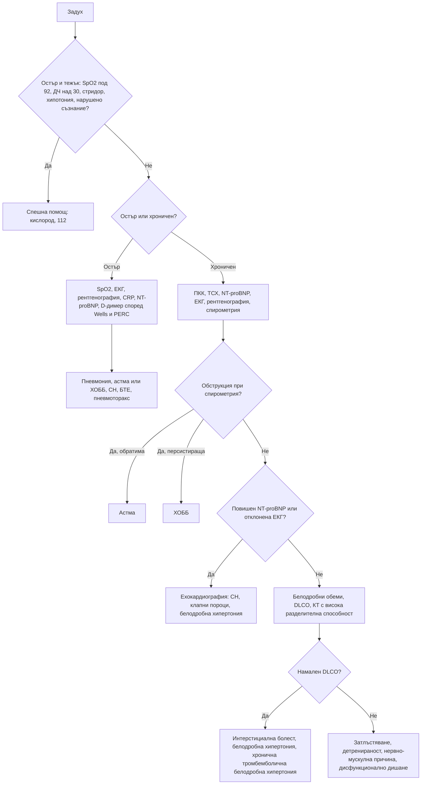

# Глава 15. Задух

> **Част IV. Дихателна система**

## Цели на главата

- Да се оценява бързо тежестта на острия задух и да се разпознават животозастрашаващите причини.
- Да се систематизират причините за хроничен задух според анатомичния и патофизиологичния механизъм.
- Да се използват насочващите белези от анамнезата и прегледа (ортопнея, платипнея, барабанни пръсти).
- Да се прилагат рационално спирометрията, NT-proBNP, D-димерът и образните изследвания.
- Да се разграничават астмата, ХОББ и сърдечната недостатъчност.

## Ключови моменти

- Първо се оценява тежестта: дихателна честота, SpO₂, способност за говорене, съзнание и хемодинамика. Кислородът се дозира с цел SpO₂ 94–98%, а при риск от хиперкапнична дихателна недостатъчност — 88–92% *(SORT C [7])*.
- Причините се систематизират по механизъм: горни и долни дихателни пътища, паренхим, белодробни съдове, плевра, сърце, гръдна стена, системни и психогенни.
- Задух с нормален аускултаторен статус и нормална рентгенография насочва към белодробна тромбемболия, анемия, метаболитна ацидоза, белодробна хипертония или нервно-мускулна слабост.
- Хроничният задух се изследва стъпаловидно: ПКК, ТСХ, NT-proBNP, ЕКГ, рентгенография и спирометрия, а при нужда — ехокардиография, дифузионен капацитет и КТ.
- Астмата се потвърждава с FeNO ≥ 50 ppb, повишени еозинофили или бронходилататорна обратимост *(SORT B [3])*. ХОББ изисква спирометрия със съотношение FEV₁/FVC след бронходилататор под 0,70 *(SORT C [2])*.
- Синкопът или десатурацията при усилие при нормални белодробни изследвания насочват към белодробна хипертония. Хроничната тромбемболична форма се скринира с вентилационно-перфузионна сцинтиграфия *(SORT C [6])*.

### Първите 60 секунди

- Оценете по ABCDE: дихателни пътища (стридор, оток на устните и езика), дишане (честота, SpO₂, говор, аускултация), кръвообращение (пулс, АН), съзнание.
- Поставете пациента седнал. Дайте кислород при SpO₂ под 94% с цел 94–98%, а при ХОББ или друг риск от хиперкапния — с цел 88–92% [7].
- При анафилаксия дайте адреналин интрамускулно в предно-страничната повърхност на бедрото без отлагане (0,5 mg при възрастни) [8].
- При тежък пристъп на астма или екзацербация на ХОББ дайте бронходилататор чрез спейсър или небулизатор.
- При стридор, нарушено съзнание, изтощение, „нямо дишане“, хипотония или подозрение за тензионен пневмоторакс се обадете на 112 веднага.

---

## 1. Определение и класификация

**Задухът** (диспнея) е субективното усещане за затруднено или неприятно дишане [1]. Той трябва да се разграничи от **тахипнеята** (учестено дишане), която е обективен признак. Според давността се разграничават:

- **остър задух** — минути до дни;
- **хроничен задух** — продължаващ над 4–8 седмици.

### 1.1. Модифицирана скала за задух на Съвета за медицински изследвания на Великобритания (mMRC) [2]

| Степен | Описание |
|---|---|
| 0 | Задух само при тежко усилие |
| 1 | Задух при бързо ходене или изкачване на лек наклон |
| 2 | Ходи по-бавно от връстниците си или спира за почивка при ходене със собственото си темпо |
| 3 | Спира след около 100 m или след няколко минути ходене по равно |
| 4 | Задух при обличане, не излиза от дома поради задух |

---

## 2. Етиологична класификация

| Механизъм | Остър задух | Хроничен задух |
|---|---|---|
| **Горни дихателни пътища** | **Анафилаксия**, ангиоедем, **чуждо тяло**, епиглотит, ларингоспазъм | Тумор на ларинкса или трахеята, стеноза на трахеята, дисфункция на гласните гънки |
| **Долни дихателни пътища** | Пристъп на астма, екзацербация на ХОББ | **ХОББ**, **астма**, бронхиектазии, облитериращ бронхиолит |
| **Белодробен паренхим** | Пневмония, остър респираторен дистрес синдром, белодробен кръвоизлив | **Интерстициални белодробни болести**, карцином, туберкулоза |
| **Белодробни съдове** | **Белодробна тромбемболия** | **Белодробна хипертония**, хронична тромбемболична белодробна хипертония |
| **Плевра** | **Пневмоторакс**, голям излив | Плеврален излив, плеврална фиброза, мезотелиом |
| **Сърце** | **Остър белодробен оток**, ОКС, аритмия, **тампонада**, остра клапна дисфункция | **Сърдечна недостатъчност**, клапни пороци, исхемия (задухът като еквивалент на стенокардията), констриктивен перикардит |
| **Гръдна стена и нервно-мускулни** | Фрактури на ребра, синдром на Guillain-Barré, миастенна криза | Кифосколиоза, затлъстяване, амиотрофична латерална склероза, парализа на диафрагмата, миопатии |
| **Системни и метаболитни** | **Метаболитна ацидоза** (диабетна кетоацидоза, уремия, отравяне с метанол и салицилати), сепсис, **отравяне с въглероден оксид** | Анемия, хипертиреоидизъм, детренираност, затлъстяване, бременност |
| **Коремни** | — | Асцит, изразено затлъстяване |
| **Психогенни** | Паническа атака, хипервентилация | Тревожни разстройства, дисфункционално дишане |

---

## 3. Безопасна диагностична стратегия

| Въпрос | Отговор |
|---|---|
| **Вероятна диагноза** | Остър: инфекция на дихателните пътища, пристъп на астма или екзацербация на ХОББ, остра сърдечна недостатъчност. Хроничен: ХОББ, астма, сърдечна недостатъчност, затлъстяване и детренираност |
| **Сериозни заболявания, които не бива да се пропускат** | Анафилаксия, обструкция на горните дихателни пътища, тензионен пневмоторакс, белодробна тромбемболия, остър белодробен оток и ОКС, тежък астматичен пристъп, пневмония със сепсис, тампонада, метаболитна ацидоза, карцином на белия дроб, белодробна хипертония |
| **Чести капани** | Анемия; белодробна тромбемболия при „тревожен“ пациент; сърдечна недостатъчност, приета за ХОББ, и обратното; интерстициални белодробни болести в начален стадий; нервно-мускулна слабост (двустранна парализа на диафрагмата); лекарства (бета-блокери при астма, амиодарон и метотрексат като причина за пневмонит); дисфункция на гласните гънки, приета за астма; хронична тромбемболична белодробна хипертония |
| **Маскиращи заболявания** | Анемия, хипертиреоидизъм, депресия и тревожност, лекарства |
| **Психосоциални аспекти** | Паническо разстройство, хипервентилационен синдром, страх от задушаване |

---

## 4. Анамнеза

- **Начало:** внезапно (белодробна тромбемболия, пневмоторакс, аспирация на чуждо тяло, анафилаксия), за часове до дни (пневмония, сърдечна недостатъчност, астма), за месеци (интерстициални болести, ХОББ, белодробна хипертония, анемия).
- **Положение на тялото:**
  - **ортопнея** — задух в легнало положение (сърдечна недостатъчност, но също тежка ХОББ, асцит, двустранна парализа на диафрагмата);
  - **пароксизмален нощен задух** — пациентът се събужда със задух след 1–2 часа сън (сърдечна недостатъчност);
  - **платипнея** — задух в изправено положение, който намалява в легнало (хепатопулмонален синдром, вътресърдечен шънт);
  - **трепопнея** — задух в едното странично положение (едностранно белодробно заболяване, излив).
- **Свирене в гърдите:** астма, ХОББ, „сърдечна астма“, чуждо тяло (локално свирене), тумор.
- **Провокиращи фактори:** алергени, усилие, студен въздух, инфекции, професионални експозиции. Професионалната астма се подобрява през почивните дни и в отпуск.
- **Придружаващи симптоми:** кашлица, храчки, хемоптиза, болка в гърдите, треска, загуба на тегло, отоци, сърцебиене, изтръпване около устата и пръстите (хипервентилация).
- **Тютюнопушене** (пакетогодини), **професионални експозиции** (азбест, силициев прах, въглищен прах, органични прахове, птици).
- **Лекарства:** бета-блокери (бронхоспазъм); аспирин и НСПВС (астма, свързана с аспирин); амиодарон, метотрексат, нитрофурантоин, блеомицин, имунни чекпойнт инхибитори (пневмонит); АСЕ инхибитори (кашлица).
- **Рискови фактори** за тромбемболизъм, за сърдечно заболяване и за имуносупресия.

---

## 5. Физикален преглед

- **Оценка на тежестта:** дихателна честота, SpO₂, използване на допълнителната дихателна мускулатура, възможност за говорене в цели изречения, цианоза, ниво на съзнание, пулс, АН.
- **Стридор** — обструкция на горните дихателни пътища.
- **Барабанни пръсти.** Причините са интерстициални белодробни болести (особено идиопатична белодробна фиброза), карцином на белия дроб, бронхиектазии, белодробен абсцес, емпием, цианотични вродени сърдечни пороци, ендокардит, възпалителни болести на червата и цироза. **ХОББ не причинява барабанни пръсти.** Ако пациент с ХОББ има барабанни пръсти, трябва да се търси карцином или бронхиектазии.
- **Шия:** югуларно венозно налягане, трахея, лимфни възли, щитовидна жлеза.
- **Бял дроб:**
  - сухи свиркащи хрипове (обструкция);
  - **фини крепитации като „велкро“** в основите (белодробна фиброза);
  - влажни хрипове (белодробен оток, пневмония, бронхиектазии);
  - притъпяване и отслабено дишане (излив);
  - хиперсонорен тон (пневмоторакс, емфизем);
  - бронхиално дишане (консолидация).
- **Сърце:** шумове, трети тон, аритмия.
- **Крака:** отоци, признаци на тромбоза.
- Индекс на телесната маса, бледост.

---

## 6. Червени флагове

- Дихателна честота над 30/min, SpO₂ под 92% (под 88% при ХОББ), цианоза.
- Невъзможност за говорене в изречения, „нямо дишане“ при аускултация (тежка астма).
- Стридор, оток на езика и устните.
- Нарушено съзнание, изтощение, парадоксално коремно дишане.
- Хипотония, тахикардия, аритмия.
- Болка в гърдите, хемоптиза, едностранен оток на крака.
- Бързо прогресиращ задух.
- Анамнеза за анафилаксия или известен алерген.

---

## 7. Диференциално-диагностични таблици

### 7.1. Астма и ХОББ

| Белег | Астма | ХОББ |
|---|---|---|
| Възраст при началото | Често в детска или млада възраст | Обикновено над 40 години |
| Тютюнопушене | Не е задължително | Почти винаги (или биомаса, професионални експозиции) |
| Атопия, алергичен ринит, екзема | Чести | Редки |
| Протичане | Вариабилно, с безсимптомни периоди | Прогресиращо |
| Нощни симптоми | Чести | По-редки |
| Храчки | По-редки | Чести (хроничен бронхит) |
| Спирометрия | Обратима обструкция, вариабилност на върховия експираторен дебит | Персистираща обструкция (съотношение FEV₁/FVC след бронходилататор < 0,70 или под долната граница на нормата) [2] |
| Фракция на издишания азотен оксид (FeNO) | Често повишена (≥ 50 ppb при възрастни потвърждава астма по NICE/BTS/SIGN) [3] | Обикновено ниска |
| Еозинофили в кръвта | Често повишени | Понякога (предсказват ефект от инхалаторни кортикостероиди) |

### 7.2. Основни причини за остър задух

| Заболяване | Ключови белези | Ключови изследвания |
|---|---|---|
| **Пристъп на астма** | Свирене, анамнеза за астма, провокиращ фактор | Върхов експираторен дебит, SpO₂ |
| **Екзацербация на ХОББ** | Засилена кашлица, гнойни храчки, свирене | SpO₂, кръвно-газов анализ, рентгенография |
| **Остър белодробен оток** | Ортопнея, розови пенести храчки, влажни хрипове, трети тон | ЕКГ, NT-proBNP, рентгенография, ехокардиография |
| **Пневмония** | Треска, продуктивна кашлица, плеврална болка, крепитации | Рентгенография, CRP, CRB-65 |
| **Белодробна тромбемболия** | Внезапно начало, плеврална болка, тахикардия, рискови фактори, често нормален аускултаторен статус | Скала на Wells, PERC, D-димер, КТ-ангиография [4] |
| **Пневмоторакс** | Внезапна едностранна болка, отслабено дишане | Рентгенография, ехография |
| **Анафилаксия** | Експозиция на алерген, уртикария, оток, хипотония, стридор или свирене | Клинична диагноза, триптаза |
| **Метаболитна ацидоза** | Дълбоко учестено дишане (на Kussmaul) без белодробна находка | Кръвно-газов анализ, глюкоза, кетони, креатинин |
| **Хипервентилация** | Изтръпване около устата и на пръстите, карпопедален спазъм, тревожност, нормална SpO₂ | Диагноза след изключване на органичните причини; кръвно-газов анализ: ниско pCO₂ при нормално pO₂ |

---

## 8. Изследвания

**Остър задух:**

- SpO₂, ЕКГ, капилярна кръвна захар;
- рентгенография на гръден кош;
- ПКК, CRP, креатинин, електролити;
- NT-proBNP, тропонин, D-димер (според претестовата вероятност);
- кръвно-газов анализ при тежък задух, SpO₂ под 92% или подозрение за хиперкапния или ацидоза.

**Хроничен задух (стъпаловидно):**

1. ПКК (анемия), ТСХ, NT-proBNP, креатинин, глюкоза.
2. ЕКГ, рентгенография на гръден кош.
3. **Спирометрия с бронходилататорен тест.** Значима обратимост е подобрението на FEV₁ с ≥ 12% и ≥ 200 ml или с ≥ 10% от предвидената стойност [3]. При показания се изследва и FeNO.
4. Ехокардиография: сърдечна недостатъчност, клапни пороци, белодробна хипертония.
5. Пълно функционално изследване: белодробни обеми, дифузионен капацитет за въглероден оксид (DLCO). Намаленият дифузионен капацитет при нормална спирометрия насочва към белодробно-съдово заболяване, ранна интерстициална болест или анемия.
6. КТ с висока разделителна способност (интерстициални болести, бронхиектазии, емфизем).
7. Вентилационно-перфузионна сцинтиграфия: скрининг за хронична тромбемболична белодробна хипертония.
8. Кардиопулмонален тест с натоварване при неизяснен задух.
9. Полисомнография (синдром на хиповентилация при затлъстяване, обструктивна сънна апнея).

---

## 9. Особени състояния

- **Дисфункция на гласните гънки** (индуцирана ларингеална обструкция). Среща се при млади жени. Протича с инспираторен стридор, стягане в гърлото и слаб отговор на инхалаторите. Често се бърка с тежка астма. Диагнозата се поставя чрез ларингоскопия по време на симптомите.
- **Синдром на хиповентилация при затлъстяване.** Индекс на телесната маса над 30 kg/m² и дневна хиперкапния (pCO₂ над 45 mmHg) без друга причина [5]. Често се съчетава с обструктивна сънна апнея и води до белодробна хипертония.
- **Двустранна парализа на диафрагмата.** Изразена ортопнея, парадоксално движение на корема при вдишване, спадане на витален капацитет с над 20–30% в легнало положение.
- **Детренираност.** Диагноза след изключване на органичните причини, като при кардиопулмоналния тест с натоварване няма отклонения.
- **Хронична тромбемболична белодробна хипертония.** Прогресиращ задух след прекарана (понякога безсимптомна) белодробна тромбемболия. Скринингът се прави с вентилационно-перфузионна сцинтиграфия [6].

---

## 10. Диагностичен алгоритъм

---

## 11. Кога и колко спешно да насочим

| Спешност | Клинична ситуация |
|---|---|
| **Незабавно (112 или спешно отделение)** | Дихателна честота над 30/min, SpO₂ под 92% (под 88% при ХОББ), нарушено съзнание, изтощение или „нямо дишане“; анафилаксия; стридор; тензионен пневмоторакс; остър белодробен оток; белодробна тромбемболия с нестабилност; отравяне с въглероден оксид |
| **В същия ден** | Подозрение за белодробна тромбемболия при стабилен пациент (образно изследване или междинна антикоагулация) [4]; пневмония с признаци на тежест; първичен пневмоторакс със задух; бързо прогресиращ задух с неясна причина |
| **Бързо (до 2 седмици)** | Подозрение за карцином на белия дроб; подозрение за белодробна хипертония, особено със синкоп при усилие (специализиран център) [6]; подозрение за интерстициална белодробна болест |
| **Планово** | Хроничен задух, неизяснен след основните изследвания (белодробни обеми, дифузионен капацитет, кардиопулмонален тест); подозрение за синдром на хиповентилация при затлъстяване или обструктивна сънна апнея; подозрение за дисфункция на гласните гънки |
| **Проследяване в общата практика** | Стабилна астма и ХОББ; детренираност след изключване на органичните причини |

---

## 12. Клинични перли

- Задух с нормален аускултаторен статус и нормална рентгенография: мислете за белодробна тромбемболия, анемия, метаболитна ацидоза, белодробна хипертония и нервно-мускулна слабост.
- Барабанните пръсти при пушач с ХОББ не се дължат на ХОББ.
- „Нямото дишане“ при астматик е зловещ белег, а не подобрение.
- При тежък астматичен пристъп нормалният или повишен pCO₂ означава изтощение и надвиснала дихателна недостатъчност.
- Задух и синкоп при усилие при млада жена с нормални белодробни изследвания: белодробна артериална хипертония.
- Пулсовата оксиметрия е нормална при отравяне с въглероден оксид и при анемия въпреки тежката тъканна хипоксия.
- Спирометрията е задължителна за диагнозата ХОББ. Много пациенти с етикет „ХОББ“ имат сърдечна недостатъчност или обратното.

---

## 13. Клиничен случай

**Етап 1 — представяне.** Жена на 34 години от година има прогресиращ задух при усилие. Вече не може да изкачва стълби без спиране. Два пъти е получила прималяване при бързо ходене нагоре. Рентгенографията на гръдния кош, спирометрията и хемоглобинът са нормални. Поставена ѝ е диагноза „тревожност и детренираност“.

> **Въпрос 1.** Кой белег от анамнезата не отговаря на тревожност и детренираност?

**Етап 2 — преглед и ЕКГ.** SpO₂ е 95% в покой и 89% след 3 минути ходене. Белодробният компонент на втория тон е подчертан. Има лек оток на глезените. ЕКГ показва дясна електрическа ос, високи R-зъбци във V1 и отрицателни T-зъбци във V1–V3.

> **Въпрос 2.** Коя е най-вероятната диагноза?

> **Въпрос 3.** Кои са следващите стъпки?

Обсъждане и отговори

**Отговор 1.** **Пресинкопът при усилие.** Той е червен флаг както за аортна стеноза, така и за белодробна хипертония, и изисква обективни изследвания.

**Отговор 2.** Десатурацията при усилие, акцентуираният пулмонален компонент на втория тон, отоците и деснокамерното обременяване в ЕКГ насочват към **белодробна хипертония**. Нормалните рентгенография и спирометрия не я изключват.

**Отговор 3.** Ехокардиография за оценка на вероятността за белодробна хипертония. Тя показва дилатирана дясна камера и изчислено систолно налягане в белодробната артерия 78 mmHg. Следват вентилационно-перфузионна сцинтиграфия за изключване на хронична тромбемболична белодробна хипертония и бързо насочване към специализиран център за катетеризация на дясното сърце [6]. Сцинтиграфията е нормална и след изключване на други причини е поставена диагноза идиопатична белодробна артериална хипертония.

**Поука.** Задухът при усилие с обективна десатурация не е тревожност. Синкопът при усилие е червен флаг както за аортна стеноза, така и за белодробна хипертония.

---

## Обобщение

- Задухът е субективно усещане, а тахипнеята — обективен признак. При остър задух първо се оценява тежестта и се лекуват животозастрашаващите състояния.
- Анамнезата (начало, положение, провокиращи фактори, експозиции, лекарства) и прегледът насочват към механизма.
- Хроничният задух се изследва стъпаловидно, като спирометрията, NT-proBNP и ехокардиографията разграничават белодробните от сърдечните причини.
- Нормалната рентгенография и спирометрия не изключват белодробна тромбемболия, белодробна хипертония, анемия или нервно-мускулна слабост.

## Самопроверка

### Въпроси с един верен отговор

**1.** *(основно ниво)* Жена на 25 години има изтръпване около устата и на пръстите, карпопедален спазъм и тревожност. SpO₂ е 99%. Коя находка при кръвно-газовия анализ е типична за хипервентилация?

- **А.** Ниско pO₂ и високо pCO₂
- **Б.** Ниско pCO₂ при нормално pO₂
- **В.** Метаболитна ацидоза с висока анионна разлика
- **Г.** Ниско pO₂ и ниско pCO₂
- **Д.** Нормални pO₂ и pCO₂

Отговор и обосновка

**Верен отговор: Б.** Хипервентилацията понижава pCO₂ (респираторна алкалоза), а pO₂ остава нормално. Диагнозата се поставя след изключване на органичните причини. А е белег на хиперкапнична дихателна недостатъчност. В насочва към кетоацидоза или отравяне. Г е типично за белодробна тромбемболия или пневмония.

**2.** *(основно ниво)* Пушач на 67 години с ХОББ има барабанни пръсти. Кое е правилното тълкуване?

- **А.** Типично е за тежка ХОББ
- **Б.** Трябва да се търсят карцином на белия дроб или бронхиектазии
- **В.** Дължи се на хипоксемията при ХОББ
- **Г.** Не изисква действие
- **Д.** Налага само кислородолечение

Отговор и обосновка

**Верен отговор: Б.** ХОББ не причинява барабанни пръсти. Появата им изисква търсене на карцином на белия дроб, бронхиектазии или интерстициална белодробна болест. А, В, Г и Д пропускат сериозно заболяване.

**3.** *(основно ниво)* Мъж на 30 години има епизодично свирене в гърдите и нощна кашлица. FeNO е 55 ppb. Какъв е изводът по NICE/BTS/SIGN?

- **А.** Задължително е нужен бронходилататорен тест преди диагнозата
- **Б.** Диагнозата астма се потвърждава
- **В.** Резултатът насочва към ХОББ
- **Г.** Резултатът е невалиден без КТ
- **Д.** Необходима е бронхоскопия

Отговор и обосновка

**Верен отговор: Б.** По NICE/BTS/SIGN астмата се диагностицира при FeNO 50 ppb или повече или при повишени еозинофили. Бронходилататорният тест се прави, ако тези изследвания не потвърдят диагнозата [3]. В, Г и Д не отговарят на находката.

**4.** *(напреднало ниво)* Жена на 28 години с астма има дихателна честота 32/min и не може да довърши изречение. Върховият експираторен дебит е 30% от най-добрата ѝ стойност, SpO₂ — 91%, а pCO₂ — 5,8 kPa. Как ще тълкувате резултата?

- **А.** Пристъпът отшумява, защото pCO₂ е нормален
- **Б.** Животозастрашаващ пристъп с надвиснала дихателна недостатъчност
- **В.** Лек пристъп
- **Г.** Хипервентилация
- **Д.** Може да бъде изпратена у дома с инхалатор

Отговор и обосновка

**Верен отговор: Б.** При тежък пристъп на астма хипервентилацията понижава pCO₂. „Нормалният“ pCO₂ при върхов дебит под 33% и SpO₂ под 92% означава изтощение и надвиснала дихателна недостатъчност. Нужни са 112 и интензивно лечение. А, В, Г и Д подценяват опасността.

**5.** *(напреднало ниво)* Жена на 30 години има задух при усилие и нормални рентгенография, спирометрия и хемоглобин. SpO₂ спада при ходене, пулмоналният компонент на втория тон е подчертан, а ЕКГ показва деснокамерно обременяване. Кое е следващото изследване?

- **А.** Бронходилататорен тест
- **Б.** Ехокардиография за оценка на вероятността за белодробна хипертония
- **В.** Пробно лечение с анксиолитик
- **Г.** ЕЕГ
- **Д.** КТ на главата

Отговор и обосновка

**Верен отговор: Б.** Находките насочват към белодробна хипертония. Първото изследване е ехокардиографията, а при висока вероятност следват вентилационно-перфузионна сцинтиграфия и насочване към специализиран център [6]. А вече е нормален. В пропуска сериозно заболяване. Г и Д не отговарят на хипотезата.

### Задача

При спирометрия FEV₁ преди бронходилататора е 2,10 l, а 15 минути след 400 µg салбутамол — 2,42 l. Предвидената стойност на FEV₁ е 3,50 l. Изчислете обратимостта и я интерпретирайте.

Решение

Промяната е 2,42 − 2,10 = **0,32 l (320 ml)**. Относителното подобрение е 0,32 / 2,10 ≈ **15%**, а спрямо предвидената стойност — 0,32 / 3,50 ≈ **9%**. Подобрението с 12% и повече и с 200 ml и повече е **значима обратимост**, която подкрепя диагнозата астма [3]. Резултатът се тълкува заедно с клиничната картина, FeNO и еозинофилите.

### OSCE станция: Оценка на пациент с остър задух

**Време:** 8 минути. **Ниво:** основно (студенти, специализанти).

**Задача за кандидата.** Мъж на 68 години с ХОББ се обажда за влошаване на задуха от 2 дни. Оценете го по ABCDE, определете тежестта и предложете първоначално поведение.

**Информация за симулирания пациент (за изпитващия).** Говори на къси фрази. Дихателната честота е 28/min, SpO₂ — 86% на стаен въздух, пулсът — 108/min, АН — 138/84 mmHg. Има дифузни свиркащи хрипове. Храчките са станали гнойни. Не е объркан.

**Рубрика за оценяване**

| Критерий | Точки |
|---|---|
| Оценява систематично дихателните пътища, дишането, кръвообращението и съзнанието | 2 |
| Отчита дихателната честота, SpO₂, способността за говорене и употребата на допълнителната мускулатура | 2 |
| Разпознава признаците на тежест и решава да насочи спешно | 2 |
| Дава кислород с цел SpO₂ 88–92% заради риска от хиперкапния | 2 |
| Дава бронходилататор чрез спейсър или небулизатор | 1 |
| Пита за провокиращи фактори (инфекция), лекарства и предишни хоспитализации | 1 |
| Обяснява на пациента плана и проверява разбирането | 1 |
| Предава ясна информация на спешния екип | 1 |
| **Общо** | **12** |

**Праг за успешно представяне:** 8 от 12 точки, включително целевата SpO₂ 88–92% и решението за спешно насочване.

## Литература

1. Parshall MB, Schwartzstein RM, Adams L, Banzett RB, Manning HL, Bourbeau J, et al. An official American Thoracic Society statement: update on the mechanisms, assessment, and management of dyspnea. Am J Respir Crit Care Med. 2012;185(4):435-52. doi:10.1164/rccm.201111-2042ST. PMID: 22336677.
2. Global Initiative for Chronic Obstructive Lung Disease (GOLD). Global Strategy for Prevention, Diagnosis and Management of COPD: 2026 Report. GOLD; 2026. Достъпно на: https://goldcopd.org/2026-gold-report/
3. National Institute for Health and Care Excellence. Asthma: diagnosis, monitoring and chronic asthma management (BTS, NICE, SIGN) (NICE guideline NG245). London: NICE; 2024. Достъпно на: https://www.nice.org.uk/guidance/ng245
4. National Institute for Health and Care Excellence. Venous thromboembolic diseases: diagnosis, management and thrombophilia testing (NICE guideline NG158). London: NICE; 2020 [актуализирано 2023]. Достъпно на: https://www.nice.org.uk/guidance/ng158
5. Mokhlesi B, Masa JF, Brozek JL, Gurubhagavatula I, Murphy PB, Piper AJ, et al. Evaluation and Management of Obesity Hypoventilation Syndrome. An Official American Thoracic Society Clinical Practice Guideline. Am J Respir Crit Care Med. 2019;200(3):e6-e24. doi:10.1164/rccm.201905-1071ST. PMID: 31368798.
6. Humbert M, Kovacs G, Hoeper MM, Badagliacca R, Berger RMF, Brida M, et al. 2022 ESC/ERS Guidelines for the diagnosis and treatment of pulmonary hypertension. Eur Heart J. 2022;43(38):3618-3731. doi:10.1093/eurheartj/ehac237. PMID: 36017548.
7. O'Driscoll BR, Howard LS, Earis J, Mak V; British Thoracic Society Emergency Oxygen Guideline Group; BTS Emergency Oxygen Guideline Development Group. BTS guideline for oxygen use in adults in healthcare and emergency settings. Thorax. 2017;72(Suppl 1):ii1-ii90. doi:10.1136/thoraxjnl-2016-209729. PMID: 28507176.
8. Muraro A, Worm M, Alviani C, Cardona V, DunnGalvin A, Garvey LH, et al. EAACI guidelines: Anaphylaxis (2021 update). Allergy. 2022;77(2):357-377. doi:10.1111/all.15032. PMID: 34343358.

*Последна проверка на съдържанието: септември 2026 г. Следващ планиран преглед: септември 2027 г. (вж. „Политика за актуализация“ в README).*

<!-- навигация -->

---

[← Глава 14. Болка и оток на крайниците от съдов произход](14-sadovi-bolki-kraynitsi.md) · [Съдържание](../README.md) · [Глава 16. Кашлица →](16-kashlitsa.md)
