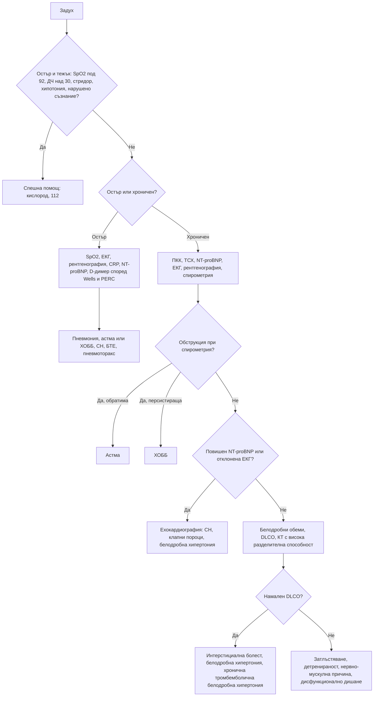

# Глава 15. Задух

> **Част IV. Дихателна система**

## Цели на главата

- Да се оценява бързо тежестта на острия задух и да се разпознават животозастрашаващите причини.
- Да се систематизират причините за хроничен задух според анатомичния и патофизиологичния механизъм.
- Да се използват насочващите белези от анамнезата и прегледа (ортопнея, платипнея, барабанни пръсти).
- Да се прилагат рационално спирометрията, NT-proBNP, D-димерът и образните изследвания.
- Да се разграничават астмата, ХОББ и сърдечната недостатъчност.

---

## 1. Определение и класификация

**Задухът** (диспнея) е субективното усещане за затруднено или неприятно дишане. Той трябва да се разграничи от **тахипнеята** (учестено дишане), която е обективен признак. Според давността се разграничават:

- **остър задух** — минути до дни;
- **хроничен задух** — продължаващ над 4–8 седмици.

### 1.1. Модифицирана скала за задух на Съвета за медицински изследвания на Великобритания (mMRC)

| Степен | Описание |
|---|---|
| 0 | Задух само при тежко усилие |
| 1 | Задух при бързо ходене или изкачване на лек наклон |
| 2 | Ходи по-бавно от връстниците си или спира за почивка при ходене със собственото си темпо |
| 3 | Спира след около 100 m или след няколко минути ходене по равно |
| 4 | Задух при обличане, не излиза от дома поради задух |

---

## 2. Етиологична класификация

| Механизъм | Остър задух | Хроничен задух |
|---|---|---|
| **Горни дихателни пътища** | **Анафилаксия**, ангиоедем, **чуждо тяло**, епиглотит, ларингоспазъм | Тумор на ларинкса или трахеята, стеноза на трахеята, дисфункция на гласните гънки |
| **Долни дихателни пътища** | Пристъп на астма, екзацербация на ХОББ | **ХОББ**, **астма**, бронхиектазии, облитериращ бронхиолит |
| **Белодробен паренхим** | Пневмония, остър респираторен дистрес синдром, белодробен кръвоизлив | **Интерстициални белодробни болести**, карцином, туберкулоза |
| **Белодробни съдове** | **Белодробна тромбемболия** | **Белодробна хипертония**, хронична тромбемболична белодробна хипертония |
| **Плевра** | **Пневмоторакс**, голям излив | Плеврален излив, плеврална фиброза, мезотелиом |
| **Сърце** | **Остър белодробен оток**, ОКС, аритмия, **тампонада**, остра клапна дисфункция | **Сърдечна недостатъчност**, клапни пороци, исхемия (задухът като еквивалент на стенокардията), констриктивен перикардит |
| **Гръдна стена и нервно-мускулни** | Фрактури на ребра, синдром на Guillain-Barré, миастенна криза | Кифосколиоза, затлъстяване, амиотрофична латерална склероза, парализа на диафрагмата, миопатии |
| **Системни и метаболитни** | **Метаболитна ацидоза** (диабетна кетоацидоза, уремия, отравяне с метанол и салицилати), сепсис, **отравяне с въглероден оксид** | Анемия, хипертиреоидизъм, детренираност, затлъстяване, бременност |
| **Коремни** | — | Асцит, изразено затлъстяване |
| **Психогенни** | Паническа атака, хипервентилация | Тревожни разстройства, дисфункционално дишане |

---

## 3. Безопасна диагностична стратегия

| Въпрос | Отговор |
|---|---|
| **Вероятна диагноза** | Остър: инфекция на дихателните пътища, пристъп на астма или екзацербация на ХОББ, остра сърдечна недостатъчност. Хроничен: ХОББ, астма, сърдечна недостатъчност, затлъстяване и детренираност |
| **Сериозни заболявания, които не бива да се пропускат** | Анафилаксия, обструкция на горните дихателни пътища, тензионен пневмоторакс, белодробна тромбемболия, остър белодробен оток и ОКС, тежък астматичен пристъп, пневмония със сепсис, тампонада, метаболитна ацидоза, карцином на белия дроб, белодробна хипертония |
| **Чести капани** | Анемия; белодробна тромбемболия при „тревожен“ пациент; сърдечна недостатъчност, приета за ХОББ, и обратното; интерстициални белодробни болести в начален стадий; нервно-мускулна слабост (двустранна парализа на диафрагмата); лекарства (бета-блокери при астма, амиодарон и метотрексат като причина за пневмонит); дисфункция на гласните гънки, приета за астма; хронична тромбемболична белодробна хипертония |
| **Маскиращи заболявания** | Анемия, хипертиреоидизъм, депресия и тревожност, лекарства |
| **Психосоциални аспекти** | Паническо разстройство, хипервентилационен синдром, страх от задушаване |

---

## 4. Анамнеза

- **Начало:** внезапно (белодробна тромбемболия, пневмоторакс, аспирация на чуждо тяло, анафилаксия), за часове до дни (пневмония, сърдечна недостатъчност, астма), за месеци (интерстициални болести, ХОББ, белодробна хипертония, анемия).
- **Положение на тялото:**
  - **ортопнея** — задух в легнало положение (сърдечна недостатъчност, но също тежка ХОББ, асцит, двустранна парализа на диафрагмата);
  - **пароксизмален нощен задух** — пациентът се събужда със задух след 1–2 часа сън (сърдечна недостатъчност);
  - **платипнея** — задух в изправено положение, който намалява в легнало (хепатопулмонален синдром, вътресърдечен шънт);
  - **трепопнея** — задух в едното странично положение (едностранно белодробно заболяване, излив).
- **Свирене в гърдите:** астма, ХОББ, „сърдечна астма“, чуждо тяло (локално свирене), тумор.
- **Провокиращи фактори:** алергени, усилие, студен въздух, инфекции, професионални експозиции. Професионалната астма се подобрява през почивните дни и в отпуск.
- **Придружаващи симптоми:** кашлица, храчки, хемоптиза, болка в гърдите, треска, загуба на тегло, отоци, сърцебиене, изтръпване около устата и пръстите (хипервентилация).
- **Тютюнопушене** (пакетогодини), **професионални експозиции** (азбест, силициев прах, въглищен прах, органични прахове, птици).
- **Лекарства:** бета-блокери (бронхоспазъм); аспирин и НСПВС (астма, свързана с аспирин); амиодарон, метотрексат, нитрофурантоин, блеомицин, имунни чекпойнт инхибитори (пневмонит); АСЕ инхибитори (кашлица).
- **Рискови фактори** за тромбемболизъм, за сърдечно заболяване и за имуносупресия.

---

## 5. Физикален преглед

- **Оценка на тежестта:** дихателна честота, SpO₂, използване на допълнителната дихателна мускулатура, възможност за говорене в цели изречения, цианоза, ниво на съзнание, пулс, АН.
- **Стридор** — обструкция на горните дихателни пътища.
- **Барабанни пръсти.** Причините са интерстициални белодробни болести (особено идиопатична белодробна фиброза), карцином на белия дроб, бронхиектазии, белодробен абсцес, емпием, цианотични вродени сърдечни пороци, ендокардит, възпалителни болести на червата и цироза. **ХОББ не причинява барабанни пръсти.** Ако пациент с ХОББ има барабанни пръсти, трябва да се търси карцином или бронхиектазии.
- **Шия:** югуларно венозно налягане, трахея, лимфни възли, щитовидна жлеза.
- **Бял дроб:**
  - сухи свиркащи хрипове (обструкция);
  - **фини крепитации като „велкро“** в основите (белодробна фиброза);
  - влажни хрипове (белодробен оток, пневмония, бронхиектазии);
  - притъпяване и отслабено дишане (излив);
  - хиперсонорен тон (пневмоторакс, емфизем);
  - бронхиално дишане (консолидация).
- **Сърце:** шумове, трети тон, аритмия.
- **Крака:** отоци, признаци на тромбоза.
- Индекс на телесната маса, бледост.

---

## 6. Червени флагове

- Дихателна честота над 30/min, SpO₂ под 92% (под 88% при ХОББ), цианоза.
- Невъзможност за говорене в изречения, „нямо дишане“ при аускултация (тежка астма).
- Стридор, оток на езика и устните.
- Нарушено съзнание, изтощение, парадоксално коремно дишане.
- Хипотония, тахикардия, аритмия.
- Болка в гърдите, хемоптиза, едностранен оток на крака.
- Бързо прогресиращ задух.
- Анамнеза за анафилаксия или известен алерген.

---

## 7. Диференциално-диагностични таблици

### 7.1. Астма и ХОББ

| Белег | Астма | ХОББ |
|---|---|---|
| Възраст при началото | Често в детска или млада възраст | Обикновено над 40 години |
| Тютюнопушене | Не е задължително | Почти винаги (или биомаса, професионални експозиции) |
| Атопия, алергичен ринит, екзема | Чести | Редки |
| Протичане | Вариабилно, с безсимптомни периоди | Прогресиращо |
| Нощни симптоми | Чести | По-редки |
| Храчки | По-редки | Чести (хроничен бронхит) |
| Спирометрия | Обратима обструкция, вариабилност на върховия експираторен дебит | Персистираща обструкция (съотношение FEV₁/FVC след бронходилататор < 0,70 или под долната граница на нормата) |
| Фракция на издишания азотен оксид (FeNO) | Често повишена (≥ 50 ppb при възрастни силно подкрепя астма) | Обикновено ниска |
| Еозинофили в кръвта | Често повишени | Понякога (предсказват ефект от инхалаторни кортикостероиди) |

### 7.2. Основни причини за остър задух

| Заболяване | Ключови белези | Ключови изследвания |
|---|---|---|
| **Пристъп на астма** | Свирене, анамнеза за астма, провокиращ фактор | Върхов експираторен дебит, SpO₂ |
| **Екзацербация на ХОББ** | Засилена кашлица, гнойни храчки, свирене | SpO₂, кръвно-газов анализ, рентгенография |
| **Остър белодробен оток** | Ортопнея, розови пенести храчки, влажни хрипове, трети тон | ЕКГ, NT-proBNP, рентгенография, ехокардиография |
| **Пневмония** | Треска, продуктивна кашлица, плеврална болка, крепитации | Рентгенография, CRP, CRB-65 |
| **Белодробна тромбемболия** | Внезапно начало, плеврална болка, тахикардия, рискови фактори, често нормален аускултаторен статус | Скала на Wells, PERC, D-димер, КТ-ангиография |
| **Пневмоторакс** | Внезапна едностранна болка, отслабено дишане | Рентгенография, ехография |
| **Анафилаксия** | Експозиция на алерген, уртикария, оток, хипотония, стридор или свирене | Клинична диагноза, триптаза |
| **Метаболитна ацидоза** | Дълбоко учестено дишане (на Kussmaul) без белодробна находка | Кръвно-газов анализ, глюкоза, кетони, креатинин |
| **Хипервентилация** | Изтръпване около устата и на пръстите, карпопедален спазъм, тревожност, нормална SpO₂ | Диагноза след изключване на органичните причини; кръвно-газов анализ: ниско pCO₂ при нормално pO₂ |

---

## 8. Изследвания

**Остър задух:**

- SpO₂, ЕКГ, капилярна кръвна захар;
- рентгенография на гръден кош;
- ПКК, CRP, креатинин, електролити;
- NT-proBNP, тропонин, D-димер (според претестовата вероятност);
- кръвно-газов анализ при тежък задух, SpO₂ под 92% или подозрение за хиперкапния или ацидоза.

**Хроничен задух (стъпаловидно):**

1. ПКК (анемия), ТСХ, NT-proBNP, креатинин, глюкоза.
2. ЕКГ, рентгенография на гръден кош.
3. **Спирометрия с бронходилататорен тест.** Значима обратимост е подобрението на FEV₁ с ≥ 12% и ≥ 200 ml. При показания се изследва и FeNO.
4. Ехокардиография: сърдечна недостатъчност, клапни пороци, белодробна хипертония.
5. Пълно функционално изследване: белодробни обеми, дифузионен капацитет за въглероден оксид (DLCO). Намаленият дифузионен капацитет при нормална спирометрия насочва към белодробно-съдово заболяване, ранна интерстициална болест или анемия.
6. КТ с висока разделителна способност (интерстициални болести, бронхиектазии, емфизем).
7. Вентилационно-перфузионна сцинтиграфия: скрининг за хронична тромбемболична белодробна хипертония.
8. Кардиопулмонален тест с натоварване при неизяснен задух.
9. Полисомнография (синдром на хиповентилация при затлъстяване, обструктивна сънна апнея).

---

## 9. Особени състояния

- **Дисфункция на гласните гънки** (индуцирана ларингеална обструкция). Среща се при млади жени. Протича с инспираторен стридор, стягане в гърлото и слаб отговор на инхалаторите. Често се бърка с тежка астма. Диагнозата се поставя чрез ларингоскопия по време на симптомите.
- **Синдром на хиповентилация при затлъстяване.** Индекс на телесната маса над 30 kg/m² и дневна хиперкапния (pCO₂ над 45 mmHg) без друга причина. Често се съчетава с обструктивна сънна апнея и води до белодробна хипертония.
- **Двустранна парализа на диафрагмата.** Изразена ортопнея, парадоксално движение на корема при вдишване, спадане на витален капацитет с над 20–30% в легнало положение.
- **Детренираност.** Диагноза след изключване на органичните причини, като при кардиопулмоналния тест с натоварване няма отклонения.
- **Хронична тромбемболична белодробна хипертония.** Прогресиращ задух след прекарана (понякога безсимптомна) белодробна тромбемболия. Скринингът се прави с вентилационно-перфузионна сцинтиграфия.

---

## 10. Диагностичен алгоритъм

---

## 11. Клинични перли

- Задух с нормален аускултаторен статус и нормална рентгенография: мислете за белодробна тромбемболия, анемия, метаболитна ацидоза, белодробна хипертония и нервно-мускулна слабост.
- Барабанните пръсти при пушач с ХОББ не се дължат на ХОББ.
- „Нямото дишане“ при астматик е зловещ белег, а не подобрение.
- При тежък астматичен пристъп нормалният или повишен pCO₂ означава изтощение и надвиснала дихателна недостатъчност.
- Задух и синкоп при усилие при млада жена с нормални белодробни изследвания: белодробна артериална хипертония.
- Пулсовата оксиметрия е нормална при отравяне с въглероден оксид и при анемия въпреки тежката тъканна хипоксия.
- Спирометрията е задължителна за диагнозата ХОББ. Много пациенти с етикет „ХОББ“ имат сърдечна недостатъчност или обратното.

---

## 12. Клиничен случай

**Случай.** Жена на 34 години от година има прогресиращ задух при усилие. Вече не може да изкачва стълби без спиране. Два пъти е получила прималяване при бързо ходене нагоре. Прегледана е многократно. Рентгенографията на гръдния кош, спирометрията и хемоглобинът са нормални. Поставена е диагноза „тревожност и детренираност“. При прегледа: SpO₂ 95% в покой и 89% след 3 минути ходене, подчертан белодробен компонент на втория тон, лек оток на глезените. ЕКГ: дясна електрическа ос, високи R-зъбци във V1 и отрицателни T-зъбци във V1–V3.

**Въпроси.** 1) Какво насочва към органично заболяване? 2) Коя е най-вероятната диагноза?

**Обсъждане.** Обективните данни (десатурация при усилие, акцентуиран пулмонален компонент на втория тон, отоци, деснокамерно обременяване в ЕКГ) и **пресинкопът при усилие** насочват към **белодробна хипертония**. Нормалните рентгенография и спирометрия не я изключват. Ехокардиографията показва дилатирана дясна камера и изчислено систолно налягане в белодробната артерия 78 mmHg. Следващите стъпки са вентилационно-перфузионна сцинтиграфия за изключване на хронична тромбемболична белодробна хипертония и насочване към специализиран център за катетеризация на дясното сърце. Сцинтиграфията е нормална и след изключване на други причини е поставена диагноза идиопатична белодробна артериална хипертония.

**Поука.** Задухът при усилие с обективна десатурация не е тревожност. Синкопът при усилие е червен флаг както за аортна стеноза, така и за белодробна хипертония.

<!-- навигация -->

---

[← Глава 14. Болка и оток на крайниците от съдов произход](14-sadovi-bolki-kraynitsi.md) · [Съдържание](../README.md) · [Глава 16. Кашлица →](16-kashlitsa.md)
