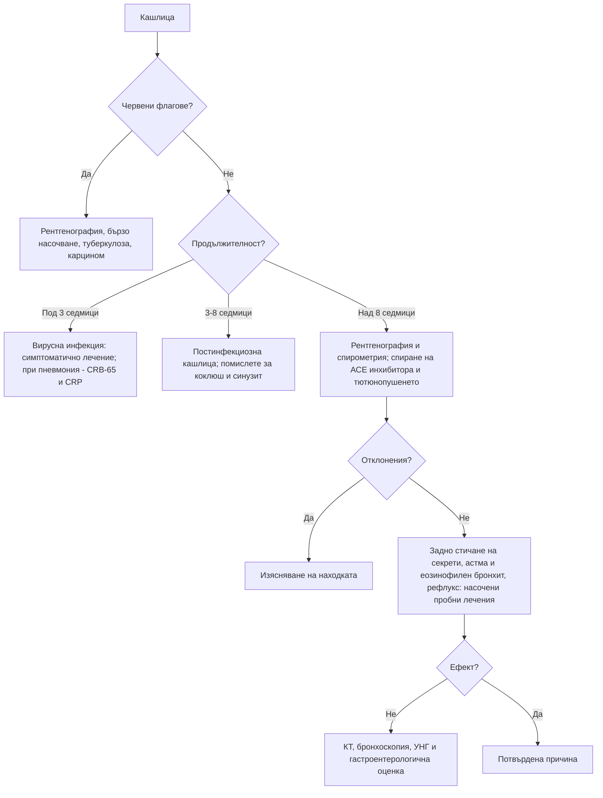

# Глава 16. Кашлица

> **Част IV. Дихателна система**

## Цели на главата

- Да се класифицира кашлицата по продължителност и да се изброяват най-вероятните причини във всяка група.
- Да се разпознават червените флагове за карцином на белия дроб, туберкулоза и други сериозни заболявания.
- Да се прилага систематичен подход към хроничната кашлица при непушачи с нормална рентгенография.
- Да се разпознават коклюшът и кашлицата от АСЕ инхибитори.

## Ключови моменти

- Продължителността насочва към причината: остра (под 3 седмици) — вирусна инфекция; подостра (3–8 седмици) — постинфекциозна кашлица или коклюш; хронична (над 8 седмици) — задно стичане на секрети, астма, рефлукс, АСЕ инхибитори, тютюнопушене.
- Червени флагове са хемоптизата, загубата на тегло, дрезгавият глас над 3 седмици, новата или променената кашлица при пушач над 40 години и рисковите фактори за туберкулоза. При тях се прави рентгенография до 2 седмици *(SORT C [2])*.
- CRP на място намалява ненужното предписване на антибиотици при инфекции на долните дихателни пътища *(SORT B [3, 4])*. Тежестта на пневмонията се оценява с CRB-65 *(SORT B [5])*.
- Пристъпната кашлица с инспираторно провикване или повръщане е коклюш, докато не се докаже противното. Ваксинацията на бременните предпазва кърмачетата *(SORT B [9, 10])*.
- Кашлицата от АСЕ инхибитор засяга 5–35% от лекуваните и може да започне месеци след началото на лечението. Пробното спиране е оправдано при всеки такъв пациент *(SORT C [8])*.
- При хронична кашлица с нормална рентгенография се лекуват насочено най-честите причини. Инхибитор на протонната помпа се пробва само при рефлуксни симптоми *(SORT B [1])*.

---

## 1. Класификация по продължителност

*Таблица 16.1. Класификация по продължителност.*

| Вид | Продължителност | Най-чести причини |
|---|---|---|
| **Остра** | < 3 седмици | Вирусни инфекции на горните дихателни пътища, остър бронхит, грип, COVID-19, пневмония, екзацербация на астма или ХОББ |
| **Подостра** | 3–8 седмици | **Постинфекциозна кашлица**, коклюш, риносинузит, астма |
| **Хронична** | > 8 седмици [1] | Синдром на кашлица от горните дихателни пътища (задно стичане на секрети), астма, неастматичен еозинофилен бронхит, гастроезофагеален рефлукс, АСЕ инхибитори; при пушачи — хроничен бронхит и **карцином на белия дроб** |

---

## 2. Етиологична класификация

*Таблица 16.2. Етиологична класификация.*

| Група | Причини |
|---|---|
| **Горни дихателни пътища** | Вирусен ринит, риносинузит (остър и хроничен), алергичен ринит, задно стичане на секрети, ларингит, ларингофарингеален рефлукс |
| **Долни дихателни пътища** | Остър бронхит, астма (включително кашличен вариант), неастматичен еозинофилен бронхит, ХОББ и хроничен бронхит, **бронхиектазии**, трахеобронхомалация, **чуждо тяло** |
| **Инфекции** | Вирусни, **коклюш**, пневмония (включително атипична: *Mycoplasma*, *Chlamydophila*, *Legionella*), **туберкулоза**, гъбични инфекции |
| **Белодробен паренхим** | Интерстициални белодробни болести, саркоидоза, пневмонит (лекарствен, хиперсензитивен) |
| **Тумори** | **Карцином на белия дроб**, карциноид, метастази, тумори на ларинкса и медиастинума |
| **Сърдечно-съдови** | Лява сърдечна недостатъчност (нощна кашлица), белодробна тромбемболия, митрална стеноза |
| **Храносмилателни** | Гастроезофагеален рефлукс, хронична аспирация (дисфагия, инсулт, деменция), дивертикул на Zenker |
| **Лекарства** | **АСЕ инхибитори**; бета-блокери (при астма); лекарства, причиняващи пневмонит |
| **Други** | Обструктивна сънна апнея, професионални и битови дразнители, синдром на кашлична свръхчувствителност (рефрактерна хронична кашлица), навикова (тикова) кашлица, дисфункция на гласните гънки, психогенна кашлица (диагноза след изключване) |

---

## 3. Безопасна диагностична стратегия

*Таблица 16.3. Безопасна диагностична стратегия.*

| Въпрос | Отговор |
|---|---|
| **Вероятна диагноза** | Остра: вирусна инфекция. Подостра: постинфекциозна кашлица. Хронична: задно стичане на секрети, астма, рефлукс, АСЕ инхибитори, тютюнопушене |
| **Сериозни заболявания, които не бива да се пропускат** | Карцином на белия дроб; туберкулоза; пневмония; белодробна тромбемболия; сърдечна недостатъчност; чуждо тяло (особено при деца); интерстициални белодробни болести; коклюш при кърмачета и в семейства с кърмачета |
| **Чести капани** | Коклюш при ваксинирани възрастни; кашлица от АСЕ инхибитор, започнала месеци след лечението; неастматичен еозинофилен бронхит; хронична аспирация при възрастни хора; бронхиектазии, лекувани като „чести бронхити“; сърдечна недостатъчност с нощна кашлица |
| **Маскиращи заболявания** | Лекарства, гастроезофагеален рефлукс, сърдечна недостатъчност |
| **Психосоциални аспекти** | Тревожност за рак, навикова кашлица, експозиция на дим в дома |

---

## 4. Анамнеза

- **Продължителност и начало:** след вирусна инфекция, внезапно (аспирация), постепенно.
- **Характер:**
  - суха;
  - продуктивна — количество, цвят, мирис на храчките;
  - пристъпна — пристъпи, завършващи с **инспираторно „провикване“** (whoop) или с **повръщане** след кашлицата (коклюш);
  - лаеща (круп при деца, трахеит).
- **Време:** нощна (астма, сърдечна недостатъчност, рефлукс, задно стичане на секрети); сутрешна продуктивна (хроничен бронхит, бронхиектазии); при хранене (аспирация, трахеоезофагеална фистула).
- **Придружаващи симптоми:** хемоптиза, задух, свирене, болка в гърдите, треска, загуба на тегло, нощно изпотяване, дрезгав глас, дисфагия, киселини, запушен нос, кихане, секреция в гърлото.
- **Тютюнопушене**, пасивно пушене, **професионални експозиции**, домашни животни, птици.
- **Лекарства:** АСЕ инхибитори (кашлицата може да започне седмици до месеци след началото на лечението).
- **Контакт** с болен от туберкулоза, пребиваване в затвор или общежитие, бездомност, HIV, имуносупресия, произход от страни с висока честота на туберкулоза.
- **Ваксинален статус**, деца в семейството, кърмачета.

### 4.1. Характер на храчките

*Таблица 16.4. Анамнеза: характер на храчките.*

| Храчки | Насочват към |
|---|---|
| Бели, мукоидни | Вирусна инфекция, астма, хроничен бронхит |
| Гнойни (жълти, зелени) | Бактериална инфекция, бронхиектазии (зеленият цвят се среща и при еозинофилно възпаление) |
| Ръждиви | Пневмококова пневмония |
| Розови, пенести | Белодробен оток |
| Обилни, ежедневни, гнойни, на пластове | Бронхиектазии |
| С неприятна миризма | Белодробен абсцес (анаеробни бактерии) |
| Примесени с кръв | Вж. глава 17 |

---

## 5. Физикален преглед

- Жизнени показатели: температура, дихателна честота, SpO₂, пулс.
- Нос и гърло: оток на лигавицата, полипи, задно стичане на секрети („калдъръмен“ вид на задната стена на фаринкса).
- Шия: лимфни възли, трахея.
- Бял дроб: свирене, крепитации (фини, велкро-подобни при фиброза; груби при бронхиектазии), консолидация, излив.
- Барабанни пръсти (бронхиектазии, карцином, фиброза).
- Сърце: признаци на сърдечна недостатъчност.
- Кожа: екзема (атопия), еритема нодозум (саркоидоза).

---

## 6. Червени флагове

- **Хемоптиза.**
- Загуба на тегло, нощно изпотяване, продължителна треска.
- Задух, болка в гърдите.
- **Дрезгав глас над 3 седмици.**
- Дисфагия.
- **Пушач или бивш пушач над 40 години** с нова или променена кашлица.
- Кашлица над 3 седмици с рискови фактори за туберкулоза.
- Повтаряща се пневмония в един и същи дял (обструкция от тумор или чуждо тяло).
- Барабанни пръсти, лимфаденопатия.
- Имуносупресия.
- Внезапно начало с дихателни симптоми след задавяне (чуждо тяло).

**Британските препоръки (NICE NG12) за карцином на белия дроб** [2]:

- рентгенография на гръден кош до 2 седмици при възраст ≥ 40 години с два или повече необясними симптома (кашлица, умора, задух, болка в гърдите, загуба на тегло, загуба на апетит) или с един симптом при пушачи и бивши пушачи;
- бързо насочване при възраст ≥ 40 години с необяснима хемоптиза или при рентгенография, подозрителна за карцином.

---

## 7. Пневмония в извънболничната практика

- **Клинични данни:** треска, кашлица, продуктивни храчки, плеврална болка, задух, тахипнея, тахикардия, локални крепитации или бронхиално дишане.
- **При нормални жизнени показатели и нормален аускултаторен статус пневмонията е малко вероятна.**
- **CRP на място:** под 20 mg/l — антибиотикът обикновено не е показан; 20–100 mg/l — обсъжда се отложено предписване; над 100 mg/l — антибиотикът обикновено е показан. Изследването намалява предписването на антибиотици, без да влошава изхода [3, 4].
- **Оценка на тежестта с CRB-65** (по една точка):
  - **C** — объркване;
  - **R** — дихателна честота ≥ 30/min;
  - **B** — систолно налягане < 90 mmHg или диастолно ≤ 60 mmHg;
  - **65** — възраст ≥ 65 години.

  Рискът от смърт до 30 дни е под 1% при 0 точки, 1–10% при 1–2 точки и над 10% при 3–4 точки. По NICE при 0 точки лечението е в общата практика с безопасна мрежа. При 1 точка се избира между лечение в общата практика с безопасна мрежа и оценка в болница в същия ден. При 2 и повече точки се обмисля насочване към болница [5].

*Таблица 16.5. Пневмония в извънболничната практика.*

| Атипичен причинител | Насочващи белези |
|---|---|
| *Mycoplasma pneumoniae* | Млади хора, огнища в училища и колективи, извънбелодробни прояви (хемолиза със студови аглутинини, еритема мултиформе, булозен мирингит) |
| *Legionella pneumophila* | Хотели, климатични инсталации, джакузи; **хипонатриемия**, диария, объркване, повишени чернодробни ензими, относителна брадикардия, тежко протичане |
| *Chlamydophila psittaci* | Контакт с птици (папагали, гълъби) |
| *Coxiella burnetii* (Ку-треска) | Овце, кози, агнене; повишени чернодробни ензими |

---

## 8. Туберкулоза

Честотата на туберкулозата в България е по-висока от средната за ЕС/ЕИП: през 2024 г. са съобщени 14,2 случая на 100 000 души при 8,4 на 100 000 средно за ЕС/ЕИП [6]. Туберкулоза трябва да се подозира при:

- кашлица над 2–3 седмици;
- субфебрилитет, нощно изпотяване, загуба на тегло, хемоптиза;
- рискови групи: контакт с болен, затвор, бездомност, злоупотреба с алкохол, HIV, диабет, лечение с кортикостероиди или биологични средства (особено инхибитори на TNF-α), силикоза, хемодиализа.

**Изследвания:**

- рентгенография на гръден кош (инфилтрати и каверни в горните дялове, милиарен образ, хилусна лимфаденопатия, плеврален излив);
- **три проби храчка** (поне една сутрешна) за микроскопия за киселинно-устойчиви бактерии и култура [7];
- молекулярни тестове (напр. GeneXpert MTB/RIF);
- IGRA и туберкулинов кожен тест, които доказват инфекция, но не разграничават активната туберкулоза от латентната.

---

## 9. Коклюш

- Засяга всички възрасти, включително ваксинираните възрастни, защото имунитетът след ваксинация и след боледуване отслабва с времето.
- **Стадии:**
  1. **катарален** (1–2 седмици) — неспецифичен, най-заразен;
  2. **пароксизмален** (2–6 седмици) — пристъпи на кашлица, инспираторно „провикване“, повръщане след кашлицата, зачервяване на лицето, нормално състояние между пристъпите;
  3. **реконвалесцентен** — седмици до месеци („стодневна кашлица“).
- **При кърмачетата** коклюшът може да протича с апнеи и цианоза без характерната кашлица и може да бъде фатален.
- **Диагноза:** PCR от назофарингеален секрет (в първите 2–3 седмици); серология (IgG антитела срещу коклюшния токсин) след 2–3 седмици.
- Заболяването подлежи на **задължително съобщаване**. При контакт с кърмачета и бременни трябва да се обсъди профилактика.

---

## 10. Кашлица от АСЕ инхибитори

- Честота 5–35%, по-често при жени и при хора от източноазиатски произход [8].
- Суха, дразнеща, често с гъделичкане в гърлото.
- Може да започне от няколко часа до месеци след началото на лечението.
- Отзвучава за 1–4 седмици след спирането (понякога до 3 месеца). Сартаните рядко причиняват кашлица.
- Трябва да се мисли за нея при **всеки** пациент с хронична кашлица, който приема АСЕ инхибитор, независимо кога е започнал лечението.

---

## 11. Подход към хроничната кашлица

Подходът следва препоръките на Европейското респираторно дружество (ERS) [1]:

1. **Изключете червените флагове.** Направете **рентгенография на гръден кош** и при показания **спирометрия**.
2. **Спрете тютюнопушенето и АСЕ инхибитора.**
3. **Търсете и лекувайте най-честите причини**, като се водите от клиничните белези:
   - **синдром на кашлица от горните дихателни пътища** — назални симптоми, секреция в гърлото, прочистване на гърлото. Пробно лечение с интраназален кортикостероид или антихистамин;
   - **астма и неастматичен еозинофилен бронхит** — свирене, атопия, еозинофилия, повишен FeNO, обратимост при спирометрия. Пробно лечение с инхалаторен кортикостероид;
   - **гастроезофагеален рефлукс** — киселини, регургитация, кашлица след хранене и при лягане. Пробно лечение с инхибитор на протонната помпа е оправдано **само при наличие на рефлуксни симптоми**.
4. **При неуспех** — КТ на гръден кош, бронхоскопия, УНГ преглед, изследване на хранопровода, полисомнография.
5. **Рефрактерна хронична кашлица** (синдром на кашлична свръхчувствителност) — диагноза след изключване на другите причини.

---

## 12. Диагностичен алгоритъм

*Фигура 16.1. Диагностичен алгоритъм: кашлица. Схема на авторите въз основа на източниците, цитирани в главата.*

Текстово описание на фигура 16.1

1. Кашлица. Следва: към т. 2.
2. **Въпрос:** Червени флагове? Да — към т. 3; Не — към т. 4.
3. Рентгенография, бързо насочване, туберкулоза, карцином.
4. **Въпрос:** Продължителност? Под 3 седмици — към т. 5; 3-8 седмици — към т. 6; Над 8 седмици — към т. 7.
5. Вирусна инфекция: симптоматично лечение; при пневмония — CRB-65 и CRP.
6. Постинфекциозна кашлица; помислете за коклюш и синузит.
7. Рентгенография и спирометрия; спиране на АСЕ инхибитора и тютюнопушенето. Следва: към т. 8.
8. **Въпрос:** Отклонения? Да — към т. 9; Не — към т. 10.
9. Изясняване на находката.
10. Задно стичане на секрети, астма и еозинофилен бронхит, рефлукс: насочени пробни лечения. Следва: към т. 11.
11. **Въпрос:** Ефект? Не — към т. 12; Да — към т. 13.
12. КТ, бронхоскопия, УНГ и гастроентерологична оценка.
13. Потвърдена причина.

---

## 13. Кога и колко спешно да насочим

*Таблица 16.6. Кога и колко спешно да насочим.*

| Спешност | Клинична ситуация |
|---|---|
| **Незабавно (112 или спешно отделение)** | Кашлица с тежък задух или SpO₂ под 92%; масивна хемоптиза; подозрение за чуждо тяло с дихателен дистрес; кърмаче с пристъпи на кашлица, апнеи или цианоза (коклюш); пневмония с CRB-65 3–4 точки |
| **В същия ден** | Пневмония с CRB-65 2 точки (обмисля се насочване към болница) или 1 точка при несигурност [5]; подозрение за белодробна тромбемболия |
| **Бързо (до 2 седмици)** | Рентгенография, подозрителна за карцином; необяснима хемоптиза при възраст 40 и повече години [2]; упорит необясним дрезгав глас при възраст 45 и повече години; подозрение за туберкулоза — екип по туберкулоза [7] |
| **Планово** | Хронична кашлица без червени флагове, която не се повлиява от насочените пробни лечения (белодробен специалист, КТ, бронхоскопия, УНГ преглед); подозрение за бронхиектазии |
| **Проследяване в общата практика** | Остра вирусна и постинфекциозна кашлица; кашлица от АСЕ инхибитор след спиране на лекарството (преоценка след 4 седмици) |

---

## 14. Клинични перли

- Кашлица с повръщане след пристъпа при възрастен е коклюш, докато не се докаже противното.
- Всеки пациент с хронична кашлица, който приема АСЕ инхибитор, заслужава пробно спиране на лекарството.
- Промяната в характера на кашлицата при дългогодишен пушач е червен флаг.
- „Чести бронхити“ с ежедневни гнойни храчки: помислете за бронхиектазии и направете КТ.
- Повтарящата се пневмония в един и същ дял насочва към обструкция: тумор или чуждо тяло.
- Нощната кашлица при възрастен човек може да е единственият симптом на сърдечна недостатъчност.
- Кашлица при хранене и пиене у възрастен човек след инсулт или с деменция: хронична аспирация.

---

## 15. Клиничен случай

**Етап 1 — представяне.** Мъж на 42 години от 5 седмици има кашлица. Започнала е като „настинка“, а сега се проявява с пристъпи, особено нощем. Пристъпите завършват с шумно вдишване, а понякога и с повръщане. Между пристъпите се чувства добре. Бил е ваксиниран като дете.

> **Въпрос 1.** Коя е най-вероятната диагноза?

**Етап 2 — допълнителни данни.** При прегледа няма находка, а рентгенографията е нормална. Дъщеря му е родила преди 3 седмици и живее в същото домакинство.

> **Въпрос 2.** Кое изследване е подходящо на петата седмица?

> **Въпрос 3.** Какво е особено важно в този случай?

Обсъждане и отговори

**Отговор 1.** Пристъпната кашлица с инспираторно провикване и повръщане, продължаваща над 2 седмици, с добро състояние между пристъпите, е типична картина на **коклюш**. Ваксинацията в детството не предпазва за цял живот.

**Отговор 2.** След третата седмица PCR от назофарингеален секрет често е отрицателен, затова се изследват IgG антитела срещу коклюшния токсин. Резултатът е положителен.

**Отговор 3.** **Новороденото** в семейството: коклюшът при кърмачета може да протече с апнеи и да бъде фатален. Необходими са незабавна консултация и профилактика на контактите според националните указания. Случаят подлежи на задължително съобщаване. Ваксинацията на бременните срещу коклюш предпазва новородените в първите месеци. Препоръчителният срок зависи от националния имунизационен календар: по британските препоръки от 16-ата до 32-рата гестационна седмица (с възможност до 38-ата) [9], а по препоръките на CDC — между 27-ата и 36-ата седмица [10].

**Поука.** Коклюшът е често пропускана причина за подостра кашлица при възрастни и представлява опасност за кърмачетата около тях.

---

## Визуални примери

Учебникът не съдържа собствени изображения. Типичните находки могат да се видят в свободно достъпни атласи (връзките са проверени през септември 2026 г.):

- Лобарна консолидация — [Radiology Masterclass](https://www.radiologymasterclass.co.uk/gallery/chest/pulmonary-disease/consolidation_lobar)
- Атипична пневмония — [Radiology Masterclass](https://www.radiologymasterclass.co.uk/gallery/chest/pulmonary-disease/atypical_pneumonia)
- Туберкулоза — [Radiology Masterclass](https://www.radiologymasterclass.co.uk/gallery/chest/pulmonary-disease/tuberculosis_tb)
- Бронхиектазии и муковисцидоза — [Radiology Masterclass](https://www.radiologymasterclass.co.uk/gallery/chest/pulmonary-disease/bronchiectasis_cystic_fibrosis)

---

## Обобщение

- Кашлицата се класифицира като остра, подостра и хронична. Всяка група има различни най-вероятни причини.
- Червените флагове (хемоптиза, загуба на тегло, дрезгав глас, пушач над 40 години с нова кашлица, рискови фактори за туберкулоза) изискват рентгенография и бързо насочване.
- При хронична кашлица първо се изключват червените флагове, спират се тютюнопушенето и АСЕ инхибиторът, а след това се лекуват насочено задното стичане на секрети, астмата и рефлуксът.
- Коклюшът, туберкулозата и кашлицата от АСЕ инхибитори са чести капани. Коклюшът е опасен за кърмачетата.

## Самопроверка

### Въпроси с един верен отговор

**1.** *(основно ниво)* Мъж на 55 години, пушач, има нова кашлица от 4 седмици без други симптоми. Кое е подходящото поведение по NICE?

- **А.** Симптоматично лечение и контрол след 3 месеца
- **Б.** Рентгенография на гръден кош до 2 седмици
- **В.** Антибиотик
- **Г.** КТ на гръден кош с контраст веднага
- **Д.** Само спирометрия

Отговор и обосновка

**Верен отговор: Б.** При хора на 40 и повече години, които някога са пушили, дори един необясним симптом (включително кашлица) е показание за рентгенография до 2 седмици [2]. А забавя диагнозата. В не е показан без данни за инфекция. Г не е първа стъпка. Д не изключва карцином.

**2.** *(основно ниво)* Жена на 60 години приема лизиноприл от 6 месеца. От 2 месеца има суха, дразнеща кашлица. Рентгенографията е нормална. Кое е най-подходящото поведение?

- **А.** Инхалаторен кортикостероид
- **Б.** Замяна на лизиноприл със сартан и преоценка след 4 седмици
- **В.** Инхибитор на протонната помпа
- **Г.** Антибиотик
- **Д.** Кодеин

Отговор и обосновка

**Верен отговор: Б.** Кашлицата от АСЕ инхибитор може да започне месеци след началото на лечението и отзвучава за 1–4 седмици след спирането (понякога до 3 месеца). Сартаните рядко причиняват кашлица [8]. А, В и Г не лекуват причината. Д само потиска симптома.

**3.** *(основно ниво)* Мъж на 70 години с пневмония е объркан. Дихателната честота е 32/min, а АН — 100/58 mmHg. Какъв е сборът по CRB-65 и какво означава?

- **А.** 1 точка — лечение у дома
- **Б.** 2 точки — лечение у дома без безопасна мрежа
- **В.** 3 точки — междинен риск
- **Г.** 4 точки — висок риск от смърт, насочване към болница
- **Д.** 0 точки — нисък риск

Отговор и обосновка

**Верен отговор: Г.** Объркване (1), дихателна честота 30/min или повече (1), диастолно налягане 60 mmHg или по-малко (1) и възраст 65 и повече години (1) — общо 4 точки. Рискът от смърт е над 10%, затова е показано насочване към болница [5].

**4.** *(напреднало ниво)* Жена на 45 години, непушачка, има кашлица от 4 месеца. Рентгенографията и спирометрията са нормални. Не приема АСЕ инхибитор. Има запушен нос, усещане за стичане в гърлото и често прочиства гърлото си. Няма киселини. Кое е най-подходящото следващо действие?

- **А.** КТ на гръден кош веднага
- **Б.** Пробно лечение с интраназален кортикостероид
- **В.** Инхибитор на протонната помпа
- **Г.** Бронхоскопия
- **Д.** Антибиотик

Отговор и обосновка

**Верен отговор: Б.** Белезите насочват към синдром на кашлица от горните дихателни пътища, при който е оправдано пробно лечение с интраназален кортикостероид или антихистамин [1]. В е оправдан само при рефлуксни симптоми. А и Г са за неуспех от насочените лечения. Д не е показан.

**5.** *(напреднало ниво)* Мъж на 30 години без дом има кашлица от 4 седмици, нощно изпотяване и загуба на тегло. Рентгенографията показва каверна в горния дял. Кое е най-подходящото поведение?

- **А.** IGRA и при положителен резултат — лечение на латентна туберкулоза
- **Б.** Три проби храчка за микроскопия, култура и молекулярен тест и насочване към екип по туберкулоза
- **В.** Широкоспектърен антибиотик за 7 дни
- **Г.** КТ и бронхоскопия преди всички други изследвания
- **Д.** Кортикостероид

Отговор и обосновка

**Верен отговор: Б.** Картината е силно подозрителна за активна белодробна туберкулоза. Изпращат се три проби храчка (поне една сутрешна) за микроскопия и култура и молекулярен тест, а пациентът се насочва към специализиран екип [7]. А не разграничава активната от латентната инфекция. В може да забави диагнозата (особено флуорохинолоните, които частично потискат микобактериите). Д е опасен.

### Задача

Жена на 72 години с клинично поставена пневмония е ориентирана. Дихателната честота е 24/min, АН — 118/62 mmHg, SpO₂ — 95%. Живее сама, но дъщеря ѝ може да я наглежда. Изчислете CRB-65 и определете къде да се лекува.

Решение

Объркване — 0; дихателна честота под 30/min — 0; систолно налягане 90 mmHg или повече и диастолно над 60 mmHg — 0; възраст 65 и повече години — 1. **Общо 1 точка: междинен риск (1–10%)** [5]. По NICE се избира между лечение в общата практика с безопасна мрежа и оценка в болница в същия ден. При нормална SpO₂, липса на тежки съпътстващи заболявания и осигурен надзор е разумно лечение у дома с ясни указания кога да потърси помощ и с контролен преглед до 48 часа.

### OSCE станция: Анамнеза при хронична кашлица

**Време:** 8 минути. **Ниво:** основно (студенти, специализанти).

**Задача за кандидата.** Мъж на 58 години има кашлица от 10 седмици. Снемете насочена анамнеза, определете червените флагове и предложете план.

**Информация за симулирания пациент (за изпитващия).** Бивш пушач (35 пакетогодини, спрял преди 3 години). Кашлицата е суха, а напоследък е „различна“ от обичайната. Приема рамиприл от година. Няма хемоптиза. Отслабнал е с 3 kg. Няма киселини и запушен нос. Притеснява се, че „е нещо лошо“.

*Таблица 16.7. OSCE станция: Анамнеза при хронична кашлица — рубрика за оценяване.*

| Критерий | Точки |
|---|---|
| Изяснява продължителността, характера и промяната в кашлицата | 1 |
| Пита за хемоптиза, загуба на тегло, нощно изпотяване, дрезгав глас, задух и болка в гърдите | 2 |
| Събира данни за тютюнопушенето (пакетогодини) и професионалните експозиции | 1 |
| Пита за лекарства и открива АСЕ инхибитора | 1 |
| Пита за симптоми на рефлукс, задно стичане на секрети и астма | 1 |
| Пита за рискови фактори за туберкулоза | 1 |
| Разпознава червените флагове (бивш пушач над 40 години с променена кашлица и загуба на тегло) | 2 |
| Предлага рентгенография до 2 седмици и обсъжда замяна на рамиприл | 2 |
| Отговаря с емпатия на тревогата на пациента | 1 |
| **Общо** | **12** |

**Праг за успешно представяне:** 8 от 12 точки, включително разпознаването на червените флагове.

## Литература

1. Morice AH, Millqvist E, Bieksiene K, Birring SS, Dicpinigaitis P, Domingo Ribas C, et al. ERS guidelines on the diagnosis and treatment of chronic cough in adults and children. Eur Respir J. 2020;55(1):1901136. doi:10.1183/13993003.01136-2019. PMID: 31515408.
2. National Institute for Health and Care Excellence. Suspected cancer: recognition and referral (NICE guideline NG12). London: NICE; 2015 [актуализирано 2026]. Достъпно на: https://www.nice.org.uk/guidance/ng12
3. Cals JW, Butler CC, Hopstaken RM, Hood K, Dinant GJ. Effect of point of care testing for C reactive protein and training in communication skills on antibiotic use in lower respiratory tract infections: cluster randomised trial. BMJ. 2009;338:b1374. doi:10.1136/bmj.b1374. PMID: 19416992.
4. Smedemark SA, Aabenhus R, Llor C, Fournaise A, Olsen O, Jørgensen KJ. Biomarkers as point-of-care tests to guide prescription of antibiotics in people with acute respiratory infections in primary care. Cochrane Database Syst Rev. 2022;10(10):CD010130. doi:10.1002/14651858.CD010130.pub3. PMID: 36250577.
5. National Institute for Health and Care Excellence. Pneumonia: diagnosis and management (NICE guideline NG250). London: NICE; 2025. Достъпно на: https://www.nice.org.uk/guidance/ng250
6. European Centre for Disease Prevention and Control, WHO Regional Office for Europe. Tuberculosis surveillance and monitoring in Europe 2026 – 2024 data. Stockholm: ECDC; Copenhagen: WHO Regional Office for Europe; 2026. Достъпно на: https://www.ecdc.europa.eu/en/publications-data/tuberculosis-surveillance-and-monitoring-europe-2026-2024-data
7. National Institute for Health and Care Excellence. Tuberculosis (NICE guideline NG33). London: NICE; 2016 [актуализирано 2024]. Достъпно на: https://www.nice.org.uk/guidance/ng33
8. Dicpinigaitis PV. Angiotensin-converting enzyme inhibitor-induced cough: ACCP evidence-based clinical practice guidelines. Chest. 2006;129(1 Suppl):169S-173S. doi:10.1378/chest.129.1_suppl.169S. PMID: 16428706.
9. UK Health Security Agency. Vaccination against pertussis (whooping cough) for pregnant women [Интернет]. London: UKHSA; 2014 [актуализирано 2024]. Достъпно на: https://www.gov.uk/government/publications/vaccination-against-pertussis-whooping-cough-for-pregnant-women
10. Liang JL, Tiwari T, Moro P, Messonnier NE, Reingold A, Sawyer M, et al. Prevention of Pertussis, Tetanus, and Diphtheria with Vaccines in the United States: Recommendations of the Advisory Committee on Immunization Practices (ACIP). MMWR Recomm Rep. 2018;67(2):1-44. doi:10.15585/mmwr.rr6702a1. PMID: 29702631.

*Последна проверка на съдържанието: септември 2026 г. Следващ планиран преглед: септември 2027 г. (вж. „Политика за актуализация“ в README).*

<!-- навигация -->

---

[← Глава 15. Задух](15-zaduh.md) · [Съдържание](../README.md) · [Глава 17. Хемоптиза →](17-hemoptiza.md)
