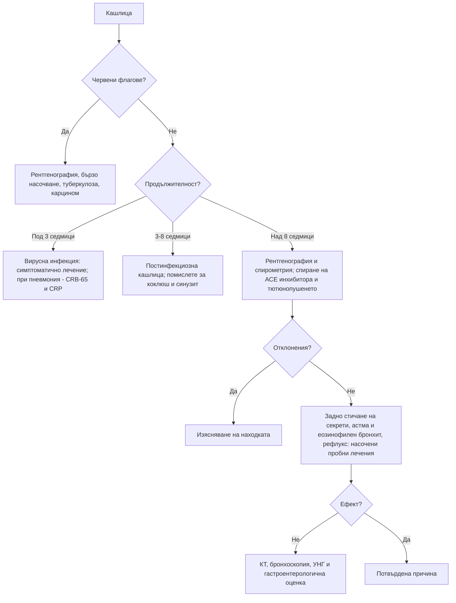

# Глава 16. Кашлица

> **Част IV. Дихателна система**

## Цели на главата

- Да се класифицира кашлицата по продължителност и да се познават най-вероятните причини във всяка група.
- Да се разпознават червените флагове за карцином на белия дроб, туберкулоза и други сериозни заболявания.
- Да се прилага систематичен подход към хроничната кашлица при непушачи с нормална рентгенография.
- Да се разпознават коклюшът и кашлицата от АСЕ инхибитори.

---

## 1. Класификация по продължителност

| Вид | Продължителност | Най-чести причини |
|---|---|---|
| **Остра** | < 3 седмици | Вирусни инфекции на горните дихателни пътища, остър бронхит, грип, COVID-19, пневмония, екзацербация на астма или ХОББ |
| **Подостра** | 3–8 седмици | **Постинфекциозна кашлица**, коклюш, риносинузит, астма |
| **Хронична** | > 8 седмици | Синдром на кашлица от горните дихателни пътища (задно стичане на секрети), астма, неастматичен еозинофилен бронхит, гастроезофагеален рефлукс, АСЕ инхибитори; при пушачи — хроничен бронхит и **карцином на белия дроб** |

---

## 2. Етиологична класификация

| Група | Причини |
|---|---|
| **Горни дихателни пътища** | Вирусен ринит, риносинузит (остър и хроничен), алергичен ринит, задно стичане на секрети, ларингит, ларингофарингеален рефлукс |
| **Долни дихателни пътища** | Остър бронхит, астма (включително кашличен вариант), неастматичен еозинофилен бронхит, ХОББ и хроничен бронхит, **бронхиектазии**, трахеобронхомалация, **чуждо тяло** |
| **Инфекции** | Вирусни, **коклюш**, пневмония (включително атипична: *Mycoplasma*, *Chlamydophila*, *Legionella*), **туберкулоза**, гъбични инфекции |
| **Белодробен паренхим** | Интерстициални белодробни болести, саркоидоза, пневмонит (лекарствен, хиперсензитивен) |
| **Тумори** | **Карцином на белия дроб**, карциноид, метастази, тумори на ларинкса и медиастинума |
| **Сърдечно-съдови** | Лява сърдечна недостатъчност (нощна кашлица), белодробна тромбемболия, митрална стеноза |
| **Храносмилателни** | Гастроезофагеален рефлукс, хронична аспирация (дисфагия, инсулт, деменция), дивертикул на Zenker |
| **Лекарства** | **АСЕ инхибитори**; бета-блокери (при астма); лекарства, причиняващи пневмонит |
| **Други** | Обструктивна сънна апнея, професионални и битови дразнители, синдром на кашлична свръхчувствителност (рефрактерна хронична кашлица), навикова (тикова) кашлица, дисфункция на гласните гънки, психогенна кашлица (диагноза след изключване) |

---

## 3. Безопасна диагностична стратегия

| Въпрос | Отговор |
|---|---|
| **Вероятна диагноза** | Остра: вирусна инфекция. Подостра: постинфекциозна кашлица. Хронична: задно стичане на секрети, астма, рефлукс, АСЕ инхибитори, тютюнопушене |
| **Сериозни заболявания, които не бива да се пропускат** | Карцином на белия дроб; туберкулоза; пневмония; белодробна тромбемболия; сърдечна недостатъчност; чуждо тяло (особено при деца); интерстициални белодробни болести; коклюш при кърмачета и в семейства с кърмачета |
| **Чести капани** | Коклюш при ваксинирани възрастни; кашлица от АСЕ инхибитор, започнала месеци след лечението; неастматичен еозинофилен бронхит; хронична аспирация при възрастни хора; бронхиектазии, лекувани като „чести бронхити“; сърдечна недостатъчност с нощна кашлица |
| **Маскиращи заболявания** | Лекарства, гастроезофагеален рефлукс, сърдечна недостатъчност |
| **Психосоциални аспекти** | Тревожност за рак, навикова кашлица, експозиция на дим в дома |

---

## 4. Анамнеза

- **Продължителност и начало:** след вирусна инфекция, внезапно (аспирация), постепенно.
- **Характер:**
  - суха;
  - продуктивна — количество, цвят, мирис на храчките;
  - пристъпна — пристъпи, завършващи с **инспираторно „провикване“** (whoop) или с **повръщане** след кашлицата (коклюш);
  - лаеща (круп при деца, трахеит).
- **Време:** нощна (астма, сърдечна недостатъчност, рефлукс, задно стичане на секрети); сутрешна продуктивна (хроничен бронхит, бронхиектазии); при хранене (аспирация, трахеоезофагеална фистула).
- **Придружаващи симптоми:** хемоптиза, задух, свирене, болка в гърдите, треска, загуба на тегло, нощно изпотяване, дрезгав глас, дисфагия, киселини, запушен нос, кихане, секреция в гърлото.
- **Тютюнопушене**, пасивно пушене, **професионални експозиции**, домашни животни, птици.
- **Лекарства:** АСЕ инхибитори (кашлицата може да започне седмици до месеци след началото на лечението).
- **Контакт** с болен от туберкулоза, пребиваване в затвор или общежитие, бездомност, HIV, имуносупресия, произход от страни с висока честота на туберкулоза.
- **Ваксинален статус**, деца в семейството, кърмачета.

### 4.1. Характер на храчките

| Храчки | Насочват към |
|---|---|
| Бели, мукоидни | Вирусна инфекция, астма, хроничен бронхит |
| Гнойни (жълти, зелени) | Бактериална инфекция, бронхиектазии (зеленият цвят се среща и при еозинофилно възпаление) |
| Ръждиви | Пневмококова пневмония |
| Розови, пенести | Белодробен оток |
| Обилни, ежедневни, гнойни, на пластове | Бронхиектазии |
| С неприятна миризма | Белодробен абсцес (анаеробни бактерии) |
| Примесени с кръв | Вж. глава 17 |

---

## 5. Физикален преглед

- Жизнени показатели: температура, дихателна честота, SpO₂, пулс.
- Нос и гърло: оток на лигавицата, полипи, задно стичане на секрети („калдъръмен“ вид на задната стена на фаринкса).
- Шия: лимфни възли, трахея.
- Бял дроб: свирене, крепитации (фини, велкро-подобни при фиброза; груби при бронхиектазии), консолидация, излив.
- Барабанни пръсти (бронхиектазии, карцином, фиброза).
- Сърце: признаци на сърдечна недостатъчност.
- Кожа: екзема (атопия), еритема нодозум (саркоидоза).

---

## 6. Червени флагове

- **Хемоптиза.**
- Загуба на тегло, нощно изпотяване, продължителна треска.
- Задух, болка в гърдите.
- **Дрезгав глас над 3 седмици.**
- Дисфагия.
- **Пушач или бивш пушач над 40 години** с нова или променена кашлица.
- Кашлица над 3 седмици с рискови фактори за туберкулоза.
- Повтаряща се пневмония в един и същи дял (обструкция от тумор или чуждо тяло).
- Барабанни пръсти, лимфаденопатия.
- Имуносупресия.
- Внезапно начало с дихателни симптоми след задавяне (чуждо тяло).

**Британските препоръки (NICE NG12) за карцином на белия дроб:**

- рентгенография на гръден кош до 2 седмици при възраст ≥ 40 години с два или повече необясними симптома (кашлица, умора, задух, болка в гърдите, загуба на тегло, загуба на апетит) или с един симптом при пушачи и бивши пушачи;
- бързо насочване при възраст ≥ 40 години с необяснима хемоптиза или при рентгенография, подозрителна за карцином.

---

## 7. Пневмония в извънболничната практика

- **Клинични данни:** треска, кашлица, продуктивни храчки, плеврална болка, задух, тахипнея, тахикардия, локални крепитации или бронхиално дишане.
- **При нормални жизнени показатели и нормален аускултаторен статус пневмонията е малко вероятна.**
- **CRP на място:** под 20 mg/l — антибиотикът обикновено не е показан; 20–100 mg/l — обсъжда се отложено предписване; над 100 mg/l — антибиотикът е показан.
- **Оценка на тежестта с CRB-65** (по една точка):
  - **C** — объркване;
  - **R** — дихателна честота ≥ 30/min;
  - **B** — систолно налягане < 90 mmHg или диастолно ≤ 60 mmHg;
  - **65** — възраст ≥ 65 години.

  При 0 точки се препоръчва домашно лечение. При 1–2 точки се обсъжда хоспитализация. При 3–4 точки е нужна спешна хоспитализация.

| Атипичен причинител | Насочващи белези |
|---|---|
| *Mycoplasma pneumoniae* | Млади хора, огнища в училища и колективи, извънбелодробни прояви (хемолиза със студови аглутинини, еритема мултиформе, булозен мирингит) |
| *Legionella pneumophila* | Хотели, климатични инсталации, джакузи; **хипонатриемия**, диария, объркване, повишени чернодробни ензими, относителна брадикардия, тежко протичане |
| *Chlamydophila psittaci* | Контакт с птици (папагали, гълъби) |
| *Coxiella burnetii* (Ку-треска) | Овце, кози, агнене; повишени чернодробни ензими |

---

## 8. Туберкулоза

България е страна със средна честота на туберкулоза, по-висока от средната за Западна Европа. Туберкулоза трябва да се подозира при:

- кашлица над 2–3 седмици;
- субфебрилитет, нощно изпотяване, загуба на тегло, хемоптиза;
- рискови групи: контакт с болен, затвор, бездомност, злоупотреба с алкохол, HIV, диабет, лечение с кортикостероиди или биологични средства (особено инхибитори на TNF-α), силикоза, хемодиализа.

**Изследвания:**

- рентгенография на гръден кош (инфилтрати и каверни в горните дялове, милиарен образ, хилусна лимфаденопатия, плеврален излив);
- **три проби храчка** за микроскопия за киселинно-устойчиви бактерии и култура;
- молекулярни тестове (напр. GeneXpert MTB/RIF);
- IGRA и туберкулинов кожен тест, които доказват инфекция, но не разграничават активната туберкулоза от латентната.

---

## 9. Коклюш

- Засяга всички възрасти, включително ваксинираните възрастни, защото имунитетът след ваксинация и след боледуване отслабва с времето.
- **Стадии:**
  1. **катарален** (1–2 седмици) — неспецифичен, най-заразен;
  2. **пароксизмален** (2–6 седмици) — пристъпи на кашлица, инспираторно „провикване“, повръщане след кашлицата, зачервяване на лицето, нормално състояние между пристъпите;
  3. **реконвалесцентен** — седмици до месеци („стодневна кашлица“).
- **При кърмачетата** коклюшът може да протича с апнеи и цианоза без характерната кашлица и може да бъде фатален.
- **Диагноза:** PCR от назофарингеален секрет (в първите 2–3 седмици); серология (IgG антитела срещу коклюшния токсин) след 2–3 седмици.
- Заболяването подлежи на **задължително съобщаване**. При контакт с кърмачета и бременни трябва да се обсъди профилактика.

---

## 10. Кашлица от АСЕ инхибитори

- Честота 5–35%, по-често при жени и при хора от източноазиатски произход.
- Суха, дразнеща, често с гъделичкане в гърлото.
- Може да започне от няколко часа до месеци след началото на лечението.
- Отзвучава за 1–4 седмици след спирането (понякога до 3 месеца). Сартаните рядко причиняват кашлица.
- Трябва да се мисли за нея при **всеки** пациент с хронична кашлица, който приема АСЕ инхибитор, независимо кога е започнал лечението.

---

## 11. Подход към хроничната кашлица

1. **Изключете червените флагове.** Направете **рентгенография на гръден кош** и при показания **спирометрия**.
2. **Спрете тютюнопушенето и АСЕ инхибитора.**
3. **Търсете и лекувайте най-честите причини**, като се водите от клиничните белези:
   - **синдром на кашлица от горните дихателни пътища** — назални симптоми, секреция в гърлото, прочистване на гърлото. Пробно лечение с интраназален кортикостероид или антихистамин;
   - **астма и неастматичен еозинофилен бронхит** — свирене, атопия, еозинофилия, повишен FeNO, обратимост при спирометрия. Пробно лечение с инхалаторен кортикостероид;
   - **гастроезофагеален рефлукс** — киселини, регургитация, кашлица след хранене и при лягане. Пробно лечение с инхибитор на протонната помпа е оправдано **само при наличие на рефлуксни симптоми**.
4. **При неуспех** — КТ на гръден кош, бронхоскопия, УНГ преглед, изследване на хранопровода, полисомнография.
5. **Рефрактерна хронична кашлица** (синдром на кашлична свръхчувствителност) — диагноза след изключване на другите причини.

---

## 12. Диагностичен алгоритъм

---

## 13. Клинични перли

- Кашлица с повръщане след пристъпа при възрастен е коклюш, докато не се докаже противното.
- Всеки пациент с хронична кашлица, който приема АСЕ инхибитор, заслужава пробно спиране на лекарството.
- Промяната в характера на кашлицата при дългогодишен пушач е червен флаг.
- „Чести бронхити“ с ежедневни гнойни храчки: помислете за бронхиектазии и направете КТ.
- Повтарящата се пневмония в един и същ дял насочва към обструкция: тумор или чуждо тяло.
- Нощната кашлица при възрастен човек може да е единственият симптом на сърдечна недостатъчност.
- Кашлица при хранене и пиене у възрастен човек след инсулт или с деменция: хронична аспирация.

---

## 14. Клиничен случай

**Случай.** Мъж на 42 години от 5 седмици има кашлица. Започнала е като „настинка“. Сега се проявява с пристъпи, особено нощем. Пристъпите завършват с шумно вдишване, а понякога и с повръщане. Между пристъпите се чувства добре. Бил е ваксиниран като дете. Има дъщеря, родила преди 3 седмици, която живее в същото домакинство. При прегледа няма находка. Рентгенографията е нормална.

**Въпроси.** 1) Коя е най-вероятната диагноза? 2) Какво е особено важно в този случай?

**Обсъждане.** Пристъпната кашлица с инспираторно провикване и повръщане, продължаваща над 2 седмици, с добро състояние между пристъпите, е типична картина на **коклюш**. Ваксинацията в детството не предпазва за цял живот. На петата седмица PCR вече може да е отрицателен, затова се изследват антитела срещу коклюшния токсин. Резултатът е положителен. Най-важното в случая е **новороденото** в семейството: коклюшът при кърмачета може да протече с апнеи и да бъде фатален. Необходими са незабавна консултация и профилактика на контактите. Случаят подлежи на задължително съобщаване. Ваксинацията на бременните срещу коклюш през третия триместър предпазва новородените в първите месеци.

**Поука.** Коклюшът е често пропускана причина за подостра кашлица при възрастни и представлява опасност за кърмачетата около тях.
