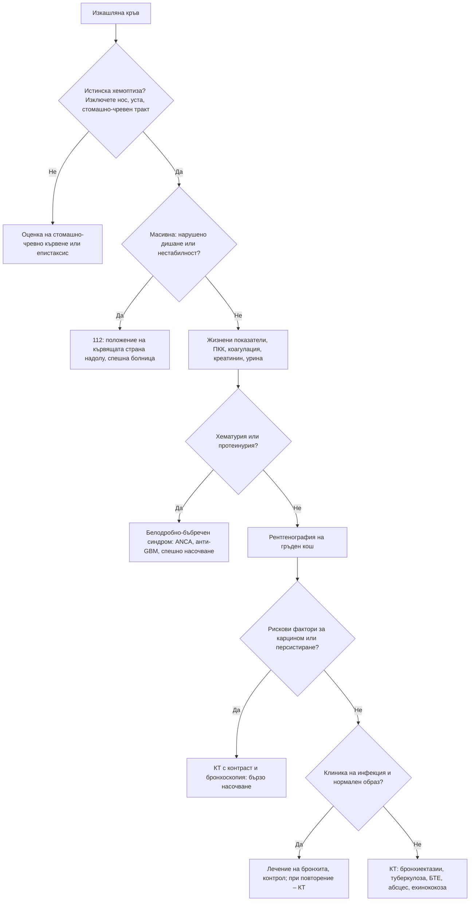

# Глава 17. Хемоптиза

> **Част IV. Дихателна система**

## Цели на главата

- Да се разграничава истинската хемоптиза от кървенето от горните дихателни пътища и от хематемезата.
- Да се разпознава масивната (животозастрашаваща) хемоптиза.
- Да се изброяват причините за хемоптиза и относителната им честота.
- Да се разпознава белодробно-бъбречният синдром.
- Да се определя кога са необходими КТ и бронхоскопия.

## Ключови моменти

- Първо се потвърждава, че кръвта е изкашляна от долните дихателни пътища, а не от носоглътката или стомашно-чревния тракт.
- Масивната хемоптиза е животозастрашаваща заради асфиксията, а не заради загубата на кръв. Пациентът се поставя да лежи на страната на кървенето *(SORT C [1])*.
- В извънболничната практика най-чести са инфекциите на дихателните пътища, бронхиектазиите, ХОББ и карциномът [2].
- Необяснимата хемоптиза при възраст 40 и повече години изисква бързо насочване при подозрение за карцином на белия дроб, дори при нормална рентгенография *(SORT C [2, 3])*.
- При всеки пациент с хемоптиза се прави тест на урината с лента. Хематурията и протеинурията насочват към белодробно-бъбречен синдром, който е спешно състояние.
- Хемоптизата при антикоагулантна терапия често „разкрива“ подлежаща лезия и не бива да се приписва само на лекарството.

### Първите 60 секунди

- Оценете дишането, SpO₂, пулса, АН и количеството на кървенето. При масивна хемоптиза, дихателна недостатъчност или нестабилност – 112.
- Поставете пациента да лежи на страната на кървенето, ако тя е известна, за да се предпази здравият бял дроб [1].
- Дайте кислород при хипоксемия.
- Уточнете приема на антикоагуланти и антитромбоцитни средства.
- Запазете изкашляната кръв, за да се оцени количеството, и не оставяйте пациента сам.

---

## 1. Определение

**Хемоптизата** е изкашлянето на кръв от долните дихателни пътища, т.е. под гласните гънки. Тя варира от прожилки кръв в храчките до масивно кървене.

**Масивна (животозастрашаваща) хемоптиза.** Определенията варират: над 100–600 ml за 24 часа [1]. Клинично по-важно е друго: хемоптизата е животозастрашаваща при всяко количество, което застрашава проходимостта на дихателните пътища или предизвиква хемодинамична нестабилност. **Пациентите умират от асфиксия, а не от загуба на кръв.** Мъртвото пространство на дихателните пътища е само около 150 ml.

### 1.1. Хемоптиза, псевдохемоптиза и хематемеза

*Таблица 17.1. Хемоптиза, псевдохемоптиза и хематемеза.*

| Белег | Хемоптиза | Хематемеза | Кървене от носоглътката |
|---|---|---|---|
| Как се отделя | Изкашляне | Повръщане | Изплюване, стичане по задната стена на гърлото |
| Цвят | Ярко червена, разпенена | Тъмна, като „утайка от кафе“ | Ярко червена |
| Примеси | Храчки, гной | Храна | – |
| pH | Алкално | Кисело | – |
| Анамнеза | Белодробно заболяване, кашлица, задух | Стомашно-чревно заболяване, НСПВС, алкохол, цироза | Носово кървене |
| Други белези | Задух | Гадене, мелена | Кръв в носа при преглед |

---

## 2. Етиологична класификация

*Таблица 17.2. Етиологична класификация.*

| Група | Причини |
|---|---|
| **Дихателни пътища** | Остър бронхит (най-честата причина в извънболничната практика [2]); бронхиектазии; карцином на белия дроб; карциноид; екзацербация на ХОББ; чуждо тяло; травма |
| **Белодробен паренхим** | Пневмония (особено некротизираща, *Klebsiella*, *Staphylococcus aureus*); белодробен абсцес; туберкулоза (активна и последици – аспергилом в каверна, аневризма на Rasmussen); аспергилоза; ехинококова киста (руптура в бронх – изкашляне на солена течност и „люспи“); белодробна контузия |
| **Имунни (дифузен алвеоларен кръвоизлив)** | Грануломатоза с полиангиит, микроскопски полиангиит, анти-GBM болест (синдром на Goodpasture), системен лупус еритематодес, антифосфолипиден синдром |
| **Съдови** | Белодробна тромбемболия с инфаркт; митрална стеноза; остър белодробен оток (розови пенести храчки); артериовенозни малформации (наследствена хеморагична телеангиектазия); аневризма на белодробната артерия (болест на Behçet); аортобронхиална фистула |
| **Хематологични и ятрогенни** | Антикоагуланти и антитромбоцитни средства (често „разкриват“ подлежаща лезия); тромбоцитопения; ДВС; след бронхоскопия или биопсия |
| **Токсични** | Вдишване на кокаин („крак бял дроб“) |
| **Криптогенна хемоптиза** | Причината остава неустановена при значителна част от пациентите – според някои серии до около половината [1] |

---

## 3. Безопасна диагностична стратегия

*Таблица 17.3. Безопасна диагностична стратегия.*

| Въпрос | Отговор |
|---|---|
| **Вероятна диагноза** | Остър бронхит, пневмония, бронхиектазии, екзацербация на ХОББ |
| **Сериозни заболявания, които не бива да се пропускат** | Карцином на белия дроб; туберкулоза; белодробна тромбемболия; белодробно-бъбречен синдром (васкулити, анти-GBM болест); масивна хемоптиза; митрална стеноза; аневризма на белодробната артерия |
| **Чести капани** | Кървене от носоглътката или от стомашно-чревния тракт; хемоптиза при антикоагулантна терапия, приписана само на лекарството; ехинококова киста; ендобронхиален карциноид при млад непушач; ендометриоза на гръдния кош (катамениална хемоптиза, по време на менструация) |
| **Маскиращи заболявания** | Васкулити, туберкулоза, лекарства (антикоагуланти) |
| **Психосоциални аспекти** | Симулирано кървене (рядко), страх от рак |

---

## 4. Анамнеза и физикален преглед

**Анамнеза:**

- Количество и честота на кървенето, вид на кръвта (прожилки, чиста кръв, съсиреци).
- Сигурно ли е, че кръвта е изкашляна?
- Продължителност на кашлицата, храчки, треска, нощно изпотяване, загуба на тегло.
- **Тютюнопушене** (пакетогодини), професионални експозиции (азбест).
- Задух, плеврална болка, рискови фактори за тромбемболизъм.
- Хематурия, отоци, синузит, кървене от носа, обриви, артралгии (васкулит).
- Анамнеза за туберкулоза, контакти, пътувания, имуносупресия.
- Лекарства: антикоагуланти, антитромбоцитни средства.
- Контакт с кучета, домашно клане на животни (ехинококоза).
- Орални и генитални язви, увеит (болест на Behçet).
- Кървене, синхронно с менструацията (катамениална хемоптиза).

**Физикален преглед:**

- Жизнени показатели, SpO₂.
- Нос и устна кухина: изключва се източник в горните дихателни пътища.
- Лимфни възли (надключични), барабанни пръсти.
- Бял дроб: локално свирене (ендобронхиален тумор, чуждо тяло), крепитации, консолидация.
- Сърце: диастолен шум на митрална стеноза, признаци на сърдечна недостатъчност.
- Кожа: телеангиектазии (по устните, езика, пръстите), пурпура (васкулит).
- Крака: тромбоза на дълбоките вени.

---

## 5. Червени флагове

- Масивна хемоптиза, дихателна недостатъчност, хемодинамична нестабилност.
- Възраст ≥ 40 години, тютюнопушене (особено над 30 пакетогодини) [2, 3].
- Персистираща или рецидивираща хемоптиза.
- Загуба на тегло, нощно изпотяване.
- Хематурия, протеинурия, покачващ се креатинин (**белодробно-бъбречен синдром**).
- Плеврална болка, задух, тахикардия (белодробна тромбемболия).
- Анамнеза за туберкулоза или контакт с болен.

---

## 6. Диференциално-диагностична таблица

*Таблица 17.4. Диференциална диагноза на хемоптизата.*

| Заболяване | Ключови белези | Ключови изследвания |
|---|---|---|
| **Остър бронхит** | Инфекция, прожилки кръв, млад непушач | Клинична диагноза; рентгенография при съмнение |
| **Карцином на белия дроб** | Пушач над 40 години, персистиращ симптом, загуба на тегло, дрезгав глас, барабанни пръсти | Рентгенография, КТ с контраст, бронхоскопия, биопсия |
| **Бронхиектазии** | Хронична продуктивна кашлица с ежедневни гнойни храчки, рецидивиращи инфекции | КТ с висока разделителна способност |
| **Туберкулоза** | Субфебрилитет, нощно изпотяване, загуба на тегло, рискови фактори | Рентгенография, храчка за микроскопия, култура, молекулярни тестове |
| **Белодробна тромбемболия** | Внезапен задух, плеврална болка, рискови фактори | Скала на Wells, D-димер, КТ-ангиография |
| **Грануломатоза с полиангиит** | Хроничен синузит, кървене от носа, седловиден нос, възли и каверни в белия дроб, гломерулонефрит | c-ANCA (PR3), урина (еритроцитни цилиндри), креатинин, биопсия |
| **Анти-GBM болест** | Млади мъже (често пушачи) или възрастни жени, бързо прогресиращ гломерулонефрит | Анти-GBM антитела, бъбречна биопсия |
| **Митрална стеноза** | Анамнеза за ревматизъм, задух, предсърдно мъждене, диастолен шум | Ехокардиография |
| **Белодробен абсцес** | Алкохолизъм, аспирация, лоши зъби, храчки с неприятна миризма | Рентгенография и КТ (кухина с ниво) |
| **Ехинококова киста** | Контакт с кучета, селски район; при руптура – изкашляне на солена течност и мембрани, алергична реакция | КТ, ехография на черния дроб, серология |
| **Болест на Behçet** | Орални и генитални язви, увеит, венозни тромбози | КТ-ангиография (аневризми на белодробната артерия) |

---

## 7. Белодробно-бъбречен синдром

Съчетанието от хемоптиза (дифузен алвеоларен кръвоизлив) и гломерулонефрит (хематурия, протеинурия, остро бъбречно увреждане) е спешно състояние. Причините са:

- ANCA-свързани васкулити (грануломатоза с полиангиит, микроскопски полиангиит);
- анти-GBM болест;
- системен лупус еритематодес;
- по-рядко криоглобулинемия и IgA васкулит.

При всеки пациент с хемоптиза трябва да се направи тест на урината с лента за кръв и белтък.

При дифузен алвеоларен кръвоизлив хемоптизата може да липсва. Насочващи белези са анемията, двустранните инфилтрати и хипоксемията.

---

## 8. Изследвания

- ПКК (анемия, тромбоцитопения), коагулационни показатели, креатинин, урина (хематурия, протеинурия).
- **Рентгенография на гръден кош.** При карцином на белия дроб тя може да бъде нормална.
- **КТ на гръден кош с контраст** (или КТ-ангиография). Показана е при повечето пациенти с неясна причина и при всички с рискови фактори за карцином, дори при нормална рентгенография [2].
- **Бронхоскопия.** Показана е при подозрение за ендобронхиален тумор, при персистираща хемоптиза и при висок риск от карцином, особено ако КТ не изяснява причината [1, 2].
- Храчка за туберкулоза (три проби) и цитология.
- ANCA, анти-GBM антитела, ANA при съмнение за системно заболяване.
- Ехокардиография при съмнение за митрална стеноза.
- При масивна хемоптиза: спешна КТ-ангиография и емболизация на бронхиалните артерии или бронхоскопия.

---

## 9. Диагностичен алгоритъм

*Фигура 17.1. Диагностичен алгоритъм: хемоптиза. Схема на авторите въз основа на източниците, цитирани в главата.*

Текстово описание на фигура 17.1

1. Изкашляна кръв. Следва: към т. 2.
2. **Въпрос:** Истинска хемоптиза? Изключете нос, уста, стомашно-чревен тракт Не – към т. 3; Да – към т. 4.
3. Оценка на стомашно-чревно кървене или епистаксис.
4. **Въпрос:** Масивна: нарушено дишане или нестабилност? Да – към т. 5; Не – към т. 6.
5. 112: положение на кървящата страна надолу, спешна болница.
6. Жизнени показатели, ПКК, коагулация, креатинин, урина. Следва: към т. 7.
7. **Въпрос:** Хематурия или протеинурия? Да – към т. 8; Не – към т. 9.
8. Белодробно-бъбречен синдром: ANCA, анти-GBM, спешно насочване.
9. Рентгенография на гръден кош. Следва: към т. 10.
10. **Въпрос:** Рискови фактори за карцином или персистиране? Да – към т. 11; Не – към т. 12.
11. КТ с контраст и бронхоскопия: бързо насочване.
12. **Въпрос:** Клиника на инфекция и нормален образ? Да – към т. 13; Не – към т. 14.
13. Лечение на бронхита, контрол; при повторение – КТ.
14. КТ: бронхиектазии, туберкулоза, БТЕ, абсцес, ехинококоза.

---

## 10. Кога и колко спешно да насочим

*Таблица 17.5. Кога и колко спешно да насочим.*

| Спешност | Клинична ситуация |
|---|---|
| **Незабавно (112 или спешно отделение)** | Масивна хемоптиза или всяко кървене с дихателна недостатъчност или хемодинамична нестабилност; хемоптиза с белези на белодробна тромбемболия и нестабилност |
| **В същия ден** | Белодробно-бъбречен синдром (хемоптиза с хематурия, протеинурия или покачващ се креатинин); подозрение за белодробна тромбемболия; по-обилна хемоптиза при антикоагулантна терапия |
| **Бързо (до 2 седмици)** | Необяснима хемоптиза при възраст 40 и повече години или рентгенография, подозрителна за карцином [3]; подозрение за туберкулоза |
| **Планово** | Рецидивираща хемоптиза с малко количество при известни бронхиектазии; неизяснена хемоптиза при нисък риск след нормална КТ |
| **Проследяване в общата практика** | Прожилки кръв при остър бронхит у млад непушач с нормален преглед; при повторение – рентгенография и преоценка |

---

## 11. Клинични перли

- Хемоптиза при пушач над 40 години означава рак на белия дроб до доказване на противното, дори при нормална рентгенография [2, 3].
- При всеки пациент с хемоптиза направете тест на урината с лента. Хематурията насочва към белодробно-бъбречен синдром.
- Хемоптизата при антикоагулантна терапия често „разкрива“ подлежаща лезия. Не я приписвайте само на лекарството.
- При масивна хемоптиза поставете пациента да лежи на страната на кървенето, за да се предпази здравият бял дроб [1].
- България е с най-високата честота на кистозна ехинококоза в ЕС. Ехинококозата остава важна причина за кистозни лезии в белия дроб и черния дроб, а при малките деца кистите са най-често в белия дроб [4].
- Кървенето по време на менструация насочва към ендометриоза на гръдния кош.

---

## 12. Клиничен случай

**Етап 1 – представяне.** Мъж на 54 години от 2 месеца има запушен нос с кървави секрети и болки в синусите, които не се повлияват от два курса антибиотици. От една седмица изкашля кървави храчки. Отбелязва болки в ставите и умора.

> **Въпрос 1.** Кое изследване в кабинета е задължително и защо?

**Етап 2 – преглед и изследвания.** В носа има коричести лезии, а над десния бял дроб – крепитации. Рентгенографията показва няколко възела в двата бели дроба, единият с каверна. Тестът на урината с лента показва кръв 3+ и белтък 2+. Креатининът е 186 µmol/l (преди 6 месеца е бил 82 µmol/l).

> **Въпрос 2.** Кой синдром е налице и кое единно заболяване обяснява находките?

> **Въпрос 3.** Колко спешно е насочването и какви изследвания ще потвърдят диагнозата?

Обсъждане и отговори

**Отговор 1.** Тестът на урината с лента. При всеки пациент с хемоптиза той търси хематурия и протеинурия като белези на белодробно-бъбречен синдром.

**Отговор 2.** Белодробно-бъбречен синдром. Съчетанието от засягане на горните дихателни пътища (некротизиращ синузит), белодробни възли с каверни, хемоптиза и бързо прогресиращ гломерулонефрит е класическа картина на грануломатоза с полиангиит. Бръсначът на Occam е приложим: едно системно заболяване обяснява всичко.

**Отговор 3.** Насочването е спешно, в същия ден. Изследванията показват високи c-ANCA (антитела срещу протеиназа 3). Бъбречната биопсия установява некротизиращ полумесечен гломерулонефрит. Навременното имуносупресивно лечение може да запази бъбречната функция.

**Поука.** „Синузит“, който не се повлиява от антибиотици, в съчетание с хемоптиза и хематурия изисква спешно изключване на васкулит.

---

## Визуални примери

Учебникът не съдържа собствени изображения. Типичните находки могат да се видят в свободно достъпни атласи (връзките са проверени през септември 2026 г.):

- Хилусна формация с излив – [Radiology Masterclass](https://www.radiologymasterclass.co.uk/gallery/chest/lung_cancer/hilar_mass)
- Кавернизирала белодробна формация – [Radiology Masterclass](https://www.radiologymasterclass.co.uk/gallery/chest/lung_cancer/cavitated_lung_mass)
- Туберкулоза – [Radiology Masterclass](https://www.radiologymasterclass.co.uk/gallery/chest/pulmonary-disease/tuberculosis_tb)

---

## Обобщение

- Хемоптизата е изкашляне на кръв от долните дихателни пътища. Тя се разграничава от кървенето от носоглътката и от хематемезата.
- Масивната хемоптиза застрашава дишането и изисква незабавна спешна помощ.
- Най-честите причини са инфекциите, бронхиектазиите, ХОББ и карциномът, но при значителна част от пациентите причината остава неизяснена.
- Рентгенографията е първото изследване, а КТ и бронхоскопията са показани при рискови фактори за карцином, персистиране или неясна причина. Тестът на урината с лента е задължителен при всеки пациент.

## Самопроверка

### Въпроси с един верен отговор

**1.** *(основно ниво)* Кой белег е най-характерен за хемоптиза, а не за хематемеза?

- **А.** Тъмна кръв като „утайка от кафе“
- **Б.** Примеси от храна
- **В.** Кисело pH
- **Г.** Ярко червена, разпенена, изкашляна кръв
- **Д.** Мелена

Отговор и обосновка

**Верен отговор: Г.** Хемоптизата е ярко червена, разпенена, с алкално pH и често примесена с храчки. А, Б, В и Д са белези на кървене от горния стомашно-чревен тракт.

**2.** *(основно ниво)* Мъж на 52 години, пушач с 35 пакетогодини, изкашля прожилки кръв от седмица. Рентгенографията е нормална. Кое е най-подходящото поведение?

- **А.** Успокояване заради нормалната рентгенография
- **Б.** Бързо насочване (до 2 седмици) за КТ и специализирана оценка
- **В.** Антибиотик и контрол след месец
- **Г.** Спирометрия
- **Д.** D-димер

Отговор и обосновка

**Верен отговор: Б.** Необяснимата хемоптиза при възраст 40 и повече години е показание за бързо насочване при подозрение за карцином на белия дроб [3]. Нормалната рентгенография не изключва карцином [2]. А и В забавят диагнозата. Г и Д не отговарят на въпроса.

**3.** *(основно ниво)* Кое изследване трябва да се направи при всеки пациент с хемоптиза?

- **А.** Бронхоскопия
- **Б.** Тест на урината с лента за кръв и белтък
- **В.** ANCA
- **Г.** Ехокардиография
- **Д.** Туморни маркери

Отговор и обосновка

**Верен отговор: Б.** Тестът на урината с лента открива хематурия и протеинурия като белези на белодробно-бъбречен синдром. А, В и Г са насочени изследвания според клиничните данни. Д не се използва за диагноза.

**4.** *(напреднало ниво)* Мъж с известни бронхиектазии в десния бял дроб има масивна хемоптиза. В какво положение трябва да бъде поставен до пристигането на спешния екип?

- **А.** Да лежи на лявата страна
- **Б.** Да лежи на дясната страна
- **В.** Да лежи по гръб
- **Г.** Седнал и наведен напред
- **Д.** В положение на Тренделенбург

Отговор и обосновка

**Верен отговор: Б.** Пациентът се поставя да лежи на страната на кървенето (тук дясната), за да се предпази здравият бял дроб от аспирация на кръв [1]. А излага здравия бял дроб на риск. В, Г и Д не предпазват здравия бял дроб.

**5.** *(напреднало ниво)* Мъж на 24 години, пушач, има хемоптиза, макроскопска хематурия и креатинин, който се е повишил от 90 до 310 µmol/l за 2 седмици. Няма засягане на горните дихателни пътища, а ANCA са отрицателни. Коя е най-вероятната диагноза?

- **А.** Грануломатоза с полиангиит
- **Б.** Анти-GBM болест
- **В.** Туберкулоза
- **Г.** Белодробна тромбемболия
- **Д.** Митрална стеноза

Отговор и обосновка

**Верен отговор: Б.** Белодробно-бъбречен синдром при млад мъж пушач с отрицателни ANCA насочва към анти-GBM болест (синдром на Goodpasture). Диагнозата се потвърждава с анти-GBM антитела и бъбречна биопсия. А обикновено засяга горните дихателни пътища и протича с положителни ANCA. В, Г и Д не протичат с бързо прогресиращ гломерулонефрит.

### Задача

Мъж на 67 години, бивш пушач, приема апиксабан заради предсърдно мъждене. За 10 дни е изкашлял прожилки кръв три пъти. Жизнените показатели са нормални. Какви са следващите стъпки и каква грешка трябва да се избегне?

Решение

Първо се потвърждава, че става дума за хемоптиза, и се оценява количеството. Изследват се ПКК, креатинин, коагулационни показатели и тест на урината с лента, прави се рентгенография. Пациентът е на 40 и повече години с необяснима хемоптиза, затова се насочва бързо при подозрение за карцином на белия дроб [3], включително за КТ [2]. Грешката, която трябва да се избегне, е хемоптизата да се припише само на антикоагуланта: антикоагулантите често „разкриват“ подлежаща лезия. Решението за антикоагуланта се взема индивидуално, като се претеглят рискът от инсулт и тежестта на кървенето.

### OSCE станция: Оценка на пациент с хемоптиза

**Време:** 8 минути. **Ниво:** основно (студенти, специализанти).

**Задача за кандидата.** Жена на 49 години е изкашляла кръв два пъти през последната седмица. Снемете насочена анамнеза, посочете задължителните части на прегледа и предложете план.

**Информация за симулирания пациент (за изпитващия).** Пуши по 20 цигари дневно от 30 години. Кръвта е ярко червена, в малко количество, примесена с храчки. Има кашлица от 2 месеца и е отслабнала с 4 kg. Няма носово кървене, повръщане или треска. Не приема антикоагуланти. Няма хематурия, но не е забелязвала промени в урината.

*Таблица 17.6. OSCE станция „Оценка на пациент с хемоптиза“ – критерии за оценяване.*

| Критерий | Точки |
|---|---|
| Потвърждава, че кръвта е изкашляна, и изключва носоглътката и стомашно-чревния тракт | 2 |
| Оценява количеството и честотата на кървенето | 1 |
| Търси червени флагове: загуба на тегло, нощно изпотяване, задух, дрезгав глас | 2 |
| Пита за тютюнопушене, туберкулоза, антикоагуланти и симптоми на васкулит | 1 |
| Назовава задължителните части на прегледа: жизнени показатели, нос и уста, лимфни възли, бял дроб, барабанни пръсти | 1 |
| Предлага тест на урината с лента, ПКК, коагулация, креатинин и рентгенография | 2 |
| Решава за бързо насочване (до 2 седмици) при подозрение за карцином | 2 |
| Обяснява плана с емпатия | 1 |
| **Общо** | **12** |

**Праг за успешно изпълнение:** 8 от 12 точки, включително решението за бързо насочване.

## Литература

1. Ittrich H, Bockhorn M, Klose H, Simon M. The Diagnosis and Treatment of Hemoptysis. Dtsch Arztebl Int. 2017;114(21):371-381. doi:10.3238/arztebl.2017.0371. PMID: 28625277.
2. Earwood JS, Thompson TD. Hemoptysis: evaluation and management. Am Fam Physician. 2015;91(4):243-9. PMID: 25955625.
3. National Institute for Health and Care Excellence. Suspected cancer: recognition and referral (NICE guideline NG12). London: NICE; 2015 [актуализирано 2026]. Достъпно на: https://www.nice.org.uk/guidance/ng12
4. Jordanova DP, Harizanov RN, Kaftandjiev IT, Rainova IG, Kantardjiev TV. Cystic echinococcosis in Bulgaria 1996-2013, with emphasis on childhood infections. Eur J Clin Microbiol Infect Dis. 2015;34(7):1423-8. doi:10.1007/s10096-015-2368-z. PMID: 25864190.

*Последна проверка на съдържанието: септември 2026 г. Следващ планиран преглед: септември 2027 г. (вж. „Политика за актуализация“ в README).*

<!-- навигация -->

---

[← Глава 16. Кашлица](16-kashlitsa.md) · [Съдържание](../README.md) · [Глава 18. Плеврален излив, белодробни възли и интерстициални промени →](18-plevralen-izliv-belodrobni-vazli.md)
