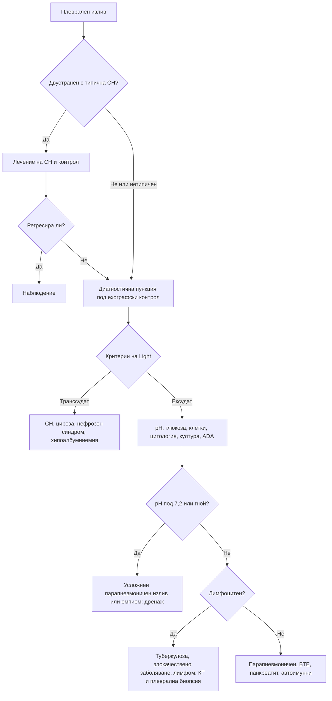

# Глава 18. Плеврален излив, белодробни възли и интерстициални промени

> **Част IV. Дихателна система**

## Цели на главата

- Да се разграничава транссудатът от ексудата и да се тълкува анализът на плевралната течност.
- Да се познават основните причини за плеврален излив.
- Да се оценява рискът от злокачественост на белодробен възел и да се познават принципите на проследяване.
- Да се разпознават кухинните лезии и медиастиналните формации по локализация.
- Да се подхожда систематично към интерстициалните белодробни болести.

---

## А. ПЛЕВРАЛЕН ИЗЛИВ

## 1. Клинична картина и образна диагностика

- **Симптоми:** задух, плеврална болка (в началото, при възпаление), суха кашлица. Малките изливи са безсимптомни.
- **Белези:** притъпяване при перкусия, отслабено дишане, отслабен гласов фремитус, понякога плеврално триене над излива.
- **Рентгенография:** заличаване на костодиафрагмалния синус. Необходими са около 200–300 ml на постероантериорна снимка и около 50 ml на странична.
- **Ехография:** по-чувствителна от рентгенографията. Разграничава течност от консолидация, показва септации и насочва пункцията.

## 2. Транссудат или ексудат

**Критериите на Light.** Изливът е **ексудат**, ако е изпълнен **поне един** от следните критерии:

1. белтък в плевралната течност / белтък в серума > 0,5;
2. ЛДХ в плевралната течност / ЛДХ в серума > 0,6;
3. ЛДХ в плевралната течност > 2/3 от горната граница на нормата за серумна ЛДХ.

Критериите на Light погрешно класифицират като ексудат около една четвърт от транссудатите при пациенти със сърдечна недостатъчност, лекувани с диуретици. В такива случаи помагат:

- **градиент на албумина** (серум минус плеврална течност) > 12 g/l — транссудат;
- NT-proBNP в плевралната течност > 1500 pg/ml — излив при сърдечна недостатъчност.

## 3. Причини

| Транссудати | Ексудати |
|---|---|
| **Сърдечна недостатъчност** (най-честа, обикновено двустранна) | **Парапневмоничен излив и емпием** |
| Чернодробна цироза (хепатален хидроторакс, обикновено вдясно) | **Злокачествени заболявания**: карцином на белия дроб и гърдата, лимфом, **мезотелиом**, метастази (яйчник, стомах) |
| Нефрозен синдром, хипоалбуминемия | **Туберкулозен плеврит** |
| Перитонеална диализа | **Белодробна тромбемболия** (често малък, хеморагичен) |
| Хипотиреоидизъм | Вирусен плеврит |
| Ателектаза, „заклещен“ бял дроб | Автоимунни: ревматоиден артрит, системен лупус еритематодес |
| Констриктивен перикардит | Постмиокарден и посткардиотомен синдром (синдром на Dressler) |
| Синдром на Meigs (фибром на яйчника с асцит и излив) | Панкреатит (вляво, висока амилаза) |
| Уриноторакс | Руптура на хранопровода (вляво, висока амилаза, ниско pH) |
| | Поддиафрагмален абсцес |
| | Лекарства: амиодарон, метотрексат, нитрофурантоин, дазатиниб, ерготаминови производни |
| | Доброкачествен излив след експозиция на азбест |
| | Хилоторакс, хемоторакс, уремичен плеврит |

## 4. Анализ на плевралната течност

| Показател | Значение |
|---|---|
| **Вид** | Гной — емпием; млечен — хилоторакс; кървав — злокачествено заболяване, белодробна тромбемболия, травма; неприятна миризма — анаеробна инфекция |
| **pH** | < 7,2 при парапневмоничен излив: **усложнен излив или емпием**, необходим е дренаж. Ниско pH се наблюдава и при ревматоиден артрит, туберкулоза, злокачествено заболяване и руптура на хранопровода |
| **Глюкоза** | Много ниска при емпием и **ревматоиден плеврит**; ниска при туберкулоза и злокачествено заболяване |
| **Клетъчен състав** | Неутрофили: парапневмоничен излив, белодробна тромбемболия, панкреатит, ранна туберкулоза. **Лимфоцити > 50%: туберкулоза, злокачествено заболяване, лимфом**, ревматоиден артрит, саркоидоза, хилоторакс. Еозинофили > 10%: въздух или кръв в плевралната кухина, лекарства, паразити, еозинофилна грануломатоза с полиангиит, азбест |
| **Цитология** | Положителна при около 60% от злокачествените изливи. Чувствителността нараства при повторно изследване |
| **Микробиология** | Оцветяване по Gram, култура, при съмнение за туберкулоза — микроскопия, култура и молекулярни тестове |
| **Аденозин дезаминаза (ADA)** | > 40 U/l при лимфоцитен ексудат: туберкулоза (особено при млади хора) |
| **Амилаза** | Панкреатит, руптура на хранопровода |
| **Триглицериди** | > 1,24 mmol/l: хилоторакс |
| **Хематокрит** | Съотношение хематокрит в течността / хематокрит в кръвта > 0,5: хемоторакс |

## 5. Кога да се пунктира изливът

- **Всеки едностранен излив** или излив с нетипични белези: треска, плеврална болка, асиметрия, липса на отговор на диуретик.
- Двустранният излив при сърдечна недостатъчност с типична картина се лекува и проследява. Пункция се прави, ако не регресира.
- Туберкулозата и мезотелиомът често изискват **плеврална биопсия** (торакоскопска или под образен контрол).

---

## Б. БЕЛОДРОБЕН ВЪЗЕЛ И ФОРМАЦИЯ

## 6. Определения

- **Белодробен възел** — закръглено засенчване с диаметър до 3 cm, заобиколено от белодробен паренхим.
- **Белодробна формация** — засенчване над 3 cm. Предполага злокачествен процес до доказване на противното.
- Възлите се делят на **солидни** и **субсолидни**. Субсолидните биват тип „матово стъкло“ и частично солидни.

## 7. Оценка на риска от злокачественост

**Фактори, повишаващи риска:**

- възраст;
- тютюнопушене и други експозиции (азбест);
- фамилна анамнеза за карцином на белия дроб;
- емфизем;
- по-голям размер;
- **спикулиран ръб**;
- локализация в горните дялове;
- частично солиден тип;
- **растеж** при проследяване.

За количествена оценка се използва моделът Brock.

**Белези на доброкачественост:**

- калцификация в центъра, дифузна, ламеларна или тип „пуканки“ (хамартом);
- **мастна тъкан** във възела (хамартом);
- **стабилност над 2 години** за солидните възли и над 5 години за субсолидните;
- перифисурални възли (интрапулмонални лимфни възли).

**Принципи на проследяване (препоръки на Fleischner Society за случайно открити солидни възли при възрастни):**

| Размер | Нисък риск | Висок риск |
|---|---|---|
| < 6 mm | Без рутинно проследяване | Може КТ след 12 месеца |
| 6–8 mm | КТ след 6–12 месеца, после след 18–24 месеца | КТ след 6–12 месеца и след 18–24 месеца |
| > 8 mm | КТ след 3 месеца, ПЕТ/КТ или биопсия | Същото |

## 8. Диференциална диагноза на белодробните възли

| Група | Причини |
|---|---|
| **Злокачествени** | Първичен карцином на белия дроб, **метастази** (дебело черво, бъбрек, гърда, меланом, саркоми), карциноид, лимфом |
| **Доброкачествени тумори** | Хамартом |
| **Инфекции** | Туберкулом, гъбични грануломи, абсцес, септични емболи, **ехинококова киста** |
| **Възпалителни** | Ревматоидни възли, грануломатоза с полиангиит, саркоидоза |
| **Съдови** | Артериовенозна малформация, белодробен инфаркт |
| **Други** | Кръгла ателектаза (при азбест), мукоидна импакция, интрапулмонален лимфен възел |

**Множествени възли** насочват към метастази, септични емболи (интравенозна употреба на наркотици, катетри, ендокардит на трикуспидалната клапа), грануломатоза с полиангиит, ревматоидни възли, саркоидоза, туберкулоза, артериовенозни малформации.

### 8.1. Кухинни лезии

| Причина | Примери |
|---|---|
| Злокачествени | Плоскоклетъчен карцином, метастази |
| Инфекции | Туберкулоза, белодробен абсцес, *Staphylococcus aureus*, *Klebsiella*, гъбични инфекции, ехинококоза |
| Автоимунни | Грануломатоза с полиангиит, ревматоидни възли |
| Съдови | Септични емболи, белодробен инфаркт |
| Вродени и други | Бронхогенни кисти, секвестрация, пневматоцеле след травма |

---

## В. МЕДИАСТИНУМ И ХИЛУСИ

## 9. Медиастинални формации по компартменти

| Компартмент | Основни причини |
|---|---|
| **Преден** | Тимом, герминативноклетъчни тумори (тератом), **лимфом**, ретростернална гуша |
| **Среден** | Лимфаденопатия (саркоидоза, лимфом, туберкулоза, метастази), бронхогенни и перикардни кисти, аневризма на аортата |
| **Заден** | Неврогенни тумори, заболявания на хранопровода, аневризма на низходящата аорта, паравертебрален абсцес |

## 10. Хилусна лимфаденопатия

- **Двустранна:**
  - **саркоидоза** — синдромът на Löfgren (еритема нодозум, периартрит на глезените, треска, двустранна хилусна лимфаденопатия) има отлична прогноза;
  - лимфом, туберкулоза, метастази;
  - силикоза (калцификация на лимфните възли тип „черупка на яйце“).
- **Едностранна:** карцином на белия дроб, лимфом, туберкулоза, метастази.

---

## Г. ИНТЕРСТИЦИАЛНИ БЕЛОДРОБНИ БОЛЕСТИ

## 11. Клинична картина

- Прогресиращ **задух при усилие** и **суха кашлица**.
- **Фини крепитации в основите като „велкро“** (особено при идиопатична белодробна фиброза).
- **Барабанни пръсти** — при идиопатична белодробна фиброза и асбестоза.
- **Функционално изследване:** рестриктивен тип нарушение (намален тотален белодробен капацитет) и **намален дифузионен капацитет**.
- **КТ с висока разделителна способност** — ключово изследване.

## 12. Причини

| Група | Заболявания и експозиции |
|---|---|
| **Идиопатични** | Идиопатична белодробна фиброза (възрастни мъже, пушачи; образ на обикновена интерстициална пневмония — субплеврални промени в основите, „пчелна пита“, тракционни бронхиектазии), неспецифична интерстициална пневмония, криптогенна организираща пневмония |
| **При системни заболявания на съединителната тъкан** | Ревматоиден артрит, **системна склероза**, възпалителни миопатии (антисинтетазен синдром — „ръце на механик“, анти-Jo-1), синдром на Sjögren, системен лупус еритематодес |
| **Хиперсензитивен пневмонит** | **Птици** („бял дроб на птицевъда“), **мухлясало сено** („бял дроб на фермера“), овлажнители, джакузи. Симптомите се подобряват при отстраняване от експозицията |
| **Професионални (пневмокониози)** | **Азбестоза** (строителство, корабостроене, изолации, **етернитови плоскости**); **силикоза** (минно дело, каменоделство, пясъкоструене, изкуствен камък за кухненски плотове); пневмокониоза на въглекопачите |
| **Лекарства** | **Амиодарон**, **метотрексат**, **нитрофурантоин**, блеомицин, имунни чекпойнт инхибитори, бусулфан |
| **Лъчеви** | Лъчев пневмонит (седмици след облъчването) и фиброза |
| **Саркоидоза** | Перилимфатични възли, горни дялове, хилусна лимфаденопатия |
| **Свързани с тютюнопушенето** | Респираторен бронхиолит, десквамативна интерстициална пневмония, хистиоцитоза от клетки на Langerhans |
| **Имитатори** | **Белодробен оток**, лимфангитна карциноматоза, пневмоцистна пневмония при имуносупресия, дифузен алвеоларен кръвоизлив, лимфангиолейомиоматоза (млади жени) |

**Разпределение на фиброзата:**

- **горните дялове:** саркоидоза, силикоза, пневмокониоза на въглекопачите, хиперсензитивен пневмонит, туберкулоза, анкилозиращ спондилит;
- **долните дялове:** идиопатична белодробна фиброза, асбестоза, системни заболявания на съединителната тъкан (ревматоиден артрит, системна склероза), лекарства, хронична аспирация.

---

## 13. Диагностичен алгоритъм при плеврален излив

---

## 14. Клинични перли

- Едностранният плеврален излив изисква пункция, освен ако причината не е несъмнено ясна.
- Лимфоцитният ексудат с отрицателна цитология не изключва злокачествено заболяване и туберкулоза. Често е необходима плеврална биопсия.
- Всеки пациент с плеврален излив и анамнеза за експозиция на азбест, дори преди десетилетия, трябва да бъде изследван за мезотелиом.
- Много ниска глюкоза в плевралната течност при пациент с ревматоиден артрит: ревматоиден плеврит.
- Белодробният оток може да имитира интерстициална болест на КТ. Преценете отново след лечение с диуретик.
- Сравнете с предишни образни изследвания. Стабилността на възела е най-силният белег за доброкачественост.
- Пациент на амиодарон или метотрексат с нов задух и кашлица: лекарствен пневмонит.

---

## 15. Клиничен случай

**Случай.** Мъж на 71 години, пенсиониран строителен работник, от 3 месеца има постоянна тъпа болка в лявата половина на гръдния кош, задух и отслабване с 6 kg. Десетилетия е рязал и монтирал етернитови плоскости. При прегледа: притъпяване и отслабено дишане вляво до средата на скапулата. Рентгенографията показва голям ляв плеврален излив. Пункцията дава серозно-хеморагичен лимфоцитен ексудат. Цитологията е отрицателна при две изследвания.

**Въпроси.** 1) Коя е най-вероятната диагноза? 2) Как се потвърждава?

**Обсъждане.** Професионалната експозиция на азбест (етернитът е азбестоцимент), постоянната болка в гръдния кош, загубата на тегло и хеморагичният лимфоцитен ексудат насочват към **малигнен мезотелиом на плеврата**. Латентният период след експозицията е 20–50 години. Цитологията често е отрицателна при мезотелиом. КТ с контраст показва нодуларно задебеляване на плеврата, включително на медиастиналната плевра, и плеврални плаки. Хистологичната диагноза се поставя чрез **торакоскопска биопсия**, която потвърждава епителоиден мезотелиом. Заболяването подлежи на регистрация като професионално.

**Поука.** Професионалната анамнеза трябва да обхваща целия трудов живот. Отрицателната цитология не изключва злокачествен излив.

<!-- навигация -->

---

[← Глава 17. Хемоптиза](17-hemoptiza.md) · [Съдържание](../README.md) · [Глава 19. Остра коремна болка →](19-ostra-koremna-bolka.md)
