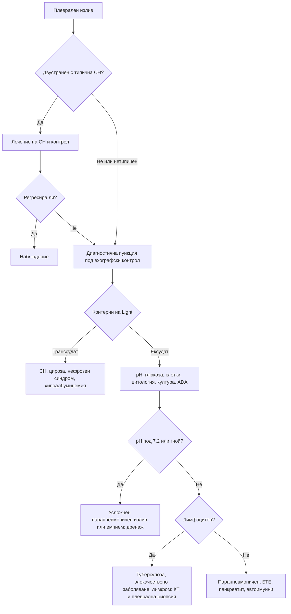

# Глава 18. Плеврален излив, белодробни възли и интерстициални промени

> **Част IV. Дихателна система**

## Цели на главата

- Да се разграничава транссудатът от ексудата и да се тълкува анализът на плевралната течност.
- Да се изброяват основните причини за транссудат и ексудат.
- Да се оценява рискът от злокачественост на белодробен възел и да се познават принципите на проследяване.
- Да се разпознават кухинните лезии и медиастиналните формации по локализация.
- Да се прилага стъпков подход (анамнеза за експозиции, преглед, спирометрия, КТ с висока разделителна способност) при подозрение за интерстициална белодробна болест.

## Ключови моменти

- Всеки едностранен или нетипичен плеврален излив се пунктира под ехографски контрол. Двустранният излив при типична сърдечна недостатъчност първо се лекува и проследява *(SORT C [1])*.
- Критериите на Light разграничават ексудата от транссудата, но при лекувана с диуретици сърдечна недостатъчност помагат градиентът на албумина (над 12 g/l) и NT-proBNP в течността *(SORT B [1, 2])*.
- pH под 7,2 при парапневмоничен излив налага дренаж. Лимфоцитният ексудат с отрицателна цитология не изключва туберкулоза или злокачествено заболяване *(SORT C [1])*.
- Рискът от злокачественост на белодробен възел зависи от възрастта, тютюнопушенето, размера, ръба, локализацията и растежа. Моделът Brock и препоръките на Fleischner Society определят проследяването *(SORT B [3, 4])*.
- КТ с висока разделителна способност е ключово изследване при подозрение за интерстициална болест. Анамнезата за експозиции и лекарства е задължителна *(SORT C [5])*.
- Професионалната анамнеза обхваща целия трудов живот: експозицията на азбест преди десетилетия е червен флаг за мезотелиом [7].

---

## А. Плеврален излив

### 1. Клинична картина и образна диагностика

- **Симптоми:** задух, плеврална болка (в началото, при възпаление), суха кашлица. Малките изливи са безсимптомни.
- **Белези:** притъпяване при перкусия, отслабено дишане, отслабен гласов фремитус, понякога плеврално триене над излива.
- **Рентгенография:** заличаване на костодиафрагмалния синус. За да се види изливът, са необходими около 200–300 ml течност на задно-предна (PA) снимка и около 50 ml на странична.
- **Ехография:** по-чувствителна от рентгенографията. Разграничава течност от консолидация, показва септации и насочва пункцията [1].

### 2. Транссудат или ексудат

**Критериите на Light.** Изливът е ексудат, ако е изпълнен поне един от следните критерии [2]:

1. белтък в плевралната течност / белтък в серума > 0,5;
2. ЛДХ в плевралната течност / ЛДХ в серума > 0,6;
3. ЛДХ в плевралната течност > 2/3 от горната граница на нормата за серумна ЛДХ.

Критериите на Light погрешно класифицират като ексудат около една четвърт от транссудатите при пациенти със сърдечна недостатъчност, лекувани с диуретици. В такива случаи помагат:

- **градиент на албумина** (серум минус плеврална течност) > 12 g/l – транссудат;
- NT-proBNP в плевралната течност > 1500 pg/ml – излив при сърдечна недостатъчност [1].

### 3. Причини

*Таблица 18.1. Причини за плеврален излив.*

| Транссудати | Ексудати |
|---|---|
| **Сърдечна недостатъчност** (най-честа, обикновено двустранна) | **Парапневмоничен излив и емпием** |
| Чернодробна цироза (хепатален хидроторакс, обикновено вдясно) | Злокачествени заболявания: карцином на белия дроб и гърдата, лимфом, мезотелиом, метастази (яйчник, стомах) |
| Нефрозен синдром, хипоалбуминемия | **Туберкулозен плеврит** |
| Перитонеална диализа | Белодробна тромбемболия (често малък, хеморагичен) |
| Хипотиреоидизъм | Вирусен плеврит |
| Ателектаза, „заклещен“ бял дроб | Автоимунни: ревматоиден артрит, системен лупус еритематодес |
| Констриктивен перикардит | Постмиокарден и посткардиотомен синдром (синдром на Dressler) |
| Синдром на Meigs (фибром на яйчника с асцит и излив) | Панкреатит (вляво, висока амилаза) |
| Уриноторакс | Руптура на хранопровода (вляво, висока амилаза, ниско pH) |
| | Поддиафрагмален абсцес |
| | Лекарства: амиодарон, метотрексат, нитрофурантоин, дазатиниб, ерготаминови производни |
| | Доброкачествен излив след експозиция на азбест |
| | Хилоторакс, хемоторакс, уремичен плеврит |

### 4. Анализ на плевралната течност

*Таблица 18.2. Анализ на плевралната течност.*

| Показател | Значение |
|---|---|
| **Вид** | Гной – емпием; млечен – хилоторакс; кървав – злокачествено заболяване, белодробна тромбемболия, травма; неприятна миризма – анаеробна инфекция |
| **pH** | < 7,2 при парапневмоничен излив: усложнен излив или емпием, необходим е дренаж [1]. Ниско pH се наблюдава и при ревматоиден артрит, туберкулоза, злокачествено заболяване и руптура на хранопровода |
| **Глюкоза** | Много ниска при емпием и ревматоиден плеврит; ниска при туберкулоза и злокачествено заболяване |
| **Клетъчен състав** | Неутрофили: парапневмоничен излив, белодробна тромбемболия, панкреатит, ранна туберкулоза. Лимфоцити > 50%: туберкулоза, злокачествено заболяване, лимфом, ревматоиден артрит, саркоидоза, хилоторакс. Еозинофили > 10%: въздух или кръв в плевралната кухина, лекарства, паразити, еозинофилна грануломатоза с полиангиит, азбест |
| **Цитология** | Положителна при около 60% от злокачествените изливи [1]. Чувствителността нараства при повторно изследване |
| **Микробиология** | Оцветяване по Gram, култура, при съмнение за туберкулоза – микроскопия, култура и молекулярни тестове |
| **Аденозин дезаминаза (ADA)** | > 40 U/l при лимфоцитен ексудат: туберкулоза (особено при млади хора) |
| **Амилаза** | Панкреатит, руптура на хранопровода |
| **Триглицериди** | > 1,24 mmol/l: хилоторакс |
| **Хематокрит** | Съотношение хематокрит в течността / хематокрит в кръвта > 0,5: хемоторакс |

### 5. Кога да се пунктира изливът

- **Всеки едностранен излив** или излив с нетипични белези: треска, плеврална болка, асиметрия, липса на отговор на диуретик.
- Двустранният излив при сърдечна недостатъчност с типична картина се лекува и проследява. Пункция се прави, ако не регресира.
- Туберкулозата и мезотелиомът често изискват **плеврална биопсия** (торакоскопска или под образен контрол).

---

## Б. Белодробен възел и формация

### 6. Определения

- **Белодробен възел** – закръглено засенчване с диаметър до 3 cm, заобиколено от белодробен паренхим.
- **Белодробна формация** – засенчване над 3 cm. Предполага злокачествен процес до доказване на противното.
- Възлите се делят на солидни и субсолидни. Субсолидните биват тип „матово стъкло“ и частично солидни.

### 7. Оценка на риска от злокачественост

**Фактори, повишаващи риска:**

- възраст;
- тютюнопушене и други експозиции (азбест);
- фамилна анамнеза за карцином на белия дроб;
- емфизем;
- по-голям размер;
- **спикулиран ръб**;
- локализация в горните дялове;
- частично солиден тип;
- **растеж** при проследяване.

За количествена оценка се използва моделът Brock [3].

**Белези на доброкачественост:**

- калцификация в центъра, дифузна, ламеларна или тип „пуканки“ (хамартом);
- **мастна тъкан** във възела (хамартом);
- **стабилност над 2 години** за солидните възли и над 5 години за субсолидните;
- перифисурални възли (интрапулмонални лимфни възли).

**Принципи на проследяване (препоръки на Fleischner Society за случайно открити солидни възли при възрастни) [4]:**

*Таблица 18.3. Проследяване на случайно открити солидни възли (Fleischner Society).*

| Размер | Нисък риск | Висок риск |
|---|---|---|
| < 6 mm | Без рутинно проследяване | Възможна КТ след 12 месеца |
| 6–8 mm | КТ след 6–12 месеца, после обсъждане на КТ след 18–24 месеца | КТ след 6–12 месеца и след 18–24 месеца |
| > 8 mm | Обсъжда се КТ след 3 месеца, ПЕТ/КТ или биопсия | Същото |

Тези препоръки не се прилагат при хора под 35 години, при известно злокачествено заболяване, при имуносупресия и при скрининг за карцином на белия дроб [4].

### 8. Диференциална диагноза на белодробните възли

*Таблица 18.4. Диференциална диагноза на белодробните възли.*

| Група | Причини |
|---|---|
| **Злокачествени** | Първичен карцином на белия дроб, метастази (дебело черво, бъбрек, гърда, меланом, саркоми), карциноид, лимфом |
| **Доброкачествени тумори** | Хамартом |
| **Инфекции** | Туберкулом, гъбични грануломи, абсцес, септични емболи, ехинококова киста |
| **Възпалителни** | Ревматоидни възли, грануломатоза с полиангиит, саркоидоза |
| **Съдови** | Артериовенозна малформация, белодробен инфаркт |
| **Други** | Кръгла ателектаза (при азбест), мукоидна импакция, интрапулмонален лимфен възел |

**Множествени възли** насочват към метастази, септични емболи (интравенозна употреба на наркотици, катетри, ендокардит на трикуспидалната клапа), грануломатоза с полиангиит, ревматоидни възли, саркоидоза, туберкулоза, артериовенозни малформации.

#### 8.1. Кухинни лезии

*Таблица 18.5. Кухинни лезии в белия дроб.*

| Причина | Примери |
|---|---|
| Злокачествени | Плоскоклетъчен карцином, метастази |
| Инфекции | Туберкулоза, белодробен абсцес, *Staphylococcus aureus*, *Klebsiella*, гъбични инфекции, ехинококоза |
| Автоимунни | Грануломатоза с полиангиит, ревматоидни възли |
| Съдови | Септични емболи, белодробен инфаркт |
| Вродени и други | Бронхогенни кисти, секвестрация, пневматоцеле след травма |

---

## В. Медиастинум и хилуси

### 9. Медиастинални формации по компартменти

*Таблица 18.6. Медиастинални формации по компартменти.*

| Компартмент | Основни причини |
|---|---|
| **Преден** | Тимом, герминативноклетъчни тумори (тератом), лимфом, ретростернална гуша |
| **Среден** | Лимфаденопатия (саркоидоза, лимфом, туберкулоза, метастази), бронхогенни и перикардни кисти, аневризма на аортата |
| **Заден** | Неврогенни тумори, заболявания на хранопровода, аневризма на низходящата аорта, паравертебрален абсцес |

### 10. Хилусна лимфаденопатия

- **Двустранна:**
  - **саркоидоза** – синдромът на Löfgren (еритема нодозум, периартрит на глезените, треска, двустранна хилусна лимфаденопатия) има отлична прогноза;
  - лимфом, туберкулоза, метастази;
  - силикоза (калцификация на лимфните възли тип „черупка на яйце“).
- **Едностранна:** карцином на белия дроб, лимфом, туберкулоза, метастази.

---

## Г. Интерстициални белодробни болести

### 11. Клинична картина

- Прогресиращ задух при усилие и суха кашлица.
- **Фини крепитации в основите като „велкро“** (особено при идиопатична белодробна фиброза).
- **Барабанни пръсти** – при идиопатична белодробна фиброза и асбестоза.
- **Функционално изследване:** рестриктивен тип нарушение (намален тотален белодробен капацитет) и **намален дифузионен капацитет**.
- **КТ с висока разделителна способност** – ключово изследване [5].

### 12. Причини

*Таблица 18.7. Причини за интерстициални белодробни болести.*

| Група | Заболявания и експозиции |
|---|---|
| **Идиопатични** | Идиопатична белодробна фиброза (възрастни мъже, пушачи; образ на обикновена интерстициална пневмония – субплеврални промени в основите, „пчелна пита“, тракционни бронхиектазии), неспецифична интерстициална пневмония, криптогенна организираща пневмония |
| **При системни заболявания на съединителната тъкан** | Ревматоиден артрит, системна склероза, възпалителни миопатии (антисинтетазен синдром – „ръце на механик“, анти-Jo-1), синдром на Sjögren, системен лупус еритематодес |
| **Хиперсензитивен пневмонит** | Птици („бял дроб на птицевъда“), мухлясало сено („бял дроб на фермера“), овлажнители, джакузи. Симптомите се подобряват при отстраняване от експозицията |
| **Професионални (пневмокониози)** | Азбестоза (строителство, корабостроене, изолации, етернитови плоскости); силикоза (минно дело, каменоделство, пясъкоструене, изкуствен камък за кухненски плотове); пневмокониоза на въглекопачите |
| **Лекарства** | Амиодарон, метотрексат, нитрофурантоин, блеомицин, инхибитори на имунните контролни точки, бусулфан |
| **Лъчеви** | Лъчев пневмонит (седмици след облъчването) и фиброза |
| **Саркоидоза** | Перилимфатични възли, горни дялове, хилусна лимфаденопатия |
| **Свързани с тютюнопушенето** | Респираторен бронхиолит, десквамативна интерстициална пневмония, хистиоцитоза от клетки на Langerhans |
| **Имитатори** | Белодробен оток, лимфангитна карциноматоза, пневмоцистна пневмония при имуносупресия, дифузен алвеоларен кръвоизлив, лимфангиолейомиоматоза (млади жени) |

**Разпределение на фиброзата:**

- **горните дялове:** саркоидоза, силикоза, пневмокониоза на въглекопачите, хиперсензитивен пневмонит, туберкулоза, анкилозиращ спондилит;
- **долните дялове:** идиопатична белодробна фиброза, асбестоза, системни заболявания на съединителната тъкан (ревматоиден артрит, системна склероза), лекарства, хронична аспирация.

---

## 13. Безопасна диагностична стратегия

*Таблица 18.8. Безопасна диагностична стратегия.*

| Въпрос | Отговор |
|---|---|
| **Вероятна диагноза** | Излив: сърдечна недостатъчност, парапневмоничен излив, злокачествено заболяване. Възел: гранулом, интрапулмонален лимфен възел, хамартом. Интерстициални промени: белодробен оток, идиопатична белодробна фиброза, засягане при системно заболяване |
| **Сериозни заболявания, които не бива да се пропускат** | Емпием; злокачествен излив и мезотелиом; туберкулозен плеврит; белодробна тромбемболия; ранен карцином на белия дроб (възел); лимфом; бързо прогресираща интерстициална болест; лекарствен пневмонит |
| **Чести капани** | Приписване на едностранен излив на сърдечна недостатъчност; погрешен „ексудат“ по критериите на Light при лечение с диуретици; отрицателна цитология при злокачествен излив; белодробен оток, който имитира интерстициална болест; липса на сравнение с предишни образни изследвания; пропусната професионална експозиция (азбест, силициев прах) |
| **Маскиращи заболявания** | Системни заболявания на съединителната тъкан, лекарства (амиодарон, метотрексат, нитрофурантоин), хипотиреоидизъм, туберкулоза |
| **Психосоциални аспекти** | Тревожност при случайно открит възел; професионални експозиции с правни последици (регистрация като професионално заболяване) |

---

## 14. Диагностичен алгоритъм при плеврален излив

*Фигура 18.1. Диагностичен алгоритъм при плеврален излив. Схема на авторите въз основа на източниците, цитирани в главата.*

Текстово описание на фигура 18.1

1. Плеврален излив. Следва: към т. 2.
2. **Въпрос:** Двустранен с типична СН? Да – към т. 3; Не или нетипичен – към т. 4.
3. Лечение на СН и контрол. Следва: към т. 5.
4. Диагностична пункция под ехографски контрол. Следва: към т. 6.
5. **Въпрос:** Регресира ли? Да – към т. 7; Не – към т. 4.
6. **Въпрос:** Критерии на Light? Транссудат – към т. 8; Ексудат – към т. 9.
7. Наблюдение.
8. СН, цироза, нефрозен синдром, хипоалбуминемия.
9. pH, глюкоза, клетки, цитология, култура, ADA. Следва: към т. 10.
10. **Въпрос:** pH под 7,2 или гной? Да – към т. 11; Не – към т. 12.
11. Усложнен парапневмоничен излив или емпием: дренаж.
12. **Въпрос:** Лимфоцитен? Да – към т. 13; Не – към т. 14.
13. Туберкулоза, злокачествено заболяване, лимфом: КТ и плеврална биопсия.
14. Парапневмоничен, БТЕ, панкреатит, автоимунни.

---

## 15. Червени флагове и насочване

### 15.1. Червени флагове

- Треска с плеврален излив, гнойна течност или pH под 7,2 (емпием).
- Голям излив със задух в покой или хипоксемия.
- Едностранен излив със загуба на тегло, постоянна болка в гръдния кош или експозиция на азбест.
- Хеморагичен или лимфоцитен ексудат с отрицателна цитология.
- Възел над 8 mm, спикулиран или растящ, или нараснал солиден компонент в частично солиден възел.
- Бързо прогресиращ задух с дифузни интерстициални промени; нов задух при лечение с амиодарон или метотрексат.

### 15.2. Кога и колко спешно да насочим

*Таблица 18.9. Кога и колко спешно да насочим.*

| Спешност | Клинична ситуация |
|---|---|
| **Незабавно (112 или спешно отделение)** | Голям излив с тежък задух или хипоксемия; подозрение за хемоторакс; емпием със сепсис; остра интерстициална болест с дихателна недостатъчност |
| **В същия ден** | Парапневмоничен излив с треска (диагностична пункция); подозрение за лекарствен пневмонит с хипоксемия |
| **Бързо (до 2 седмици)** | Рентгенография, подозрителна за карцином или мезотелиом [6]; едностранен ексудат с неясна причина; възел над 8 mm или с белези на злокачественост [3, 4]; новооткрита интерстициална белодробна болест |
| **Планово** | Възли до 8 mm – проследяване по Fleischner Society или BTS; двустранна хилусна лимфаденопатия без системни симптоми |
| **Проследяване в общата практика** | Двустранен излив при типична сърдечна недостатъчност – лечение и контрол; солиден възел под 6 mm при нисък риск – без рутинно проследяване [4] |

---

## 16. Клинични перли

- Едностранният плеврален излив изисква пункция, освен ако причината не е несъмнено ясна.
- Лимфоцитният ексудат с отрицателна цитология не изключва злокачествено заболяване и туберкулоза. Често е необходима плеврална биопсия.
- Всеки пациент с плеврален излив и анамнеза за експозиция на азбест, дори преди десетилетия, трябва да бъде изследван за мезотелиом [7].
- Много ниска глюкоза в плевралната течност при пациент с ревматоиден артрит: ревматоиден плеврит.
- Белодробният оток може да имитира интерстициална болест на КТ. Преценете отново след лечение с диуретик.
- Сравнете с предишни образни изследвания. Стабилността на възела е най-силният белег за доброкачественост.
- Пациент на амиодарон или метотрексат с нов задух и кашлица: лекарствен пневмонит.

---

## 17. Клиничен случай

**Етап 1 – клинична картина.** Мъж на 71 години, пенсиониран строителен работник, от 3 месеца има постоянна тъпа болка в лявата половина на гръдния кош, задух и отслабване с 6 kg. Десетилетия е рязал и монтирал етернитови плоскости.

> **Въпрос 1.** Кой елемент от анамнезата е ключов и защо?

**Етап 2 – преглед и изследвания.** Има притъпяване и отслабено дишане вляво до средата на скапулата. Рентгенографията показва голям ляв плеврален излив. Пункцията дава серозно-хеморагичен лимфоцитен ексудат. Цитологията е отрицателна при две изследвания.

> **Въпрос 2.** Коя е най-вероятната диагноза?

> **Въпрос 3.** Как се потвърждава и какво следва?

Обсъждане и отговори

**Отговор 1.** Професионалната експозиция на азбест: етернитът е азбестоцимент. Латентният период между експозицията и мезотелиома е 20–50 години, затова професионалната анамнеза трябва да обхваща целия трудов живот [7].

**Отговор 2.** Постоянната болка в гръдния кош, загубата на тегло и хеморагичният лимфоцитен ексудат след експозиция на азбест насочват към **малигнен мезотелиом на плеврата**. Цитологията често е отрицателна при мезотелиом.

**Отговор 3.** КТ с контраст показва нодуларно задебеляване на плеврата, включително на медиастиналната плевра, и плеврални плаки. Хистологичната диагноза се поставя чрез **торакоскопска биопсия**, която потвърждава епителоиден мезотелиом [7]. Заболяването подлежи на регистрация като професионално.

**Поука.** Професионалната анамнеза трябва да обхваща целия трудов живот. Отрицателната цитология не изключва злокачествен излив.

---

## Визуални примери

Учебникът не съдържа собствени изображения. Типичните находки могат да се видят в свободно достъпни атласи (връзките са проверени през септември 2026 г.):

- Плеврални заболявания – [Radiology Masterclass](https://www.radiologymasterclass.co.uk/gallery/chest/pulmonary-disease/pleural_disease)
- Формация или консолидация – [Radiology Masterclass](https://www.radiologymasterclass.co.uk/gallery/chest/lung_cancer/mass_consolidation)
- Лобарен колапс – [Radiology Masterclass](https://www.radiologymasterclass.co.uk/gallery/chest/lung_cancer/lobar_collapse)
- Белодробна фиброза – [Radiology Masterclass](https://www.radiologymasterclass.co.uk/gallery/chest/pulmonary-disease/pulmonary_fibrosis)

---

## Обобщение

- Плевралният излив се потвърждава с ехография, а едностранният или нетипичният излив се пунктира. Критериите на Light разграничават транссудата от ексудата.
- Анализът на течността (pH, глюкоза, клетки, цитология, микробиология, ADA, триглицериди) насочва към причината. Често е нужна плеврална биопсия.
- Белодробният възел се оценява по риск от злокачественост и се проследява по възприети препоръки. Стабилността е най-силният белег за доброкачественост.
- Интерстициалните белодробни болести се подозират при прогресиращ задух, суха кашлица и крепитации тип „велкро“. Диагнозата се основава на КТ с висока разделителна способност и на подробна анамнеза за експозиции и лекарства.

## Самопроверка

### Въпроси с един верен отговор

**1.** *(основно ниво)* Белтъкът в плевралната течност е 32 g/l, а в серума – 70 g/l. ЛДХ в течността е 150 U/l, в серума – 300 U/l, а горната граница на нормата за серумна ЛДХ е 250 U/l. Как се класифицира изливът?

- **А.** Ексудат по съотношението на белтъка
- **Б.** Ексудат по съотношението на ЛДХ
- **В.** Транссудат
- **Г.** Ексудат по абсолютната стойност на ЛДХ
- **Д.** Не може да се определи без pH

Отговор и обосновка

**Верен отговор: В.** Съотношението на белтъка е 0,46 (под 0,5), съотношението на ЛДХ е 0,5 (под 0,6), а ЛДХ в течността (150 U/l) е под 2/3 от горната граница (около 167 U/l). Нито един критерий на Light не е изпълнен, следователно изливът е транссудат [2].

**2.** *(основно ниво)* Пациент с пневмония има плеврален излив с pH 7,05. Какво е подходящото поведение?

- **А.** Само антибиотик и контрол след седмица
- **Б.** Дренаж на плевралната кухина заедно с антибиотика
- **В.** Диуретик
- **Г.** Наблюдение без лечение
- **Д.** Кортикостероид

Отговор и обосновка

**Верен отговор: Б.** pH под 7,2 при парапневмоничен излив означава усложнен излив или емпием и налага дренаж [1]. А, В, Г и Д не лекуват инфектираната плеврална кухина.

**3.** *(основно ниво)* При КТ по повод травма у 50-годишен непушач без рискови фактори е открит солиден възел с диаметър 4 mm. Какво е поведението по Fleischner Society?

- **А.** КТ след 3 месеца
- **Б.** ПЕТ/КТ
- **В.** Без рутинно проследяване
- **Г.** Биопсия
- **Д.** КТ след 6 месеца и след 18 месеца

Отговор и обосновка

**Верен отговор: В.** При нисък риск солидните възли под 6 mm не изискват рутинно проследяване [4]. А, Б и Г са за възли над 8 mm. Д е подходящо за възли 6–8 mm.

**4.** *(напреднало ниво)* Мъж на 28 години, роден в страна с висока честота на туберкулоза, има едностранен лимфоцитен ексудат. ADA в течността е 65 U/l, а цитологията е отрицателна. Коя е най-вероятната диагноза?

- **А.** Мезотелиом
- **Б.** Туберкулозен плеврит
- **В.** Сърдечна недостатъчност
- **Г.** Ревматоиден плеврит
- **Д.** Панкреатит

Отговор и обосновка

**Верен отговор: Б.** Лимфоцитният ексудат с ADA над 40 U/l при млад човек от ендемична област насочва към туберкулозен плеврит. Диагнозата често се потвърждава с плеврална биопсия и култура. А е по-вероятен при възрастни с експозиция на азбест. В дава транссудат. Г протича с много ниска глюкоза. Д дава излив вляво с висока амилаза.

**5.** *(напреднало ниво)* Мъж на 68 години приема амиодарон от 2 години. От месец има прогресиращ задух и суха кашлица, а рентгенографията показва нови двустранни интерстициални промени. Кое е най-подходящото поведение?

- **А.** Увеличаване на дозата на амиодарона
- **Б.** Широкоспектърен антибиотик
- **В.** Изключване на сърдечна недостатъчност, КТ с висока разделителна способност и обсъждане на спирането на амиодарона с кардиолог
- **Г.** Само диуретик
- **Д.** Наблюдение 3 месеца

Отговор и обосновка

**Верен отговор: В.** Картината насочва към лекарствен пневмонит от амиодарон, но белодробният оток може да го имитира. Нужни са изключване на сърдечна недостатъчност, КТ с висока разделителна способност [5] и решение за спиране на лекарството. А и Д са опасни. Б и Г не лекуват пневмонита.

### Задача

Пациент със сърдечна недостатъчност, лекуван с фуроземид, има плеврален излив. Белтъкът в течността е 34 g/l, а в серума – 62 g/l. ЛДХ в течността е 140 U/l, в серума – 280 U/l, а горната граница на нормата за серумна ЛДХ е 250 U/l. Албуминът в серума е 36 g/l, а в течността – 20 g/l. Тълкувайте резултатите.

Решение

Съотношението на белтъка е 34 / 62 ≈ 0,55 (над 0,5), затова по критериите на Light изливът е формално ексудат [2]. Съотношението на ЛДХ е 0,5, а ЛДХ в течността е под 2/3 от горната граница (около 167 U/l). Градиентът на албумина е 36 − 20 = 16 g/l (над 12 g/l), което показва транссудат [1]. Диуретикът концентрира белтъка в плевралната течност и води до погрешна класификация като ексудат. Изливът най-вероятно се дължи на сърдечната недостатъчност. NT-proBNP в течността над 1500 pg/ml би подкрепил това заключение.

### OSCE станция: Разговор за случайно открит белодробен възел

**Време:** 8 минути. **Ниво:** основно (студенти, специализанти).

**Задача за кандидата.** Мъж на 58 години е научил, че при КТ след пътна злополука е открит белодробен възел. Обяснете му какво означава находката и какво предстои.

**Информация за симулирания пациент (за изпитващия).** Бивш пушач (30 пакетогодини, спрял преди 5 години). Възелът е солиден, 7 mm, в горния десен дял. Пациентът е силно разтревожен и пита дали има рак.

*Таблица 18.10. OSCE станция „Разговор за случайно открит белодробен възел“ – критерии за оценяване.*

| Критерий | Точки |
|---|---|
| Представя се, пита какво знае пациентът и какво го тревожи | 1 |
| Обяснява на разбираем език какво е белодробен възел | 1 |
| Посочва, че повечето малки възли са доброкачествени, но при бивш пушач рискът е по-висок | 2 |
| Обяснява плана: контролна КТ след 6–12 месеца и след 18–24 месеца | 2 |
| Обяснява, че растежът е ключовият белег, а стабилността е успокояваща | 1 |
| Пита за симптоми (кашлица, хемоптиза, загуба на тегло) и дава указания при влошаване | 2 |
| Подкрепя въздържането от тютюнопушене | 1 |
| Проверява разбирането и отговаря с емпатия на тревогата | 2 |
| **Общо** | **12** |

**Праг за успешно изпълнение:** 8 от 12 точки, включително правилния план за проследяване.

## Литература

1. Roberts ME, Rahman NM, Maskell NA, Bibby AC, Blyth KG, Corcoran JP, et al. British Thoracic Society Guideline for pleural disease. Thorax. 2023;78(Suppl 3):s1-s42. doi:10.1136/thorax-2022-219784. PMID: 37433578.
2. Light RW, Macgregor MI, Luchsinger PC, Ball WC Jr. Pleural effusions: the diagnostic separation of transudates and exudates. Ann Intern Med. 1972;77(4):507-13. doi:10.7326/0003-4819-77-4-507. PMID: 4642731.
3. Callister ME, Baldwin DR, Akram AR, Barnard S, Cane P, Draffan J, et al. British Thoracic Society guidelines for the investigation and management of pulmonary nodules. Thorax. 2015;70 Suppl 2:ii1-ii54. doi:10.1136/thoraxjnl-2015-207168. PMID: 26082159.
4. MacMahon H, Naidich DP, Goo JM, Lee KS, Leung ANC, Mayo JR, et al. Guidelines for Management of Incidental Pulmonary Nodules Detected on CT Images: From the Fleischner Society 2017. Radiology. 2017;284(1):228-243. doi:10.1148/radiol.2017161659. PMID: 28240562.
5. Raghu G, Remy-Jardin M, Richeldi L, Thomson CC, Inoue Y, Johkoh T, et al. Idiopathic Pulmonary Fibrosis (an Update) and Progressive Pulmonary Fibrosis in Adults: An Official ATS/ERS/JRS/ALAT Clinical Practice Guideline. Am J Respir Crit Care Med. 2022;205(9):e18-e47. doi:10.1164/rccm.202202-0399ST. PMID: 35486072.
6. National Institute for Health and Care Excellence. Suspected cancer: recognition and referral (NICE guideline NG12). London: NICE; 2015 [актуализирано 2026]. Достъпно на: https://www.nice.org.uk/guidance/ng12
7. Woolhouse I, Bishop L, Darlison L, De Fonseka D, Edey A, Edwards J, et al. British Thoracic Society Guideline for the investigation and management of malignant pleural mesothelioma. Thorax. 2018;73(Suppl 1):i1-i30. doi:10.1136/thoraxjnl-2017-211321. PMID: 29444986.

*Последна проверка на съдържанието: септември 2026 г. Следващ планиран преглед: септември 2027 г. (вж. „Политика за актуализация“ в README).*

<!-- навигация -->

---

[← Глава 17. Хемоптиза](17-hemoptiza.md) · [Съдържание](../README.md) · [Глава 19. Остра коремна болка →](19-ostra-koremna-bolka.md)
