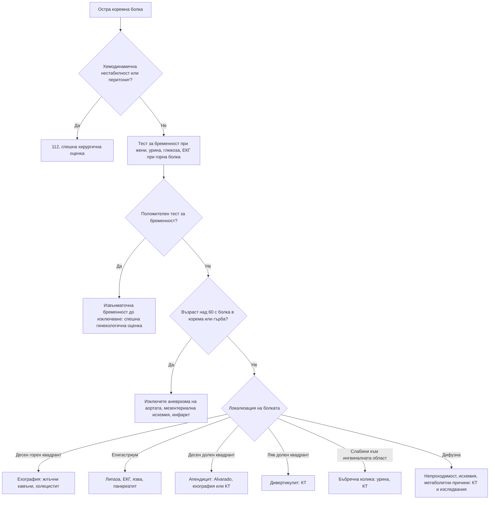

# Глава 19. Остра коремна болка

> **Част V. Храносмилателна система**

## Цели на главата

- Да се обясняват механизмите на висцералната, париеталната и отразената болка.
- Да се използва локализацията на болката за ориентиране в диференциалната диагноза.
- Да се разпознават хирургичните и съдовите спешни състояния, особено при възрастни хора.
- Да се изброяват извънкоремните и системните причини за коремна болка.
- Да се прилагат рационално лабораторните и образните изследвания.

## Ключови моменти

- Висцералната болка е тъпа и по средната линия, париеталната е остра и добре локализирана, а отразената се проектира към рамото, гърба или слабините. Локализацията ориентира диференциалната диагноза.
- Първо се изключват спешните хирургични, съдови и гинекологични състояния: руптура на аневризма на коремната аорта, мезентериална исхемия, перфорация, непроходимост, извънматочна бременност и торзия.
- Всяка жена в детеродна възраст с коремна болка трябва да има тест за бременност *(SORT C [5])*.
- При възрастни хора картината е нетипична. „Първата бъбречна колика“ след 60 години е аневризма на аортата до доказване на противното, а болката, непропорционална на находката, насочва към мезентериална исхемия *(SORT C [3, 4])*.
- Скала на Alvarado под 5 точки прави апендицита малко вероятен *(SORT A [7])*. КТ е най-чувствителното изследване, но първо ехография и КТ при неясен резултат намалява облъчването *(SORT B [8])*.
- Обезболяването, включително с опиоиди, не намалява точността на диагнозата и не бива да се отлага *(SORT A [9])*.

### Първите 60 секунди

- Оценете дишането, пулса, АН, SpO₂, съзнанието и капилярната кръвна захар. При шок или перитонит се обадете на 112.
- Възрастен човек с болка в корема или гърба, хипотония или пулсираща формация: подозрение за руптура на аневризма на аортата – 112 и уведомяване на съдовите хирурзи. Не вливайте големи количества течности [4].
- При всяка жена в детеродна възраст направете тест за бременност веднага [5].
- При болка в горната половина на корема при хора над 40 години или с рискови фактори запишете ЕКГ.
- Обезболете без отлагане [9] и прегледайте херниалните отвори и тестисите.

---

## 1. Патофизиология на коремната болка

*Таблица 19.1. Видове коремна болка и техните механизми.*

| Вид | Механизъм | Характеристики |
|---|---|---|
| **Висцерална** | Разтягане, спазъм или исхемия на кухинен орган; двустранна инервация | Тъпа, трудно локализируема, по средната линия; придружена от гадене, изпотяване, бледност. Органите от предното черво (стомах, дванадесетопръстник, жлъчни пътища, панкреас) дават болка в епигастриума; от средното черво (тънко черво, апендикс, дясно дебело черво) – около пъпа; от задното черво (ляво дебело черво) – в хипогастриума |
| **Париетална (соматична)** | Дразнене на париеталния перитонеум | Остра, добре локализирана, засилва се при движение, кашлица и сътресение; пациентът лежи неподвижно |
| **Отразена** | Общи сегменти на гръбначния мозък | Към рамото (дразнене на диафрагмата – кръв, гной, въздух), към гърба (панкреас, аорта, ретроперитонеум), към слабините и тестиса (уретер) |

**Класически пример** е апендицитът. Отначало болката е висцерална, около пъпа. След това, когато възпалението достигне париеталния перитонеум, тя мигрира в десния долен квадрант.

---

## 2. Диференциална диагноза по локализация

*Таблица 19.2. Диференциална диагноза по локализация.*

| Локализация | Основни причини |
|---|---|
| **Десен горен квадрант** | Жлъчна колика, остър холецистит, холангит, хепатит, чернодробен абсцес, синдром на Budd-Chiari, пептична язва, панкреатит, долнодялова пневмония вдясно, пиелонефрит, бъбречна колика, ретроцекален апендицит (и апендицит при бременност), перихепатит (синдром на Fitz-Hugh-Curtis), херпес зостер, долен миокарден инфаркт |
| **Епигастриум** | Пептична язва и перфорация, гастрит, ГЕРБ, панкреатит, миокарден инфаркт, аневризма на коремната аорта, жлъчна колика, ранен апендицит, карцином на стомаха, мезентериална исхемия |
| **Ляв горен квадрант** | Инфаркт, руптура или абсцес на слезката, гастрит, панкреатит, пиелонефрит, бъбречна колика, долнодялова пневмония вляво, заболявания на лявата флексура на дебелото черво |
| **Около пъпа** | Ранен апендицит, тънкочревна непроходимост, мезентериална исхемия, аневризма на коремната аорта, гастроентерит, пъпна херния |
| **Десен долен квадрант** | Апендицит, болест на Crohn (терминален илеит), мезентериален лимфаденит (*Yersinia*), дивертикулит на Meckel, цекален дивертикулит, извънматочна бременност, торзия или руптура на кисти на яйчника, възпалителна болест на малкия таз, бъбречна колика, ингвинална херния, абсцес на m. psoas, отразена болка от торзия на тестиса, неутропеничен ентероколит |
| **Ляв долен квадрант** | Дивертикулит, запек, колоректален карцином, улцерозен колит, извънматочна бременност, заболявания на яйчника, възпалителна болест на малкия таз, бъбречна колика, херния, волвулус на сигмата, исхемичен колит |
| **Надпубисна област** | Цистит, задръжка на урина, възпалителна болест на малкия таз, ендометрит, извънматочна бременност, дивертикулит |
| **Дифузна** | Перитонит, гастроентерит, чревна непроходимост, мезентериална исхемия, ранен апендицит, руптура на аневризма на коремната аорта, диабетна кетоацидоза, възпалителни болести на червата, синдром на раздразненото черво, метаболитни и системни причини (вж. т. 3) |

---

## 3. Извънкоремни и системни причини

*Таблица 19.3. Извънкоремни и системни причини.*

| Група | Причини |
|---|---|
| **Гръдни** | Долен миокарден инфаркт, долнодялова пневмония, плеврит, белодробна тромбемболия, перикардит |
| **Метаболитни и ендокринни** | Диабетна кетоацидоза, хиперкалциемия, надбъбречна криза, уремия, остра интермитентна порфирия, тиреотоксична криза |
| **Хематологични** | Сърповидноклетъчна криза, остра левкемия, пурпура на Henoch-Schönlein (IgA васкулит) |
| **Токсични** | Отравяне с гъби (зелена мухоморка, *Amanita phalloides* – симптомите започват 6–24 часа след консумацията, вж. глава 79), метанол, олово, спиране на опиоиди, ухапване от каракурт (паяк от род *Latrodectus*, „черна вдовица“) |
| **Неврологични** | Херпес зостер, радикулерна болка от гръдния отдел на гръбначния стълб, абдоминална мигрена (при деца) |
| **Урогенитални** | Торзия на тестиса (при момчета и млади мъже) |
| **Наследствени и автовъзпалителни** | Фамилна средиземноморска треска (периодични пристъпи на треска с перитонит за 1–3 дни; арменски, турски, еврейски и арабски произход); наследствен ангиоедем (пристъпи на коремна болка с оток на чревната стена, кожни отоци без уртикария) |
| **Коремна стена** | Хематом на правия коремен мускул (при антикоагулантна терапия, след кашлица); синдром на притискане на предните кожни нерви (ACNES) |

**Белег на Carnett.** Пациентът повдига главата и раменете от леглото и напряга коремната мускулатура. Ако болезнеността се засилва, източникът е в коремната стена. Ако намалява, източникът е вътрекоремен.

---

## 4. Безопасна диагностична стратегия

*Таблица 19.4. Безопасна диагностична стратегия.*

| Въпрос | Отговор |
|---|---|
| **Вероятна диагноза** | Гастроентерит, неспецифична коремна болка, апендицит, жлъчна колика, бъбречна колика, дивертикулит, запек, инфекция на пикочните пътища, дисменорея |
| **Сериозни заболявания, които не бива да се пропускат** | Руптура на аневризма на коремната аорта; мезентериална исхемия; перфорация на кух орган; чревна непроходимост и инкарцерирана херния; извънматочна бременност; торзия на яйчника или тестиса; остър панкреатит; холангит; апендицит; миокарден инфаркт; диабетна кетоацидоза; перитонит; руптура на слезката |
| **Чести капани** | Бъбречна колика при възрастен (всъщност руптурирала аневризма на аортата); апендицит с нетипична локализация (ретроцекален, тазов, при бременност); мезентериална исхемия с „бедна“ находка; перфорация при пациент, лекуван с кортикостероиди; долнодялова пневмония; херпес зостер преди обрива; торзия на тестиса с болка в корема; диабетна кетоацидоза; порфирия; гъби |
| **Маскиращи заболявания** | Захарен диабет (кетоацидоза), лекарства (НСПВС – язва; опиоиди – запек; антикоагуланти – хематом), инфекция на пикочните пътища, гръбначна дисфункция |
| **Психосоциални аспекти** | Функционална болка, соматизация, насилие (особено при деца и жени), търсене на опиоиди |

---

## 5. Анамнеза

- **Начало:**
  - **внезапно**, за секунди до минути – перфорация, руптура (аневризма, извънматочна бременност), торзия, мезентериална емболия, бъбречна колика;
  - **постепенно**, за часове – възпаление (апендицит, холецистит, дивертикулит, панкреатит).
- **Характер:** коликообразна (обструкция на кухинен орган – черво, уретер) или постоянна (възпаление, исхемия). „Жлъчната колика“ всъщност е постоянна болка с продължителност от 30 минути до 6 часа.
- **Миграция и ирадиация** (т. 1).
- **Повръщане:** повръщане, последвано от болка, насочва към гастроентерит. Болка, последвана от повръщане, насочва към хирургична причина. Жлъчното повръщане означава непроходимост под дуоденалната папила, а фекалоидното – дистална непроходимост.
- **Дефекация:** липса на газове и изпражнения (непроходимост), диария (гастроентерит, но също тазов апендицит и мезентериална исхемия с кървави изпражнения), кръв в изпражненията.
- **Уринарни симптоми.**
- **Гинекологична анамнеза:** последна менструация, контрацепция, течение, сексуална анамнеза, възможност за бременност.
- **Предишни операции** (сраствания), хернии.
- **Лекарства:** НСПВС, аспирин, кортикостероиди (маскират перитонизма), антикоагуланти, опиоиди, метформин, агонисти на GLP-1 рецепторите.
- Алкохол, жлъчнокаменна болест, предсърдно мъждене (емболия), разпространена атеросклероза (мезентериална исхемия, аневризма).
- Консумация на диворастящи гъби, домашно приготвено месо.

---

## 6. Физикален преглед

- **Общ оглед:** неспокоен, сменящ положението си пациент (колика) или неподвижен (перитонит); бледност, изпотяване, жълтеница.
- **Жизнени показатели:** тахикардия, хипотония, треска, тахипнея (ацидоза, сепсис).
- **Оглед на корема:** раздуване, белези от операции, хернии, видима перисталтика, екхимози (белезите на Cullen и Grey Turner при хеморагичен панкреатит).
- **Аускултация:** липсващи шумове (паралитичен илеус, перитонит), високочестотни, „звънтящи“ шумове (механична непроходимост).
- **Перкусия:** тимпанизъм (раздуване от газове); **болезненост при перкусия** (по-надежден белег на перитонеално дразнене от белега на Blumberg).
- **Палпация:** болезненост, дефанс, **ригидност**, белег на Blumberg, белег на Rovsing, псоасов и обтураторен белег, белег на Murphy, пулсираща формация.
- Херниални отвори (ингвинални и феморални) – винаги.
- **Тестиси** при момчета и мъже.
- Ректално туше и гинекологичен преглед при показания.
- **Гръден кош:** пневмония.
- **Болезненост в костовертебралния ъгъл.**

Болка, непропорционална на находката (силна болка при мек корем без перитонеално дразнене), е класическият белег на мезентериалната исхемия.

---

## 7. Червени флагове

- Хемодинамична нестабилност, шок, синкоп.
- Перитонеално дразнене с ригидност на коремната стена.
- Силна болка, която изисква опиоиди, или болка, непропорционална на находката.
- Възрастен пациент с внезапна болка в корема, гърба или слабините, особено с хипотония или пулсираща формация.
- Повръщане със спиране на газовете и изпражненията, раздуване.
- Жлъчно или фекалоидно повръщане.
- Стомашно-чревно кървене.
- Треска с жълтеница (триада на Charcot при холангит).
- Жена в детеродна възраст с болка и закъсняла менструация или вагинално кървене.
- Болка в тестиса.
- Имуносупресия, напреднала възраст, диабет.

---

## 8. Диференциално-диагностична таблица

*Таблица 19.5. Диференциална диагноза на острата коремна болка.*

| Заболяване | Ключови белези | Ключови изследвания |
|---|---|---|
| **Апендицит** | Болка около пъпа, мигрираща в десния долен квадрант; анорексия, гадене, субфебрилитет; болезненост в точката на McBurney, белег на Rovsing, псоасов и обтураторен белег | Левкоцитоза, CRP; скала на Alvarado; ехография (деца, бременни, слаби хора), КТ (възрастни) |
| **Остър холецистит** | Постоянна болка в десния горен квадрант над 6 часа, треска, белег на Murphy | Ехография (задебелена стена, перивезикална течност, ехографски белег на Murphy) |
| **Жлъчна колика** | Епизоди на болка в епигастриума или десния горен квадрант с продължителност 30 min до 6 h, често след мазна храна, с ирадиация към дясната лопатка | Ехография |
| **Холангит** | Треска, жълтеница, болка в десния горен квадрант (триада на Charcot); при хипотония и объркване – пентада на Reynolds | Чернодробни показатели, хемокултури, ехография; спешна ERCP [1] |
| **Остър панкреатит** | Епигастрална болка с ирадиация към гърба, облекчава се при навеждане напред; повръщане | Липаза > 3 пъти над горната граница; ехография (жлъчни камъни); КТ при съмнение за усложнения [2] |
| **Перфорирала пептична язва** | Внезапна силна епигастрална болка, която се разпространява по целия корем; „дъсковиден“ корем | Изправена рентгенография (свободен газ под диафрагмата), КТ |
| **Тънкочревна непроходимост** | Коликообразна болка, повръщане, раздуване, спиране на газовете; сраствания, хернии | Рентгенография (нива), КТ |
| **Дебелочревна непроходимост** | Постепенно раздуване, спиране на газовете, по-късно повръщане; карцином, волвулус | Рентгенография, КТ |
| **Остра мезентериална исхемия** | Възрастен пациент, предсърдно мъждене или атеросклероза, болка, непропорционална на находката, по-късно кървави изпражнения | Лактат (повишава се късно), КТ-ангиография [3] |
| **Руптура на аневризма на коремната аорта** | Възрастен мъж пушач, болка в корема, гърба или слабините, хипотония, пулсираща формация | Ехография на място, КТ при стабилен пациент [4] |
| **Дивертикулит** | Болка в левия долен квадрант, треска, промяна в дефекацията, възраст над 50 години | КТ |
| **Бъбречна колика** | Силна коликообразна болка от слабините към ингвиналната област, неспокойство, хематурия | Урина, безконтрастна КТ, ехография |
| **Извънматочна бременност** | Закъсняла менструация, болка, вагинално кървене, болка в рамото, синкоп | hCG, трансвагинална ехография [5] |
| **Торзия на яйчника** | Внезапна едностранна болка с повръщане, формация в аднексите | Доплерова ехография (нормалният кръвоток не изключва торзия), лапароскопия |
| **Диабетна кетоацидоза** | Полиурия, полидипсия, повръщане, дишане на Kussmaul | Глюкоза, кетони, кръвно-газов анализ |
| **Долен миокарден инфаркт** | Епигастрална болка, гадене, рискови фактори | ЕКГ, тропонин |

### 8.1. Скала на Alvarado (MANTRELS) [6]

*Таблица 19.6. Скала на Alvarado (MANTRELS).*

| Критерий | Точки |
|---|---|
| **M**igration – миграция на болката към десния долен квадрант | 1 |
| **A**norexia – анорексия | 1 |
| **N**ausea – гадене или повръщане | 1 |
| **T**enderness – болезненост в десния долен квадрант | 2 |
| **R**ebound – белег на Blumberg | 1 |
| **E**levation – температура ≥ 37,3 °C | 1 |
| **L**eukocytosis – левкоцити > 10 × 10⁹/l | 2 |
| **S**hift – олевяване (неутрофилия) | 1 |

При ≤ 4 точки апендицитът е малко вероятен. При 5–6 е възможен, при 7–8 вероятен, а при ≥ 9 много вероятен. Скалата е най-полезна за изключване (сбор под 5). При жените тя надценява вероятността за апендицит [7].

---

## 9. Изследвания

- **До леглото на болния:** тест на урината с лента, **тест за бременност** (при всяка жена в детеродна възраст), капилярна глюкоза, ЕКГ (при болка в горната половина на корема при хора над 40 години или с рискови фактори).
- **Кръв:** ПКК, CRP, електролити, креатинин, чернодробни показатели, **липаза**, лактат, венозни кръвни газове, при нужда кръвна група.
- **Образни изследвания:**
  - изправена рентгенография на гръден кош – свободен газ;
  - обзорна рентгенография на корема – ограничена стойност, главно при непроходимост;
  - **ехография** – жлъчни пътища, гинекологична патология, бъбреци, аневризма на аортата, апендицит при деца и бременни;
  - **КТ на корем и таз** – най-чувствителното изследване при възрастни с неясна остра коремна болка. Стратегията „първо ехография, а КТ при отрицателна или неубедителна ехография“ постига най-добра чувствителност при по-малко облъчване [8].

**Обезболяването, включително с опиоиди, не намалява точността на диагнозата** и не бива да се отлага [9].

---

## 10. Особености при специални групи

- **Възрастни хора.** Смъртността е висока, а картината е нетипична. Треската и левкоцитозата често липсват. Особено внимание изискват аневризмата на аортата, мезентериалната исхемия, миокардният инфаркт, дивертикулитът, карциномът с перфорация или непроходимост и волвулусът.
- **Бременни.** Апендицитът се измества нагоре с растежа на матката. Специфични причини са отлепването на плацентата, HELLP синдромът и острата мастна дегенерация на черния дроб (вж. глава 66).
- **Имунокомпрометирани.** Перитонеалните белези са слабо изразени. При неутропения се развива неутропеничен ентероколит.
- **Деца:** вж. глава 70.

---

## 11. Диагностичен алгоритъм

*Фигура 19.1. Диагностичен алгоритъм при остра коремна болка. Схема на авторите въз основа на източниците, цитирани в главата.*

Текстово описание на фигура 19.1

1. Остра коремна болка. Следва: към т. 2.
2. **Въпрос:** Хемодинамична нестабилност или перитонит? Да – към т. 3; Не – към т. 4.
3. 112, спешна хирургична оценка.
4. Тест за бременност при жени, урина, глюкоза, ЕКГ при горна болка. Следва: към т. 5.
5. **Въпрос:** Положителен тест за бременност? Да – към т. 6; Не – към т. 7.
6. Извънматочна бременност до изключване: спешна гинекологична оценка.
7. **Въпрос:** Възраст над 60 с болка в корема или гърба? Да – към т. 8; Не – към т. 9.
8. Изключете аневризма на аортата, мезентериална исхемия, инфаркт.
9. **Въпрос:** Локализация на болката? Десен горен квадрант – към т. 10; Епигастриум – към т. 11; Десен долен квадрант – към т. 12; Ляв долен квадрант – към т. 13; Слабини към ингвиналната област – към т. 14; Дифузна – към т. 15.
10. Ехография: жлъчни камъни, холецистит.
11. Липаза, ЕКГ, язва, панкреатит.
12. Апендицит: Alvarado, ехография или КТ.
13. Дивертикулит: КТ.
14. Бъбречна колика: урина, КТ.
15. Непроходимост, исхемия, метаболитни причини: КТ и изследвания.

---

## 12. Особености в общата практика

- При несигурна диагноза и стабилен пациент **повторният преглед след няколко часа** е ценен диагностичен инструмент. Инструктирайте пациента кога да се върне веднага.
- Не предписвайте антибиотик при недиагностицирана коремна болка. Това може да маскира апендицит и дивертикулит.
- Всяка жена в детеродна възраст трябва да има тест за бременност, дори когато казва, че „не може да е бременна“ [5].
- При момчета и мъже с болка в долната половина на корема прегледайте тестисите.

---

## 13. Кога и колко спешно да насочим

*Таблица 19.7. Кога и колко спешно да насочим.*

| Спешност | Клинична ситуация |
|---|---|
| **Незабавно (112 или спешно отделение)** | Шок, перитонит, подозрение за руптура на аневризма на коремната аорта, мезентериална исхемия, перфорация, чревна непроходимост, инкарцерирана херния, извънматочна бременност, торзия на тестиса или яйчника; холангит с хипотония или объркване; диабетна кетоацидоза |
| **В същия ден** | Вероятен апендицит, остър холецистит, остър панкреатит, дивертикулит с треска или с признаци на усложнение, пиелонефрит с общи прояви; неясна силна болка при възрастен, имунокомпрометиран или диабетик |
| **Бързо (до 2 седмици)** | Коремна болка със загуба на тегло, промяна в дефекацията, анемия или формация (подозрение за карцином) |
| **Планово** | Неусложнена жлъчнокаменна болест (планова холецистектомия); ингвинална херния без признаци на инкарцерация |
| **Проследяване в общата практика** | Гастроентерит; неспецифична коремна болка при стабилен пациент – повторен преглед след няколко часа до 24 часа и ясни указания при влошаване |

---

## 14. Клинични перли

- „Първата бъбречна колика“ след 60-годишна възраст е аневризма на коремната аорта до доказване на противното.
- Силна болка при мек корем и предсърдно мъждене: мезентериална исхемия.
- Кортикостероидите, имуносупресията, възрастта и диабетът маскират перитонеалните белези.
- Не забравяйте херниалните отвори. Малката инкарцерирана феморална херния при възрастна жена лесно се пропуска.
- Болката в рамото при коремна болка означава дразнене на диафрагмата: кръв (извънматочна бременност, руптура на слезката), въздух (перфорация) или гной.
- Коремна болка, повръщане и дишане на Kussmaul: диабетна кетоацидоза, дори при пациент без известен диабет.
- Гастроентерит без диария е подозрителна диагноза.

---

## 15. Клиничен случай

**Етап 1 – клинична картина.** Мъж на 74 години, пушач с хипертония, получава внезапна силна болка в лявата половина на корема и кръста с ирадиация към слабините. Никога не е имал бъбречни камъни. Прималял е в банята. Лекарят в спешния кабинет поставя диагноза „бъбречна колика“, а тестът на урината показва следи кръв.

> **Въпрос 1.** Кое пристрастие застрашава диагнозата?

**Етап 2 – преглед.** АН 102/64 mmHg (обичайно има около 150/90 mmHg), пулс 104/min. При внимателна палпация в корема се опипва пулсираща формация.

> **Въпрос 2.** Коя е най-вероятната диагноза?

> **Въпрос 3.** Какво трябва да се направи незабавно?

Обсъждане и отговори

**Отговор 1.** **Преждевременното затваряне** с диагнозата „бъбречна колика“. Микрохематурията не разграничава бъбречната колика от аневризмата на аортата, защото се среща и при двете.

**Отговор 2.** **Руптурирала аневризма на коремната аорта**: възрастен мъж пушач, внезапна болка в корема, кръста и слабините, синкоп, относителна хипотония, тахикардия и пулсираща формация.

**Отговор 3.** Обаждане на 112 и уведомяване на съдовите хирурзи. Не се вливат големи количества течности (т.нар. пермисивна хипотония) [4]. Ехографията на място потвърждава аневризма от 7 cm. Пациентът е опериран спешно.

**Поука.** При възрастни хора бъбречната колика е диагноза, която се поставя едва след изключване на аневризма на аортата.

---

## Обобщение

- Острата коремна болка е висцерална, париетална или отразена. Локализацията, началото и характерът насочват към причината.
- Първо се изключват хирургичните, съдовите и гинекологичните спешни състояния, както и извънкоремните причини (инфаркт, пневмония, кетоацидоза, торзия на тестиса).
- Изследванията до леглото (тест за бременност, урина, глюкоза, ЕКГ) и кръвните изследвания се допълват с ехография и КТ според клиничната картина.
- Възрастните хора, бременните и имунокомпрометираните имат нетипична картина. При несигурност повторният преглед е ценен диагностичен инструмент.

## Самопроверка

### Въпроси с един верен отговор

**1.** *(основно ниво)* Защо болката в началото на острия апендицит е около пъпа?

- **А.** Защото апендиксът е разположен зад пъпа
- **Б.** Защото висцералната болка от органите на средното черво се усеща около пъпа
- **В.** Защото възпалението дразни париеталния перитонеум
- **Г.** Защото болката е отразена от уретера
- **Д.** Защото се дължи на спазъм на коремната стена

Отговор и обосновка

**Верен отговор: Б.** Апендиксът произхожда от средното черво. Висцералната болка от него е тъпа и се усеща около пъпа. Когато възпалението достигне париеталния перитонеум, болката мигрира в десния долен квадрант. В описва по-късната фаза.

**2.** *(основно ниво)* Жена на 25 години има болка в десния долен квадрант. Последната ѝ менструация е била преди 7 седмици, а сега има оскъдно зацапване. Кое изследване е първо?

- **А.** КТ на корема
- **Б.** Тест за бременност
- **В.** Колоноскопия
- **Г.** Липаза
- **Д.** ЕКГ

Отговор и обосновка

**Верен отговор: Б.** Болката със закъсняла менструация и зацапване е извънматочна бременност до доказване на противното. Първото изследване е тестът за бременност, последван от трансвагинална ехография [5]. А излага възможна бременност на облъчване и забавя диагнозата. В, Г и Д не отговарят на хипотезата.

**3.** *(основно ниво)* Мъж на 22 години има болка, мигрирала от пъпа към десния долен квадрант, анорексия, гадене и болезненост в десния долен квадрант. Белегът на Blumberg е отрицателен, температурата е 37,0 °C, а левкоцитите са 8 × 10⁹/l без олевяване. Какъв е сборът по Alvarado и какво означава?

- **А.** 3 точки – апендицитът е изключен
- **Б.** 5 точки – апендицитът е възможен и е нужна по-нататъшна оценка
- **В.** 7 точки – апендицитът е вероятен
- **Г.** 9 точки – апендицитът е много вероятен
- **Д.** 10 точки – показана е операция без изследвания

Отговор и обосновка

**Верен отговор: Б.** Миграция (1) + анорексия (1) + гадене (1) + болезненост в десния долен квадрант (2) = 5 точки. Сбор 5 и повече не изключва апендицит [7], затова е нужна по-нататъшна оценка (преглед от хирург, ехография или повторен преглед).

**4.** *(напреднало ниво)* Жена на 78 години с предсърдно мъждене има внезапна силна болка около пъпа от 3 часа. Коремът е мек, с минимална болезненост. Лактатът е нормален. Кое е правилното поведение?

- **А.** Нормалният лактат изключва мезентериална исхемия
- **Б.** Спешна КТ-ангиография и хирургична оценка
- **В.** Наблюдение у дома
- **Г.** Колоноскопия
- **Д.** Ехография на жлъчката

Отговор и обосновка

**Верен отговор: Б.** Болката, непропорционална на находката, при предсърдно мъждене е класическа картина на мезентериална емболия. Лактатът се повишава късно, затова нормалната стойност не изключва исхемия. Изследването на избор е КТ-ангиография [3]. А, В, Г и Д забавят диагнозата.

**5.** *(напреднало ниво)* Мъж на 70 години има „първа бъбречна колика“, АН 100/60 mmHg (обичайно 150/90 mmHg) и пулсираща формация в корема. Кое е правилното поведение?

- **А.** Обезболяване и изписване
- **Б.** Интравенозна урография
- **В.** Обаждане на 112 и уведомяване на съдовите хирурзи, без агресивно вливане на течности
- **Г.** Бързо вливане на 3 l физиологичен разтвор
- **Д.** Планова КТ

Отговор и обосновка

**Верен отговор: В.** Картината е руптурирала аневризма на коремната аорта. Необходими са незабавен транспорт и съдова хирургия. Пермисивната хипотония намалява кървенето до операцията [4]. Г може да засили кървенето. А, Б и Д са опасни.

### Задача

Жена на 30 години има остра болка в долната половина на корема от 12 часа. Жизнените ѝ показатели са стабилни. Кои изследвания до леглото ще направите и защо? Какво още е задължително при прегледа?

Решение

**Тест за бременност** – за изключване на извънматочна бременност при всяка жена в детеродна възраст [5]. Тест на урината с лента – инфекция на пикочните пътища, хематурия при бъбречна колика (положителният резултат не изключва апендицит). Капилярна кръвна захар – диабетна кетоацидоза. Жизнени показатели, включително температура. При прегледа са задължителни оценката за перитонеално дразнене, херниалните отвори, болезнеността в костовертебралния ъгъл и при показания – гинекологичен преглед (течение, болезненост при движение на шийката). Ако диагнозата остане неясна, се планира повторен преглед след няколко часа с ясни указания при влошаване.

### OSCE станция: Преглед на корема при остра коремна болка

**Време:** 8 минути. **Ниво:** основно (студенти, специализанти).

**Задача за кандидата.** Мъж на 24 години има болка в корема от 18 часа. Прегледайте корема и обяснете находките и плана.

**Информация за симулирания пациент (за изпитващия).** Болката е започнала около пъпа и се е преместила в десния долен квадрант. Има болезненост в точката на McBurney, положителен белег на Rovsing и болезненост при перкусия. Температурата е 37,8 °C.

*Таблица 19.8. OSCE станция „Преглед на корема при остра коремна болка“ – критерии за оценяване.*

| Критерий | Точки |
|---|---|
| Представя се, иска съгласие, осигурява поверителност и поставя пациента да легне по гръб | 1 |
| Оценява общия вид и жизнените показатели | 1 |
| Оглежда корема (раздуване, белези, херниални отвори) | 1 |
| Палпира първо повърхностно, започвайки далеч от болезненото място | 2 |
| Търси болезненост при перкусия, белег на Rovsing, псоасов и обтураторен белег | 2 |
| Преглежда херниалните отвори и тестисите | 1 |
| Посочва, че ще направи ректално туше при показания | 1 |
| Обобщава находката като вероятен апендицит и предлага спешна хирургична оценка в същия ден | 2 |
| Обяснява на пациента и предлага обезболяване | 1 |
| **Общо** | **12** |

**Праг за успешно изпълнение:** 8 от 12 точки, включително прегледа на херниалните отвори и тестисите.

## Литература

1. Kiriyama S, Kozaka K, Takada T, Strasberg SM, Pitt HA, Gabata T, et al. Tokyo Guidelines 2018: diagnostic criteria and severity grading of acute cholangitis (with videos). J Hepatobiliary Pancreat Sci. 2018;25(1):17-30. doi:10.1002/jhbp.512. PMID: 29032610.
2. Banks PA, Bollen TL, Dervenis C, Gooszen HG, Johnson CD, Sarr MG, et al. Classification of acute pancreatitis--2012: revision of the Atlanta classification and definitions by international consensus. Gut. 2013;62(1):102-11. doi:10.1136/gutjnl-2012-302779. PMID: 23100216.
3. Koelemay MJ, Geelkerken RH, Kärkkäinen J, Leone N, Antoniou GA, de Bruin JL, et al. Editor's Choice - European Society for Vascular Surgery (ESVS) 2025 Clinical Practice Guidelines on the Management of Diseases of the Mesenteric and Renal Arteries and Veins. Eur J Vasc Endovasc Surg. 2025;70(2):153-218. doi:10.1016/j.ejvs.2025.06.010. PMID: 40513642.
4. Wanhainen A, Van Herzeele I, Bastos Goncalves F, Bellmunt Montoya S, Berard X, Boyle JR, et al. Editor's Choice -- European Society for Vascular Surgery (ESVS) 2024 Clinical Practice Guidelines on the Management of Abdominal Aorto-Iliac Artery Aneurysms. Eur J Vasc Endovasc Surg. 2024;67(2):192-331. doi:10.1016/j.ejvs.2023.11.002. PMID: 38307694.
5. National Institute for Health and Care Excellence. Ectopic pregnancy and miscarriage: diagnosis and initial management (NICE guideline NG126). London: NICE; 2019 [актуализирано 2026]. Достъпно на: https://www.nice.org.uk/guidance/ng126
6. Alvarado A. A practical score for the early diagnosis of acute appendicitis. Ann Emerg Med. 1986;15(5):557-64. doi:10.1016/s0196-0644(86)80993-3. PMID: 3963537.
7. Ohle R, O'Reilly F, O'Brien KK, Fahey T, Dimitrov BD. The Alvarado score for predicting acute appendicitis: a systematic review. BMC Med. 2011;9:139. doi:10.1186/1741-7015-9-139. PMID: 22204638.
8. Laméris W, van Randen A, van Es HW, van Heesewijk JP, van Ramshorst B, Bouma WH, et al. Imaging strategies for detection of urgent conditions in patients with acute abdominal pain: diagnostic accuracy study. BMJ. 2009;338:b2431. doi:10.1136/bmj.b2431. PMID: 19561056.
9. Manterola C, Vial M, Moraga J, Astudillo P. Analgesia in patients with acute abdominal pain. Cochrane Database Syst Rev. 2011;2011(1):CD005660. doi:10.1002/14651858.CD005660.pub3. PMID: 21249672.

*Последна проверка на съдържанието: септември 2026 г. Следващ планиран преглед: септември 2027 г. (вж. „Политика за актуализация“ в README).*

<!-- навигация -->

---

[← Глава 18. Плеврален излив, белодробни възли и интерстициални промени](18-plevralen-izliv-belodrobni-vazli.md) · [Съдържание](../README.md) · [Глава 20. Хронична и рецидивираща коремна болка →](20-hronichna-koremna-bolka.md)
