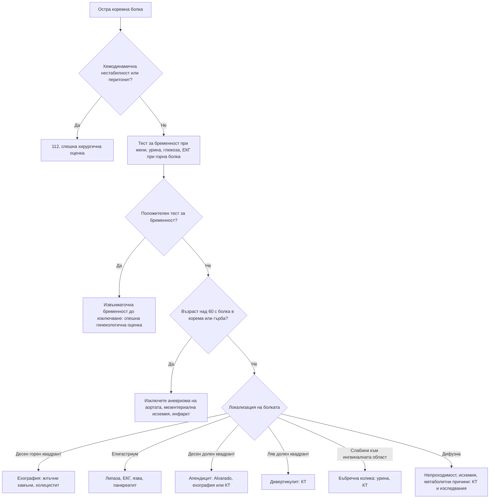

# Глава 19. Остра коремна болка

> **Част V. Храносмилателна система**

## Цели на главата

- Да се разбират механизмите на висцералната, париеталната и отразената болка.
- Да се използва локализацията на болката за ориентиране в диференциалната диагноза.
- Да се разпознават хирургичните и съдовите спешни състояния, особено при възрастни хора.
- Да се помнят извънкоремните причини за коремна болка.
- Да се прилагат рационално лабораторните и образните изследвания.

---

## 1. Патофизиология на коремната болка

| Вид | Механизъм | Характеристики |
|---|---|---|
| **Висцерална** | Разтягане, спазъм или исхемия на кухинен орган; двустранна инервация | Тъпа, трудно локализируема, по средната линия; придружена от гадене, изпотяване, бледност. Органите от предното черво (стомах, дванадесетопръстник, жлъчни пътища, панкреас) дават болка в епигастриума; от средното черво (тънко черво, апендикс, дясно дебело черво) — около пъпа; от задното черво (ляво дебело черво) — в хипогастриума |
| **Париетална (соматична)** | Дразнене на париеталния перитонеум | Остра, добре локализирана, засилва се при движение, кашлица и сътресение; пациентът лежи неподвижно |
| **Отразена** | Общи сегменти на гръбначния мозък | Към рамото (дразнене на диафрагмата — кръв, гной, въздух), към гърба (панкреас, аорта, ретроперитонеум), към слабините и тестиса (уретер) |

**Класически пример** е апендицитът. Отначало болката е висцерална, около пъпа. След това, когато възпалението достигне париеталния перитонеум, тя мигрира в десния долен квадрант.

---

## 2. Диференциална диагноза по локализация

| Локализация | Основни причини |
|---|---|
| **Десен горен квадрант** | Жлъчна колика, остър холецистит, холангит, хепатит, чернодробен абсцес, синдром на Budd-Chiari, пептична язва, панкреатит, долнодялова пневмония вдясно, пиелонефрит, бъбречна колика, ретроцекален апендицит (и апендицит при бременност), перихепатит (синдром на Fitz-Hugh-Curtis), херпес зостер, долен миокарден инфаркт |
| **Епигастриум** | Пептична язва и перфорация, гастрит, ГЕРБ, **панкреатит**, **миокарден инфаркт**, **аневризма на коремната аорта**, жлъчна колика, ранен апендицит, карцином на стомаха, мезентериална исхемия |
| **Ляв горен квадрант** | Инфаркт, руптура или абсцес на слезката, гастрит, панкреатит, пиелонефрит, бъбречна колика, долнодялова пневмония вляво, заболявания на лявата флексура на дебелото черво |
| **Около пъпа** | Ранен апендицит, тънкочревна непроходимост, **мезентериална исхемия**, аневризма на коремната аорта, гастроентерит, пъпна херния |
| **Десен долен квадрант** | **Апендицит**, болест на Crohn (терминален илеит), мезентериален лимфаденит (*Yersinia*), дивертикулит на Meckel, цекален дивертикулит, **извънматочна бременност**, **торзия** или руптура на кисти на яйчника, възпалителна болест на малкия таз, бъбречна колика, ингвинална херния, абсцес на m. psoas, отразена болка от торзия на тестиса, неутропеничен ентероколит |
| **Ляв долен квадрант** | **Дивертикулит**, запек, колоректален карцином, улцерозен колит, извънматочна бременност, заболявания на яйчника, възпалителна болест на малкия таз, бъбречна колика, херния, волвулус на сигмата, исхемичен колит |
| **Надпубисна област** | Цистит, **задръжка на урина**, възпалителна болест на малкия таз, ендометрит, извънматочна бременност, дивертикулит |
| **Дифузна** | Перитонит, гастроентерит, чревна непроходимост, мезентериална исхемия, ранен апендицит, руптура на аневризма на коремната аорта, диабетна кетоацидоза, възпалителни болести на червата, синдром на раздразненото черво, метаболитни и системни причини (вж. т. 3) |

---

## 3. Извънкоремни и системни причини

| Група | Причини |
|---|---|
| **Гръдни** | Долен миокарден инфаркт, долнодялова пневмония, плеврит, белодробна тромбемболия, перикардит |
| **Метаболитни и ендокринни** | **Диабетна кетоацидоза**, хиперкалциемия, надбъбречна криза, уремия, остра интермитентна порфирия, тиреотоксична криза |
| **Хематологични** | Сърповидноклетъчна криза, остра левкемия, пурпура на Henoch-Schönlein (IgA васкулит) |
| **Токсични** | **Отравяне с гъби** (*Amanita phalloides* — симптомите започват 6–12 часа след консумацията), метанол, олово, спиране на опиоиди, ухапване от паяк „черна вдовица“ |
| **Неврологични** | Херпес зостер, радикулерна болка от гръдния отдел на гръбначния стълб, абдоминална мигрена (при деца) |
| **Урогенитални** | **Торзия на тестиса** (при момчета и млади мъже) |
| **Наследствени и автовъзпалителни** | **Фамилна средиземноморска треска** (периодични пристъпи на треска с перитонит за 1–3 дни; арменски, турски, еврейски и арабски произход); **наследствен ангиоедем** (пристъпи на коремна болка с оток на чревната стена, кожни отоци без уртикария) |
| **Коремна стена** | **Хематом на правия коремен мускул** (при антикоагулантна терапия, след кашлица); синдром на притискане на предните кожни нерви (ACNES) |

**Белег на Carnett.** Пациентът повдига главата и раменете от леглото и напряга коремната мускулатура. Ако болезнеността се **засилва**, източникът е в коремната стена. Ако **намалява**, е вътрекоремен.

---

## 4. Безопасна диагностична стратегия

| Въпрос | Отговор |
|---|---|
| **Вероятна диагноза** | Гастроентерит, неспецифична коремна болка, апендицит, жлъчна колика, бъбречна колика, дивертикулит, запек, инфекция на пикочните пътища, дисменорея |
| **Сериозни заболявания, които не бива да се пропускат** | **Руптура на аневризма на коремната аорта**; **мезентериална исхемия**; перфорация на кух орган; **чревна непроходимост** и **инкарцерирана херния**; **извънматочна бременност**; торзия на яйчника или тестиса; остър панкреатит; холангит; апендицит; миокарден инфаркт; диабетна кетоацидоза; перитонит; руптура на слезката |
| **Чести капани** | Бъбречна колика при възрастен (всъщност руптурирала аневризма на аортата); апендицит с нетипична локализация (ретроцекален, тазов, при бременност); мезентериална исхемия с „бедна“ находка; перфорация при пациент на кортикостероиди; долнодялова пневмония; херпес зостер преди обрива; торзия на тестиса с болка в корема; диабетна кетоацидоза; порфирия; гъби |
| **Маскиращи заболявания** | Захарен диабет (кетоацидоза), лекарства (НСПВС — язва; опиоиди — запек; антикоагуланти — хематом), инфекция на пикочните пътища, гръбначна дисфункция |
| **Психосоциални аспекти** | Функционална болка, соматизация, насилие (особено при деца и жени), търсене на опиоиди |

---

## 5. Анамнеза

- **Начало:**
  - **внезапно**, за секунди до минути — перфорация, руптура (аневризма, извънматочна бременност), торзия, мезентериална емболия, бъбречна колика;
  - **постепенно**, за часове — възпаление (апендицит, холецистит, дивертикулит, панкреатит).
- **Характер:** коликообразна (обструкция на кухинен орган — черво, уретер) или постоянна (възпаление, исхемия). „Жлъчната колика“ всъщност е постоянна болка с продължителност от 30 минути до 6 часа.
- **Миграция и ирадиация** (т. 1).
- **Повръщане:** повръщане, последвано от болка, насочва към гастроентерит. Болка, последвана от повръщане, насочва към хирургична причина. Жлъчното повръщане означава непроходимост под дуоденалната папила, а фекалоидното — дистална непроходимост.
- **Дефекация:** липса на газове и изпражнения (непроходимост), диария (гастроентерит, но също тазов апендицит и мезентериална исхемия с кървави изпражнения), кръв в изпражненията.
- **Уринарни симптоми.**
- **Гинекологична анамнеза:** последна менструация, контрацепция, течение, сексуална анамнеза, възможност за бременност.
- **Предишни операции** (сраствания), херниите.
- **Лекарства:** НСПВС, аспирин, кортикостероиди (маскират перитонизма), антикоагуланти, опиоиди, метформин, GLP-1 агонисти.
- **Алкохол**, жлъчнокаменна болест, **предсърдно мъждене** (емболия), разпространена атеросклероза (мезентериална исхемия, аневризма).
- Консумация на диворастящи гъби, домашно приготвено месо.

---

## 6. Физикален преглед

- **Общ оглед:** неспокоен, сменящ положението си пациент (колика) или неподвижен (перитонит); бледност, изпотяване, жълтеница.
- **Жизнени показатели:** тахикардия, хипотония, треска, тахипнея (ацидоза, сепсис).
- **Оглед на корема:** раздуване, белези от операции, херниите, видима перисталтика, екхимози (белезите на Cullen и Grey Turner при хеморагичен панкреатит).
- **Аускултация:** липсващи шумове (паралитичен илеус, перитонит), високочестотни, „звънтящи“ шумове (механична непроходимост).
- **Перкусия:** тимпанизъм (раздуване от газове); **болезненост при перкусия** (по-надежден белег на перитонеално дразнене от белега на Blumberg).
- **Палпация:** болезненост, дефанс, **ригидност**, белег на Blumberg, белег на Rovsing, псоасов и обтураторен белег, белег на Murphy, пулсираща формация.
- **Херниални отвори** (ингвинални и феморални) — **винаги**.
- **Тестиси** при момчета и мъже.
- **Ректално туше** и **гинекологичен преглед** при показания.
- **Гръден кош:** пневмония.
- **Болезненост в костовертебралния ъгъл.**

**Болка, непропорционална на находката** (силна болка при мек корем без перитонеално дразнене), е класическият белег на **мезентериалната исхемия**.

---

## 7. Червени флагове

- Хемодинамична нестабилност, шок, синкоп.
- Перитонеално дразнене с ригидност на коремната стена.
- Силна болка, която изисква опиоиди, или болка, непропорционална на находката.
- Възрастен пациент с внезапна болка в корема, гърба или слабините, особено с хипотония или пулсираща формация.
- Повръщане със спиране на газовете и изпражненията, раздуване.
- Жлъчно или фекалоидно повръщане.
- Стомашно-чревно кървене.
- Треска с жълтеница (триада на Charcot при холангит).
- Жена в детеродна възраст с болка и закъсняла менструация или вагинално кървене.
- Болка в тестиса.
- Имуносупресия, напреднала възраст, диабет.

---

## 8. Диференциално-диагностична таблица

| Заболяване | Ключови белези | Ключови изследвания |
|---|---|---|
| **Апендицит** | Болка около пъпа, мигрираща в десния долен квадрант; анорексия, гадене, субфебрилитет; болезненост в точката на McBurney, белези на Rovsing, psoas, obturator | Левкоцитоза, CRP; скала на Alvarado; ехография (деца, бременни, слаби хора), КТ (възрастни) |
| **Остър холецистит** | Постоянна болка в десния горен квадрант над 6 часа, треска, белег на Murphy | Ехография (задебелена стена, перивезикална течност, ехографски белег на Murphy) |
| **Жлъчна колика** | Епизоди на болка в епигастриума или десния горен квадрант с продължителност 30 min до 6 h, често след мазна храна, с ирадиация към дясната лопатка | Ехография |
| **Холангит** | Треска, жълтеница, болка в десния горен квадрант (триада на Charcot); при хипотония и объркване — пентада на Reynolds | Чернодробни показатели, хемокултури, ехография; спешна ERCP |
| **Остър панкреатит** | Епигастрална болка с ирадиация към гърба, облекчава се при навеждане напред; повръщане | Липаза > 3 пъти над горната граница; ехография (жлъчни камъни); КТ при съмнение за усложнения |
| **Перфорирала пептична язва** | Внезапна силна епигастрална болка, която се разпространява по целия корем; „дъсковиден“ корем | Изправена рентгенография (свободен газ под диафрагмата), КТ |
| **Тънкочревна непроходимост** | Коликообразна болка, повръщане, раздуване, спиране на газовете; сраствания, херниите | Рентгенография (нива), КТ |
| **Дебелочревна непроходимост** | Постепенно раздуване, спиране на газовете, по-късно повръщане; карцином, волвулус | Рентгенография, КТ |
| **Остра мезентериална исхемия** | Възрастен пациент, предсърдно мъждене или атеросклероза, болка, непропорционална на находката, по-късно кървави изпражнения | Лактат (повишава се късно), **КТ-ангиография** |
| **Руптура на аневризма на коремната аорта** | Възрастен мъж пушач, болка в корема, гърба или слабините, хипотония, пулсираща формация | Ехография на място, КТ при стабилен пациент |
| **Дивертикулит** | Болка в левия долен квадрант, треска, промяна в дефекацията, възраст над 50 години | КТ |
| **Бъбречна колика** | Силна коликообразна болка от слабините към ингвиналната област, неспокойство, хематурия | Урина, **безконтрастна КТ**, ехография |
| **Извънматочна бременност** | Закъсняла менструация, болка, вагинално кървене, болка в рамото, синкоп | **hCG**, трансвагинална ехография |
| **Торзия на яйчника** | Внезапна едностранна болка с повръщане, формация в аднексите | Доплерова ехография (нормалният кръвоток не изключва торзия), лапароскопия |
| **Диабетна кетоацидоза** | Полиурия, полидипсия, повръщане, дишане на Kussmaul | Глюкоза, кетони, кръвно-газов анализ |
| **Долен миокарден инфаркт** | Епигастрална болка, гадене, рискови фактори | ЕКГ, тропонин |

### 8.1. Скала на Alvarado (MANTRELS)

| Критерий | Точки |
|---|---|
| **M**igration — миграция на болката към десния долен квадрант | 1 |
| **A**norexia — анорексия | 1 |
| **N**ausea — гадене или повръщане | 1 |
| **T**enderness — болезненост в десния долен квадрант | 2 |
| **R**ebound — белег на Blumberg | 1 |
| **E**levation — температура ≥ 37,3 °C | 1 |
| **L**eukocytosis — левкоцити > 10 × 10⁹/l | 2 |
| **S**hift — олевяване (неутрофилия) | 1 |

При ≤ 4 точки апендицитът е малко вероятен. При 5–6 е възможен, при 7–8 вероятен, а при ≥ 9 много вероятен.

---

## 9. Изследвания

- **До леглото на болния:** тест на урината с лента, **тест за бременност** (при всяка жена в детеродна възраст), капилярна глюкоза, ЕКГ (при болка в горната половина на корема при хора над 40 години или с рискови фактори).
- **Кръв:** ПКК, CRP, електролити, креатинин, чернодробни показатели, **липаза**, лактат, венозни кръвни газове, при нужда кръвна група.
- **Образни изследвания:**
  - изправена рентгенография на гръден кош — свободен газ;
  - обзорна рентгенография на корема — ограничена стойност, главно при непроходимост;
  - **ехография** — жлъчни пътища, гинекологична патология, бъбреци, аневризма на аортата, апендицит при деца и бременни;
  - **КТ на корем и таз** — най-информативното изследване при възрастни с неясна остра коремна болка.

**Обезболяването, включително с опиоиди, не намалява точността на диагнозата** и не бива да се отлага.

---

## 10. Особености при специални групи

- **Възрастни хора.** Смъртността е висока, а картината е нетипична. Треската и левкоцитозата често липсват. Особено внимание изискват аневризмата на аортата, мезентериалната исхемия, миокардният инфаркт, дивертикулитът, карциномът с перфорация или непроходимост и волвулусът.
- **Бременни.** Апендицитът се измества нагоре с растежа на матката. Специфични причини са отлепването на плацентата, HELLP синдромът и острата мастна дегенерация на черния дроб (вж. глава 66).
- **Имунокомпрометирани.** Перитонеалните белези са слабо изразени. При неутропения се развива неутропеничен ентероколит.
- **Деца:** вж. глава 70.

---

## 11. Диагностичен алгоритъм

---

## 12. Особености в общата практика

- При несигурна диагноза и стабилен пациент **повторният преглед след няколко часа** е ценен диагностичен инструмент. Инструктирайте пациента кога да се върне веднага.
- Не предписвайте антибиотик при недиагностицирана коремна болка. Това може да маскира апендицит и дивертикулит.
- Всяка жена в детеродна възраст трябва да има тест за бременност, дори когато казва, че „не може да е бременна“.
- При момчета и мъже с болка в долната половина на корема прегледайте тестисите.

---

## 13. Клинични перли

- „Първата бъбречна колика“ след 60-годишна възраст е аневризма на коремната аорта, докато не се докаже противното.
- Силна болка при мек корем и предсърдно мъждене: мезентериална исхемия.
- Кортикостероидите, имуносупресията, възрастта и диабетът маскират перитонеалните белези.
- Не забравяйте херниалните отвори. Малката инкарцерирана феморална херния при възрастна жена лесно се пропуска.
- Болката в рамото при коремна болка означава дразнене на диафрагмата: кръв (извънматочна бременност, руптура на слезката), въздух (перфорация) или гной.
- Коремна болка, повръщане и дишане на Kussmaul: диабетна кетоацидоза, дори при пациент без известен диабет.
- Гастроентерит без диария е подозрителна диагноза.

---

## 14. Клиничен случай

**Случай.** Мъж на 74 години, пушач с хипертония, получава внезапна силна болка в лявата половина на корема и кръста с ирадиация към слабините. Никога не е имал бъбречни камъни. Прималял е в банята. Лекарят в спешния кабинет поставя диагноза „бъбречна колика“, а тестът на урината показва следи кръв. АН 102/64 mmHg (обичайно има около 150/90 mmHg), пулс 104/min. При внимателна палпация в корема се опипва пулсираща формация.

**Въпроси.** 1) Какво пристрастие застрашава диагнозата? 2) Какво трябва да се направи незабавно?

**Обсъждане.** Картината е типична за **руптурирала аневризма на коремната аорта**: възрастен мъж пушач, внезапна болка в корема, кръста и слабините, синкоп, относителна хипотония и тахикардия, пулсираща формация. Микрохематурията не разграничава двете състояния, защото се среща и при аневризма. Опасността е **преждевременното затваряне** с диагнозата „бъбречна колика“. Лекарят се обажда на 112 и уведомява съдовите хирурзи. Не бива да се вливат големи количества течности (т.нар. пермисивна хипотония). Ехографията на място потвърждава аневризма от 7 cm. Пациентът е опериран спешно.

**Поука.** При възрастни хора бъбречната колика е диагноза, която се поставя едва след изключване на аневризма на аортата.

<!-- навигация -->

---

[← Глава 18. Плеврален излив, белодробни възли и интерстициални промени](18-plevralen-izliv-belodrobni-vazli.md) · [Съдържание](../README.md) · [Глава 20. Хронична и рецидивираща коремна болка →](20-hronichna-koremna-bolka.md)
