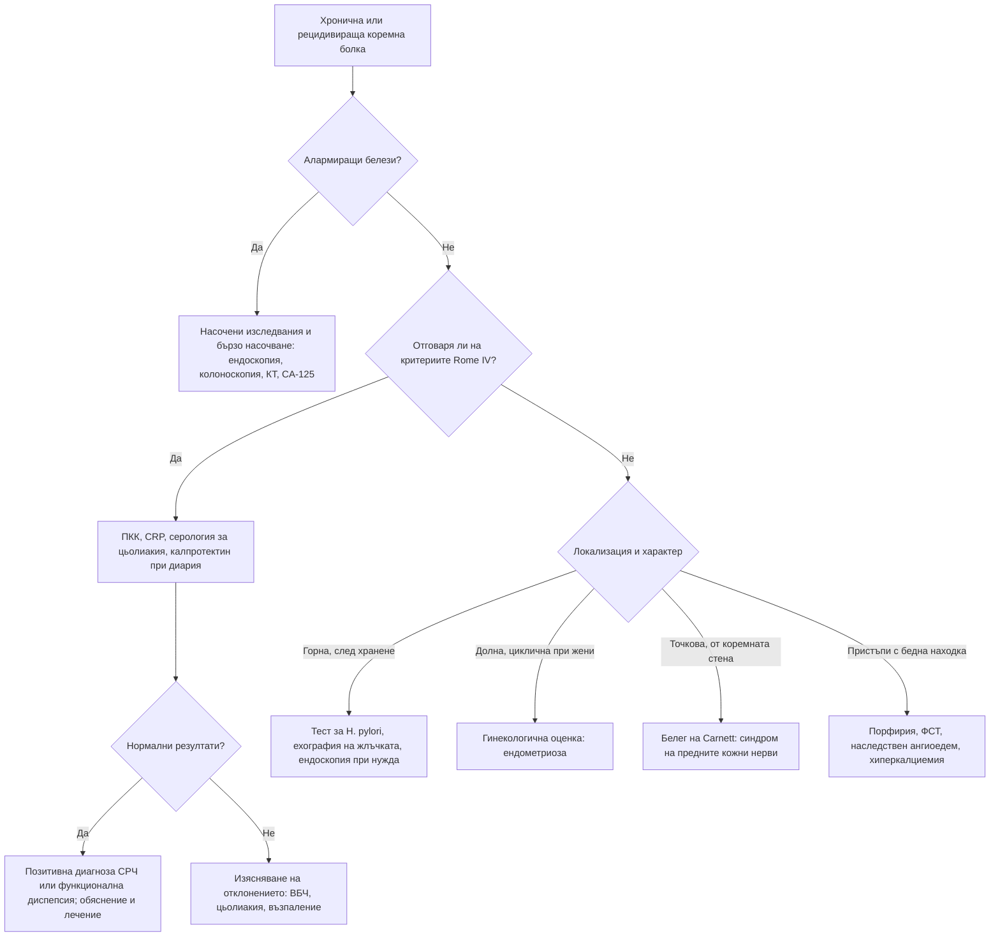

# Глава 20. Хронична и рецидивираща коремна болка

> **Част V. Храносмилателна система**

## Цели на главата

- Да се разграничават функционалните от органичните причини за хронична коремна болка.
- Да се прилагат позитивните диагностични критерии (Rome IV) за синдрома на раздразненото черво и функционалната диспепсия.
- Да се разпознават алармиращите белези, които налагат изследване.
- Да се използват рационално фекалният калпротектин, серологията за цьолиакия и CA-125.
- Да се познават редките, но важни причини за рецидивираща коремна болка.

---

## 1. Въведение

Хроничната коремна болка продължава над 3–6 месеца. Рецидивиращата се проявява с пристъпи и безсимптомни интервали. В общата практика най-честите причини са **функционалните** нарушения на взаимодействието между червата и мозъка: синдромът на раздразненото черво (СРЧ) и функционалната диспепсия. Те не са „диагноза чрез изключване“. Имат **позитивни диагностични критерии** и се поставят след разумно изключване на органичните заболявания според алармиращите белези.

---

## 2. Етиологична класификация

| Група | Заболявания |
|---|---|
| **Функционални** | Синдром на раздразненото черво, функционална диспепсия, функционално подуване, централно медиирана коремна болка, функционално нарушение на жлъчния мехур, синдром на циклично повръщане |
| **Горен стомашно-чревен тракт** | Пептична язва, гастрит с *Helicobacter pylori*, ГЕРБ, карцином на стомаха, гастропареза |
| **Жлъчни пътища и панкреас** | Жлъчнокаменна болест, хроничен панкреатит (алкохол, тютюнопушене; стеаторея, диабет, калцификати), карцином на панкреаса |
| **Тънко черво** | **Цьолиакия**, болест на Crohn, свръхрастеж на бактерии в тънкото черво, лактозна непоносимост, лямблиоза, НСПВС ентеропатия, хронична мезентериална исхемия |
| **Дебело черво** | Улцерозен колит, **микроскопски колит**, колоректален карцином, дивертикулна болест, хроничен запек, диария от жлъчни киселини |
| **Гинекологични** | **Ендометриоза**, аденомиоза, **карцином на яйчника** (подуване), хронична възпалителна болест на малкия таз, сраствания, венозен застой в малкия таз |
| **Урологични** | Интерстициален цистит (синдром на болезнения пикочен мехур), нефролитиаза |
| **Съдови** | **Хронична мезентериална исхемия** („коремна ангина“ — болка след хранене, страх от храна, загуба на тегло), синдром на медиалния дъговиден лигамент, синдром на горната мезентериална артерия, аневризма на аортата |
| **Коремна стена** | **Синдром на притискане на предните кожни нерви** (положителен белег на Carnett), херниите (включително херния на Spiegel), белези от операции |
| **Метаболитни и системни** | Хиперкалциемия, надбъбречна недостатъчност, диабетна радикулопатия, **остра интермитентна порфирия**, **фамилна средиземноморска треска**, **наследствен ангиоедем**, отравяне с олово, IgA васкулит, еозинофилен гастроентерит |
| **Лекарства** | НСПВС, опиоиди (синдром на наркотичните черва — парадоксално засилване на болката при увеличаване на дозата), метформин, GLP-1 агонисти, желязо, бисфосфонати |
| **Неврологични** | Радикулерна болка от гръдния отдел, постхерпесна невралгия, абдоминална мигрена |
| **Психосоциални** | Депресия, тревожност, соматизация, анамнеза за насилие (особено сексуално) |

---

## 3. Безопасна диагностична стратегия

| Въпрос | Отговор |
|---|---|
| **Вероятна диагноза** | Синдром на раздразненото черво, функционална диспепсия, хроничен запек, ГЕРБ, жлъчнокаменна болест |
| **Сериозни заболявания, които не бива да се пропускат** | Колоректален карцином, карцином на стомаха и панкреаса, **карцином на яйчника**, възпалителни болести на червата, хронична мезентериална исхемия, аневризма на аортата |
| **Чести капани** | **Цьолиакия**, **микроскопски колит**, диария от жлъчни киселини, лямблиоза, ендометриоза, болка от коремната стена, лекарства (опиоиди, НСПВС), хиперкалциемия, свръхрастеж на бактерии, лактозна непоносимост |
| **Маскиращи заболявания** | Депресия, захарен диабет (гастропареза, радикулопатия), лекарства, гръбначна дисфункция, хиперкалциемия |
| **Психосоциални аспекти** | Тревожност, депресия, насилие, соматизация, нарушен сън |

---

## 4. Синдром на раздразненото черво: критерии Rome IV

**Рецидивираща коремна болка** средно поне **1 ден седмично** през последните 3 месеца, свързана с **поне два** от следните белези:

1. връзка с дефекацията (засилване или облекчаване);
2. промяна в **честотата** на дефекацията;
3. промяна във **формата** (консистенцията) на изпражненията.

Критериите трябва да са изпълнени през последните 3 месеца, а симптомите да са започнали поне 6 месеца преди поставяне на диагнозата.

**Подтипове** по преобладаващата консистенция (Бристолска скала): СРЧ със запек, СРЧ с диария, смесен тип и некласифициран тип.

**Белези, подкрепящи диагнозата:** подуване, усещане за непълно изпразване, слуз в изпражненията, връзка със стрес и с хранене, начало в млада възраст, съпътстващи функционални синдроми (фибромиалгия, хронична умора, главоболие).

## 5. Функционална диспепсия: критерии Rome IV

Един или повече от следните симптоми, без структурно заболяване (включително при ендоскопия):

- обременяваща пълнота след хранене;
- ранно засищане;
- епигастрална болка;
- епигастрално парене.

Разграничават се **постпрандиален дистрес синдром** (пълнота и ранно засищане) и **синдром на епигастрална болка**.

---

## 6. Алармиращи белези

- Начало след 50-годишна възраст.
- Необяснима загуба на тегло.
- Стомашно-чревно кървене, желязодефицитна анемия.
- Дисфагия, упорито повръщане.
- Палпируема формация в корема, асцит.
- Жълтеница.
- **Нощни симптоми**, които събуждат пациента (болка, диария).
- Треска.
- Фамилна анамнеза за колоректален карцином, възпалителни болести на червата, цьолиакия или карцином на яйчника.
- Прогресиращи симптоми, скорошна промяна в дефекацията след 50-годишна възраст.
- Отклонения в изследванията: анемия, повишени възпалителни показатели, хипоалбуминемия, положителен FIT.

---

## 7. Диференциално-диагностична таблица

| Заболяване | Ключови белези | Ключови изследвания |
|---|---|---|
| **Синдром на раздразненото черво** | Критерии Rome IV, липса на алармиращи белези, млада възраст | Нормални ПКК, CRP, серология за цьолиакия, калпротектин |
| **Болест на Crohn** | Болка в десния долен квадрант, диария, загуба на тегло, перианални фистули, афти в устата, треска, извънчревни прояви | CRP, **калпротектин**, колоноскопия с илеоскопия, МР ентерография |
| **Улцерозен колит** | Кървава диария, тенезми, спешност на дефекацията | Калпротектин, колоноскопия |
| **Цьолиакия** | Диария или запек, подуване, желязодефицит, остеопороза, херпетиформен дерматит | Тъканна трансглутаминаза IgA и общ IgA, дуоденална биопсия |
| **Микроскопски колит** | Водниста, често нощна диария, възрастни жени, НСПВС, ИПП, SSRI | Колоноскопия с **множество биопсии** (макроскопски лигавицата е нормална) |
| **Пептична язва** | Епигастрална болка, свързана с храненето, нощна болка, НСПВС | Тест за *H. pylori*, ендоскопия |
| **Жлъчнокаменна болест** | Епизоди на болка в десния горен квадрант с продължителност от 30 min до няколко часа | Ехография |
| **Хроничен панкреатит** | Епигастрална болка към гърба, алкохол, стеаторея, диабет | Фекална еластаза, КТ (калцификати) |
| **Карцином на панкреаса** | Болка към гърба, загуба на тегло, жълтеница, новооткрит диабет | КТ по панкреатичен протокол |
| **Карцином на яйчника** | **Персистиращо подуване**, ранно засищане, тазова болка, често уриниране при жени над 50 години | **CA-125**, трансвагинална ехография |
| **Ендометриоза** | Циклична тазова болка, дисменорея, диспареуния, дисхезия, безплодие | Трансвагинална ехография, ЯМР, лапароскопия |
| **Хронична мезентериална исхемия** | Болка 15–60 минути след хранене, страх от храна, загуба на тегло, атеросклероза | КТ-ангиография |
| **Синдром на притискане на предните кожни нерви** | Точкова болезненост по ръба на правия коремен мускул, положителен белег на Carnett | Локална инфилтрация с анестетик (диагностична и лечебна) |
| **Остра интермитентна порфирия** | Млади жени, силна коремна болка с бедна находка, психични симптоми, невропатия, хипонатриемия, тъмна урина, провокация от лекарства | Порфобилиноген в урината (по време на пристъп) |
| **Фамилна средиземноморска треска** | Пристъпи на треска и перитонит за 1–3 дни, плеврит, артрит, етнически произход | Клинична диагноза, генетичен тест (MEFV) |
| **Наследствен ангиоедем** | Пристъпи на коремна болка и кожни отоци без уртикария, фамилна анамнеза | C4 (понижен), C1-инхибитор (количество и функция) |

---

## 8. Изследвания

**Основен набор при симптоми, съвместими със СРЧ:**

- ПКК, CRP или СУЕ;
- тъканна трансглутаминаза IgA и общ IgA;
- **фекален калпротектин** при диария:
  - < 50 µg/g — възпалителна болест на червата е малко вероятна;
  - 50–200 µg/g — сива зона, изследването се повтаря;
  - > 200 µg/g — насочване за колоноскопия;
- **FIT** при възраст над 50 години или при алармиращи белези;
- **CA-125** при жени (особено над 50 години) с персистиращо подуване, ранно засищане или тазова болка;
- изследване на изпражненията за *Giardia* при диария.

**Допълнително според клиничните данни:** ТСХ, калций, чернодробни показатели, липаза, ехография на корема, тест за *H. pylori* (уреазен дихателен тест или фекален антиген), ендоскопия, колоноскопия, дихателни тестове (лактоза, свръхрастеж на бактерии), фекална еластаза, КТ.

**Какво да се избягва:** повтарящи се изследвания без нови данни, КТ „за успокоение“, лечение на случайни находки, например малки жлъчни камъни без типична жлъчна колика.

---

## 9. Диагностичен алгоритъм

---

## 10. Особености в общата практика

- Позитивната диагноза СРЧ, поставена уверено и обяснена разбираемо, е терапевтична сама по себе си.
- Проверявайте периодично за нови алармиращи белези. Функционалното заболяване не предпазва от органично.
- Обърнете внимание на психосоциалните фактори и на съня. Попитайте деликатно за насилие.
- Избягвайте хроничното предписване на опиоиди при функционална коремна болка. Това води до синдром на наркотичните черва и до зависимост.

---

## 11. Клинични перли

- СРЧ рядко започва след 50-годишна възраст. Новите „функционални“ симптоми при възрастни хора изискват изследване.
- Нощна диария, която събужда пациента, не е типична за СРЧ.
- Нормалната колоноскопия не изключва микроскопски колит, ако не са взети биопсии.
- Жена над 50 години с персистиращо подуване, „СРЧ“ за първи път: изследвайте CA-125 и направете ехография.
- Точкова болка, която се засилва при напрягане на коремната мускулатура, идва от коремната стена.
- Болка след хранене, страх от храна и загуба на тегло при пушач с атеросклероза: хронична мезентериална исхемия.
- Повтарящи се пристъпи на силна коремна болка с бедна находка и хипонатриемия при млада жена: остра интермитентна порфирия.

---

## 12. Клиничен случай

**Случай.** Жена на 27 години от година има коремни болки и кашави изпражнения, поставена е диагноза СРЧ. През последните 4 месеца се събужда нощем, за да има дефекация. Отслабнала е с 5 kg и има афти в устата. При прегледа: болезненост в десния долен квадрант и перианална фистула. Изследвания: хемоглобин 112 g/l, тромбоцити 468 × 10⁹/l, CRP 28 mg/l, албумин 33 g/l, фекален калпротектин 620 µg/g.

**Въпроси.** 1) Кои белези не отговарят на СРЧ? 2) Коя е вероятната диагноза?

**Обсъждане.** Нощните симптоми, загубата на тегло, афтите, перианалната фистула, анемията, тромбоцитозата, повишеният CRP, хипоалбуминемията и силно повишеният калпротектин са алармиращи белези, несъвместими със СРЧ. Те насочват към **болест на Crohn**. Колоноскопията с илеоскопия показва язви в терминалния илеум с изгледа на „калдъръм“. Биопсиите потвърждават диагнозата. МР ентерографията уточнява разпространението и перианалната болест.

**Поука.** Диагнозата СРЧ трябва да се преоценява при поява на алармиращи белези. Калпротектинът е прост и ценен тест за разграничаване на функционалните от възпалителните заболявания.

<!-- навигация -->

---

[← Глава 19. Остра коремна болка](19-ostra-koremna-bolka.md) · [Съдържание](../README.md) · [Глава 21. Диспепсия, киселини и дисфагия →](21-dispepsia-disfagia.md)
