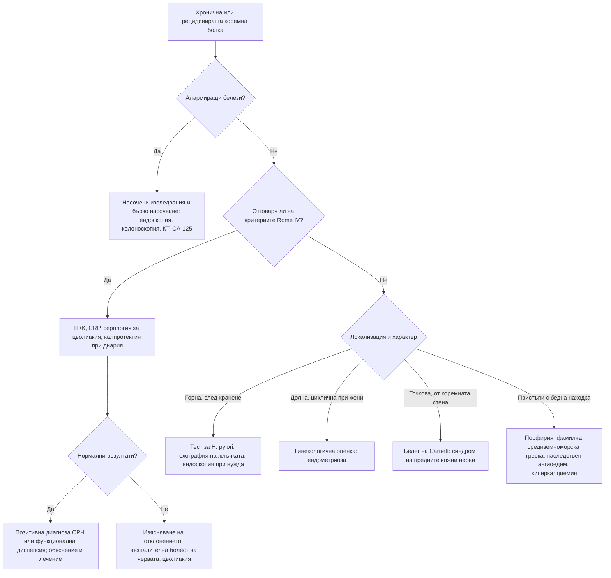

# Глава 20. Хронична и рецидивираща коремна болка

> **Част V. Храносмилателна система**

## Цели на главата

- Да се разграничават функционалните от органичните причини за хронична коремна болка.
- Да се прилагат позитивните диагностични критерии (Rome IV и промените в Rome V) за синдрома на раздразненото черво и функционалната диспепсия.
- Да се разпознават алармиращите белези, които налагат изследване.
- Да се използват рационално фекалният калпротектин, серологията за цьолиакия и CA-125.
- Да се познават редките, но важни причини за рецидивираща коремна болка.

## Ключови моменти

- Функционалните нарушения (синдром на раздразненото черво и функционална диспепсия) са най-честата причина за хронична коремна болка. Те се диагностицират по позитивни критерии, а не чрез изключване *(SORT B [1])*.
- Критериите Rome IV изискват болка поне 1 ден седмично, свързана с поне два от трите белега: дефекацията, промяна в честотата и промяна във формата на изпражненията. Rome V (2026) включва и дискомфорта и намалява честотата на 3 дни месечно [2–5].
- Червените флагове (начало след 50 години, загуба на тегло, кървене, анемия, нощни симптоми, формация, фамилна обремененост) налагат насочени изследвания.
- Основният набор при симптоми на синдрома на раздразненото черво включва ПКК, CRP, серология за цьолиакия и фекален калпротектин при диария *(SORT B [1, 7, 11])*.
- FIT с резултат 10 µg/g или повече налага бързо насочване при подозрение за колоректален карцином *(SORT B [12])*. Жена на 40 и повече години с персистиращо подуване трябва да бъде изследвана за карцином на яйчника *(SORT C [13])*.
- Нормалната колоноскопия без биопсии не изключва микроскопски колит. Хроничното предписване на опиоиди при функционална болка е вредно.

---

## 1. Въведение

Хроничната коремна болка продължава над 3–6 месеца. Рецидивиращата се проявява с пристъпи и безсимптомни интервали. В общата практика най-честите причини са функционалните нарушения на взаимодействието между червата и мозъка: синдромът на раздразненото черво (СРЧ) и функционалната диспепсия. Те не са „диагноза чрез изключване“ [1]. Имат позитивни диагностични критерии и се поставят след разумно изключване на органичните заболявания според алармиращите белези.

---

## 2. Етиологична класификация

*Таблица 20.1. Етиологична класификация.*

| Група | Заболявания |
|---|---|
| **Функционални** | Синдром на раздразненото черво, функционална диспепсия, функционално подуване, централно медиирана коремна болка, функционално нарушение на жлъчния мехур, синдром на циклично повръщане |
| **Горен стомашно-чревен тракт** | Пептична язва, гастрит с *Helicobacter pylori*, ГЕРБ, карцином на стомаха, гастропареза |
| **Жлъчни пътища и панкреас** | Жлъчнокаменна болест, хроничен панкреатит (алкохол, тютюнопушене; стеаторея, диабет, калцификати), карцином на панкреаса |
| **Тънко черво** | Цьолиакия, болест на Crohn, свръхрастеж на бактерии в тънкото черво, лактозна непоносимост, лямблиоза, НСПВС ентеропатия, хронична мезентериална исхемия |
| **Дебело черво** | Улцерозен колит, микроскопски колит, колоректален карцином, дивертикулна болест, хроничен запек, диария от жлъчни киселини |
| **Гинекологични** | Ендометриоза, аденомиоза, карцином на яйчника (подуване), хронична възпалителна болест на малкия таз, сраствания, венозен застой в малкия таз |
| **Урологични** | Интерстициален цистит (синдром на болезнения пикочен мехур), нефролитиаза |
| **Съдови** | Хронична мезентериална исхемия („коремна ангина“ – болка след хранене, страх от храна, загуба на тегло), синдром на медиалния дъговиден лигамент, синдром на горната мезентериална артерия, аневризма на аортата |
| **Коремна стена** | Синдром на притискане на предните кожни нерви (положителен белег на Carnett), херниите (включително херния на Spiegel), белези от операции |
| **Метаболитни и системни** | Хиперкалциемия, надбъбречна недостатъчност, диабетна радикулопатия, остра интермитентна порфирия, фамилна средиземноморска треска, наследствен ангиоедем, отравяне с олово, IgA васкулит, еозинофилен гастроентерит |
| **Лекарства** | НСПВС, опиоиди (синдром на наркотичните черва – парадоксално засилване на болката при увеличаване на дозата), метформин, GLP-1 агонисти, желязо, бисфосфонати |
| **Неврологични** | Радикулерна болка от гръдния отдел, постхерпесна невралгия, абдоминална мигрена |
| **Психосоциални** | Депресия, тревожност, соматизация, анамнеза за насилие (особено сексуално) |

---

## 3. Безопасна диагностична стратегия

*Таблица 20.2. Безопасна диагностична стратегия.*

| Въпрос | Отговор |
|---|---|
| **Вероятна диагноза** | Синдром на раздразненото черво, функционална диспепсия, хроничен запек, ГЕРБ, жлъчнокаменна болест |
| **Сериозни заболявания, които не бива да се пропускат** | Колоректален карцином, карцином на стомаха и панкреаса, карцином на яйчника, възпалителни болести на червата, хронична мезентериална исхемия, аневризма на аортата |
| **Чести капани** | Цьолиакия, микроскопски колит, диария от жлъчни киселини, лямблиоза, ендометриоза, болка от коремната стена, лекарства (опиоиди, НСПВС), хиперкалциемия, свръхрастеж на бактерии, лактозна непоносимост |
| **Маскиращи заболявания** | Депресия, захарен диабет (гастропареза, радикулопатия), лекарства, гръбначна дисфункция, хиперкалциемия |
| **Психосоциални аспекти** | Тревожност, депресия, насилие, соматизация, нарушен сън |

---

## 4. Синдром на раздразненото черво: критерии Rome IV и Rome V

Рецидивираща коремна болка средно поне 1 ден седмично през последните 3 месеца, свързана с поне два от следните белези:

1. връзка с дефекацията (засилване или облекчаване);
2. промяна в **честотата** на дефекацията;
3. промяна във **формата** (консистенцията) на изпражненията.

Критериите трябва да са изпълнени през последните 3 месеца, а симптомите да са започнали поне 6 месеца преди поставяне на диагнозата [2].

**Промени в Rome V (2026).** Новите критерии отново включват освен болката и коремния дискомфорт, намаляват минималната честота от 1 ден седмично на 3 дни месечно и изискват симптомите да не са постоянни [3–5]. Те обхващат повече пациенти с по-леки симптоми [4]. Rome V въвежда и опростени клинични критерии за ежедневната практика [5].

**Подтипове** по преобладаващата консистенция (Бристолска скала): СРЧ със запек, СРЧ с диария, смесен тип и некласифициран тип.

**Белези, подкрепящи диагнозата:** подуване, усещане за непълно изпразване, слуз в изпражненията, връзка със стрес и с хранене, начало в млада възраст, съпътстващи функционални синдроми (фибромиалгия, хронична умора, главоболие).

## 5. Функционална диспепсия: критерии Rome IV

Един или повече от следните симптоми, без структурно заболяване (включително при ендоскопия):

- обременяваща пълнота след хранене;
- ранно засищане;
- епигастрална болка;
- епигастрално парене.

Разграничават се постпрандиален дистрес синдром (пълнота и ранно засищане) и синдром на епигастрална болка [6]. В Rome V (2026) критериите за гастродуоденалните нарушения са прецизирани, включително по отношение на времевите характеристики [5].

---

## 6. Червени флагове (алармиращи белези)

- Начало след 50-годишна възраст.
- Необяснима загуба на тегло.
- Стомашно-чревно кървене, желязодефицитна анемия.
- Дисфагия, упорито повръщане.
- Палпируема формация в корема, асцит.
- Жълтеница.
- **Нощни симптоми**, които събуждат пациента (болка, диария).
- Треска.
- Фамилна анамнеза за колоректален карцином, възпалителни болести на червата, цьолиакия или карцином на яйчника.
- Прогресиращи симптоми, скорошна промяна в дефекацията след 50-годишна възраст.
- Отклонения в изследванията: анемия, повишени възпалителни показатели, хипоалбуминемия, положителен FIT.

---

## 7. Диференциално-диагностична таблица

*Таблица 20.3. Диференциална диагноза на хроничната коремна болка.*

| Заболяване | Ключови белези | Ключови изследвания |
|---|---|---|
| **Синдром на раздразненото черво** | Критерии Rome IV, липса на алармиращи белези, млада възраст | Нормални ПКК, CRP, серология за цьолиакия, калпротектин |
| **Болест на Crohn** | Болка в десния долен квадрант, диария, загуба на тегло, перианални фистули, афти в устата, треска, извънчревни прояви | CRP, калпротектин, колоноскопия с илеоскопия, ЯМР ентерография |
| **Улцерозен колит** | Кървава диария, тенезми, спешност на дефекацията | Калпротектин, колоноскопия |
| **Цьолиакия** | Диария или запек, подуване, желязодефицит, остеопороза, херпетиформен дерматит | Тъканна трансглутаминаза IgA и общ IgA, дуоденална биопсия [7] |
| **Микроскопски колит** | Водниста, често нощна диария, възрастни жени, НСПВС, ИПП, SSRI | Колоноскопия с множество биопсии (макроскопски лигавицата е нормална) [8] |
| **Пептична язва** | Епигастрална болка, свързана с храненето, нощна болка, НСПВС | Тест за *H. pylori*, ендоскопия |
| **Жлъчнокаменна болест** | Епизоди на болка в десния горен квадрант с продължителност от 30 min до няколко часа | Ехография |
| **Хроничен панкреатит** | Епигастрална болка към гърба, алкохол, стеаторея, диабет | Фекална еластаза, КТ (калцификати) |
| **Карцином на панкреаса** | Болка към гърба, загуба на тегло, жълтеница, новооткрит диабет | КТ по панкреатичен протокол |
| **Карцином на яйчника** | Персистиращо подуване, ранно засищане, тазова болка, често уриниране при жени над 50 години | CA-125, трансвагинална ехография |
| **Ендометриоза** | Циклична тазова болка, дисменорея, диспареуния, дисхезия, безплодие | Трансвагинална ехография, ЯМР, лапароскопия |
| **Хронична мезентериална исхемия** | Болка 15–60 минути след хранене, страх от храна, загуба на тегло, атеросклероза | КТ-ангиография [9] |
| **Синдром на притискане на предните кожни нерви** | Точкова болезненост по ръба на правия коремен мускул, положителен белег на Carnett | Локална инфилтрация с анестетик (диагностична и лечебна) |
| **Остра интермитентна порфирия** | Млади жени, силна коремна болка с бедна находка, психични симптоми, невропатия, хипонатриемия, тъмна урина, провокация от лекарства | Порфобилиноген в урината (по време на пристъп) |
| **Фамилна средиземноморска треска** | Пристъпи на треска и перитонит за 1–3 дни, плеврит, артрит, етнически произход | Клинична диагноза, генетичен тест (MEFV) |
| **Наследствен ангиоедем** | Пристъпи на коремна болка и кожни отоци без уртикария, фамилна анамнеза | C4 (понижен), C1-инхибитор (количество и функция) [10] |

---

## 8. Изследвания

**Основен набор при симптоми, съвместими със СРЧ:**

- ПКК, CRP или СУЕ;
- тъканна трансглутаминаза IgA и общ IgA;
- **фекален калпротектин** при диария. Праговете зависят от метода и от местния алгоритъм; често използвани са [11]:
  - < 50 µg/g – възпалителна болест на червата е малко вероятна;
  - 50–200 µg/g – сива зона, изследването се повтаря;
  - > 200 µg/g – насочване за колоноскопия;
- **FIT** при симптоми, които могат да се дължат на колоректален карцином. При резултат 10 µg хемоглобин на грам изпражнения или повече се насочва бързо при подозрение за карцином. При по-нисък резултат, но упорити необясними симптоми насочването не бива да се забавя [12];
- CA-125 при жени на 40 и повече години с персистиращо подуване, ранно засищане или тазова болка (праговете по възраст са в приложение Б); под 40 години CA-125 не се използва самостоятелно – прави се ехография [13];
- изследване на изпражненията за *Giardia* при диария.

**Допълнително според клиничните данни:** ТСХ, калций, чернодробни показатели, липаза, ехография на корема, тест за *H. pylori* (уреазен дихателен тест или фекален антиген), ендоскопия, колоноскопия, дихателни тестове (лактоза, свръхрастеж на бактерии), фекална еластаза, КТ.

**Какво да се избягва:** повтарящи се изследвания без нови данни, КТ „за успокоение“, лечение на случайни находки, например малки жлъчни камъни без типична жлъчна колика.

---

## 9. Диагностичен алгоритъм

*Фигура 20.1. Диагностичен алгоритъм: хронична и рецидивираща коремна болка. Схема на авторите въз основа на източниците, цитирани в главата.*

Текстово описание на фигура 20.1

1. Хронична или рецидивираща коремна болка. Следва: към т. 2.
2. **Въпрос:** Алармиращи белези? Да – към т. 3; Не – към т. 4.
3. Насочени изследвания и бързо насочване: ендоскопия, колоноскопия, КТ, CA-125.
4. **Въпрос:** Отговаря ли на критериите Rome IV? Да – към т. 5; Не – към т. 6.
5. ПКК, CRP, серология за цьолиакия, калпротектин при диария. Следва: към т. 7.
6. **Въпрос:** Локализация и характер Горна, след хранене – към т. 8; Долна, циклична при жени – към т. 9; Точкова, от коремната стена – към т. 10; Пристъпи с бедна находка – към т. 11.
7. **Въпрос:** Нормални резултати? Да – към т. 12; Не – към т. 13.
8. Тест за H. pylori, ехография на жлъчката, ендоскопия при нужда.
9. Гинекологична оценка: ендометриоза.
10. Белег на Carnett: синдром на предните кожни нерви.
11. Порфирия, фамилна средиземноморска треска, наследствен ангиоедем, хиперкалциемия.
12. Позитивна диагноза СРЧ или функционална диспепсия; обяснение и лечение.
13. Изясняване на отклонението: възпалителна болест на червата, цьолиакия.

---

## 10. Особености в общата практика

- Позитивната диагноза СРЧ, поставена уверено и обяснена разбираемо, е терапевтична сама по себе си.
- Проверявайте периодично за нови алармиращи белези. Функционалното заболяване не предпазва от органично.
- Обърнете внимание на психосоциалните фактори и на съня. Попитайте деликатно за насилие.
- Избягвайте хроничното предписване на опиоиди при функционална коремна болка. Това води до синдром на наркотичните черва и до зависимост.

---

## 11. Кога и колко спешно да насочим

*Таблица 20.4. Кога и колко спешно да насочим.*

| Спешност | Клинична ситуация |
|---|---|
| **Незабавно (112 или спешно отделение)** | Остро влошаване с перитонеални белези, непроходимост или кървене (вж. глава 19); пристъп на наследствен ангиоедем с оток на гърлото |
| **В същия ден** | Тежък пристъп на възпалителна болест на червата (кървава диария над 6 пъти дневно с треска, тахикардия или анемия); подозрение за остра интермитентна порфирия |
| **Бързо (до 2 седмици)** | FIT 10 µg/g или повече [12]; загуба на тегло, желязодефицитна анемия, коремна формация или жълтеница; повишен CA-125 или ехографски данни за формация на яйчника [13]; калпротектин над 200 µg/g |
| **Планово** | Положителна серология за цьолиакия (дуоденална биопсия); калпротектин в сивата зона при повторно изследване; подозрение за ендометриоза; хронична мезентериална исхемия без остри симптоми |
| **Проследяване в общата практика** | Позитивна диагноза синдром на раздразненото черво или функционална диспепсия с нормални изследвания и без червени флагове – обяснение, лечение и периодична преоценка |

---

## 12. Клинични перли

- СРЧ рядко започва след 50-годишна възраст. Новите „функционални“ симптоми при възрастни хора изискват изследване.
- Нощна диария, която събужда пациента, не е типична за СРЧ.
- Нормалната колоноскопия не изключва микроскопски колит, ако не са взети биопсии.
- Жена над 50 години с персистиращо подуване, „СРЧ“ за първи път: изследвайте CA-125 и направете ехография.
- Точкова болка, която се засилва при напрягане на коремната мускулатура, идва от коремната стена.
- Болка след хранене, страх от храна и загуба на тегло при пушач с атеросклероза: хронична мезентериална исхемия.
- Повтарящи се пристъпи на силна коремна болка с бедна находка и хипонатриемия при млада жена: остра интермитентна порфирия.

---

## 13. Клиничен случай

**Етап 1 – представяне.** Жена на 27 години от година има коремни болки и кашави изпражнения. Поставена ѝ е диагноза „синдром на раздразненото черво“. През последните 4 месеца се събужда нощем, за да има дефекация. Отслабнала е с 5 kg и има афти в устата.

> **Въпрос 1.** Кои белези не отговарят на синдрома на раздразненото черво?

**Етап 2 – преглед и изследвания.** Има болезненост в десния долен квадрант и перианална фистула. Хемоглобинът е 112 g/l, тромбоцитите – 468 × 10⁹/l, CRP – 28 mg/l, албуминът – 33 g/l, а фекалният калпротектин – 620 µg/g.

> **Въпрос 2.** Коя е вероятната диагноза?

> **Въпрос 3.** Как се потвърждава?

Обсъждане и отговори

**Отговор 1.** Нощните симптоми, загубата на тегло и афтите са червени флагове, несъвместими със синдрома на раздразненото черво. Диагнозата трябва да се преоцени.

**Отговор 2.** Перианалната фистула, болезнеността в десния долен квадрант, анемията, тромбоцитозата, повишеният CRP, хипоалбуминемията и силно повишеният калпротектин насочват към **болест на Crohn**.

**Отговор 3.** Колоноскопия с илеоскопия и биопсии. Тя показва язви в терминалния илеум с изгледа на „калдъръм“, а биопсиите потвърждават диагнозата. ЯМР ентерографията уточнява разпространението и перианалната болест.

**Поука.** Диагнозата „синдром на раздразненото черво“ трябва да се преоценява при поява на червени флагове. Калпротектинът е прост и ценен тест за разграничаване на функционалните от възпалителните заболявания [11].

---

## Обобщение

- Хроничната коремна болка най-често е функционална, но функционалните нарушения се диагностицират по позитивни критерии и след разумно изключване на органичните причини.
- Критериите Rome IV (2016) бяха обновени с Rome V (2026), които включват и дискомфорта и изискват по-ниска честота на симптомите.
- Червените флагове, възрастта над 50 години и отклоненията в основните изследвания насочват към органично заболяване: колоректален карцином, възпалителна болест на червата, цьолиакия, карцином на яйчника или панкреаса.
- Редките причини (порфирия, фамилна средиземноморска треска, наследствен ангиоедем, хронична мезентериална исхемия, болка от коремната стена) се търсят при нетипична картина.

## Самопроверка

### Въпроси с един верен отговор

**1.** *(основно ниво)* Жена на 28 години от 8 месеца има коремна болка около 2 дни седмично, която намалява след дефекация и е свързана с редуване на запек и диария. Няма червени флагове. Кое е най-подходящото поведение?

- **А.** Колоноскопия
- **Б.** ПКК, CRP, серология за цьолиакия и позитивна диагноза синдром на раздразненото черво при нормални резултати
- **В.** КТ на корема
- **Г.** Туморни маркери
- **Д.** Пробно лечение с антибиотик

Отговор и обосновка

**Верен отговор: Б.** Симптомите отговарят на критериите за синдром на раздразненото черво. При липса на червени флагове са достатъчни основните изследвания, след което се поставя позитивна диагноза [1, 2]. А, В и Г не са показани без червени флагове. Д не е оправдано.

**2.** *(основно ниво)* Коя находка НЕ е типична за синдрома на раздразненото черво и изисква изследване?

- **А.** Подуване
- **Б.** Усещане за непълно изпразване
- **В.** Нощна диария, която събужда пациента
- **Г.** Слуз в изпражненията
- **Д.** Връзка на симптомите със стреса

Отговор и обосновка

**Верен отговор: В.** Нощните симптоми са червен флаг и насочват към органично заболяване (възпалителна болест на червата, микроскопски колит). А, Б, Г и Д са белези, които подкрепят диагнозата синдром на раздразненото черво.

**3.** *(основно ниво)* Мъж на 62 години има промяна в дефекацията от 2 месеца. FIT е 45 µg хемоглобин на грам изпражнения. Кое е правилното поведение?

- **А.** Повторен FIT след 3 месеца
- **Б.** Бързо насочване при подозрение за колоректален карцином
- **В.** Пробно лечение със спазмолитик
- **Г.** Позитивна диагноза синдром на раздразненото черво
- **Д.** Изследване за *Giardia*

Отговор и обосновка

**Верен отговор: Б.** FIT 10 µg/g или повече налага бързо насочване при подозрение за колоректален карцином [12]. А, В и Г забавят диагнозата. Д не отговаря на картината.

**4.** *(напреднало ниво)* Жена на 68 години от 3 месеца има водниста диария по 6–8 пъти дневно, включително нощем. Приема ибупрофен и омепразол. Колоноскопията преди месец е описана като „нормална“, без взети биопсии. Кое е най-вероятното обяснение и какво следва?

- **А.** Синдром на раздразненото черво – не са нужни изследвания
- **Б.** Микроскопски колит – колоноскопия с множество биопсии и преоценка на лекарствата
- **В.** Колоректален карцином – КТ
- **Г.** Лактозна непоносимост – безлактозна диета
- **Д.** Цьолиакия – не се изследва след 60 години

Отговор и обосновка

**Верен отговор: Б.** Водниста, нощна диария при възрастна жена, която приема НСПВС и инхибитор на протонната помпа, е типична за микроскопски колит. Лигавицата е макроскопски нормална, затова са нужни множество биопсии [8]. А пропуска диагнозата. В не се подкрепя от нормалната колоноскопия. Г и Д са погрешни.

**5.** *(напреднало ниво)* Жена на 24 години има пристъпи на силна коремна болка с бедна находка, тъмна урина, тахикардия, безпокойство и натрий 128 mmol/l. Пристъпът е започнал след прием на ново лекарство. Кое изследване е най-подходящо по време на пристъпа?

- **А.** Колоноскопия
- **Б.** Порфобилиноген в урината
- **В.** CA-125
- **Г.** Фекален калпротектин
- **Д.** Серология за цьолиакия

Отговор и обосновка

**Верен отговор: Б.** Силната коремна болка с бедна находка, тъмна урина, хипонатриемия и провокация от лекарство насочват към остра интермитентна порфирия. Диагнозата се поставя с порфобилиноген в урината по време на пристъп. А, В, Г и Д не отговарят на хипотезата.

### Задача

Жена на 34 години има коремна болка и подуване средно 3 дни месечно от година, свързани с дефекацията и с промяна във формата на изпражненията. Болката не е постоянна. Отговаря ли на критериите Rome IV и Rome V за синдром на раздразненото черво?

Решение

Rome IV изисква болка средно поне 1 ден седмично през последните 3 месеца [2]. При честота около 3 дни месечно критериите не са изпълнени. Rome V намалява минималната честота на 3 дни месечно, включва и дискомфорта и изисква симптомите да не са постоянни [3–5]. Затова по Rome V пациентката отговаря на критериите, ако няма червени флагове и основните изследвания са нормални. Примерът показва защо Rome V обхваща повече пациенти с по-леки симптоми [4].

### OSCE станция: Съобщаване на диагнозата синдром на раздразненото черво

**Време:** 8 минути. **Ниво:** основно (студенти, специализанти).

**Задача за кандидата.** Жена на 29 години се връща за резултатите си. ПКК, CRP, серологията за цьолиакия и калпротектинът са нормални. Обяснете диагнозата и плана.

**Информация за симулирания пациент (за изпитващия).** Има болка и подуване от година, свързани с дефекацията и със стреса в работата. Страхува се от рак, защото леля ѝ е починала от рак на дебелото черво на 70 години. Иска колоноскопия.

*Таблица 20.5. OSCE станция „Съобщаване на диагнозата синдром на раздразненото черво“ – критерии за оценяване.*

| Критерий | Точки |
|---|---|
| Проверява какво знае и какво очаква пациентката | 1 |
| Обяснява, че резултатите са нормални и какво означава това | 1 |
| Поставя уверено позитивна диагноза и я обяснява с прости думи (връзка между червата и мозъка) | 2 |
| Обсъжда тревогата за рак, включително фамилната анамнеза (далечен роднина, възраст 70 години) | 2 |
| Обяснява защо колоноскопия не е нужна сега | 1 |
| Предлага план: хранене, физическа активност, лечение според преобладаващите симптоми, психологическа подкрепа при нужда | 2 |
| Дава указания при влошаване: кръв в изпражненията, загуба на тегло, нощни симптоми | 2 |
| Проверява разбирането и договаря контролен преглед | 1 |
| **Общо** | **12** |

**Праг за успешно представяне:** 8 от 12 точки, включително позитивната диагноза и указанията при влошаване.

## Литература

1. Vasant DH, Paine PA, Black CJ, Houghton LA, Everitt HA, Corsetti M, et al. British Society of Gastroenterology guidelines on the management of irritable bowel syndrome. Gut. 2021;70(7):1214-1240. doi:10.1136/gutjnl-2021-324598. PMID: 33903147.
2. Mearin F, Lacy BE, Chang L, Chey WD, Lembo AJ, Simren M, et al. Bowel Disorders. Gastroenterology. 2016;150(6):1393-1407.e5. doi:10.1053/j.gastro.2016.02.031. PMID: 27144627.
3. Corsetti M, Shin A, Lacy BE, Cash BD, Simrén M, Schmulson MJ, et al. Bowel Disorders. Gastroenterology. 2026;170(6):1261-1282. doi:10.1053/j.gastro.2026.02.003. PMID: 41713703.
4. Staller K, Goodoory VC, Ng CE, Ford AC, Black CJ. Epidemiologic, Clinical, and Psychological Characteristics of Individuals With Self-Reported Irritable Bowel Syndrome Based on the Rome V vs Rome IV Criteria. Clin Gastroenterol Hepatol. 2026. doi:10.1016/j.cgh.2026.07.022.
5. Goyal MK, Goyal O, Sehgal T, Vuthaluru AR, Goyal K, Sood A. What is new in Rome V?: Redefining diagnostic criteria and clinical pathways in disorders of gut-brain interaction. Indian J Gastroenterol. 2026. doi:10.1007/s12664-026-02044-x. PMID: 42753081.
6. Stanghellini V, Chan FK, Hasler WL, Malagelada JR, Suzuki H, Tack J, et al. Gastroduodenal Disorders. Gastroenterology. 2016;150(6):1380-92. doi:10.1053/j.gastro.2016.02.011. PMID: 27147122.
7. National Institute for Health and Care Excellence. Coeliac disease: recognition, assessment and management (NICE guideline NG20). London: NICE; 2015. Достъпно на: https://www.nice.org.uk/guidance/ng20
8. Miehlke S, Guagnozzi D, Zabana Y, Tontini GE, Kanstrup Fiehn AM, Wildt S, et al. European guidelines on microscopic colitis: United European Gastroenterology and European Microscopic Colitis Group statements and recommendations. United European Gastroenterol J. 2021;9(1):13-37. doi:10.1177/2050640620951905. PMID: 33619914.
9. Koelemay MJ, Geelkerken RH, Kärkkäinen J, Leone N, Antoniou GA, de Bruin JL, et al. Editor's Choice - European Society for Vascular Surgery (ESVS) 2025 Clinical Practice Guidelines on the Management of Diseases of the Mesenteric and Renal Arteries and Veins. Eur J Vasc Endovasc Surg. 2025;70(2):153-218. doi:10.1016/j.ejvs.2025.06.010. PMID: 40513642.
10. Maurer M, Magerl M, Betschel S, Aberer W, Ansotegui IJ, Aygören-Pürsün E, et al. The international WAO/EAACI guideline for the management of hereditary angioedema-The 2021 revision and update. Allergy. 2022;77(7):1961-1990. doi:10.1111/all.15214. PMID: 35006617.
11. National Institute for Health and Care Excellence. Faecal calprotectin diagnostic tests for inflammatory diseases of the bowel (HealthTech guidance HTG320). London: NICE; 2013. Достъпно на: https://www.nice.org.uk/guidance/htg320
12. National Institute for Health and Care Excellence. Quantitative faecal immunochemical testing to guide colorectal cancer pathway referral in primary care (HealthTech guidance HTG690). London: NICE; 2023. Достъпно на: https://www.nice.org.uk/guidance/htg690
13. National Institute for Health and Care Excellence. Suspected cancer: recognition and referral (NICE guideline NG12). London: NICE; 2015 [актуализирано 2026]. Достъпно на: https://www.nice.org.uk/guidance/ng12

*Последна проверка на съдържанието: септември 2026 г. Следващ планиран преглед: септември 2027 г. (вж. „Политика за актуализация“ в README).*

<!-- навигация -->

---

[← Глава 19. Остра коремна болка](19-ostra-koremna-bolka.md) · [Съдържание](../README.md) · [Глава 21. Диспепсия, киселини и дисфагия →](21-dispepsia-disfagia.md)
