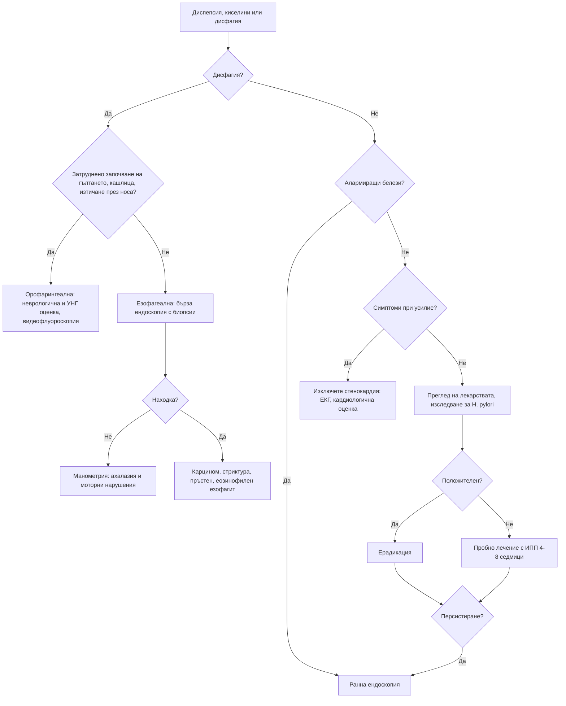

# Глава 21. Диспепсия, киселини и дисфагия

> **Част V. Храносмилателна система**

## Цели на главата

- Да се разграничават диспепсията, гастроезофагеалният рефлукс и сърдечната болка.
- Да се прилага стратегията „изследване и лечение“ за *Helicobacter pylori* и да се определя кога е нужна ендоскопия.
- Да се разграничава орофарингеалната от езофагеалната дисфагия.
- Да се разпознават механичните и моторните причини за езофагеална дисфагия.
- Да се определят показанията и спешността на ендоскопското изследване при дисфагия (дисфагията винаги изисква изследване).

## Ключови моменти

- Около 70–80% от изследваните пациенти с диспепсия имат функционална диспепсия [1]. При липса на алармиращи белези се прилага стратегията „изследване и лечение“ за *H. pylori*, а след това пробно лечение с ИПП *(SORT A [1, 3, 4])*.
- Преди изследването за *H. pylori* ИПП се спират за 2 седмици, а антибиотиците — за 4 седмици. Серологията не доказва активна инфекция *(SORT B [3, 4])*.
- Дисфагията при всяка възраст и диспепсията, рефлуксът или болката в горната половина на корема със загуба на тегло след 55 години налагат бързо насочване *(SORT C [2])*.
- Орофарингеалната дисфагия засяга започването на гълтането, а езофагеалната — преминаването на храната. Механичната обструкция засяга първо твърдите храни, а моторните нарушения — и течностите от самото начало.
- При млад атопичен мъж със заклещване на храна се подозира еозинофилен езофагит. Биопсиите се вземат дори при нормален вид на лигавицата *(SORT B [7])*.
- „Киселини“ при усилие, които отминават в покой, са стенокардия, докато не се докаже противното.

---

## А. Диспепсия и киселини

### 1. Определения

- **Диспепсия** — един или повече от следните симптоми: пълнота след хранене, ранно засищане, епигастрална болка или парене.
- **Киселини (парене зад гръдната кост)** и **регургитация** са типичните симптоми на ГЕРБ.
- В практиката симптомите често се припокриват.

### 2. Причини за диспепсия

| Група | Причини |
|---|---|
| **Функционална диспепсия** | 70–80% от изследваните пациенти [1] |
| **Пептична язва** | *H. pylori*, НСПВС и аспирин, съчетание с антикоагуланти или SSRI, стрес (при тежко болни), синдром на Zollinger-Ellison |
| **ГЕРБ** | С или без езофагит |
| **Злокачествени** | Карцином на стомаха или хранопровода (под 1–2% от всички диспепсии, но по-често при възрастни с алармиращи белези) |
| **Лекарства** | НСПВС, аспирин, бисфосфонати, желязо, калиеви препарати, антибиотици, метформин, GLP-1 агонисти, кортикостероиди, теофилин; калциеви антагонисти и нитрати (засилват рефлукса) |
| **Жлъчни пътища и панкреас** | Жлъчнокаменна болест, хроничен панкреатит, карцином на панкреаса |
| **Други стомашно-чревни** | Цьолиакия, гастропареза (диабет), СРЧ, чернодробни заболявания |
| **Извънкоремни** | **Стенокардия** и миокарден инфаркт, хиперкалциемия, хронично бъбречно заболяване, бременност |
| **Психосоциални** | Тревожност, депресия |

### 3. Безопасна диагностична стратегия

| Въпрос | Отговор |
|---|---|
| **Вероятна диагноза** | Функционална диспепсия, ГЕРБ, гастрит с *H. pylori*, диспепсия от НСПВС |
| **Сериозни заболявания, които не бива да се пропускат** | Карцином на стомаха и хранопровода, усложнена пептична язва (кървене, перфорация), **миокардна исхемия**, карцином на панкреаса |
| **Чести капани** | Стенокардия, приета за „киселини“; жлъчнокаменна болест; лекарства (бисфосфонати, НСПВС, GLP-1 агонисти); цьолиакия; гастропареза; бременност |
| **Маскиращи заболявания** | Депресия, захарен диабет, лекарства, хиперкалциемия |
| **Психосоциални аспекти** | Стрес, тревожност, злоупотреба с алкохол |

### 4. Алармиращи белези (показания за ранна ендоскопия)

- **Дисфагия** при всяка възраст [2].
- **Възраст над 55 години със загуба на тегло** и диспепсия, рефлукс или болка в горната половина на корема [2]. Праговете за възраст се различават в отделните препоръки. В страни със средна честота на карцинома на стомаха, каквато е България, прагът е по-нисък.
- Стомашно-чревно кървене (хематемеза, мелена) или желязодефицитна анемия.
- Упорито повръщане.
- Палпируема формация в епигастриума.
- Прогресиращи симптоми.
- Фамилна анамнеза за карцином на горния стомашно-чревен тракт.
- Предишна операция на стомаха, пептична язва в миналото.
- Жълтеница, лимфаденопатия (възел на Virchow).

### 5. Подход при пациент без алармиращи белези

1. **Преглед на лекарствата** (НСПВС!) и начина на живот (алкохол, тютюнопушене, тегло, късно хранене).
2. **Изследване за *H. pylori*** (уреазен дихателен тест или антиген в изпражненията) и ерадикация при положителен резултат. Преди изследването трябва да се спрат **инхибиторите на протонната помпа (ИПП) за 2 седмици** и **антибиотиците за 4 седмици**, защото те дават фалшиво отрицателни резултати [3, 4]. Серологията не разграничава активната от прекараната инфекция.
3. **Пробно лечение с ИПП** за 4–8 седмици, ако няма ефект от ерадикацията или ако тестът е отрицателен.
4. **Ендоскопия**, ако симптомите персистират или рецидивират.

### 6. ГЕРБ

- **Типични симптоми:** парене зад гръдната кост, регургитация на кисело съдържимо, засилване след хранене, при навеждане и при лягане.
- **Извънхранопроводни прояви:** хронична кашлица, ларингит, дрезгав глас, астма, ерозии на зъбния емайл, некардиална болка в гърдите.
- **Усложнения:** езофагит, пептична стриктура (дисфагия), **хранопровод на Barrett** и аденокарцином.
- **Рискови фактори за хранопровод на Barrett:** мъжки пол, възраст над 50 години, дългогодишен рефлукс (над 5 години), централно затлъстяване, тютюнопушене, фамилна анамнеза. По препоръките на ACG скринингова ендоскопия се обсъжда при хроничен рефлукс и поне три рискови фактора [5].

### 7. Стенокардия, представена като диспепсия

Епигастрално или ретростернално парене, което се появява **при усилие** и отминава в покой, е стенокардия, а не рефлукс. Това важи особено при възрастни хора, при диабетици и при жени. При съмнение се записва ЕКГ и пациентът се оценява кардиологично (вж. глава 9).

---

## Б. Дисфагия

### 8. Определения

- **Дисфагия** — затруднено преминаване на храната от устата към стомаха.
- **Одинофагия** — болезнено гълтане.
- **Глобусно усещане** — усещане за „буца в гърлото“ между храненията, без истинско затруднение при гълтане. Често се облекчава при хранене.

**Дисфагията винаги изисква изследване.**

### 9. Орофарингеална и езофагеална дисфагия

| Белег | Орофарингеална | Езофагеална |
|---|---|---|
| Същност | Затруднено **започване** на гълтането | Храната „засяда“ **след** гълтането, зад гръдната кост или в епигастриума |
| Придружаващи симптоми | Кашлица и задавяне при гълтане, изтичане на течност през носа, назален говор, аспирационни пневмонии | Регургитация, болка в гърдите, загуба на тегло |
| Причини | **Неврологични:** инсулт, болест на Parkinson, миастения гравис, амиотрофична латерална склероза, множествена склероза. **Мускулни:** полимиозит, окулофарингеална дистрофия. **Структурни:** **дивертикул на Zenker** (регургитация на несмляна храна, лош дъх, клокочене във врата), тумори на главата и шията, остеофити на шийните прешлени. **Други:** сухота в устата (синдром на Sjögren, лекарства) | Вж. таблицата по-долу |
| Изследване | **Видеофлуороскопия** (модифицирана бариева каша), фиброоптична ендоскопска оценка на гълтането, УНГ и неврологичен преглед | **Горна ендоскопия** (първо изследване) |

### 10. Причини за езофагеална дисфагия

| Тип | Характеристика | Причини |
|---|---|---|
| **Механична обструкция** | Дисфагия **само за твърди храни** | **Карцином** (прогресираща дисфагия, загуба на тегло, възраст над 50 години); **пептична стриктура** (дългогодишни киселини); **пръстен на Schatzki** (интермитентна дисфагия, „синдромът на пържолата“); **еозинофилен езофагит** (млади мъже, атопия, **заклещване на хранителен болус**); ципи (синдром на Plummer-Vinson с желязодефицит); външна компресия (медиастинални тумори, лимфни възли, аневризма, ляво предсърдие) |
| **Моторно нарушение** | Дисфагия **за твърди храни и течности от самото начало** | **Ахалазия** (регургитация на несмляна храна, загуба на тегло, болка в гърдите, нощна кашлица); дифузен спазъм на хранопровода (болка в гърдите); **системна склероза** (киселини, феномен на Raynaud); хиперконтрактилен хранопровод |

**Одинофагия:** инфекциозен езофагит (кандида, херпес симплекс, цитомегаловирус, особено при имуносупресия); **медикаментозен езофагит** (доксициклин, бисфосфонати, НСПВС, калиев хлорид, желязо — таблетката се задържа в хранопровода, особено при прием без достатъчно вода или преди лягане); каустични увреждания; лъчеви увреждания.

### 11. Червени флагове при дисфагия

- Прогресираща дисфагия и загуба на тегло.
- Възраст над 50 години.
- Анемия, кървене.
- Остро заклещване на хранителен болус с невъзможност за гълтане на слюнка — **спешна ендоскопия** (за предпочитане до 2 часа, най-късно до 6 часа) [6].
- Аспирационни пневмонии.
- Неврологични симптоми.
- Дрезгав глас, лимфаденопатия на шията.

### 12. Изследвания

- **Горна ендоскопия с биопсии** — първо изследване при езофагеална дисфагия. **Биопсии за еозинофилен езофагит се вземат дори при макроскопски нормален хранопровод** [7].
- Рентгеново изследване с бариева каша — при подозрение за дивертикул на Zenker, ахалазия, ципи, при неуспешна ендоскопия.
- **Манометрия с висока разделителна способност** — ахалазия и други моторни нарушения [8].
- Видеофлуороскопия — орофарингеална дисфагия.
- КТ — стадиране и външна компресия.
- ПКК, феритин (синдром на Plummer-Vinson).

---

## 13. Диагностичен алгоритъм

---

## 14. Кога и колко спешно да насочим

| Спешност | Клинична ситуация |
|---|---|
| **Незабавно (112 или спешно отделение)** | Пълна обструкция от хранителен болус (невъзможност за гълтане на слюнка) — ендоскопия до 2–6 часа [6]; хематемеза или мелена с нестабилност; подозрение за перфорация; болка при усилие, подозрителна за ОКС |
| **В същия ден** | Хематемеза или мелена при стабилен пациент; одинофагия с невъзможност за хранене при имуносупресия; аспирационна пневмония при орофарингеална дисфагия |
| **Бързо (до 2 седмици)** | Дисфагия; възраст 55 и повече години със загуба на тегло и диспепсия, рефлукс или болка в горната половина на корема [2]; формация в епигастриума; желязодефицитна анемия с диспепсия |
| **Планово** | Персистираща диспепсия въпреки ерадикация и ИПП (ендоскопия); скрининг за хранопровод на Barrett; подозрение за ахалазия (манометрия); орофарингеална дисфагия без остри усложнения (невролог, УНГ, логопед) |
| **Проследяване в общата практика** | Функционална диспепсия и неусложнена ГЕРБ без алармиращи белези |

---

## 15. Клинични перли

- „Киселини“ при усилие, които отминават в покой, са стенокардия.
- Всяка дисфагия изисква ендоскопия. Изключение не се прави и при млади пациенти.
- Млад мъж с астма или алергичен ринит и епизоди на заклещване на храна: еозинофилен езофагит. Поискайте биопсии.
- Дисфагия за течности от самото начало: моторно нарушение, най-вероятно ахалазия.
- Изследването за *H. pylori* дава фалшиво отрицателен резултат, ако пациентът приема ИПП.
- Желязодефицитна анемия и дисфагия при жена на средна възраст: синдром на Plummer-Vinson (ципи в хранопровода, повишен риск от плоскоклетъчен карцином).
- Възрастен пациент с регургитация на несмляна храна от предишния ден и лош дъх: дивертикул на Zenker.

---

## 16. Клиничен случай

**Етап 1 — представяне.** Мъж на 24 години с алергичен ринит и астма в детството от 3 години има епизоди, при които храната „засяда“ зад гръдната кост, особено месо и хляб. Налага се да пие вода или да предизвиква повръщане. Храни се бавно и нарязва храната на малки хапки. ИПП е приемал за кратко без ефект.

> **Въпрос 1.** Какъв тип е дисфагията и коя е най-вероятната диагноза?

**Етап 2 — развитие.** Преди седмица е прекарал 6 часа в спешно отделение със заклещено парче месо.

> **Въпрос 2.** Какво трябва да се поиска при ендоскопията?

> **Въпрос 3.** Как се потвърждава диагнозата?

Обсъждане и отговори

**Отговор 1.** Интермитентна езофагеална дисфагия за твърди храни (механична). Млад мъж с атопия, заклещване на хранителен болус и адаптивно хранително поведение (бавно хранене, малки хапки, много вода) има типичната картина на **еозинофилен езофагит**.

**Отговор 2.** При ендоскопията хранопроводът може да изглежда почти нормален или да има концентрични пръстени, надлъжни бразди и белезникави ексудати. Задължително се вземат **биопсии от проксималния и дисталния хранопровод**, дори при нормален вид на лигавицата [7].

**Отговор 3.** Диагнозата се потвърждава при 15 и повече еозинофила в едно зрително поле с голямо увеличение и съответна клинична картина [7]. Лечението включва ИПП във висока доза, локални кортикостероиди, елиминационни диети, а при тежко протичане и биологична терапия.

**Поука.** Еозинофилният езофагит е най-честата причина за заклещване на хранителен болус при млади хора. Без биопсия диагнозата се пропуска.

---

## Обобщение

- Диспепсията най-често е функционална, но трябва да се изключат пептичната язва, ГЕРБ, лекарствата, злокачествените заболявания и стенокардията.
- При липса на алармиращи белези се прилагат изследване и лечение за *H. pylori* и пробно лечение с ИПП. Алармиращите белези налагат ранна ендоскопия.
- Дисфагията винаги изисква изследване. Орофарингеалната се оценява с видеофлуороскопия, а езофагеалната — с ендоскопия с биопсии.
- Механичната дисфагия засяга първо твърдите храни, а моторната — и течностите. Еозинофилният езофагит и ахалазията са чести капани.

## Самопроверка

### Въпроси с един верен отговор

**1.** *(основно ниво)* Жена на 35 години има диспепсия от 2 месеца. Няма алармиращи белези и не приема НСПВС. Кое е най-подходящото изследване?

- **А.** Горна ендоскопия
- **Б.** Серология за *H. pylori*
- **В.** Уреазен дихателен тест или антиген на *H. pylori* в изпражненията
- **Г.** КТ на корема
- **Д.** Туморни маркери

Отговор и обосновка

**Верен отговор: В.** При липса на алармиращи белези се прилага стратегията „изследване и лечение“ с тест, който доказва активна инфекция [3, 4]. Б не разграничава активната от прекараната инфекция. А, Г и Д не са първи стъпки.

**2.** *(основно ниво)* Пациент приема омепразол и иска да бъде изследван за *H. pylori*. Колко време преди изследването трябва да спре лекарството?

- **А.** 2 дни
- **Б.** 2 седмици
- **В.** 4 седмици
- **Г.** Не е нужно да го спира
- **Д.** 3 месеца

Отговор и обосновка

**Верен отговор: Б.** ИПП се спират 2 седмици, а антибиотиците — 4 седмици преди дихателния тест или изследването на антиген в изпражненията, за да се избегне фалшиво отрицателен резултат [3, 4].

**3.** *(основно ниво)* Жена на 45 години има дисфагия за твърди храни и течности от самото начало, регургитация на несмляна храна и нощна кашлица. Ендоскопията изключва обструкция. Коя е най-вероятната диагноза и кое изследване я потвърждава?

- **А.** Пептична стриктура — бариева каша
- **Б.** Ахалазия — манометрия с висока разделителна способност
- **В.** Еозинофилен езофагит — биопсии
- **Г.** Карцином на хранопровода — КТ
- **Д.** Глобусно усещане — не са нужни изследвания

Отговор и обосновка

**Верен отговор: Б.** Дисфагията за твърди храни и течности от самото начало насочва към моторно нарушение. Ахалазията се потвърждава с манометрия с висока разделителна способност [8]. А, В и Г протичат с дисфагия първо за твърди храни. Д не е истинска дисфагия.

**4.** *(напреднало ниво)* Мъж на 60 години има диспепсия от 2 месеца и е отслабнал с 4 kg без причина. Кое е правилното поведение?

- **А.** ИПП за 8 седмици
- **Б.** Бързо насочване по пътеката за подозрение за карцином (ендоскопия)
- **В.** Само изследване за *H. pylori*
- **Г.** Успокояване и контрол след 6 месеца
- **Д.** Антиацид при нужда

Отговор и обосновка

**Верен отговор: Б.** Възрастта 55 и повече години със загуба на тегло и диспепсия налага насочване по пътеката за подозрение за карцином на хранопровода или стомаха [2]. А, В, Г и Д забавят диагнозата.

**5.** *(напреднало ниво)* Мъж на 50 години не може да преглътне дори слюнката си след хранене с месо преди 2 часа и слюнките му текат. Кое е правилното поведение?

- **А.** Изчакване до сутринта
- **Б.** Газирана напитка за разбиване на болуса
- **В.** Спешна ендоскопия (за предпочитане до 2 часа)
- **Г.** Рентгеново изследване с бариева каша
- **Д.** ИПП и контрол

Отговор и обосновка

**Верен отговор: В.** Невъзможността за гълтане на слюнка означава пълна обструкция на хранопровода. ESGE препоръчва спешна ендоскопия, за предпочитане до 2 часа и най-късно до 6 часа [6]. Г увеличава риска от аспирация и забавя лечението. А, Б и Д са неподходящи.

### Задача

Мъж на 42 години приема омепразол 20 mg дневно от 3 месеца заради диспепсия. Изследването на антиген на *H. pylori* в изпражненията е отрицателно, докато още приема лекарството. Как ще тълкувате резултата и какво ще направите?

Решение

Резултатът **не е надежден**: ИПП потискат бактерията и могат да дадат **фалшиво отрицателен** резултат [3, 4]. ИПП се спират за **2 седмици** (при нужда се използва антиацид), а антибиотиците не трябва да са приемани 4 седмици преди теста. След това се повтаря уреазният дихателен тест или изследването на антиген в изпражненията. Серологията не е подходяща, защото не разграничава активната от прекараната инфекция. Ако пациентът е на 55 и повече години и отслабва, или има други алармиращи белези, е нужна ендоскопия, а не само тест за *H. pylori* [2].

### OSCE станция: Анамнеза при дисфагия

**Време:** 8 минути. **Ниво:** основно (студенти, специализанти).

**Задача за кандидата.** Мъж на 67 години казва, че от 2 месеца храната му „засяда“. Снемете насочена анамнеза, определете вида на дисфагията и предложете план.

**Информация за симулирания пациент (за изпитващия).** Храната засяда зад гръдната кост, първо при месо и хляб, а сега и при каши. Отслабнал е с 6 kg. Пуши от 40 години и пие алкохол всеки ден. Има киселини от години. Няма кашлица при гълтане и изтичане през носа.

**Рубрика за оценяване**

| Критерий | Точки |
|---|---|
| Разграничава орофарингеалната от езофагеалната дисфагия (къде засяда, кашлица, изтичане през носа) | 2 |
| Изяснява дали засяга твърди храни, течности или и двете и как се развива във времето | 2 |
| Търси червени флагове: загуба на тегло, анемия, кървене, дрезгав глас, регургитация | 2 |
| Пита за рисковите фактори: тютюнопушене, алкохол, дългогодишен рефлукс | 1 |
| Пита за лекарства (бисфосфонати, НСПВС, калиев хлорид) | 1 |
| Определя вида като прогресираща механична дисфагия, подозрителна за карцином | 1 |
| Предлага бързо насочване за ендоскопия с биопсии | 2 |
| Обяснява плана на пациента с емпатия | 1 |
| **Общо** | **12** |

**Праг за успешно представяне:** 8 от 12 точки, включително решението за бързо насочване.

## Литература

1. Moayyedi P, Lacy BE, Andrews CN, Enns RA, Howden CW, Vakil N. ACG and CAG Clinical Guideline: Management of Dyspepsia. Am J Gastroenterol. 2017;112(7):988-1013. doi:10.1038/ajg.2017.154. PMID: 28631728.
2. National Institute for Health and Care Excellence. Suspected cancer: recognition and referral (NICE guideline NG12). London: NICE; 2015 [актуализирано 2026]. Достъпно на: https://www.nice.org.uk/guidance/ng12
3. National Institute for Health and Care Excellence. Gastro-oesophageal reflux disease and dyspepsia in adults: investigation and management (Clinical guideline CG184). London: NICE; 2014 [актуализирано 2019]. Достъпно на: https://www.nice.org.uk/guidance/cg184
4. Malfertheiner P, Megraud F, Rokkas T, Gisbert JP, Liou JM, Schulz C, et al. Management of Helicobacter pylori infection: the Maastricht VI/Florence consensus report. Gut. 2022;71(9):1724-1762. doi:10.1136/gutjnl-2022-327745. PMID: 35944925.
5. Shaheen NJ, Falk GW, Iyer PG, Souza RF, Yadlapati RH, Sauer BG, et al. Diagnosis and Management of Barrett's Esophagus: An Updated ACG Guideline. Am J Gastroenterol. 2022;117(4):559-587. doi:10.14309/ajg.0000000000001680. PMID: 35354777.
6. Birk M, Bauerfeind P, Deprez PH, Häfner M, Hartmann D, Hassan C, et al. Removal of foreign bodies in the upper gastrointestinal tract in adults: European Society of Gastrointestinal Endoscopy (ESGE) Clinical Guideline. Endoscopy. 2016;48(5):489-96. doi:10.1055/s-0042-100456. PMID: 26862844.
7. Dhar A, Haboubi HN, Attwood SE, Auth MKH, Dunn JM, Sweis R, et al. British Society of Gastroenterology (BSG) and British Society of Paediatric Gastroenterology, Hepatology and Nutrition (BSPGHAN) joint consensus guidelines on the diagnosis and management of eosinophilic oesophagitis in children and adults. Gut. 2022;71(8):1459-1487. doi:10.1136/gutjnl-2022-327326. PMID: 35606089.
8. Yadlapati R, Kahrilas PJ, Fox MR, Bredenoord AJ, Prakash Gyawali C, Roman S, et al. Esophageal motility disorders on high-resolution manometry: Chicago classification version 4.0. Neurogastroenterol Motil. 2021;33(1):e14058. doi:10.1111/nmo.14058. PMID: 33373111.

*Последна проверка на съдържанието: септември 2026 г. Следващ планиран преглед: септември 2027 г. (вж. „Политика за актуализация“ в README).*

<!-- навигация -->

---

[← Глава 20. Хронична и рецидивираща коремна болка](20-hronichna-koremna-bolka.md) · [Съдържание](../README.md) · [Глава 22. Гадене и повръщане →](22-gadene-povrashtane.md)
