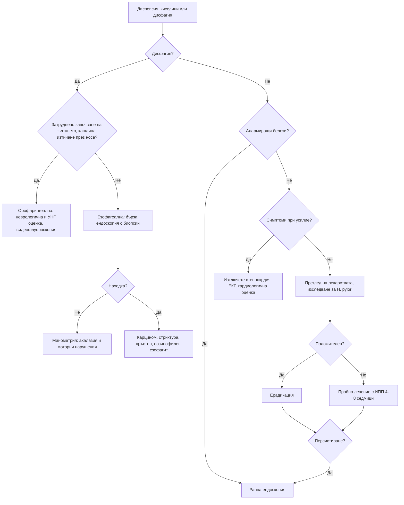

# Глава 21. Диспепсия, киселини и дисфагия

> **Част V. Храносмилателна система**

## Цели на главата

- Да се разграничават диспепсията, гастроезофагеалният рефлукс и сърдечната болка.
- Да се прилага стратегията „изследване и лечение“ за *Helicobacter pylori* и да се определя кога е нужна ендоскопия.
- Да се разграничава орофарингеалната от езофагеалната дисфагия.
- Да се разпознават механичните и моторните причини за езофагеална дисфагия.
- Да се определят показанията и спешността на ендоскопското изследване при дисфагия (дисфагията винаги изисква изследване).

---

## А. ДИСПЕПСИЯ И КИСЕЛИНИ

## 1. Определения

- **Диспепсия** — един или повече от следните симптоми: пълнота след хранене, ранно засищане, епигастрална болка или парене.
- **Киселини (парене зад гръдната кост)** и **регургитация** са типичните симптоми на ГЕРБ.
- В практиката симптомите често се припокриват.

## 2. Причини за диспепсия

| Група | Причини |
|---|---|
| **Функционална диспепсия** | 70–80% от изследваните пациенти |
| **Пептична язва** | *H. pylori*, НСПВС и аспирин, съчетание с антикоагуланти или SSRI, стрес (при тежко болни), синдром на Zollinger-Ellison |
| **ГЕРБ** | С или без езофагит |
| **Злокачествени** | Карцином на стомаха или хранопровода (под 1–2% от всички диспепсии, но по-често при възрастни с алармиращи белези) |
| **Лекарства** | НСПВС, аспирин, бисфосфонати, желязо, калиеви препарати, антибиотици, метформин, GLP-1 агонисти, кортикостероиди, теофилин; калциеви антагонисти и нитрати (засилват рефлукса) |
| **Жлъчни пътища и панкреас** | Жлъчнокаменна болест, хроничен панкреатит, карцином на панкреаса |
| **Други стомашно-чревни** | Цьолиакия, гастропареза (диабет), СРЧ, чернодробни заболявания |
| **Извънкоремни** | **Стенокардия** и миокарден инфаркт, хиперкалциемия, хронично бъбречно заболяване, бременност |
| **Психосоциални** | Тревожност, депресия |

## 3. Безопасна диагностична стратегия

| Въпрос | Отговор |
|---|---|
| **Вероятна диагноза** | Функционална диспепсия, ГЕРБ, гастрит с *H. pylori*, диспепсия от НСПВС |
| **Сериозни заболявания, които не бива да се пропускат** | Карцином на стомаха и хранопровода, усложнена пептична язва (кървене, перфорация), **миокардна исхемия**, карцином на панкреаса |
| **Чести капани** | Стенокардия, приета за „киселини“; жлъчнокаменна болест; лекарства (бисфосфонати, НСПВС, GLP-1 агонисти); цьолиакия; гастропареза; бременност |
| **Маскиращи заболявания** | Депресия, захарен диабет, лекарства, хиперкалциемия |
| **Психосоциални аспекти** | Стрес, тревожност, злоупотреба с алкохол |

## 4. Алармиращи белези (показания за ранна ендоскопия)

- **Дисфагия** при всяка възраст.
- **Възраст над 55 години със загуба на тегло** и диспепсия, рефлукс или болка в горната половина на корема. Праговете за възраст се различават в отделните препоръки. В страни със средна честота на карцинома на стомаха, каквато е България, прагът е по-нисък.
- Стомашно-чревно кървене (хематемеза, мелена) или желязодефицитна анемия.
- Упорито повръщане.
- Палпируема формация в епигастриума.
- Прогресиращи симптоми.
- Фамилна анамнеза за карцином на горния стомашно-чревен тракт.
- Предишна операция на стомаха, пептична язва в миналото.
- Жълтеница, лимфаденопатия (възел на Virchow).

## 5. Подход при пациент без алармиращи белези

1. **Преглед на лекарствата** (НСПВС!) и начина на живот (алкохол, тютюнопушене, тегло, късно хранене).
2. **Изследване за *H. pylori*** (уреазен дихателен тест или антиген в изпражненията) и ерадикация при положителен резултат. Преди изследването трябва да се спрат **инхибиторите на протонната помпа (ИПП) за 2 седмици** и **антибиотиците за 4 седмици**, защото те дават фалшиво отрицателни резултати. Серологията не разграничава активната от прекараната инфекция.
3. **Пробно лечение с ИПП** за 4–8 седмици, ако няма ефект от ерадикацията или ако тестът е отрицателен.
4. **Ендоскопия**, ако симптомите персистират или рецидивират.

## 6. ГЕРБ

- **Типични симптоми:** парене зад гръдната кост, регургитация на кисело съдържимо, засилване след хранене, при навеждане и при лягане.
- **Извънхранопроводни прояви:** хронична кашлица, ларингит, дрезгав глас, астма, ерозии на зъбния емайл, некардиална болка в гърдите.
- **Усложнения:** езофагит, пептична стриктура (дисфагия), **хранопровод на Barrett** и аденокарцином.
- **Рискови фактори за хранопровод на Barrett:** мъжки пол, възраст над 50 години, дългогодишен рефлукс (над 5 години), централно затлъстяване, тютюнопушене, фамилна анамнеза. При наличие на няколко от тях се обсъжда скринингова ендоскопия.

## 7. Стенокардия, представена като диспепсия

Епигастрално или ретростернално парене, което се появява **при усилие** и отминава в покой, е стенокардия, а не рефлукс. Това важи особено при възрастни хора, при диабетици и при жени. При съмнение се записва ЕКГ и пациентът се оценява кардиологично (вж. глава 9).

---

## Б. ДИСФАГИЯ

## 8. Определения

- **Дисфагия** — затруднено преминаване на храната от устата към стомаха.
- **Одинофагия** — болезнено гълтане.
- **Глобусно усещане** — усещане за „буца в гърлото“ между храненията, без истинско затруднение при гълтане. Често се облекчава при хранене.

**Дисфагията винаги изисква изследване.**

## 9. Орофарингеална и езофагеална дисфагия

| Белег | Орофарингеална | Езофагеална |
|---|---|---|
| Същност | Затруднено **започване** на гълтането | Храната „засяда“ **след** гълтането, зад гръдната кост или в епигастриума |
| Придружаващи симптоми | Кашлица и задавяне при гълтане, изтичане на течност през носа, назален говор, аспирационни пневмонии | Регургитация, болка в гърдите, загуба на тегло |
| Причини | **Неврологични:** инсулт, болест на Parkinson, миастения гравис, амиотрофична латерална склероза, множествена склероза. **Мускулни:** полимиозит, окулофарингеална дистрофия. **Структурни:** **дивертикул на Zenker** (регургитация на несмляна храна, лош дъх, клокочене във врата), тумори на главата и шията, остеофити на шийните прешлени. **Други:** сухота в устата (синдром на Sjögren, лекарства) | Вж. таблицата по-долу |
| Изследване | **Видеофлуороскопия** (модифицирана бариева каша), фиброоптична ендоскопска оценка на гълтането, УНГ и неврологичен преглед | **Горна ендоскопия** (първо изследване) |

## 10. Причини за езофагеална дисфагия

| Тип | Характеристика | Причини |
|---|---|---|
| **Механична обструкция** | Дисфагия **само за твърди храни** | **Карцином** (прогресираща дисфагия, загуба на тегло, възраст над 50 години); **пептична стриктура** (дългогодишни киселини); **пръстен на Schatzki** (интермитентна дисфагия, „синдромът на пържолата“); **еозинофилен езофагит** (млади мъже, атопия, **заклещване на хранителен болус**); ципи (синдром на Plummer-Vinson с желязодефицит); външна компресия (медиастинални тумори, лимфни възли, аневризма, ляво предсърдие) |
| **Моторно нарушение** | Дисфагия **за твърди храни и течности от самото начало** | **Ахалазия** (регургитация на несмляна храна, загуба на тегло, болка в гърдите, нощна кашлица); дифузен спазъм на хранопровода (болка в гърдите); **системна склероза** (киселини, феномен на Raynaud); хиперконтрактилен хранопровод |

**Одинофагия:** инфекциозен езофагит (кандида, херпес симплекс, цитомегаловирус, особено при имуносупресия); **медикаментозен езофагит** (доксициклин, бисфосфонати, НСПВС, калиев хлорид, желязо — таблетката се задържа в хранопровода, особено при прием без достатъчно вода или преди лягане); каустични увреждания; лъчеви увреждания.

## 11. Червени флагове при дисфагия

- Прогресираща дисфагия и загуба на тегло.
- Възраст над 50 години.
- Анемия, кървене.
- Остро заклещване на хранителен болус с невъзможност за гълтане на слюнка — **спешна ендоскопия**.
- Аспирационни пневмонии.
- Неврологични симптоми.
- Дрезгав глас, лимфаденопатия на шията.

## 12. Изследвания

- **Горна ендоскопия с биопсии** — първо изследване при езофагеална дисфагия. **Биопсии за еозинофилен езофагит се вземат дори при макроскопски нормален хранопровод.**
- Рентгеново изследване с бариева каша — при подозрение за дивертикул на Zenker, ахалазия, ципи, при неуспешна ендоскопия.
- **Манометрия с висока разделителна способност** — ахалазия и други моторни нарушения.
- Видеофлуороскопия — орофарингеална дисфагия.
- КТ — стадиране и външна компресия.
- ПКК, феритин (синдром на Plummer-Vinson).

---

## 13. Диагностичен алгоритъм

---

## 14. Клинични перли

- „Киселини“ при усилие, които отминават в покой, са стенокардия.
- Всяка дисфагия изисква ендоскопия. Изключение не се прави и при млади пациенти.
- Млад мъж с астма или алергичен ринит и епизоди на заклещване на храна: еозинофилен езофагит. Поискайте биопсии.
- Дисфагия за течности от самото начало: моторно нарушение, най-вероятно ахалазия.
- Изследването за *H. pylori* дава фалшиво отрицателен резултат, ако пациентът приема ИПП.
- Желязодефицитна анемия и дисфагия при жена на средна възраст: синдром на Plummer-Vinson (ципи в хранопровода, повишен риск от плоскоклетъчен карцином).
- Възрастен пациент с регургитация на несмляна храна от предишния ден и лош дъх: дивертикул на Zenker.

---

## 15. Клиничен случай

**Случай.** Мъж на 24 години с алергичен ринит и астма в детството има от 3 години епизоди, при които храната „засяда“ зад гръдната кост, особено месо и хляб. Налага се да пие вода или да предизвиква повръщане. Храни се бавно и нарязва храната на малки хапки. Преди седмица е прекарал в спешно отделение 6 часа със заклещено парче месо. ИПП е приемал за кратко без ефект.

**Въпроси.** 1) Коя е най-вероятната диагноза? 2) Какво трябва да се поиска при ендоскопията?

**Обсъждане.** Млад мъж с атопия, интермитентна дисфагия за твърди храни, заклещване на хранителен болус и адаптивно хранително поведение (бавно хранене, малки хапки, много вода) има типичната картина на **еозинофилен езофагит**. При ендоскопията хранопроводът може да изглежда почти нормален или да има концентрични пръстени, надлъжни бразди и белезникави ексудати. Задължително се вземат **биопсии от проксималния и дисталния хранопровод**. Диагнозата се потвърждава при ≥ 15 еозинофила в едно зрително поле с голямо увеличение. Лечението включва ИПП във висока доза, локални кортикостероиди, елиминационни диети, а при тежко протичане и биологична терапия.

**Поука.** Еозинофилният езофагит е най-честата причина за заклещване на хранителен болус при млади хора. Без биопсия диагнозата се пропуска.

<!-- навигация -->

---

[← Глава 20. Хронична и рецидивираща коремна болка](20-hronichna-koremna-bolka.md) · [Съдържание](../README.md) · [Глава 22. Гадене и повръщане →](22-gadene-povrashtane.md)
