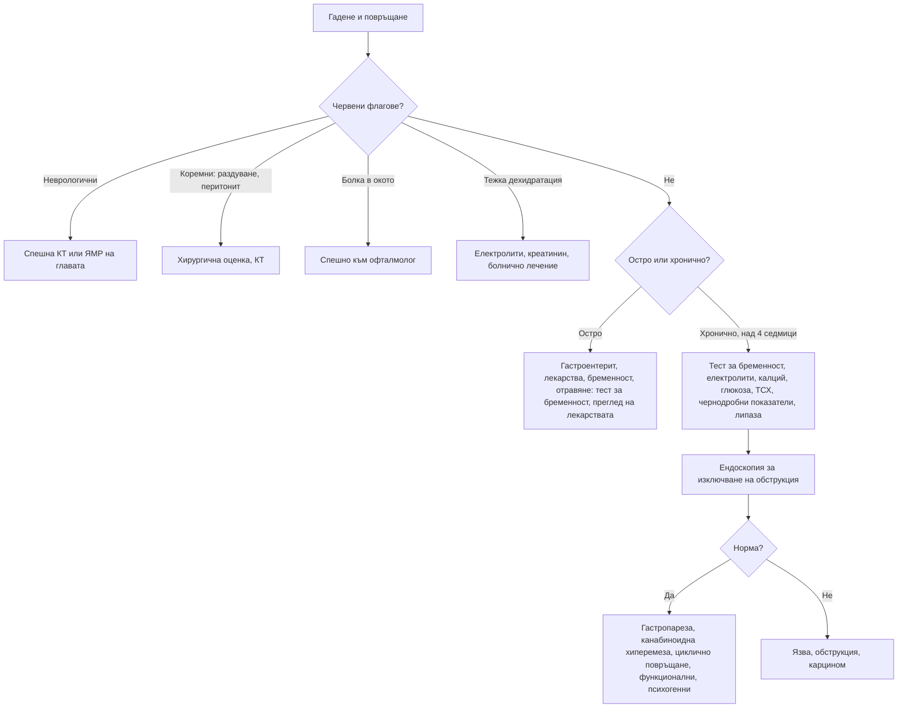

# Глава 22. Гадене и повръщане

> **Част V. Храносмилателна система**

## Цели на главата

- Да се познават механизмите на гаденето и повръщането и основните групи причини.
- Да се използват времето, съдържанието и придружаващите симптоми за насочване на диагнозата.
- Да се разпознават извънкоремните причини, особено неврологичните, метаболитните и лекарствените.
- Да се оценяват усложненията: дехидратация, електролитни и киселинно-алкални нарушения.

---

## 1. Патофизиология

Повръщането се координира от центъра за повръщане в мозъчния ствол. Той получава сигнали от четири източника:

| Източник | Стимули | Примери |
|---|---|---|
| **Хеморецепторна тригерна зона** (area postrema, извън кръвно-мозъчната бариера) | Лекарства, токсини, метаболитни нарушения | Химиотерапия, опиоиди, дигоксин, уремия, кетоацидоза, бременност |
| **Стомашно-чревен тракт** (вагусови и симпатикови аференти) | Разтягане, дразнене, възпаление | Гастроентерит, непроходимост, гастропареза |
| **Вестибуларен апарат** | Движение, вестибуларни нарушения | Болест на пътуването, лабиринтит, ДППВ, болест на Menière |
| **Мозъчна кора и лимбична система** | Мисли, миризми, болка, тревожност, повишено вътречерепно налягане | Антиципаторно повръщане, мозъчен тумор, менингит |

---

## 2. Етиологична класификация

| Група | Причини |
|---|---|
| **Стомашно-чревни** | **Гастроентерит** (най-честата остра причина), хранително отравяне, **чревна непроходимост**, пептична язва, стеноза на пилора, **гастропареза**, панкреатит, холецистит, хепатит, апендицит, карцином, функционални синдроми (синдром на циклично повръщане, хронично гадене и повръщане, **синдром на канабиноидната хиперемеза**, синдром на руминацията) |
| **Неврологични** | **Повишено вътречерепно налягане** (тумор, кръвоизлив, хидроцефалия), менингит, енцефалит, **мигрена**, **вестибуларни нарушения**, инсулт в задната черепна ямка, травма на главата |
| **Метаболитни и ендокринни** | **Бременност** (включително hyperemesis gravidarum), **диабетна кетоацидоза**, уремия, **хиперкалциемия**, хипонатриемия, **надбъбречна недостатъчност**, хипертиреоидизъм |
| **Лекарства и токсини** | Химиотерапия, опиоиди, антибиотици (еритромицин), НСПВС, **дигоксин** (токсичност), теофилин, литий, метформин, **GLP-1 агонисти**, желязо, алкохол, **канабис**, **парацетамол** (в ранния стадий на свръхдозиране), **гъби**, **въглероден оксид** |
| **Сърдечни** | **Долен миокарден инфаркт**, сърдечна недостатъчност (застой в червата) |
| **Инфекции** | Сепсис, инфекция на пикочните пътища (при възрастни и деца), пневмония, отит |
| **Очни** | **Остра закритоъгълна глаукома** |
| **Урогенитални** | Бъбречна колика, торзия на тестиса или яйчника |
| **Психични** | Анорексия и булимия, тревожност, депресия, антиципаторно повръщане |
| **Други** | Болка, лъчетерапия, следоперативен период, болест на пътуването |

---

## 3. Безопасна диагностична стратегия

| Въпрос | Отговор |
|---|---|
| **Вероятна диагноза** | Гастроентерит, хранително отравяне, лекарства, бременност, мигрена, вестибуларни нарушения |
| **Сериозни заболявания, които не бива да се пропускат** | Чревна непроходимост, апендицит, панкреатит, **диабетна кетоацидоза**, **повишено вътречерепно налягане**, менингит, **миокарден инфаркт**, сепсис, **остра глаукома**, отравяне с парацетамол, гъби или въглероден оксид, надбъбречна криза, хиперкалциемия |
| **Чести капани** | Бременност; дигоксинова токсичност при възрастни хора; синдром на канабиноидната хиперемеза; GLP-1 агонисти; гастропареза при диабет; хипонатриемия; инфекция на пикочните пътища при възрастни; инсулт в малкия мозък, приет за „гастроентерит“ или „вертиго“ |
| **Маскиращи заболявания** | Захарен диабет, лекарства, депресия, бъбречна недостатъчност, надбъбречна недостатъчност |
| **Психосоциални аспекти** | Хранителни разстройства, тревожност, злоупотреба с алкохол или канабис |

---

## 4. Анамнеза

- **Продължителност:** остро (часове–дни) или хронично (над 4 седмици).
- **Време:**
  - сутрин преди хранене — бременност, повишено вътречерепно налягане, уремия, алкохол;
  - непосредствено след хранене — психогенно, пептична язва в областта на пилора;
  - 1 или повече часа след хранене, с несмляна храна — **обструкция на изхода на стомаха**, **гастропареза**;
  - в пристъпи с безсимптомни интервали — синдром на циклично повръщане, канабиноидна хиперемеза, мигрена.
- **Съдържание:**
  - несмляна храна отпреди часове — гастропареза, обструкция на изхода на стомаха, ахалазия;
  - жлъчка — обструкция под дуоденалната папила;
  - **фекалоидно** — дистална непроходимост, гастроколична фистула;
  - **кръв или „утайка от кафе“** — кървене от горния стомашно-чревен тракт (вж. глава 25).
- **Повръщане без гадене („на струя“)** — повишено вътречерепно налягане; хипертрофична пилорна стеноза при кърмачета.
- **Придружаващи симптоми:**
  - главоболие, зрителни нарушения, неврологичен дефицит (вътречерепна причина);
  - световъртеж, шум в ушите (вестибуларна причина);
  - **болка в окото и замъглено зрение с ореоли около светлините** (глаукома);
  - коремна болка, диария, треска, жълтеница, болка в гърдите;
  - полиурия и полидипсия (диабет, хиперкалциемия).
- **Лекарства**, алкохол, **канабис** (облекчаване с **горещи душове или вани** е типично за канабиноидната хиперемеза).
- Консумация на гъби, контакт с болни, пътуване.
- Последна менструация.

---

## 5. Физикален преглед

- **Хидратация:** лигавици, кожен тургор, капилярно пълнене, ортостатична хипотония, тахикардия, диуреза.
- Температура, тегло.
- Корем: раздуване, болезненост, перитонеални белези, херниални отвори, шум от плисък (при обструкция на изхода на стомаха).
- **Неврологичен преглед:** вратна ригидност, нистагъм, атаксия, фокален дефицит, **фундоскопия** (едем на папилата).
- Очи: зачервяване, мътна роговица, фиксирана средно широка зеница (глаукома).
- Кожа: жълтеница, хиперпигментация (надбъбречна недостатъчност), ерозии на зъбите и мазоли по опакото на ръката (булимия).

---

## 6. Усложнения

- **Дехидратация**, остро бъбречно увреждане.
- **Хипокалиемична, хипохлоремична метаболитна алкалоза.**
- Хипонатриемия.
- **Синдром на Mallory-Weiss** (надлъжно разкъсване на лигавицата в областта на кардията с хематемеза след многократно повръщане).
- **Синдром на Boerhaave** (руптура на хранопровода — силна болка в гърдите след повръщане, подкожен емфизем; вж. глава 9).
- Аспирационна пневмония.
- Недохранване, загуба на тегло, дефицит на тиамин (енцефалопатия на Wernicke при продължително повръщане, особено при бременни и при алкохолици).

---

## 7. Червени флагове

- Главоболие, неврологичен дефицит, нарушено съзнание, едем на папилата.
- Повръщане на струя без гадене.
- Раздуване на корема, спиране на газовете, фекалоидно или жлъчно повръщане.
- Силна коремна болка, перитонеални белези.
- Хематемеза или повръщане на „утайка от кафе“.
- Тежка дехидратация, остро бъбречно увреждане, изразени електролитни нарушения.
- Болка в гърдите, симптоми на исхемия.
- Болка в окото със замъглено зрение.
- Захарен диабет (кетоацидоза) или известна надбъбречна недостатъчност (криза).
- Възможна бременност с упорито повръщане.
- Загуба на тегло, дисфагия.

---

## 8. Диференциално-диагностична таблица

| Заболяване | Ключови белези | Ключови изследвания |
|---|---|---|
| **Гастроентерит** | Остро начало, диария, контакт с болни, дифузна спазмична болка | Клинична диагноза; при тежест — електролити, креатинин |
| **Чревна непроходимост** | Коликообразна болка, раздуване, спиране на газовете, предишни операции | Рентгенография, КТ |
| **Гастропареза** | Диабет, ранно засищане, повръщане на несмляна храна | Сцинтиграфия на стомашното изпразване след изключване на обструкция с ендоскопия |
| **Бременност, hyperemesis gravidarum** | Закъсняла менструация, сутрешно гадене; при хиперемеза — загуба на тегло над 5%, кетонурия, дехидратация | Тест за бременност, ехография (многоплодна или мехурна бременност) |
| **Диабетна кетоацидоза** | Полиурия, полидипсия, коремна болка, дишане на Kussmaul | Глюкоза, кетони, кръвно-газов анализ |
| **Повишено вътречерепно налягане** | Сутрешно главоболие, повръщане на струя, неврологични симптоми | Фундоскопия, КТ или ЯМР |
| **Вестибуларни нарушения** | Въртеливо световъртеж, нистагъм, провокация от движението | Клиничен преглед, тестове (вж. глава 41) |
| **Остра закритоъгълна глаукома** | Болка в окото, главоболие, замъглено зрение, ореоли около светлините, червено око, фиксирана зеница | Спешна офталмологична оценка, вътреочно налягане |
| **Дигоксинова токсичност** | Възрастен пациент, бъбречна недостатъчност, зрителни нарушения (жълто-зелено виждане), аритмии | Ниво на дигоксин, калий, ЕКГ |
| **Канабиноидна хиперемеза** | Хронична ежедневна употреба на канабис, пристъпи на повръщане, облекчаване с горещи душове | Клинична диагноза; отзвучава при спиране на употребата |
| **Хиперкалциемия** | Жажда, запек, объркване, камъни | Коригиран калций, ПТХ |
| **Надбъбречна недостатъчност** | Хиперпигментация, хипотония, хипонатриемия, хиперкалиемия, загуба на тегло | Кортизол, ACTH |
| **Долен миокарден инфаркт** | Гадене и повръщане с епигастрален дискомфорт, изпотяване | ЕКГ, тропонин |

---

## 9. Изследвания

**Остро повръщане с лека степен без червени флагове:** обикновено не са необходими изследвания.

**При тежко, продължително или неясно повръщане:**

- тест за бременност;
- електролити (Na, K, Cl), креатинин, глюкоза, калций, магнезий;
- чернодробни показатели, липаза;
- ПКК, CRP;
- кръвно-газов анализ;
- изследване на урината (кетони, инфекция);
- ЕКГ;
- нива на лекарства (дигоксин, литий, теофилин), парацетамол при съмнение за свръхдоза.

**Образни и инструментални изследвания според клиничните данни:** рентгенография или КТ на корема; КТ или ЯМР на главата; ендоскопия; сцинтиграфия на стомашното изпразване.

---

## 10. Диагностичен алгоритъм

---

## 11. Клинични перли

- „Гастроентерит“ без диария е подозрителна диагноза. Помислете за апендицит, непроходимост, кетоацидоза, миокарден инфаркт и повишено вътречерепно налягане.
- При всяка жена в детеродна възраст с повръщане направете тест за бременност.
- Повръщане, главоболие и червено око при възрастен човек: остра глаукома, а не гастроентерит.
- Повръщане и световъртеж с невъзможност за самостоятелна походка: мислете за инсулт в малкия мозък.
- Пристъпи на повръщане, облекчавани с горещи душове, при хроничен употребител на канабис: канабиноидна хиперемеза.
- Възрастен човек на дигоксин с гадене и зрителни нарушения: изследвайте нивото на дигоксина, калия и бъбречната функция.
- Продължителното повръщане изчерпва тиамина. Прилагайте тиамин преди глюкоза при застрашени пациенти.

---

## 12. Клиничен случай

**Случай.** Мъж на 23 години постъпва за трети път в спешно отделение за една година с неукротимо повръщане и дифузна коремна болка. Предишните изследвания, включително ендоскопия и КТ на корема, са нормални. Между пристъпите се чувства добре. Майка му споделя, че по време на пристъпите той прекарва часове под горещия душ, защото само това го облекчава. При директен въпрос признава ежедневна употреба на канабис от 4 години.

**Въпроси.** 1) Коя е най-вероятната диагноза? 2) Какво е лечението?

**Обсъждане.** Цикличното повръщане при хроничен ежедневен употребител на канабис, нормалните изследвания и характерното облекчаване от горещи душове и вани са типични за **синдрома на канабиноидната хиперемеза**. Антиеметиците често са неефективни по време на пристъпа. Могат да помогнат локално приложен капсаицин и някои антипсихотици. Единственото трайно лечение е **спирането на употребата на канабис**. Симптомите изчезват за седмици до месеци.

**Поука.** Директният и безпристрастен въпрос за употреба на психоактивни вещества може да спести множество ненужни изследвания.

<!-- навигация -->

---

[← Глава 21. Диспепсия, киселини и дисфагия](21-dispepsia-disfagia.md) · [Съдържание](../README.md) · [Глава 23. Диария →](23-diaria.md)
