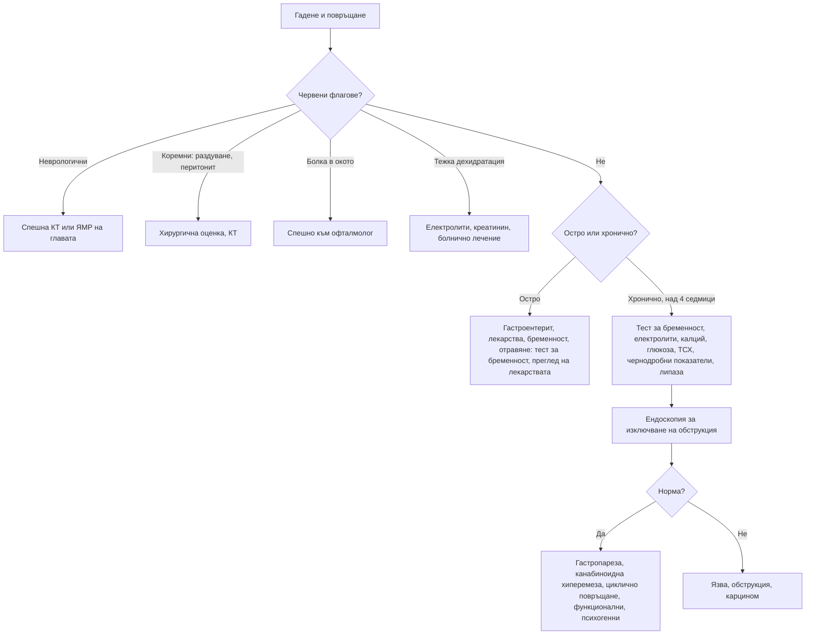

# Глава 22. Гадене и повръщане

> **Част V. Храносмилателна система**

## Цели на главата

- Да се обясняват механизмите на гаденето и повръщането и да се изброяват основните групи причини.
- Да се използват времето, съдържанието и придружаващите симптоми за насочване на диагнозата.
- Да се разпознават извънкоремните причини, особено неврологичните, метаболитните и лекарствените.
- Да се оценяват усложненията: дехидратация, електролитни и киселинно-алкални нарушения.

## Ключови моменти

- Повръщането се задейства от хеморецепторната тригерна зона, стомашно-чревния тракт, вестибуларния апарат и мозъчната кора. Всеки източник има свои типични причини.
- Времето, съдържанието на повърнатото и придружаващите симптоми насочват към причината: несмляна храна – обструкция или гастропареза; фекалоидно – дистална непроходимост; на струя без гадене – повишено вътречерепно налягане.
- Извънкоремните причини (бременност, кетоацидоза, миокарден инфаркт, глаукома, вътречерепни причини, лекарства) са чести капани. При всяка жена в детеродна възраст се прави тест за бременност.
- Продължителното повръщане води до дехидратация, хипокалиемична хипохлоремична алкалоза и дефицит на тиамин. Тиаминът се дава преди глюкозата при застрашени пациенти *(SORT C [1])*.
- Гастропарезата се диагностицира със сцинтиграфия след изключване на обструкция с ендоскопия *(SORT B [2])*. Цикличното повръщане при хроничен употребител на канабис, облекчавано с горещи душове, е канабиноидна хиперемеза *(SORT C [4])*.

---

## 1. Патофизиология

Повръщането се координира от центъра за повръщане в мозъчния ствол. Той получава сигнали от четири източника:

*Таблица 22.1. Механизми на гаденето и повръщането.*

| Източник | Стимули | Примери |
|---|---|---|
| **Хеморецепторна тригерна зона** (area postrema, извън кръвно-мозъчната бариера) | Лекарства, токсини, метаболитни нарушения | Химиотерапия, опиоиди, дигоксин, уремия, кетоацидоза, бременност |
| **Стомашно-чревен тракт** (вагусови и симпатикови аференти) | Разтягане, дразнене, възпаление | Гастроентерит, непроходимост, гастропареза |
| **Вестибуларен апарат** | Движение, вестибуларни нарушения | Болест на пътуването, лабиринтит, ДППВ, болест на Menière |
| **Мозъчна кора и лимбична система** | Мисли, миризми, болка, тревожност, повишено вътречерепно налягане | Антиципаторно повръщане, мозъчен тумор, менингит |

---

## 2. Етиологична класификация

*Таблица 22.2. Причини за гадене и повръщане.*

| Група | Причини |
|---|---|
| **Стомашно-чревни** | Гастроентерит (най-честата остра причина), хранително отравяне, чревна непроходимост, пептична язва, стеноза на пилора, гастропареза, панкреатит, холецистит, хепатит, апендицит, карцином, функционални синдроми (синдром на циклично повръщане, хронично гадене и повръщане, синдром на канабиноидната хиперемеза, синдром на руминацията) |
| **Неврологични** | Повишено вътречерепно налягане (тумор, кръвоизлив, хидроцефалия), менингит, енцефалит, мигрена, вестибуларни нарушения, инсулт в задната черепна ямка, травма на главата |
| **Метаболитни и ендокринни** | Бременност (включително hyperemesis gravidarum), диабетна кетоацидоза, уремия, хиперкалциемия, хипонатриемия, надбъбречна недостатъчност, хипертиреоидизъм |
| **Лекарства и токсини** | Химиотерапия, опиоиди, антибиотици (еритромицин), НСПВС, дигоксин (токсичност), теофилин, литий, метформин, агонисти на GLP-1 рецепторите, желязо, алкохол, канабис, парацетамол (в ранния стадий на свръхдозиране), гъби, въглероден оксид |
| **Сърдечни** | Долен миокарден инфаркт, сърдечна недостатъчност (застой в червата) |
| **Инфекции** | Сепсис, инфекция на пикочните пътища (при възрастни и деца), пневмония, отит |
| **Очни** | **Остра закритоъгълна глаукома** |
| **Урогенитални** | Бъбречна колика, торзия на тестиса или яйчника |
| **Психични** | Анорексия и булимия, тревожност, депресия, антиципаторно повръщане |
| **Други** | Болка, лъчетерапия, следоперативен период, болест на пътуването |

---

## 3. Безопасна диагностична стратегия

*Таблица 22.3. Безопасна диагностична стратегия.*

| Въпрос | Отговор |
|---|---|
| **Вероятна диагноза** | Гастроентерит, хранително отравяне, лекарства, бременност, мигрена, вестибуларни нарушения |
| **Сериозни заболявания, които не бива да се пропускат** | Чревна непроходимост, апендицит, панкреатит, диабетна кетоацидоза, повишено вътречерепно налягане, менингит, миокарден инфаркт, сепсис, остра глаукома, отравяне с парацетамол, гъби или въглероден оксид, надбъбречна криза, хиперкалциемия |
| **Чести капани** | Бременност; дигоксинова токсичност при възрастни хора; синдром на канабиноидната хиперемеза; агонисти на GLP-1 рецепторите; гастропареза при диабет; хипонатриемия; инфекция на пикочните пътища при възрастни; инсулт в малкия мозък, приет за „гастроентерит“ или „вертиго“ |
| **Маскиращи заболявания** | Захарен диабет, лекарства, депресия, бъбречна недостатъчност, надбъбречна недостатъчност |
| **Психосоциални аспекти** | Хранителни разстройства, тревожност, злоупотреба с алкохол или канабис |

---

## 4. Анамнеза

- **Продължителност:** остро (часове–дни) или хронично (над 4 седмици).
- **Време:**
  - сутрин преди хранене – бременност, повишено вътречерепно налягане, уремия, алкохол;
  - непосредствено след хранене – психогенно, пептична язва в областта на пилора;
  - 1 или повече часа след хранене, с несмляна храна – обструкция на изхода на стомаха, гастропареза;
  - в пристъпи с безсимптомни интервали – синдром на циклично повръщане, канабиноидна хиперемеза, мигрена.
- **Съдържание:**
  - несмляна храна отпреди часове – гастропареза, обструкция на изхода на стомаха, ахалазия;
  - жлъчка – обструкция под дуоденалната папила;
  - **фекалоидно** – дистална непроходимост, гастроколична фистула;
  - **кръв или „утайка от кафе“** – кървене от горния стомашно-чревен тракт (вж. глава 25).
- **Повръщане без гадене („на струя“)** – повишено вътречерепно налягане; хипертрофична пилорна стеноза при кърмачета.
- **Придружаващи симптоми:**
  - главоболие, зрителни нарушения, неврологичен дефицит (вътречерепна причина);
  - световъртеж, шум в ушите (вестибуларна причина);
  - **болка в окото и замъглено зрение с ореоли около светлините** (глаукома);
  - коремна болка, диария, треска, жълтеница, болка в гърдите;
  - полиурия и полидипсия (диабет, хиперкалциемия).
- Лекарства, алкохол, канабис (облекчаване с горещи душове или вани е типично за канабиноидната хиперемеза).
- Консумация на гъби, контакт с болни, пътуване.
- Последна менструация.

---

## 5. Физикален преглед

- **Хидратация:** лигавици, кожен тургор, капилярно пълнене, ортостатична хипотония, тахикардия, диуреза.
- Температура, тегло.
- Корем: раздуване, болезненост, перитонеални белези, херниални отвори, шум от плисък (при обструкция на изхода на стомаха).
- **Неврологичен преглед:** вратна ригидност, нистагъм, атаксия, фокален дефицит, **фундоскопия** (едем на папилата).
- Очи: зачервяване, мътна роговица, фиксирана средно широка зеница (глаукома).
- Кожа: жълтеница, хиперпигментация (надбъбречна недостатъчност), ерозии на зъбите и мазоли по опакото на ръката (булимия).

---

## 6. Усложнения

- **Дехидратация**, остро бъбречно увреждане.
- **Хипокалиемична, хипохлоремична метаболитна алкалоза.**
- Хипонатриемия.
- **Синдром на Mallory-Weiss** (надлъжно разкъсване на лигавицата в областта на кардията с хематемеза след многократно повръщане).
- **Синдром на Boerhaave** (руптура на хранопровода – силна болка в гърдите след повръщане, подкожен емфизем; вж. глава 9).
- Аспирационна пневмония.
- Недохранване, загуба на тегло, дефицит на тиамин (енцефалопатия на Wernicke при продължително повръщане, особено при бременни и при алкохолици) [1].

---

## 7. Червени флагове

- Главоболие, неврологичен дефицит, нарушено съзнание, едем на папилата.
- Повръщане на струя без гадене.
- Раздуване на корема, спиране на газовете, фекалоидно или жлъчно повръщане.
- Силна коремна болка, перитонеални белези.
- Хематемеза или повръщане на „утайка от кафе“.
- Тежка дехидратация, остро бъбречно увреждане, изразени електролитни нарушения.
- Болка в гърдите, симптоми на исхемия.
- Болка в окото със замъглено зрение.
- Захарен диабет (кетоацидоза) или известна надбъбречна недостатъчност (криза).
- Възможна бременност с упорито повръщане.
- Загуба на тегло, дисфагия.

---

## 8. Диференциално-диагностична таблица

*Таблица 22.4. Диференциална диагноза на гаденето и повръщането.*

| Заболяване | Ключови белези | Ключови изследвания |
|---|---|---|
| **Гастроентерит** | Остро начало, диария, контакт с болни, дифузна спазмична болка | Клинична диагноза; при тежест – електролити, креатинин |
| **Чревна непроходимост** | Коликообразна болка, раздуване, спиране на газовете, предишни операции | Рентгенография, КТ |
| **Гастропареза** | Диабет, ранно засищане, повръщане на несмляна храна | Сцинтиграфия на стомашното изпразване след изключване на обструкция с ендоскопия [2] |
| **Бременност, hyperemesis gravidarum** | Закъсняла менструация, сутрешно гадене; при хиперемеза – загуба на тегло над 5%, дехидратация и електролитни нарушения | Тест за бременност, ехография (многоплодна или мехурна бременност) [3] |
| **Диабетна кетоацидоза** | Полиурия, полидипсия, коремна болка, дишане на Kussmaul | Глюкоза, кетони, кръвно-газов анализ |
| **Повишено вътречерепно налягане** | Сутрешно главоболие, повръщане на струя, неврологични симптоми | Фундоскопия, КТ или ЯМР |
| **Вестибуларни нарушения** | Въртеливо световъртеж, нистагъм, провокация от движението | Клиничен преглед, тестове (вж. глава 41) |
| **Остра закритоъгълна глаукома** | Болка в окото, главоболие, замъглено зрение, ореоли около светлините, червено око, фиксирана зеница | Спешна офталмологична оценка, вътреочно налягане |
| **Дигоксинова токсичност** | Възрастен пациент, бъбречна недостатъчност, зрителни нарушения (жълто-зелено виждане), аритмии | Ниво на дигоксин, калий, ЕКГ |
| **Канабиноидна хиперемеза** | Хронична ежедневна употреба на канабис, пристъпи на повръщане, облекчаване с горещи душове | Клинична диагноза; отзвучава при спиране на употребата [4] |
| **Хиперкалциемия** | Жажда, запек, объркване, камъни | Коригиран калций, ПТХ |
| **Надбъбречна недостатъчност** | Хиперпигментация, хипотония, хипонатриемия, хиперкалиемия, загуба на тегло | Кортизол, ACTH |
| **Долен миокарден инфаркт** | Гадене и повръщане с епигастрален дискомфорт, изпотяване | ЕКГ, тропонин |

---

## 9. Изследвания

**Остро повръщане с лека степен без червени флагове:** обикновено не са необходими изследвания.

**При тежко, продължително или неясно повръщане:**

- тест за бременност;
- електролити (Na, K, Cl), креатинин, глюкоза, калций, магнезий;
- чернодробни показатели, липаза;
- ПКК, CRP;
- кръвно-газов анализ;
- изследване на урината (кетони, инфекция);
- ЕКГ;
- нива на лекарства (дигоксин, литий, теофилин), парацетамол при съмнение за свръхдоза.

**Образни и инструментални изследвания според клиничните данни:** рентгенография или КТ на корема; КТ или ЯМР на главата; ендоскопия; сцинтиграфия на стомашното изпразване.

---

## 10. Диагностичен алгоритъм

*Фигура 22.1. Диагностичен алгоритъм: гадене и повръщане. Схема на авторите въз основа на източниците, цитирани в главата.*

Текстово описание на фигура 22.1

1. Гадене и повръщане. Следва: към т. 2.
2. **Въпрос:** Червени флагове? Неврологични – към т. 3; Коремни: раздуване, перитонит – към т. 4; Болка в окото – към т. 5; Тежка дехидратация – към т. 6; Не – към т. 7.
3. Спешна КТ или ЯМР на главата.
4. Хирургична оценка, КТ.
5. Спешно към офталмолог.
6. Електролити, креатинин, болнично лечение.
7. **Въпрос:** Остро или хронично? Остро – към т. 8; Хронично, над 4 седмици – към т. 9.
8. Гастроентерит, лекарства, бременност, отравяне: тест за бременност, преглед на лекарствата.
9. Тест за бременност, електролити, калций, глюкоза, ТСХ, чернодробни показатели, липаза. Следва: към т. 10.
10. Ендоскопия за изключване на обструкция. Следва: към т. 11.
11. **Въпрос:** Норма? Да – към т. 12; Не – към т. 13.
12. Гастропареза, канабиноидна хиперемеза, циклично повръщане, функционални, психогенни.
13. Язва, обструкция, карцином.

---

## 11. Кога и колко спешно да насочим

*Таблица 22.5. Кога и колко спешно да насочим.*

| Спешност | Клинична ситуация |
|---|---|
| **Незабавно (112 или спешно отделение)** | Повръщане с неврологичен дефицит, нарушено съзнание или едем на папилата; перитонит или непроходимост; хематемеза с нестабилност; тежка дехидратация със шок; подозрение за миокарден инфаркт, диабетна кетоацидоза или надбъбречна криза; остра закритоъгълна глаукома (спешен офталмолог) |
| **В същия ден** | Дехидратация, която не се коригира перорално; остро бъбречно увреждане или изразени електролитни нарушения; hyperemesis gravidarum с невъзможност за прием на течности [3]; подозрение за дигоксинова или литиева токсичност |
| **Бързо (до 2 седмици)** | Хронично повръщане със загуба на тегло, дисфагия или анемия (ендоскопия) |
| **Планово** | Подозрение за гастропареза (сцинтиграфия след ендоскопия); синдром на циклично повръщане; хранително разстройство (специализиран екип) |
| **Проследяване в общата практика** | Лек гастроентерит с добра перорална хидратация; гадене от лекарство след корекция на лечението; канабиноидна хиперемеза с подкрепа за спиране на употребата |

---

## 12. Клинични перли

- „Гастроентерит“ без диария е подозрителна диагноза. Помислете за апендицит, непроходимост, кетоацидоза, миокарден инфаркт и повишено вътречерепно налягане.
- При всяка жена в детеродна възраст с повръщане направете тест за бременност.
- Повръщане, главоболие и червено око при възрастен човек: остра глаукома, а не гастроентерит.
- Повръщане и световъртеж с невъзможност за самостоятелна походка: помислете за инсулт в малкия мозък.
- Пристъпи на повръщане, облекчавани с горещи душове, при хроничен употребител на канабис: канабиноидна хиперемеза.
- Възрастен човек на дигоксин с гадене и зрителни нарушения: изследвайте нивото на дигоксина, калия и бъбречната функция.
- Продължителното повръщане изчерпва тиамина. Прилагайте тиамин преди глюкоза при застрашени пациенти [1].

---

## 13. Клиничен случай

**Етап 1 – клинична картина.** Мъж на 23 години постъпва за трети път в спешно отделение за една година с неукротимо повръщане и дифузна коремна болка. Предишните изследвания, включително ендоскопия и КТ на корема, са нормални. Между пристъпите се чувства добре.

> **Въпрос 1.** Какво трябва да попитате, преди да назначите нови изследвания?

**Етап 2 – допълнителни данни.** Майка му споделя, че по време на пристъпите той прекарва часове под горещия душ, защото само това го облекчава. При директен въпрос той признава ежедневна употреба на канабис от 4 години.

> **Въпрос 2.** Коя е най-вероятната диагноза?

> **Въпрос 3.** Какво е лечението?

Обсъждане и отговори

**Отговор 1.** Директно и безпристрастно за употребата на психоактивни вещества (канабис, алкохол), за лекарствата и за облекчаващите фактори. Така се спестяват множество ненужни изследвания.

**Отговор 2.** Цикличното повръщане при хроничен ежедневен употребител на канабис, нормалните изследвания и характерното облекчаване от горещи душове и вани са типични за **синдрома на канабиноидната хиперемеза** [4].

**Отговор 3.** Антиеметиците често са неефективни по време на пристъпа. Могат да помогнат локално приложен капсаицин и някои антипсихотици. Единственото трайно лечение е **спирането на употребата на канабис** [4]. Симптомите изчезват за седмици до месеци.

**Поука.** Директният и безпристрастен въпрос за употреба на психоактивни вещества може да спести множество ненужни изследвания.

---

## Обобщение

- Гаденето и повръщането имат стомашно-чревни, неврологични, метаболитни, лекарствени, сърдечни, очни, урогенитални и психични причини.
- Времето, съдържанието на повърнатото и придружаващите симптоми насочват диагнозата. Червените флагове изискват спешна оценка.
- Усложненията са дехидратацията, електролитните и киселинно-алкалните нарушения, синдромите на Mallory-Weiss и Boerhaave, аспирацията и дефицитът на тиамин.
- При хронично повръщане първо се изключва обструкция с ендоскопия, а след това се търсят гастропареза, канабиноидна хиперемеза, циклично повръщане и функционални причини.

## Самопроверка

### Въпроси с един верен отговор

**1.** *(основно ниво)* Жена на 26 години има гадене и повръщане сутрин от 2 седмици. Коя е първата стъпка?

- **А.** Ендоскопия
- **Б.** Тест за бременност
- **В.** КТ на главата
- **Г.** Ехография на жлъчката
- **Д.** Антиеметик без изследвания

Отговор и обосновка

**Верен отговор: Б.** Бременността е една от най-честите причини за сутрешно гадене и повръщане. Тестът за бременност е задължителен при всяка жена в детеродна възраст. А, В и Г не са първи стъпки. Д може да е неподходящ при бременност.

**2.** *(основно ниво)* Кое е типичното киселинно-алкално нарушение при продължително повръщане?

- **А.** Метаболитна ацидоза с висока анионна разлика
- **Б.** Хипокалиемична хипохлоремична метаболитна алкалоза
- **В.** Респираторна ацидоза
- **Г.** Хиперкалиемична метаболитна ацидоза
- **Д.** Респираторна алкалоза

Отговор и обосновка

**Верен отговор: Б.** Загубата на солна киселина и обемът води до хипохлоремична метаболитна алкалоза, а вторичният хипералдостеронизъм и бъбречната загуба на калий – до хипокалиемия.

**3.** *(основно ниво)* Жена на 68 години има главоболие, повръщане, болка в дясното око и замъглено зрение с ореоли около светлините. Окото е зачервено, а зеницата е средно широка и не реагира. Кое е най-подходящото поведение?

- **А.** Антиеметик и наблюдение
- **Б.** Спешна офталмологична оценка
- **В.** КТ на корема
- **Г.** Лумбална пункция
- **Д.** Антибиотик за конюнктивит

Отговор и обосновка

**Верен отговор: Б.** Картината е остра закритоъгълна глаукома, която може да доведе до загуба на зрението за часове. А и Д подценяват състоянието. В и Г не отговарят на хипотезата.

**4.** *(напреднало ниво)* Жена на 58 години с диабет тип 1 от 30 години има ранно засищане и повръщане на несмляна храна отпреди часове. Ендоскопията е нормална. Кое е следващото изследване?

- **А.** Колоноскопия
- **Б.** Сцинтиграфия на стомашното изпразване
- **В.** КТ на главата
- **Г.** Манометрия на хранопровода
- **Д.** Серология за цьолиакия

Отговор и обосновка

**Верен отговор: Б.** Повръщането на несмляна храна при дългогодишен диабет насочва към гастропареза. След изключване на обструкция с ендоскопия диагнозата се потвърждава със сцинтиграфия на стомашното изпразване [2].

**5.** *(напреднало ниво)* Мъж на 45 години с хроничен алкохолизъм повръща от 5 дни и е объркан. Капилярната захар е 3,2 mmol/l. Кое е правилното действие преди вливането на глюкоза?

- **А.** Интравенозен тиамин
- **Б.** Антиеметик
- **В.** Калиев хлорид
- **Г.** Витамин B12
- **Д.** Фолиева киселина

Отговор и обосновка

**Верен отговор: А.** При продължително повръщане и алкохолизъм тиаминът е изчерпан. Глюкозата без тиамин може да отключи или да влоши енцефалопатията на Wernicke, затова тиаминът се дава първо [1].

### Задача

Жена на 82 години на дигоксин и фуроземид от 5 дни има гадене, повръщане, загуба на апетит и вижда „жълтеникаво“. Креатининът се е повишил от 95 на 160 µmol/l. Каква е най-вероятната причина и какво трябва да се направи?

Решение

Най-вероятна е **дигоксинова токсичност**. Нарушената бъбречна функция (вероятно от дехидратация при повръщането и диуретика) намалява отделянето на дигоксина. Хипокалиемията от диуретика засилва токсичността. Необходими са спешно изследване на нивото на дигоксина, калия, магнезия и креатинина и ЕКГ (брадиаритмии, AV блок, камерни аритмии). Дигоксинът и диуретикът се спират временно. При аритмия, хиперкалиемия или тежки симптоми пациентката се насочва спешно, защото може да е нужен антидот (фрагменти от антитела срещу дигоксин).

### OSCE станция: Оценка на хидратацията при повръщане

**Време:** 6 минути. **Ниво:** основно (студенти, специализанти).

**Задача за кандидата.** Мъж на 70 години повръща от 2 дни. Оценете хидратацията му и решете дали може да се лекува у дома.

**Информация за симулирания пациент (за изпитващия).** Приема рамиприл и фуроземид. Устните са сухи, капилярното пълнене е 3 секунди. АН в легнало положение е 118/70 mmHg, а в изправено – 96/60 mmHg с пулс 112/min. Уринира рядко. Не може да задържи течности.

*Таблица 22.6. OSCE станция „Оценка на хидратацията при повръщане“ – критерии за оценяване.*

| Критерий | Точки |
|---|---|
| Пита за количеството на приетите течности и за диурезата | 1 |
| Оценява лигавиците, кожния тургор и капилярното пълнене | 1 |
| Измерва АН и пулса в легнало и изправено положение и тълкува ортостатичния спад | 2 |
| Пита за лекарства, които влошават дехидратацията или бъбречната функция (диуретик, АСЕ инхибитор) | 2 |
| Търси червени флагове (коремна болка, кръв, неврологични симптоми, болка в гърдите) | 2 |
| Решава, че е нужна оценка в болница в същия ден (невъзможност за перорален прием и ортостатична хипотония) | 2 |
| Предлага временно спиране на диуретика и АСЕ инхибитора и изследване на креатинин и електролити | 1 |
| Обяснява плана на пациента | 1 |
| **Общо** | **12** |

**Праг за успешно изпълнение:** 8 от 12 точки, включително тълкуването на ортостатичния тест и решението за насочване.

## Литература

1. Galvin R, Bråthen G, Ivashynka A, Hillbom M, Tanasescu R, Leone MA; EFNS. EFNS guidelines for diagnosis, therapy and prevention of Wernicke encephalopathy. Eur J Neurol. 2010;17(12):1408-18. doi:10.1111/j.1468-1331.2010.03153.x. PMID: 20642790.
2. Camilleri M, Kuo B, Nguyen L, Vaughn VM, Petrey J, Greer K, et al. ACG Clinical Guideline: Gastroparesis. Am J Gastroenterol. 2022;117(8):1197-1220. doi:10.14309/ajg.0000000000001874. PMID: 35926490.
3. Nelson-Piercy C, Dean C, Shehmar M, Gadsby R, O'Hara M, Hodson K, et al. The Management of Nausea and Vomiting in Pregnancy and Hyperemesis Gravidarum (Green-top Guideline No. 69). BJOG. 2024;131(7):e1-e30. doi:10.1111/1471-0528.17739. PMID: 38311315.
4. Rubio-Tapia A, McCallum R, Camilleri M. AGA Clinical Practice Update on Diagnosis and Management of Cannabinoid Hyperemesis Syndrome: Commentary. Gastroenterology. 2024;166(5):930-934.e1. doi:10.1053/j.gastro.2024.01.040. PMID: 38456869.

*Последна проверка на съдържанието: септември 2026 г. Следващ планиран преглед: септември 2027 г. (вж. „Политика за актуализация“ в README).*

<!-- навигация -->

---

[← Глава 21. Диспепсия, киселини и дисфагия](21-dispepsia-disfagia.md) · [Съдържание](../README.md) · [Глава 23. Диария →](23-diaria.md)
