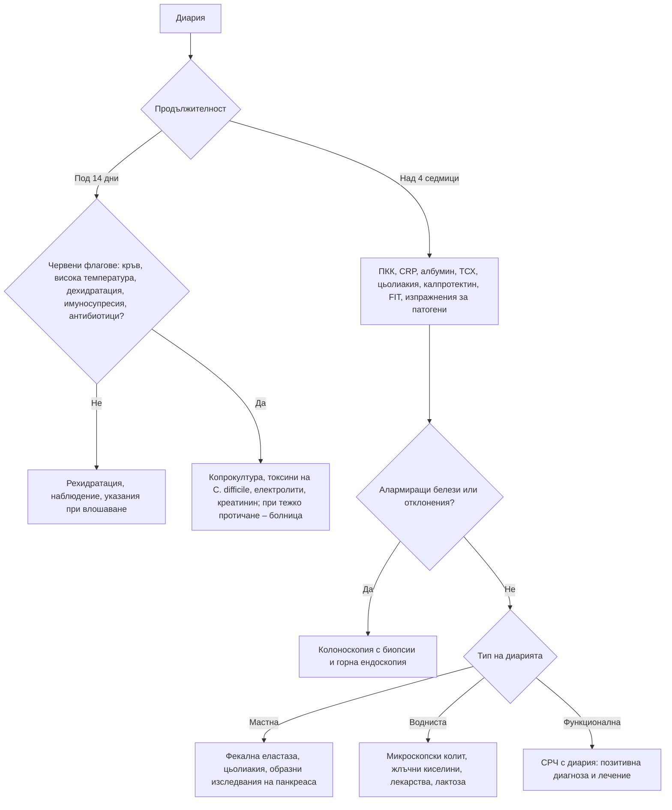

# Глава 23. Диария

> **Част V. Храносмилателна система**

## Цели на главата

- Да се класифицира диарията по продължителност и механизъм.
- Да се разпознават тежките форми на острата диария и показанията за микробиологично изследване.
- Да се разграничават водниста, мастна и възпалителна хронична диария.
- Да се изброяват често пропусканите причини: микроскопски колит, диария от жлъчни киселини, цьолиакия, лекарства.

## Ключови моменти

- Диарията е остра (под 14 дни), персистираща (14–30 дни) или хронична (над 4 седмици). Острата е най-често вирусна и отшумява спонтанно.
- Копрокултура е нужна при кръв, висока температура, тежко протичане, продължителност над 7 дни, имуносупресия, пътуване и групови случаи. След антибиотици или хоспитализация се търсят токсините на *C. difficile* *(SORT B [1, 2])*.
- При подозрение за шигатоксин-продуциращи *E. coli* антибиотиците и антиперисталтичните средства се избягват заради риска от хемолитично-уремичен синдром *(SORT B [2])*.
- Хроничната диария се класифицира като осмотична, секреторна, мастна, възпалителна или функционална. Първият етап включва ПКК, CRP, ТСХ, серология за цьолиакия, калпротектин, FIT при съмнение за карцином и фекална еластаза *(SORT B [4, 5])*.
- Микроскопският колит се диагностицира само с биопсии от макроскопски нормалната лигавица. Той е чест при възрастни жени, които приемат НСПВС, ИПП или SSRI *(SORT B [6])*.
- Диарията след холецистектомия насочва към диария от жлъчни киселини, а бледите мазни изпражнения – към малабсорбция или екзокринна недостатъчност на панкреаса.

---

## 1. Определения

- **Диария** – три или повече кашави или течни изпражнения за 24 часа или отчетлива промяна спрямо обичайното за пациента.
- **Остра** – под 14 дни; персистираща – 14–30 дни; хронична – над 4 седмици.
- **Дизентерия** – диария с кръв и слуз, обикновено с треска и тенезми.
- Диарията трябва да се разграничи от фекалната инконтиненция и от псевдодиарията (честа дефекация на малки количества при проктит или СРЧ).

---

## А. Остра диария

### 2. Причини

*Таблица 23.1. Остра диария: причини.*

| Група | Причини |
|---|---|
| **Вирусни** (най-чести) | Норовирус, ротавирус, аденовирус, астровирус, SARS-CoV-2 |
| **Бактериални** | *Campylobacter*, *Salmonella*, *Shigella*, шигатоксин-продуциращи *E. coli* (O157:H7 – риск от хемолитично-уремичен синдром), *Yersinia* (имитира апендицит), *Clostridioides difficile* (след антибиотици или хоспитализация), *Vibrio* |
| **Токсини в храната** (кратък инкубационен период) | *Staphylococcus aureus* и *Bacillus cereus* (1–6 часа, преобладава повръщането); *Clostridium perfringens* (8–16 часа) |
| **Паразитни** | *Giardia lamblia*, *Cryptosporidium*, *Entamoeba histolytica* |
| **Лекарства** | Антибиотици, магнезий, метформин, колхицин, слабителни, ИПП, НСПВС, SSRI, химиотерапия, инхибитори на имунните контролни точки (колит) |
| **Други стомашно-чревни** | Исхемичен колит, първа изява на възпалителна болест на червата, тазов апендицит, дивертикулит, „преливна“ диария при фекалом |
| **Системни** | Сепсис, легионелоза, синдром на токсичния шок, малария (при пътували), тиреотоксична криза, отравяне с гъби |

**Кървава диария (дизентериен синдром):** *Shigella*, *Campylobacter*, *Salmonella*, шигатоксин-продуциращи *E. coli*, *Entamoeba histolytica*, *C. difficile*, възпалителни болести на червата, исхемичен колит.

### 3. Безопасна диагностична стратегия

*Таблица 23.2. Остра диария: безопасна диагностична стратегия.*

| Въпрос | Отговор |
|---|---|
| **Вероятна диагноза** | Вирусен гастроентерит, хранително отравяне, диария на пътешественика, лекарства |
| **Сериозни заболявания, които не бива да се пропускат** | Тежка дехидратация и остро бъбречно увреждане; хемолитично-уремичен синдром; *C. difficile* колит (включително токсичен мегаколон); исхемичен колит; първа изява на възпалителна болест на червата; сепсис; малария; отравяне с гъби |
| **Чести капани** | Тазов или ретроцекален апендицит с диария; „преливна“ диария при фекалом при възрастни хора; лекарства (колхицин, метформин, магнезий); тиреотоксикоза |
| **Маскиращи заболявания** | Лекарства, хипертиреоидизъм, захарен диабет |
| **Психосоциални аспекти** | Тревожност, злоупотреба със слабителни |

### 4. Червени флагове

- Кръв в изпражненията.
- Температура над 38,5 °C.
- Силна коремна болка, раздуване.
- Признаци на **дехидратация** (жажда, сухи лигавици, олигурия, ортостатична хипотония, тахикардия) и нарушено съзнание.
- Продължителност над 7 дни.
- Скорошен прием на антибиотици или хоспитализация.
- Имуносупресия, напреднала възраст (над 70 години), тежки съпътстващи заболявания.
- Бременност (листериоза).
- Скорошно пътуване, особено до тропически райони.
- Групово заболяване, работа с храни, в детско заведение или в здравеопазването.
- Олигурия, бледост и петехии след кървава диария (**хемолитично-уремичен синдром**, особено при деца).

### 5. Кога е нужна копрокултура

- Кървава диария или диария с висока температура.
- Тежко протичане или продължителност над 7 дни.
- Имунокомпрометирани пациенти.
- Групови заболявания, лица, работещи с храни.
- Скорошно пътуване.
- След антибиотици или хоспитализация – изследване за **токсините на *C. difficile*** [1].

**Важно:** при подозрение за инфекция с шигатоксин-продуциращи *E. coli* антибиотиците и антиперисталтичните средства се избягват. Те повишават риска от хемолитично-уремичен синдром [2].

---

## Б. Хронична диария

### 6. Класификация по механизъм

*Таблица 23.3. Хронична диария: класификация по механизъм.*

| Тип | Белези | Основни причини |
|---|---|---|
| **Осмотична** | Спира при гладуване; висока осмотична разлика в изпражненията (> 125 mOsm/kg) | Лактозна непоносимост, осмотични слабителни (магнезий, полиетилен гликол), сорбитол и други полиоли („дъвки без захар“), свръхрастеж на бактерии в тънкото черво |
| **Секреторна** | Продължава при гладуване, често нощем; голям обем; ниска осмотична разлика (< 50 mOsm/kg) | Диария от жлъчни киселини (след холецистектомия, при резекция или заболяване на илеума), микроскопски колит, стимулантни слабителни, хормонално активни тумори (VIPoma, карциноиден синдром със зачервяване, гастрином със синдром на Zollinger-Ellison, медуларен карцином на щитовидната жлеза), хипертиреоидизъм, надбъбречна недостатъчност, вилозен аденом, бактериални токсини |
| **Мастна (стеаторея)** | Бледи, обемни, мазни, трудно отмиващи се изпражнения с неприятна миризма; загуба на тегло; дефицит на мастноразтворими витамини | Малабсорбция: цьолиакия, болест на Crohn, свръхрастеж на бактерии, синдром на късото черво, лямблиоза, болест на Whipple. Малдигестия: екзокринна недостатъчност на панкреаса (хроничен панкреатит, карцином, муковисцидоза, след гастректомия), холестаза |
| **Възпалителна** | Кръв, слуз, левкоцити, повишен калпротектин, треска, болка | Улцерозен колит, болест на Crohn, инфекции (*C. difficile*, цитомегаловирус, туберкулоза, амебиаза), исхемичен колит, лъчев колит, колоректален карцином, колит от инхибитори на имунните контролни точки |
| **Функционална** | Критерии Rome (вж. глава 20), без алармиращи белези, без нощни симптоми | СРЧ с преобладаваща диария, функционална диария |
| **Моторна и други** | – | Диабетна вегетативна невропатия, дъмпинг синдром, хипертиреоидизъм, амилоидоза, алкохол, лекарства (метформин, колхицин, олмесартан – ентеропатия, подобна на цьолиакия [3], микофенолат, ИПП, SSRI), HIV ентеропатия, скрита злоупотреба със слабителни |

## 7. Безопасна диагностична стратегия

*Таблица 23.4. Безопасна диагностична стратегия.*

| Въпрос | Отговор |
|---|---|
| **Вероятна диагноза** | СРЧ с диария, лактозна непоносимост, лекарства, цьолиакия, микроскопски колит, диария от жлъчни киселини |
| **Сериозни заболявания, които не бива да се пропускат** | Колоректален карцином, възпалителни болести на червата, хронична инфекция (лямблиоза, *C. difficile*, туберкулоза, HIV), карцином на панкреаса, невроендокринни тумори, хипертиреоидизъм |
| **Чести капани** | Микроскопски колит (лигавицата е макроскопски нормална); диария от жлъчни киселини след холецистектомия; цьолиакия; екзокринна недостатъчност на панкреаса; метформин; олмесартан; „преливна“ диария; скрита злоупотреба със слабителни |
| **Маскиращи заболявания** | Захарен диабет (невропатия, метформин), хипертиреоидизъм, лекарства, надбъбречна недостатъчност |
| **Психосоциални аспекти** | Хранителни разстройства, злоупотреба със слабителни, тревожност |

## 8. Алармиращи белези при хронична диария

- Възраст над 50 години с промяна в дефекацията.
- Кръв в изпражненията, желязодефицитна анемия.
- Загуба на тегло.
- **Нощна** диария.
- Треска, извънчревни прояви (артрит, увеит, еритема нодозум).
- Фамилна анамнеза за колоректален карцином, възпалителни болести на червата или цьолиакия.
- Повишени възпалителни показатели, хипоалбуминемия, повишен калпротектин.

## 9. Изследвания при хронична диария

**Първи етап** [4]:

- ПКК, CRP, албумин, феритин, витамин B12, фолиева киселина;
- ТСХ, електролити, креатинин, калций;
- **антитела срещу тъканната трансглутаминаза (IgA)** и общ IgA;
- **фекален калпротектин**;
- FIT при симптоми, които могат да се дължат на колоректален карцином (при резултат 10 µg/g или повече – бързо насочване при подозрение за карцином) [5];
- изследване на изпражненията за патогени, антиген на *Giardia*, токсини на *C. difficile*;
- **фекална еластаза** (под 200 µg/g е характерна за екзокринна недостатъчност на панкреаса).

**Втори етап:**

- **колоноскопия с илеоскопия и множество биопсии** (включително от макроскопски нормална лигавица – за микроскопски колит);
- горна ендоскопия с дуоденални биопсии;
- изследване за диария от жлъчни киселини (SeHCAT или пробно лечение със секвестранти на жлъчните киселини);
- дихателни тестове (лактоза, свръхрастеж на бактерии);
- КТ или ЯМР ентерография;
- хромогранин A и 5-хидроксииндолоцетна киселина в урината (невроендокринни тумори).

## 10. Микроскопски колит

- Среща се предимно при **възрастни жени**.
- Протича с водниста, често нощна диария със спешност на дефекацията.
- Свързан е с **лекарства**: НСПВС, ИПП (особено лансопразол), SSRI, статини, бета-блокери. Свързан е и с тютюнопушене и автоимунни заболявания (цьолиакия, заболявания на щитовидната жлеза).
- **При колоноскопията лигавицата е макроскопски нормална.** Диагнозата се поставя само хистологично: колагенозен или лимфоцитен колит [6].

---

## 11. Диагностичен алгоритъм

*Фигура 23.1. Диагностичен алгоритъм: диария. Схема на авторите въз основа на източниците, цитирани в главата.*

Текстово описание на фигура 23.1

1. Диария. Следва: към т. 2.
2. **Въпрос:** Продължителност Под 14 дни – към т. 3; Над 4 седмици – към т. 4.
3. **Въпрос:** Червени флагове: кръв, висока температура, дехидратация, имуносупресия, антибиотици? Не – към т. 5; Да – към т. 6.
4. ПКК, CRP, албумин, ТСХ, цьолиакия, калпротектин, FIT, изпражнения за патогени. Следва: към т. 7.
5. Рехидратация, наблюдение, указания при влошаване.
6. Копрокултура, токсини на C. difficile, електролити, креатинин; при тежко протичане – болница.
7. **Въпрос:** Алармиращи белези или отклонения? Да – към т. 8; Не – към т. 9.
8. Колоноскопия с биопсии и горна ендоскопия.
9. **Въпрос:** Тип на диарията Мастна – към т. 10; Водниста – към т. 11; Функционална – към т. 12.
10. Фекална еластаза, цьолиакия, образни изследвания на панкреаса.
11. Микроскопски колит, жлъчни киселини, лекарства, лактоза.
12. СРЧ с диария: позитивна диагноза и лечение.

---

## 12. Кога и колко спешно да насочим

*Таблица 23.5. Кога и колко спешно да насочим.*

| Спешност | Клинична ситуация |
|---|---|
| **Незабавно (112 или спешно отделение)** | Тежка дехидратация или шок; нарушено съзнание; подозрение за хемолитично-уремичен синдром (олигурия, бледост, петехии след кървава диария); токсичен мегаколон; сепсис; исхемичен колит със силна болка; тежък пристъп на улцерозен колит (6 и повече кървави изпражнения дневно със системни признаци) |
| **В същия ден** | Кървава диария с висока температура при възрастен или имуносупресиран; *C. difficile* с признаци на тежест; треска след пътуване до маларийна зона (натривка и дебела капка в същия ден) |
| **Бързо (до 2 седмици)** | FIT 10 µg/g или повече [5]; загуба на тегло, желязодефицитна анемия или промяна в дефекацията след 50 години; силно повишен калпротектин |
| **Планово** | Хронична водниста диария с нормални изследвания от първия етап (колоноскопия с биопсии); подозрение за диария от жлъчни киселини или за екзокринна недостатъчност на панкреаса |
| **Проследяване в общата практика** | Остра вирусна диария без червени флагове (перорална рехидратация и указания при влошаване); функционална диария след позитивна диагноза |

---

## 13. Клинични перли

- Кървава диария при дете, последвана от бледост, петехии и олигурия: хемолитично-уремичен синдром.
- Диария след антибиотик, дори седмици по-късно: изследвайте за *C. difficile*.
- Възрастна жена с водниста диария, която приема НСПВС, ИПП или SSRI: колоноскопия с биопсии от нормалната лигавица.
- Диария, започнала след холецистектомия: диария от жлъчни киселини.
- Възрастен пациент с „диария“ и запек в анамнезата: изключете фекалом с „преливна“ диария.
- Хипокалиемия, меланоза на дебелото черво и необяснима диария: скрита злоупотреба със слабителни.
- Диария и треска след пътуване до ендемичен район: изключете малария.

---

## 14. Клиничен случай

**Етап 1 – клинична картина.** Жена на 68 години от 3 месеца има водниста диария 5–6 пъти дневно, включително нощем, със спешност. Отслабнала е с 3 kg. Приема лансопразол, сертралин и ибупрофен при болки в коленете.

> **Въпрос 1.** Какъв тип е диарията и кои причини са вероятни?

**Етап 2 – изследвания.** ПКК, CRP, ТСХ, серологията за цьолиакия и копрокултурата са нормални. Калпротектинът е 140 µg/g. Колоноскопията е макроскопски нормална, но ендоскопистът взема множество биопсии от различни сегменти на дебелото черво.

> **Въпрос 2.** Защо са взети биопсии от нормалната лигавица?

> **Въпрос 3.** Кои фактори са допринесли и какво е лечението?

Обсъждане и отговори

**Отговор 1.** Хронична водниста диария с нощни симптоми, които не са типични за функционална диария. Вероятни причини са микроскопският колит, лекарствата, диарията от жлъчни киселини, цьолиакията и хипертиреоидизмът.

**Отговор 2.** Микроскопският колит се открива само хистологично, защото лигавицата изглежда нормална [6]. Хистологичното изследване показва задебелена субепителна колагенова лента, над 10 µm. Диагнозата е **колагенозен колит**.

**Отговор 3.** Рисковите фактори са възрастта, женският пол и трите лекарства: **ИПП (особено лансопразол), SSRI и НСПВС**. Лечението включва спиране или смяна на лекарствата, когато е възможно, и будезонид [6].

**Поука.** При хронична водниста диария с нормална колоноскопия трябва да се вземат биопсии. Лекарствата са сред най-честите и най-лесно отстраними причини.

---

## Обобщение

- Острата диария е най-често вирусна. Червените флагове определят кога са нужни изследвания и насочване.
- Кървавата диария изисква копрокултура и повишено внимание за шигатоксин-продуциращи *E. coli*, *C. difficile*, исхемичен колит и възпалителна болест на червата.
- Хроничната диария се изследва стъпаловидно според механизма. Алармиращите белези налагат колоноскопия с биопсии.
- Често пропускани причини са микроскопският колит, диарията от жлъчни киселини, цьолиакията, екзокринната недостатъчност на панкреаса и лекарствата.

## Самопроверка

### Въпроси с един верен отговор

**1.** *(основно ниво)* Мъж на 30 години има водниста диария от 2 дни без кръв и без треска. Пие достатъчно течности и няма други заболявания. Кое е подходящото поведение?

- **А.** Копрокултура
- **Б.** Ципрофлоксацин
- **В.** Перорална рехидратация и указания при влошаване
- **Г.** Колоноскопия
- **Д.** Изследване за токсини на *C. difficile*

Отговор и обосновка

**Верен отговор: В.** Острата водниста диария без червени флагове е най-често вирусна и отшумява спонтанно [2]. А, Б, Г и Д не са показани.

**2.** *(основно ниво)* Момче на 5 години има кървава диария 3 дни след посещение на ферма с животни. Кое трябва да се избягва?

- **А.** Перорална рехидратация
- **Б.** Изследване на изпражненията
- **В.** Антибиотици и лоперамид
- **Г.** Контрол на диурезата
- **Д.** ПКК и креатинин при влошаване

Отговор и обосновка

**Верен отговор: В.** Кървавата диария след контакт с животни насочва към шигатоксин-продуциращи *E. coli*. Антибиотиците и антиперисталтичните средства повишават риска от хемолитично-уремичен синдром [2]. А, Б, Г и Д са правилни действия.

**3.** *(основно ниво)* Жена на 50 години има водниста диария от 6 месеца, започнала след холецистектомия. Коя е най-вероятната причина?

- **А.** Цьолиакия
- **Б.** Диария от жлъчни киселини
- **В.** Лактозна непоносимост
- **Г.** Улцерозен колит
- **Д.** Хипертиреоидизъм

Отговор и обосновка

**Верен отговор: Б.** Диарията след холецистектомия е типична за диария от жлъчни киселини. Диагнозата се потвърждава със SeHCAT или с пробно лечение със секвестранти на жлъчните киселини [4]. А, В, Г и Д са възможни, но не са свързани с операцията.

**4.** *(напреднало ниво)* При пациент с хронична диария натрият в изпражненията е 30 mmol/l, а калият – 40 mmol/l. Каква е осмотичната разлика и какво означава?

- **А.** 10 mOsm/kg – секреторна диария
- **Б.** 150 mOsm/kg – осмотична диария
- **В.** 70 mOsm/kg – възпалителна диария
- **Г.** 290 mOsm/kg – нормален резултат
- **Д.** 220 mOsm/kg – мастна диария

Отговор и обосновка

**Верен отговор: Б.** Осмотичната разлика е 290 − 2 × (30 + 40) = 150 mOsm/kg. Стойност над 125 mOsm/kg означава осмотична диария (лактоза, магнезий, сорбитол). Под 50 mOsm/kg диарията е секреторна.

**5.** *(напреднало ниво)* Мъж на 58 години с алкохолна злоупотреба и новооткрит диабет има бледи, обемни, мазни изпражнения, които трудно се отмиват, и загуба на тегло. Кое изследване е най-подходящо първо?

- **А.** Фекална еластаза
- **Б.** Колоноскопия
- **В.** Изследване за токсини на *C. difficile*
- **Г.** SeHCAT
- **Д.** Лактозен дихателен тест

Отговор и обосновка

**Верен отговор: А.** Стеатореята при хронична алкохолна злоупотреба и диабет насочва към екзокринна недостатъчност на панкреаса при хроничен панкреатит. Фекалната еластаза под 200 µg/g подкрепя диагнозата [4]. Необходимо е и образно изследване на панкреаса, за да се изключи карцином.

### Задача

При пациент с хронична водниста диария натрият в изпражненията е 90 mmol/l, а калият – 50 mmol/l. Изчислете осмотичната разлика и я тълкувайте. Кои причини ще търсите?

Решение

Осмотична разлика = 290 − 2 × (90 + 50) = 290 − 280 = 10 mOsm/kg. Стойност под 50 mOsm/kg означава секреторна диария. Тя продължава при гладуване и често нощем. Причините са диария от жлъчни киселини, микроскопски колит, стимулантни слабителни (включително скрита злоупотреба), хипертиреоидизъм, надбъбречна недостатъчност, вилозен аденом и хормонално активни тумори [4]. Следващите стъпки са колоноскопия с биопсии, изследване за диария от жлъчни киселини и при нужда хромогранин A.

### OSCE станция: Анамнеза при хронична диария

**Време:** 8 минути. **Ниво:** основно (студенти, специализанти).

**Задача за кандидата.** Жена на 62 години има диария от 3 месеца. Снемете насочена анамнеза и предложете изследвания от първия етап.

**Информация за симулирания пациент (за изпитващия).** Изпражненията са воднисти, 5 пъти дневно, включително нощем. Няма кръв. Отслабнала е с 2 kg. Приема лансопразол и сертралин. Преди година е оперирана от жлъчни камъни. Няма пътуване и контакт с болни.

*Таблица 23.6. OSCE станция „Анамнеза при хронична диария“ – критерии за оценяване.*

| Критерий | Точки |
|---|---|
| Изяснява честотата, консистенцията, обема, наличието на кръв и слуз и нощните симптоми | 2 |
| Търси червени флагове: загуба на тегло, кръв, анемия, възраст над 50 години, фамилна обремененост | 2 |
| Пита за лекарства и открива ИПП и SSRI | 1 |
| Пита за предишни операции (холецистектомия) | 1 |
| Пита за пътувания, контакти, антибиотици и хоспитализации | 1 |
| Пита за симптоми на хипертиреоидизъм и за храни (лактоза, сорбитол) | 1 |
| Предлага ПКК, CRP, ТСХ, серология за цьолиакия, калпротектин и изследване на изпражненията | 2 |
| Обяснява плана и необходимостта от колоноскопия с биопсии | 1 |
| Проверява разбирането | 1 |
| **Общо** | **12** |

**Праг за успешно изпълнение:** 8 от 12 точки, включително червените флагове и прегледа на лекарствата.

## Литература

1. McDonald LC, Gerding DN, Johnson S, Bakken JS, Carroll KC, Coffin SE, et al. Clinical Practice Guidelines for Clostridium difficile Infection in Adults and Children: 2017 Update by the Infectious Diseases Society of America (IDSA) and Society for Healthcare Epidemiology of America (SHEA). Clin Infect Dis. 2018;66(7):e1-e48. doi:10.1093/cid/cix1085. PMID: 29462280.
2. Shane AL, Mody RK, Crump JA, Tarr PI, Steiner TS, Kotloff K, et al. 2017 Infectious Diseases Society of America Clinical Practice Guidelines for the Diagnosis and Management of Infectious Diarrhea. Clin Infect Dis. 2017;65(12):e45-e80. doi:10.1093/cid/cix669. PMID: 29053792.
3. Rubio-Tapia A, Herman ML, Ludvigsson JF, Kelly DG, Mangan TF, Wu TT, et al. Severe spruelike enteropathy associated with olmesartan. Mayo Clin Proc. 2012;87(8):732-8. doi:10.1016/j.mayocp.2012.06.003. PMID: 22728033.
4. Arasaradnam RP, Brown S, Forbes A, Fox MR, Hungin P, Kelman L, et al. Guidelines for the investigation of chronic diarrhoea in adults: British Society of Gastroenterology, 3rd edition. Gut. 2018;67(8):1380-1399. doi:10.1136/gutjnl-2017-315909. PMID: 29653941.
5. National Institute for Health and Care Excellence. Quantitative faecal immunochemical testing to guide colorectal cancer pathway referral in primary care (HealthTech guidance HTG690). London: NICE; 2023. Достъпно на: https://www.nice.org.uk/guidance/htg690
6. Miehlke S, Guagnozzi D, Zabana Y, Tontini GE, Kanstrup Fiehn AM, Wildt S, et al. European guidelines on microscopic colitis: United European Gastroenterology and European Microscopic Colitis Group statements and recommendations. United European Gastroenterol J. 2021;9(1):13-37. doi:10.1177/2050640620951905. PMID: 33619914.

*Последна проверка на съдържанието: септември 2026 г. Следващ планиран преглед: септември 2027 г. (вж. „Политика за актуализация“ в README).*

<!-- навигация -->

---

[← Глава 22. Гадене и повръщане](22-gadene-povrashtane.md) · [Съдържание](../README.md) · [Глава 24. Запек и промени в дефекацията →](24-zapek.md)
