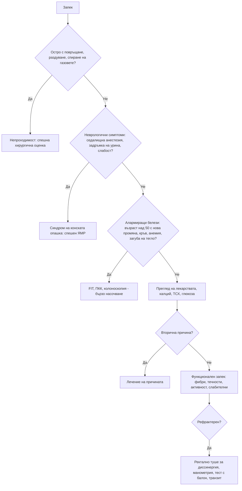

# Глава 24. Запек и промени в дефекацията

> **Част V. Храносмилателна система**

## Цели на главата

- Да се дефинира запекът с критериите Rome IV и да се използва Бристолската скала.
- Да се разграничават първичният (функционален) и вторичният запек.
- Да се познават лекарствените, метаболитните и неврологичните причини.
- Да се разпознават алармиращите белези за колоректален карцином.
- Да се подхожда рационално към изследванията, включително имунохимичния тест за окултна кръв.

---

## 1. Определение

**Функционален запек (Rome IV).** Поне **два** от следните белези при повече от една четвърт от дефекациите:

1. напъване;
2. твърди или на буци изпражнения (тип 1–2 по Бристолската скала);
3. усещане за непълно изпразване;
4. усещане за аноректална обструкция или блокиране;
5. мануални маневри за улесняване на дефекацията;
6. по-малко от 3 спонтанни дефекации седмично.

Кашави изпражнения рядко се срещат без слабителни. Критериите за СРЧ не са изпълнени. Симптомите са налице през последните 3 месеца и са започнали поне 6 месеца преди диагнозата.

### 1.1. Бристолска скала за изпражненията

| Тип | Описание | Значение |
|---|---|---|
| 1 | Отделни твърди бучки като ядки | Тежък запек (бавен транзит) |
| 2 | Наденицовидни, но на бучки | Запек |
| 3 | Наденицовидни с пукнатини по повърхността | Норма |
| 4 | Наденицовидни или змиевидни, гладки и меки | Норма |
| 5 | Меки късчета с ясни ръбове | Склонност към диария |
| 6 | Кашави, с накъсани ръбове | Диария |
| 7 | Воднисти, без твърди части | Диария |

---

## 2. Етиологична класификация

| Група | Причини |
|---|---|
| **Първичен (функционален)** | Запек с нормален транзит; запек с бавен транзит; **нарушения на дефекацията** (диссинергия на тазовото дъно); СРЧ със запек |
| **Начин на живот** | Бедна на фибри храна, малко течности, обездвижване, потискане на позивите, промяна в режима (пътуване, болница) |
| **Лекарства** | **Опиоиди**, антихолинергични средства, трициклични антидепресанти, **антипсихотици** (**клозапин** — риск от илеус и перфорация), антихистамини, **верапамил**, **желязо**, калций, алуминиеви антиациди, диуретици, ондансетрон, антипаркинсонови средства, GLP-1 агонисти, холестирамин |
| **Ендокринни и метаболитни** | **Хипотиреоидизъм**, **хиперкалциемия**, хипокалиемия, хипомагнезиемия, захарен диабет (невропатия), уремия, бременност, порфирия, отравяне с олово |
| **Неврологични** | **Болест на Parkinson** (запекът може да предшества моторните симптоми с години), множествена склероза, увреждане на гръбначния мозък и **синдром на конската опашка**, вегетативна невропатия, инсулт, деменция, болест на Hirschsprung (при деца) |
| **Структурни** | **Колоректален карцином**, стриктури (дивертикулни, исхемични, при болест на Crohn), **анална фисура** (болезнена дефекация, при която пациентът потиска позива), хемороиди, ректоцеле, ректален пролапс, тазови формации (яйчник, миоми), псевдообструкция |
| **Системни** | Системна склероза, амилоидоза |
| **Психосоциални** | Депресия, хранителни разстройства, анамнеза за сексуално насилие |

---

## 3. Безопасна диагностична стратегия

| Въпрос | Отговор |
|---|---|
| **Вероятна диагноза** | Функционален запек, начин на живот, лекарства, СРЧ със запек |
| **Сериозни заболявания, които не бива да се пропускат** | **Колоректален карцином**, чревна непроходимост, волвулус, **синдром на конската опашка** и компресия на гръбначния мозък, хиперкалциемия (включително при злокачествено заболяване), тумор на яйчника |
| **Чести капани** | Лекарства (опиоиди, желязо, верапамил, клозапин); хипотиреоидизъм; хиперкалциемия; фекалом с „преливна“ диария при възрастни хора; нарушение на дефекацията, лекувано неуспешно със слабителни; анална фисура; ранна болест на Parkinson |
| **Маскиращи заболявания** | Депресия, захарен диабет, лекарства, хипотиреоидизъм, гръбначна дисфункция |
| **Психосоциални аспекти** | Хранителни разстройства, насилие, злоупотреба със слабителни |

---

## 4. Анамнеза

- Какво разбира пациентът под „запек“: рядка дефекация, твърди изпражнения, напъване, непълно изпразване?
- **Давност:** дългогодишен запек или **скорошна промяна** (особено след 50 години).
- Честота, консистенция (Бристолска скала), напъване, мануални маневри (натиск върху перинеума или задната стена на влагалището — насочва към нарушение на дефекацията).
- Кръв, слуз, болка при дефекация (анална фисура).
- Редуване на запек с диария.
- **Спиране на газовете, повръщане, раздуване** (непроходимост).
- Загуба на тегло, анемия.
- Уринарни симптоми, изтръпване в перинеума, слабост в краката (синдром на конската опашка).
- Хранене, течности, физическа активност.
- **Лекарства** — пълен списък.
- Симптоми на хипотиреоидизъм, хиперкалциемия, болест на Parkinson (тремор, забавеност, нарушено обоняние, сънни нарушения).
- Раждания (увреждане на тазовото дъно), операции.
- Фамилна анамнеза за колоректален карцином.

---

## 5. Физикален преглед

- Корем: раздуване, формации, палпируеми фекални маси, болезненост.
- **Оглед на перианалната област:** фисура, хемороиди, пролапс, белези, перианално изтръпване.
- **Ректално туше:**
  - фекалом;
  - формация;
  - тонус на сфинктера;
  - **диссинергия** — при напъване пуборекталният мускул и сфинктерът се свиват, вместо да се отпуснат.
- Неврологичен преглед при показания: сетивност в седалищната област, рефлекси, сила в краката.

---

## 6. Алармиращи белези (червени флагове)

- **Възраст над 50 години със скорошна промяна в дефекацията.**
- Ректално кървене.
- Желязодефицитна анемия.
- Необяснима загуба на тегло.
- Палпируема формация в корема или ректума.
- Фамилна анамнеза за колоректален карцином или възпалителни болести на червата.
- Положителен имунохимичен тест за окултна кръв (FIT).
- Остро начало с повръщане, раздуване и спиране на газовете (непроходимост).
- Неврологични симптоми: изтръпване в седалищната област, нарушено уриниране, слабост в краката.

**Британските препоръки (NICE) за колоректален карцином** предвиждат бързо насочване при:

- възраст ≥ 40 години с необяснима загуба на тегло и коремна болка;
- възраст ≥ 50 години с необяснимо ректално кървене;
- възраст ≥ 60 години с желязодефицитна анемия или промяна в дефекацията;
- **положителен FIT** (≥ 10 µg хемоглобин/g изпражнения) при пациенти със симптоми.

---

## 7. Изследвания

**При повечето пациенти с функционален запек без алармиращи белези не са необходими изследвания.**

**Основни (при съмнение за вторична причина):**

- ПКК;
- калций, ТСХ, глюкоза;
- електролити (калий), креатинин;
- FIT при възраст над 50 години или при други показания.

**Насочени:**

- **колоноскопия** при алармиращи белези;
- КТ при подозрение за непроходимост или тумор;
- **специализирани изследвания** при рефрактерен запек:
  - аноректална манометрия и тест за експулсия на балон (нарушения на дефекацията);
  - дефекография;
  - изследване на транзита с рентгеноконтрастни маркери.

---

## 8. Специални ситуации

### 8.1. Възрастни хора

- **Фекаломът** може да се прояви с „преливна“ диария, фекална инконтиненция, объркване, задръжка на урина и дори с чревна непроходимост.
- Причините често са много: обездвижване, малко течности, лекарства, деменция.

### 8.2. Остра промяна в дефекацията

- **Волвулус на сигмата** — възрастни, обездвижени, хронично запечени пациенти, внезапно масивно раздуване.
- **Псевдообструкция на дебелото черво** (синдром на Ogilvie) — тежко болни пациенти, след операции, при електролитни нарушения и опиоиди. Изразено раздуване без механична причина.
- **Непроходимост от тумор** — постепенно нарастващ запек, после спиране на газовете.

### 8.3. Деца

Функционалният запек е най-честата причина. Трябва обаче да се помни за:

- болест на Hirschsprung — забавено отделяне на мекония (над 48 часа), изоставане в растежа;
- хипотиреоидизъм, цьолиакия, алергия към белтъка на кравето мляко;
- анална фисура;
- насилие.

Вж. глава 70.

---

## 9. Диагностичен алгоритъм

---

## 10. Клинични перли

- Нов запек след 50-годишна възраст е колоректален карцином, докато не се докаже противното.
- Преди да предпишете слабително, прегледайте лекарствата.
- Всеки пациент, лекуван с опиоиди, трябва да получи профилактика на запека.
- Клозапинът може да предизвика тежък, животозастрашаващ запек и илеус. Питайте активно за дефекацията.
- Хроничният запек при възрастен човек може да е първият симптом на болестта на Parkinson.
- Необходимостта от натиск с пръсти върху перинеума или влагалището по време на дефекация насочва към нарушение на дефекацията. То се лекува с биофидбек, а не с повече слабителни.
- „Диария“ при възрастен обездвижен пациент: направете ректално туше за фекалом.

---

## 11. Клиничен случай

**Случай.** Мъж на 63 години от 2 месеца има запек, който се редува с кашави изпражнения. Досега дефекацията му е била редовна. Отдава промяната на новата диета. Съобщава за умора. Не е забелязал кръв. Изследвания: хемоглобин 118 g/l, MCV 77 fl, феритин 9 µg/l. FIT е положителен (86 µg/g).

**Въпроси.** 1) Какви са алармиращите белези? 2) Какво е следващото изследване?

**Обсъждане.** Възрастта над 60 години, новата промяна в дефекацията, желязодефицитната анемия и положителният FIT са независими алармиращи белези за **колоректален карцином**. Пациентът се насочва бързо за колоноскопия. Тя установява стенозиращ аденокарцином на сигмата. Липсата на видима кръв не намалява подозрението. Карциномите на дебелото черво, особено десностранните, често кървят окултно.

**Поука.** Новата промяна в дефекацията при възрастен човек, съчетана с желязодефицит, изисква колоноскопия дори при липса на видимо кървене.

<!-- навигация -->

---

[← Глава 23. Диария](23-diaria.md) · [Съдържание](../README.md) · [Глава 25. Кървене от храносмилателния тракт →](25-gi-kraveene.md)
