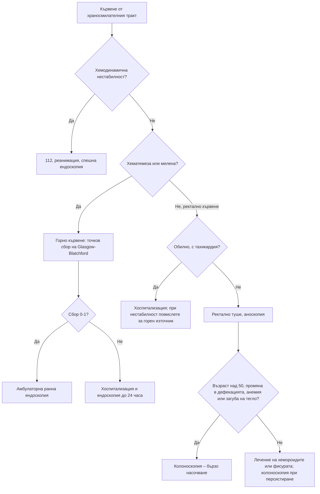

# Глава 25. Кървене от храносмилателния тракт

> **Част V. Храносмилателна система**

## Цели на главата

- Да се разграничава кървенето от горния и от долния стомашно-чревен тракт.
- Да се оценява тежестта и рискът (точков сбор на Glasgow-Blatchford) и да се определя кога е нужна спешна хоспитализация.
- Да се изброяват основните причини и техните клинични белези.
- Да се планира изследването на окултното кървене и на желязодефицитната анемия (горна и долна ендоскопия, изследване за цьолиакия).
- Да се разпознават псевдомелената и оцветяването на изпражненията от храни и лекарства.

## Ключови моменти

- Хематемезата и мелената насочват към горен източник, а хематохезията – обикновено към долен. При хемодинамична нестабилност хематохезията може да се дължи на масивно горно кървене [1].
- Тежестта се оценява по пулса, АН, шоковия индекс, синкопа, хемоглобина и уреята. В първите часове хемоглобинът може да е нормален.
- Точков сбор на Glasgow-Blatchford 0–1 позволява амбулаторна ранна ендоскопия; всеки по-висок сбор налага хоспитализация и ендоскопия до 24 часа *(SORT B [3–5])*.
- При долно кървене сбор по Oakland до 8 точки позволява амбулаторно изследване *(SORT B [1])*.
- Желязодефицитната анемия при мъже и при жени след менопаузата изисква горна ендоскопия, колоноскопия и серология за цьолиакия *(SORT B [6])*.
- Комбинацията от аспирин, антикоагулант, НСПВС и SSRI рязко повишава риска от кървене *(SORT B [2])*. Хемороидите не обясняват кървенето при пациент над 50 години с други алармиращи белези.

### Първите 60 секунди

- Оценете дишането, пулса, АН, капилярното пълнене и съзнанието. Изчислете шоковия индекс (пулс/систолно налягане).
- При хемодинамична нестабилност, продължаваща хематемеза или синкоп се обадете на 112.
- Поставете пациента легнал, с повдигнати крака при хипотония, и в странично положение при повръщане на кръв.
- Попитайте за антикоагуланти, антитромбоцитни средства, НСПВС, алкохол, чернодробно заболяване и операции на аортата.
- Направете ректално туше за мелена или кръв, ако условията позволяват.

---

## 1. Определения

*Таблица 25.1. Определения на видовете кървене от храносмилателния тракт.*

| Понятие | Описание | Източник |
|---|---|---|
| **Хематемеза** | Повръщане на прясна кръв или на „утайка от кафе“ | Горен стомашно-чревен тракт (проксимално от лигамента на Treitz) |
| **Мелена** | Черни, лъскави, катраноподобни, лепкави изпражнения с характерна миризма; необходими са поне 50–100 ml кръв | Обикновено горен стомашно-чревен тракт; по-рядко тънко черво или дясно дебело черво |
| **Хематохезия** | Прясна или тъмночервена кръв през ануса | Обикновено долен стомашно-чревен тракт; масивно горно кървене при хемодинамична нестабилност (до 15% от тежките случаи) [1] |
| **Окултно кървене** | Невидимо кървене, открито с тест за окултна кръв или чрез желязодефицитна анемия | Всяка част на тракта |
| **Кървене с неясен източник** | Персистиращо или рецидивиращо кървене след нормални горна ендоскопия и колоноскопия | Често тънко черво |

**Псевдомелена:** препарати на желязото и бисмута, женско биле, боровинки, кървавица. **Червено оцветяване:** червено цвекло, хранителни оцветители, рифампицин.

---

## 2. Причини за кървене от горния стомашно-чревен тракт

*Таблица 25.2. Причини за кървене от горния стомашно-чревен тракт.*

| Причина | Насочващи белези |
|---|---|
| **Пептична язва** (най-честата причина) | НСПВС, аспирин, *H. pylori*, антикоагуланти; комбинация с SSRI или кортикостероиди [2]; епигастрална болка (често липсва при НСПВС) |
| **Езофагит, гастрит, дуоденит** | ГЕРБ, НСПВС, алкохол |
| **Варици на хранопровода и стомаха** | Цироза (алкохол, вирусни хепатити, стеатозна болест), портална хипертония, спленомегалия, тромбоцитопения; висока смъртност |
| **Синдром на Mallory-Weiss** | Хематемеза след многократно повръщане, често след алкохол |
| **Злокачествени заболявания** | Карцином на стомаха и хранопровода: загуба на тегло, дисфагия, анемия |
| **Съдови лезии** | Ангиодисплазии, лезия на Dieulafoy, антрална съдова ектазия („стомах като диня“ – при цироза, системна склероза), лезии на Cameron (при голяма хиатална херния) |
| **Аортоентерална фистула** | Предишна операция на коремната аорта (съдова протеза); „сигнално“ малко кървене, последвано от масивно |
| **Хемобилия, кървене от панкреатичния канал** | След травма или интервенции на черния дроб, при панкреатит |
| **Портална хипертонична гастропатия** | Цироза |

## 3. Причини за кървене от долния стомашно-чревен тракт

*Таблица 25.3. Причини за кървене от долния стомашно-чревен тракт.*

| Причина | Насочващи белези |
|---|---|
| **Хемороиди** | Яркочервена кръв по тоалетната хартия или в тоалетната чиния, след дефекация, неболезнено |
| **Анална фисура** | Болка при дефекация, малко кръв по хартията, спазъм на сфинктера |
| **Дивертикулно кървене** | Внезапно, неболезнено, често обилно кървене при възрастни хора |
| **Ангиодисплазия** | Възрастни хора; рецидивиращо кървене; свързана е с аортна стеноза (синдром на Heyde) и хронично бъбречно заболяване |
| **Колоректален карцином и полипи** | Окултно кървене, анемия, промяна в дефекацията, тъмна кръв, примесена с изпражненията |
| **Възпалителни болести на червата** | Кървава диария, тенезми, спешност на дефекацията |
| **Исхемичен колит** | Възрастни хора; внезапна болка (обикновено вляво), последвана от кървави изпражнения |
| **Инфекциозен колит** | Треска, диария (*Campylobacter*, *Shigella*, шигатоксин-продуциращи *E. coli*, *C. difficile*) |
| **Лъчев проктит** | Предишна лъчетерапия на малкия таз (простата, шийка на матката) |
| **След полипектомия** | До 2 седмици след колоноскопия |
| **Дивертикул на Meckel** | Деца и млади хора; неболезнено, често масивно кървене |
| **Солитарна ректална язва, ректален пролапс** | Напъване, слуз, кървене |

## 4. Кървене от тънкото черво

Ангиодисплазии (най-честа причина при възрастни хора), тумори (гастроинтестинален стромален тумор, лимфом, аденокарцином, невроендокринни тумори), болест на Crohn, НСПВС ентеропатия, дивертикул на Meckel (при млади хора). Изследването на избор е видеокапсулна ендоскопия, а при нужда ентероскопия.

---

## 5. Безопасна диагностична стратегия

*Таблица 25.4. Безопасна диагностична стратегия.*

| Въпрос | Отговор |
|---|---|
| **Вероятна диагноза** | Горно: пептична язва, езофагит, синдром на Mallory-Weiss. Долно: хемороиди, анална фисура, дивертикулно кървене |
| **Сериозни заболявания, които не бива да се пропускат** | Масивно кървене с шок; кървене от варици; колоректален карцином, карцином на стомаха; аортоентерална фистула; исхемичен колит; възпалителни болести на червата |
| **Чести капани** | Масивно горно кървене, проявено като хематохезия; хемороидите като единствено обяснение при пациент над 50 години (пропуснат карцином); желязо и бисмут като причина за черни изпражнения; комбинация от лекарства (аспирин, антикоагулант, НСПВС, SSRI); ангиодисплазия при аортна стеноза |
| **Маскиращи заболявания** | Лекарства (НСПВС, антикоагуланти), анемия (като първа проява), чернодробно заболяване |
| **Психосоциални аспекти** | Злоупотреба с алкохол, самолечение с НСПВС |

---

## 6. Оценка на тежестта

### 6.1. Клинични белези на тежко кървене

- Тахикардия, хипотония, **шоков индекс > 1** (пулс/систолно налягане).
- Синкоп, ортостатична хипотония.
- Хематемеза с прясна кръв, продължаващо кървене.
- Хемоглобин под 80–100 g/l или бързо спадане.
- **Повишена урея** с относително нормален креатинин. Кръвта, разградена в храносмилателния тракт, повишава уреята, и това насочва към горно кървене.

Хемоглобинът в първите часове може да бъде **нормален**, защото хемодилуцията още не е настъпила.

### 6.2. Точков сбор на Glasgow-Blatchford (горно кървене) [3]

*Таблица 25.5. Точков сбор на Glasgow-Blatchford (горно кървене).*

| Показател | Стойност | Точки |
|---|---|---|
| **Урея** (mmol/l) | 6,5–7,9 | 2 |
| | 8,0–9,9 | 3 |
| | 10,0–25,0 | 4 |
| | > 25 | 6 |
| **Хемоглобин (мъже)** (g/l) | 120–129 | 1 |
| | 100–119 | 3 |
| | < 100 | 6 |
| **Хемоглобин (жени)** (g/l) | 100–119 | 1 |
| | < 100 | 6 |
| **Систолно налягане** (mmHg) | 100–109 | 1 |
| | 90–99 | 2 |
| | < 90 | 3 |
| **Други** | Пулс ≥ 100/min | 1 |
| | Мелена | 1 |
| | Синкоп | 2 |
| | Чернодробно заболяване | 2 |
| | Сърдечна недостатъчност | 2 |

Сбор 0–1 означава много нисък риск. Такива пациенти могат да бъдат изследвани амбулаторно с ранна ендоскопия [4]. Всеки по-висок сбор налага хоспитализация. Ендоскопията се прави до 24 часа, а по-рано – само при нестабилност въпреки реанимацията [5]. При долно кървене за подобна оценка се използва точковият сбор на Oakland: при сбор до 8 точки пациентът може да бъде изследван амбулаторно [1].

---

## 7. Анамнеза и физикален преглед

**Анамнеза:**

- Вид и количество на кръвта, продължителност.
- Синкоп, задух, болка в гърдите (исхемия поради анемия).
- **Лекарства:** НСПВС, аспирин, клопидогрел, антикоагуланти, SSRI, кортикостероиди, желязо, бисмут.
- Алкохол, известно чернодробно заболяване.
- Предишни язви, ерадикация на *H. pylori*.
- Повръщане преди кървенето (синдром на Mallory-Weiss).
- Промяна в дефекацията, загуба на тегло, болка при дефекация.
- **Операции на аортата.**
- Лъчетерапия на малкия таз.
- Скорошна колоноскопия с полипектомия.

**Физикален преглед:**

- Пулс, АН (включително ортостатично), капилярно пълнене, ниво на съзнание.
- Бледност, стигмати на чернодробно заболяване (варици).
- Корем: болезненост, формации, хепатоспленомегалия.
- **Ректално туше** (мелена, кръв, тумор).
- Оглед на аналната област: фисура, хемороиди.

---

## 8. Диференциално-диагностична таблица

*Таблица 25.6. Диференциална диагноза на кървенето от храносмилателния тракт.*

| Заболяване | Вид на кървенето | Ключови белези | Изследване |
|---|---|---|---|
| Пептична язва | Хематемеза, мелена | НСПВС, *H. pylori*, епигастрална болка | Ендоскопия |
| Варици | Масивна хематемеза | Цироза, алкохол, портална хипертония | Ендоскопия (спешна) |
| Синдром на Mallory-Weiss | Хематемеза след повръщане | Алкохол, повръщане | Ендоскопия |
| Карцином на стомаха | Мелена, окултно | Загуба на тегло, анемия, възраст | Ендоскопия с биопсия |
| Хемороиди | Яркочервена кръв по хартията | Без болка, след дефекация | Аноскопия; колоноскопия при възраст над 50 години |
| Анална фисура | Малко кръв по хартията | Силна болка при дефекация | Оглед |
| Дивертикулно кървене | Обилна хематохезия | Възрастни, без болка | Колоноскопия, КТ-ангиография при активно кървене |
| Колоректален карцином | Тъмна кръв, примесена с изпражненията, или окултно | Промяна в дефекацията, анемия, загуба на тегло | Колоноскопия |
| Възпалителни болести на червата | Кървава диария | Млада възраст, тенезми, извънчревни прояви | Калпротектин, колоноскопия |
| Исхемичен колит | Кървави изпражнения след болка | Възрастни, сърдечно-съдови заболявания | КТ, колоноскопия |
| Ангиодисплазия | Рецидивиращо, окултно или явно | Възрастни, аортна стеноза, хронично бъбречно заболяване | Ендоскопия, видеокапсула |

---

## 9. Окултно кървене и желязодефицитна анемия

- Желязодефицитната анемия при мъже и при жени след менопаузата изисква изследване на целия стомашно-чревен тракт: горна ендоскопия и колоноскопия, както и серология за цьолиакия [6].
- При жени в детеродна възраст често причината е обилна менструация. Ендоскопия е показана при стомашно-чревни симптоми, при възраст над 50 години, при фамилна анамнеза за колоректален карцином и при неповлияване от лечението.
- По NICE при желязодефицитна анемия се прави количествен FIT, а при 10 µg/g или повече пациентът се насочва бързо при подозрение за колоректален карцином [7]. FIT помага за приоритизиране, но не замества пълното изследване при необяснена желязодефицитна анемия [6].
- Вж. и глава 32.

---

## 10. Диагностичен алгоритъм

*Фигура 25.1. Диагностичен алгоритъм: кървене от храносмилателния тракт. Схема на авторите въз основа на източниците, цитирани в главата.*

Текстово описание на фигура 25.1

1. Кървене от храносмилателния тракт. Следва: към т. 2.
2. **Въпрос:** Хемодинамична нестабилност? Да – към т. 3; Не – към т. 4.
3. 112, реанимация, спешна ендоскопия.
4. **Въпрос:** Хематемеза или мелена? Да – към т. 5; Не, ректално кървене – към т. 6.
5. Горно кървене: точков сбор на Glasgow-Blatchford. Следва: към т. 7.
6. **Въпрос:** Обилно, с тахикардия? Да – към т. 8; Не – към т. 9.
7. **Въпрос:** Сбор 0-1? Да – към т. 10; Не – към т. 11.
8. Хоспитализация; при нестабилност помислете за горен източник.
9. Ректално туше, аноскопия. Следва: към т. 12.
10. Амбулаторна ранна ендоскопия.
11. Хоспитализация и ендоскопия до 24 часа.
12. **Въпрос:** Възраст над 50, промяна в дефекацията, анемия или загуба на тегло? Да – към т. 13; Не – към т. 14.
13. Колоноскопия – бързо насочване.
14. Лечение на хемороидите или фисурата; колоноскопия при персистиране.

---

## 11. Особености в общата практика

- Всяка хематемеза и мелена налагат спешна оценка в болница, освен при много нисък риск.
- При ректално кървене **винаги** направете ректално туше и огледайте аналната област.
- Хемороидите са чести. Наличието им не обяснява кървенето при пациент над 50 години с други алармиращи белези.
- Прегледайте комбинацията от лекарства. Съчетанието на аспирин, антикоагулант, НСПВС и SSRI рязко повишава риска от кървене.

---

## 12. Червени флагове и насочване

### 12.1. Червени флагове

- Хемодинамична нестабилност, шоков индекс над 1, синкоп.
- Хематемеза с прясна кръв или продължаващо кървене.
- Кървене при цироза (варици).
- Малко кървене при пациент с аортна протеза (сигнал за аортоентерална фистула).
- Кървене при антикоагулантна или двойна антитромбоцитна терапия.
- Ректално кървене след 50 години с промяна в дефекацията, загуба на тегло или анемия.
- Желязодефицитна анемия без обяснение при мъж или при жена след менопаузата.

### 12.2. Кога и колко спешно да насочим

*Таблица 25.7. Кога и колко спешно да насочим.*

| Спешност | Клинична ситуация |
|---|---|
| **Незабавно (112 или спешно отделение)** | Хемодинамична нестабилност; хематемеза с прясна кръв; мелена със синкоп; кървене при цироза; кървене при аортна протеза; обилно ректално кървене с тахикардия |
| **В същия ден** | Хематемеза или мелена при стабилен пациент със сбор по Glasgow-Blatchford над 1 [3, 4]; кървене при антикоагулантна терапия; ректално кървене със сбор по Oakland над 8 [1] |
| **Бързо (до 2 седмици)** | Количествен FIT 10 µg/g или повече; ректална формация; желязодефицитна анемия при мъж или жена след менопаузата [6, 7] |
| **Планово** | Сбор по Glasgow-Blatchford 0–1 – ранна амбулаторна ендоскопия [4]; хемороиди или фисура, които не се повлияват от лечение |
| **Проследяване в общата практика** | Яркочервена кръв по тоалетната хартия при млад пациент с хемороиди или фисура, без алармиращи белези; контрол след ерадикация на *H. pylori* и спиране на НСПВС |

---

## 13. Клинични перли

- Масивното кървене от горния стомашно-чревен тракт може да се прояви като прясна ректална кръв. При хемодинамична нестабилност първо помислете за горен източник.
- Повишена урея с нормален креатинин насочва към горно кървене.
- Нормален хемоглобин в първите часове не изключва тежко кървене.
- Малко кървене при пациент с аортна протеза е сигнал за аортоентерална фистула. Масивното кървене може да последва в рамките на часове.
- Черни изпражнения при пациент, приемащ желязо, не са непременно мелена. Мелената е лепкава, лъскава и има характерна миризма.
- Рецидивиращо кървене от ангиодисплазии при пациент с аортна стеноза (синдром на Heyde) може да спре след смяна на клапата.

---

## 14. Клиничен случай

**Етап 1 – клинична картина.** Мъж на 71 години има черни, лепкави изпражнения от два дни. Сутринта е прималял в банята. Приема аспирин след стентиране преди 2 години, сертралин и от 3 седмици ибупрофен за болки в коляното.

> **Въпрос 1.** Кои лекарства увеличават риска от кървене?

**Етап 2 – преглед и изследвания.** Пациентът е блед и изпотен, пулс 108/min, АН 102/64 mmHg. Ректалното туше потвърждава мелена. Хемоглобин 96 g/l, урея 14 mmol/l, креатинин 92 µmol/l.

> **Въпрос 2.** Изчислете точковия сбор на Glasgow-Blatchford.

> **Въпрос 3.** Коя е най-вероятната причина и какво е поведението?

Обсъждане и отговори

**Отговор 1.** Аспиринът, ибупрофенът и сертралинът. Комбинацията от НСПВС и SSRI многократно повишава риска от кървене от горния стомашно-чревен тракт [2].

**Отговор 2.** Урея 14 mmol/l – 4 точки; хемоглобин 96 g/l – 6; систолно налягане 102 mmHg – 1; пулс над 100/min – 1; мелена – 1; синкоп – 2. **Общо 15 точки** – висок риск [3].

**Отговор 3.** Повишената урея при нормален креатинин подкрепя горен източник, най-вероятно пептична язва. Необходими са спешна хоспитализация и ендоскопия до 24 часа след стабилизиране [5]. Ендоскопията установява кървяща язва на булбуса, която е лекувана ендоскопски. Тестът за *H. pylori* е положителен. НСПВС са спрени.

**Поука.** Комбинацията от лекарства, увреждащи лигавицата и хемостазата, е една от най-честите предотвратими причини за стомашно-чревно кървене.

---

## Обобщение

- Кървенето от храносмилателния тракт се проявява с хематемеза, мелена, хематохезия или протича окултно. Видът насочва към източника, но при нестабилност хематохезията може да е от горен източник.
- Тежестта се оценява клинично и с точкови сборове (Glasgow-Blatchford при горно и Oakland при долно кървене), които определят кой може да се изследва амбулаторно.
- Най-честите причини са пептичната язва при горно и хемороидите и дивертикулите при долно кървене. Карциномът не бива да се пропуска.
- Желязодефицитната анемия без обяснение изисква изследване на целия стомашно-чревен тракт и серология за цьолиакия.

## Самопроверка

### Въпроси с един верен отговор

**1.** *(основно ниво)* Кой лабораторен резултат насочва най-силно към горен източник на кървене?

- **А.** Нисък хемоглобин
- **Б.** Висока урея при нормален креатинин
- **В.** Високи тромбоцити
- **Г.** Нисък феритин
- **Д.** Висок CRP

Отговор и обосновка

**Верен отговор: Б.** Кръвта, разградена в храносмилателния тракт, се резорбира и повишава уреята, докато креатининът остава нормален. А и Г показват кървене, но не и източника. В и Д са неспецифични.

**2.** *(основно ниво)* Мъж на 45 години има мелена от вчера. Пулсът е 84/min, АН 132/80 mmHg, хемоглобинът е 150 g/l, а уреята – 5,8 mmol/l. Няма синкоп, чернодробно или сърдечно заболяване. Какъв е сборът по Glasgow-Blatchford и какво означава?

- **А.** 0 точки – не е нужно изследване
- **Б.** 1 точка – много нисък риск; ранна амбулаторна ендоскопия
- **В.** 4 точки – хоспитализация
- **Г.** 6 точки – спешна ендоскопия до 6 часа
- **Д.** 2 точки – хоспитализация

Отговор и обосновка

**Верен отговор: Б.** Единствената точка е за мелената. Сбор 0–1 означава много нисък риск и позволява амбулаторна ранна ендоскопия [3, 4]. А е погрешно, защото мелената изисква изследване.

**3.** *(основно ниво)* Мъж на 58 години има яркочервена кръв по тоалетната хартия от 6 седмици и отслабване с 4 kg. При огледа има хемороиди. Кое е правилното поведение?

- **А.** Лечение на хемороидите и контрол след 3 месеца
- **Б.** Ректално туше, количествен FIT и насочване според резултата
- **В.** Успокояване, защото кръвта е от хемороидите
- **Г.** Слабително и указания при влошаване
- **Д.** Само ПКК

Отговор и обосновка

**Верен отговор: Б.** Хемороидите не обясняват кървенето при пациент над 50 години със загуба на тегло. По NICE се прави количествен FIT, а при 10 µg/g или повече пациентът се насочва бързо при подозрение за колоректален карцином [7]. Ректалното туше е задължително.

**4.** *(напреднало ниво)* Мъж на 68 години с аортна протеза от преди 3 години има епизод на малко количество мелена и после се чувства добре. Кое е правилното поведение?

- **А.** Амбулаторна ендоскопия след седмица
- **Б.** Незабавно насочване към болница заради подозрение за аортоентерална фистула
- **В.** Тест за *H. pylori* и ИПП
- **Г.** Контрол на хемоглобина след месец
- **Д.** Желязо перорално

Отговор и обосновка

**Верен отговор: Б.** Малкото „сигнално“ кървене при пациент с аортна протеза може да бъде последвано от масивно кървене в рамките на часове. Необходима е незабавна оценка (КТ-ангиография). А, В, Г и Д забавят диагнозата.

**5.** *(напреднало ниво)* Жена на 62 години има желязодефицитна анемия (хемоглобин 104 g/l, феритин 6 µg/l). Няма стомашно-чревни симптоми и видимо кървене. Кое е подходящото поведение?

- **А.** Само перорално желязо
- **Б.** Горна ендоскопия, колоноскопия и серология за цьолиакия
- **В.** Гинекологичен преглед и нищо повече
- **Г.** Повторни изследвания след 6 месеца
- **Д.** Само FIT и при отрицателен резултат – без изследвания

Отговор и обосновка

**Верен отговор: Б.** Желязодефицитната анемия при жена след менопаузата изисква изследване на целия стомашно-чревен тракт и серология за цьолиакия [6]. А и Г забавят диагнозата. В е непълно. Д не замества пълното изследване.

### Задача

Мъж на 76 години с предсърдно мъждене приема апиксабан. Има обилна хематохезия, пулс 118/min и АН 96/58 mmHg. Какво правите и защо трябва да се мисли и за горен източник?

Решение

Шоковият индекс е 118 / 96 ≈ 1,2 (над 1), което означава тежко кървене. Необходими са 112 и спешна хоспитализация. Пациентът се поставя легнал и се уточнява времето на последния прием на апиксабана. При хематохезия с хемодинамична нестабилност до 15% от случаите се дължат на масивно горно кървене [1]. Затова в болницата обикновено първо се прави горна ендоскопия или КТ-ангиография. Решението за антикоагуланта и за антидот се взема от болничния екип.

### OSCE станция: Оценка на пациент с мелена

**Време:** 8 минути. **Ниво:** основно (студенти, специализанти).

**Задача за кандидата.** Жена на 66 години има черни изпражнения от вчера. Оценете тежестта, изчислете точковия сбор на Glasgow-Blatchford и определете къде да бъде лекувана.

**Информация за симулирания пациент (за изпитващия).** Приема ибупрофен за артроза и есциталопрам. Няма чернодробно или сърдечно заболяване и синкоп. Пулсът е 96/min, АН 118/72 mmHg. Хемоглобинът е 112 g/l, а уреята – 9 mmol/l.

*Таблица 25.8. OSCE станция „Оценка на пациент с мелена“ – критерии за оценяване.*

| Критерий | Точки |
|---|---|
| Потвърждава мелената (черни, лепкави, лъскави изпражнения) и изключва желязо и бисмут | 1 |
| Пита за хематемеза, синкоп, болка, алкохол и чернодробно заболяване | 1 |
| Преглежда лекарствата и открива комбинацията от НСПВС и SSRI | 2 |
| Оценява пулса, АН, ортостатичните промени и капилярното пълнене | 1 |
| Предлага ректално туше | 1 |
| Изчислява правилно сбора: урея 9 mmol/l – 3, хемоглобин 112 g/l при жена – 1, мелена – 1; общо 5 точки | 2 |
| Решава за хоспитализация и ендоскопия до 24 часа | 2 |
| Спира НСПВС и обяснява плана на пациентката | 1 |
| **Общо** | **11** |

**Праг за успешно изпълнение:** 8 от 11 точки, включително правилния сбор и решението за хоспитализация.

## Литература

1. Oakland K, Chadwick G, East JE, Guy R, Humphries A, Jairath V, et al. Diagnosis and management of acute lower gastrointestinal bleeding: guidelines from the British Society of Gastroenterology. Gut. 2019;68(5):776-789. doi:10.1136/gutjnl-2018-317807. PMID: 30792244.
2. Anglin R, Yuan Y, Moayyedi P, Tse F, Armstrong D, Leontiadis GI. Risk of upper gastrointestinal bleeding with selective serotonin reuptake inhibitors with or without concurrent nonsteroidal anti-inflammatory use: a systematic review and meta-analysis. Am J Gastroenterol. 2014;109(6):811-9. doi:10.1038/ajg.2014.82. PMID: 24777151.
3. Blatchford O, Murray WR, Blatchford M. A risk score to predict need for treatment for upper-gastrointestinal haemorrhage. Lancet. 2000;356(9238):1318-21. doi:10.1016/S0140-6736(00)02816-6. PMID: 11073021.
4. Gralnek IM, Stanley AJ, Morris AJ, Camus M, Lau J, Lanas A, et al. Endoscopic diagnosis and management of nonvariceal upper gastrointestinal hemorrhage (NVUGIH): European Society of Gastrointestinal Endoscopy (ESGE) Guideline - Update 2021. Endoscopy. 2021;53(3):300-332. doi:10.1055/a-1369-5274. PMID: 33567467.
5. Gralnek IM, Morris J, Laursen SB, Camus M, Tziatzios G, Debels LK, et al. Endoscopic diagnosis and management of peptic ulcer bleeding: European Society of Gastrointestinal Endoscopy (ESGE) Guideline - Update 2026. Endoscopy. 2026;58(8):899-924. doi:10.1055/a-2863-8314. PMID: 42127996.
6. Snook J, Bhala N, Beales ILP, Cannings D, Kightley C, Logan RP, et al. British Society of Gastroenterology guidelines for the management of iron deficiency anaemia in adults. Gut. 2021;70(11):2030-2051. doi:10.1136/gutjnl-2021-325210. PMID: 34497146.
7. National Institute for Health and Care Excellence. Suspected cancer: recognition and referral (NICE guideline NG12). London: NICE; 2015 [актуализирано 2026]. Достъпно на: https://www.nice.org.uk/guidance/ng12

*Последна проверка на съдържанието: септември 2026 г. Следващ планиран преглед: септември 2027 г. (вж. „Политика за актуализация“ в README).*

<!-- навигация -->

---

[← Глава 24. Запек и промени в дефекацията](24-zapek.md) · [Съдържание](../README.md) · [Глава 26. Жълтеница, отклонения в чернодробните показатели и асцит →](26-zhaltenitsa-cheren-drob.md)
