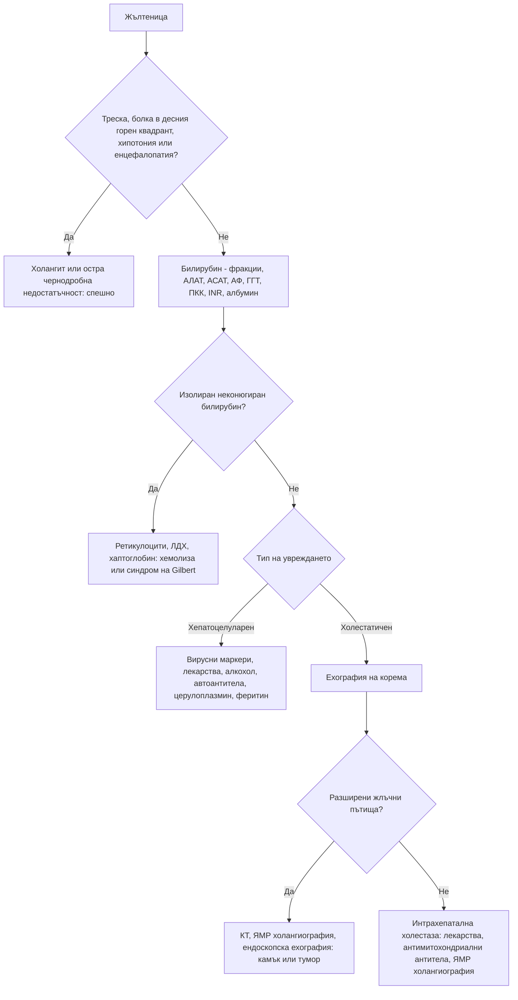

# Глава 26. Жълтеница, отклонения в чернодробните показатели и асцит

> **Част V. Храносмилателна система**

## Цели на главата

- Да се класифицира жълтеницата на прехепатална, хепатоцелуларна и холестатична.
- Да се тълкуват отклоненията в чернодробните показатели по тип и величина.
- Да се прилага рационален набор от изследвания за изясняване на чернодробното заболяване.
- Да се разпознава острата чернодробна недостатъчност като спешно състояние.
- Да се анализира асцитната течност чрез градиента на албумина.

## Ключови моменти

- Жълтеницата е прехепатална (неконюгиран билирубин, нормални ензими), хепатоцелуларна или холестатична (интра- или екстрахепатална). Съотношението R определя типа на увреждането *(SORT C [2])*.
- Изолирано леко повишен неконюгиран билирубин при нормална ПКК и ензими е синдром на Gilbert и не налага изследвания.
- MASLD е най-честата причина за леко повишени ензими. Фиброзата се оценява с FIB-4: под 1,3 (под 2,0 над 65 години) рискът е нисък, над 2,67 — висок *(SORT B [3, 4])*.
- Основният етиологичен скрининг включва HBsAg, анти-HCV, автоантитела, имуноглобулини, феритин и трансферинова сатурация и ехография *(SORT C [5])*.
- Острата чернодробна недостатъчност (INR над 1,5 и енцефалопатия) е спешно състояние. Пациентът се насочва към център с чернодробна трансплантация *(SORT C [6])*.
- Градиентът на албумина 11 g/l или повече насочва към портална хипертония. Неутрофили в асцита 250/mm³ или повече означават спонтанен бактериален перитонит *(SORT B [8])*.

---

## А. Жълтеница

### 1. Основни понятия

- Жълтеницата става видима по склерите при билирубин над **40–50 µmol/l**.
- **Неконюгиран (индиректен) билирубин** — повишено образуване (хемолиза) или нарушено конюгиране (синдром на Gilbert).
- **Конюгиран (директен) билирубин** — хепатоцелуларно увреждане или холестаза. Той се отделя с урината и я оцветява тъмно.
- **Ахолични (светли) изпражнения и тъмна урина** — холестаза.
- **Сърбеж** — холестаза.

### 2. Класификация и причини

| Тип | Причини |
|---|---|
| **Прехепатална** (неконюгиран билирубин, нормални ензими) | **Хемолиза**; **синдром на Gilbert** (5–7% от населението; леко повишение на неконюгирания билирубин при гладуване, заболяване и стрес; нормални ензими и ПКК); синдром на Crigler-Najjar; неефективна еритропоеза; резорбция на голям хематом; лекарства (рифампицин) |
| **Хепатоцелуларна** | **Вирусни хепатити** (A, B, C, D, E; EBV, CMV); **алкохолно** чернодробно заболяване; **метаболитно свързано стеатозно заболяване** (MASLD); **лекарства и токсини** (парацетамол, амоксицилин/клавуланова киселина, изониазид и други противотуберкулозни средства, НСПВС, антиепилептични средства, метотрексат, азатиоприн, нитрофурантоин, **билкови и хранителни добавки**, анаболни стероиди, **гъби *Amanita phalloides***); **исхемичен хепатит** (при шок); **автоимунен хепатит**; **болест на Wilson**; хемохроматоза; дефицит на алфа-1-антитрипсин; синдром на Budd-Chiari; цироза; хепатоцелуларен карцином; сепсис |
| **Холестатична — интрахепатална** | Лекарства (амоксицилин/клавуланова киселина, флуклоксацилин, хлорпромазин, естрогени, анаболни стероиди, макролиди); **първичен билиарен холангит** (жени на средна възраст, сърбеж, антимитохондриални антитела); **първичен склерозиращ холангит** (свързан с улцерозен колит); сепсис; парентерално хранене; холестаза на бременността; инфилтративни процеси (амилоидоза, саркоидоза, лимфом, метастази, туберкулоза) |
| **Холестатична — екстрахепатална** | **Холедохолитиаза** (болезнена, колебаеща се жълтеница); **карцином на главата на панкреаса** (неболезнена, прогресираща жълтеница, белег на Courvoisier — палпируем неболезнен жлъчен мехур); **холангиокарцином**; карцином на Фатеровата папила; стриктура при хроничен панкреатит; първичен склерозиращ холангит; постоперативна стриктура; синдром на Mirizzi; паразити (руптура на **ехинококова киста** в жлъчните пътища); лимфни възли в порта хепатис |

### 3. Безопасна диагностична стратегия

| Въпрос | Отговор |
|---|---|
| **Вероятна диагноза** | Синдром на Gilbert, холедохолитиаза, вирусен хепатит, алкохолно чернодробно заболяване, лекарства |
| **Сериозни заболявания, които не бива да се пропускат** | **Остра чернодробна недостатъчност**; **холангит**; **карцином на панкреаса** и холангиокарцином; отравяне с парацетамол или гъби; хемолиза (включително при Г6ФД дефицит); **болест на Wilson** при млади хора; синдром на Budd-Chiari; HELLP синдром и остра мастна дегенерация на черния дроб при бременни |
| **Чести капани** | Синдромът на Gilbert, изследван прекомерно; повишени АСАТ и АЛАТ от **мускулен произход** (рабдомиолиза, миозит, усилие — проверете креатинкиназа (КК)); лекарствено увреждане със забавено начало (амоксицилин/клавуланова киселина — до 6 седмици след курса) [1]; билкови продукти; автоимунен хепатит; цьолиакия; изолирано повишена алкална фосфатаза от костен произход |
| **Маскиращи заболявания** | Лекарства, алкохол, захарен диабет (стеатоза), заболявания на щитовидната жлеза, сърдечна недостатъчност (застоен черен дроб) |
| **Психосоциални аспекти** | Злоупотреба с алкохол, венозна употреба на наркотици, рисково сексуално поведение |

---

## Б. Тълкуване на чернодробните показатели

### 4. Тип на увреждането

**Съотношение R** = (АЛАТ / горна граница на АЛАТ) ÷ (АФ / горна граница на АФ) [2]:

- **R > 5** — хепатоцелуларен тип;
- **R < 2** — холестатичен тип;
- **R = 2–5** — смесен тип.

### 5. Величина на повишението на трансаминазите

| Величина | Причини |
|---|---|
| **Много високи (> 1000 U/l)** | **Исхемичен хепатит** (бързо спадане за дни), остър вирусен хепатит, **лекарства и токсини** (парацетамол, гъби), остра обструкция на жлъчните пътища (преходно повишение при камък), автоимунен хепатит, херпесен хепатит, болест на Wilson (при фулминантна форма стойностите са относително по-ниски) |
| **Умерени (5–15 пъти над горната граница)** | Остър или хроничен вирусен хепатит, лекарства, автоимунен хепатит, алкохолен хепатит |
| **Леки (< 5 пъти над горната граница)** | **Стеатозно чернодробно заболяване**, алкохол, хронични хепатити B и C, лекарства, хемохроматоза, автоимунен хепатит, **цьолиакия**, заболявания на щитовидната жлеза, **мускулен произход**, болест на Wilson, дефицит на алфа-1-антитрипсин |

### 6. Специфични отклонения

- **Съотношение АСАТ/АЛАТ > 2**, съчетано с повишена ГГТ и макроцитоза — **алкохолно** чернодробно заболяване. Съотношение над 1 се наблюдава и при цироза от всякакъв произход.
- **Изолирано повишена алкална фосфатаза:**
  - **с повишена ГГТ** — чернодробен произход;
  - **с нормална ГГТ** — **костен произход** (болест на Paget, зарастващи фрактури, остеомалация, костни метастази, растеж при деца и юноши, хиперпаратиреоидизъм) или **бременност** (плацентарна АФ).
- **Изолирано повишена ГГТ** — алкохол, ензим-индуциращи лекарства (антиепилептични), стеатоза, затлъстяване. Показателят е неспецифичен.
- **Изолирано повишен неконюгиран билирубин** — синдром на Gilbert или хемолиза. Изследват се ПКК, ретикулоцити, ЛДХ и хаптоглобин.
- **Синтетична функция:** албумин, INR, тромбоцити (тромбоцитопенията е ранен белег на портална хипертония).

### 7. Метаболитно свързано стеатозно чернодробно заболяване (MASLD)

- Това е новото наименование (от 2023 г.) на неалкохолната мастна болест на черния дроб [3]. Критериите са **стеатоза и поне един кардиометаболитен рисков фактор**: затлъстяване, преддиабет или диабет, хипертония, дислипидемия.
- Това е **най-честата причина** за леко повишени чернодробни ензими.
- Съчетанието със значима консумация на алкохол се обозначава като **MetALD**.
- **Оценка на фиброзата** с индекса FIB-4 = (възраст × АСАТ) / (тромбоцити × √АЛАТ) [4]:
  - **< 1,3** (< 2,0 над 65 години) — нисък риск от напреднала фиброза;
  - **> 2,67** — висок риск, насочване към хепатолог;
  - **междинни стойности** — еластография (FibroScan) или серумни маркери за фиброза.

### 8. Изследване на отклонените чернодробни показатели

**Анамнеза:** алкохол (AUDIT), лекарства, **билки и добавки**, рискови фактори за вирусни хепатити, метаболитни рискови фактори, фамилна анамнеза, пътувания, консумация на гъби.

**Основен „чернодробен етиологичен скрининг“** [5]:

- HBsAg, анти-HCV (при положителен резултат — HCV РНК);
- **ехография на корема**;
- автоантитела: срещу гладката мускулатура, антимитохондриални, антинуклеарни; имуноглобулини;
- **феритин и трансферинова сатурация**;
- алфа-1-антитрипсин;
- **церулоплазмин** (при млади пациенти — болест на Wilson);
- серология за цьолиакия;
- ТСХ;
- КК (при изолирано повишени трансаминази);
- ПКК.

---

## В. Остра чернодробна недостатъчност

**Спешно състояние.** Определя се като жълтеница, **коагулопатия (INR > 1,5)** и **чернодробна енцефалопатия** при пациент без предшестващо чернодробно заболяване, развили се в рамките на 26 седмици [6].

**Причини:**

- **парацетамол**;
- вирусни хепатити (A, B, **E — особено опасен при бременни**);
- идиосинкратични лекарствени реакции;
- ***Amanita phalloides*** (зелена мухоморка — отравянията в България са сезонни, през лятото и есента);
- болест на Wilson, автоимунен хепатит;
- синдром на Budd-Chiari;
- исхемичен хепатит;
- бременност (остра мастна дегенерация на черния дроб, HELLP синдром).

Пациентите се насочват спешно към център с възможност за чернодробна трансплантация.

---

## Г. Хепатомегалия и огнищни лезии

### 9. Хепатомегалия

- **Стеатоза** (стеатозно заболяване, алкохол).
- **Застой** (десностранна сърдечна недостатъчност — при трикуспидална регургитация черният дроб пулсира).
- Хепатити.
- **Инфилтрация** (лимфом, левкемия, амилоидоза, саркоидоза, хемохроматоза).
- **Злокачествени заболявания** (метастази, хепатоцелуларен карцином). Твърдият, неравен, нодуларен черен дроб е суспектен за злокачествен процес.
- **Кисти** (поликистоза, **ехинококоза**) и абсцеси (пиогенни, амебни).
- Синдром на Budd-Chiari.
- Варианти на нормата (Riedel лоб).

### 10. Огнищни лезии в черния дроб

| Лезия | Особености |
|---|---|
| Хемангиом | Най-честата доброкачествена лезия; характерен образ при контрастна КТ или ЯМР |
| Фокална нодуларна хиперплазия | Млади жени; централен белег |
| Аденом | Орални контрацептиви, анаболни стероиди; риск от кървене и малигнизация |
| Проста киста | Анехогенна, тънкостенна |
| **Ехинококова киста** | **България е с най-високата честота на кистозна ехинококоза в Европейския съюз** [7]. Контакт с кучета, селски район; кисти с дъщерни кисти и отлепени мембрани при ехография; серология. **Пункцията е противопоказана без специализирана подготовка** (риск от анафилаксия и дисеминация) |
| Абсцес | Треска, болка в десния горен квадрант; пиогенен (при жлъчна патология) или амебен (при пътували) |
| Хепатоцелуларен карцином | Цироза, хроничен хепатит B; алфа-фетопротеин |
| Метастази | Колоректален карцином, панкреас, гърда, бял дроб, меланом |

---

## Д. Асцит

### 11. Градиент на албумина (серум минус асцит)

| Градиент ≥ 11 g/l (портална хипертония) [8] | Градиент < 11 g/l (без портална хипертония) |
|---|---|
| **Цироза** (около 80% от случаите на асцит) | **Перитонеална карциноматоза** (яйчник, стомах, дебело черво, панкреас, мезотелиом) |
| Сърдечна недостатъчност (белтък в асцита > 25 g/l) | **Туберкулозен перитонит** (лимфоцити, аденозин дезаминаза) |
| Синдром на Budd-Chiari (висок белтък) | Нефрозен синдром (нисък белтък) |
| Тромбоза на порталната вена | Панкреатичен асцит (висока амилаза) |
| Алкохолен хепатит, масивни метастази в черния дроб | Серозит (системен лупус еритематодес), хилозен асцит (триглицериди; лимфом, травма) |

**Анализ на асцитната течност:**

- клетъчен състав — **неутрофили ≥ 250/mm³ означават спонтанен бактериален перитонит** [8];
- посявка в шишета за хемокултура;
- белтък, албумин (за градиента);
- цитология;
- амилаза, триглицериди, аденозин дезаминаза при показания.

### 12. Стигмати на хронично чернодробно заболяване

Съдови паячета (повече от 5), палмарен еритем, гинекомастия, тестикуларна атрофия, контрактура на Dupuytren, барабанни пръсти, левконихия, **астериксис** (флапинг тремор), caput medusae, спленомегалия, асцит, жълтеница, чернодробен мирис, уголемени паротидни жлези (при алкохол), **пръстени на Kayser-Fleischer** (болест на Wilson).

---

## 13. Диагностичен алгоритъм при жълтеница

---

## 14. Червени флагове и насочване

### 14.1. Червени флагове

- Жълтеница с треска, болка в десния горен квадрант или хипотония (холангит).
- INR над 1,5, обърканост или сънливост (остра чернодробна недостатъчност).
- Съмнение за отравяне с парацетамол или със зелена мухоморка.
- Неболезнена прогресираща жълтеница със загуба на тегло (карцином на панкреаса или холангиокарцином).
- Хепатит с хемолиза при млад човек (болест на Wilson).
- Треска или коремна болка при пациент с асцит (спонтанен бактериален перитонит).
- Жълтеница при бременна (HELLP синдром, остра мастна дегенерация на черния дроб).

### 14.2. Кога и колко спешно да насочим

| Спешност | Клинична ситуация |
|---|---|
| **Незабавно (112 или спешно отделение)** | Остра чернодробна недостатъчност; холангит с хипотония или объркване; отравяне с парацетамол или гъби; кървене от варици; енцефалопатия при цироза; жълтеница при бременна с хипертония или коремна болка |
| **В същия ден** | Жълтеница с треска и болка в десния горен квадрант; треска или коремна болка при асцит; трансаминази над 1000 U/l; хепатит с хемолиза при млад човек |
| **Бързо (до 2 седмици)** | Неболезнена прогресираща жълтеница, особено със загуба на тегло, при възраст 40 и повече години (подозрение за карцином на панкреаса); твърд, нодуларен черен дроб; новооткрита огнищна лезия, подозрителна за злокачествена |
| **Планово** | FIB-4 над 2,67 или междинни стойности с патологична еластография (хепатолог) [4]; положителни маркери за хепатит B или C; новооткрит асцит без остри усложнения; ехинококова киста (без пункция) |
| **Проследяване в общата практика** | Синдром на Gilbert; MASLD с нисък риск по FIB-4 — контрол на рисковите фактори и повторна оценка след няколко години |

---

## 15. Клинични перли

- Изолирано леко повишен неконюгиран билирубин при нормална ПКК и нормални ензими: синдром на Gilbert. Не са нужни допълнителни изследвания.
- Повишени АСАТ и АЛАТ при човек, който тренира интензивно или приема статини: изследвайте КК.
- Неболезнена прогресираща жълтеница и загуба на тегло при възрастен човек: карцином на панкреаса. Направете КТ.
- Трансаминази над 1000 U/l при пациент след епизод на хипотония: исхемичен хепатит.
- Млад човек с хепатит, хемолиза и ниска алкална фосфатаза: болест на Wilson. Това е спешно състояние.
- Амоксицилин/клавулановата киселина е една от най-честите причини за лекарствено чернодробно увреждане. Началото може да е седмици след курса.
- Кистозна лезия в черния дроб при човек от селски район: изключете ехинококоза преди каквато и да е пункция.
- Отравянето със зелена мухоморка започва с диария и повръщане 6–24 часа след консумацията. Последва привидно подобрение, после чернодробна недостатъчност.

---

## 16. Клиничен случай

**Етап 1 — представяне.** Жена на 19 години се оплаква от умора и пожълтяване от една седмица. Не приема лекарства и алкохол.

> **Въпрос 1.** Кои изследвания ще назначите първо?

**Етап 2 — изследвания.** Общ билирубин 186 µmol/l (предимно неконюгиран в началото), АЛАТ 220 U/l, АСАТ 510 U/l, алкална фосфатаза 38 U/l (ниска), хемоглобин 94 g/l, ретикулоцити 8%, отрицателен директен тест на Coombs, INR 1,6. Маркерите за вирусни хепатити са отрицателни.

> **Въпрос 2.** Кое заболяване обяснява съчетанието от хепатит и хемолиза?

> **Въпрос 3.** Колко спешно е състоянието?

Обсъждане и отговори

**Отговор 1.** Фракции на билирубина, АЛАТ, АСАТ, алкална фосфатаза, ГГТ, ПКК с ретикулоцити, INR, албумин и маркери за вирусни хепатити. При млад пациент с неясно чернодробно заболяване се изследва и церулоплазмин.

**Отговор 2.** Хепатит в млада възраст с **Coombs-отрицателна хемолитична анемия**, **ниска алкална фосфатаза** (съотношение АФ/билирубин под 4) и **съотношение АСАТ/АЛАТ над 2,2** е характерна картина на **остра болест на Wilson** [9]. Медта, освободена от некротичните хепатоцити, предизвиква хемолиза. Церулоплазминът е нисък, екскрецията на мед в урината за 24 часа е висока, а при прегледа с процепна лампа се откриват пръстени на Kayser-Fleischer [10].

**Отговор 3.** Повишеният INR показва започваща чернодробна недостатъчност. Пациентката се насочва **спешно** към център за чернодробна трансплантация [6].

**Поука.** При всеки млад пациент (под 40 години) с неясно чернодробно заболяване трябва да се мисли за болестта на Wilson. Ранната диагноза спасява живот.

---

## Обобщение

- Жълтеницата се класифицира по вида на билирубина и типа на ензимните отклонения. Ехографията разграничава интра- от екстрахепаталната холестаза.
- Величината и съотношенията на ензимите насочват към причината. Изолираните отклонения (АФ, ГГТ, неконюгиран билирубин) имат свои типични обяснения.
- MASLD е най-честата причина за леко повишени ензими, а FIB-4 определя кого да насочим. Лекарствата, билките и алкохолът трябва да се проверяват винаги.
- Острата чернодробна недостатъчност, холангитът и отравянията изискват незабавно насочване. Асцитът се изяснява с градиента на албумина и броя на неутрофилите.

## Самопроверка

### Въпроси с един верен отговор

**1.** *(основно ниво)* Мъж на 24 години има леко пожълтяване на склерите след няколко дни гладуване. Общият билирубин е 42 µmol/l, предимно неконюгиран. Ензимите, ПКК и ретикулоцитите са нормални. Какво е поведението?

- **А.** Ехография на корема и КТ
- **Б.** Обяснение за синдром на Gilbert без допълнителни изследвания
- **В.** Чернодробна биопсия
- **Г.** Изследване за хепатит C
- **Д.** Насочване към хепатолог

Отговор и обосновка

**Верен отговор: Б.** Изолираното леко повишение на неконюгирания билирубин при нормални ензими, ПКК и ретикулоцити, провокирано от гладуване, е типично за синдром на Gilbert. Не са нужни допълнителни изследвания. А, В, Г и Д са излишни.

**2.** *(основно ниво)* АЛАТ е 5 пъти над горната граница, а алкалната фосфатаза — 1,5 пъти над горната граница. Колко е съотношението R и какъв е типът на увреждането?

- **А.** R ≈ 0,3 — холестатичен тип
- **Б.** R ≈ 3,3 — смесен тип
- **В.** R ≈ 3,3 — хепатоцелуларен тип
- **Г.** R ≈ 7,5 — хепатоцелуларен тип
- **Д.** R ≈ 1,5 — холестатичен тип

Отговор и обосновка

**Верен отговор: Б.** R = 5 / 1,5 ≈ 3,3. Стойност между 2 и 5 означава смесен тип увреждане [2]. Над 5 типът е хепатоцелуларен, а под 2 — холестатичен.

**3.** *(основно ниво)* Жена на 55 години със затлъстяване и диабет тип 2 има леко повишени трансаминази. Ехографията показва стеатоза. Възрастта ѝ е 55 години, АСАТ — 30 U/l, АЛАТ — 36 U/l, тромбоцитите — 250 × 10⁹/l. Колко е FIB-4 и какво означава?

- **А.** Около 1,1 — нисък риск от напреднала фиброза
- **Б.** Около 2,0 — междинен риск
- **В.** Около 3,0 — висок риск
- **Г.** Около 0,2 — индексът не е приложим
- **Д.** Около 4,5 — цироза

Отговор и обосновка

**Верен отговор: А.** FIB-4 = (55 × 30) / (250 × √36) = 1650 / (250 × 6) = 1650 / 1500 ≈ 1,1. Стойност под 1,3 означава нисък риск от напреднала фиброза [4]. Нужни са контрол на рисковите фактори и повторна оценка.

**4.** *(напреднало ниво)* Мъж на 62 години с цироза и асцит има лека треска и дифузна болезненост в корема. Кое изследване е най-важно?

- **А.** КТ на главата
- **Б.** Диагностична парацентеза с броене на неутрофилите
- **В.** Колоноскопия
- **Г.** Амилаза
- **Д.** Ехокардиография

Отговор и обосновка

**Верен отговор: Б.** Треската или болката при асцит налагат диагностична парацентеза. Неутрофили 250/mm³ или повече в асцитната течност означават спонтанен бактериален перитонит, който изисква незабавно лечение [8].

**5.** *(напреднало ниво)* Жена на 70 години има неболезнена прогресираща жълтеница, сърбеж, тъмна урина, светли изпражнения и загуба на 6 kg. Жлъчният мехур се палпира и е неболезнен. Кое е най-подходящото изследване след ехографията?

- **А.** Повторна ехография след месец
- **Б.** КТ на корема по панкреатичен протокол
- **В.** Само туморни маркери
- **Г.** Тест за хепатит A
- **Д.** Чернодробна биопсия

Отговор и обосновка

**Верен отговор: Б.** Неболезнената прогресираща жълтеница с палпируем неболезнен жлъчен мехур (белег на Courvoisier) и загуба на тегло е типична за карцином на главата на панкреаса. Изследването на избор е КТ по панкреатичен протокол. А забавя диагнозата. В не е достатъчно за диагноза. Г и Д не отговарят на хипотезата.

### Задача

Мъж на 58 години има АСАТ 64 U/l, АЛАТ 40 U/l и тромбоцити 150 × 10⁹/l. Изчислете FIB-4, интерпретирайте го и предложете следващата стъпка.

Решение

FIB-4 = (58 × 64) / (150 × √40) = 3712 / (150 × 6,32) = 3712 / 948 ≈ **3,9**. Стойност над 2,67 означава **висок риск от напреднала фиброза** [4]. Пациентът се насочва към хепатолог за еластография и оценка за цироза. Съотношението АСАТ/АЛАТ 1,6 и ниските тромбоцити също подкрепят напреднало заболяване. Задължително се изясняват консумацията на алкохол (AUDIT), лекарствата и метаболитните рискови фактори и се прави етиологичен скрининг [5].

### OSCE станция: Преглед за стигмати на хронично чернодробно заболяване

**Време:** 8 минути. **Ниво:** основно (студенти, специализанти).

**Задача за кандидата.** Мъж на 60 години има повишени чернодробни ензими. Направете преглед за стигмати на хронично чернодробно заболяване и опишете находките.

**Информация за симулирания пациент (за изпитващия).** Има палмарен еритем, 7 съдови паячета по гърдите, гинекомастия и лек асцит. Склерите са субиктерични. Няма астериксис.

**Рубрика за оценяване**

| Критерий | Точки |
|---|---|
| Представя се, иска съгласие и позиционира пациента | 1 |
| Оглежда ръцете: палмарен еритем, левконихия, барабанни пръсти, контрактура на Dupuytren | 2 |
| Търси астериксис правилно (изпънати ръце с дорзална флексия в китките) | 1 |
| Оглежда склерите, лицето и паротидните жлези | 1 |
| Търси съдови паячета и гинекомастия по гръдния кош | 2 |
| Изследва корема: хепатоспленомегалия, асцит (подвижно притъпяване), caput medusae | 2 |
| Обобщава находката като хронично чернодробно заболяване с портална хипертония | 1 |
| Предлага следващи стъпки: етиологичен скрининг, ехография, насочване при асцит | 1 |
| **Общо** | **11** |

**Праг за успешно представяне:** 8 от 11 точки, включително търсенето на астериксис и асцит.

## Литература

1. European Association for the Study of the Liver. EASL Clinical Practice Guidelines: Drug-induced liver injury. J Hepatol. 2019;70(6):1222-1261. doi:10.1016/j.jhep.2019.02.014. PMID: 30926241.
2. Kwo PY, Cohen SM, Lim JK. ACG Clinical Guideline: Evaluation of Abnormal Liver Chemistries. Am J Gastroenterol. 2017;112(1):18-35. doi:10.1038/ajg.2016.517. PMID: 27995906.
3. Rinella ME, Lazarus JV, Ratziu V, Francque SM, Sanyal AJ, Kanwal F, et al. A multisociety Delphi consensus statement on new fatty liver disease nomenclature. J Hepatol. 2023;79(6):1542-1556. doi:10.1016/j.jhep.2023.06.003. PMID: 37364790.
4. European Association for the Study of the Liver (EASL), European Association for the Study of Diabetes (EASD), European Association for the Study of Obesity (EASO). EASL-EASD-EASO Clinical Practice Guidelines on the management of metabolic dysfunction-associated steatotic liver disease (MASLD). J Hepatol. 2024;81(3):492-542. doi:10.1016/j.jhep.2024.04.031. PMID: 38851997.
5. Newsome PN, Cramb R, Davison SM, Dillon JF, Foulerton M, Godfrey EM, et al. Guidelines on the management of abnormal liver blood tests. Gut. 2018;67(1):6-19. doi:10.1136/gutjnl-2017-314924. PMID: 29122851.
6. Wendon, J, Cordoba J, Dhawan A, Larsen FS, Manns M, Samuel D, et al. EASL Clinical Practical Guidelines on the management of acute (fulminant) liver failure. J Hepatol. 2017;66(5):1047-1081. doi:10.1016/j.jhep.2016.12.003. PMID: 28417882.
7. Jordanova DP, Harizanov RN, Kaftandjiev IT, Rainova IG, Kantardjiev TV. Cystic echinococcosis in Bulgaria 1996-2013, with emphasis on childhood infections. Eur J Clin Microbiol Infect Dis. 2015;34(7):1423-8. doi:10.1007/s10096-015-2368-z. PMID: 25864190.
8. European Association for the Study of the Liver. EASL Clinical Practice Guidelines for the management of patients with decompensated cirrhosis. J Hepatol. 2018;69(2):406-460. doi:10.1016/j.jhep.2018.03.024. PMID: 29653741.
9. Korman JD, Volenberg I, Balko J, Webster J, Schiodt FV, Squires RH Jr, et al. Screening for Wilson disease in acute liver failure: a comparison of currently available diagnostic tests. Hepatology. 2008;48(4):1167-74. doi:10.1002/hep.22446. PMID: 18798336.
10. European Association for the Study of the Liver. EASL-ERN Clinical Practice Guidelines on Wilson's disease. J Hepatol. 2025;82(4):690-728. doi:10.1016/j.jhep.2024.11.007. PMID: 40089450.

*Последна проверка на съдържанието: септември 2026 г. Следващ планиран преглед: септември 2027 г. (вж. „Политика за актуализация“ в README).*

<!-- навигация -->

---

[← Глава 25. Кървене от храносмилателния тракт](25-gi-kraveene.md) · [Съдържание](../README.md) · [Глава 27. Дизурия и симптоми от долните пикочни пътища →](27-dizuria.md)
