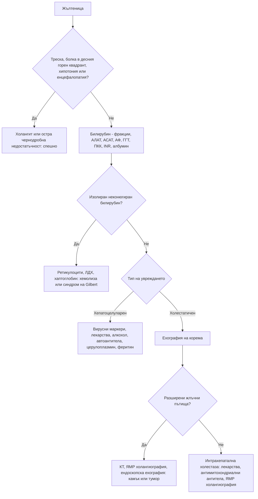

# Глава 26. Жълтеница, отклонения в чернодробните показатели и асцит

> **Част V. Храносмилателна система**

## Цели на главата

- Да се класифицира жълтеницата на прехепатална, хепатоцелуларна и холестатична.
- Да се тълкуват отклоненията в чернодробните показатели по тип и величина.
- Да се прилага рационален набор от изследвания за изясняване на чернодробното заболяване.
- Да се разпознава острата чернодробна недостатъчност като спешно състояние.
- Да се анализира асцитната течност чрез градиента на албумина.

---

## А. ЖЪЛТЕНИЦА

## 1. Основни понятия

- Жълтеницата става видима по склерите при билирубин над **40–50 µmol/l**.
- **Неконюгиран (индиректен) билирубин** — повишено образуване (хемолиза) или нарушено конюгиране (синдром на Gilbert).
- **Конюгиран (директен) билирубин** — хепатоцелуларно увреждане или холестаза. Той се отделя с урината и я оцветява тъмно.
- **Ахолични (светли) изпражнения и тъмна урина** — холестаза.
- **Сърбеж** — холестаза.

## 2. Класификация и причини

| Тип | Причини |
|---|---|
| **Прехепатална** (неконюгиран билирубин, нормални ензими) | **Хемолиза**; **синдром на Gilbert** (5–7% от населението; леко повишение на неконюгирания билирубин при гладуване, заболяване и стрес; нормални ензими и ПКК); синдром на Crigler-Najjar; неефективна еритропоеза; резорбция на голям хематом; лекарства (рифампицин) |
| **Хепатоцелуларна** | **Вирусни хепатити** (A, B, C, D, E; EBV, CMV); **алкохолно** чернодробно заболяване; **метаболитно свързано стеатозно заболяване** (MASLD); **лекарства и токсини** (парацетамол, амоксицилин/клавуланова киселина, изониазид и други противотуберкулозни средства, НСПВС, антиепилептични средства, метотрексат, азатиоприн, нитрофурантоин, **билкови и хранителни добавки**, анаболни стероиди, **гъби *Amanita phalloides***); **исхемичен хепатит** (при шок); **автоимунен хепатит**; **болест на Wilson**; хемохроматоза; дефицит на алфа-1-антитрипсин; синдром на Budd-Chiari; цироза; хепатоцелуларен карцином; сепсис |
| **Холестатична — интрахепатална** | Лекарства (амоксицилин/клавуланова киселина, флуклоксацилин, хлорпромазин, естрогени, анаболни стероиди, макролиди); **първичен билиарен холангит** (жени на средна възраст, сърбеж, антимитохондриални антитела); **първичен склерозиращ холангит** (свързан с улцерозен колит); сепсис; парентерално хранене; холестаза на бременността; инфилтративни процеси (амилоидоза, саркоидоза, лимфом, метастази, туберкулоза) |
| **Холестатична — екстрахепатална** | **Холедохолитиаза** (болезнена, колебаеща се жълтеница); **карцином на главата на панкреаса** (неболезнена, прогресираща жълтеница, белег на Courvoisier — палпируем неболезнен жлъчен мехур); **холангиокарцином**; карцином на Фатеровата папила; стриктура при хроничен панкреатит; първичен склерозиращ холангит; постоперативна стриктура; синдром на Mirizzi; паразити (руптура на **ехинококова киста** в жлъчните пътища); лимфни възли в порта хепатис |

## 3. Безопасна диагностична стратегия

| Въпрос | Отговор |
|---|---|
| **Вероятна диагноза** | Синдром на Gilbert, холедохолитиаза, вирусен хепатит, алкохолно чернодробно заболяване, лекарства |
| **Сериозни заболявания, които не бива да се пропускат** | **Остра чернодробна недостатъчност**; **холангит**; **карцином на панкреаса** и холангиокарцином; отравяне с парацетамол или гъби; хемолиза (включително при G6PD дефицит); **болест на Wilson** при млади хора; синдром на Budd-Chiari; HELLP синдром и остра мастна дегенерация на черния дроб при бременни |
| **Чести капани** | Синдромът на Gilbert, изследван прекомерно; повишени АСАТ и АЛАТ от **мускулен произход** (рабдомиолиза, миозит, усилие — проверете КК); лекарствено увреждане със забавено начало (амоксицилин/клавуланова киселина — до 6 седмици след курса); билкови продукти; автоимунен хепатит; цьолиакия; изолирано повишена алкална фосфатаза от костен произход |
| **Маскиращи заболявания** | Лекарства, алкохол, захарен диабет (стеатоза), заболявания на щитовидната жлеза, сърдечна недостатъчност (застоен черен дроб) |
| **Психосоциални аспекти** | Злоупотреба с алкохол, венозна употреба на наркотици, рисково сексуално поведение |

---

## Б. ТЪЛКУВАНЕ НА ЧЕРНОДРОБНИТЕ ПОКАЗАТЕЛИ

## 4. Тип на увреждането

**Съотношение R** = (АЛАТ / горна граница на АЛАТ) ÷ (АФ / горна граница на АФ):

- **R > 5** — хепатоцелуларен тип;
- **R < 2** — холестатичен тип;
- **R = 2–5** — смесен тип.

## 5. Величина на повишението на трансаминазите

| Величина | Причини |
|---|---|
| **Много високи (> 1000 U/l)** | **Исхемичен хепатит** (бързо спадане за дни), остър вирусен хепатит, **лекарства и токсини** (парацетамол, гъби), остра обструкция на жлъчните пътища (преходно повишение при камък), автоимунен хепатит, херпесен хепатит, болест на Wilson (при фулминантна форма стойностите са относително по-ниски) |
| **Умерени (5–15 пъти над горната граница)** | Остър или хроничен вирусен хепатит, лекарства, автоимунен хепатит, алкохолен хепатит |
| **Леки (< 5 пъти над горната граница)** | **Стеатозно чернодробно заболяване**, алкохол, хронични хепатити B и C, лекарства, хемохроматоза, автоимунен хепатит, **цьолиакия**, заболявания на щитовидната жлеза, **мускулен произход**, болест на Wilson, дефицит на алфа-1-антитрипсин |

## 6. Специфични отклонения

- **Съотношение АСАТ/АЛАТ > 2**, съчетано с повишена ГГТ и макроцитоза — **алкохолно** чернодробно заболяване. Съотношение над 1 се наблюдава и при цироза от всякакъв произход.
- **Изолирано повишена алкална фосфатаза:**
  - **с повишена ГГТ** — чернодробен произход;
  - **с нормална ГГТ** — **костен произход** (болест на Paget, зарастващи фрактури, остеомалация, костни метастази, растеж при деца и юноши, хиперпаратиреоидизъм) или **бременност** (плацентарна АФ).
- **Изолирано повишена ГГТ** — алкохол, ензим-индуциращи лекарства (антиепилептични), стеатоза, затлъстяване. Показателят е неспецифичен.
- **Изолирано повишен неконюгиран билирубин** — синдром на Gilbert или хемолиза. Изследват се ПКК, ретикулоцити, ЛДХ и хаптоглобин.
- **Синтетична функция:** албумин, INR, тромбоцити (тромбоцитопенията е ранен белег на портална хипертония).

## 7. Метаболитно свързано стеатозно чернодробно заболяване (MASLD)

- Това е новото наименование (от 2023 г.) на неалкохолната мастна болест на черния дроб. Критериите са **стеатоза и поне един кардиометаболитен рисков фактор**: затлъстяване, преддиабет или диабет, хипертония, дислипидемия.
- Това е **най-честата причина** за леко повишени чернодробни ензими.
- Съчетанието със значима консумация на алкохол се обозначава като **MetALD**.
- **Оценка на фиброзата** с индекса FIB-4 = (възраст × АСАТ) / (тромбоцити × √АЛАТ):
  - **< 1,3** (< 2,0 над 65 години) — нисък риск от напреднала фиброза;
  - **> 2,67** — висок риск, насочване към хепатолог;
  - **междинни стойности** — еластография (FibroScan) или серумни маркери за фиброза.

## 8. Изследване на отклонените чернодробни показатели

**Анамнеза:** алкохол (AUDIT), лекарства, **билки и добавки**, рискови фактори за вирусни хепатити, метаболитни рискови фактори, фамилна анамнеза, пътувания, консумация на гъби.

**Основен „чернодробен етиологичен скрининг“:**

- HBsAg, анти-HCV (при положителен резултат — HCV РНК);
- **ехография на корема**;
- автоантитела: срещу гладката мускулатура, антимитохондриални, антинуклеарни; имуноглобулини;
- **феритин и трансферинова сатурация**;
- алфа-1-антитрипсин;
- **церулоплазмин** (при млади пациенти — болест на Wilson);
- серология за цьолиакия;
- ТСХ;
- КК (при изолирано повишени трансаминази);
- ПКК.

---

## В. ОСТРА ЧЕРНОДРОБНА НЕДОСТАТЪЧНОСТ

**Спешно състояние.** Определя се като жълтеница, **коагулопатия (INR > 1,5)** и **чернодробна енцефалопатия** при пациент без предшестващо чернодробно заболяване, развили се в рамките на 26 седмици.

**Причини:**

- **парацетамол**;
- вирусни хепатити (A, B, **E — особено опасен при бременни**);
- идиосинкратични лекарствени реакции;
- ***Amanita phalloides*** (бледа мухоморка — отравянията в България са сезонни, през лятото и есента);
- болест на Wilson, автоимунен хепатит;
- синдром на Budd-Chiari;
- исхемичен хепатит;
- бременност (остра мастна дегенерация на черния дроб, HELLP синдром).

Пациентите се насочват спешно към център с възможност за чернодробна трансплантация.

---

## Г. ХЕПАТОМЕГАЛИЯ И ОГНИЩНИ ЛЕЗИИ

## 9. Хепатомегалия

- **Стеатоза** (стеатозно заболяване, алкохол).
- **Застой** (десностранна сърдечна недостатъчност — при трикуспидална регургитация черният дроб пулсира).
- Хепатити.
- **Инфилтрация** (лимфом, левкемия, амилоидоза, саркоидоза, хемохроматоза).
- **Злокачествени заболявания** (метастази, хепатоцелуларен карцином). Твърдият, неравен, нодуларен черен дроб е суспектен за злокачествен процес.
- **Кисти** (поликистоза, **ехинококоза**) и абсцеси (пиогенни, амебни).
- Синдром на Budd-Chiari.
- Варианти на нормата (Riedel лоб).

## 10. Огнищни лезии в черния дроб

| Лезия | Особености |
|---|---|
| Хемангиом | Най-честата доброкачествена лезия; характерен образ при контрастна КТ или ЯМР |
| Фокална нодуларна хиперплазия | Млади жени; централен белег |
| Аденом | Орални контрацептиви, анаболни стероиди; риск от кървене и малигнизация |
| Проста киста | Анехогенна, тънкостенна |
| **Ехинококова киста** | **България е сред страните с най-висока честота в ЕС.** Контакт с кучета, селски район; кисти с дъщерни кисти и отлепени мембрани при ехография; серология. **Пункцията е противопоказана без специализирана подготовка** (риск от анафилаксия и дисеминация) |
| Абсцес | Треска, болка в десния горен квадрант; пиогенен (при жлъчна патология) или амебен (при пътували) |
| Хепатоцелуларен карцином | Цироза, хроничен хепатит B; алфа-фетопротеин |
| Метастази | Колоректален карцином, панкреас, гърда, бял дроб, меланом |

---

## Д. АСЦИТ

## 11. Градиент на албумина (серум минус асцит)

| Градиент ≥ 11 g/l (портална хипертония) | Градиент < 11 g/l (без портална хипертония) |
|---|---|
| **Цироза** (около 80% от случаите на асцит) | **Перитонеална карциноматоза** (яйчник, стомах, дебело черво, панкреас, мезотелиом) |
| Сърдечна недостатъчност (белтък в асцита > 25 g/l) | **Туберкулозен перитонит** (лимфоцити, аденозин дезаминаза) |
| Синдром на Budd-Chiari (висок белтък) | Нефрозен синдром (нисък белтък) |
| Тромбоза на порталната вена | Панкреатичен асцит (висока амилаза) |
| Алкохолен хепатит, масивни метастази в черния дроб | Серозит (системен лупус еритематодес), хилозен асцит (триглицериди; лимфом, травма) |

**Анализ на асцитната течност:**

- клетъчен състав — **неутрофили ≥ 250/mm³ означават спонтанен бактериален перитонит**;
- посявка в шишета за хемокултура;
- белтък, албумин (за градиента);
- цитология;
- амилаза, триглицериди, аденозин дезаминаза при показания.

## 12. Стигмати на хронично чернодробно заболяване

Съдови паячета (повече от 5), палмарен еритем, гинекомастия, тестикуларна атрофия, контрактура на Dupuytren, барабанни пръсти, левконихия, **астериксис** (флапинг тремор), caput medusae, спленомегалия, асцит, жълтеница, чернодробен мирис, уголемени паротидни жлези (при алкохол), **пръстени на Kayser-Fleischer** (болест на Wilson).

---

## 13. Диагностичен алгоритъм при жълтеница

---

## 14. Клинични перли

- Изолирано леко повишен неконюгиран билирубин при нормална ПКК и нормални ензими: синдром на Gilbert. Не са нужни допълнителни изследвания.
- Повишени АСАТ и АЛАТ при човек, който тренира интензивно или приема статини: изследвайте КК.
- Неболезнена прогресираща жълтеница и загуба на тегло при възрастен човек: карцином на панкреаса. Направете КТ.
- Трансаминази над 1000 U/l при пациент след епизод на хипотония: исхемичен хепатит.
- Млад човек с хепатит, хемолиза и ниска алкална фосфатаза: болест на Wilson. Това е спешно състояние.
- Амоксицилин/клавулановата киселина е една от най-честите причини за лекарствено чернодробно увреждане. Началото може да е седмици след курса.
- Кистозна лезия в черния дроб при човек от селски район: изключете ехинококоза преди каквато и да е пункция.
- Отравянето с бледа мухоморка започва с диария и повръщане 6–12 часа след консумацията. Последва привидно подобрение, после чернодробна недостатъчност.

---

## 15. Клиничен случай

**Случай.** Жена на 19 години се оплаква от умора и пожълтяване от една седмица. Не приема лекарства и алкохол. Изследвания: общ билирубин 186 µmol/l (предимно неконюгиран в началото), АЛАТ 220 U/l, АСАТ 510 U/l, алкална фосфатаза 38 U/l (ниска), хемоглобин 94 g/l, ретикулоцити 8%, отрицателен директен тест на Coombs, INR 1,6. Маркерите за вирусни хепатити са отрицателни.

**Въпроси.** 1) Кое заболяване обяснява съчетанието от хепатит и хемолиза? 2) Колко спешно е състоянието?

**Обсъждане.** Хепатит в млада възраст с **Coombs-отрицателна хемолитична анемия**, **ниска алкална фосфатаза** (съотношение АФ/билирубин под 4) и **съотношение АСАТ/АЛАТ над 2,2** е характерна картина на **остра болест на Wilson**. Медта, освободена от некротичните хепатоцити, предизвиква хемолиза. Церулоплазминът е нисък, екскрецията на мед в урината за 24 часа е висока, а при офталмологичния преглед с процепна лампа се откриват пръстени на Kayser-Fleischer. Повишеният INR показва започваща чернодробна недостатъчност. Пациентката се насочва **спешно** към център за чернодробна трансплантация.

**Поука.** При всеки млад пациент (под 40 години) с неясно чернодробно заболяване трябва да се мисли за болестта на Wilson. Ранната диагноза спасява живот.
