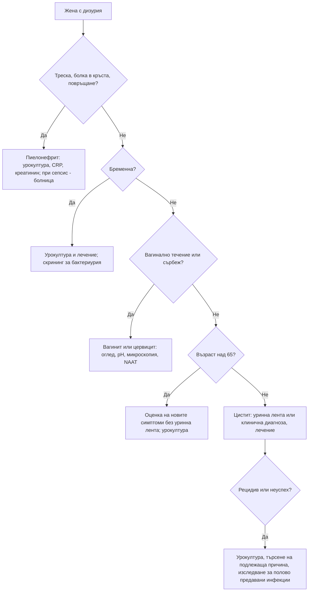

# Глава 27. Дизурия и симптоми от долните пикочни пътища

> **Част VI. Бъбреци, пикочни пътища и вътрешна среда**

## Цели на главата

- Да се разграничава инфекцията на пикочните пътища от уретрита, вагинита и неинфекциозните причини за дизурия.
- Да се използват правилно тестът с уринна лента и урокултурата и да не се лекува безсимптомната бактериурия.
- Да се класифицират симптомите от долните пикочни пътища на симптоми на задържане, на изпразване и след уриниране.
- Да се разпознават видовете уринарна инконтиненция и причините за задръжка на урина.
- Да се разпознават червените флагове: карцином на пикочния мехур, синдром на конската опашка, уросепсис.

---

## А. ДИЗУРИЯ

## 1. Определение и причини

**Дизурията** е болка, парене или дискомфорт при уриниране.

| Група | Причини |
|---|---|
| **Инфекции на пикочните пътища** | Цистит, пиелонефрит, простатит (остър бактериален, хроничен), епидидимоорхит |
| **Уретрит (полово предавани инфекции)** | *Chlamydia trachomatis*, *Neisseria gonorrhoeae*, *Mycoplasma genitalium*, *Trichomonas vaginalis*, херпес симплекс |
| **Вулвовагинални** | Кандидоза, трихомониаза, **атрофичен вагинит** (след менопаузата), генитален херпес, контактен дерматит, лихен склерозус (дизурията е „външна“ — парене при контакт на урината с възпалената кожа) |
| **Неинфекциозни заболявания на пикочния мехур** | **Интерстициален цистит (синдром на болезнения пикочен мехур)**, **карцином на пикочния мехур** (особено карцином *in situ*), камъни, лъчев цистит, **медикаментозен цистит** (циклофосфамид, **кетамин**) |
| **Уретра и простата** | Стриктура на уретрата, синдром на хроничната тазова болка, травма, чуждо тяло |
| **Системни** | Реактивен артрит (уретрит, конюнктивит, артрит), болест на Behçet, синдром на Stevens-Johnson |
| **Други** | Дразнители (сапуни, спермициди), **туберкулоза на пикочните пътища**, при деца — острици и сексуално насилие |

### 1.1. Стерилна пиурия

Левкоцити в урината при отрицателна обикновена урокултура:

- скорошен прием на антибиотик;
- уретрит (*Chlamydia*, *Gonorrhoeae*);
- **туберкулоза на пикочните пътища**;
- интерстициален нефрит;
- камъни, тумори;
- простатит;
- контаминация на пробата;
- възпаление в съседство с мехура (апендицит, дивертикулит);
- болест на Kawasaki при деца.

## 2. Безопасна диагностична стратегия

| Въпрос | Отговор |
|---|---|
| **Вероятна диагноза** | Неусложнен цистит при жени, уретрит, вагинит, атрофичен вагинит |
| **Сериозни заболявания, които не бива да се пропускат** | **Пиелонефрит и уросепсис**; **остър простатит**; обструкция с инфекция; **карцином на пикочния мехур**; туберкулоза; полово предавани инфекции с усложнения (възпалителна болест на малкия таз, епидидимит) |
| **Чести капани** | Уретрит при млади мъже, приет за „цистит“; вагинит; атрофичен вагинит; интерстициален цистит, лекуван с повтарящи се антибиотици; карцином *in situ* на пикочния мехур при пушач; апендицит или дивертикулит в съседство с мехура; кетаминов цистит |
| **Маскиращи заболявания** | Захарен диабет (глюкозурия, инфекции), лекарства, гръбначна дисфункция |
| **Психосоциални аспекти** | Сексуално насилие, сексуална дисфункция, тревожност |

## 3. Диагноза на инфекцията на пикочните пътища

### 3.1. Жени под 65 години

- **Дизурия и учестено уриниране без вагинално течение** означават много висока вероятност за цистит.
- Вагиналното течение или сърбеж намалява вероятността и насочва към вагинит или уретрит.
- **Тест с уринна лента:**
  - **нитрити** — висока специфичност;
  - **левкоцитна естераза** — по-висока чувствителност;
  - отрицателната лента при типични симптоми **не изключва** инфекция.
- **Урокултура** е показана при:
  - бременност;
  - мъже;
  - деца;
  - рецидивираща инфекция, неуспех на лечението;
  - пиелонефрит;
  - уретрален катетър;
  - имуносупресия, нетипична картина.

### 3.2. Възрастни хора над 65 години

- **Тестът с уринна лента не се препоръчва.** Безсимптомната бактериурия е честа: при 20–50% от възрастните жени и при почти всички пациенти с постоянен катетър.
- Диагнозата се основава на **нови симптоми**: дизурия или поне два от следните — треска, ново учестено уриниране или инконтиненция, надпубисна болка, видима хематурия, болка в костовертебралния ъгъл, тръпки.
- **Безсимптомната бактериурия не се лекува**, освен при бременност и преди урологични интервенции.
- Промяната в поведението или объркването **сами по себе си** не са достатъчни за диагноза инфекция на пикочните пътища. Трябва да се търсят и другите причини за делир (вж. глава 43).

### 3.3. Мъже

- Всяка инфекция на пикочните пътища при мъж се смята за **усложнена**.
- Необходими са урокултура, преглед за простатит (ректално туше внимателно, без масаж при остър простатит) и изследване за полово предавани инфекции при сексуално активни мъже.
- След фебрилна инфекция или рецидив се търсят подлежащи аномалии: остатъчна урина, обструкция, камъни.

### 3.4. Пиелонефрит

- Треска, тръпки, болка в кръста, **болезненост в костовертебралния ъгъл**, гадене, повръщане, със или без симптоми на цистит.
- Урокултура е задължителна, а при тежко протичане и хемокултури.
- Ехография е показана при мъже, при тежко протичане, при съмнение за обструкция или камъни и при липса на подобрение за 48–72 часа.

---

## Б. СИМПТОМИ ОТ ДОЛНИТЕ ПИКОЧНИ ПЪТИЩА

## 4. Класификация

| Група | Симптоми |
|---|---|
| **Симптоми на задържане** | Учестено уриниране, **императивни позиви**, **никтурия**, инконтиненция при позив |
| **Симптоми на изпразване** | Колебание в началото, слаба струя, прекъсната струя, напъване, терминално прокапване |
| **Симптоми след уриниране** | Усещане за непълно изпразване, прокапване след уриниране |

Тежестта при мъжете се оценява с **Международния точков сбор за простатни симптоми (IPSS)**. Незаменим инструмент е **дневникът на уринирането** за 3 дни (време и обем на всяко уриниране, прием на течности).

## 5. Причини при мъже

| Причина | Насочващи белези |
|---|---|
| **Доброкачествена хиперплазия на простатата** | Най-честата; постепенно прогресиращи симптоми на изпразване и задържане, гладка увеличена простата |
| **Карцином на простатата** | Често безсимптомен в ранния стадий; **твърда, неравна простата** при ректално туше, повишен ПСА; болки в костите при метастази |
| **Стриктура на уретрата** | По-млади мъже; прекарана полово предавана инфекция, катетеризация, травма; тънка, слаба струя |
| **Хиперактивен пикочен мехур** | Императивни позиви и учестено уриниране без обструкция |
| **Неврогенен пикочен мехур** | Болест на Parkinson, множествена склероза, увреждане на гръбначния мозък, диабетна невропатия |
| **Инфекции** | Простатит, цистит |
| **Карцином на пикочния мехур** | **Симптоми на дразнене** (учестено уриниране, императивни позиви, дизурия) и микроскопска хематурия при **пушач** |
| **Полиурия** (вж. т. 6) | Голям обем при всяко уриниране |
| **Лекарства** | Антихолинергични, антихистамини, деконгестанти, трициклични антидепресанти, опиоиди (задръжка); диуретици (учестено уриниране) |

## 6. Никтурия

| Механизъм | Причини |
|---|---|
| **Нощна полиурия** (над 33% от денонощния обем се отделя нощем при възрастни хора) | Сърдечна недостатъчност и мобилизиране на отоците в легнало положение, хронично бъбречно заболяване, **обструктивна сънна апнея**, приемане на течности, кофеин и алкохол вечер, вечерен прием на диуретик |
| **Глобална полиурия** (над 40 ml/kg за 24 часа) | **Захарен диабет**, безвкусен диабет, хиперкалциемия, първична полидипсия, литий |
| **Намален капацитет на мехура** | Хиперактивен мехур, доброкачествена хиперплазия на простатата, цистит, тумор или камък в мехура |
| **Нарушения на съня** | Безсъние (пациентът се събужда и затова уринира) |

## 7. Уринарна инконтиненция

| Тип | Механизъм | Типични причини |
|---|---|---|
| **Стрес инконтиненция** | Изтичане при кашлица, кихане, смях, повдигане | Слабост на тазовото дъно (раждания, менопауза), след простатектомия |
| **Инконтиненция при позив** | Внезапен силен позив и изтичане | Хиперактивен мехур; **цистит, камък, тумор**, неврологични заболявания |
| **Смесена** | Съчетание на двата вида | Чести при жени |
| **Инконтиненция от препълване** | Постоянно прокапване, палпируем мехур, голям остатък | **Хронична задръжка** (доброкачествена хиперплазия на простатата, диабетна невропатия, лекарства, увреждане на гръбначния мозък) |
| **Функционална** | Нормален мехур, но пациентът не може да стигне до тоалетната навреме | Нарушена подвижност, деменция |
| **Постоянна** | Непрекъснато изтичане | **Фистула** (след операция, лъчетерапия, продължително раждане), ектопичен уретер |

**Преходни (обратими) причини** се запомнят с мнемониката **DIAPPERS**:

- **D** — делир;
- **I** — инфекция на пикочните пътища;
- **A** — атрофичен вагинит и уретрит;
- **P** — лекарства (*pharmaceuticals*);
- **P** — психични причини (депресия);
- **E** — прекомерно отделяне на урина (*excess urine output*) — хипергликемия, хиперкалциемия, диуретици, сърдечна недостатъчност;
- **R** — ограничена подвижност (*restricted mobility*);
- **S** — фекалом (*stool impaction*).

## 8. Задръжка на урина

- **Остра задръжка** — болезнена невъзможност за уриниране, палпируем болезнен мехур. Причини:
  - доброкачествена хиперплазия на простатата (най-честата при мъже);
  - **лекарства** (антихолинергични, опиоиди, деконгестанти, антихистамини, трициклични антидепресанти, анестезия);
  - запек, инфекция, простатит;
  - съсиреци при хематурия;
  - стриктура;
  - **неврологични причини** — **синдром на конската опашка** (често неболезнена задръжка), компресия на гръбначния мозък, множествена склероза;
  - следоперативна задръжка;
  - при жени — тазови формации, пролапс, неврологични причини.
- **Хронична задръжка** — често неболезнена. Проявява се с инконтиненция от препълване, хидронефроза и хронично бъбречно заболяване.

---

## 9. Червени флагове

- **Видима хематурия.**
- Треска, тръпки, болка в кръста (пиелонефрит, уросепсис).
- **Задръжка на урина с изтръпване в седалищната област, слабост в краката или нарушена дефекация** (синдром на конската опашка).
- Рецидивиращи инфекции при мъже.
- Инфекция при бременност или при деца.
- Загуба на тегло и болки в костите със симптоми от долните пикочни пътища (метастатичен карцином на простатата).
- Твърда, неравна простата или повишаващ се ПСА.
- Симптоми на дразнене на мехура със стерилна урокултура при пушач (карцином *in situ*).
- **Пневматурия** (газ в урината) или **фекалурия** (везикоколична фистула при дивертикулит, болест на Crohn или карцином).
- Стерилна пиурия (туберкулоза).

---

## 10. Диференциално-диагностична таблица

| Заболяване | Ключови белези | Изследване |
|---|---|---|
| Неусложнен цистит | Дизурия, учестено уриниране, императивни позиви, надпубисна болка, без треска | Уринна лента (или клинична диагноза) |
| Пиелонефрит | Треска, болка в кръста, болезненост в костовертебралния ъгъл | Урокултура, ПКК, CRP, креатинин, ехография при показания |
| Уретрит | Дизурия, секреция от уретрата, нов партньор | NAAT за хламидия, гонорея, *M. genitalium* |
| Вагинит | Вагинално течение, сърбеж, „външна“ дизурия | Оглед, pH, микроскопия, NAAT |
| Атрофичен вагинит | Постменопауза, сухота, диспареуния | Оглед |
| Остър простатит | Треска, перинеална болка, болезнена, оточна простата, задръжка | Урокултура, хемокултури; **без масаж на простатата** |
| Интерстициален цистит | Болка при пълен мехур, облекчаване след уриниране, стерилни култури | Диагноза след изключване, цистоскопия |
| Карцином на пикочния мехур | Пушач, хематурия, симптоми на дразнене | Цитология на урината, **цистоскопия**, КТ урография |
| Туберкулоза на пикочните пътища | Стерилна пиурия, хематурия, хронични симптоми | Култура за микобактерии от три сутрешни урини |

---

## 11. Диагностичен алгоритъм при дизурия при жени

---

## 12. Клинични перли

- Млад мъж с „цистит“ най-вероятно има уретрит. Изследвайте за хламидия и гонорея.
- Не изследвайте урината с лента при възрастни хора без специфични симптоми. Положителният резултат обикновено отразява безсимптомна бактериурия.
- Объркването при възрастен човек не се обяснява автоматично с „уроинфекция“.
- Повтарящият се „цистит“ със стерилни култури при пушач изисква цитология и цистоскопия.
- Неболезнената задръжка на урина с болка в кръста е синдром на конската опашка, докато не се докаже противното.
- Преди да предпишете антихолинергично средство при хиперактивен мехур, измерете остатъчната урина и оценете когнитивния статус на възрастния пациент.
- Газ в урината означава фистула.

---

## 13. Клиничен случай

**Случай.** Мъж на 67 години, пушач с 45 пакетогодини, е лекуван 4 пъти за 6 месеца за „цистит“ с дизурия, учестено уриниране и императивни позиви. Урокултурите са стерилни. Уринната лента показва еритроцити 1+. Микроскопското изследване потвърждава 8–10 еритроцита в зрително поле. Простатата е леко увеличена, гладка.

**Въпроси.** 1) Кое не пасва на диагнозата „рецидивиращ цистит“? 2) Какво е следващото изследване?

**Обсъждане.** Цистит при мъж е необичаен. Повтарящите се симптоми на дразнене на мехура със **стерилни култури** и микроскопска хематурия при тежък пушач са силно подозрителни за **карцином на пикочния мехур**, особено за **карцином *in situ***, който протича със симптоми на дразнене. Необходими са цитология на урината, **цистоскопия** и КТ урография. Цистоскопията показва еритематозни кадифени зони, а биопсията потвърждава уротелен карцином *in situ*.

**Поука.** Стерилните „циститни“ оплаквания при пушач не са инфекция, докато не се изключи тумор.
