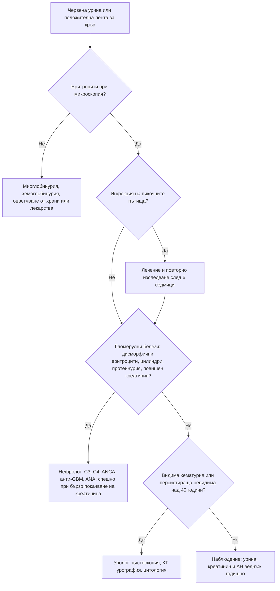

# Глава 28. Хематурия и протеинурия

> **Част VI. Бъбреци, пикочни пътища и вътрешна среда**

## Цели на главата

- Да се потвърждава хематурията и да се разграничава от оцветяването на урината от други причини.
- Да се разграничава гломерулната от негломерулната (урологичната) хематурия.
- Да се познават показанията за урологично изследване при видима и невидима хематурия.
- Да се оценява количествено протеинурията и да се класифицира.
- Да се разграничават нефритният и нефрозният синдром.

---

## А. ХЕМАТУРИЯ

## 1. Определения

- **Видима (макроскопска) хематурия** — урина с червен, розов или кафяв цвят поради кръв.
- **Невидима (микроскопска) хематурия** — ≥ 3 еритроцита в зрително поле при микроскопско изследване или ≥ 1+ на уринна лента, потвърдено при повторно изследване.
- **Персистираща невидима хематурия** — положителен резултат при 2 от 3 изследвания.

**Преходна хематурия** се наблюдава при инфекция на пикочните пътища, интензивно физическо натоварване, менструация, полов акт и травма. Изследването се повтаря след отстраняване на причината.

### 1.1. Червена урина без хематурия

| Причина | Уринна лента за кръв | Еритроцити при микроскопия |
|---|---|---|
| **Миоглобинурия** (рабдомиолиза) | **Положителна** | **Няма** |
| **Хемоглобинурия** (интраваскуларна хемолиза) | **Положителна** | **Няма** |
| Червено цвекло, хранителни оцветители, къпини | Отрицателна | Няма |
| Лекарства: рифампицин, феназопиридин (оранжево), нитрофурантоин, метронидазол, леводопа (тъмна урина), сена | Отрицателна | Няма |
| Порфирия (урината потъмнява при престояване) | Отрицателна | Няма |
| Уратни кристали при кърмачета (розово оцветяване на пелената) | Отрицателна | Няма |

**Положителна уринна лента за кръв без еритроцити при микроскопия** насочва към миоглобинурия или хемоглобинурия.

## 2. Гломерулна и негломерулна хематурия

| Белег | Гломерулна | Негломерулна (урологична) |
|---|---|---|
| Цвят | Кафяв, „като кока-кола“ | Ярко червен |
| Съсиреци | Няма | Може да има |
| Морфология на еритроцитите | **Дисморфични** (акантоцити) | Нормални |
| **Еритроцитни цилиндри** | Да (патогномонични) | Няма |
| Протеинурия | Често значима | Незначителна |
| Хипертония, повишен креатинин, отоци | Често | Рядко |

## 3. Причини по локализация

| Локализация | Причини |
|---|---|
| **Гломерули** | **IgA нефропатия** (видима хематурия 1–2 дни след инфекция на горните дихателни пътища), болест на тънките базални мембрани, синдром на Alport (загуба на слуха, фамилна анамнеза), **постстрептококов гломерулонефрит** (1–3 седмици след фарингит или кожна инфекция, нисък C3), лупусен нефрит, ANCA-свързан васкулит, анти-GBM болест, IgA васкулит (пурпура на Henoch-Schönlein) |
| **Бъбрек (негломерулни)** | **Бъбречноклетъчен карцином**, поликистоза, камъни, пиелонефрит, бъбречен инфаркт, папиларна некроза (аналгетици, диабет, сърповидноклетъчна болест), туберкулоза, съдови малформации, травма, тромбоза на бъбречната вена, синдром на „лешникотрошачката“ (компресия на лявата бъбречна вена — болка вляво и хематурия) |
| **Уретери** | Камъни, **уротелен карцином на горните пикочни пътища** (свързан с **балканската ендемична нефропатия** в България и с аристолохиевата киселина), стриктура |
| **Пикочен мехур** | Цистит, **карцином на пикочния мехур** (тютюнопушене, ароматни амини в бояджийството и гумената промишленост, циклофосфамид, шистозомиаза при пътували до Африка), камъни, лъчев цистит, катетър |
| **Простата и уретра** | Доброкачествена хиперплазия на простатата (васкуларизирана простата), карцином на простатата, простатит, уретрит, травма |
| **Системни** | Антикоагуланти и нарушения на хемостазата (**не обясняват хематурията сами по себе си** — изследването е необходимо), сърповидноклетъчна болест или носителство, ендометриоза на пикочния мехур (циклична хематурия) |

## 4. Безопасна диагностична стратегия

| Въпрос | Отговор |
|---|---|
| **Вероятна диагноза** | Инфекция на пикочните пътища, камъни, доброкачествена хиперплазия на простатата, преходни причини |
| **Сериозни заболявания, които не бива да се пропускат** | **Карцином на пикочния мехур**, **бъбречноклетъчен карцином**, уротелен карцином на горните пикочни пътища, карцином на простатата, **бързо прогресиращ гломерулонефрит**, туберкулоза |
| **Чести капани** | Хематурия при антикоагулантна терапия, приписана само на лекарството; миоглобинурия; хематурия, изчезнала след лечение на инфекция, но появила се отново; IgA нефропатия при млади хора |
| **Маскиращи заболявания** | Лекарства, инфекции, туберкулоза |
| **Психосоциални аспекти** | Симулирана хематурия (рядко) |

## 5. Показания за насочване

**Британските препоръки (NICE NG12)** предвиждат бързо насочване при подозрение за карцином на пикочния мехур или бъбрека при:

- **възраст ≥ 45 години** с необяснима видима хематурия без инфекция на пикочните пътища или с видима хематурия, която персистира или рецидивира след успешно лечение на инфекцията;
- **възраст ≥ 60 години** с необяснима невидима хематурия, съчетана с дизурия или с левкоцитоза в кръвта.

По европейските урологични препоръки **всяка видима хематурия**, независимо от възрастта, изисква урологично изследване: **цистоскопия и КТ урография**. Персистиращата невидима хематурия при възраст над 40 години също се насочва към уролог. При признаци на гломерулно заболяване пациентът се насочва към **нефролог**.

## 6. Изследвания при хематурия

- Урина: микроскопия (морфология на еритроцитите, цилиндри), урокултура, **съотношение албумин/креатинин или белтък/креатинин**.
- Креатинин, eGFR, АН.
- ПКК, коагулационни показатели.
- **Цитология на урината** (особено при пушачи).
- **Цистоскопия.**
- **КТ урография** (при видима хематурия) или ехография (при по-ниска вероятност за тумор).
- ПСА (при мъже, след информиране).
- При гломерулна хематурия: C3, C4, ANA, ANCA, анти-GBM, серология за хепатит B и C и HIV, антистрептолизин O, насочване към нефролог.

---

## Б. ПРОТЕИНУРИЯ

## 7. Определения и количествено измерване

- Нормалната екскреция на белтък е под 150 mg/24 h, а на албумин под 30 mg/24 h.
- **Съотношение албумин/креатинин** (в единична, за предпочитане първа сутрешна урина) — метод на избор за скрининг и проследяване.

| Категория (KDIGO) | Съотношение албумин/креатинин | Значение |
|---|---|---|
| A1 | < 3 mg/mmol (< 30 mg/g) | Нормална или леко повишена |
| A2 | 3–30 mg/mmol (30–300 mg/g) | Умерено повишена (микроалбуминурия) |
| A3 | > 30 mg/mmol (> 300 mg/g) | Силно повишена |

- **Протеинурия от нефрозен порядък:** > 3,5 g/24 h (съотношение белтък/креатинин над 300–350 mg/mmol).
- Диагнозата изисква **потвърждаване** при повторни изследвания в продължение на 3 месеца.

**Уринната лента открива главно албумин.** Леките вериги (белтъкът на Bence Jones) при мултиплен миелом **не се откриват** с лентата. Голямата разлика между белтък/креатинин и албумин/креатинин насочва към негломерулна протеинурия.

## 8. Видове протеинурия

| Вид | Механизъм | Причини |
|---|---|---|
| **Преходна (функционална)** | Хемодинамична | Треска, усилие, сърдечна недостатъчност, инфекция, тежка хипертония, гърчове |
| **Ортостатична** | Появява се само в изправено положение | Юноши и млади хора; < 1 g/24 h; първата сутрешна урина е нормална; добра прогноза |
| **Гломерулна** (преобладава албуминът) | Увреждане на гломерулния филтър | **Диабетна нефропатия** (най-честата), хипертонична нефросклероза, първични гломерулонефрити, вторични (лупус, амилоидоза, хепатит B и C, HIV, лекарства — НСПВС, литий, памидронат), прееклампсия |
| **Тубулна** | Нарушена реабсорбция на нискомолекулни белтъци | Синдром на Fanconi, тубулоинтерстициални нефрити, тежки метали, **балканска ендемична нефропатия** |
| **От препълване** | Прекомерна продукция на нискомолекулни белтъци | **Мултиплен миелом** (леки вериги), миоглобинурия, хемоглобинурия |
| **Постренална** | Възпаление в пикочните пътища | Инфекции, тумори |

## 9. Нефритен и нефрозен синдром

| Белег | Нефритен синдром | Нефрозен синдром |
|---|---|---|
| Основна находка | Хематурия с еритроцитни цилиндри | Протеинурия > 3,5 g/24 h |
| Протеинурия | Умерена (< 3,5 g/24 h) | Масивна |
| Отоци | Умерени | **Изразени** (включително периорбитални) |
| Хипертония | **Честа** | По-рядка |
| Креатинин | Често повишен, понякога бързо | Често нормален в началото |
| Албумин в серума | Нормален или леко понижен | **Силно понижен** |
| Липиди | Нормални | **Повишени** |
| Причини | IgA нефропатия, постинфекциозен гломерулонефрит, лупусен нефрит, ANCA васкулит, анти-GBM болест | Възрастни: мембранозна нефропатия, фокално-сегментна гломерулосклероза, диабетна нефропатия, амилоидоза, болест на минималните промени (включително от НСПВС). Деца: болест на минималните промени |
| Усложнения | Бързо прогресираща бъбречна недостатъчност, белодробен оток | **Тромбози**, инфекции, хиперлипидемия, остро бъбречно увреждане |

## 10. Изследвания при протеинурия

- Повторно съотношение албумин/креатинин и белтък/креатинин, микроскопия на урината, eGFR, АН.
- Глюкоза, HbA1c, липиди, албумин.
- **Електрофореза на серумните белтъци, имунофиксация и свободни леки вериги** при възраст над 40–50 години или при несъответствие между белтък и албумин.
- ANA, анти-dsDNA, C3, C4, ANCA, анти-GBM, **антитела срещу PLA2R** (мембранозна нефропатия), серология за хепатит B и C и HIV.
- Ехография на бъбреците.
- Бъбречна биопсия (решение на нефролога).

---

## 11. Диагностичен алгоритъм при хематурия

---

## 12. Клинични перли

- Положителна лента за кръв без еритроцити в седимента насочва към рабдомиолиза или хемолиза.
- Хематурията при антикоагулантна терапия трябва да се изследва. Антикоагулантът често „разкрива“ подлежащ тумор.
- Хематурия 1–2 дни след ангина: IgA нефропатия. Хематурия 1–3 седмици след ангина: постстрептококов гломерулонефрит.
- Хематурия с бързо покачване на креатинина и хемоптиза: белодробно-бъбречен синдром. Това е спешно състояние.
- Уринната лента не открива леките вериги при миелома.
- Ортостатичната протеинурия при юноши е доброкачествена. Първата сутрешна урина е нормална.
- В ендемичните райони на Северозападна България анамнезата за балканска ендемична нефропатия е важна при хематурия. Тя е свързана с повишен риск от уротелен карцином на горните пикочни пътища.

---

## 13. Клиничен случай

**Случай.** Мъж на 22 години забелязва урина „с цвят на кока-кола“ един ден след началото на ангина. Подобен епизод е имал и преди година, отново по време на инфекция на горните дихателни пътища. АН 138/88 mmHg. Урина: еритроцити 3+, белтък 1+, дисморфични еритроцити и единични еритроцитни цилиндри. Креатинин 96 µmol/l, съотношение албумин/креатинин 45 mg/mmol, C3 и C4 нормални.

**Въпроси.** 1) Гломерулна или урологична е хематурията? 2) Как се разграничават IgA нефропатията и постстрептококовият гломерулонефрит?

**Обсъждане.** Кафявият цвят, дисморфичните еритроцити, цилиндрите и протеинурията показват **гломерулна** хематурия. Видимата хематурия, която се появява **едновременно** с инфекцията или 1–2 дни след нея („синфарингитна“), и рецидивиращият ход са типични за **IgA нефропатия**. При постстрептококовия гломерулонефрит латентният период е 1–3 седмици, а C3 е понижен и се нормализира за 6–8 седмици. Пациентът е насочен към нефролог. Бъбречната биопсия потвърждава IgA нефропатия. Прогнозата зависи от протеинурията, налягането и бъбречната функция, затова проследяването им е задължително.

**Поука.** Интервалът между инфекцията и хематурията е прост, но много ценен диагностичен белег.

<!-- навигация -->

---

[← Глава 27. Дизурия и симптоми от долните пикочни пътища](27-dizuria.md) · [Съдържание](../README.md) · [Глава 29. Остро и хронично бъбречно увреждане →](29-babrechno-uvrezhdane.md)
