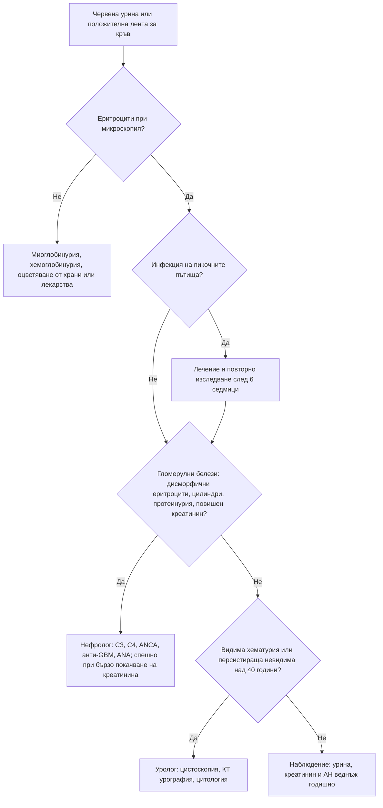

# Глава 28. Хематурия и протеинурия

> **Част VI. Бъбреци, пикочни пътища и вътрешна среда**

## Цели на главата

- Да се потвърждава хематурията и да се разграничава от оцветяването на урината от други причини.
- Да се разграничава гломерулната от негломерулната (урологичната) хематурия.
- Да се изброяват показанията за урологично изследване при видима и невидима хематурия.
- Да се оценява количествено протеинурията и да се класифицира.
- Да се разграничават нефритният и нефрозният синдром.

## Ключови моменти

- Преди да се търси причина, хематурията се потвърждава с микроскопия. Положителна лента без еритроцити насочва към миоглобинурия или хемоглобинурия *(SORT C [1])*.
- Дисморфичните еритроцити, еритроцитните цилиндри, протеинурията, хипертонията и повишеният креатинин насочват към гломерулна хематурия и към нефролог.
- Необяснимата видима хематурия при възраст 45 и повече години налага бързо насочване по пътеката за подозрение за карцином. По европейските урологични препоръки всяка видима хематурия се изследва с цистоскопия и КТ урография *(SORT C [4])*.
- Антикоагулантите не обясняват хематурията сами по себе си — изследването е необходимо.
- Протеинурията се измерва със съотношение албумин/креатинин и се класифицира по KDIGO в категории A1–A3. Уринната лента не открива леките вериги при миелома *(SORT B [6])*.
- Хематурия 1–2 дни след ангина насочва към IgA нефропатия, а 1–3 седмици след ангина с нисък C3 — към постстрептококов гломерулонефрит [2].

---

## А. Хематурия

### 1. Определения

- **Видима (макроскопска) хематурия** — урина с червен, розов или кафяв цвят поради кръв.
- **Невидима (микроскопска) хематурия** — ≥ 3 еритроцита в зрително поле при микроскопско изследване или ≥ 1+ на уринна лента, потвърдено при повторно изследване. По американските урологични препоръки положителната лента трябва да се потвърди с микроскопия [1].
- **Персистираща невидима хематурия** — положителен резултат при 2 от 3 изследвания.

**Преходна хематурия** се наблюдава при инфекция на пикочните пътища, интензивно физическо натоварване, менструация, полов акт и травма. Изследването се повтаря след отстраняване на причината.

#### 1.1. Червена урина без хематурия

*Таблица 28.1. Червена урина без хематурия.*

| Причина | Уринна лента за кръв | Еритроцити при микроскопия |
|---|---|---|
| **Миоглобинурия** (рабдомиолиза) | **Положителна** | **Няма** |
| **Хемоглобинурия** (интраваскуларна хемолиза) | **Положителна** | **Няма** |
| Червено цвекло, хранителни оцветители, къпини | Отрицателна | Няма |
| Лекарства: рифампицин, феназопиридин (оранжево), нитрофурантоин, метронидазол, леводопа (тъмна урина), сена | Отрицателна | Няма |
| Порфирия (урината потъмнява при престояване) | Отрицателна | Няма |
| Уратни кристали при кърмачета (розово оцветяване на пелената) | Отрицателна | Няма |

**Положителна уринна лента за кръв без еритроцити при микроскопия** насочва към миоглобинурия или хемоглобинурия.

### 2. Гломерулна и негломерулна хематурия

*Таблица 28.2. Гломерулна и негломерулна хематурия.*

| Белег | Гломерулна | Негломерулна (урологична) |
|---|---|---|
| Цвят | Кафяв, „като кока-кола“ | Ярко червен |
| Съсиреци | Няма | Може да има |
| Морфология на еритроцитите | **Дисморфични** (акантоцити) | Нормални |
| **Еритроцитни цилиндри** | Да (патогномонични) | Няма |
| Протеинурия | Често значима | Незначителна |
| Хипертония, повишен креатинин, отоци | Често | Рядко |

### 3. Причини по локализация

*Таблица 28.3. Хематурия: причини по локализация.*

| Локализация | Причини |
|---|---|
| **Гломерули** | **IgA нефропатия** (видима хематурия 1–2 дни след инфекция на горните дихателни пътища) [2], болест на тънките базални мембрани, синдром на Alport (загуба на слуха, фамилна анамнеза), **постстрептококов гломерулонефрит** (1–3 седмици след фарингит или кожна инфекция, нисък C3), лупусен нефрит, ANCA-свързан васкулит, анти-GBM болест, IgA васкулит (пурпура на Henoch-Schönlein) |
| **Бъбрек (негломерулни)** | **Бъбречноклетъчен карцином**, поликистоза, камъни, пиелонефрит, бъбречен инфаркт, папиларна некроза (аналгетици, диабет, сърповидноклетъчна болест), туберкулоза, съдови малформации, травма, тромбоза на бъбречната вена, синдром на „лешникотрошачката“ (компресия на лявата бъбречна вена — болка вляво и хематурия) |
| **Уретери** | Камъни, **уротелен карцином на горните пикочни пътища** (свързан с **балканската ендемична нефропатия** в България и с аристолохиевата киселина [3]), стриктура |
| **Пикочен мехур** | Цистит, **карцином на пикочния мехур** (тютюнопушене, ароматни амини в бояджийството и гумената промишленост, циклофосфамид, шистозомиаза при пътували до Африка), камъни, лъчев цистит, катетър |
| **Простата и уретра** | Доброкачествена хиперплазия на простатата (васкуларизирана простата), карцином на простатата, простатит, уретрит, травма |
| **Системни** | Антикоагуланти и нарушения на хемостазата (**не обясняват хематурията сами по себе си** — изследването е необходимо), сърповидноклетъчна болест или носителство, ендометриоза на пикочния мехур (циклична хематурия) |

### 4. Безопасна диагностична стратегия

*Таблица 28.4. Хематурия: безопасна диагностична стратегия.*

| Въпрос | Отговор |
|---|---|
| **Вероятна диагноза** | Инфекция на пикочните пътища, камъни, доброкачествена хиперплазия на простатата, преходни причини |
| **Сериозни заболявания, които не бива да се пропускат** | **Карцином на пикочния мехур**, **бъбречноклетъчен карцином**, уротелен карцином на горните пикочни пътища, карцином на простатата, **бързо прогресиращ гломерулонефрит**, туберкулоза |
| **Чести капани** | Хематурия при антикоагулантна терапия, приписана само на лекарството; миоглобинурия; хематурия, изчезнала след лечение на инфекция, но появила се отново; IgA нефропатия при млади хора |
| **Маскиращи заболявания** | Лекарства, инфекции, туберкулоза |
| **Психосоциални аспекти** | Симулирана хематурия (рядко) |

### 5. Червени флагове

- Видима хематурия (особено при пушач или при възраст 45 и повече години).
- Хематурия с бързо покачване на креатинина, хипертония или отоци (бързо прогресиращ гломерулонефрит).
- Хематурия с хемоптиза (белодробно-бъбречен синдром).
- Протеинурия от нефрозен порядък с отоци и хипоалбуминемия.
- Протеинурия с анемия, хиперкалциемия или болки в костите (мултиплен миелом).
- Хематурия при човек от ендемичен район за балканска ендемична нефропатия.

---

### 6. Показания за насочване

**Британските препоръки (NICE NG12)** предвиждат бързо насочване при подозрение за карцином на пикочния мехур или бъбрека при [4]:

- **възраст ≥ 45 години** с необяснима видима хематурия без инфекция на пикочните пътища или с видима хематурия, която персистира или рецидивира след успешно лечение на инфекцията;
- **възраст ≥ 60 години** с необяснима невидима хематурия, съчетана с дизурия или с левкоцитоза в кръвта.

По европейските урологични препоръки **всяка видима хематурия**, независимо от възрастта, изисква урологично изследване: **цистоскопия и КТ урография**. Персистиращата невидима хематурия при възраст над 40 години също се насочва към уролог. Американските препоръки (обновени през 2025 г.) определят обема на изследването според риска: възраст, пол, тютюнопушене, степен и персистиране на хематурията [5]. При признаци на гломерулно заболяване пациентът се насочва към **нефролог**.

### 7. Изследвания при хематурия

- Урина: микроскопия (морфология на еритроцитите, цилиндри), урокултура, **съотношение албумин/креатинин или белтък/креатинин**.
- Креатинин, eGFR, АН.
- ПКК, коагулационни показатели.
- **Цитология на урината** (особено при пушачи).
- **Цистоскопия.**
- **КТ урография** (при видима хематурия) или ехография (при по-ниска вероятност за тумор).
- ПСА (при мъже, след информиране).
- При гломерулна хематурия: C3, C4, ANA, ANCA, анти-GBM, серология за хепатит B и C и HIV, антистрептолизин O, насочване към нефролог.

---

## Б. Протеинурия

### 8. Определения и количествено измерване

- Нормалната екскреция на белтък е под 150 mg/24 h, а на албумин под 30 mg/24 h.
- **Съотношение албумин/креатинин** (в единична, за предпочитане първа сутрешна урина) — метод на избор за скрининг и проследяване.

*Таблица 28.5. Определения и количествено измерване.*

| Категория (KDIGO) [6] | Съотношение албумин/креатинин | Значение |
|---|---|---|
| A1 | < 3 mg/mmol (< 30 mg/g) | Нормална или леко повишена |
| A2 | 3–30 mg/mmol (30–300 mg/g) | Умерено повишена (микроалбуминурия) |
| A3 | > 30 mg/mmol (> 300 mg/g) | Силно повишена |

- **Протеинурия от нефрозен порядък:** > 3,5 g/24 h (съотношение белтък/креатинин над 300–350 mg/mmol).
- Диагнозата изисква **потвърждаване** при повторни изследвания в продължение на 3 месеца.

**Уринната лента открива главно албумин.** Леките вериги (белтъкът на Bence Jones) при мултиплен миелом **не се откриват** с лентата. Голямата разлика между белтък/креатинин и албумин/креатинин насочва към негломерулна протеинурия.

### 9. Видове протеинурия

*Таблица 28.6. Протеинурия: видове протеинурия.*

| Вид | Механизъм | Причини |
|---|---|---|
| **Преходна (функционална)** | Хемодинамична | Треска, усилие, сърдечна недостатъчност, инфекция, тежка хипертония, гърчове |
| **Ортостатична** | Появява се само в изправено положение | Юноши и млади хора; < 1 g/24 h; първата сутрешна урина е нормална; добра прогноза |
| **Гломерулна** (преобладава албуминът) | Увреждане на гломерулния филтър | **Диабетна нефропатия** (най-честата), хипертонична нефросклероза, първични гломерулонефрити, вторични (лупус, амилоидоза, хепатит B и C, HIV, лекарства — НСПВС, литий, памидронат), прееклампсия |
| **Тубулна** | Нарушена реабсорбция на нискомолекулни белтъци | Синдром на Fanconi, тубулоинтерстициални нефрити, тежки метали, **балканска ендемична нефропатия** |
| **От препълване** | Прекомерна продукция на нискомолекулни белтъци | **Мултиплен миелом** (леки вериги), миоглобинурия, хемоглобинурия |
| **Постренална** | Възпаление в пикочните пътища | Инфекции, тумори |

### 10. Нефритен и нефрозен синдром

*Таблица 28.7. Нефритен и нефрозен синдром.*

| Белег | Нефритен синдром | Нефрозен синдром |
|---|---|---|
| Основна находка | Хематурия с еритроцитни цилиндри | Протеинурия > 3,5 g/24 h |
| Протеинурия | Умерена (< 3,5 g/24 h) | Масивна |
| Отоци | Умерени | **Изразени** (включително периорбитални) |
| Хипертония | **Честа** | По-рядка |
| Креатинин | Често повишен, понякога бързо | Често нормален в началото |
| Албумин в серума | Нормален или леко понижен | **Силно понижен** |
| Липиди | Нормални | **Повишени** |
| Причини | IgA нефропатия, постинфекциозен гломерулонефрит, лупусен нефрит, ANCA васкулит, анти-GBM болест | Възрастни: мембранозна нефропатия, фокално-сегментна гломерулосклероза, диабетна нефропатия, амилоидоза, болест на минималните промени (включително от НСПВС). Деца: болест на минималните промени |
| Усложнения | Бързо прогресираща бъбречна недостатъчност, белодробен оток | **Тромбози**, инфекции, хиперлипидемия, остро бъбречно увреждане |

### 11. Изследвания при протеинурия

- Повторно съотношение албумин/креатинин и белтък/креатинин, микроскопия на урината, eGFR, АН.
- Глюкоза, HbA1c, липиди, албумин.
- **Електрофореза на серумните белтъци, имунофиксация и свободни леки вериги** при възраст над 40–50 години или при несъответствие между белтък и албумин.
- ANA, анти-dsDNA, C3, C4, ANCA, анти-GBM, **антитела срещу PLA2R** (мембранозна нефропатия), серология за хепатит B и C и HIV.
- Ехография на бъбреците.
- Бъбречна биопсия (решение на нефролога).

---

## 12. Диагностичен алгоритъм при хематурия

*Фигура 28.1. Диагностичен алгоритъм при хематурия. Схема на авторите въз основа на източниците, цитирани в главата.*

Текстово описание на фигура 28.1

1. Червена урина или положителна лента за кръв. Следва: към т. 2.
2. **Въпрос:** Еритроцити при микроскопия? Не — към т. 3; Да — към т. 4.
3. Миоглобинурия, хемоглобинурия, оцветяване от храни или лекарства.
4. **Въпрос:** Инфекция на пикочните пътища? Да — към т. 5; Не — към т. 6.
5. Лечение и повторно изследване след 6 седмици. Следва: към т. 6.
6. **Въпрос:** Гломерулни белези: дисморфични еритроцити, цилиндри, протеинурия, повишен креатинин? Да — към т. 7; Не — към т. 8.
7. Нефролог: C3, C4, ANCA, анти-GBM, ANA; спешно при бързо покачване на креатинина.
8. **Въпрос:** Видима хематурия или персистираща невидима над 40 години? Да — към т. 9; Не — към т. 10.
9. Уролог: цистоскопия, КТ урография, цитология.
10. Наблюдение: урина, креатинин и АН веднъж годишно.

---

## 13. Клинични перли

- Положителна лента за кръв без еритроцити в седимента насочва към рабдомиолиза или хемолиза.
- Хематурията при антикоагулантна терапия трябва да се изследва. Антикоагулантът често „разкрива“ подлежащ тумор.
- Хематурия 1–2 дни след ангина: IgA нефропатия. Хематурия 1–3 седмици след ангина: постстрептококов гломерулонефрит.
- Хематурия с бързо покачване на креатинина и хемоптиза: белодробно-бъбречен синдром. Това е спешно състояние.
- Уринната лента не открива леките вериги при миелома.
- Ортостатичната протеинурия при юноши е доброкачествена. Първата сутрешна урина е нормална.
- В ендемичните райони на Северозападна България анамнезата за балканска ендемична нефропатия е важна при хематурия. Тя е свързана с повишен риск от уротелен карцином на горните пикочни пътища.

---

## 14. Клиничен случай

**Етап 1 — представяне.** Мъж на 22 години забелязва урина „с цвят на кока-кола“ един ден след началото на ангина. Подобен епизод е имал и преди година, отново по време на инфекция на горните дихателни пътища.

> **Въпрос 1.** Какво подсказва интервалът между инфекцията и хематурията?

**Етап 2 — изследвания.** АН 138/88 mmHg. Урината показва еритроцити 3+, белтък 1+, дисморфични еритроцити и единични еритроцитни цилиндри. Креатининът е 96 µmol/l, съотношението албумин/креатинин — 45 mg/mmol, а C3 и C4 са нормални.

> **Въпрос 2.** Гломерулна или урологична е хематурията?

> **Въпрос 3.** Как се разграничават IgA нефропатията и постстрептококовият гломерулонефрит?

Обсъждане и отговори

**Отговор 1.** Видимата хематурия едновременно с инфекцията или 1–2 дни след нея („синфарингитна“) и рецидивиращият ход са типични за **IgA нефропатия** [2].

**Отговор 2.** Кафявият цвят, дисморфичните еритроцити, цилиндрите и протеинурията показват **гломерулна** хематурия. Съотношение албумин/креатинин 45 mg/mmol е категория A3 [6].

**Отговор 3.** При постстрептококовия гломерулонефрит латентният период е 1–3 седмици, а C3 е понижен и се нормализира за 6–8 седмици. Пациентът е насочен към нефролог. Бъбречната биопсия потвърждава IgA нефропатия. Прогнозата зависи от протеинурията, налягането и бъбречната функция, затова проследяването им е задължително [2].

**Поука.** Интервалът между инфекцията и хематурията е прост, но много ценен диагностичен белег.

---

## Обобщение

- Хематурията се потвърждава с микроскопия и се разграничава от червената урина по други причини.
- Гломерулната хематурия (дисморфични еритроцити, цилиндри, протеинурия) се насочва към нефролог, а негломерулната — към уролог за цистоскопия и образно изследване.
- Протеинурията се измерва количествено и се класифицира по KDIGO. Видът ѝ (преходна, ортостатична, гломерулна, тубулна, от препълване) насочва към причината.
- Нефритният синдром протича с хематурия, хипертония и повишен креатинин, а нефрозният — с масивна протеинурия, отоци, хипоалбуминемия и хиперлипидемия.

## Самопроверка

### Въпроси с един верен отговор

**1.** *(основно ниво)* Уринната лента на мъж след маратон е положителна за кръв (3+), но при микроскопия няма еритроцити. Какво е най-вероятното обяснение?

- **А.** Карцином на пикочния мехур
- **Б.** Миоглобинурия
- **В.** IgA нефропатия
- **Г.** Камък в уретера
- **Д.** Контаминация с менструална кръв

Отговор и обосновка

**Верен отговор: Б.** Положителна лента за кръв без еритроцити в седимента насочва към миоглобинурия (рабдомиолиза) или хемоглобинурия. Изследват се креатинкиназа и креатинин. А, В и Г протичат с еритроцити в урината. Д е невъзможно при мъж.

**2.** *(основно ниво)* Мъж на 52 години на варфарин има видима хематурия без инфекция. Кое е правилното поведение?

- **А.** Приписване на хематурията на варфарина и корекция на дозата
- **Б.** Бързо насочване за цистоскопия и КТ урография
- **В.** Повторно изследване след година
- **Г.** Спиране на варфарина без други действия
- **Д.** Само урокултура

Отговор и обосновка

**Верен отговор: Б.** Антикоагулантите не обясняват хематурията сами по себе си и често „разкриват“ подлежащ тумор. Необяснимата видима хематурия при възраст 45 и повече години налага бързо насочване [4]. А, В, Г и Д пропускат карцином.

**3.** *(основно ниво)* Съотношението албумин/креатинин при пациент с диабет е 12 mg/mmol при три изследвания за 3 месеца. В коя категория е?

- **А.** A1
- **Б.** A2
- **В.** A3
- **Г.** Нефрозна протеинурия
- **Д.** Нормална стойност

Отговор и обосновка

**Верен отговор: Б.** Категория A2 обхваща 3–30 mg/mmol (умерено повишена албуминурия) [6]. A1 е под 3 mg/mmol, а A3 — над 30 mg/mmol.

**4.** *(напреднало ниво)* Юноша на 16 години има белтък 1+ на лентата при профилактичен преглед. Първата сутрешна урина е без белтък, а АН и креатининът са нормални. Кое е най-вероятното обяснение?

- **А.** Нефрозен синдром
- **Б.** Ортостатична протеинурия
- **В.** IgA нефропатия
- **Г.** Мултиплен миелом
- **Д.** Диабетна нефропатия

Отговор и обосновка

**Верен отговор: Б.** Протеинурия, която липсва в първата сутрешна урина, при юноша с нормално налягане и креатинин е ортостатична и има добра прогноза. А, В, Г и Д не отговарят на находките.

**5.** *(напреднало ниво)* Мъж на 66 години има анемия, болки в гърба и креатинин 180 µmol/l. Уринната лента е отрицателна за белтък, но съотношението белтък/креатинин е 150 mg/mmol, а албумин/креатинин — 5 mg/mmol. Кое е следващото изследване?

- **А.** Бъбречна биопсия веднага
- **Б.** Електрофореза на серумните белтъци, имунофиксация и свободни леки вериги
- **В.** Антитела срещу PLA2R
- **Г.** ANCA
- **Д.** Цистоскопия

Отговор и обосновка

**Верен отговор: Б.** Голямата разлика между белтък/креатинин и албумин/креатинин при отрицателна лента насочва към негломерулна протеинурия от леки вериги. Анемията, болките в гърба и бъбречното увреждане насочват към мултиплен миелом. В и Г са за гломерулни заболявания. Д не отговаря на хипотезата.

### Задача

При жена на 34 години уринната лента е положителна за кръв (1+) при профилактичен преглед. Няма симптоми. Как ще подходите?

Решение

Първо се изключват **преходните причини**: менструация, инфекция на пикочните пътища, интензивно усилие, полов акт. Изследването се **повтаря** след отстраняването им, а положителната лента се потвърждава с **микроскопия** [1]. Ако хематурията персистира (2 от 3 изследвания), се оценяват белезите на гломерулно заболяване: морфология на еритроцитите, цилиндри, съотношение албумин/креатинин, креатинин и АН. При гломерулни белези пациентката се насочва към нефролог. При липса на такива и нисък риск (млада жена, непушачка) обемът на урологичното изследване се определя според риска [5], а бъбречната функция, урината и налягането се проследяват.

### OSCE станция: Тълкуване на изследване на урината

**Време:** 6 минути. **Ниво:** основно (студенти, специализанти).

**Задача за кандидата.** Тълкувайте резултатите от изследването на урината на мъж на 58 години, пушач, и предложете поведение.

**Информация за симулирания пациент (за изпитващия).** Уринна лента: кръв 2+, белтък следи, нитрити и левкоцити отрицателни. Микроскопия: 15 еритроцита в зрително поле, нормална морфология, без цилиндри. Креатинин и АН — нормални. Не приема антикоагуланти. Няма симптоми.

*Таблица 28.8. OSCE станция: Тълкуване на изследване на урината — рубрика за оценяване.*

| Критерий | Точки |
|---|---|
| Потвърждава, че хематурията е истинска (еритроцити при микроскопия) | 1 |
| Изключва инфекция и преходни причини | 1 |
| Разграничава негломерулна от гломерулна хематурия по морфологията и липсата на цилиндри | 2 |
| Оценява съотношението албумин/креатинин и бъбречната функция | 1 |
| Разпознава рисковите фактори за карцином на пикочния мехур (възраст, тютюнопушене) | 2 |
| Решава за насочване към уролог за цистоскопия и образно изследване | 2 |
| Обяснява плана на пациента и съветва за спиране на тютюнопушенето | 1 |
| **Общо** | **10** |

**Праг за успешно представяне:** 7 от 10 точки, включително решението за урологично насочване.

## Литература

1. Barocas DA, Boorjian SA, Alvarez RD, Downs TM, Gross CP, Hamilton BD, et al. Microhematuria: AUA/SUFU Guideline. J Urol. 2020;204(4):778-786. doi:10.1097/JU.0000000000001297. PMID: 32698717.
2. Floege J, Barratt J, Cook HT, Noronha IL, Reich HN, Suzuki Y, et al. Executive summary of the KDIGO 2025 Clinical Practice Guideline for the Management of Immunoglobulin A Nephropathy (IgAN) and Immunoglobulin A Vasculitis (IgAV). Kidney Int. 2025;108(4):548-554. doi:10.1016/j.kint.2025.04.003. PMID: 40975525.
3. Jelaković B, Dika Ž, Arlt VM, Stiborova M, Pavlović NM, Nikolić J, et al. Balkan Endemic Nephropathy and the Causative Role of Aristolochic Acid. Semin Nephrol. 2019;39(3):284-296. doi:10.1016/j.semnephrol.2019.02.007. PMID: 31054628.
4. National Institute for Health and Care Excellence. Suspected cancer: recognition and referral (NICE guideline NG12). London: NICE; 2015 [актуализирано 2026]. Достъпно на: https://www.nice.org.uk/guidance/ng12
5. Barocas DA, Lotan Y, Matulewicz RS, Raman JD, Westerman ME, Kirkby E, et al. Updates to Microhematuria: AUA/SUFU Guideline (2025). J Urol. 2025;213(5):547-557. doi:10.1097/JU.0000000000004490. PMID: 40013563.
6. Kidney Disease: Improving Global Outcomes (KDIGO) CKD Work Group. KDIGO 2024 Clinical Practice Guideline for the Evaluation and Management of Chronic Kidney Disease. Kidney Int. 2024;105(4S):S117-S314. doi:10.1016/j.kint.2023.10.018. PMID: 38490803.

*Последна проверка на съдържанието: септември 2026 г. Следващ планиран преглед: септември 2027 г. (вж. „Политика за актуализация“ в README).*

<!-- навигация -->

---

[← Глава 27. Дизурия и симптоми от долните пикочни пътища](27-dizuria.md) · [Съдържание](../README.md) · [Глава 29. Остро и хронично бъбречно увреждане →](29-babrechno-uvrezhdane.md)
