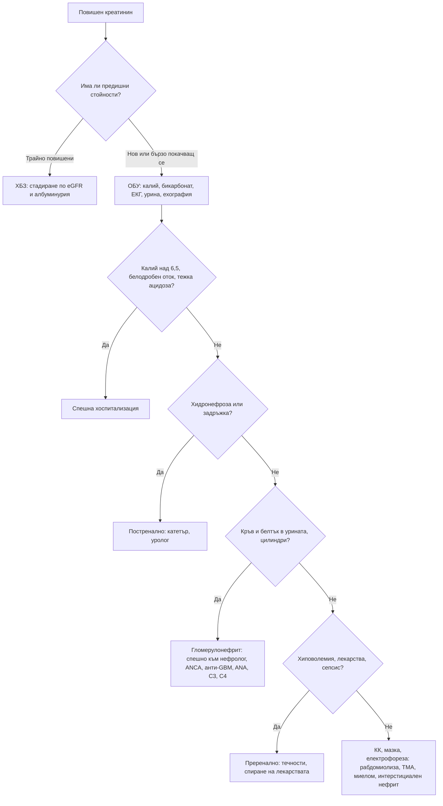

# Глава 29. Остро и хронично бъбречно увреждане

> **Част VI. Бъбреци, пикочни пътища и вътрешна среда**

## Цели на главата

- Да се дефинира и стадира острото бъбречно увреждане (ОБУ) по KDIGO.
- Да се разграничават преренални, ренални и постренални причини.
- Да се използва изследването на урината като ключ към диагнозата.
- Да се дефинира и класифицира хроничното бъбречно заболяване (ХБЗ) по eGFR и албуминурия.
- Да се разграничава ОБУ от ХБЗ и да се разпознава бързо прогресиращият гломерулонефрит.

---

## А. ОСТРО БЪБРЕЧНО УВРЕЖДАНЕ

## 1. Определение (KDIGO)

ОБУ е налице при **поне едно** от следните:

- повишение на креатинина с **≥ 26,5 µmol/l за 48 часа**;
- повишение на креатинина **≥ 1,5 пъти** спрямо изходната стойност, настъпило за последните 7 дни;
- диуреза **< 0,5 ml/kg/h за 6 часа**.

| Стадий | Креатинин | Диуреза |
|---|---|---|
| 1 | 1,5–1,9 × изходния или повишение с ≥ 26,5 µmol/l | < 0,5 ml/kg/h за 6–12 h |
| 2 | 2,0–2,9 × изходния | < 0,5 ml/kg/h за ≥ 12 h |
| 3 | ≥ 3,0 × изходния, или ≥ 354 µmol/l, или започване на диализа | < 0,3 ml/kg/h за ≥ 24 h или анурия ≥ 12 h |

## 2. Причини

| Група | Причини |
|---|---|
| **Преренални** (намалена бъбречна перфузия) | **Хиповолемия** (повръщане, диария, кървене, диуретици, изгаряния, недостатъчен прием на течности); намален ефективен обем (**сърдечна недостатъчност**, **цироза** — хепаторенален синдром, **сепсис**); **лекарства**, нарушаващи авторегулацията (АСЕ инхибитори и сартани, НСПВС, диуретици — „тройният удар“; АСЕ инхибитор при двустранна стеноза на бъбречните артерии); коремен компартмент синдром |
| **Ренални — остра тубулна некроза** | Исхемична (продължителна хипоперфузия, шок); токсична (аминогликозиди, ванкомицин, йодни контрастни вещества, цисплатин, амфотерицин; **миоглобин** при рабдомиолиза, хемоглобин при хемолиза) |
| **Ренални — остър интерстициален нефрит** | **Лекарства** (ИПП, НСПВС, бета-лактамни антибиотици, алопуринол, рифампицин); инфекции; саркоидоза; треска, обрив, еозинофилия (често липсват) |
| **Ренални — гломерулни** | **Бързо прогресиращ гломерулонефрит**: ANCA васкулит, анти-GBM болест, лупусен нефрит, постинфекциозен гломерулонефрит, IgA нефропатия |
| **Ренални — съдови** | Малигнена хипертония, **тромботична микроангиопатия** (хемолитично-уремичен синдром, тромботична тромбоцитопенична пурпура), склеродермна бъбречна криза, **холестеролова атероемболия** (след ангиография: ливедо, еозинофилия, нисък комплемент), тромбоза на бъбречната вена, емболия на бъбречната артерия |
| **Ренални — други** | **Миеломна нефропатия** (цилиндри от леки вериги), синдром на туморния лизис; **хантавирусна инфекция** (хеморагична треска с бъбречен синдром) и **лептоспироза** — ендемични за България |
| **Постренални** (обструкция) | **Доброкачествена хиперплазия и карцином на простатата**, карцином на пикочния мехур, тазови тумори, ретроперитонеална фиброза, двустранни камъни (или камък при единствен бъбрек), неврогенен мехур, запушен катетър, съсиреци, лекарства, предизвикващи задръжка, кристали (ацикловир, метотрексат, сулфонамиди) |

## 3. Безопасна диагностична стратегия

| Въпрос | Отговор |
|---|---|
| **Вероятна диагноза** | Преренално ОБУ (дехидратация, лекарства), остра тубулна некроза при сепсис, обструкция от простатата |
| **Сериозни заболявания, които не бива да се пропускат** | **Животозастрашаваща хиперкалиемия**, белодробен оток, тежка ацидоза; **бързо прогресиращ гломерулонефрит**; **обструкция**; **рабдомиолиза**; тромботична микроангиопатия; миелом; сепсис |
| **Чести капани** | „Тройният удар“ (АСЕ инхибитор или сартан + диуретик + НСПВС); остър интерстициален нефрит от ИПП; задръжка на урина при възрастен мъж; рабдомиолиза след падане и продължително лежане на пода; хантавирус и лептоспироза при треска и тромбоцитопения |
| **Маскиращи заболявания** | Лекарства, захарен диабет, миелом, сърдечна недостатъчност |
| **Психосоциални аспекти** | Злоупотреба с алкохол и вещества (рабдомиолиза), самолечение с НСПВС |

## 4. Изследване на урината: ключ към диагнозата

| Находка | Насочва към |
|---|---|
| **Кръв и белтък на лентата**, дисморфични еритроцити, **еритроцитни цилиндри** | **Гломерулонефрит** — спешно насочване към нефролог |
| Кални, кафяви зърнести цилиндри, тубулни епителни клетки | Остра тубулна некроза |
| Левкоцити и **левкоцитни цилиндри** | Пиелонефрит, **интерстициален нефрит** |
| Лента за кръв положителна, **без еритроцити** | **Рабдомиолиза** (миоглобин) или хемолиза |
| „Бедна“ урина | Преренално или постренално ОБУ |
| Кристали | Лекарства, уратна нефропатия, отравяне с етиленгликол (оксалатни кристали) |

**Фракционна екскреция на натрия:** под 1% насочва към преренална причина, над 2% към тубулна некроза. Показателят не е надежден при прием на диуретици. В този случай се използва фракционната екскреция на уреята (под 35% — преренална причина).

## 5. Изследвания при ОБУ

- **Предишни стойности на креатинина** (ключови за разграничаване от ХБЗ).
- Креатинин, урея, **калий**, натрий, бикарбонат (кръвно-газов анализ), калций, фосфати.
- **Урина** — лента и микроскопия, съотношение белтък/креатинин.
- ПКК и **мазка** (шистоцити и тромбоцитопения — тромботична микроангиопатия), КК (рабдомиолиза).
- **Ехография на бъбреците и мехура** (хидронефроза, размер на бъбреците) или измерване на остатъчната урина.
- ЕКГ при хиперкалиемия.
- Имунологични изследвания при нефритна урина: ANCA, анти-GBM, ANA, C3, C4.
- Електрофореза и свободни леки вериги (миелом).
- Серология за хантавирус и лептоспироза при съответна експозиция.

## 6. Правила за болничните дни

При остро заболяване с дехидратация (повръщане, диария, треска) пациентите трябва **временно да спрат** следните лекарства:

- АСЕ инхибитори и сартани;
- диуретици;
- метформин;
- SGLT2 инхибитори;
- НСПВС.

Лекарствата се възстановяват след 24–48 часа нормално хранене и прием на течности.

---

## Б. ХРОНИЧНО БЪБРЕЧНО ЗАБОЛЯВАНЕ

## 7. Определение и класификация (KDIGO 2024)

ХБЗ е структурно или функционално нарушение на бъбреците, продължаващо **над 3 месеца**:

- **eGFR < 60 ml/min/1,73 m²**, или
- **маркери за бъбречно увреждане**: албуминурия (съотношение албумин/креатинин ≥ 3 mg/mmol), отклонения в седимента, електролитни нарушения от тубулен произход, хистологични или образни отклонения, бъбречна трансплантация.

| Стадий | eGFR (ml/min/1,73 m²) |
|---|---|
| G1 | ≥ 90 (с маркери за увреждане) |
| G2 | 60–89 (с маркери за увреждане) |
| G3a | 45–59 |
| G3b | 30–44 |
| G4 | 15–29 |
| G5 | < 15 (бъбречна недостатъчност) |

Прогнозата се определя от **комбинацията** на eGFR и категорията на албуминурията (A1–A3).

**Изчисляване на eGFR:** използва се уравнението CKD-EPI от 2021 г. (без корекция за раса). Креатининът зависи от мускулната маса. При много ниска мускулна маса (възрастни хора, ампутации) eGFR надценява функцията. При много висока мускулна маса или прием на креатин я подценява. В такива случаи се използва **цистатин C**.

## 8. Причини за ХБЗ

| Причина | Особености |
|---|---|
| **Захарен диабет** | Най-честата причина; албуминурия, ретинопатия |
| **Артериална хипертония** | Нефросклероза |
| **Гломерулонефрити** | IgA нефропатия, мембранозна нефропатия, фокално-сегментна гломерулосклероза, вторични |
| **Поликистоза на бъбреците** | Фамилна анамнеза, големи бъбреци с кисти, хипертония, хематурия |
| **Обструктивна нефропатия** | Доброкачествена хиперплазия на простатата, камъни |
| **Рефлуксна нефропатия и рецидивиращ пиелонефрит** | Белези в кората |
| **Реноваскуларна болест** | Атеросклероза |
| **Лекарства** | **Литий**, НСПВС, калциневринови инхибитори, ИПП (хроничен интерстициален нефрит), аристолохиева киселина |
| **Балканска ендемична нефропатия** | Хроничен тубулоинтерстициален нефрит в определени селски райони по поречията на притоците на Дунав (в България — главно Врачанско и Монтанско). Свързана е с аристолохиевата киселина от семена на *Aristolochia clematitis*, замърсяващи брашното. Протича бавно, без хипертония и отоци в началото, с анемия и тубулна протеинурия. Рискът от **уротелен карцином на горните пикочни пътища** е висок |
| **Миелом и амилоидоза** | Протеинурия, анемия, хиперкалциемия |
| **Наследствени** | Синдром на Alport, болест на Fabry |

## 9. Разграничаване на ОБУ от ХБЗ

| Белег | Насочва към ХБЗ |
|---|---|
| Предишни стойности на креатинина | Трайно повишени (най-надеждният белег) |
| Размер на бъбреците при ехография | **Малки бъбреци (< 9 cm)** с изтънена кора. Изключения: диабет, амилоидоза, поликистоза и HIV нефропатия, при които бъбреците са нормални или големи |
| Анемия | Нормоцитна анемия (без кървене) |
| Минерално-костни нарушения | Хиперфосфатемия, хипокалциемия, повишен ПТХ |
| Симптоми | Дългогодишни: никтурия, сърбеж, умора |

## 10. Червени флагове

- Калий над 6,5 mmol/l или промени в ЕКГ.
- Тежка метаболитна ацидоза.
- Белодробен оток, резистентен на диуретици.
- **Уремични усложнения:** перикардит, енцефалопатия, кървене.
- **Анурия** (обструкция или съдова катастрофа).
- **Кръв и белтък в урината с покачващ се креатинин** (бързо прогресиращ гломерулонефрит).
- Системни белези: хемоптиза, обрив, артрит, синузит, треска.
- Бързо спадане на eGFR (над 25% или с над 15 ml/min за година).

---

## 11. Диагностичен алгоритъм при ОБУ

---

## 12. Клинични перли

- Първият въпрос при повишен креатинин е: *„Какъв е бил креатининът преди?“*.
- АСЕ инхибитор или сартан + диуретик + НСПВС е „тройният удар“ върху бъбреците. Не предписвайте НСПВС на тези пациенти.
- Всеки пациент с ОБУ трябва да има изследване на урината. Нефритният седимент изисква спешно насочване.
- Възрастен мъж с ОБУ: първо изключете задръжка на урина с палпация, ехография или катетър.
- Възрастен човек, намерен на пода след падане: изследвайте КК.
- ИПП могат да причинят интерстициален нефрит, който протича без треска и обрив.
- Треска, тромбоцитопения и ОБУ при човек, работил на полето или в гората: мислете за хантавирус и лептоспироза.

---

## 13. Клиничен случай

**Случай.** Жена на 76 години с хипертония и сърдечна недостатъчност, лекувана с рамиприл, фуроземид и спиронолактон. Преди 10 дни е започнала да приема ибупрофен за болки в коляното. От 3 дни има диария. Чувства се слаба, отделя малко урина. АН 96/58 mmHg, пулс 102/min, лигавиците са сухи. Изследвания: креатинин 312 µmol/l (преди 2 месеца 98 µmol/l), калий 6,4 mmol/l, урея 28 mmol/l. Уринната лента е без белтък и кръв. При ехографията бъбреците са с нормални размери, без хидронефроза.

**Въпроси.** 1) Какъв е механизмът на ОБУ? 2) Какво е спешното поведение?

**Обсъждане.** Това е **преренално ОБУ, стадий 3**, причинено от **„тройния удар“**: АСЕ инхибиторът разширява еферентната артериола, НСПВС свиват аферентната, а диуретиците и диарията водят до хиповолемия. Спиронолактонът допринася за хиперкалиемията. Калий 6,4 mmol/l изисква спешна ЕКГ и хоспитализация. Всички нефротоксични лекарства и лекарствата, задържащи калий, се спират. Течностите се възстановяват внимателно, като се взема предвид сърдечната недостатъчност. След 5 дни креатининът е 124 µmol/l.

**Поука.** НСПВС са противопоказани при пациенти, които приемат едновременно АСЕ инхибитор или сартан и диуретик. Пациентите трябва да бъдат инструктирани за правилата за болничните дни.

<!-- навигация -->

---

[← Глава 28. Хематурия и протеинурия](28-hematuria-proteinuria.md) · [Съдържание](../README.md) · [Глава 30. Електролитни нарушения →](30-elektroliti.md)
