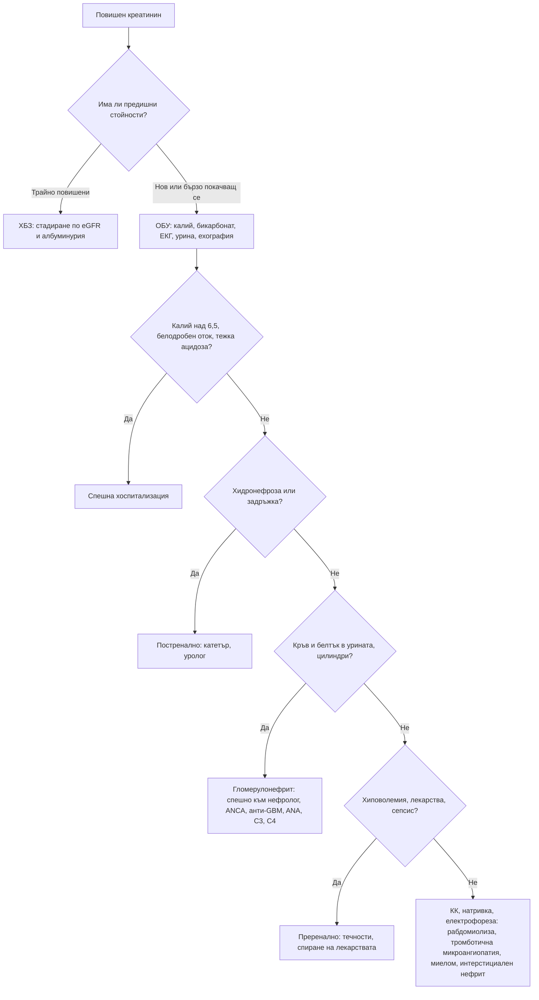

# Глава 29. Остро и хронично бъбречно увреждане

> **Част VI. Бъбреци, пикочни пътища и вътрешна среда**

## Цели на главата

- Да се дефинира и стадира острото бъбречно увреждане (ОБУ) по KDIGO.
- Да се разграничават преренални, ренални и постренални причини.
- Да се използва изследването на урината като ключ към диагнозата.
- Да се дефинира и класифицира хроничното бъбречно заболяване (ХБЗ) по eGFR и албуминурия.
- Да се разграничава ОБУ от ХБЗ и да се разпознава бързо прогресиращият гломерулонефрит.

## Ключови моменти

- ОБУ се определя по KDIGO: покачване на креатинина с 26,5 µmol/l или повече за 48 часа, 1,5 пъти или повече за 7 дни или диуреза под 0,5 ml/kg/h за 6 часа *(SORT C [1])*.
- Първият въпрос е „какъв е бил креатининът преди?“. Изследването на урината и ехографията разграничават преренално, ренално и постренално увреждане.
- Нефритният седимент (кръв и белтък, еритроцитни цилиндри) с покачващ се креатинин е бързо прогресиращ гломерулонефрит до изключване и изисква спешно насочване.
- „Тройният удар“ (АСЕ инхибитор или сартан, диуретик и НСПВС) е честа и предотвратима причина за ОБУ. При остро заболяване с дехидратация тези лекарства временно се спират *(SORT C [5])*.
- ХБЗ се класифицира по eGFR (G1–G5) и албуминурия (A1–A3). eGFR се изчислява с CKD-EPI 2021 без корекция за раса, а при крайна мускулна маса – с цистатин C *(SORT B [5, 6])*.
- В България треската с тромбоцитопения и ОБУ насочва към хантавирусна инфекция и лептоспироза, а хроничният тубулоинтерстициален нефрит в ендемичните райони – към балканска ендемична нефропатия [2, 3, 7].

---

## А. Остро бъбречно увреждане

### 1. Определение (KDIGO)

ОБУ е налице при **поне едно** от следните [1]:

- повишение на креатинина с **≥ 26,5 µmol/l за 48 часа**;
- повишение на креатинина **≥ 1,5 пъти** спрямо изходната стойност, настъпило за последните 7 дни;
- диуреза **< 0,5 ml/kg/h за 6 часа**.

*Таблица 29.1. Остро бъбречно увреждане: определение (KDIGO).*

| Стадий | Креатинин | Диуреза |
|---|---|---|
| 1 | 1,5–1,9 × изходния или повишение с ≥ 26,5 µmol/l | < 0,5 ml/kg/h за 6–12 h |
| 2 | 2,0–2,9 × изходния | < 0,5 ml/kg/h за ≥ 12 h |
| 3 | ≥ 3,0 × изходния, или ≥ 354 µmol/l, или започване на диализа | < 0,3 ml/kg/h за ≥ 24 h или анурия ≥ 12 h |

### 2. Причини

*Таблица 29.2. Остро бъбречно увреждане: причини.*

| Група | Причини |
|---|---|
| **Преренални** (намалена бъбречна перфузия) | Хиповолемия (повръщане, диария, кървене, диуретици, изгаряния, недостатъчен прием на течности); намален ефективен обем (сърдечна недостатъчност, цироза – хепаторенален синдром, сепсис); лекарства, нарушаващи авторегулацията (АСЕ инхибитори и сартани, НСПВС, диуретици – „тройният удар“; АСЕ инхибитор при двустранна стеноза на бъбречните артерии); коремен компартмент синдром |
| **Ренални – остра тубулна некроза** | Исхемична (продължителна хипоперфузия, шок); токсична (аминогликозиди, ванкомицин, йодни контрастни вещества, цисплатин, амфотерицин; миоглобин при рабдомиолиза, хемоглобин при хемолиза) |
| **Ренални – остър интерстициален нефрит** | Лекарства (ИПП, НСПВС, бета-лактамни антибиотици, алопуринол, рифампицин); инфекции; саркоидоза; треска, обрив, еозинофилия (често липсват) |
| **Ренални – гломерулни** | Бързо прогресиращ гломерулонефрит: ANCA васкулит, анти-GBM болест, лупусен нефрит, постинфекциозен гломерулонефрит, IgA нефропатия |
| **Ренални – съдови** | Малигнена хипертония, тромботична микроангиопатия (хемолитично-уремичен синдром, тромботична тромбоцитопенична пурпура), склеродермна бъбречна криза, холестеролова атероемболия (след ангиография: ливедо, еозинофилия, нисък комплемент), тромбоза на бъбречната вена, емболия на бъбречната артерия |
| **Ренални – други** | Миеломна нефропатия (цилиндри от леки вериги), синдром на туморния лизис; хантавирусна инфекция (хеморагична треска с бъбречен синдром) и лептоспироза – ендемични за България [2, 3] |
| **Постренални** (обструкция) | Доброкачествена хиперплазия и карцином на простатата, карцином на пикочния мехур, тазови тумори, ретроперитонеална фиброза, двустранни камъни (или камък при единствен бъбрек), неврогенен мехур, запушен катетър, съсиреци, лекарства, предизвикващи задръжка, кристали (ацикловир, метотрексат, сулфонамиди) |

### 3. Безопасна диагностична стратегия

*Таблица 29.3. Остро бъбречно увреждане: безопасна диагностична стратегия.*

| Въпрос | Отговор |
|---|---|
| **Вероятна диагноза** | Преренално ОБУ (дехидратация, лекарства), остра тубулна некроза при сепсис, обструкция от простатата |
| **Сериозни заболявания, които не бива да се пропускат** | Животозастрашаваща хиперкалиемия, белодробен оток, тежка ацидоза; бързо прогресиращ гломерулонефрит; обструкция; рабдомиолиза; тромботична микроангиопатия; миелом; сепсис |
| **Чести капани** | „Тройният удар“ (АСЕ инхибитор или сартан + диуретик + НСПВС); остър интерстициален нефрит от ИПП; задръжка на урина при възрастен мъж; рабдомиолиза след падане и продължително лежане на пода; хантавирус и лептоспироза при треска и тромбоцитопения |
| **Маскиращи заболявания** | Лекарства, захарен диабет, миелом, сърдечна недостатъчност |
| **Психосоциални аспекти** | Злоупотреба с алкохол и вещества (рабдомиолиза), самолечение с НСПВС |

### 4. Изследване на урината

*Таблица 29.4. Находки в урината при остро бъбречно увреждане.*

| Находка | Насочва към |
|---|---|
| Кръв и белтък на лентата, дисморфични еритроцити, еритроцитни цилиндри | Гломерулонефрит – спешно насочване към нефролог |
| Кални, кафяви зърнести цилиндри, тубулни епителни клетки | Остра тубулна некроза |
| Левкоцити и **левкоцитни цилиндри** | Пиелонефрит, интерстициален нефрит |
| Лента за кръв положителна, **без еритроцити** | Рабдомиолиза (миоглобин) или хемолиза |
| „Бедна“ урина | Преренално или постренално ОБУ |
| Кристали | Лекарства, уратна нефропатия, отравяне с етиленгликол (оксалатни кристали) |

**Фракционна екскреция на натрия:** под 1% насочва към преренална причина, над 2% към тубулна некроза. Показателят не е надежден при прием на диуретици. В този случай се използва фракционната екскреция на уреята (под 35% – преренална причина) [4].

### 5. Изследвания при ОБУ

- **Предишни стойности на креатинина** (ключови за разграничаване от ХБЗ).
- Креатинин, урея, **калий**, натрий, бикарбонат (кръвно-газов анализ), калций, фосфати.
- **Урина** – лента и микроскопия, съотношение белтък/креатинин.
- ПКК и **натривка** (шистоцити и тромбоцитопения – тромботична микроангиопатия), креатинкиназа (КК) (рабдомиолиза).
- **Ехография на бъбреците и мехура** (хидронефроза, размер на бъбреците) или измерване на остатъчната урина.
- ЕКГ при хиперкалиемия.
- Имунологични изследвания при нефритна урина: ANCA, анти-GBM, ANA, C3, C4.
- Електрофореза и свободни леки вериги (миелом).
- Серология за хантавирус и лептоспироза при съответна експозиция.

### 6. Правила за болничните дни

При остро заболяване с дехидратация (повръщане, диария, треска) пациентите трябва **временно да спрат** следните лекарства (доказателствата за ефекта на тези правила са ограничени, но те са широко препоръчвани) [5]:

- АСЕ инхибитори и сартани;
- диуретици;
- метформин;
- SGLT2 инхибитори;
- НСПВС.

Лекарствата се възстановяват след 24–48 часа нормално хранене и прием на течности.

---

## Б. Хронично бъбречно заболяване

### 7. Определение и класификация (KDIGO 2024) [5]

ХБЗ е структурно или функционално нарушение на бъбреците, продължаващо **над 3 месеца**:

- **eGFR < 60 ml/min/1,73 m²**, или
- **маркери за бъбречно увреждане**: албуминурия (съотношение албумин/креатинин ≥ 3 mg/mmol), отклонения в седимента, електролитни нарушения от тубулен произход, хистологични или образни отклонения, бъбречна трансплантация.

*Таблица 29.5. Определение и класификация (KDIGO 2024).*

| Стадий | eGFR (ml/min/1,73 m²) |
|---|---|
| G1 | ≥ 90 (с маркери за увреждане) |
| G2 | 60–89 (с маркери за увреждане) |
| G3a | 45–59 |
| G3b | 30–44 |
| G4 | 15–29 |
| G5 | < 15 (бъбречна недостатъчност) |

Прогнозата се определя от **комбинацията** на eGFR и категорията на албуминурията (A1–A3).

**Изчисляване на eGFR:** използва се уравнението CKD-EPI от 2021 г. (без корекция за раса) [6]. Креатининът зависи от мускулната маса. При много ниска мускулна маса (възрастни хора, ампутации) eGFR надценява функцията. При много висока мускулна маса или прием на креатин я подценява. В такива случаи се използва **цистатин C**.

### 8. Причини за ХБЗ

*Таблица 29.6. Причини за хронично бъбречно заболяване.*

| Причина | Особености |
|---|---|
| **Захарен диабет** | Най-честата причина; албуминурия, ретинопатия |
| **Артериална хипертония** | Нефросклероза |
| **Гломерулонефрити** | IgA нефропатия, мембранозна нефропатия, фокално-сегментна гломерулосклероза, вторични |
| **Поликистоза на бъбреците** | Фамилна анамнеза, големи бъбреци с кисти, хипертония, хематурия |
| **Обструктивна нефропатия** | Доброкачествена хиперплазия на простатата, камъни |
| **Рефлуксна нефропатия и рецидивиращ пиелонефрит** | Белези в кората |
| **Реноваскуларна болест** | Атеросклероза |
| **Лекарства** | Литий, НСПВС, калциневринови инхибитори, ИПП (хроничен интерстициален нефрит), аристолохиева киселина |
| **Балканска ендемична нефропатия** | Хроничен тубулоинтерстициален нефрит в определени селски райони по поречията на притоците на Дунав (в България – главно Врачанско и Монтанско). Свързана е с аристолохиевата киселина от семена на *Aristolochia clematitis*, замърсяващи брашното [7]. Протича бавно, без хипертония и отоци в началото, с анемия и тубулна протеинурия. Рискът от уротелен карцином на горните пикочни пътища е висок |
| **Миелом и амилоидоза** | Протеинурия, анемия, хиперкалциемия |
| **Наследствени** | Синдром на Alport, болест на Fabry |

### 9. Разграничаване на ОБУ от ХБЗ

*Таблица 29.7. Разграничаване на ОБУ от ХБЗ.*

| Белег | Насочва към ХБЗ |
|---|---|
| Предишни стойности на креатинина | Трайно повишени (най-надеждният белег) |
| Размер на бъбреците при ехография | Малки бъбреци (< 9 cm) с изтънена кора. Изключения: диабет, амилоидоза, поликистоза и HIV нефропатия, при които бъбреците са нормални или големи |
| Анемия | Нормоцитна анемия (без кървене) |
| Минерално-костни нарушения | Хиперфосфатемия, хипокалциемия, повишен ПТХ |
| Симптоми | Дългогодишни: никтурия, сърбеж, умора |

### 10. Червени флагове

- Калий над 6,5 mmol/l или промени в ЕКГ.
- Тежка метаболитна ацидоза.
- Белодробен оток, резистентен на диуретици.
- **Уремични усложнения:** перикардит, енцефалопатия, кървене.
- **Анурия** (обструкция или съдова катастрофа).
- **Кръв и белтък в урината с покачващ се креатинин** (бързо прогресиращ гломерулонефрит).
- Системни белези: хемоптиза, обрив, артрит, синузит, треска.
- Бързо спадане на eGFR (над 25% или с над 15 ml/min за година).

---

## 11. Диагностичен алгоритъм при ОБУ

*Фигура 29.1. Диагностичен алгоритъм при остро бъбречно увреждане. Схема на авторите въз основа на източниците, цитирани в главата.*

Текстово описание на фигура 29.1

1. Повишен креатинин. Следва: към т. 2.
2. **Въпрос:** Има ли предишни стойности? Трайно повишени – към т. 3; Нов или бързо покачващ се – към т. 4.
3. ХБЗ: стадиране по eGFR и албуминурия.
4. ОБУ: калий, бикарбонат, ЕКГ, урина, ехография. Следва: към т. 5.
5. **Въпрос:** Калий над 6,5, белодробен оток, тежка ацидоза? Да – към т. 6; Не – към т. 7.
6. Спешна хоспитализация.
7. **Въпрос:** Хидронефроза или задръжка? Да – към т. 8; Не – към т. 9.
8. Постренално: катетър, уролог.
9. **Въпрос:** Кръв и белтък в урината, цилиндри? Да – към т. 10; Не – към т. 11.
10. Гломерулонефрит: спешно към нефролог, ANCA, анти-GBM, ANA, C3, C4.
11. **Въпрос:** Хиповолемия, лекарства, сепсис? Да – към т. 12; Не – към т. 13.
12. Преренално: течности, спиране на лекарствата.
13. КК, натривка, електрофореза: рабдомиолиза, тромботична микроангиопатия, миелом, интерстициален нефрит.

---

## 12. Кога и колко спешно да насочим

*Таблица 29.8. Кога и колко спешно да насочим.*

| Спешност | Клинична ситуация |
|---|---|
| **Незабавно (112 или спешно отделение)** | Калий над 6,5 mmol/l или промени в ЕКГ; белодробен оток; тежка ацидоза; анурия; уремичен перикардит или енцефалопатия; ОБУ със сепсис |
| **В същия ден** | ОБУ стадий 2–3; нефритен седимент с покачващ се креатинин (нефролог); задръжка на урина с хидронефроза (катетър, уролог); подозрение за рабдомиолиза, тромботична микроангиопатия, хантавирус или лептоспироза [2, 3] |
| **Бързо (до 2 седмици)** | Бързо спадане на eGFR (над 25% или над 15 ml/min за година); новооткрито ХБЗ G4–G5; подозрение за миелом |
| **Планово** | ХБЗ с албуминурия A3 или eGFR под 30 ml/min/1,73 m²; неконтролирана хипертония при ХБЗ въпреки 4 медикамента; поликистоза; хематурия с албуминурия; съмнение за наследствено заболяване |
| **Проследяване в общата практика** | ХБЗ G1–G3 с албуминурия A1–A2 и стабилна функция – контрол на налягането, диабета и лекарствата; преренално ОБУ стадий 1 с ясна причина след корекция |

---

## 13. Клинични перли

- Първият въпрос при повишен креатинин е: *„Какъв е бил креатининът преди?“*.
- АСЕ инхибитор или сартан + диуретик + НСПВС е „тройният удар“ върху бъбреците. Не предписвайте НСПВС на тези пациенти.
- Всеки пациент с ОБУ трябва да има изследване на урината. Нефритният седимент изисква спешно насочване.
- Възрастен мъж с ОБУ: първо изключете задръжка на урина с палпация, ехография или катетър.
- Възрастен човек, намерен на пода след падане: изследвайте КК.
- ИПП могат да причинят интерстициален нефрит, който протича без треска и обрив.
- Треска, тромбоцитопения и ОБУ при човек, работил на полето или в гората: помислете за хантавирус и лептоспироза.

---

## 14. Клиничен случай

**Етап 1 – клинична картина.** Жена на 76 години с хипертония и сърдечна недостатъчност приема рамиприл, фуроземид и спиронолактон. Преди 10 дни е започнала ибупрофен за болки в коляното. От 3 дни има диария. Чувства се слаба и отделя малко урина.

> **Въпрос 1.** Кои лекарства увеличават риска от ОБУ и хиперкалиемия?

**Етап 2 – преглед и изследвания.** АН 96/58 mmHg, пулс 102/min, лигавиците са сухи. Креатинин 312 µmol/l (преди 2 месеца – 98 µmol/l), калий 6,4 mmol/l, урея 28 mmol/l. Уринната лента е без белтък и кръв. При ехографията бъбреците са с нормални размери, без хидронефроза.

> **Въпрос 2.** Какъв е стадият и механизмът на ОБУ?

> **Въпрос 3.** Какво е спешното поведение?

Обсъждане и отговори

**Отговор 1.** Рамиприлът, фуроземидът и ибупрофенът образуват „тройния удар“. Рамиприлът и спиронолактонът повишават калия.

**Отговор 2.** Креатининът е повишен 3,2 пъти спрямо изходния – ОБУ стадий 3 [1]. Механизмът е преренален: АСЕ инхибиторът разширява еферентната артериола, НСПВС свиват аферентната, а диуретикът и диарията водят до хиповолемия. „Бедната“ урина и нормалните бъбреци без хидронефроза подкрепят това.

**Отговор 3.** Калий 6,4 mmol/l изисква спешна ЕКГ и хоспитализация. Всички нефротоксични лекарства и лекарствата, задържащи калий, се спират. Течностите се възстановяват внимателно, като се взема предвид сърдечната недостатъчност. След 5 дни креатининът е 124 µmol/l.

**Поука.** НСПВС са противопоказани при пациенти, които приемат едновременно АСЕ инхибитор или сартан и диуретик. Пациентите трябва да бъдат инструктирани за правилата за болничните дни [5].

---

## Обобщение

- ОБУ се определя и стадира по KDIGO. Причините са преренални, ренални (тубулни, интерстициални, гломерулни, съдови) и постренални.
- Изследването на урината, предишните стойности на креатинина и ехографията са ключът към диагнозата. Нефритният седимент изисква спешно насочване.
- ХБЗ се класифицира по eGFR и албуминурия. Най-честите причини са диабетът и хипертонията, а в България – и балканската ендемична нефропатия в ендемичните райони.
- Червените флагове (хиперкалиемия, белодробен оток, ацидоза, анурия, уремични усложнения, бързо прогресиращ гломерулонефрит) налагат незабавно насочване.

## Самопроверка

### Въпроси с един верен отговор

**1.** *(основно ниво)* Креатининът на мъж е 110 µmol/l, а след 36 часа – 145 µmol/l. Има ли ОБУ по KDIGO?

- **А.** Не, защото креатининът не се е удвоил
- **Б.** Да, защото покачването е 26,5 µmol/l или повече за 48 часа
- **В.** Не, защото креатининът е под 354 µmol/l
- **Г.** Само ако диурезата е намалена
- **Д.** Не може да се прецени без биопсия

Отговор и обосновка

**Верен отговор: Б.** Покачването е 35 µmol/l за 36 часа, което отговаря на критерия „26,5 µmol/l или повече за 48 часа“ [1]. Това е стадий 1. А, В, Г и Д не отговарят на определението.

**2.** *(основно ниво)* Мъж на 78 години има ОБУ и затруднено уриниране. Коя е първата стъпка?

- **А.** Бъбречна биопсия
- **Б.** Палпация на мехура и ехография или измерване на остатъчната урина
- **В.** ANCA и анти-GBM
- **Г.** КТ с контраст
- **Д.** Интравенозни течности без друга оценка

Отговор и обосновка

**Верен отговор: Б.** При възрастен мъж с ОБУ първо се изключва задръжка на урина (постренална причина). А и В са за нефритна урина. Г може да навреди (контраст). Д пропуска обструкцията.

**3.** *(основно ниво)* Уринната лента на пациент с ОБУ е положителна за кръв (3+), но при микроскопия няма еритроцити. Креатинкиназата е 45 000 U/l. Коя е причината?

- **А.** Гломерулонефрит
- **Б.** Рабдомиолиза
- **В.** Интерстициален нефрит
- **Г.** Обструкция
- **Д.** Преренално ОБУ

Отговор и обосновка

**Верен отговор: Б.** Положителна лента без еритроцити и много висока креатинкиназа означават миоглобинурия при рабдомиолиза, която предизвиква остра тубулна некроза.

**4.** *(напреднало ниво)* Жена на 65 години има покачване на креатинина от 90 до 260 µmol/l за 3 седмици, хематурия с еритроцитни цилиндри, белтък 2+ и хемоптиза. Кое е правилното поведение?

- **А.** Повторни изследвания след месец
- **Б.** Спешно насочване към нефролог в същия ден (ANCA, анти-GBM)
- **В.** Интравенозни течности
- **Г.** Спиране на АСЕ инхибитора и контрол след седмица
- **Д.** Ехография на бъбреците планово

Отговор и обосновка

**Верен отговор: Б.** Нефритният седимент с бързо покачващ се креатинин и хемоптиза е белодробно-бъбречен синдром при бързо прогресиращ гломерулонефрит. Необходимо е спешно насочване в същия ден. А, В, Г и Д забавят лечението, от което зависи запазването на бъбречната функция.

**5.** *(напреднало ниво)* Мъж на 45 години от Северозападна България има треска, болки в мускулите и кръста, тромбоцити 40 × 10⁹/l и креатинин 280 µmol/l. Преди 2 седмици е чистил плевня. Кои инфекции трябва да се подозират?

- **А.** Инфекциозна мононуклеоза и CMV
- **Б.** Хантавирусна инфекция и лептоспироза
- **В.** Туберкулоза и бруцелоза
- **Г.** Грип и COVID-19
- **Д.** Малария и денга

Отговор и обосновка

**Верен отговор: Б.** Треската, болките в кръста, тромбоцитопенията и ОБУ след контакт с гризачи или замърсена среда са типични за хантавирусна хеморагична треска с бъбречен синдром и за лептоспироза, които са ендемични за България [2, 3].

### Задача

Жена на 70 години има креатинин 150 µmol/l при два контрола за 4 месеца, eGFR 30 ml/min/1,73 m² и съотношение албумин/креатинин 40 mg/mmol. Стадирайте ХБЗ и определете поведението.

Решение

eGFR 30 ml/min/1,73 m² е G3b (30–44), а съотношение албумин/креатинин 40 mg/mmol е A3 (над 30 mg/mmol) [5]. Комбинацията G3b A3 означава много висок риск от прогресия и сърдечно-съдови събития. Пациентката се насочва планово към нефролог (албуминурия A3). Междувременно се оптимизират налягането, лечението с АСЕ инхибитор или сартан, SGLT2 инхибитор и статин според показанията, спират се нефротоксичните лекарства и се дават указанията за болничните дни. Проследяват се eGFR, албуминурията, калият и хемоглобинът.

### OSCE станция: Съвети за правилата за болничните дни

**Време:** 6 минути. **Ниво:** основно (студенти, специализанти).

**Задача за кандидата.** Мъж на 66 години с ХБЗ G3a и диабет приема рамиприл, фуроземид, метформин и емпаглифлозин. Обяснете му какво да прави, ако получи повръщане, диария или треска.

**Информация за симулирания пациент (за изпитващия).** Разбира малко медицински термини. Притеснява се дали спирането на лекарствата е безопасно.

*Таблица 29.9. OSCE станция „Съвети за правилата за болничните дни“ – критерии за оценяване.*

| Критерий | Точки |
|---|---|
| Проверява какво знае пациентът за бъбречното си заболяване и лекарствата | 1 |
| Обяснява кога се прилагат правилата (остро заболяване с дехидратация) | 1 |
| Изброява лекарствата за временно спиране: рамиприл, фуроземид, метформин, емпаглифлозин и НСПВС | 2 |
| Обяснява кога да ги възобнови (след 24–48 часа нормално хранене и прием на течности) | 1 |
| Съветва да избягва НСПВС без лекарска препоръка | 1 |
| Дава указания при влошаване: намалена диуреза, замайване, объркване, продължително повръщане | 2 |
| Предлага изследване на креатинина и калия при продължително заболяване | 1 |
| Използва разбираем език и проверява разбирането с метода „обяснете ми обратно“ | 1 |
| **Общо** | **10** |

**Праг за успешно изпълнение:** 7 от 10 точки, включително правилния списък с лекарства и указанията при влошаване.

## Литература

1. Khwaja A. KDIGO clinical practice guidelines for acute kidney injury. Nephron Clin Pract. 2012;120(4):c179-84. doi:10.1159/000339789. PMID: 22890468.
2. Christova I, Pishmisheva M, Trifonova I, Vatev N, Stoycheva M, Tiholova M, et al. Clinical aspects of hantavirus infections in Bulgaria. Wien Klin Wochenschr. 2017;129(15-16):572-578. doi:10.1007/s00508-017-1174-2. PMID: 28229289.
3. Gancheva GI. Leptospirosis in elderly patients. Braz J Infect Dis. 2013;17(5):592-5. doi:10.1016/j.bjid.2013.01.012. PMID: 23830052.
4. Carvounis CP, Nisar S, Guro-Razuman S. Significance of the fractional excretion of urea in the differential diagnosis of acute renal failure. Kidney Int. 2002;62(6):2223-9. doi:10.1046/j.1523-1755.2002.00683.x. PMID: 12427149.
5. Kidney Disease: Improving Global Outcomes (KDIGO) CKD Work Group. KDIGO 2024 Clinical Practice Guideline for the Evaluation and Management of Chronic Kidney Disease. Kidney Int. 2024;105(4S):S117-S314. doi:10.1016/j.kint.2023.10.018. PMID: 38490803.
6. Inker LA, Eneanya ND, Coresh J, Tighiouart H, Wang D, Sang Y, et al. New Creatinine- and Cystatin C-Based Equations to Estimate GFR without Race. N Engl J Med. 2021;385(19):1737-1749. doi:10.1056/NEJMoa2102953. PMID: 34554658.
7. Jelaković B, Dika Ž, Arlt VM, Stiborova M, Pavlović NM, Nikolić J, et al. Balkan Endemic Nephropathy and the Causative Role of Aristolochic Acid. Semin Nephrol. 2019;39(3):284-296. doi:10.1016/j.semnephrol.2019.02.007. PMID: 31054628.

*Последна проверка на съдържанието: септември 2026 г. Следващ планиран преглед: септември 2027 г. (вж. „Политика за актуализация“ в README).*

<!-- навигация -->

---

[← Глава 28. Хематурия и протеинурия](28-hematuria-proteinuria.md) · [Съдържание](../README.md) · [Глава 30. Електролитни нарушения →](30-elektroliti.md)
