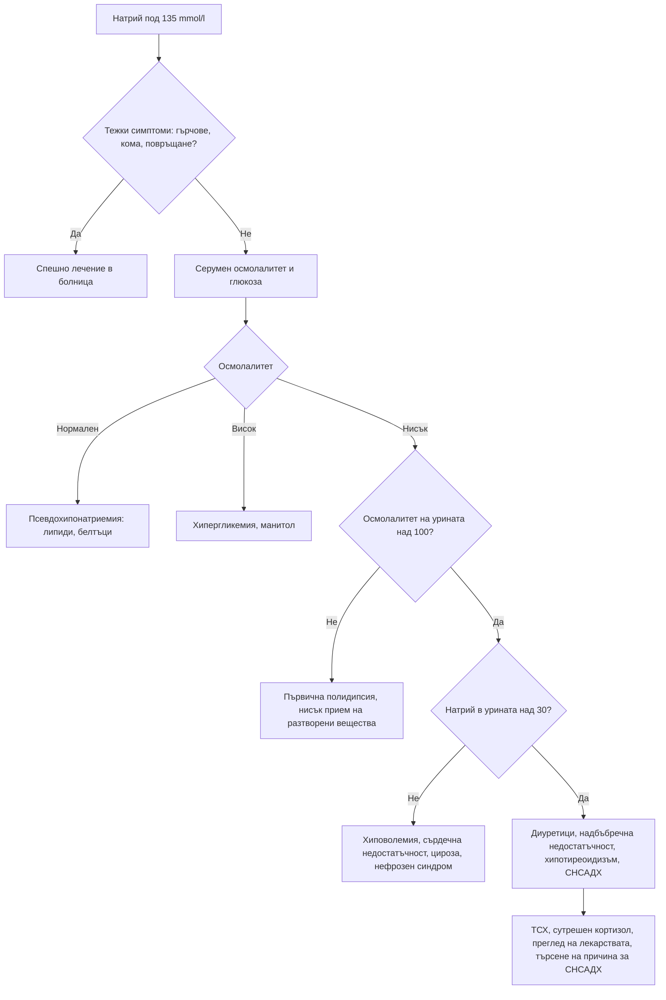

# Глава 30. Електролитни нарушения

> **Част VI. Бъбреци, пикочни пътища и вътрешна среда**

## Цели на главата

- Да се прилага стъпаловиден подход към хипонатриемията чрез осмолалитета на серума, осмолалитета на урината и натрия в урината.
- Да се познават причините за хипернатриемия, хипо- и хиперкалиемия.
- Да се разпознава псевдохиперкалиемията.
- Да се разграничава ПТХ-зависимата от ПТХ-независимата хиперкалциемия.
- Да се познават причините за нарушения на магнезия и фосфатите, включително синдромът на възобновено хранене.

---

## А. НАТРИЙ

## 1. Хипонатриемия

### 1.1. Определение и тежест

| Тежест | Натрий (mmol/l) |
|---|---|
| Лека | 130–134 |
| Умерена | 125–129 |
| Тежка | < 125 |

**Остра** е хипонатриемията, развила се за под 48 часа. Тя е по-опасна поради мозъчния оток. **Хроничната** хипонатриемия (над 48 часа или с неизвестна давност) е по-честа в общата практика. Дори „леката“ хронична хипонатриемия при възрастни хора води до нарушения на походката, падания, фрактури и когнитивни нарушения.

**Симптоми:** гадене, главоболие, умора, объркване, нестабилност, падания, повръщане, гърчове, кома.

### 1.2. Стъпаловиден подход

**Стъпка 1. Серумен осмолалитет** (нормален 275–295 mOsm/kg):

- **нормален** — **псевдохипонатриемия** (тежка хиперлипидемия, парапротеинемия) или изотонични разтвори;
- **висок** — **хипергликемия** (натрият се понижава с около 2,4 mmol/l на всеки 5,6 mmol/l глюкоза над нормата), манитол;
- **нисък** (хипотонична хипонатриемия) — продължава се към стъпка 2.

**Стъпка 2. Осмолалитет на урината:**

- **< 100 mOsm/kg** — ADH е потиснат: **първична полидипсия**, „потомания на бирата“, диета „чай и препечени филийки“ (нисък прием на разтворени вещества);
- **> 100 mOsm/kg** — ADH е активен: продължава се към стъпка 3.

**Стъпка 3. Натрий в урината:**

- **< 30 mmol/l** — **намален ефективен артериален обем**: хиповолемия (повръщане, диария, загуба в „трето пространство“), **сърдечна недостатъчност**, **цироза**, нефрозен синдром;
- **> 30 mmol/l** — **синдром на неадекватна секреция на ADH (СНСАДХ)**, **диуретици** (особено тиазидни), **надбъбречна недостатъчност**, тежък хипотиреоидизъм, бъбречна загуба на сол, церебрална загуба на сол.

Клиничната оценка на обема е ненадеждна. Решаващи са лабораторните показатели.

### 1.3. Синдром на неадекватна секреция на ADH

**Критерии:**

- хипотонична хипонатриемия;
- осмолалитет на урината > 100 mOsm/kg;
- натрий в урината > 30 mmol/l при нормален прием на сол;
- клинична еуволемия;
- нормална функция на щитовидната жлеза и надбъбреците;
- липса на скорошен прием на диуретици.

**Причини:**

| Група | Причини |
|---|---|
| Централна нервна система | Инсулт, кръвоизлив, травма, менингит, енцефалит, тумори |
| Белодробни | Пневмония (особено легионелоза), туберкулоза, **дребноклетъчен карцином на белия дроб** |
| **Лекарства** | **SSRI**, **карбамазепин** и окскарбазепин, антипсихотици, циклофосфамид, винкристин, опиоиди, MDMA („екстази“), десмопресин |
| Други | Болка, гадене, следоперативен период, HIV, продължително физическо натоварване („хипонатриемия на маратонците“) |

**Тиазидните диуретици** са най-честата причина за хипонатриемия в общата практика, особено при възрастни жени с ниско тегло. Съчетанието на тиазид и SSRI е особено рисково.

**Корекция.** Натрият не бива да се повишава с повече от **8–10 mmol/l за 24 часа** поради риск от **осмотичен демиелинизиращ синдром**. Рискът е особено висок при алкохолизъм, недохранване, хипокалиемия и чернодробно заболяване.

## 2. Хипернатриемия

Хипернатриемията почти винаги означава **нарушен достъп до вода** или **нарушена жажда**. Застрашени са възрастни хора с деменция, кърмачета и пациенти с нарушено съзнание.

| Механизъм | Причини |
|---|---|
| **Загуба на вода** | Треска, изгаряния, изпотяване; осмотична диария; **осмотична диуреза** (хипергликемия); **безвкусен диабет** — централен или нефрогенен (**литий**, хиперкалциемия, хипокалиемия) |
| **Недостатъчен прием** | Деменция, обездвижване, нарушена жажда, кърмачета |
| **Прием на натрий** | Хипертонични разтвори, натриев бикарбонат, прием на сол |

---

## Б. КАЛИЙ

## 3. Хипокалиемия

**Симптоми:** мускулна слабост, крампи, запек, полиурия; при тежка хипокалиемия — рабдомиолиза, парализа, аритмии. **ЕКГ:** сплескани T-зъбци, U-вълни, удължен QU интервал, ST-депресия.

| Механизъм | Причини |
|---|---|
| **Преразпределение в клетките** | Инсулин, бета-агонисти (салбутамол), алкалоза, **тиреотоксична периодична парализа**, синдром на възобновено хранене |
| **Стомашно-чревна загуба** | **Диария**, слабителни, фистули; повръщането води до загуба главно през бъбреците чрез метаболитна алкалоза |
| **Бъбречна загуба** | **Диуретици**, **първичен алдостеронизъм**, синдром на Cushing, **женско биле**, синдроми на Bartter и Gitelman, бъбречна тубулна ацидоза тип 1 и 2, **хипомагнезиемия**, лечение на диабетна кетоацидоза, амфотерицин |
| **Недостатъчен прием** | Рядко самостоятелна причина (алкохолизъм, анорексия) |

**Подход:**

1. **Калий в урината.** Под 20 mmol/24 h (или съотношение калий/креатинин в урината под 1,5 mmol/mmol) насочва към извънбъбречна загуба или преразпределение. По-високи стойности означават бъбречна загуба.
2. **При бъбречна загуба — АН и киселинно-алкално състояние:**
   - **хипертония** — първичен алдостеронизъм, синдром на Cushing, реноваскуларна хипертония, женско биле, синдром на Liddle;
   - **нормотония с метаболитна алкалоза** — диуретици, повръщане (нисък хлор в урината), синдроми на Bartter и Gitelman;
   - **метаболитна ацидоза** — бъбречна тубулна ацидоза, диабетна кетоацидоза.
3. **Винаги изследвайте магнезия.** Хипокалиемията е рефрактерна, докато не се коригира хипомагнезиемията.

## 4. Хиперкалиемия

### 4.1. Първо изключете псевдохиперкалиемия

Причини за фалшиво висок калий:

- хемолиза в пробата;
- продължително стискане на юмрука, пристягане на турникета;
- забавено центрофугиране, съхранение в хладилник;
- **тромбоцитоза** и **левкоцитоза** (калият в плазмата е нормален);
- замърсяване с K₂EDTA при неправилна последователност на епруветките.

Честа находка в общата практика поради транспортирането на пробите. При съмнение изследването се **повтаря незабавно** в правилно взета проба, но само ако няма промени в ЕКГ и клинични рискове.

### 4.2. Причини

| Механизъм | Причини |
|---|---|
| **Намалена екскреция** | **ОБУ и ХБЗ**; **лекарства**: АСЕ инхибитори и сартани, спиронолактон и еплеренон, амилорид, **триметоприм**, НСПВС, хепарин, калциневринови инхибитори; **хипоалдостеронизъм** (болест на Addison, бъбречна тубулна ацидоза тип 4 при диабет) |
| **Излизане от клетките** | Ацидоза, инсулинов дефицит (диабетна кетоацидоза), бета-блокери, дигоксинова токсичност, сукцинилхолин |
| **Разпад на тъкани** | **Рабдомиолиза**, синдром на туморния лизис, хемолиза, масивно кървене в храносмилателния тракт |
| **Прием** | Калиеви добавки, **заместители на готварската сол** (с калиев хлорид) — опасни при бъбречна недостатъчност |

### 4.3. ЕКГ промени (с нарастване на тежестта)

1. Високи, заострени T-зъбци.
2. Удължен PR интервал, сплескани P-вълни.
3. Разширен QRS комплекс.
4. Синусоидален образ, брадиаритмии, камерно мъждене, асистолия.

**Калий ≥ 6,5 mmol/l или промени в ЕКГ изискват спешно лечение в болница.** ЕКГ не е чувствителен показател. Животозастрашаващи аритмии могат да настъпят и без предшестващи промени.

---

## В. КАЛЦИЙ

**Коригиран калций** (mmol/l) = измерен калций + 0,02 × (40 − албумин в g/l). При съмнение се изследва **йонизиран калций**.

## 5. Хиперкалциемия

**Симптоми** („камъни, кости, стенания и психични отклонения“): жажда, полиурия, дехидратация, бъбречни камъни, болки в костите, запек, гадене, коремна болка, панкреатит, пептична язва, умора, депресия, объркване, скъсен QT интервал.

| Тежест | Коригиран калций (mmol/l) |
|---|---|
| Лека | 2,6–3,0 |
| Умерена | 3,0–3,5 |
| Тежка | > 3,5 (спешно състояние) |

| Група | Причини | ПТХ |
|---|---|---|
| **ПТХ-зависими** | **Първичен хиперпаратиреоидизъм** (най-честата причина в извънболничната практика; често безсимптомен), третичен хиперпаратиреоидизъм (при ХБЗ), литий, **фамилна хипокалциурична хиперкалциемия** (съотношение на клирънса калций/креатинин < 0,01) | Повишен или неадекватно нормален |
| **ПТХ-независими** | **Злокачествени заболявания** (най-честата причина при хоспитализирани пациенти): ПТХ-свързан пептид (плоскоклетъчни карциноми), остеолитични метастази, **мултиплен миелом**, калцитриол (лимфоми); **интоксикация с витамин D**; **грануломатозни заболявания** (саркоидоза, туберкулоза); **лекарства** (тиазиди, калций и антиациди — калциево-алкален синдром, витамин A); хипертиреоидизъм; обездвижване; надбъбречна недостатъчност | Потиснат |

**Изследвания:** ПТХ, 25-OH витамин D, фосфати, креатинин, алкална фосфатаза, електрофореза и свободни леки вериги, рентгенография на гръден кош, ТСХ, калций в урината. При показания: ПТХ-свързан пептид, 1,25-(OH)₂ витамин D, ангиотензин-конвертиращ ензим.

## 6. Хипокалциемия

**Симптоми:** изтръпване около устата и на пръстите, мускулни крампи, **тетания**, белези на **Chvostek** (потрепване на лицето при почукване пред ухото) и **Trousseau** (карпален спазъм при надуване на маншета над систолното налягане), ларингоспазъм, гърчове, удължен QT интервал.

**Причини:**

- **дефицит на витамин D**;
- **хипопаратиреоидизъм** (след тиреоидектомия или паратиреоидектомия, автоимунен);
- **хипомагнезиемия** (нарушава секрецията и действието на ПТХ);
- ХБЗ;
- остър панкреатит, рабдомиолиза, синдром на туморния лизис;
- синдром на „гладните кости“ след паратиреоидектомия;
- **лекарства**: бисфосфонати, **деносумаб** (особено при дефицит на витамин D или ХБЗ), цинакалцет, фоскарнет, ИПП (чрез хипомагнезиемия);
- псевдохипопаратиреоидизъм;
- масивни кръвопреливания (цитрат).

---

## Г. МАГНЕЗИЙ И ФОСФАТИ

## 7. Хипомагнезиемия

- **Причини:** стомашно-чревни загуби (диария), **продължителна употреба на ИПП**, диуретици, **алкохол**, захарен диабет, лекарства (аминогликозиди, цисплатин, амфотерицин, калциневринови инхибитори), синдром на възобновено хранене.
- **Последици:** рефрактерна хипокалиемия и хипокалциемия, аритмии (torsades de pointes), тремор, гърчове.

## 8. Хипофосфатемия

- **Причини:**
  - **синдром на възобновено хранене** (при недохранени пациенти, алкохолици, след продължително гладуване);
  - алкохол;
  - лечение на диабетна кетоацидоза;
  - респираторна алкалоза;
  - хиперпаратиреоидизъм, дефицит на витамин D;
  - фосфат-свързващи средства и антиациди;
  - **интравенозно желязо** (особено фери карбоксималтоза — чрез повишаване на FGF23);
  - синдром на Fanconi.
- **Последици:** мускулна слабост, рабдомиолиза, дихателна недостатъчност, хемолиза, объркване, сърдечна недостатъчност.

## 9. Хиперфосфатемия

ХБЗ, синдром на туморния лизис, рабдомиолиза, хипопаратиреоидизъм, **фосфатни клизми** (при възрастни хора и при бъбречна недостатъчност), интоксикация с витамин D.

---

## 10. Безопасна диагностична стратегия

| Въпрос | Отговор |
|---|---|
| **Вероятна диагноза** | Лекарствени нарушения (тиазиди, SSRI, АСЕ инхибитори, диуретици), дехидратация, ХБЗ, първичен хиперпаратиреоидизъм |
| **Сериозни заболявания, които не бива да се пропускат** | Тежка хипонатриемия с неврологични симптоми; хиперкалиемия ≥ 6,5 mmol/l; тежка хиперкалциемия при злокачествено заболяване или миелом; **надбъбречна недостатъчност** (хипонатриемия + хиперкалиемия); синдром на възобновено хранене; дребноклетъчен карцином на белия дроб (СНСАДХ) |
| **Чести капани** | Псевдохиперкалиемия; псевдохипонатриемия при хиперлипидемия и парапротеинемия; хипергликемия; хипомагнезиемия като причина за рефрактерна хипокалиемия и хипокалциемия; заместители на солта; тиреотоксична периодична парализа |
| **Маскиращи заболявания** | Лекарства, захарен диабет, хипотиреоидизъм, надбъбречна недостатъчност, злокачествени заболявания |
| **Психосоциални аспекти** | Психогенна полидипсия, хранителни разстройства (булимия — хипокалиемия), злоупотреба с диуретици и слабителни, алкохолизъм |

---

## 11. Алгоритъм при хипонатриемия

---

## 12. Клинични перли

- Хипонатриемия + хиперкалиемия + хипотония: надбъбречна недостатъчност. Изследвайте кортизол и не забавяйте лечението при съмнение за криза.
- Възрастна жена на тиазид и SSRI, която пада: изследвайте натрия.
- Изолирана хиперкалиемия при пациент без бъбречно заболяване и без лекарства, задържащи калий: повторете изследването в правилно взета проба и проверете за тромбоцитоза.
- Хипокалиемия, която не се коригира: изследвайте и коригирайте магнезия.
- Хипокалиемия и хипертония: първичен алдостеронизъм.
- Хиперкалциемия с потиснат ПТХ: търсете злокачествено заболяване и миелом.
- Хипофосфатемия след интравенозно желязо е чест и недооценен страничен ефект.
- Недохранен пациент, който започва да се храни: следете фосфатите, калия и магнезия (синдром на възобновено хранене).

---

## 13. Клиничен случай

**Случай.** Жена на 79 години, 52 kg, се лекува с индапамид за хипертония. Преди 6 седмици е започнала сертралин за депресия. Пие много чай и яде малко. Дъщеря ѝ съобщава за нарастващо объркване, нестабилна походка и две падания за седмица. Изследвания: натрий 118 mmol/l, калий 3,2 mmol/l, серумен осмолалитет 248 mOsm/kg, осмолалитет на урината 320 mOsm/kg, натрий в урината 48 mmol/l. ТСХ и сутрешният кортизол са нормални.

**Въпроси.** 1) Какви са механизмите на хипонатриемията? 2) Какви са рисковете при лечението?

**Обсъждане.** Хипонатриемията е **хипотонична**, с неадекватно концентрирана урина и висок натрий в урината. Причините са няколко: **тиазидоподобният диуретик** (индапамид), **SSRI** (СНСАДХ) и ниският прием на разтворени вещества при относително голям прием на вода. Възрастта, женският пол и ниското тегло са допълнителни рискови фактори. Натрият под 120 mmol/l с неврологични симптоми (объркване, падания) изисква хоспитализация. Хипонатриемията е хронична (продължава над 48 часа), затова натрият трябва да се повишава бавно, **с не повече от 8 mmol/l за 24 часа**. Особено внимание е нужно при спиране на диуретика, защото това води до спонтанна водна диуреза и опасно бърза корекция.

**Поука.** При възрастен пациент с падания и объркване изследвайте натрия. Проверете всички лекарства, които може да причиняват хипонатриемия.
