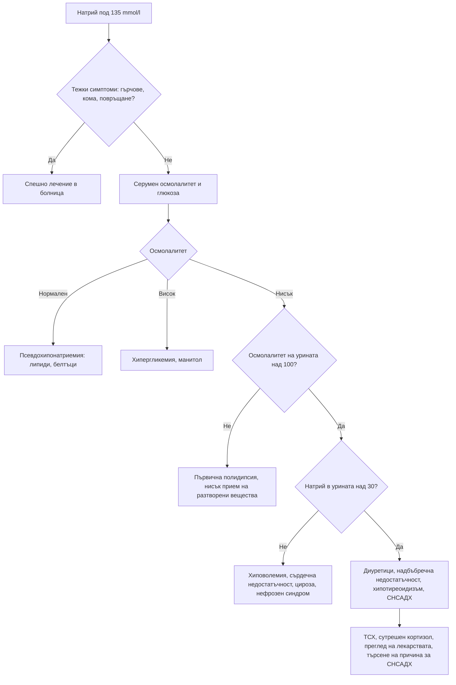

# Глава 30. Електролитни нарушения

> **Част VI. Бъбреци, пикочни пътища и вътрешна среда**

## Цели на главата

- Да се прилага стъпаловиден подход към хипонатриемията чрез осмолалитета на серума, осмолалитета на урината и натрия в урината.
- Да се изброяват причините за хипернатриемия, хипо- и хиперкалиемия.
- Да се разпознава псевдохиперкалиемията.
- Да се разграничава ПТХ-зависимата от ПТХ-независимата хиперкалциемия.
- Да се изброяват причините за нарушения на магнезия и фосфатите и да се разпознава синдромът на възобновено хранене.

## Ключови моменти

- Хипонатриемията се изяснява стъпаловидно: серумен осмолалитет, осмолалитет на урината (прагът е 100 mOsm/kg) и натрий в урината (прагът е 30 mmol/l). Клиничната оценка на обема е ненадеждна *(SORT B [1])*.
- Тиазидите и SSRI са най-честите лекарствени причини за хипонатриемия в общата практика. Хроничната хипонатриемия се коригира с не повече от 8–10 mmol/l за 24 часа *(SORT C [1])*.
- Преди лечение на изолирана хиперкалиемия се изключва псевдохиперкалиемия. Калий 6,5 mmol/l или повече или промени в ЕКГ налагат спешно лечение в болница *(SORT C [3])*.
- Рефрактерната хипокалиемия и хипокалциемия изискват изследване и корекция на магнезия.
- Хиперкалциемията се разделя на ПТХ-зависима (най-често първичен хиперпаратиреоидизъм) и ПТХ-независима (злокачествени заболявания, миелом, витамин D, грануломи) *(SORT C [4])*.
- Хипонатриемия с хиперкалиемия и хипотония е надбъбречна криза до доказване на противното. При недохранен пациент, който започва да се храни, се следят фосфатите, калият и магнезият [5].

---

## А. Натрий

### 1. Хипонатриемия

#### 1.1. Определение и тежест [1]

*Таблица 30.1. Хипонатриемия: определение и тежест.*

| Тежест | Натрий (mmol/l) |
|---|---|
| Лека | 130–134 |
| Умерена | 125–129 |
| Тежка | < 125 |

Остра е хипонатриемията, развила се за под 48 часа. Тя е по-опасна поради мозъчния оток. Хроничната хипонатриемия (над 48 часа или с неизвестна давност) е по-честа в общата практика. Дори „леката“ хронична хипонатриемия при възрастни хора води до нарушения на походката, падания, фрактури и когнитивни нарушения.

**Симптоми:** гадене, главоболие, умора, объркване, нестабилност, падания, повръщане, гърчове, кома.

#### 1.2. Стъпаловиден подход

**Стъпка 1. Серумен осмолалитет** (нормален 275–295 mOsm/kg):

- **нормален** – **псевдохипонатриемия** (тежка хиперлипидемия, парапротеинемия) или изотонични разтвори;
- **висок** – **хипергликемия** (натрият се понижава с около 2,4 mmol/l на всеки 5,6 mmol/l глюкоза над нормата [2]), манитол;
- **нисък** (хипотонична хипонатриемия) – продължава се към стъпка 2.

**Стъпка 2. Осмолалитет на урината:**

- **< 100 mOsm/kg** – ADH е потиснат: **първична полидипсия**, „потомания на бирата“, диета „чай и препечени филийки“ (нисък прием на разтворени вещества);
- **> 100 mOsm/kg** – ADH е активен: продължава се към стъпка 3.

**Стъпка 3. Натрий в урината:**

- **< 30 mmol/l** – намален ефективен артериален обем: хиповолемия (повръщане, диария, загуба в „трето пространство“), сърдечна недостатъчност, цироза, нефрозен синдром;
- **> 30 mmol/l** – синдром на неадекватна секреция на ADH (СНСАДХ), диуретици (особено тиазидни), надбъбречна недостатъчност, тежък хипотиреоидизъм, бъбречна загуба на сол, церебрална загуба на сол.

Клиничната оценка на обема е ненадеждна. Решаващи са лабораторните показатели [1].

#### 1.3. Синдром на неадекватна секреция на ADH

**Критерии:**

- хипотонична хипонатриемия;
- осмолалитет на урината > 100 mOsm/kg;
- натрий в урината > 30 mmol/l при нормален прием на сол;
- клинична еуволемия;
- нормална функция на щитовидната жлеза и надбъбреците;
- липса на скорошен прием на диуретици.

*Таблица 30.2. Синдром на неадекватна секреция на ADH: причини.*

| Група | Причини |
|---|---|
| Централна нервна система | Инсулт, кръвоизлив, травма, менингит, енцефалит, тумори |
| Белодробни | Пневмония (особено легионелоза), туберкулоза, дребноклетъчен карцином на белия дроб |
| **Лекарства** | SSRI, карбамазепин и окскарбазепин, антипсихотици, циклофосфамид, винкристин, опиоиди, MDMA („екстази“), десмопресин |
| Други | Болка, гадене, следоперативен период, HIV, продължително физическо натоварване („хипонатриемия на маратонците“) |

**Тиазидните диуретици** са най-честата причина за хипонатриемия в общата практика, особено при възрастни жени с ниско тегло. Съчетанието на тиазид и SSRI е особено рисково.

**Корекция.** Натрият не бива да се повишава с повече от 8–10 mmol/l за 24 часа поради риск от осмотичен демиелинизиращ синдром [1]. Рискът е особено висок при алкохолизъм, недохранване, хипокалиемия и чернодробно заболяване.

### 2. Хипернатриемия

Хипернатриемията почти винаги означава нарушен достъп до вода или нарушена жажда. Застрашени са възрастни хора с деменция, кърмачета и пациенти с нарушено съзнание.

*Таблица 30.3. Причини за хипернатриемия.*

| Механизъм | Причини |
|---|---|
| **Загуба на вода** | Треска, изгаряния, изпотяване; осмотична диария; осмотична диуреза (хипергликемия); безвкусен диабет – централен или нефрогенен (литий, хиперкалциемия, хипокалиемия) |
| **Недостатъчен прием** | Деменция, обездвижване, нарушена жажда, кърмачета |
| **Прием на натрий** | Хипертонични разтвори, натриев бикарбонат, прием на сол |

---

## Б. Калий

### 3. Хипокалиемия

**Симптоми:** мускулна слабост, крампи, запек, полиурия; при тежка хипокалиемия – рабдомиолиза, парализа, аритмии. **ЕКГ:** сплескани T-зъбци, U-вълни, удължен QU интервал, ST-депресия.

*Таблица 30.4. Причини за хипокалиемия.*

| Механизъм | Причини |
|---|---|
| **Преразпределение в клетките** | Инсулин, бета-агонисти (салбутамол), алкалоза, тиреотоксична периодична парализа, синдром на възобновено хранене |
| **Стомашно-чревна загуба** | Диария, слабителни, фистули; повръщането води до загуба главно през бъбреците чрез метаболитна алкалоза |
| **Бъбречна загуба** | Диуретици, първичен алдостеронизъм, синдром на Cushing, женско биле, синдроми на Bartter и Gitelman, бъбречна тубулна ацидоза тип 1 и 2, хипомагнезиемия, лечение на диабетна кетоацидоза, амфотерицин |
| **Недостатъчен прием** | Рядко самостоятелна причина (алкохолизъм, анорексия) |

**Подход:**

1. **Калий в урината.** Под 20 mmol/24 h (или съотношение калий/креатинин в урината под 1,5 mmol/mmol) насочва към извънбъбречна загуба или преразпределение. По-високи стойности означават бъбречна загуба.
2. **При бъбречна загуба – АН и киселинно-алкално състояние:**
   - **хипертония** – първичен алдостеронизъм, синдром на Cushing, реноваскуларна хипертония, женско биле, синдром на Liddle;
   - **нормотония с метаболитна алкалоза** – диуретици, повръщане (нисък хлор в урината), синдроми на Bartter и Gitelman;
   - **метаболитна ацидоза** – бъбречна тубулна ацидоза, диабетна кетоацидоза.
3. **Винаги изследвайте магнезия.** Хипокалиемията е рефрактерна, докато не се коригира хипомагнезиемията.

### 4. Хиперкалиемия

#### 4.1. Първо изключете псевдохиперкалиемия

Причини за фалшиво висок калий:

- хемолиза в пробата;
- продължително стискане на юмрука, пристягане на турникета;
- забавено центрофугиране, съхранение в хладилник;
- тромбоцитоза и левкоцитоза (калият в плазмата е нормален);
- замърсяване с K₂EDTA при неправилна последователност на епруветките.

Честа находка в общата практика поради транспортирането на пробите. При съмнение изследването се **повтаря незабавно** в правилно взета проба, но само ако няма промени в ЕКГ и клинични рискове.

#### 4.2. Причини

*Таблица 30.5. Хиперкалиемия: причини.*

| Механизъм | Причини |
|---|---|
| **Намалена екскреция** | ОБУ и ХБЗ; лекарства: АСЕ инхибитори и сартани, спиронолактон и еплеренон, амилорид, триметоприм, НСПВС, хепарин, калциневринови инхибитори; хипоалдостеронизъм (болест на Addison, бъбречна тубулна ацидоза тип 4 при диабет) |
| **Излизане от клетките** | Ацидоза, инсулинов дефицит (диабетна кетоацидоза), бета-блокери, дигоксинова токсичност, сукцинилхолин |
| **Разпад на тъкани** | Рабдомиолиза, синдром на туморния лизис, хемолиза, масивно кървене в храносмилателния тракт |
| **Прием** | Калиеви добавки, заместители на готварската сол (с калиев хлорид) – опасни при бъбречна недостатъчност |

#### 4.3. ЕКГ промени (с нарастване на тежестта)

1. Високи, заострени T-зъбци.
2. Удължен PR интервал, сплескани P-вълни.
3. Разширен QRS комплекс.
4. Синусоидален образ, брадиаритмии, камерно мъждене, асистолия.

**Калий ≥ 6,5 mmol/l или промени в ЕКГ изискват спешно лечение в болница** [3]. ЕКГ не е чувствителен показател. Животозастрашаващи аритмии могат да настъпят и без предшестващи промени.

---

## В. Калций

Коригиран калций (mmol/l) = измерен калций + 0,02 × (40 − албумин в g/l). При съмнение се изследва йонизиран калций.

### 5. Хиперкалциемия

**Симптоми** („камъни, кости, стенания и психични отклонения“): жажда, полиурия, дехидратация, бъбречни камъни, болки в костите, запек, гадене, коремна болка, панкреатит, пептична язва, умора, депресия, объркване, скъсен QT интервал.

*Таблица 30.6. Тежест на хиперкалциемията.*

| Тежест | Коригиран калций (mmol/l) |
|---|---|
| Лека | 2,6–3,0 |
| Умерена | 3,0–3,5 |
| Тежка | > 3,5 (спешно състояние) |

*Таблица 30.7. Причини за хиперкалциемия.*

| Група | Причини | ПТХ |
|---|---|---|
| **ПТХ-зависими** | Първичен хиперпаратиреоидизъм (най-честата причина в извънболничната практика; често безсимптомен), третичен хиперпаратиреоидизъм (при ХБЗ), литий, фамилна хипокалциурична хиперкалциемия (съотношение на клирънса калций/креатинин < 0,01) | Повишен или неадекватно нормален |
| **ПТХ-независими** | Злокачествени заболявания (най-честата причина при хоспитализирани пациенти): ПТХ-свързан пептид (плоскоклетъчни карциноми), остеолитични метастази, мултиплен миелом, калцитриол (лимфоми); интоксикация с витамин D; грануломатозни заболявания (саркоидоза, туберкулоза); лекарства (тиазиди, калций и антиациди – калциево-алкален синдром, витамин A); хипертиреоидизъм; обездвижване; надбъбречна недостатъчност | Потиснат |

**Изследвания** [4]: ПТХ, 25-OH витамин D, фосфати, креатинин, алкална фосфатаза, електрофореза и свободни леки вериги, рентгенография на гръден кош, ТСХ, калций в урината. При показания: ПТХ-свързан пептид, 1,25-(OH)₂ витамин D, ангиотензин-конвертиращ ензим.

### 6. Хипокалциемия

**Симптоми:** изтръпване около устата и на пръстите, мускулни крампи, тетания, белези на Chvostek (потрепване на лицето при почукване пред ухото) и Trousseau (карпален спазъм при надуване на маншета над систолното налягане), ларингоспазъм, гърчове, удължен QT интервал.

**Причини:**

- **дефицит на витамин D**;
- **хипопаратиреоидизъм** (след тиреоидектомия или паратиреоидектомия, автоимунен);
- **хипомагнезиемия** (нарушава секрецията и действието на ПТХ);
- ХБЗ;
- остър панкреатит, рабдомиолиза, синдром на туморния лизис;
- синдром на „гладните кости“ след паратиреоидектомия;
- **лекарства**: бисфосфонати, **деносумаб** (особено при дефицит на витамин D или ХБЗ), цинакалцет, фоскарнет, ИПП (чрез хипомагнезиемия);
- псевдохипопаратиреоидизъм;
- масивни кръвопреливания (цитрат).

---

## Г. Магнезий и фосфати

### 7. Хипомагнезиемия

- **Причини:** стомашно-чревни загуби (диария), продължителна употреба на ИПП, диуретици, алкохол, захарен диабет, лекарства (аминогликозиди, цисплатин, амфотерицин, калциневринови инхибитори), синдром на възобновено хранене.
- **Последици:** рефрактерна хипокалиемия и хипокалциемия, аритмии (torsades de pointes), тремор, гърчове.

### 8. Хипофосфатемия

- **Причини:**
  - **синдром на възобновено хранене** (при недохранени пациенти, алкохолици, след продължително гладуване) [5];
  - алкохол;
  - лечение на диабетна кетоацидоза;
  - респираторна алкалоза;
  - хиперпаратиреоидизъм, дефицит на витамин D;
  - фосфат-свързващи средства и антиациди;
  - **интравенозно желязо** (особено фери карбоксималтоза – чрез повишаване на FGF23) [6];
  - синдром на Fanconi.
- **Последици:** мускулна слабост, рабдомиолиза, дихателна недостатъчност, хемолиза, объркване, сърдечна недостатъчност.

### 9. Хиперфосфатемия

ХБЗ, синдром на туморния лизис, рабдомиолиза, хипопаратиреоидизъм, **фосфатни клизми** (при възрастни хора и при бъбречна недостатъчност), интоксикация с витамин D.

---

## 10. Безопасна диагностична стратегия

*Таблица 30.8. Безопасна диагностична стратегия.*

| Въпрос | Отговор |
|---|---|
| **Вероятна диагноза** | Лекарствени нарушения (тиазиди, SSRI, АСЕ инхибитори, диуретици), дехидратация, ХБЗ, първичен хиперпаратиреоидизъм |
| **Сериозни заболявания, които не бива да се пропускат** | Тежка хипонатриемия с неврологични симптоми; хиперкалиемия ≥ 6,5 mmol/l; тежка хиперкалциемия при злокачествено заболяване или миелом; надбъбречна недостатъчност (хипонатриемия + хиперкалиемия); синдром на възобновено хранене; дребноклетъчен карцином на белия дроб (СНСАДХ) |
| **Чести капани** | Псевдохиперкалиемия; псевдохипонатриемия при хиперлипидемия и парапротеинемия; хипергликемия; хипомагнезиемия като причина за рефрактерна хипокалиемия и хипокалциемия; заместители на солта; тиреотоксична периодична парализа |
| **Маскиращи заболявания** | Лекарства, захарен диабет, хипотиреоидизъм, надбъбречна недостатъчност, злокачествени заболявания |
| **Психосоциални аспекти** | Психогенна полидипсия, хранителни разстройства (булимия – хипокалиемия), злоупотреба с диуретици и слабителни, алкохолизъм |

---

## 11. Алгоритъм при хипонатриемия

*Фигура 30.1. Алгоритъм при хипонатриемия. Схема на авторите въз основа на източниците, цитирани в главата.*

Текстово описание на фигура 30.1

1. Натрий под 135 mmol/l. Следва: към т. 2.
2. **Въпрос:** Тежки симптоми: гърчове, кома, повръщане? Да – към т. 3; Не – към т. 4.
3. Спешно лечение в болница.
4. Серумен осмолалитет и глюкоза. Следва: към т. 5.
5. **Въпрос:** Осмолалитет Нормален – към т. 6; Висок – към т. 7; Нисък – към т. 8.
6. Псевдохипонатриемия: липиди, белтъци.
7. Хипергликемия, манитол.
8. **Въпрос:** Осмолалитет на урината над 100? Не – към т. 9; Да – към т. 10.
9. Първична полидипсия, нисък прием на разтворени вещества.
10. **Въпрос:** Натрий в урината над 30? Не – към т. 11; Да – към т. 12.
11. Хиповолемия, сърдечна недостатъчност, цироза, нефрозен синдром.
12. Диуретици, надбъбречна недостатъчност, хипотиреоидизъм, СНСАДХ. Следва: към т. 13.
13. ТСХ, сутрешен кортизол, преглед на лекарствата, търсене на причина за СНСАДХ.

---

## 12. Червени флагове и насочване

### 12.1. Червени флагове

- Натрий под 125 mmol/l или остра хипонатриемия с неврологични симптоми (объркване, повръщане, гърчове).
- Калий 6,5 mmol/l или повече или промени в ЕКГ.
- Калий под 2,5 mmol/l, мускулна слабост, парализа или аритмия.
- Коригиран калций над 3,5 mmol/l или хиперкалциемия с объркване, дехидратация или ОБУ.
- Хипокалциемия с тетания, ларингоспазъм, гърчове или удължен QT.
- Хипонатриемия с хиперкалиемия и хипотония (надбъбречна криза).
- Недохранен пациент, който започва да се храни (синдром на възобновено хранене).

### 12.2. Кога и колко спешно да насочим

*Таблица 30.9. Кога и колко спешно да насочим.*

| Спешност | Клинична ситуация |
|---|---|
| **Незабавно (112 или спешно отделение)** | Хипонатриемия с тежки неврологични симптоми; калий 6,5 mmol/l или повече или промени в ЕКГ [3]; калий под 2,5 mmol/l с аритмия или слабост; тежка или симптоматична хиперкалциемия; тетания или гърчове при хипокалциемия; подозрение за надбъбречна криза |
| **В същия ден** | Натрий под 125 mmol/l без тежки симптоми; калий 6,0–6,4 mmol/l без промени в ЕКГ (повторно изследване и оценка); коригиран калций 3,0–3,5 mmol/l; хипофосфатемия при възобновено хранене |
| **Бързо (до 2 седмици)** | Хиперкалциемия с потиснат ПТХ (търсене на злокачествено заболяване или миелом); СНСАДХ без ясна причина (рентгенография на гръден кош за карцином на белия дроб) |
| **Планово** | Първичен хиперпаратиреоидизъм; хипокалиемия с хипертония (скрининг за първичен алдостеронизъм); хронична лека хипонатриемия с неясна причина |
| **Проследяване в общата практика** | Лека лекарствена хипонатриемия след смяна на лекарството; потвърдена псевдохиперкалиемия; дефицит на витамин D |

---

## 13. Клинични перли

- Хипонатриемия + хиперкалиемия + хипотония: надбъбречна недостатъчност. Изследвайте кортизол и не забавяйте лечението при съмнение за криза.
- Възрастна жена на тиазид и SSRI, която пада: изследвайте натрия.
- Изолирана хиперкалиемия при пациент без бъбречно заболяване и без лекарства, задържащи калий: повторете изследването в правилно взета проба и проверете за тромбоцитоза.
- Хипокалиемия, която не се коригира: изследвайте и коригирайте магнезия.
- Хипокалиемия и хипертония: първичен алдостеронизъм.
- Хиперкалциемия с потиснат ПТХ: търсете злокачествено заболяване и миелом.
- Хипофосфатемия след интравенозно желязо е чест и недооценен страничен ефект.
- Недохранен пациент, който започва да се храни: следете фосфатите, калия и магнезия (синдром на възобновено хранене).

---

## 14. Клиничен случай

**Етап 1 – представяне.** Жена на 79 години, 52 kg, се лекува с индапамид за хипертония. Преди 6 седмици е започнала сертралин за депресия. Пие много чай и яде малко. Дъщеря ѝ съобщава за нарастващо объркване, нестабилна походка и две падания за седмица.

> **Въпрос 1.** Кое изследване трябва да се направи първо и защо?

**Етап 2 – изследвания.** Натрий 118 mmol/l, калий 3,2 mmol/l, серумен осмолалитет 248 mOsm/kg, осмолалитет на урината 320 mOsm/kg, натрий в урината 48 mmol/l. ТСХ и сутрешният кортизол са нормални.

> **Въпрос 2.** Какви са механизмите на хипонатриемията?

> **Въпрос 3.** Какви са рисковете при лечението?

Обсъждане и отговори

**Отговор 1.** Натрият (с калий, креатинин и глюкоза). При възрастен пациент с падания и объркване, който приема тиазид и SSRI, хипонатриемията е много вероятна.

**Отговор 2.** Хипонатриемията е хипотонична, с неадекватно концентрирана урина (над 100 mOsm/kg) и висок натрий в урината (над 30 mmol/l) [1]. Причините са няколко: тиазидоподобният диуретик (индапамид), SSRI (СНСАДХ) и ниският прием на разтворени вещества при относително голям прием на вода. Възрастта, женският пол и ниското тегло са допълнителни рискови фактори.

**Отговор 3.** Натрият под 120 mmol/l с неврологични симптоми изисква хоспитализация. Хипонатриемията е хронична, затова натрият трябва да се повишава бавно, **с не повече от 8–10 mmol/l за 24 часа**, поради риска от осмотичен демиелинизиращ синдром [1]. Особено внимание е нужно при спиране на диуретика, защото това води до спонтанна водна диуреза и опасно бърза корекция.

**Поука.** При възрастен пациент с падания и объркване изследвайте натрия. Проверете всички лекарства, които може да причиняват хипонатриемия.

---

## Визуални примери

Учебникът не съдържа собствени изображения. Типичните находки могат да се видят в свободно достъпни атласи (връзките са проверени през септември 2026 г.):

- ЕКГ при хиперкалиемия – [LITFL ECG Library](https://litfl.com/hyperkalaemia-ecg-library/)
- ЕКГ при хипокалиемия – [LITFL ECG Library](https://litfl.com/hypokalaemia-ecg-library/)
- ЕКГ при хиперкалциемия – [LITFL ECG Library](https://litfl.com/hypercalcaemia-ecg-library/)

---

## Обобщение

- Хипонатриемията се изяснява стъпаловидно по осмолалитета и натрия в урината. Честите причини са лекарствата, хиповолемията, сърдечната недостатъчност, цирозата и СНСАДХ.
- Хипокалиемията се дължи на преразпределение, стомашно-чревна или бъбречна загуба. Хиперкалиемията изисква първо изключване на псевдохиперкалиемия и оценка на ЕКГ.
- Хиперкалциемията се разграничава по ПТХ на ПТХ-зависима и ПТХ-независима. Хипокалциемията най-често се дължи на дефицит на витамин D, хипопаратиреоидизъм или хипомагнезиемия.
- Магнезият и фосфатите са често пропускани. Синдромът на възобновено хранене и хипофосфатемията след интравенозно желязо са важни капани.

## Самопроверка

### Въпроси с един верен отговор

**1.** *(основно ниво)* При профилактичен преглед на мъж на 50 години без бъбречно заболяване и без лекарства калият е 6,3 mmol/l. Тромбоцитите са 850 × 10⁹/l, а ЕКГ е нормална. Кое е най-вероятното обяснение?

- **А.** Остро бъбречно увреждане
- **Б.** Псевдохиперкалиемия от тромбоцитоза
- **В.** Болест на Addison
- **Г.** Рабдомиолиза
- **Д.** Прием на калиеви добавки

Отговор и обосновка

**Верен отговор: Б.** При тромбоцитоза калият излиза от тромбоцитите при съсирването на пробата, а калият в плазмата е нормален. Изследването се повтаря в правилно взета проба (включително плазмен калий). А, В, Г и Д не се подкрепят от данните.

**2.** *(основно ниво)* Пациент с декомпенсиран диабет има натрий 128 mmol/l и глюкоза 33 mmol/l. Кое е вярно?

- **А.** Това е хипотонична хипонатриемия от СНСАДХ
- **Б.** След корекция за глюкозата натрият е около 140 mmol/l; хипонатриемията се дължи на хипергликемията
- **В.** Нужна е хипертонична сол
- **Г.** Това е псевдохипонатриемия от хиперлипидемия
- **Д.** Хипонатриемията се дължи на тиазид

Отговор и обосновка

**Верен отговор: Б.** Натрият се понижава с около 2,4 mmol/l на всеки 5,6 mmol/l глюкоза над нормата [2]. 128 + 2,4 × (33 − 5,6) / 5,6 ≈ 128 + 11,7 ≈ 140 mmol/l. Хипонатриемията е хипертонична и се коригира с лечението на хипергликемията.

**3.** *(основно ниво)* Пациент на диуретик има хипокалиемия, която не се коригира въпреки калиевите добавки. Кое изследване е най-важно?

- **А.** ТСХ
- **Б.** Магнезий
- **В.** Кортизол
- **Г.** Ренин
- **Д.** Калций

Отговор и обосновка

**Верен отговор: Б.** Хипомагнезиемията увеличава бъбречната загуба на калий и прави хипокалиемията рефрактерна, докато не се коригира.

**4.** *(напреднало ниво)* Мъж на 68 години има коригиран калций 3,2 mmol/l, потиснат ПТХ, анемия, болки в гърба и повишен общ белтък. Кое изследване е най-подходящо?

- **А.** Сцинтиграфия на паращитовидните жлези
- **Б.** Електрофореза и имунофиксация на серумните белтъци и свободни леки вериги
- **В.** 1,25-(OH)₂ витамин D само
- **Г.** Калций в урината за фамилна хипокалциурична хиперкалциемия
- **Д.** Повторно изследване след 3 месеца

Отговор и обосновка

**Верен отговор: Б.** Хиперкалциемията с потиснат ПТХ е ПТХ-независима [4]. Анемията, болките в гърба и повишеният белтък насочват към мултиплен миелом. А и Г са за ПТХ-зависима хиперкалциемия. Д забавя диагнозата.

**5.** *(напреднало ниво)* Жена на 45 години има умора, хиперпигментация, АН 84/50 mmHg, натрий 124 mmol/l и калий 6,1 mmol/l. Кое е правилното поведение?

- **А.** Флудрокортизон и контрол след седмица
- **Б.** Изследване на кортизол и ACTH и незабавно насочване за парентерален хидрокортизон без изчакване на резултата
- **В.** Ограничаване на течностите
- **Г.** Калиев свързващ агент и контрол
- **Д.** Тиазиден диуретик

Отговор и обосновка

**Верен отговор: Б.** Хипонатриемия, хиперкалиемия, хипотония и хиперпигментация насочват към първична надбъбречна недостатъчност с надвиснала криза. Кръвта за кортизол и ACTH се взема, но лечението с хидрокортизон не се отлага. А и Г са недостатъчни. В и Д са опасни.

### Задача

При жена на 72 години измереният калций е 2,45 mmol/l, а албуминът – 28 g/l. Изчислете коригирания калций и го интерпретирайте. Какви изследвания следват?

Решение

Коригиран калций = 2,45 + 0,02 × (40 − 28) = 2,45 + 0,24 = 2,69 mmol/l. Това е лека хиперкалциемия (2,6–3,0 mmol/l), скрита от ниския албумин. При съмнение се изследва йонизиран калций. Следват ПТХ, 25-OH витамин D, фосфати, креатинин и алкална фосфатаза [4]. При повишен или неадекватно нормален ПТХ най-вероятен е първичният хиперпаратиреоидизъм. При потиснат ПТХ се търсят злокачествено заболяване (включително миелом), интоксикация с витамин D и грануломатозни заболявания. Преглеждат се лекарствата (тиазиди, калций, витамин D, литий).

### OSCE станция: Стъпаловидно тълкуване на хипонатриемия

**Време:** 8 минути. **Ниво:** напреднало (специализанти).

**Задача за кандидата.** Тълкувайте резултатите на мъж на 64 години, пушач, с хипонатриемия и предложете поведение.

**Информация за симулирания пациент (за изпитващия).** Натрий 126 mmol/l, глюкоза и липиди – нормални. Серумен осмолалитет 262 mOsm/kg, осмолалитет на урината 410 mOsm/kg, натрий в урината 55 mmol/l. Клинично е еуволемичен. Не приема диуретици. ТСХ и сутрешният кортизол са нормални. Има кашлица от 2 месеца и е отслабнал с 5 kg.

*Таблица 30.10. OSCE станция „Стъпаловидно тълкуване на хипонатриемия“ – критерии за оценяване.*

| Критерий | Точки |
|---|---|
| Потвърждава хипотоничната хипонатриемия и изключва псевдо- и хипертонична хипонатриемия | 2 |
| Тълкува осмолалитета на урината над 100 mOsm/kg като активен ADH | 1 |
| Тълкува натрия в урината над 30 mmol/l при еуволемия и без диуретици | 1 |
| Проверява нормалната функция на щитовидната жлеза и надбъбреците | 1 |
| Поставя диагнозата СНСАДХ | 1 |
| Разпознава червените флагове за дребноклетъчен карцином на белия дроб (пушач, кашлица, загуба на тегло) | 2 |
| Предлага рентгенография на гръден кош и бързо насочване при подозрение за карцином | 2 |
| Посочва безопасния темп на корекция (не повече от 8–10 mmol/l за 24 часа) | 1 |
| **Общо** | **11** |

**Праг за успешно изпълнение:** 8 от 11 точки, включително стъпаловидното тълкуване и търсенето на причина.

## Литература

1. Spasovski G, Vanholder R, Allolio B, Annane D, Ball S, Bichet D, et al. Clinical practice guideline on diagnosis and treatment of hyponatraemia. Eur J Endocrinol. 2014;170(3):G1-47. doi:10.1530/EJE-13-1020. PMID: 24569125.
2. Hillier TA, Abbott RD, Barrett EJ. Hyponatremia: evaluating the correction factor for hyperglycemia. Am J Med. 1999;106(4):399-403. doi:10.1016/s0002-9343(99)00055-8. PMID: 10225241.
3. Lott C, Truhlář A, Alfonzo A, Barelli A, González-Salvado V, Hinkelbein J, et al. European Resuscitation Council Guidelines 2021: Cardiac arrest in special circumstances. Resuscitation. 2021;161:152-219. doi:10.1016/j.resuscitation.2021.02.011. PMID: 33773826.
4. Walker MD, Shane E. Hypercalcemia: A Review. JAMA. 2022;328(16):1624-1636. doi:10.1001/jama.2022.18331. PMID: 36282253.
5. da Silva JSV, Seres DS, Sabino K, Adams SC, Berdahl GJ, Citty SW, et al. ASPEN Consensus Recommendations for Refeeding Syndrome. Nutr Clin Pract. 2020;35(2):178-195. doi:10.1002/ncp.10474. PMID: 32115791.
6. Wolf M, Rubin J, Achebe M, Econs MJ, Peacock M, Imel EA, et al. Effects of Iron Isomaltoside vs Ferric Carboxymaltose on Hypophosphatemia in Iron-Deficiency Anemia: Two Randomized Clinical Trials. JAMA. 2020;323(5):432-443. doi:10.1001/jama.2019.22450. PMID: 32016310.

*Последна проверка на съдържанието: септември 2026 г. Следващ планиран преглед: септември 2027 г. (вж. „Политика за актуализация“ в README).*

<!-- навигация -->

---

[← Глава 29. Остро и хронично бъбречно увреждане](29-babrechno-uvrezhdane.md) · [Съдържание](../README.md) · [Глава 31. Киселинно-алкални нарушения →](31-kiselinno-alkalni.md)
