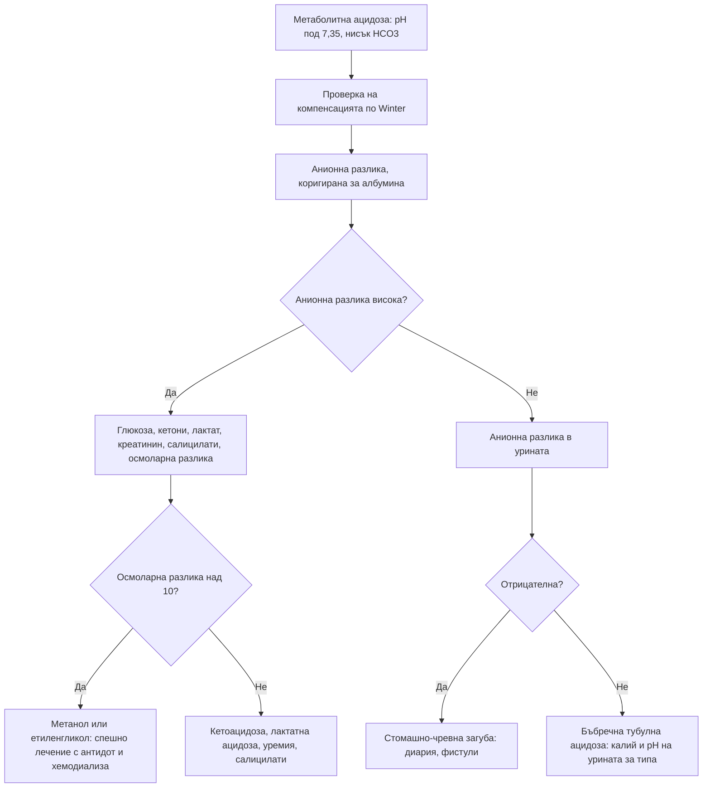

# Глава 31. Киселинно-алкални нарушения

> **Част VI. Бъбреци, пикочни пътища и вътрешна среда**

## Цели на главата

- Да се тълкуват кръвно-газовите резултати по стъпаловиден подход.
- Да се изчисляват анионната разлика, очакваната компенсация, делта-съотношението и осмоларната разлика.
- Да се познават причините за метаболитна ацидоза с висока и с нормална анионна разлика.
- Да се разграничават хлор-чувствителната и хлор-резистентната метаболитна алкалоза.
- Да се разпознават смесените нарушения и токсичните причини (метанол, етиленгликол, салицилати).

---

## 1. Нормални стойности

| Показател | Нормални стойности |
|---|---|
| pH | 7,35–7,45 |
| pCO₂ | 35–45 mmHg (4,7–6,0 kPa) |
| HCO₃⁻ | 22–26 mmol/l |
| Базов излишък | −2 до +2 mmol/l |
| Анионна разлика (Na⁺ − [Cl⁻ + HCO₃⁻]) | ≈ 8–12 mmol/l (зависи от лабораторията) |
| Лактат | < 2 mmol/l |

**Корекция на анионната разлика за албумина:** коригирана анионна разлика = измерена + 0,25 × (40 − албумин в g/l). При хипоалбуминемия „нормалната“ анионна разлика може да скрие метаболитна ацидоза с висока анионна разлика.

**Венозни кръвни газове.** За pH, HCO₃⁻, лактат и калий те са достатъчни. Венозното pCO₂ е с около 5–8 mmHg по-високо от артериалното. За оксигенацията се използват артериални газове или пулсова оксиметрия.

---

## 2. Стъпаловиден подход

1. **pH:** ацидемия (< 7,35) или алкалемия (> 7,45)?
2. **Първично нарушение:**
   - ацидемия с нисък HCO₃⁻ — метаболитна ацидоза;
   - ацидемия с висок pCO₂ — респираторна ацидоза;
   - алкалемия с висок HCO₃⁻ — метаболитна алкалоза;
   - алкалемия с нисък pCO₂ — респираторна алкалоза.
3. **Адекватна ли е компенсацията?**

| Първично нарушение | Очаквана компенсация |
|---|---|
| Метаболитна ацидоза | pCO₂ (mmHg) = 1,5 × HCO₃⁻ + 8 ± 2 (**формула на Winter**) |
| Метаболитна алкалоза | pCO₂ се повишава с около 0,7 mmHg на всеки 1 mmol/l повишение на HCO₃⁻ |
| Остра респираторна ацидоза | HCO₃⁻ се повишава с 1 mmol/l на всеки 10 mmHg pCO₂ |
| Хронична респираторна ацидоза | HCO₃⁻ се повишава с 3,5 mmol/l на всеки 10 mmHg pCO₂ |
| Остра респираторна алкалоза | HCO₃⁻ спада с 2 mmol/l на всеки 10 mmHg pCO₂ |
| Хронична респираторна алкалоза | HCO₃⁻ спада с 5 mmol/l на всеки 10 mmHg pCO₂ |

   Ако компенсацията се различава от очакваната, съществува **второ, съпътстващо нарушение**. Компенсацията никога не връща pH до нормата и никога не го „надминава“.

4. **Анионна разлика** (при всяка метаболитна ацидоза, а и при всеки кръвно-газов анализ).
5. **Делта-съотношение** при висока анионна разлика: (анионна разлика − 12) / (24 − HCO₃⁻).
   - < 0,4 — ацидоза с нормална анионна разлика;
   - 0,4–0,8 — съчетание на ацидоза с висока и ацидоза с нормална анионна разлика;
   - 0,8–2 — чиста ацидоза с висока анионна разлика;
   - > 2 — ацидоза с висока анионна разлика и съпътстваща метаболитна алкалоза (или предшестваща компенсирана респираторна ацидоза).
6. **Осмоларна разлика** при необяснима ацидоза с висока анионна разлика: измерен осмолалитет − изчислен (2 × Na⁺ + глюкоза + урея, в mmol/l). Разлика **> 10** насочва към токсични алкохоли.

---

## 3. Метаболитна ацидоза с висока анионна разлика

Причините се запомнят с мнемониката **GOLDMARK**:

| Буква | Причина | Насочващи белези |
|---|---|---|
| **G** | Гликоли (етиленгликол, пропиленгликол) | Антифриз; объркване, **оксалатни кристали** в урината, ОБУ; висока осмоларна разлика |
| **O** | 5-оксопролин (пироглутаминова киселина) | Хроничен прием на парацетамол при недохранени пациенти, особено жени |
| **L** | L-лактат | **Шок, сепсис**, исхемия (мезентериална!), гърчове, чернодробна недостатъчност, **метформин** (особено при ОБУ), тиаминов дефицит, отравяне с цианиди и въглероден оксид |
| **D** | D-лактат | Синдром на късото черво; епизоди на объркване след въглехидратна храна |
| **M** | **Метанол** | Нелегален или домашно дестилиран алкохол; **зрителни нарушения** („снежна буря“, слепота), коремна болка, висока осмоларна разлика |
| **A** | Аспирин (салицилати) | Шум в ушите, гадене, хипервентилация; смесена респираторна алкалоза и метаболитна ацидоза |
| **R** | Бъбречна недостатъчност (*renal failure*) | Уремия (обикновено при eGFR < 15–20) |
| **K** | **Кетоацидоза** | **Диабетна** (включително **еугликемична** при SGLT2 инхибитори), **алкохолна** (след запой и гладуване, глюкозата често е нормална или ниска), от гладуване |

## 4. Метаболитна ацидоза с нормална анионна разлика (хиперхлоремична)

| Механизъм | Причини |
|---|---|
| **Стомашно-чревна загуба на бикарбонат** | **Диария**, илеостома, фистули на панкреаса и тънкото черво, уретероентеростомия |
| **Бъбречна загуба или нарушена екскреция на киселини** | **Бъбречна тубулна ацидоза** (тип 1, 2, 4), ранно ХБЗ, ацетазоламид, топирамат |
| **Ятрогенна** | **Вливане на големи количества физиологичен разтвор** |
| **Ендокринна** | Надбъбречна недостатъчност (хипоалдостеронизъм) |

**Анионна разлика в урината** (Na⁺ + K⁺ − Cl⁻):

- **отрицателна** — бъбреците отделят амоний нормално, значи загубата е стомашно-чревна;
- **положителна** — бъбречна тубулна ацидоза (дистална).

### 4.1. Бъбречна тубулна ацидоза

| Тип | Механизъм | Калий | pH на урината | Причини и белези |
|---|---|---|---|---|
| **Тип 1 (дистална)** | Нарушена секреция на H⁺ | Нисък | > 5,5 | Синдром на Sjögren, системен лупус еритематодес, амфотерицин, литий; нефрокалциноза, камъни |
| **Тип 2 (проксимална)** | Нарушена реабсорбция на HCO₃⁻ | Нисък | < 5,5 (при тежка ацидоза) | **Синдром на Fanconi** (глюкозурия при нормална глюкоза, фосфатурия, аминоацидурия); миелом, тенофовир, ифосфамид, ацетазоламид |
| **Тип 4** | Хипоалдостеронизъм или резистентност към алдостерон | **Висок** | < 5,5 | **Диабетна нефропатия** (хипоренинемичен хипоалдостеронизъм), АСЕ инхибитори и сартани, НСПВС, триметоприм, хепарин, болест на Addison |

---

## 5. Метаболитна алкалоза

| Тип | Хлор в урината | Причини |
|---|---|---|
| **Хлор-чувствителна** | < 20 mmol/l | **Повръщане**, назогастрална аспирация, **прекратен** прием на диуретици, след хиперкапния, вилозен аденом, загуба на обем |
| **Хлор-резистентна с хипертония** | > 20 mmol/l | **Първичен алдостеронизъм**, синдром на Cushing, реноваскуларна хипертония, **женско биле**, синдром на Liddle |
| **Хлор-резистентна без хипертония** | > 20 mmol/l | **Текущ прием на диуретици**, синдроми на Bartter и Gitelman, тежка хипокалиемия, хипомагнезиемия |
| **Прием на основи** | Различен | Калциево-алкален синдром (калциеви добавки и антиациди), натриев бикарбонат, при нарушена бъбречна функция |

---

## 6. Респираторна ацидоза

| Група | Причини |
|---|---|
| **Потискане на дихателния център** | Опиоиди, бензодиазепини, алкохол, инсулт, травма на главата |
| **Нервно-мускулни заболявания** | Синдром на Guillain-Barré, миастения гравис, амиотрофична латерална склероза, миопатии, тежка хипокалиемия и хипофосфатемия, ботулизъм |
| **Гръдна стена** | Кифосколиоза, **синдром на хиповентилация при затлъстяване**, подвижен гръден кош при травма |
| **Дихателни пътища и бял дроб** | **ХОББ**, тежка астма (в късния стадий), пневмония, белодробен оток, обструкция на горните дихателни пътища |

**Кислородна терапия при ХОББ.** Прекомерното подаване на кислород при пациенти със задържане на CO₂ може да влоши хиперкапнията. Целевата сатурация е 88–92%.

## 7. Респираторна алкалоза

| Група | Причини |
|---|---|
| **Хипоксемия** | Белодробна тромбемболия, пневмония, астма (в ранния стадий), висока надморска височина |
| **Централна стимулация** | Тревожност и хипервентилация, болка, треска, инсулт, менингит, тумори |
| **Лекарства и токсини** | **Салицилати** (в ранния стадий), прогестерон |
| **Системни** | **Сепсис** (в ранния стадий), **чернодробна недостатъчност**, бременност, хипертиреоидизъм |
| **Ятрогенна** | Прекомерна механична вентилация |

**Хипервентилацията поради тревожност** е диагноза, която се поставя след изключване на хипоксемията и метаболитната ацидоза. SpO₂ е нормална, pCO₂ е ниско, а pO₂ е нормално или високо.

---

## 8. Смесени нарушения: типични примери

| Клинична ситуация | Нарушения |
|---|---|
| **Отравяне със салицилати** | Респираторна алкалоза + метаболитна ацидоза с висока анионна разлика |
| **Сепсис** | Лактатна ацидоза + респираторна алкалоза |
| **Диабетна кетоацидоза с повръщане** | Метаболитна ацидоза с висока анионна разлика + метаболитна алкалоза (делта-съотношение > 2) |
| **ХОББ с диуретици** | Респираторна ацидоза + метаболитна алкалоза |
| **Сърдечен арест** | Респираторна ацидоза + лактатна ацидоза |
| **Диария с кетоза от гладуване** | Ацидоза с нормална анионна разлика + ацидоза с висока анионна разлика |

---

## 9. Безопасна диагностична стратегия

| Въпрос | Отговор |
|---|---|
| **Вероятна диагноза** | Диабетна кетоацидоза, лактатна ацидоза при сепсис, диария, повръщане, диуретици, ХОББ |
| **Сериозни заболявания, които не бива да се пропускат** | **Отравяне с метанол и етиленгликол**, салицилати; **мезентериална исхемия** (лактат); сепсис; **еугликемична кетоацидоза** при SGLT2 инхибитори; дихателна недостатъчност при нервно-мускулни заболявания |
| **Чести капани** | „Нормална“ анионна разлика при хипоалбуминемия; алкохолна кетоацидоза с нормална глюкоза; хипервентилация, приета за тревожност, при белодробна тромбемболия или ацидоза; метформин при ОБУ |
| **Маскиращи заболявания** | Лекарства, захарен диабет, бъбречна недостатъчност |
| **Психосоциални аспекти** | Злоупотреба с алкохол, самоотравяне, хранителни разстройства (повръщане, слабителни) |

---

## 10. Диагностичен алгоритъм при метаболитна ацидоза

---

## 11. Клинични перли

- При всеки кръвно-газов анализ изчислявайте анионната разлика и я коригирайте за албумина.
- Неадекватната компенсация означава второ нарушение.
- Метаболитна ацидоза с висока анионна разлика, зрителни нарушения и анамнеза за нелегален алкохол: метанол. Не чакайте нивото. Започнете лечение.
- Кетоацидоза с нормална глюкоза при пациент на SGLT2 инхибитор е реалност (еугликемична кетоацидоза).
- Алкохолната кетоацидоза протича с нормална или ниска глюкоза след запой и повръщане.
- Хипервентилацията „от тревожност“ е диагноза след изключване. Метаболитната ацидоза и белодробната тромбемболия също водят до учестено дишане.
- Повишеният лактат при силна коремна болка с бедна находка е късен, но зловещ белег на мезентериална исхемия.

---

## 12. Клиничен случай

**Случай.** Мъж на 45 години е доведен от семейството си заради объркване, повръщане и коремна болка. Предната вечер е пил домашно произведена ракия, купена от непознат, заедно с двама приятели. Единият от тях е хоспитализиран с „неясно отравяне“. Пациентът съобщава, че „вижда като през мъгла“. Изследвания: pH 7,12, pCO₂ 22 mmHg, HCO₃⁻ 8 mmol/l, Na⁺ 140 mmol/l, Cl⁻ 102 mmol/l, глюкоза 6 mmol/l, урея 5 mmol/l, измерен осмолалитет 330 mOsm/kg. Етанол не се открива, кетоните са следи, лактатът е 3 mmol/l.

**Въпроси.** 1) Какво е киселинно-алкалното нарушение? 2) Каква е вероятната причина?

**Обсъждане.**

- Анионната разлика е 140 − (102 + 8) = **30 mmol/l**, т.е. висока.
- Очакваното pCO₂ по Winter е 1,5 × 8 + 8 = 20 ± 2 mmHg. Компенсацията е адекватна.
- Изчисленият осмолалитет е 2 × 140 + 6 + 5 = 291 mOsm/kg. **Осмоларната разлика е 39 mOsm/kg** — силно повишена.

Ацидоза с висока анионна разлика и висока осмоларна разлика, **зрителни нарушения**, контакт с нелегален алкохол и групово заболяване означават **отравяне с метанол**. Метанолът се метаболизира до мравчена киселина, която уврежда зрителния нерв. Лечението е спешно: **фомепизол** или етанол (блокират алкохолдехидрогеназата), **хемодиализа**, фолиева киселина. Трябва незабавно да се уведомят здравните власти и да се открият другите консуматори.

**Поука.** Осмоларната разлика е прост и бърз ключ към диагнозата на отравянето с токсични алкохоли. Отравянията с метанол от нелегален алкохол продължават да се срещат.
